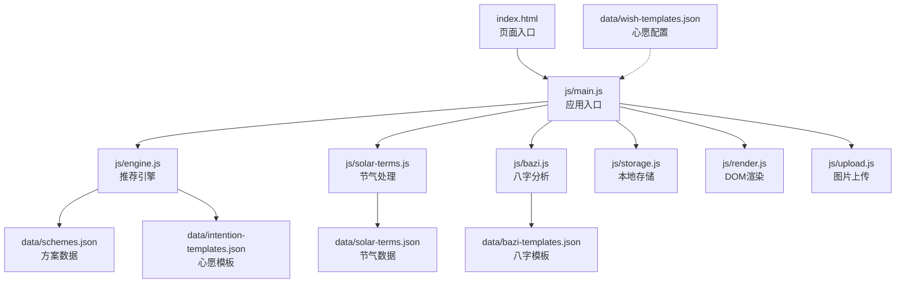
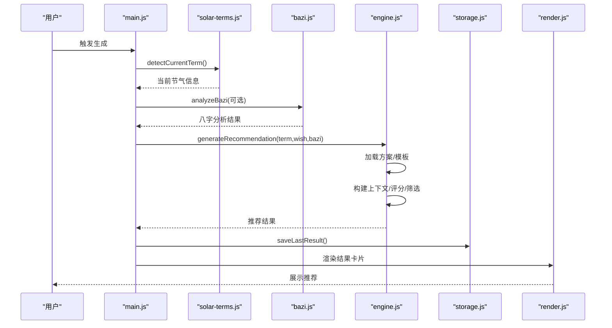
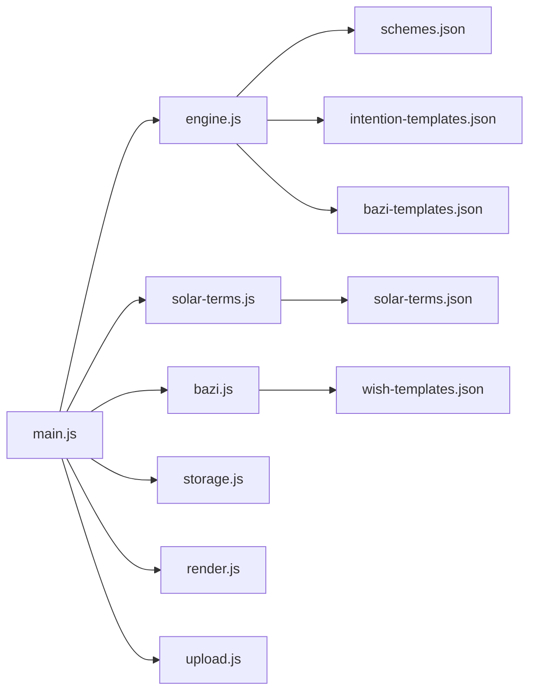

# 单元测试编写

<cite>
**本文引用的文件列表**
- [index.html](file://index.html)
- [main.js](file://js/main.js)
- [engine.js](file://js/engine.js)
- [solar-terms.js](file://js/solar-terms.js)
- [bazi.js](file://js/bazi.js)
- [storage.js](file://js/storage.js)
- [render.js](file://js/render.js)
- [upload.js](file://js/upload.js)
- [schemes.json](file://data/schemes.json)
- [solar-terms.json](file://data/solar-terms.json)
- [bazi-templates.json](file://data/bazi-templates.json)
- [intention-templates.json](file://data/intention-templates.json)
- [wish-templates.json](file://data/wish-templates.json)
</cite>

## 目录
1. [简介](#简介)
2. [项目结构](#项目结构)
3. [核心组件](#核心组件)
4. [架构总览](#架构总览)
5. [详细组件分析](#详细组件分析)
6. [依赖分析](#依赖分析)
7. [性能考量](#性能考量)
8. [故障排查指南](#故障排查指南)
9. [结论](#结论)
10. [附录](#附录)

## 简介
本指南面向“五行穿搭建议”项目的前端单元测试编写，目标是帮助开发者系统地为推荐引擎、节气处理、八字分析、存储模块等核心功能建立高质量的测试用例。文档覆盖测试框架选择与配置、模拟数据准备、断言方法、异步函数测试技巧，并给出测试覆盖率与持续集成建议，确保代码在迭代过程中保持稳定与可维护。

## 项目结构
该项目采用模块化组织，核心逻辑分布在 js 目录下，数据来源于 data 目录的 JSON 文件。页面入口为 index.html，应用入口脚本位于 js/main.js，负责调度各模块并驱动 UI。

图表来源
- [index.html](file://index.html#L1-L236)
- [main.js](file://js/main.js#L1-L317)
- [engine.js](file://js/engine.js#L1-L335)
- [solar-terms.js](file://js/solar-terms.js#L1-L118)
- [bazi.js](file://js/bazi.js#L1-L193)
- [storage.js](file://js/storage.js#L1-L116)
- [render.js](file://js/render.js#L1-L272)
- [upload.js](file://js/upload.js#L1-L145)
- [schemes.json](file://data/schemes.json#L1-L509)
- [solar-terms.json](file://data/solar-terms.json#L1-L42)
- [bazi-templates.json](file://data/bazi-templates.json#L1-L103)
- [intention-templates.json](file://data/intention-templates.json#L1-L253)
- [wish-templates.json](file://data/wish-templates.json#L1-L47)

章节来源
- [index.html](file://index.html#L1-L236)
- [main.js](file://js/main.js#L1-L317)

## 核心组件
- 推荐引擎：加载方案与模板、构建上下文、评分与筛选、生成与换一批推荐。
- 节气处理：UTC+8 时间转换、节气数据加载、当前节气检测、季节与五行映射、颜色映射。
- 八字分析：四柱计算、五行统计、推荐元素、完整分析流程。
- 存储模块：本地存储封装、前缀键管理、使用统计、反馈与上传记录。
- 渲染与上传：视图切换、卡片渲染、模态框、Toast 提示、文件验证与压缩。

章节来源
- [engine.js](file://js/engine.js#L1-L335)
- [solar-terms.js](file://js/solar-terms.js#L1-L118)
- [bazi.js](file://js/bazi.js#L1-L193)
- [storage.js](file://js/storage.js#L1-L116)
- [render.js](file://js/render.js#L1-L272)
- [upload.js](file://js/upload.js#L1-L145)

## 架构总览
推荐流程从用户输入开始，结合当前节气、心愿与八字分析，调用推荐引擎生成方案，再通过渲染模块展示。存储模块贯穿用户偏好、历史结果与上传记录。

图表来源
- [main.js](file://js/main.js#L202-L244)
- [solar-terms.js](file://js/solar-terms.js#L36-L103)
- [bazi.js](file://js/bazi.js#L182-L192)
- [engine.js](file://js/engine.js#L268-L310)
- [storage.js](file://js/storage.js#L60-L66)
- [render.js](file://js/render.js#L114-L127)

## 详细组件分析

### 测试框架选择与配置
- 推荐框架：Jest 或 Mocha + Chai（Mocha 更灵活，Chai 断言丰富；Jest 内置环境与快照更方便）。
- 配置要点：
  - 使用 jsdom 模拟浏览器 DOM 环境，以便测试渲染与上传模块。
  - 配置 fetch 拦截，模拟 data/*.json 的网络请求，避免真实网络依赖。
  - 设置测试文件目录与命名规范（如以 .test.js 结尾），便于 CI 扫描。
  - 覆盖率：设置阈值（如语句 80%、分支 80%、函数 80%、行 80%）。
  - 持续集成：在 CI 中运行测试与覆盖率检查，失败即阻断合并。

[本节为通用实践说明，不直接分析具体文件，故无章节来源]

### 推荐引擎模块测试
- 目标：验证权重计算、节气距离、模板匹配、上下文构建、评分与筛选、换一批逻辑。
- 数据准备：
  - 使用 schemes.json 的部分样例构造测试数据，避免真实网络请求。
  - 准备 intention-templates.json 与 bazi-templates.json 的片段，覆盖不同心愿与八字场景。
- 关键测试点：
  - getTermDistance：边界与循环距离（如立春与大寒）。
  - findBestIntentionTemplate：按节气距离排序与匹配。
  - findBestBaziTemplate：按最强元素与年份匹配。
  - buildContext：权重与五行字段构建。
  - scoreScheme：同五行、相生加分、相克不加分。
  - selectSchemes：按节气过滤、不足数量时按得分与多样性补充。
  - generateRecommendation/regenerateRecommendation：并发加载、排除已选方案、返回结构校验。
- 异步测试技巧：
  - 使用 Promise.all 并发加载，或使用 fetch 拦截统一返回。
  - 对外部依赖（fetch）进行 mock，确保测试稳定。
- 断言建议：
  - 使用 toEqual/toBeCloseTo 验证分数与权重。
  - 使用 toContainAllEntries 验证模板匹配字段。
  - 使用toHaveLength 验证数组长度与去重后的多样性。

章节来源
- [engine.js](file://js/engine.js#L39-L79)
- [engine.js](file://js/engine.js#L84-L99)
- [engine.js](file://js/engine.js#L104-L119)
- [engine.js](file://js/engine.js#L124-L152)
- [engine.js](file://js/engine.js#L157-L173)
- [engine.js](file://js/engine.js#L178-L199)
- [engine.js](file://js/engine.js#L218-L259)
- [engine.js](file://js/engine.js#L268-L310)
- [engine.js](file://js/engine.js#L315-L334)
- [schemes.json](file://data/schemes.json#L1-L509)
- [intention-templates.json](file://data/intention-templates.json#L1-L253)
- [bazi-templates.json](file://data/bazi-templates.json#L1-L103)

### 节气处理模块测试
- 目标：验证 UTC+8 时间转换、节气数据加载、当前节气检测、季节映射、颜色映射。
- 数据准备：
  - 使用 solar-terms.json 的片段，覆盖跨月与跨年的边界情况。
- 关键测试点：
  - getUTC8Date：时区偏移与边界日期。
  - detectCurrentTerm：按月份与日期范围定位当前节气，回退到上月与默认立春。
  - 季节映射：根据节气ID映射到季节与五行。
  - getWuxingColor：五行到颜色的映射。
- 异步测试技巧：
  - 使用 fetch 拦截，返回固定节气数据，避免真实网络。
- 断言建议：
  - 使用 toMatchObject 验证节气对象字段。
  - 使用 toBe 验证季节与五行映射一致性。

章节来源
- [solar-terms.js](file://js/solar-terms.js#L10-L13)
- [solar-terms.js](file://js/solar-terms.js#L18-L29)
- [solar-terms.js](file://js/solar-terms.js#L36-L103)
- [solar-terms.js](file://js/solar-terms.js#L108-L117)
- [solar-terms.json](file://data/solar-terms.json#L1-L42)

### 八字分析模块测试
- 目标：验证四柱计算、天干地支映射、五行统计、推荐元素、完整分析流程。
- 数据准备：
  - 使用固定出生日期与时辰组合，确保输出可预期。
- 关键测试点：
  - calcBazi：年月日时柱生成与完整八字字符串。
  - calcWuxingProfile：天干地支分别统计并求和。
  - getRecommendElement：按强度排序，返回最弱与最强元素及推荐。
  - analyzeBazi：端到端流程整合。
- 断言建议：
  - 使用 toEqual 验证 profile 与推荐元素。
  - 使用 toMatchObject 验证完整分析结果结构。

章节来源
- [bazi.js](file://js/bazi.js#L39-L48)
- [bazi.js](file://js/bazi.js#L53-L67)
- [bazi.js](file://js/bazi.js#L72-L86)
- [bazi.js](file://js/bazi.js#L91-L101)
- [bazi.js](file://js/bazi.js#L111-L124)
- [bazi.js](file://js/bazi.js#L129-L153)
- [bazi.js](file://js/bazi.js#L158-L172)
- [bazi.js](file://js/bazi.js#L182-L192)

### 存储模块测试
- 目标：验证本地存储封装、前缀键管理、使用统计、反馈与上传记录。
- 数据准备：
  - 使用内存存储模拟 localStorage，避免真实存储影响。
- 关键测试点：
  - get/set/remove：序列化与异常捕获。
  - getKeysByPrefix：前缀匹配与键过滤。
  - clearAll：批量清理。
  - 业务方法：last_bazi/last_result/feedback/outfit_*、usage_stats、visited、selected_wish。
- 断言建议：
  - 使用 toBe 验证布尔返回值。
  - 使用 toEqual 验证对象与数组的序列化一致性。

章节来源
- [storage.js](file://js/storage.js#L7-L14)
- [storage.js](file://js/storage.js#L16-L23)
- [storage.js](file://js/storage.js#L25-L49)
- [storage.js](file://js/storage.js#L52-L115)

### 渲染与上传模块测试
- 目标：验证视图切换、卡片渲染、模态框、Toast、文件验证与压缩。
- 数据准备：
  - 使用 jsdom 构造 DOM 片段，模拟容器与按钮。
- 关键测试点：
  - showView：隐藏/显示视图。
  - renderSchemeCards：渲染多卡片并保存全局引用。
  - renderDetailModal：详情内容渲染。
  - showModal/closeModal：遮罩与滚动控制。
  - showToast：消息显示与自动消失。
  - validateFile：类型、大小校验。
  - compressImage：Canvas 压缩与质量控制。
  - initUploadZone：点击、键盘、拖拽事件绑定。
- 异步测试技巧：
  - 使用 Promise 包装 FileReader 与 Canvas，确保异步完成。
- 断言建议：
  - 使用 toContainHTML 验证渲染内容。
  - 使用 toHaveClass 验证样式类切换。
  - 使用 toBeVisible/toBeHidden 验证可见性。

章节来源
- [render.js](file://js/render.js#L8-L16)
- [render.js](file://js/render.js#L114-L127)
- [render.js](file://js/render.js#L159-L193)
- [render.js](file://js/render.js#L198-L215)
- [render.js](file://js/render.js#L242-L271)
- [upload.js](file://js/upload.js#L12-L26)
- [upload.js](file://js/upload.js#L31-L82)
- [upload.js](file://js/upload.js#L87-L136)
- [upload.js](file://js/upload.js#L141-L144)

## 依赖分析
- 模块耦合：
  - main.js 作为协调者，依赖 engine、solar-terms、bazi、storage、render、upload。
  - engine 依赖 data/* 与 wish-templates。
  - solar-terms 依赖 data/solar-terms.json。
  - bazi 为纯计算模块，无外部依赖。
  - storage 为纯本地存储封装。
- 外部依赖：
  - fetch：用于加载 JSON 数据；建议在测试中统一拦截。
  - DOM：渲染与上传模块依赖浏览器环境；建议使用 jsdom。
- 循环依赖：未发现循环依赖。

图表来源
- [main.js](file://js/main.js#L5-L15)
- [engine.js](file://js/engine.js#L39-L79)
- [solar-terms.js](file://js/solar-terms.js#L18-L29)
- [bazi.js](file://js/bazi.js#L1-L193)
- [storage.js](file://js/storage.js#L1-L116)
- [render.js](file://js/render.js#L1-L272)
- [upload.js](file://js/upload.js#L1-L145)
- [schemes.json](file://data/schemes.json#L1-L509)
- [solar-terms.json](file://data/solar-terms.json#L1-L42)
- [bazi-templates.json](file://data/bazi-templates.json#L1-L103)
- [intention-templates.json](file://data/intention-templates.json#L1-L253)
- [wish-templates.json](file://data/wish-templates.json#L1-L47)

## 性能考量
- 测试中尽量减少真实网络请求，使用 fetch 拦截与内存数据源。
- 对 Canvas 压缩与 FileReader 异步操作进行合理等待，避免 flaky 测试。
- 使用小规模数据集（如节气模板片段）进行单元测试，提升执行速度。
- 在 CI 中并行运行测试套件，缩短反馈周期。

[本节为通用指导，不直接分析具体文件，故无章节来源]

## 故障排查指南
- 常见问题：
  - 节气检测失败：检查日期范围与跨月边界逻辑。
  - 模板匹配不到：确认 baZiKey 与年份字段是否一致。
  - 评分异常：核对相生关系与权重分配。
  - 本地存储异常：检查 JSON 序列化与异常捕获。
  - DOM 测试失败：确认 jsdom 环境与选择器正确。
- 调试建议：
  - 在测试中打印关键中间结果（如上下文、评分、筛选过程）。
  - 使用最小可复现数据集快速定位问题。
  - 在 CI 日志中保留关键断言失败信息。

章节来源
- [solar-terms.js](file://js/solar-terms.js#L36-L103)
- [engine.js](file://js/engine.js#L104-L152)
- [engine.js](file://js/engine.js#L178-L259)
- [storage.js](file://js/storage.js#L7-L23)
- [render.js](file://js/render.js#L114-L127)

## 结论
通过为推荐引擎、节气处理、八字分析与存储模块建立完善的单元测试，可以有效保障功能正确性与可维护性。建议在 CI 中强制执行测试与覆盖率检查，持续改进测试质量与覆盖面，确保项目长期稳定演进。

## 附录
- 测试覆盖率建议：
  - 语句覆盖率：≥80%
  - 分支覆盖率：≥80%
  - 函数覆盖率：≥80%
  - 行覆盖率：≥80%
- 持续集成配置建议：
  - 使用 GitHub Actions 或类似平台，在 PR 与主分支上运行测试与覆盖率报告。
  - 失败即阻断合并，确保质量门禁。
  - 将覆盖率报告上传至服务（如 Codecov），便于追踪趋势。

[本节为通用建议，不直接分析具体文件，故无章节来源]