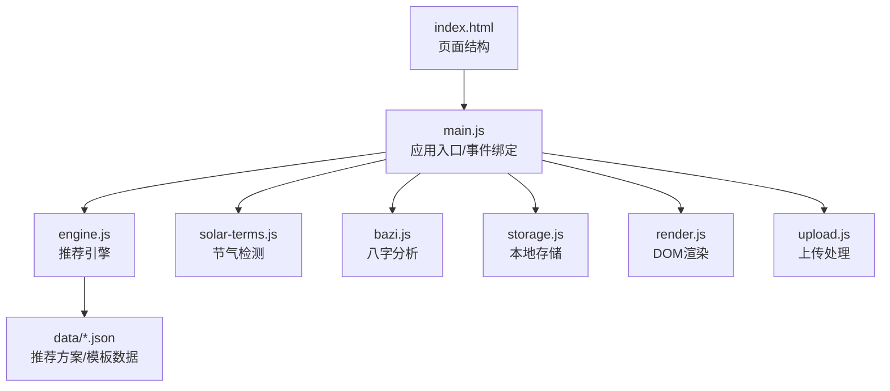
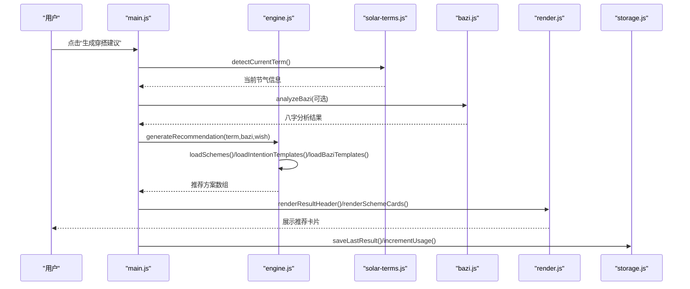
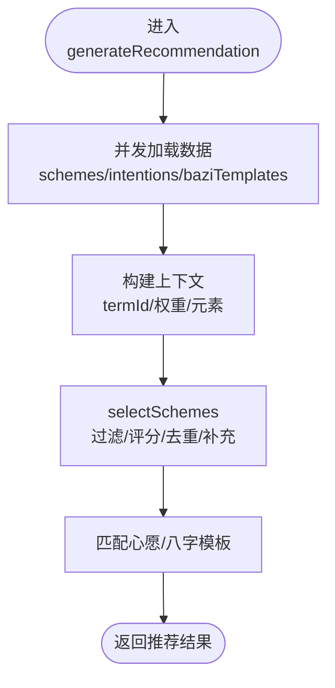
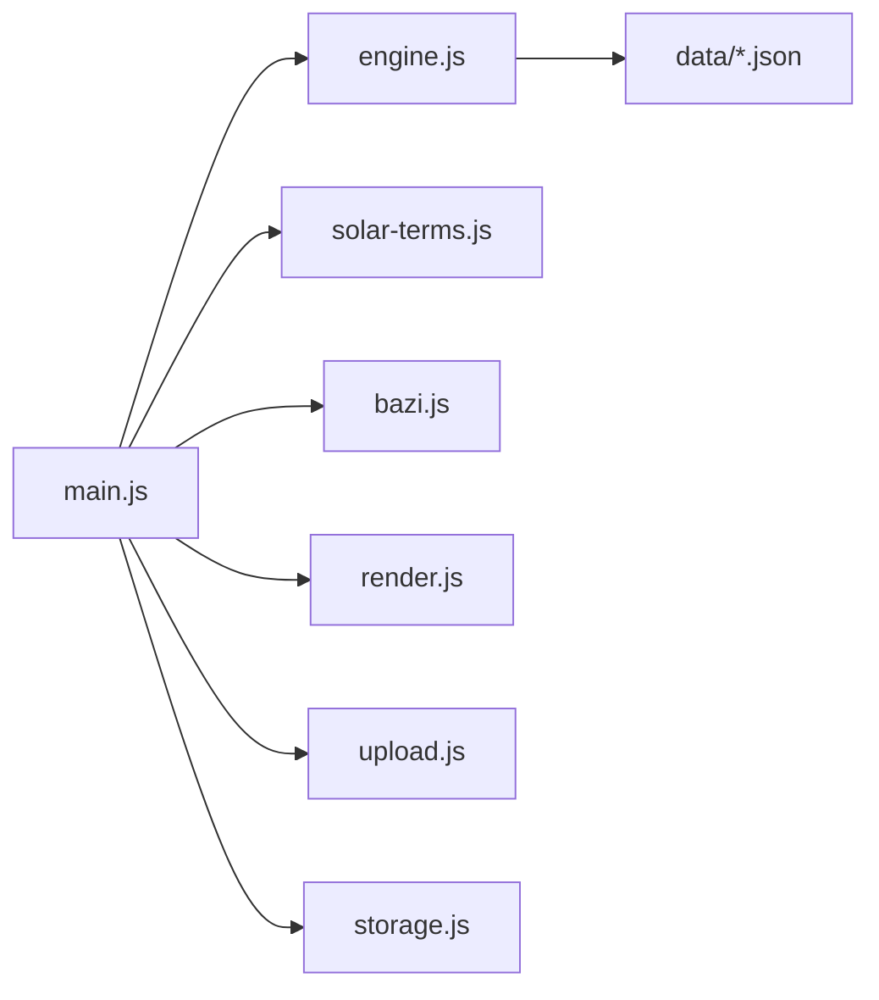

# 浏览器调试技巧

<cite>
**本文档引用的文件**
- [index.html](file://index.html)
- [main.js](file://js/main.js)
- [engine.js](file://js/engine.js)
- [storage.js](file://js/storage.js)
- [render.js](file://js/render.js)
- [solar-terms.js](file://js/solar-terms.js)
- [bazi.js](file://js/bazi.js)
- [upload.js](file://js/upload.js)
- [base.css](file://css/base.css)
- [components.css](file://css/components.css)
</cite>

## 目录
1. [简介](#简介)
2. [项目结构](#项目结构)
3. [核心组件](#核心组件)
4. [架构总览](#架构总览)
5. [详细组件分析](#详细组件分析)
6. [依赖关系分析](#依赖关系分析)
7. [性能考虑](#性能考虑)
8. [故障排查指南](#故障排查指南)
9. [结论](#结论)
10. [附录](#附录)

## 简介
本指南面向“五行穿搭建议”项目的前端调试工作，系统讲解Chrome DevTools的实战技巧，覆盖断点调试、网络请求监控、存储数据查看、性能分析等关键能力，并结合项目实际场景给出调试策略与最佳实践，帮助快速定位推荐算法执行过程、数据加载异常、用户界面交互问题等。

## 项目结构
该项目采用模块化JavaScript组织方式，页面通过index.html引入模块化脚本，核心逻辑分布在多个功能模块中：
- 入口与事件绑定：main.js
- 推荐引擎：engine.js
- 数据加载与节气：solar-terms.js
- 八字计算：bazi.js
- 本地存储：storage.js
- 视图渲染：render.js
- 上传处理：upload.js
- 样式：base.css、components.css

图表来源
- [index.html](file://index.html#L1-L236)
- [main.js](file://js/main.js#L1-L317)
- [engine.js](file://js/engine.js#L1-L335)
- [solar-terms.js](file://js/solar-terms.js#L1-L118)
- [bazi.js](file://js/bazi.js#L1-L193)
- [storage.js](file://js/storage.js#L1-L116)
- [render.js](file://js/render.js#L1-L272)
- [upload.js](file://js/upload.js#L1-L145)

章节来源
- [index.html](file://index.html#L1-L236)
- [main.js](file://js/main.js#L1-L317)

## 核心组件
- 应用入口与事件流：负责初始化、恢复状态、绑定交互事件、驱动渲染与存储。
- 推荐引擎：加载数据、构建上下文、评分与筛选方案、生成/换一批推荐。
- 节气模块：加载节气数据、检测当前节气、提供五行颜色映射。
- 八字模块：计算四柱、统计五行、给出强弱分析与推荐。
- 存储模块：封装localStorage读写、前缀化键名、统计使用次数。
- 渲染模块：切换视图、渲染卡片、模态框、Toast提示。
- 上传模块：文件校验、Canvas压缩、拖拽/键盘支持、今日日期键值。

章节来源
- [main.js](file://js/main.js#L1-L317)
- [engine.js](file://js/engine.js#L1-L335)
- [solar-terms.js](file://js/solar-terms.js#L1-L118)
- [bazi.js](file://js/bazi.js#L1-L193)
- [storage.js](file://js/storage.js#L1-L116)
- [render.js](file://js/render.js#L1-L272)
- [upload.js](file://js/upload.js#L1-L145)

## 架构总览
下图展示从用户交互到数据加载、算法执行、渲染更新的完整链路，便于在DevTools中进行端到端调试。

图表来源
- [main.js](file://js/main.js#L202-L244)
- [engine.js](file://js/engine.js#L268-L310)
- [solar-terms.js](file://js/solar-terms.js#L36-L103)
- [bazi.js](file://js/bazi.js#L182-L192)
- [render.js](file://js/render.js#L104-L127)
- [storage.js](file://js/storage.js#L60-L66)

## 详细组件分析

### 推荐引擎调试要点
- 断点位置建议
  - 在生成推荐函数入口设置断点，观察传入的termInfo、wishId、baziResult是否符合预期。
  - 在selectSchemes内部断点，观察评分与筛选逻辑，确认是否正确过滤/去重/补充方案。
  - 在loadSchemes/loadIntentionTemplates/loadBaziTemplates处断点，验证数据加载是否成功。
- 关键变量检查
  - 上下文对象：termId、termWuxing、baziWuxing、wishWuxing及其权重。
  - 评分函数：isGenerating关系、scoreScheme计算结果。
- 性能关注
  - Promise.all并发加载数据，注意网络耗时与缓存命中情况。
  - 评分排序与去重逻辑的时间复杂度，避免大数据量时卡顿。

图表来源
- [engine.js](file://js/engine.js#L268-L310)
- [engine.js](file://js/engine.js#L218-L259)

章节来源
- [engine.js](file://js/engine.js#L268-L334)

### 节气与八字模块调试要点
- 节气检测
  - 断点在detectCurrentTerm，检查当前日期、月份、日范围匹配逻辑。
  - 若跨月边界，验证回退到上个月节气的分支。
- 八字计算
  - 断点在analyzeBazi，检查各柱计算与profile统计。
  - 关注推荐元素逻辑：最弱元素即推荐补充元素。
- 调试技巧
  - 使用条件断点：例如“当前节气名称”、“最弱元素”等条件。
  - 使用异步断点：在fetch调用栈中捕获网络异常。

章节来源
- [solar-terms.js](file://js/solar-terms.js#L36-L103)
- [bazi.js](file://js/bazi.js#L182-L192)

### 本地存储调试要点
- 常见问题
  - 存储失败：JSON序列化异常、存储空间不足。
  - 键冲突：未加前缀导致覆盖。
- 调试步骤
  - 打开Application面板 -> Local Storage，查看wuxing_前缀键值。
  - 使用Console执行storage模块方法进行读写验证。
  - 使用Clear storage清理脏数据，复现问题。

章节来源
- [storage.js](file://js/storage.js#L1-L116)

### 视图渲染调试要点
- 视图切换
  - 在showView断点，检查隐藏/显示类名切换是否正确。
- 卡片渲染
  - 在renderSchemeCards断点，检查window.__currentSchemes是否注入。
  - 模态框渲染：renderDetailModal检查HTML拼接与样式。
- 交互问题
  - 按钮事件委托：在main.js事件绑定处断点，确认事件冒泡与目标元素匹配。

章节来源
- [render.js](file://js/render.js#L8-L16)
- [render.js](file://js/render.js#L114-L127)
- [render.js](file://js/render.js#L159-L193)
- [main.js](file://js/main.js#L125-L136)

### 上传与反馈调试要点
- 文件校验
  - validateFile断点，检查类型、大小限制。
- 图片压缩
  - compressImage断点，检查Canvas尺寸、质量迭代与最终DataURL长度。
- 上传流程
  - initUploadZone断点，验证点击、键盘、拖拽事件路径。
  - storage.saveUploadedOutfit与updateUploadPreview联动。

章节来源
- [upload.js](file://js/upload.js#L12-L26)
- [upload.js](file://js/upload.js#L31-L82)
- [upload.js](file://js/upload.js#L87-L136)
- [render.js](file://js/render.js#L220-L237)

## 依赖关系分析
- 模块耦合
  - main.js是控制中心，依赖engine、solar-terms、bazi、render、upload、storage。
  - engine.js依赖data/*.json，存在异步加载风险。
- 外部依赖
  - CDN字体资源，可能影响首屏加载。
- 依赖可视化

图表来源
- [main.js](file://js/main.js#L5-L15)
- [engine.js](file://js/engine.js#L39-L79)

章节来源
- [main.js](file://js/main.js#L5-L15)
- [engine.js](file://js/engine.js#L39-L79)

## 性能考虑
- CPU性能分析
  - 在Performance面板录制生成/换一批推荐过程，观察主线程占用、布局抖动、重绘。
  - 关注评分与排序的热点函数，必要时引入缓存或分批渲染。
- 内存使用监控
  - 在Memory面板快照对比，检查window.__currentSchemes、DOM节点数量、事件监听器泄漏。
- 网络性能
  - 在Network面板观察data/*.json加载耗时，启用持久化缓存策略。
- 渲染优化
  - 使用CSS动画与transform属性减少重排。
  - 对长列表使用虚拟滚动（如后续扩展）。

[本节为通用指导，无需特定文件来源]

## 故障排查指南

### 推荐算法执行过程调试
- 症状：推荐结果为空或不符合预期
- 步骤
  - 在generateRecommendation入口设置断点，检查上下文构建与数据加载。
  - 在selectSchemes断点，核对评分、去重与补充逻辑。
  - 检查isGenerating关系与scoreScheme权重分配。
- 工具
  - 断点调试、Watch表达式、Call Stack查看调用链。

章节来源
- [engine.js](file://js/engine.js#L268-L310)
- [engine.js](file://js/engine.js#L218-L259)

### 数据加载异常排查
- 症状：节气/模板数据加载失败
- 步骤
  - 在loadTermsData/loadSchemes等异步函数断点，检查fetch响应与JSON解析。
  - 在Network面板查看4xx/5xx与超时，确认静态资源可用性。
- 工具
  - XHR/Fetch断点、Throttling模拟慢网速。

章节来源
- [solar-terms.js](file://js/solar-terms.js#L18-L29)
- [engine.js](file://js/engine.js#L39-L79)

### 用户界面交互问题诊断
- 症状：按钮无响应、模态框无法关闭
- 步骤
  - 在main.js事件绑定断点，确认事件委托与目标元素匹配。
  - 在render.js show/hide断点，检查类名切换与body overflow控制。
- 工具
  - Elements面板检查事件监听器，Console测试事件回调。

章节来源
- [main.js](file://js/main.js#L72-L153)
- [render.js](file://js/render.js#L8-L16)
- [render.js](file://js/render.js#L198-L215)

### 存储数据问题排查
- 症状：心愿/八字/结果未恢复
- 步骤
  - 在storage.js get/set断点，检查键名前缀与JSON序列化。
  - 在Application面板查看Local Storage，确认键值存在且格式正确。
- 工具
  - Console执行storage.get('selected_wish')等验证。

章节来源
- [storage.js](file://js/storage.js#L7-L23)
- [storage.js](file://js/storage.js#L52-L66)

### 上传与反馈问题排查
- 症状：上传失败、压缩后体积过大
- 步骤
  - 在compressImage断点，检查Canvas尺寸与质量迭代。
  - 在initUploadZone断点，确认拖拽/键盘事件路径。
- 工具
  - Network面板查看上传请求与响应，Memory面板监控内存峰值。

章节来源
- [upload.js](file://js/upload.js#L31-L82)
- [upload.js](file://js/upload.js#L87-L136)
- [render.js](file://js/render.js#L220-L237)

## 结论
通过将DevTools的断点调试、网络监控、存储检查与性能分析与项目模块职责相结合，可以高效定位并解决推荐算法、数据加载、UI交互与上传反馈等关键问题。建议在开发过程中持续使用Performance与Memory面板进行回归测试，确保用户体验稳定流畅。

[本节为总结，无需特定文件来源]

## 附录

### Chrome DevTools常用技巧清单
- 断点调试
  - 条件断点：右键断点 -> Add conditional breakpoint，设置“当前节气名称”等条件。
  - 异步断点：Sources面板 -> Event Listener Breakpoints -> XHR/Fetch。
  - 断点组：将相关断点归组，便于批量启用/禁用。
- 网络请求监控
  - Network面板：筛选XHR/JS/CSS/Fonts，查看响应时间、Size、Headers。
  - Preserve log：复现问题时保留历史请求。
  - Throttling：模拟3G/4G网络，评估性能瓶颈。
- 存储数据查看
  - Application面板 -> Local Storage：检查键值与JSON格式。
  - Console执行storage模块方法进行读写验证。
- 性能分析
  - Performance面板：录制生成/换一批推荐，分析主线程占用。
  - Memory面板：Heap Snapshot对比，定位内存泄漏。
- 最佳实践
  - console.log规范：统一日志前缀如“[App]”“[Engine]”，便于过滤。
  - 错误堆栈：捕获Promise异常，使用console.trace()输出调用栈。
  - 性能瓶颈定位：先看Network，再看CPU，最后看Memory。
- 常用快捷键
  - Ctrl+Shift+I：打开开发者工具
  - Ctrl+Shift+C：元素选择器
  - F8：跳过断点继续
  - F10：逐过程
  - F11：逐语句
  - Ctrl+Shift+P：命令面板（搜索功能）

[本节为通用指导，无需特定文件来源]