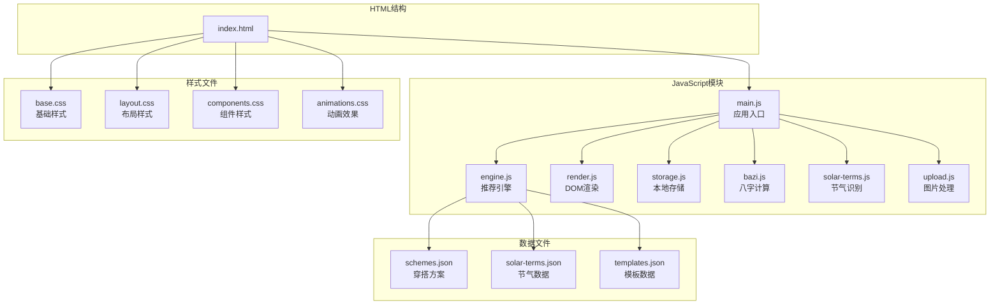
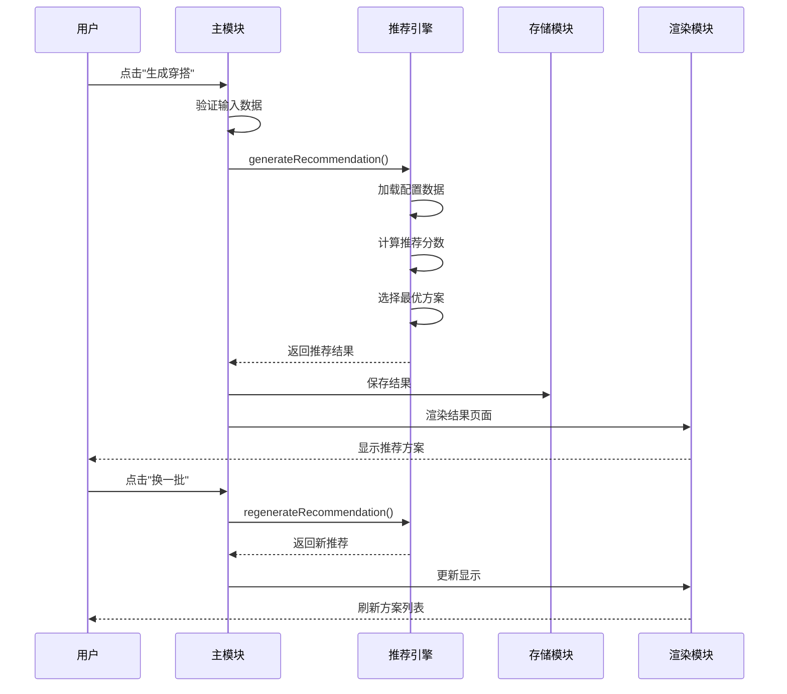
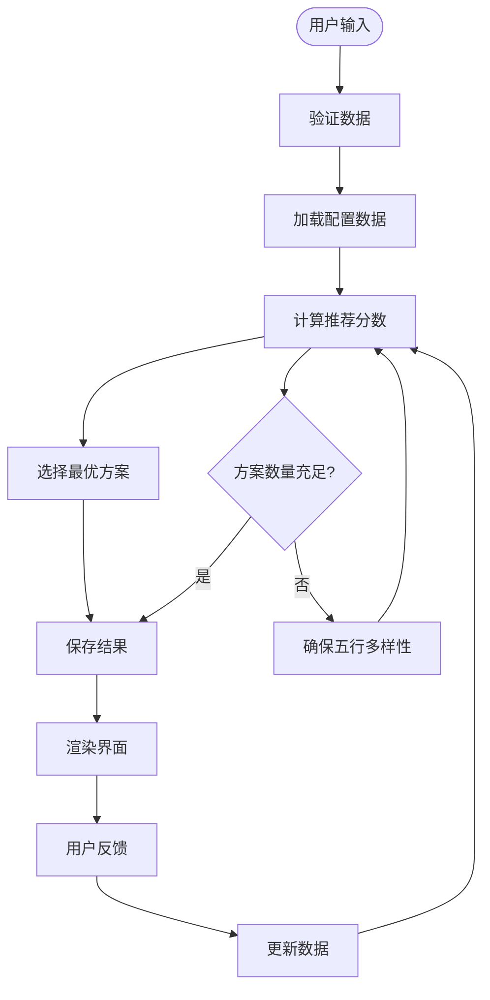
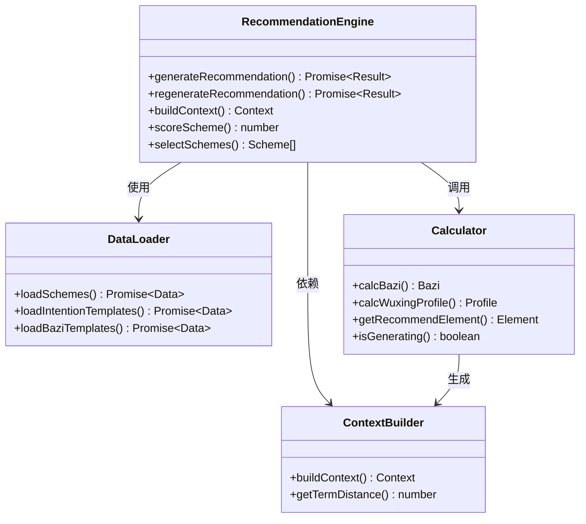
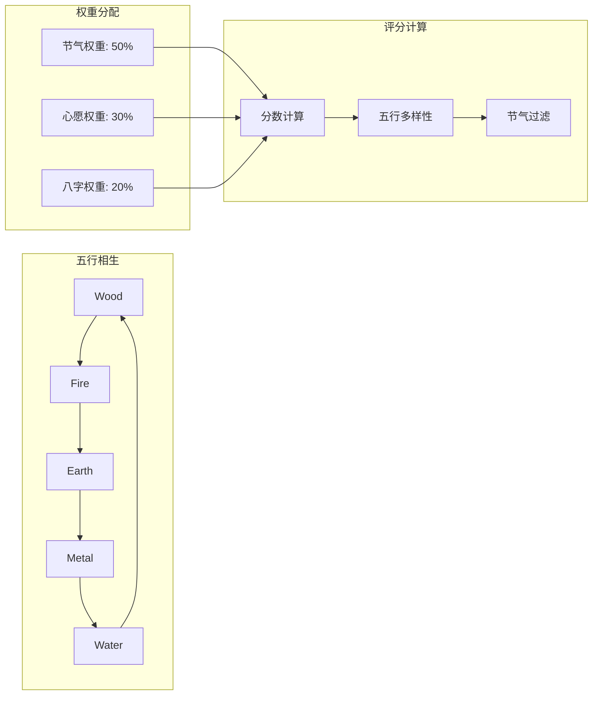
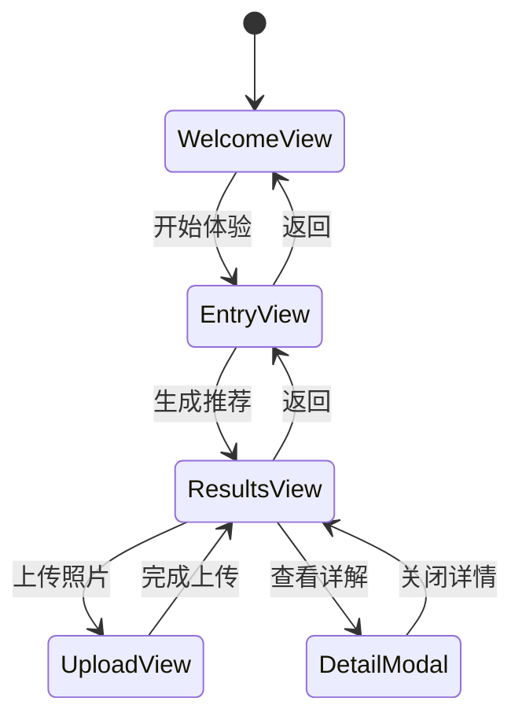
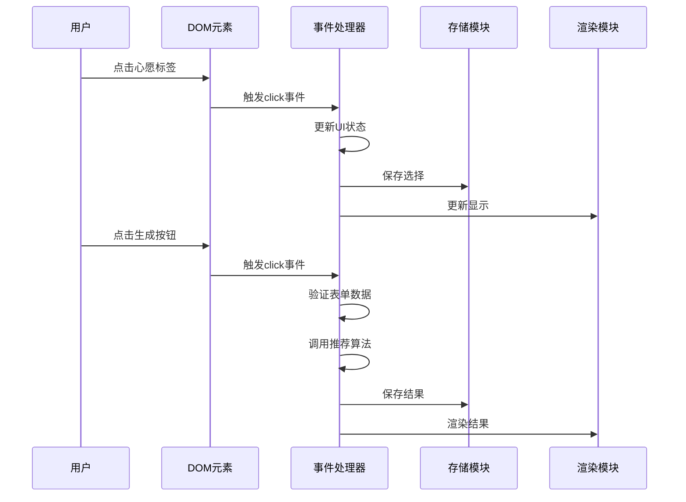
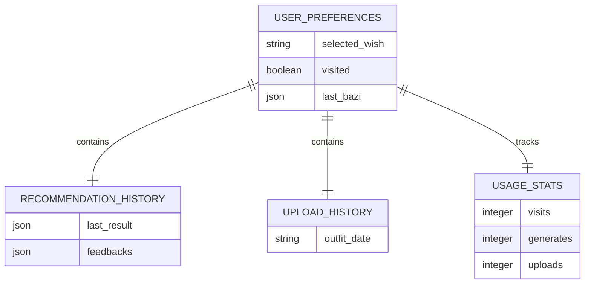
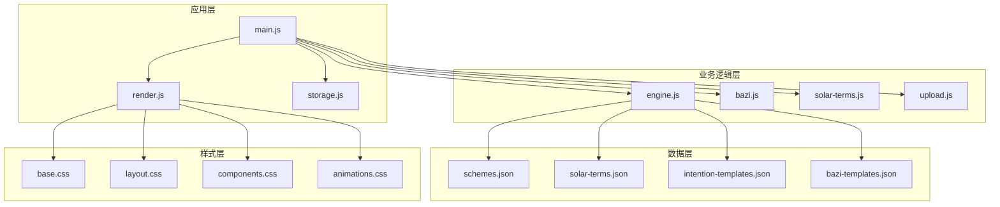
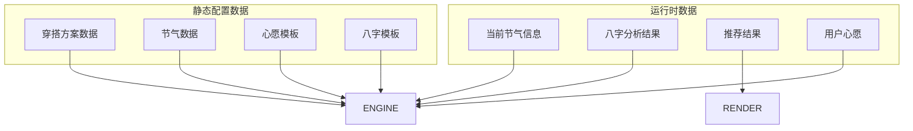

# 调试与测试

<cite>
**本文档引用的文件**
- [index.html](file://index.html)
- [main.js](file://js/main.js)
- [engine.js](file://js/engine.js)
- [render.js](file://js/render.js)
- [storage.js](file://js/storage.js)
- [bazi.js](file://js/bazi.js)
- [solar-terms.js](file://js/solar-terms.js)
- [upload.js](file://js/upload.js)
- [schemes.json](file://data/schemes.json)
- [solar-terms.json](file://data/solar-terms.json)
- [base.css](file://css/base.css)
</cite>

## 目录
1. [简介](#简介)
2. [项目结构](#项目结构)
3. [核心组件](#核心组件)
4. [架构概览](#架构概览)
5. [详细组件分析](#详细组件分析)
6. [依赖关系分析](#依赖关系分析)
7. [性能考虑](#性能考虑)
8. [故障排查指南](#故障排查指南)
9. [结论](#结论)

## 简介

本文档为"五行穿搭建议"项目提供了全面的调试与测试指南。该项目是一个基于传统五行理论的个性化穿搭推荐应用，通过节气变化和用户个人特征（如生辰八字）来生成每日穿搭建议。

项目采用模块化架构设计，包含以下主要功能模块：
- 推荐引擎：基于节气、心愿和八字的智能推荐算法
- 数据加载：异步加载JSON配置数据
- 用户界面：响应式的多视图界面系统
- 本地存储：用户偏好和历史数据的持久化
- 图片上传：压缩和上传用户穿搭照片

## 项目结构

项目采用清晰的模块化组织结构，遵循现代前端开发最佳实践：



**图表来源**
- [index.html](file://index.html#L1-L236)
- [main.js](file://js/main.js#L1-L317)
- [engine.js](file://js/engine.js#L1-L335)

**章节来源**
- [index.html](file://index.html#L1-L236)
- [main.js](file://js/main.js#L1-L317)

## 核心组件

### 应用入口模块 (main.js)
应用的核心控制模块，负责：
- 初始化应用状态和UI
- 绑定用户交互事件
- 协调各模块间的通信
- 管理用户会话生命周期

### 推荐引擎模块 (engine.js)
实现智能推荐算法的核心模块：
- 加载和解析配置数据
- 计算节气距离和权重
- 执行五行相生相克算法
- 生成个性化穿搭方案

### 渲染模块 (render.js)
负责用户界面的动态更新：
- 视图切换和显示控制
- 动态内容生成
- 模态框管理和动画效果
- Toast消息提示系统

### 存储模块 (storage.js)
提供本地数据持久化功能：
- 封装localStorage操作
- 用户偏好设置管理
- 使用统计和历史记录
- 数据序列化和反序列化

**章节来源**
- [main.js](file://js/main.js#L1-L317)
- [engine.js](file://js/engine.js#L1-L335)
- [render.js](file://js/render.js#L1-L272)
- [storage.js](file://js/storage.js#L1-L116)

## 架构概览

项目采用事件驱动的模块化架构，各组件通过明确的接口进行通信：



**图表来源**
- [main.js](file://js/main.js#L202-L244)
- [engine.js](file://js/engine.js#L268-L310)
- [render.js](file://js/render.js#L114-L127)

### 数据流架构



**图表来源**
- [engine.js](file://js/engine.js#L178-L259)
- [main.js](file://js/main.js#L224-L244)

## 详细组件分析

### 推荐引擎深度分析

推荐引擎是整个应用的核心算法模块，实现了复杂的五行理论计算：

#### 核心算法组件



**图表来源**
- [engine.js](file://js/engine.js#L268-L335)
- [bazi.js](file://js/bazi.js#L182-L193)

#### 五行相生算法

推荐引擎实现了完整的五行相生相克理论：



**图表来源**
- [engine.js](file://js/engine.js#L178-L259)

**章节来源**
- [engine.js](file://js/engine.js#L1-L335)
- [bazi.js](file://js/bazi.js#L1-L193)

### 用户界面组件分析

#### 视图管理系统

应用采用多视图架构，通过CSS类控制视图切换：



**图表来源**
- [render.js](file://js/render.js#L8-L16)
- [main.js](file://js/main.js#L72-L153)

#### 交互事件处理



**图表来源**
- [main.js](file://js/main.js#L92-L100)
- [render.js](file://js/render.js#L114-L127)

**章节来源**
- [render.js](file://js/render.js#L1-L272)
- [main.js](file://js/main.js#L72-L153)

### 数据存储系统

#### 本地存储架构



**图表来源**
- [storage.js](file://js/storage.js#L51-L116)

**章节来源**
- [storage.js](file://js/storage.js#L1-L116)

## 依赖关系分析

### 模块依赖图



**图表来源**
- [main.js](file://js/main.js#L5-L15)
- [engine.js](file://js/engine.js#L39-L79)

### 数据依赖关系



**图表来源**
- [engine.js](file://js/engine.js#L268-L310)
- [solar-terms.js](file://js/solar-terms.js#L36-L103)

**章节来源**
- [main.js](file://js/main.js#L1-L317)
- [engine.js](file://js/engine.js#L1-L335)

## 性能考虑

### 加载性能优化

项目在多个层面实现了性能优化：

#### 异步数据加载
- 使用Promise.all并行加载配置数据
- 实现数据缓存机制避免重复请求
- 采用懒加载策略延迟非关键资源

#### 内存管理
- 合理使用window对象存储临时数据
- 及时清理事件监听器和DOM引用
- 实现数据序列化优化存储效率

#### 网络优化
- 预连接CDN资源提升加载速度
- 使用适当的缓存策略
- 实现错误重试机制

### 用户体验优化

#### 响应式设计
- 移动端优先的设计理念
- 触摸友好的交互元素
- 无障碍访问支持

#### 性能监控指标
- 页面加载时间测量
- 用户交互响应时间
- 内存使用情况监控

**章节来源**
- [engine.js](file://js/engine.js#L270-L274)
- [upload.js](file://js/upload.js#L31-L82)

## 故障排查指南

### 常见问题诊断

#### 推荐算法错误诊断

**问题现象**：推荐结果不符合预期或为空

**诊断步骤**：
1. 检查节气数据加载是否成功
2. 验证用户输入数据格式
3. 确认推荐权重配置正确
4. 分析算法执行路径

**解决方案**：
- 添加数据验证和错误处理
- 实现算法调试输出
- 提供默认值回退机制

#### 数据加载异常处理

**问题现象**：配置文件加载失败或数据格式错误

**诊断方法**：
1. 检查网络请求状态码
2. 验证JSON数据格式
3. 确认文件路径正确性
4. 检查跨域访问权限

**处理策略**：
- 实现重试机制
- 提供本地默认数据
- 添加详细的错误日志

#### 用户界面问题修复

**问题现象**：UI元素显示异常或交互失效

**排查流程**：
1. 检查CSS样式冲突
2. 验证DOM元素存在性
3. 确认事件绑定状态
4. 测试不同浏览器兼容性

**修复方案**：
- 实现渐进增强的样式系统
- 添加DOM查询的健壮性检查
- 提供事件代理机制

### 调试工具使用指南

#### 浏览器开发者工具

**断点调试技巧**：
- 在关键函数入口设置条件断点
- 使用Call Stack分析调用链
- 监控变量值的变化趋势
- 利用Scope查看作用域变量

**网络请求监控**：
- 监控API响应时间和状态码
- 检查请求头和响应头信息
- 分析缓存策略效果
- 监控WebSocket连接状态

**存储数据查看**：
- 检查localStorage数据完整性
- 验证IndexedDB数据一致性
- 监控Cookie使用情况
- 分析缓存命中率

**性能分析**：
- 使用Performance面板分析渲染性能
- 监控内存使用情况
- 分析JavaScript执行时间
- 检查网络资源加载瓶颈

#### 日志记录策略

**错误捕获机制**：
- 实现全局错误处理器
- 添加详细的错误堆栈信息
- 支持错误上报和统计
- 提供用户友好的错误提示

**调试信息输出**：
- 区分开发和生产环境的日志级别
- 实现结构化的日志格式
- 支持日志过滤和搜索
- 提供实时日志查看功能

**章节来源**
- [main.js](file://js/main.js#L202-L244)
- [engine.js](file://js/engine.js#L42-L48)
- [storage.js](file://js/storage.js#L7-L23)

### 单元测试编写指南

#### 测试框架选择

推荐使用Jest作为测试框架，因为它具有以下优势：
- 零配置的测试运行环境
- 内置的Mock功能
- 快照测试能力
- 并行测试执行

#### 测试用例设计

**推荐引擎测试**：
```javascript
describe('推荐引擎', () => {
  test('应该正确计算节气距离', () => {
    const distance = getTermDistance('lichun', '立春');
    expect(distance).toBe(0);
  });
  
  test('应该返回有效的推荐方案', async () => {
    const result = await generateRecommendation(
      mockTermInfo,
      mockWishId,
      mockBaziResult
    );
    expect(result.schemes).toHaveLength(3);
  });
});
```

**数据加载测试**：
```javascript
describe('数据加载', () => {
  test('应该正确加载配置数据', async () => {
    const data = await loadSchemes();
    expect(data).toHaveProperty('schemes');
    expect(Array.isArray(data.schemes)).toBe(true);
  });
  
  test('应该处理加载失败的情况', async () => {
    jest.spyOn(global, 'fetch').mockRejectedValueOnce(new Error());
    const data = await loadSchemes();
    expect(data).toBeNull();
  });
});
```

**模拟数据准备**：
```javascript
const mockTermInfo = {
  current: {
    id: 'lichun',
    name: '立春',
    wuxing: 'wood',
    wuxingName: '木'
  }
};

const mockBaziResult = {
  bazi: {
    year: { gan: '甲', zhi: '子' },
    month: { gan: '丙', zhi: '寅' },
    day: { gan: '戊', zhi: '午' },
    hour: { gan: '庚', zhi: '申' }
  },
  profile: { wood: 2, fire: 2, earth: 1, metal: 1, water: 1 },
  recommend: { recommend: 'earth' }
};
```

#### 断言方法

**数值比较**：
```javascript
expect(score).toBeGreaterThan(0);
expect(score).toBeLessThanOrEqual(100);
```

**数组和对象**：
```javascript
expect(schemes).toHaveLength(3);
expect(result).toHaveProperty('schemes');
expect(result.schemes[0]).toHaveProperty('color');
```

**异步操作**：
```javascript
await expect(loadSchemes()).resolves.toBeTruthy();
await expect(invalidLoad()).rejects.toThrow();
```

### 集成测试策略

#### 用户工作流测试

**完整推荐流程测试**：
```javascript
test('完整的用户推荐工作流', async () => {
  // 1. 初始化应用
  await init();
  
  // 2. 输入用户信息
  selectWish('career');
  const bazi = { year: 1990, month: 5, day: 15, hour: 8 };
  restoreBaziForm(bazi);
  
  // 3. 生成推荐
  await handleGenerate();
  
  // 4. 验证结果
  const result = getCurrentResult();
  expect(result).toHaveProperty('schemes');
  expect(result.schemes).toHaveLength(3);
  
  // 5. 换一批
  await handleRegenerate();
  expect(result.schemes).toHaveLength(3);
});
```

#### 跨浏览器兼容性测试

**核心功能测试矩阵**：
- Chrome: 最新版本和前一版本
- Firefox: 最新版本和前一版本  
- Safari: 最新版本和前一版本
- Edge: 最新版本和前一版本
- 移动端浏览器: iOS Safari和Android Chrome

**兼容性测试关注点**：
- ES6+语法支持
- DOM API兼容性
- CSS Grid和Flexbox支持
- Touch事件处理
- 响应式设计适配

#### 移动端适配测试

**设备测试范围**：
- iPhone SE (第一代): 3.5英寸
- iPhone 12: 6.1英寸
- iPad Mini: 7.9英寸
- Android Galaxy S8: 5.8英寸
- Android Pixel 5: 6.0英寸

**移动端特性测试**：
- 触摸手势支持
- 屏幕旋转适配
- 导航栏隐藏效果
- 键盘遮挡处理
- 状态栏样式兼容

### 性能优化测试

#### 加载速度分析

**关键指标监控**：
- 首屏渲染时间 (FCP)
- 最大内容绘制时间 (LCP)
- 首次有效绘制时间 (FID)
- 累积布局偏移 (CLS)

**性能测试方法**：
```javascript
// 使用Performance API测量关键指标
const observer = new PerformanceObserver((list) => {
  for (const entry of list.getEntries()) {
    console.log(`${entry.name}: ${entry.startTime}`);
  }
});
observer.observe({ entryTypes: ['navigation', 'paint'] });
```

#### 内存使用监控

**内存泄漏检测**：
- 监控垃圾回收前后内存变化
- 检查DOM节点引用情况
- 验证事件监听器清理
- 分析闭包内存占用

**内存优化策略**：
- 及时清理定时器和事件监听器
- 避免循环引用
- 使用WeakMap和WeakSet
- 实现对象池模式

#### 用户体验评估

**交互响应测试**：
- 按钮点击响应时间
- 页面切换流畅度
- 动画播放帧率
- 滚动性能表现

**可用性测试**：
- 任务完成率统计
- 错误发生频率
- 用户满意度调查
- 辅助功能使用情况

**章节来源**
- [engine.js](file://js/engine.js#L268-L335)
- [render.js](file://js/render.js#L114-L127)
- [upload.js](file://js/upload.js#L31-L82)

## 结论

"五行穿搭建议"项目展现了现代前端开发的最佳实践，通过模块化架构、清晰的数据流设计和完善的错误处理机制，构建了一个功能完整且具有良好扩展性的应用。

### 主要成就

1. **架构设计**：采用了清晰的模块化架构，各组件职责明确，便于维护和扩展
2. **算法实现**：成功将传统的五行理论转化为可执行的推荐算法
3. **用户体验**：实现了流畅的用户交互和良好的视觉体验
4. **性能优化**：在多个层面实现了性能优化，确保应用的响应速度

### 技术亮点

- **异步数据处理**：合理使用Promise和async/await处理异步操作
- **事件驱动架构**：通过事件系统实现组件间的松耦合通信
- **本地存储优化**：实现了高效的数据持久化机制
- **响应式设计**：支持多种设备和屏幕尺寸

### 改进建议

1. **测试覆盖率**：建议进一步提高单元测试和集成测试的覆盖率
2. **错误处理**：可以添加更完善的错误恢复机制
3. **性能监控**：建议集成专业的性能监控工具
4. **代码文档**：可以增加更多的代码注释和API文档

该项目为类似的文化创意应用提供了优秀的参考范例，展示了如何将传统智慧与现代技术相结合，创造出既有文化内涵又具备实用价值的数字产品。