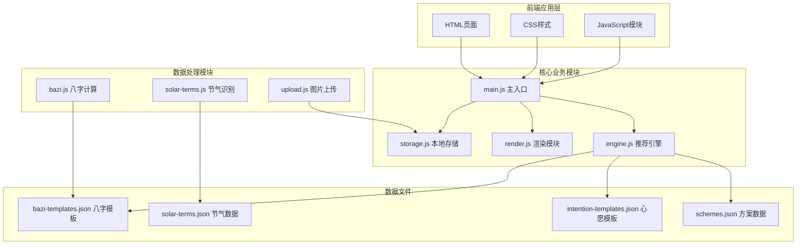
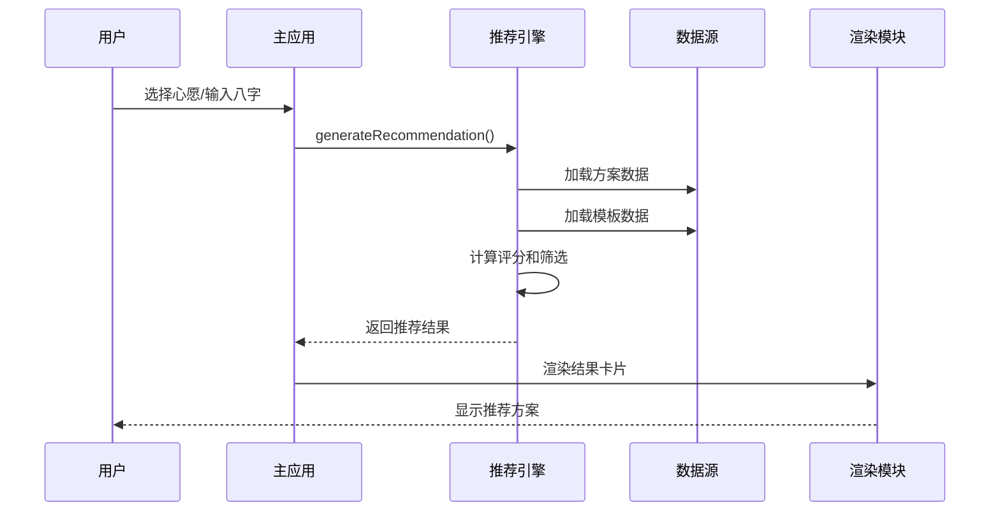
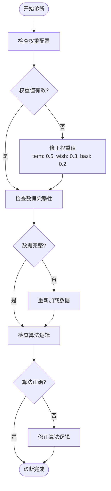
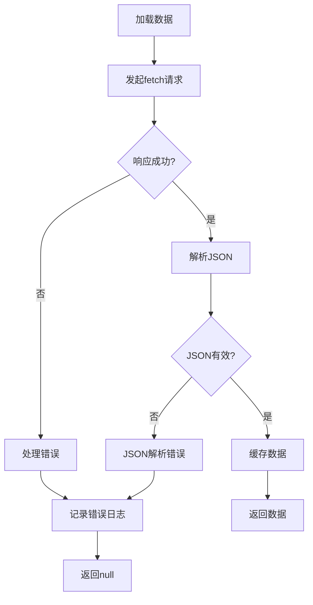
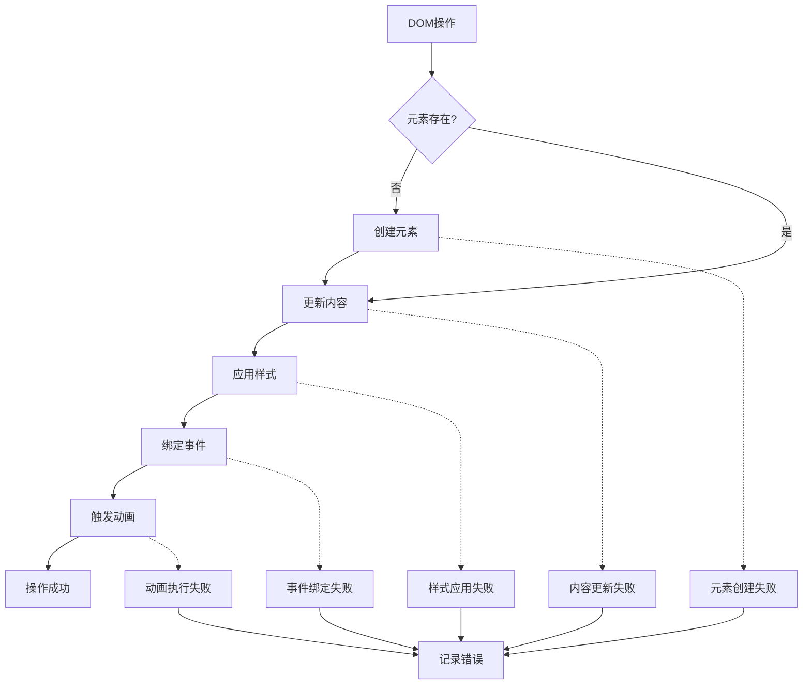
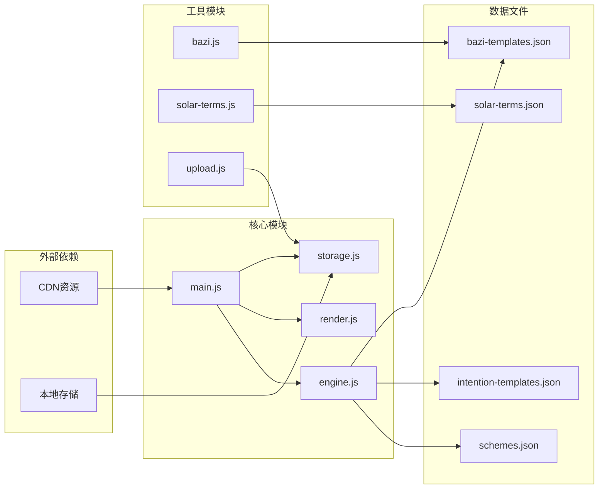

# 问题排查指南

## 目录
1. [简介](#简介)
2. [项目结构](#项目结构)
3. [核心组件](#核心组件)
4. [架构概览](#架构概览)
5. [详细组件分析](#详细组件分析)
6. [依赖关系分析](#依赖关系分析)
7. [性能考虑](#性能考虑)
8. [故障排查指南](#故障排查指南)
9. [结论](#结论)

## 简介

本文档为"五行穿搭建议"项目提供全面的问题排查指南。该项目是一个基于中国传统五行理论和二十四节气的个性化穿搭推荐应用，通过分析用户的生辰八字、当前节气和心愿，为用户提供符合时令和五行平衡的穿搭建议。

## 项目结构

项目采用模块化架构设计，主要包含以下核心模块：

**图表来源**
- [index.html](file://index.html#L1-L236)
- [js/main.js](file://js/main.js#L1-L317)
- [js/engine.js](file://js/engine.js#L1-L335)

**章节来源**
- [index.html](file://index.html#L1-L236)
- [js/main.js](file://js/main.js#L1-L317)

## 核心组件

### 主应用模块 (main.js)
负责应用的整体初始化、事件绑定和业务流程控制。主要功能包括：
- 应用启动和初始化
- 用户界面事件处理
- 数据持久化管理
- 推荐算法调用协调

### 推荐引擎模块 (engine.js)
实现核心推荐算法，包含：
- 数据加载和缓存机制
- 五行相生相克计算
- 方案评分和筛选逻辑
- 上下文构建和权重分配

### 渲染模块 (render.js)
负责用户界面的动态更新：
- 视图切换和显示控制
- DOM元素创建和更新
- 动画效果和交互反馈
- 模态框和提示信息管理

### 本地存储模块 (storage.js)
提供数据持久化功能：
- 本地存储封装
- 用户偏好保存
- 使用统计记录
- 数据清理和管理

**章节来源**
- [js/main.js](file://js/main.js#L1-L317)
- [js/engine.js](file://js/engine.js#L1-L335)
- [js/render.js](file://js/render.js#L1-L272)
- [js/storage.js](file://js/storage.js#L1-L116)

## 架构概览

系统采用分层架构设计，各模块职责明确，耦合度低：

**图表来源**
- [js/main.js](file://js/main.js#L202-L244)
- [js/engine.js](file://js/engine.js#L268-L310)

## 详细组件分析

### 推荐算法错误诊断

#### 算法参数检查
推荐算法的核心参数包括权重配置和评分规则：

**图表来源**
- [js/engine.js](file://js/engine.js#L157-L173)
- [js/engine.js](file://js/engine.js#L178-L199)

#### 数据验证流程
算法执行前的数据验证：

1. **方案数据验证**
   - 检查 `schemes.schemes` 数组是否存在
   - 验证每个方案的必需字段
   - 确认节气ID与当前节气匹配

2. **模板数据验证**
   - 验证心愿模板的完整性
   - 检查八字模板的匹配逻辑
   - 确认模板ID格式正确

3. **上下文构建验证**
   - 验证节气五行信息
   - 检查心愿ID映射
   - 确认八字分析结果

**章节来源**
- [js/engine.js](file://js/engine.js#L268-L310)
- [js/engine.js](file://js/engine.js#L281-L286)

### 数据加载异常处理

#### API调用失败诊断
数据加载模块的错误处理机制：

**图表来源**
- [js/engine.js](file://js/engine.js#L39-L49)
- [js/solar-terms.js](file://js/solar-terms.js#L18-L29)

#### 缓存问题诊断
数据缓存机制的故障排查：

1. **缓存状态检查**
   - 验证全局变量 `schemesData`、`intentionData`、`baziTemplateData`
   - 检查缓存是否过期或损坏
   - 确认缓存键值对正确性

2. **缓存失效策略**
   - 实现条件缓存（已加载则直接返回）
   - 处理缓存穿透问题
   - 管理内存使用

**章节来源**
- [js/engine.js](file://js/engine.js#L5-L7)
- [js/engine.js](file://js/engine.js#L39-L79)

### 用户界面问题修复

#### DOM操作错误诊断
渲染模块的DOM操作问题排查：

**图表来源**
- [js/render.js](file://js/render.js#L114-L127)
- [js/render.js](file://js/render.js#L132-L154)

#### 事件绑定问题诊断
事件处理机制的故障排查：

1. **事件监听器检查**
   - 验证事件绑定时机（DOM加载后）
   - 检查事件委托机制
   - 确认事件处理器参数正确

2. **模态框事件处理**
   - ESC键关闭功能
   - 点击背景关闭
   - 模态框层级管理

**章节来源**
- [js/main.js](file://js/main.js#L72-L153)
- [js/render.js](file://js/render.js#L198-L215)

## 依赖关系分析

系统模块间的依赖关系如下：

**图表来源**
- [js/main.js](file://js/main.js#L5-L15)
- [js/engine.js](file://js/engine.js#L1-L8)

**章节来源**
- [js/main.js](file://js/main.js#L5-L15)
- [js/engine.js](file://js/engine.js#L1-L8)

## 性能考虑

### 内存泄漏检测
潜在的内存泄漏风险点：

1. **事件监听器泄漏**
   - 检查是否正确移除事件监听器
   - 确认模态框关闭时清理事件

2. **DOM引用管理**
   - 避免循环引用
   - 及时清理大型对象引用

3. **缓存策略优化**
   - 实现LRU缓存淘汰
   - 控制缓存大小上限

### 渲染性能优化
渲染性能优化策略：

1. **批量DOM操作**
   - 使用DocumentFragment减少重排
   - 合并多个样式修改

2. **动画性能**
   - 使用transform替代top/left
   - 限制动画数量

3. **懒加载机制**
   - 图片懒加载
   - 模态框内容延迟加载

### 网络请求优化
网络请求优化方案：

1. **请求合并**
   - 使用Promise.all并发加载
   - 减少HTTP请求数量

2. **缓存策略**
   - 实现智能缓存
   - 处理缓存失效

3. **错误重试机制**
   - 实现指数退避重试
   - 提供降级方案

## 故障排查指南

### 推荐算法错误诊断

#### 常见算法问题及解决方案

**问题1：推荐结果为空**
- 检查 `schemes.schemes` 是否正确加载
- 验证 `selectSchemes` 函数逻辑
- 确认 `buildContext` 上下文构建

**问题2：推荐结果不符合预期**
- 检查权重分配是否合理
- 验证 `scoreScheme` 评分函数
- 确认 `isGenerating` 相生关系判断

**问题3：性能问题**
- 实现数据缓存机制
- 优化数组查找算法
- 减少不必要的DOM操作

#### 算法调试步骤
1. 在关键节点添加console.log输出
2. 验证输入参数的有效性
3. 检查中间结果的正确性
4. 确认最终输出格式

**章节来源**
- [js/engine.js](file://js/engine.js#L268-L334)

### 数据加载异常处理

#### API调用失败诊断

**问题1：数据加载超时**
- 检查网络连接状态
- 验证API端点可用性
- 实现超时重试机制

**问题2：JSON解析错误**
- 验证数据格式正确性
- 检查字符编码问题
- 确认跨域请求设置

**问题3：缓存失效**
- 实现缓存版本管理
- 添加缓存校验机制
- 处理缓存数据损坏

#### 数据加载调试
1. 检查fetch请求的响应状态
2. 验证JSON数据结构
3. 确认异步操作顺序
4. 实现错误回退机制

**章节来源**
- [js/engine.js](file://js/engine.js#L39-L79)
- [js/solar-terms.js](file://js/solar-terms.js#L18-L29)

### 用户界面问题修复

#### DOM操作错误诊断

**问题1：元素找不到**
- 检查DOM元素ID是否正确
- 验证元素是否已渲染
- 确认选择器语法正确

**问题2：样式应用失败**
- 检查CSS类名拼写
- 验证样式优先级
- 确认样式文件加载

**问题3：事件绑定无效**
- 验证事件监听器注册
- 检查事件冒泡机制
- 确认事件委托正确性

#### UI调试工具
1. 使用浏览器开发者工具
2. 检查元素属性和样式
3. 监控事件触发情况
4. 分析JavaScript执行栈

**章节来源**
- [js/render.js](file://js/render.js#L8-L16)
- [js/render.js](file://js/render.js#L114-L127)

### 性能问题排查

#### 内存泄漏检测

**检测方法：**
1. 使用Chrome DevTools Memory面板
2. 监控对象实例数量变化
3. 检查事件监听器数量
4. 分析垃圾回收效果

**预防措施：**
1. 实现组件销毁时的清理逻辑
2. 使用WeakMap避免循环引用
3. 及时移除事件监听器
4. 控制全局变量使用

#### 渲染性能优化

**性能监控：**
1. 使用Performance面板分析渲染时间
2. 检查重排和重绘频率
3. 监控JavaScript执行时间
4. 分析网络请求性能

**优化策略：**
1. 实现虚拟滚动
2. 使用requestAnimationFrame
3. 优化CSS选择器
4. 减少DOM操作次数

#### 网络请求优化

**监控指标：**
1. 请求响应时间
2. 数据传输大小
3. 缓存命中率
4. 错误率统计

**优化方案：**
1. 实现请求合并
2. 添加请求去重
3. 优化数据压缩
4. 实现智能缓存

### 错误日志分析方法

#### 日志记录策略
1. **结构化日志**
   - 使用统一的日志格式
   - 包含时间戳和模块信息
   - 记录关键参数和状态

2. **错误分类**
   - 区分不同类型的错误
   - 记录错误发生的具体位置
   - 跟踪错误发生的频率

3. **日志级别**
   - DEBUG：详细调试信息
   - INFO：一般运行信息
   - WARN：警告信息
   - ERROR：错误信息

#### 日志分析工具
1. **浏览器控制台**
   - 查看JavaScript错误
   - 监控网络请求
   - 分析性能指标

2. **服务器日志**
   - 分析API调用
   - 监控数据加载
   - 跟踪用户行为

### 用户反馈收集

#### 反馈收集机制
1. **内置反馈系统**
   - 提供反馈表单
   - 收集使用体验
   - 记录问题描述

2. **使用统计**
   - 统计功能使用频率
   - 监控错误发生率
   - 分析用户行为模式

3. **用户调研**
   - 设计问卷调查
   - 收集改进建议
   - 评估满意度

#### 反馈处理流程
1. **问题分类**
   - 技术问题 vs 功能问题
   - 紧急问题 vs 一般问题
   - 个人问题 vs 共性问题

2. **优先级排序**
   - 影响范围
   - 严重程度
   - 处理成本

3. **解决跟踪**
   - 分配责任人
   - 设置解决时限
   - 验证修复效果

### 问题重现步骤

#### 标准重现流程
1. **环境准备**
   - 确认浏览器版本
   - 检查网络连接
   - 准备测试数据

2. **操作步骤**
   - 详细记录每一步操作
   - 捕获错误信息
   - 截取相关截图

3. **验证结果**
   - 确认问题是否可重现
   - 记录期望结果
   - 对比实际结果

#### 调试信息收集
1. **浏览器信息**
   - 浏览器类型和版本
   - 操作系统信息
   - 插件和扩展列表

2. **应用状态**
   - 当前页面URL
   - 用户登录状态
   - 已保存的数据

3. **网络信息**
   - API请求详情
   - 响应状态码
   - 错误消息内容

### 预防性措施和错误恢复机制

#### 预防性措施
1. **代码质量保证**
   - 实施代码审查制度
   - 添加单元测试
   - 使用静态代码分析

2. **架构设计**
   - 实现容错设计
   - 添加降级机制
   - 优化错误处理

3. **监控告警**
   - 实施性能监控
   - 设置错误告警
   - 建立日志分析

#### 错误恢复机制
1. **自动恢复**
   - 实现重试机制
   - 添加超时处理
   - 确保幂等性

2. **手动恢复**
   - 提供重置功能
   - 支持数据导入导出
   - 实现紧急修复通道

3. **灾难恢复**
   - 实现数据备份
   - 建立应急响应
   - 制定恢复计划

## 结论

本问题排查指南涵盖了"五行穿搭建议"项目的主要技术问题和解决方案。通过系统化的故障诊断方法、性能优化策略和预防性措施，可以有效提升应用的稳定性和用户体验。

关键要点包括：
- 建立完善的错误日志和监控体系
- 实施分层次的故障排查流程
- 采用性能优化的最佳实践
- 建立用户反馈和问题追踪机制
- 制定预防性维护和应急响应计划

建议团队定期回顾和更新这些指南，结合实际使用情况不断改进故障排查效率和问题解决质量。