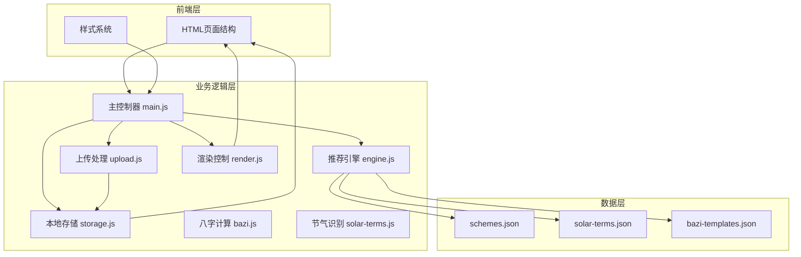
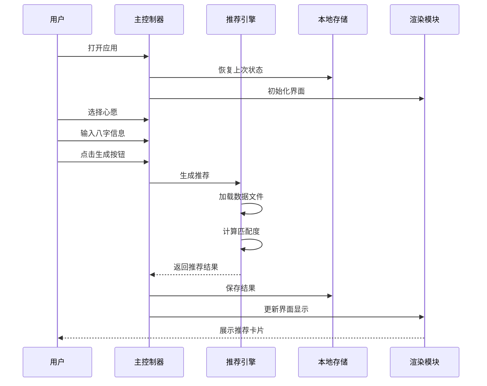
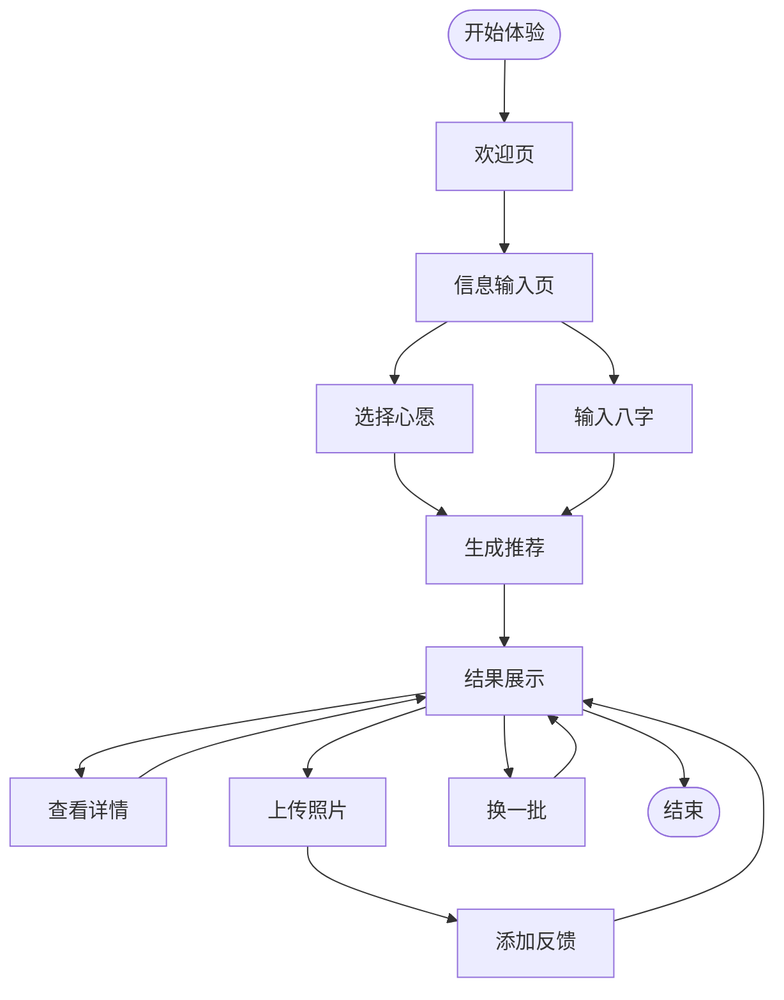
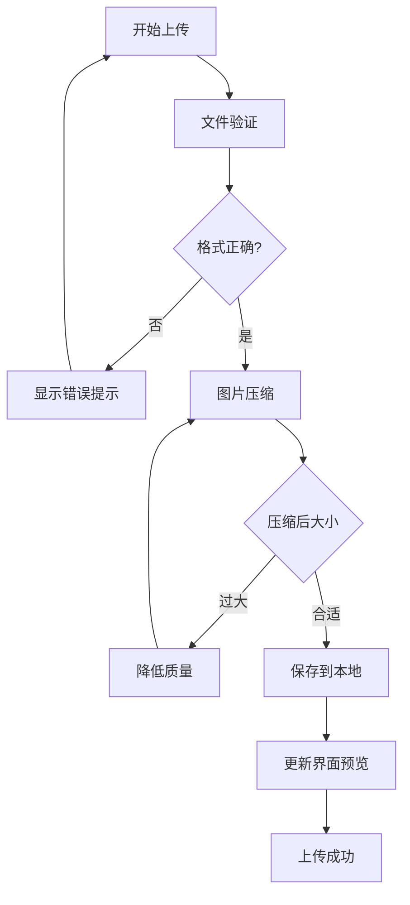
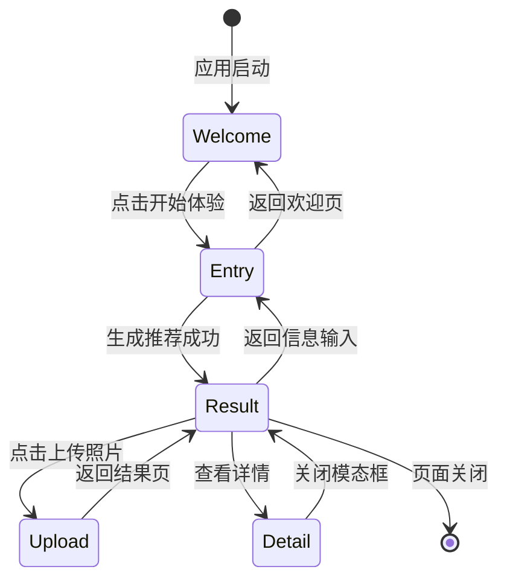
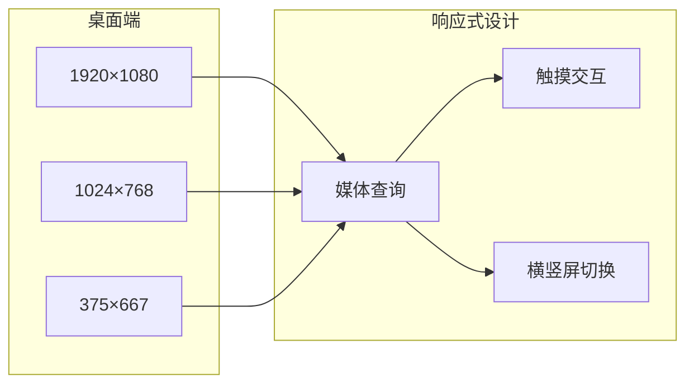
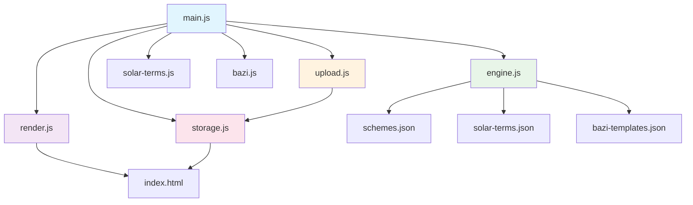

# 集成测试策略

<cite>
**本文档引用的文件**
- [index.html](file://index.html)
- [main.js](file://js/main.js)
- [engine.js](file://js/engine.js)
- [upload.js](file://js/upload.js)
- [render.js](file://js/render.js)
- [storage.js](file://js/storage.js)
- [bazi.js](file://js/bazi.js)
- [solar-terms.js](file://js/solar-terms.js)
- [schemes.json](file://data/schemes.json)
- [solar-terms.json](file://data/solar-terms.json)
- [bazi-templates.json](file://data/bazi-templates.json)
</cite>

## 目录
1. [简介](#简介)
2. [项目结构](#项目结构)
3. [核心组件](#核心组件)
4. [架构概览](#架构概览)
5. [详细组件分析](#详细组件分析)
6. [依赖关系分析](#依赖关系分析)
7. [性能考虑](#性能考虑)
8. [故障排除指南](#故障排除指南)
9. [结论](#结论)

## 简介

本文档为"五行穿搭建议"项目制定全面的集成测试策略指南。该项目是一个基于中国传统五行理论和二十四节气文化的个性化穿搭推荐应用，采用纯前端技术栈实现，无需服务器端支持。

项目主要功能包括：
- 信息输入流程（心愿选择、生辰八字输入）
- 穿搭推荐生成（基于节气、心愿、八字的智能匹配）
- 结果展示与详情查看
- 穿搭照片上传与反馈
- 本地数据持久化

## 项目结构

项目采用模块化架构设计，主要分为以下层次：

**图表来源**
- [index.html](file://index.html#L1-L236)
- [main.js](file://js/main.js#L1-L317)
- [engine.js](file://js/engine.js#L1-L335)

**章节来源**
- [index.html](file://index.html#L1-L236)
- [main.js](file://js/main.js#L1-L317)

## 核心组件

### 主控制器模块 (main.js)
负责应用的整体协调和状态管理，包含以下关键功能：
- 应用初始化和生命周期管理
- 用户界面事件绑定和处理
- 数据流协调和业务逻辑调度
- 状态持久化和恢复机制

### 推荐引擎模块 (engine.js)
实现核心的推荐算法，包括：
- 方案数据加载和缓存
- 五行相生相克关系计算
- 心愿模板匹配算法
- 八字模板匹配逻辑
- 推荐方案评分和选择

### 上传处理模块 (upload.js)
提供完整的图片上传功能：
- 文件格式和大小验证
- 图片压缩和优化
- 拖拽上传支持
- 键盘无障碍访问

### 渲染控制模块 (render.js)
负责用户界面的动态更新：
- 视图切换和状态管理
- DOM元素创建和更新
- 动画效果和过渡
- 模态框和提示系统

**章节来源**
- [main.js](file://js/main.js#L1-L317)
- [engine.js](file://js/engine.js#L1-L335)
- [upload.js](file://js/upload.js#L1-L145)
- [render.js](file://js/render.js#L1-L272)

## 架构概览

项目采用事件驱动的单页应用架构，所有功能都在客户端完成，无需服务器端支持。

**图表来源**
- [main.js](file://js/main.js#L202-L244)
- [engine.js](file://js/engine.js#L268-L310)
- [render.js](file://js/render.js#L114-L127)

## 详细组件分析

### 用户工作流测试策略

#### 完整推荐流程测试

**测试场景覆盖**：
1. **基础推荐流程**：无心愿、无八字的默认推荐
2. **心愿推荐流程**：选择不同心愿的推荐差异
3. **八字推荐流程**：输入完整八字信息的精准推荐
4. **组合推荐流程**：心愿+八字+节气的综合推荐

#### 上传功能测试策略

**测试场景覆盖**：
1. **文件验证测试**：支持格式、大小限制
2. **压缩处理测试**：质量控制、尺寸优化
3. **存储验证测试**：本地存储、数据完整性
4. **预览更新测试**：界面响应、状态同步

#### 多视图切换测试策略

**测试场景覆盖**：
1. **视图切换测试**：前进、后退按钮功能
2. **状态保持测试**：页面切换后的数据保留
3. **键盘导航测试**：Tab键、Enter键等无障碍访问
4. **模态框测试**：详情弹窗的打开关闭

**章节来源**
- [main.js](file://js/main.js#L72-L153)
- [upload.js](file://js/upload.js#L12-L82)
- [render.js](file://js/render.js#L8-L16)

### 跨浏览器兼容性测试

#### 浏览器功能一致性验证

| 功能特性 | Chrome | Firefox | Safari | Edge |
|---------|--------|---------|--------|------|
| ES6模块导入 | ✅ | ✅ | ✅ | ✅ |
| Canvas图像处理 | ✅ | ✅ | ✅ | ✅ |
| LocalStorage API | ✅ | ✅ | ✅ | ✅ |
| FileReader API | ✅ | ✅ | ✅ | ✅ |
| Fetch API | ✅ | ✅ | ✅ | ✅ |
| Drag & Drop | ✅ | ✅ | ✅ | ✅ |
| Web Animations | ✅ | ❌ | ✅ | ✅ |

#### 移动端适配测试

**测试要点**：
1. **断点测试**：768px、1024px、1440px等关键断点
2. **触摸测试**：点击、长按、滑动等手势操作
3. **屏幕旋转**：横屏、竖屏状态下的布局变化
4. **字体缩放**：iOS的动态字体大小设置

## 依赖关系分析

项目模块间的依赖关系呈现清晰的单向依赖结构：

**图表来源**
- [main.js](file://js/main.js#L5-L15)
- [engine.js](file://js/engine.js#L39-L79)

**章节来源**
- [main.js](file://js/main.js#L5-L15)
- [engine.js](file://js/engine.js#L39-L79)

## 性能考虑

### 加载性能优化

1. **资源懒加载**：数据文件按需加载，避免阻塞首屏
2. **缓存策略**：推荐数据缓存，减少重复请求
3. **图片优化**：压缩处理，控制带宽占用
4. **DOM操作优化**：批量更新，减少重排重绘

### 内存管理

1. **事件监听器清理**：页面切换时移除监听器
2. **大对象释放**：推荐结果对象的及时清理
3. **图片内存管理**：预览图片的及时释放

## 故障排除指南

### 常见问题诊断

#### 推荐生成失败
- 检查网络连接和数据文件加载
- 验证输入参数的有效性
- 查看控制台错误信息

#### 上传功能异常
- 确认文件格式和大小限制
- 检查浏览器兼容性
- 验证本地存储权限

#### 界面显示问题
- 检查CSS样式加载
- 验证DOM元素存在性
- 确认事件绑定状态

**章节来源**
- [main.js](file://js/main.js#L274-L292)
- [engine.js](file://js/engine.js#L42-L48)

## 结论

本集成测试策略为"五行穿搭建议"项目提供了全面的质量保证框架。通过覆盖用户工作流、功能模块、跨浏览器兼容性和性能测试，确保应用在各种使用场景下都能提供稳定可靠的用户体验。

关键测试要点包括：
- 完整的用户旅程测试，从欢迎页到结果展示
- 关键功能的边界条件和异常处理测试
- 多浏览器和移动设备的兼容性验证
- 性能指标监控和优化建议
- 自动化测试脚本的编写和维护

建议在持续集成环境中实施这些测试策略，确保每次代码变更都不会影响现有功能的稳定性。