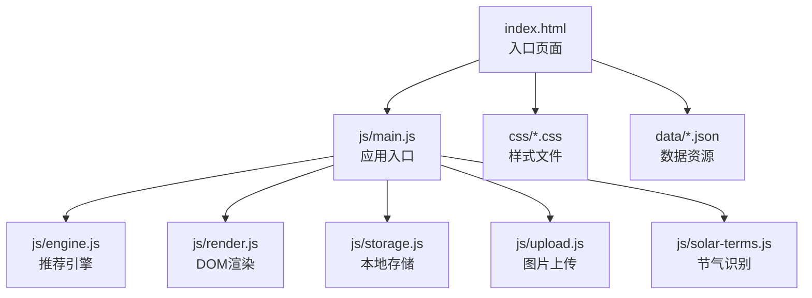
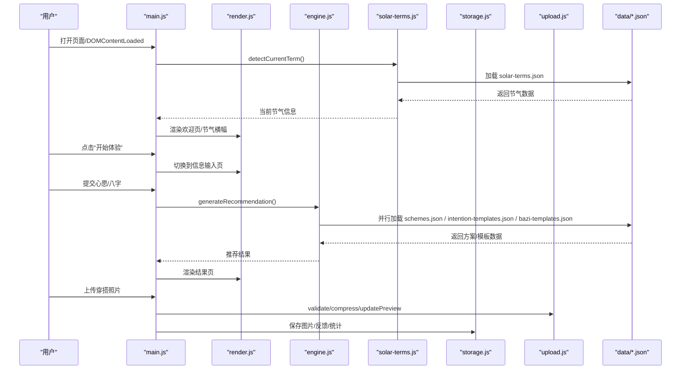
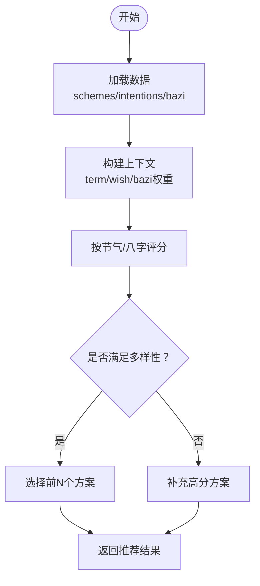
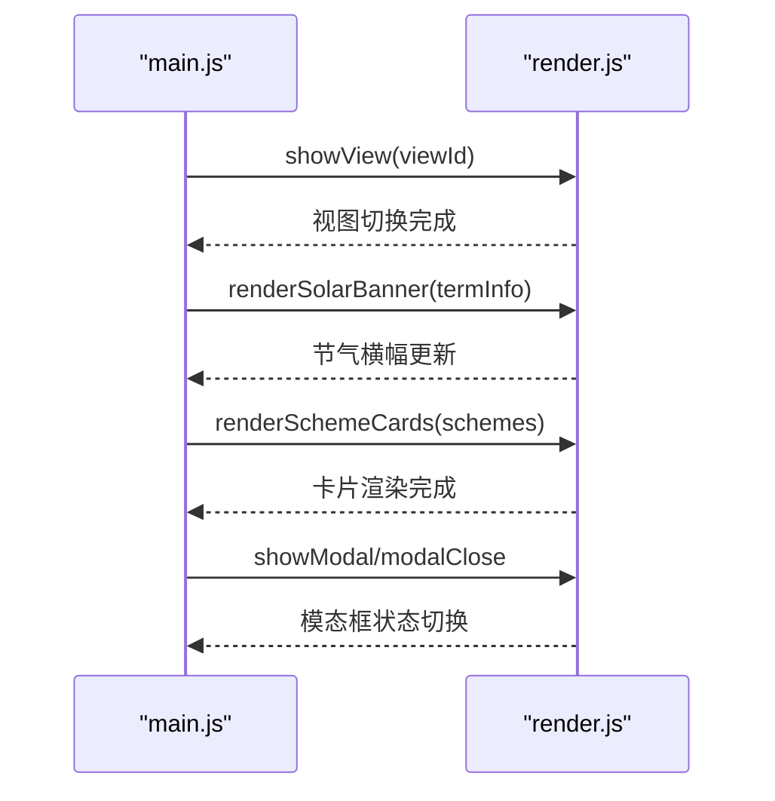
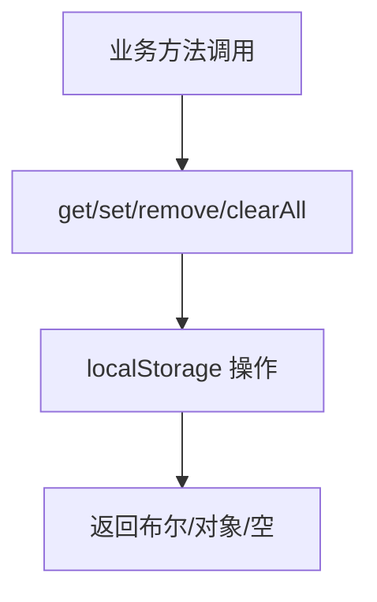
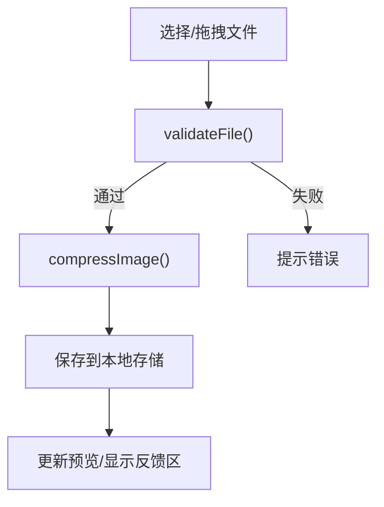
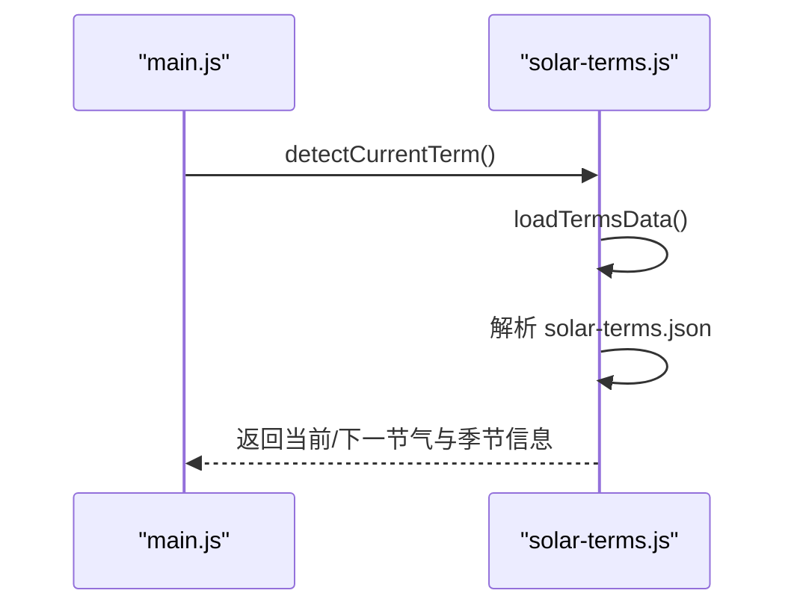
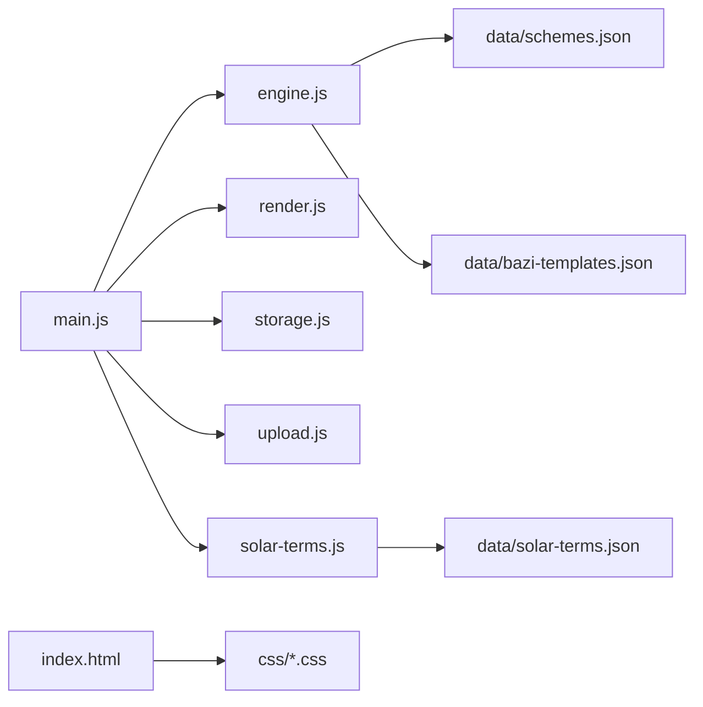

# 部署指南

<cite>
**本文档引用的文件**
- [index.html](file://index.html)
- [main.js](file://js/main.js)
- [engine.js](file://js/engine.js)
- [render.js](file://js/render.js)
- [storage.js](file://js/storage.js)
- [upload.js](file://js/upload.js)
- [solar-terms.js](file://js/solar-terms.js)
- [tokens.css](file://css/tokens.css)
- [base.css](file://css/base.css)
- [layout.css](file://css/layout.css)
- [components.css](file://css/components.css)
- [animations.css](file://css/animations.css)
- [schemes.json](file://data/schemes.json)
- [bazi-templates.json](file://data/bazi-templates.json)
- [solar-terms.json](file://data/solar-terms.json)
</cite>

## 目录
1. [简介](#简介)
2. [项目结构](#项目结构)
3. [核心组件](#核心组件)
4. [架构总览](#架构总览)
5. [详细组件分析](#详细组件分析)
6. [依赖分析](#依赖分析)
7. [性能考虑](#性能考虑)
8. [故障排查指南](#故障排查指南)
9. [结论](#结论)
10. [附录](#附录)

## 简介
本指南面向“五行穿搭建议”静态网站的生产部署，覆盖以下主题：
- 静态网站托管平台最佳实践（GitHub Pages、Netlify、Vercel）
- 域名与 HTTPS、CDN 加速配置
- 构建优化策略（CSS/JS 压缩、图片优化、缓存策略）
- 环境变量与配置文件处理
- 部署自动化（CI/CD）、自动测试与发布
- 部署后的性能监控与错误追踪
- 备份策略、版本管理与回滚机制

## 项目结构
该项目为纯前端静态站点，包含 HTML、CSS、JavaScript 与数据资源，适合直接部署到任意静态托管平台。

图表来源
- [index.html](file://index.html#L1-L236)
- [main.js](file://js/main.js#L1-L317)
- [engine.js](file://js/engine.js#L1-L335)
- [render.js](file://js/render.js#L1-L272)
- [storage.js](file://js/storage.js#L1-L116)
- [upload.js](file://js/upload.js#L1-L145)
- [solar-terms.js](file://js/solar-terms.js#L1-L118)

章节来源
- [index.html](file://index.html#L1-L236)
- [tokens.css](file://css/tokens.css#L1-L109)
- [base.css](file://css/base.css#L1-L168)
- [layout.css](file://css/layout.css#L1-L252)
- [components.css](file://css/components.css#L1-L338)
- [animations.css](file://css/animations.css#L1-L207)
- [schemes.json](file://data/schemes.json#L1-L509)
- [bazi-templates.json](file://data/bazi-templates.json#L1-L103)
- [solar-terms.json](file://data/solar-terms.json)

## 核心组件
- 应用入口与路由控制：通过视图切换实现多页面体验（欢迎页、信息输入、结果页、上传页、详情模态框）
- 推荐引擎：根据节气、心愿、八字综合评分，筛选最优穿搭方案
- 数据加载：异步加载 JSON 数据资源，包含节气、方案、模板等
- 本地存储：使用 localStorage 缓存用户选择、结果、反馈与上传图片
- 上传与压缩：前端图片验证、压缩与预览，支持拖拽与键盘操作
- 样式体系：设计令牌、基础样式、布局、组件与动画，响应式适配

章节来源
- [main.js](file://js/main.js#L1-L317)
- [engine.js](file://js/engine.js#L1-L335)
- [render.js](file://js/render.js#L1-L272)
- [storage.js](file://js/storage.js#L1-L116)
- [upload.js](file://js/upload.js#L1-L145)
- [solar-terms.js](file://js/solar-terms.js#L1-L118)

## 架构总览
下图展示从浏览器到数据源的请求链路与模块交互：

图表来源
- [main.js](file://js/main.js#L1-L317)
- [engine.js](file://js/engine.js#L1-L335)
- [render.js](file://js/render.js#L1-L272)
- [solar-terms.js](file://js/solar-terms.js#L1-L118)
- [storage.js](file://js/storage.js#L1-L116)
- [upload.js](file://js/upload.js#L1-L145)
- [schemes.json](file://data/schemes.json#L1-L509)
- [bazi-templates.json](file://data/bazi-templates.json#L1-L103)
- [solar-terms.json](file://data/solar-terms.json)

## 详细组件分析

### 推荐引擎（engine.js）
- 数据加载：并行加载方案、心愿模板、八字模板，提升首屏性能
- 上下文构建：融合节气、心愿、八字权重，形成推荐上下文
- 评分与选择：依据五行相生关系与节气距离打分，保证多样性与相关性
- 重新生成：支持排除已选项，实现“换一批”

图表来源
- [engine.js](file://js/engine.js#L268-L334)

章节来源
- [engine.js](file://js/engine.js#L1-L335)

### 视图与渲染（render.js）
- 视图切换：隐藏/显示对应 section，实现 SPA 式导航
- 节气横幅：动态展示当前节气与五行属性
- 方案卡片：渲染色彩条、关键词、注解与典籍出处
- 模态框：详情展示，支持 ESC 关闭与点击遮罩关闭
- 上传预览：切换占位与预览状态，联动反馈区显示

图表来源
- [render.js](file://js/render.js#L1-L272)

章节来源
- [render.js](file://js/render.js#L1-L272)

### 本地存储（storage.js）
- 前缀化键名，避免命名冲突
- 支持用户偏好（心愿、八字）、推荐结果、反馈、上传图片、使用统计
- 提供批量清理与按前缀查询能力

图表来源
- [storage.js](file://js/storage.js#L1-L116)

章节来源
- [storage.js](file://js/storage.js#L1-L116)

### 图片上传与压缩（upload.js）
- 文件校验：类型、大小限制
- 压缩策略：限定最大边长，目标压缩大小，逐步降低质量
- 上传区域：点击、拖拽、键盘激活，支持重复选择同一文件
- 日期键：按当日日期作为键存储上传结果

图表来源
- [upload.js](file://js/upload.js#L1-L145)

章节来源
- [upload.js](file://js/upload.js#L1-L145)

### 节气识别（solar-terms.js）
- UTC+8 时间转换
- 加载节气数据，定位当前节气与下一节气
- 提供五行颜色映射与名称

图表来源
- [solar-terms.js](file://js/solar-terms.js#L1-L118)

章节来源
- [solar-terms.js](file://js/solar-terms.js#L1-L118)

## 依赖分析
- 模块耦合
  - main.js 作为入口，聚合 storage、solar-terms、engine、render、upload 的功能
  - engine.js 依赖 data/*.json 与 solar-terms.js 的节气信息
  - render.js 依赖 tokens.css 的设计令牌与布局组件样式
  - storage.js 与 upload.js 依赖 localStorage API
- 外部依赖
  - 字体资源通过 CDN 引入，需关注网络可用性与隐私合规
- 数据依赖
  - schemes.json、bazi-templates.json、solar-terms.json 为关键数据源，部署时需确保路径一致

图表来源
- [main.js](file://js/main.js#L1-L317)
- [engine.js](file://js/engine.js#L1-L335)
- [render.js](file://js/render.js#L1-L272)
- [storage.js](file://js/storage.js#L1-L116)
- [upload.js](file://js/upload.js#L1-L145)
- [solar-terms.js](file://js/solar-terms.js#L1-L118)
- [index.html](file://index.html#L1-L236)
- [schemes.json](file://data/schemes.json#L1-L509)
- [bazi-templates.json](file://data/bazi-templates.json#L1-L103)
- [solar-terms.json](file://data/solar-terms.json)

章节来源
- [main.js](file://js/main.js#L1-L317)
- [engine.js](file://js/engine.js#L1-L335)
- [render.js](file://js/render.js#L1-L272)
- [storage.js](file://js/storage.js#L1-L116)
- [upload.js](file://js/upload.js#L1-L145)
- [solar-terms.js](file://js/solar-terms.js#L1-L118)
- [index.html](file://index.html#L1-L236)

## 性能考虑
- 构建优化
  - CSS：合并并压缩 tokens.css、base.css、layout.css、components.css、animations.css；启用 CSS 去空白与最小化
  - JavaScript：打包 main.js 与子模块，启用 Tree Shaking；对第三方 CDN 资源使用预连接与跨域策略
  - 图片：上传前压缩，部署时可引入 WebP/JPEG XL 转换与懒加载
- 缓存策略
  - HTML/CSS/JS 设置较长缓存（immutable 或版本化 URL）
  - JSON 数据设置合理 Cache-Control（如 no-cache 或协商缓存）
  - 图片设置短期缓存并开启 ETag/Last-Modified
- CDN 加速
  - 使用就近边缘节点，启用 Gzip/Brotli 压缩
  - 对字体与图片资源使用专用域名，减少 Cookie 开销
- 用户体验
  - 骨架屏与渐进增强，减少首屏等待
  - 减少重排重绘，使用 transform/opacity 动画

## 故障排查指南
- 页面空白或脚本报错
  - 检查 data/*.json 是否正确加载（跨域/路径）
  - 确认字体 CDN 可达性与预连接配置
- 推荐结果为空
  - 核对 schemes.json 结构与字段一致性
  - 检查 generateRecommendation 的 Promise 并行加载是否全部成功
- 上传失败
  - 检查 validateFile 的类型与大小限制
  - 确认 localStorage 容量与权限
- 本地存储异常
  - 使用 storage.js 的 get/set/remove 测试键值存取
  - 如遇异常，清理前缀键或执行 clearAll

章节来源
- [engine.js](file://js/engine.js#L268-L334)
- [upload.js](file://js/upload.js#L1-L145)
- [storage.js](file://js/storage.js#L1-L116)

## 结论
本项目为纯前端静态应用，部署成本低、扩展性强。通过合理的构建优化、CDN 加速与缓存策略，可在多平台上实现快速、稳定的生产部署。配合 CI/CD 自动化与监控告警，可进一步提升交付效率与运维可靠性。

## 附录

### 静态网站托管平台配置要点
- GitHub Pages
  - 仓库设置 → Pages → 选择分支与目录
  - 自定义域名：在 CNAME 文件与 DNS 记录中配置
  - HTTPS：启用 GitHub Pages 自动证书
- Netlify/Vercel
  - 选择“部署新站点”，关联仓库
  - 配置构建命令与输出目录
  - 自定义域名与强制 HTTPS
  - CDN 加速与缓存头设置

### 域名与 HTTPS
- 域名解析：A/AAAA 记录指向平台提供的地址或 CNAME 指向平台域名
- HTTPS：平台自动签发与续期证书；必要时启用 HSTS
- CDN：开启全球加速与安全防护

### 构建与缓存策略
- CSS/JS：启用压缩与去空白；对静态资源添加哈希后缀
- 图片：WebP/JXL 转换、懒加载、响应式尺寸
- 缓存：HTML/CSS/JS 长缓存；JSON 数据短缓存或协商缓存

### 环境变量与配置文件
- 本项目未使用环境变量，数据通过 data/*.json 提供
- 若未来引入外部 API，建议通过平台的环境变量注入与密钥管理服务

### 部署自动化（CI/CD）
- 触发条件：push 到主分支或创建标签
- 步骤：安装依赖、构建、测试、部署到目标平台
- 发布：自动发布到 staging，人工批准后发布到 production

### 性能监控与错误追踪
- 性能：使用平台自带分析或集成 Web Vitals
- 错误：接入错误上报 SDK，记录用户行为与堆栈
- 日志：统一收集前端错误与网络异常

### 备份、版本与回滚
- 备份：定期导出数据与构建产物
- 版本：使用 Git 标签与语义化版本
- 回滚：平台支持一键回滚至上一版本；生产变更采用灰度发布