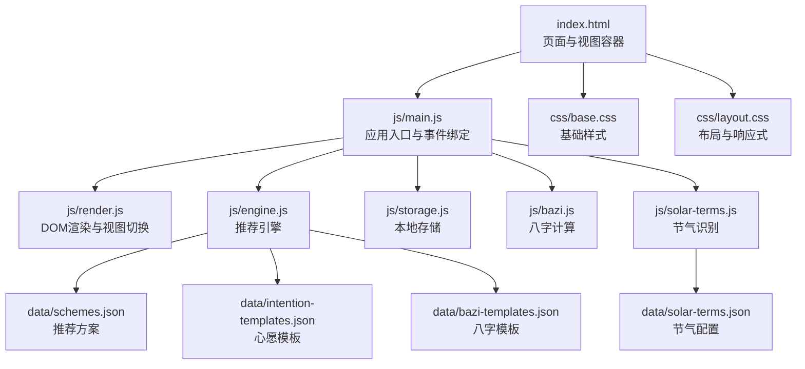
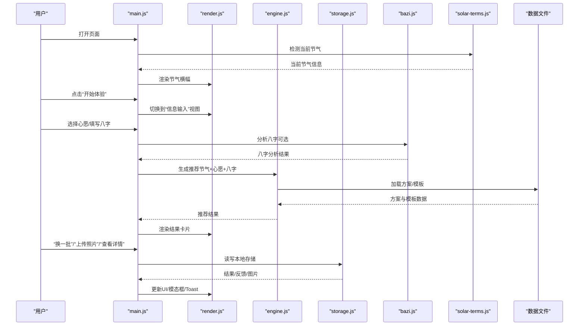
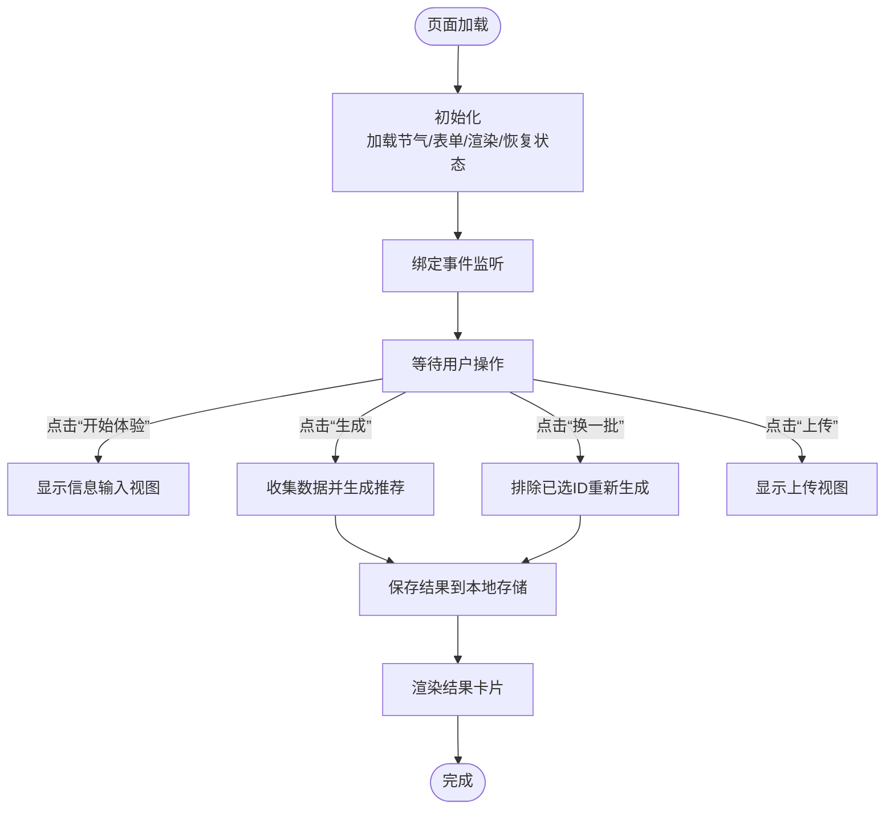
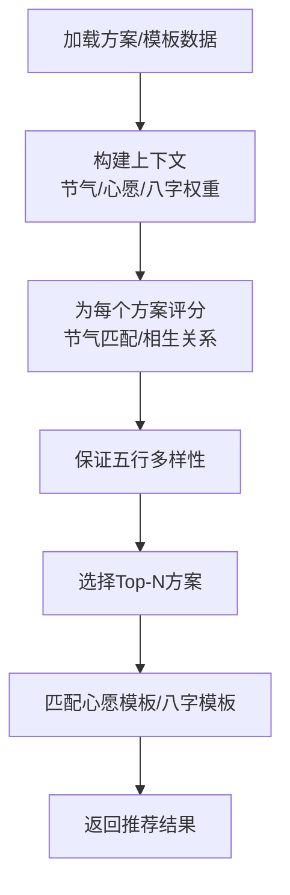
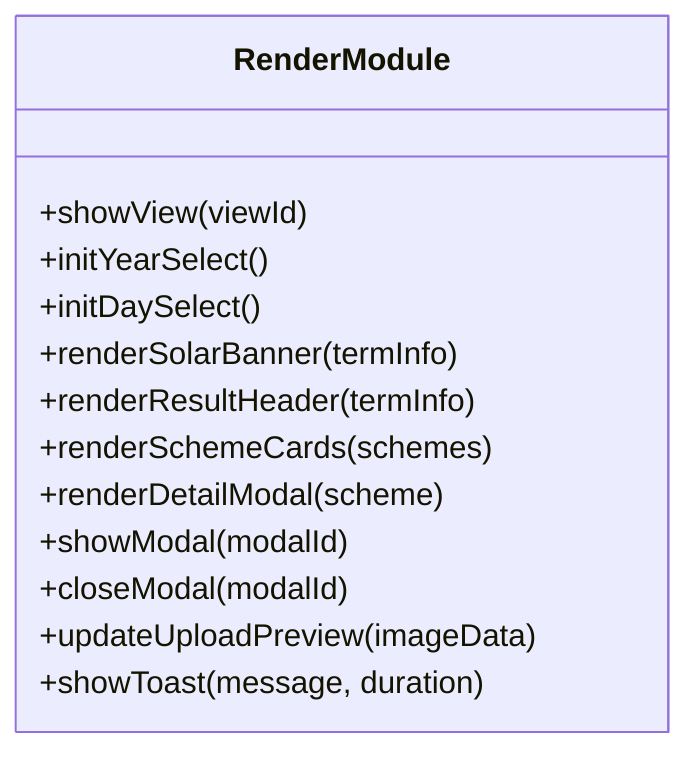
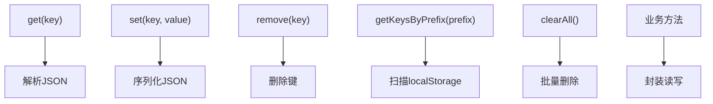
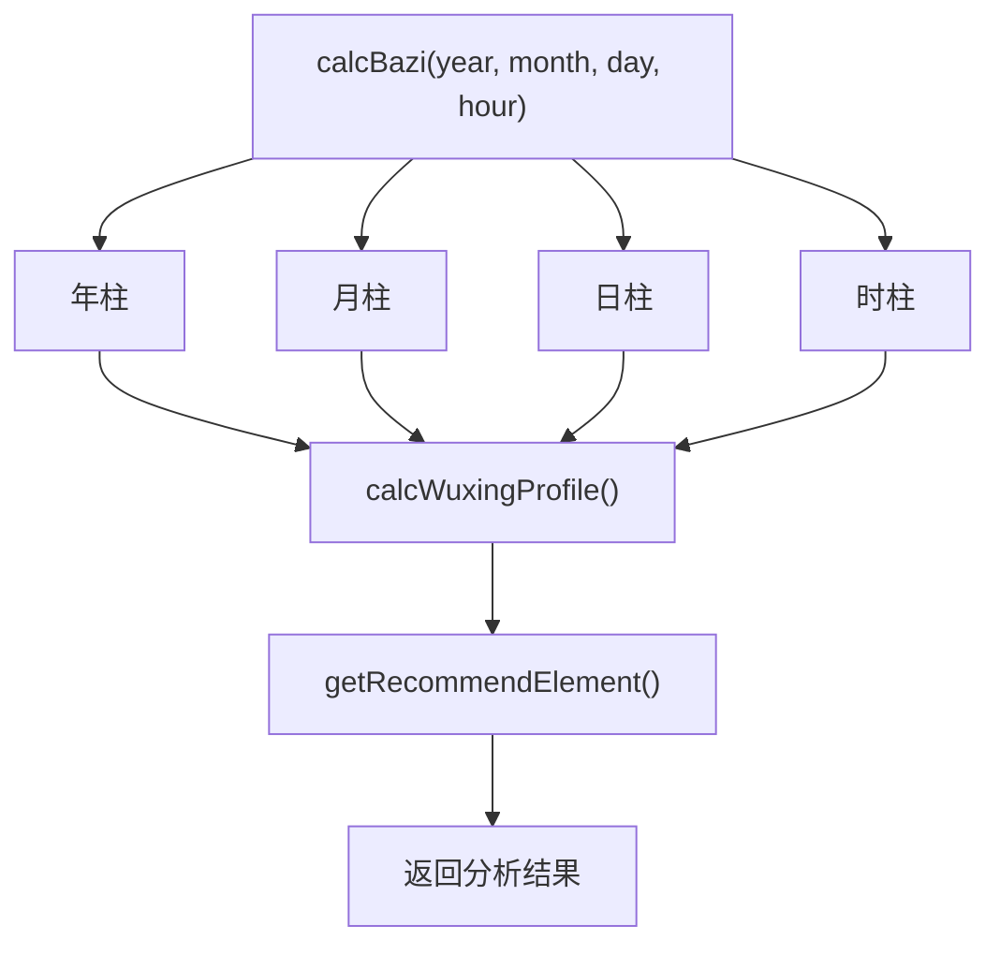
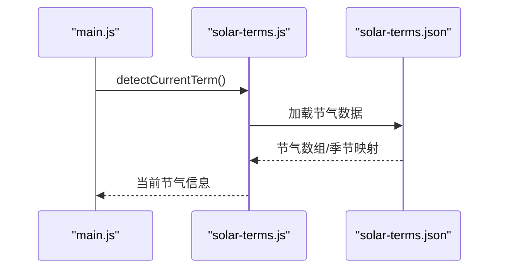
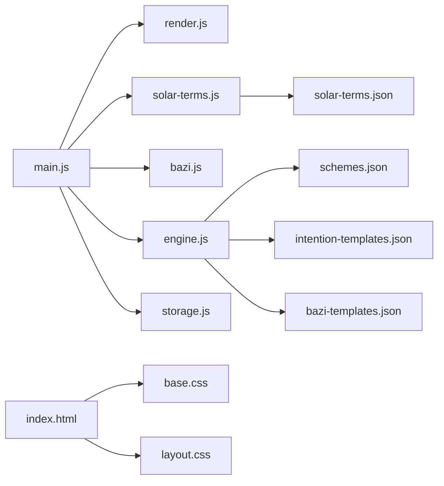

# 快速开始

<cite>
**本文引用的文件**
- [index.html](file://index.html)
- [main.js](file://js/main.js)
- [engine.js](file://js/engine.js)
- [render.js](file://js/render.js)
- [storage.js](file://js/storage.js)
- [bazi.js](file://js/bazi.js)
- [solar-terms.js](file://js/solar-terms.js)
- [schemes.json](file://data/schemes.json)
- [intention-templates.json](file://data/intention-templates.json)
- [bazi-templates.json](file://data/bazi-templates.json)
- [solar-terms.json](file://data/solar-terms.json)
- [base.css](file://css/base.css)
- [layout.css](file://css/layout.css)
</cite>

## 目录
1. [简介](#简介)
2. [项目结构](#项目结构)
3. [核心组件](#核心组件)
4. [架构总览](#架构总览)
5. [详细组件分析](#详细组件分析)
6. [依赖关系分析](#依赖关系分析)
7. [性能考虑](#性能考虑)
8. [故障排查指南](#故障排查指南)
9. [结论](#结论)
10. [附录](#附录)

## 简介
本项目是一个“五行穿搭建议”应用，基于二十四节气与传统五行理论，为用户提供每日穿搭推荐。用户可选择心愿（如求职顺利、贵人运、远行顺利、静心专注、健康舒畅），输入生辰八字（可选），系统将结合节气、心愿与个人五行，生成3套推荐方案，并支持“换一批”、上传穿搭照片与记录反馈。

- 新手用户可在5分钟内完成首次使用体验：打开页面、选择心愿、输入生辰八字（可跳过）、查看推荐、上传照片并记录反馈。
- 开发者可在30分钟内理解项目架构与关键模块，开始定制开发。

## 项目结构
项目采用前端单页应用（SPA）结构，资源组织清晰：
- HTML 页面定义视图与交互元素
- JS 模块化拆分：入口、引擎、渲染、存储、八字、节气识别
- 数据文件：推荐方案、心愿模板、八字模板、节气配置
- CSS 分层样式：基础、布局、组件、动画等

图表来源
- [index.html](file://index.html#L20-L236)
- [main.js](file://js/main.js#L1-L317)
- [engine.js](file://js/engine.js#L1-L335)
- [render.js](file://js/render.js#L1-L272)
- [storage.js](file://js/storage.js#L1-L116)
- [bazi.js](file://js/bazi.js#L1-L193)
- [solar-terms.js](file://js/solar-terms.js#L1-L118)
- [schemes.json](file://data/schemes.json#L1-L509)
- [intention-templates.json](file://data/intention-templates.json#L1-L253)
- [bazi-templates.json](file://data/bazi-templates.json#L1-L103)
- [solar-terms.json](file://data/solar-terms.json#L1-L42)
- [base.css](file://css/base.css#L1-L168)
- [layout.css](file://css/layout.css#L1-L252)

章节来源
- [index.html](file://index.html#L20-L236)
- [main.js](file://js/main.js#L1-L317)
- [engine.js](file://js/engine.js#L1-L335)
- [render.js](file://js/render.js#L1-L272)
- [storage.js](file://js/storage.js#L1-L116)
- [bazi.js](file://js/bazi.js#L1-L193)
- [solar-terms.js](file://js/solar-terms.js#L1-L118)
- [schemes.json](file://data/schemes.json#L1-L509)
- [intention-templates.json](file://data/intention-templates.json#L1-L253)
- [bazi-templates.json](file://data/bazi-templates.json#L1-L103)
- [solar-terms.json](file://data/solar-terms.json#L1-L42)
- [base.css](file://css/base.css#L1-L168)
- [layout.css](file://css/layout.css#L1-L252)

## 核心组件
- 应用入口与控制流：负责初始化、事件绑定、视图切换、业务流程编排
- 推荐引擎：加载数据、构建上下文、评分与筛选方案
- 渲染模块：视图切换、卡片渲染、模态框、Toast提示
- 本地存储：持久化用户选择、结果、反馈、上传图片与使用统计
- 八字模块：简化版八字计算、五行分布统计、推荐元素
- 节气模块：加载节气配置、检测当前节气、获取五行颜色

章节来源
- [main.js](file://js/main.js#L1-L317)
- [engine.js](file://js/engine.js#L1-L335)
- [render.js](file://js/render.js#L1-L272)
- [storage.js](file://js/storage.js#L1-L116)
- [bazi.js](file://js/bazi.js#L1-L193)
- [solar-terms.js](file://js/solar-terms.js#L1-L118)

## 架构总览
应用采用模块化与数据驱动的设计：
- 视图层：HTML 定义视图与交互元素，JS 控制显示隐藏与内容更新
- 业务层：引擎模块负责数据加载、上下文构建、评分与筛选
- 数据层：JSON 文件提供推荐方案、心愿模板、八字模板与节气配置
- 存储层：localStorage 提供本地持久化能力
- 工具层：节气识别与八字计算作为独立工具模块

图表来源
- [main.js](file://js/main.js#L26-L67)
- [render.js](file://js/render.js#L8-L16)
- [engine.js](file://js/engine.js#L268-L310)
- [storage.js](file://js/storage.js#L52-L115)
- [bazi.js](file://js/bazi.js#L182-L192)
- [solar-terms.js](file://js/solar-terms.js#L36-L103)
- [schemes.json](file://data/schemes.json#L1-L509)
- [intention-templates.json](file://data/intention-templates.json#L1-L253)
- [bazi-templates.json](file://data/bazi-templates.json#L1-L103)

## 详细组件分析

### 应用入口与控制流（main.js）
- 初始化：加载节气、初始化表单、渲染节气横幅、恢复上次选择与八字、绑定事件、初始化上传区域、统计访问
- 事件处理：开始体验、返回、心愿选择、生成推荐、换一批、上传、移除图片、保存反馈、详情模态框
- 流程控制：收集表单数据、调用分析与生成函数、渲染结果、本地存储、Toast提示

图表来源
- [main.js](file://js/main.js#L26-L67)
- [main.js](file://js/main.js#L72-L153)
- [main.js](file://js/main.js#L202-L244)
- [main.js](file://js/main.js#L249-L269)
- [main.js](file://js/main.js#L105-L124)

章节来源
- [main.js](file://js/main.js#L1-L317)

### 推荐引擎（engine.js）
- 数据加载：异步加载方案、心愿模板、八字模板
- 上下文构建：节气五行权重、心愿权重、八字权重
- 评分与筛选：按节气匹配度、相生关系、多样性保证进行打分与选择
- 模板匹配：按心愿与节气匹配最佳模板，按日主最强元素匹配八字模板

图表来源
- [engine.js](file://js/engine.js#L268-L310)
- [engine.js](file://js/engine.js#L157-L173)
- [engine.js](file://js/engine.js#L178-L199)
- [engine.js](file://js/engine.js#L218-L259)
- [engine.js](file://js/engine.js#L104-L119)
- [engine.js](file://js/engine.js#L124-L152)

章节来源
- [engine.js](file://js/engine.js#L1-L335)
- [schemes.json](file://data/schemes.json#L1-L509)
- [intention-templates.json](file://data/intention-templates.json#L1-L253)
- [bazi-templates.json](file://data/bazi-templates.json#L1-L103)

### 渲染模块（render.js）
- 视图切换：显示/隐藏视图容器
- 表单初始化：年份/日期下拉列表
- 节气横幅：名称与五行标签样式
- 结果渲染：标题、卡片列表、详情模态框
- 上传预览：图片展示与反馈区显示
- Toast：消息提示

图表来源
- [render.js](file://js/render.js#L8-L16)
- [render.js](file://js/render.js#L21-L35)
- [render.js](file://js/render.js#L40-L50)
- [render.js](file://js/render.js#L55-L71)
- [render.js](file://js/render.js#L104-L109)
- [render.js](file://js/render.js#L114-L127)
- [render.js](file://js/render.js#L159-L193)
- [render.js](file://js/render.js#L198-L215)
- [render.js](file://js/render.js#L220-L237)
- [render.js](file://js/render.js#L242-L271)

章节来源
- [render.js](file://js/render.js#L1-L272)

### 本地存储（storage.js）
- 键空间：统一前缀，避免冲突
- 业务方法：最后八字、最后结果、反馈、上传图片、使用统计、首次访问标记、心愿选择
- 原子操作：封装 get/set/remove/getKeysByPrefix/clearAll

图表来源
- [storage.js](file://js/storage.js#L7-L27)
- [storage.js](file://js/storage.js#L29-L49)
- [storage.js](file://js/storage.js#L52-L115)

章节来源
- [storage.js](file://js/storage.js#L1-L116)

### 八字模块（bazi.js）
- 天干地支与五行映射
- 年/月/日/时柱计算（简化版）
- 五行分布统计与推荐元素（最弱补之）

图表来源
- [bazi.js](file://js/bazi.js#L111-L124)
- [bazi.js](file://js/bazi.js#L129-L153)
- [bazi.js](file://js/bazi.js#L158-L172)
- [bazi.js](file://js/bazi.js#L182-L192)

章节来源
- [bazi.js](file://js/bazi.js#L1-L193)

### 节气模块（solar-terms.js）
- UTC+8 时间转换
- 加载节气配置
- 检测当前节气与下一节气，返回节气与季节信息及五行名称映射
- 获取五行颜色

图表来源
- [solar-terms.js](file://js/solar-terms.js#L36-L103)
- [solar-terms.js](file://js/solar-terms.js#L18-L29)
- [solar-terms.json](file://data/solar-terms.json#L1-L42)

章节来源
- [solar-terms.js](file://js/solar-terms.js#L1-L118)
- [solar-terms.json](file://data/solar-terms.json#L1-L42)

## 依赖关系分析
- 模块间依赖：main.js 依赖 render、solar-terms、bazi、engine、storage、upload（导入模块）
- 数据依赖：engine.js 依赖 data 下的 JSON 文件
- 样式依赖：index.html 引入 CSS 文件，base.css 与 layout.css 提供基础与布局

图表来源
- [main.js](file://js/main.js#L5-L15)
- [engine.js](file://js/engine.js#L39-L79)
- [solar-terms.js](file://js/solar-terms.js#L18-L29)
- [solar-terms.json](file://data/solar-terms.json#L1-L42)
- [schemes.json](file://data/schemes.json#L1-L509)
- [intention-templates.json](file://data/intention-templates.json#L1-L253)
- [bazi-templates.json](file://data/bazi-templates.json#L1-L103)
- [index.html](file://index.html#L13-L18)
- [base.css](file://css/base.css#L1-L168)
- [layout.css](file://css/layout.css#L1-L252)

章节来源
- [main.js](file://js/main.js#L1-L317)
- [engine.js](file://js/engine.js#L1-L335)
- [solar-terms.js](file://js/solar-terms.js#L1-L118)
- [index.html](file://index.html#L1-L236)

## 性能考虑
- 数据加载：推荐引擎使用 Promise.all 并行加载多份数据，减少等待时间
- 评分与筛选：对方案进行一次性打分与排序，避免重复计算
- 本地存储：使用 localStorage 缓存用户选择与结果，减少网络请求
- 渲染优化：卡片按索引延迟动画，提升首屏体验
- 图片上传：压缩与校验在上传前完成，降低失败率

[本节为通用指导，无需特定文件来源]

## 故障排查指南
- 页面无法加载或空白
  - 检查浏览器是否支持 ES 模块（HTML 中使用了 type="module"）
  - 确认静态服务器正确提供 data 与 css 目录
- 生成推荐失败
  - 检查 data 目录下 JSON 文件是否可访问且格式正确
  - 查看控制台错误日志
- 八字输入无效
  - 确认年/月/日/时均已选择
  - 若为空，系统将按无八字模式生成
- 上传图片失败
  - 检查文件类型与大小限制
  - 确认浏览器允许本地文件访问
- 本地存储异常
  - 清空浏览器存储或禁用隐私模式
  - 使用 storage.js 的 clearAll 方法清理测试数据

章节来源
- [main.js](file://js/main.js#L274-L292)
- [storage.js](file://js/storage.js#L40-L49)

## 结论
本项目以简洁的模块化架构实现了“五行穿搭建议”的完整流程：从节气识别、心愿与八字输入，到推荐生成、结果展示与本地存储。新手用户可快速上手，开发者可在短时间内理解并扩展功能。后续可考虑引入更多模板、国际化、服务端存储与统计分析等增强功能。

[本节为总结，无需特定文件来源]

## 附录

### 快速开始指南（新手版）
- 环境要求
  - 现代浏览器（支持 ES 模块与 localStorage）
  - 本地静态服务器（如 http-server、Live Server 等）
- 安装与启动
  - 将项目目录部署到本地静态服务器
  - 在浏览器中打开首页
- 第一次使用体验
  1) 打开页面，看到“欢迎页”，点击“开始体验”
  2) 选择一个心愿（可选）
  3) 输入生辰八字（可选）
  4) 点击“生成穿搭建议”，查看推荐卡片
  5) 点击“换一批”获取不同组合
  6) 点击“上传穿搭照片”，选择图片并保存反馈
- 核心操作路径
  - 选择心愿：`.wish-tags` 内的按钮
  - 输入八字：`.bazi-form` 内的下拉框
  - 生成推荐：`#btn-generate`
  - 换一批：`#btn-regenerate`
  - 上传照片：`#btn-upload` -> `#upload-input`
  - 查看详情：卡片上的“查看详情”按钮

章节来源
- [index.html](file://index.html#L24-L155)
- [main.js](file://js/main.js#L72-L153)
- [main.js](file://js/main.js#L202-L244)
- [main.js](file://js/main.js#L249-L269)
- [main.js](file://js/main.js#L105-L124)

### 代码结构概览（开发者版）
- 目录与职责
  - `index.html`：页面骨架与视图容器
  - `js/`：模块化逻辑
    - `main.js`：应用入口与控制流
    - `engine.js`：推荐引擎
    - `render.js`：DOM 渲染与视图切换
    - `storage.js`：本地存储
    - `bazi.js`：八字计算
    - `solar-terms.js`：节气识别
  - `data/`：推荐方案与模板
    - `schemes.json`：方案集合
    - `intention-templates.json`：心愿模板
    - `bazi-templates.json`：八字模板
    - `solar-terms.json`：节气配置
  - `css/`：样式文件
    - `base.css`：基础样式
    - `layout.css`：布局与响应式
- 关键文件说明
  - [index.html](file://index.html#L20-L236)：视图与交互元素
  - [main.js](file://js/main.js#L1-L317)：事件绑定与流程编排
  - [engine.js](file://js/engine.js#L1-L335)：评分与筛选算法
  - [render.js](file://js/render.js#L1-L272)：视图渲染与交互
  - [storage.js](file://js/storage.js#L1-L116)：本地持久化
  - [bazi.js](file://js/bazi.js#L1-L193)：简化八字计算
  - [solar-terms.js](file://js/solar-terms.js#L1-L118)：节气识别
  - [schemes.json](file://data/schemes.json#L1-L509)：方案数据
  - [intention-templates.json](file://data/intention-templates.json#L1-L253)：心愿模板
  - [bazi-templates.json](file://data/bazi-templates.json#L1-L103)：八字模板
  - [solar-terms.json](file://data/solar-terms.json#L1-L42)：节气配置
  - [base.css](file://css/base.css#L1-L168)：基础样式
  - [layout.css](file://css/layout.css#L1-L252)：布局与响应式

章节来源
- [index.html](file://index.html#L20-L236)
- [main.js](file://js/main.js#L1-L317)
- [engine.js](file://js/engine.js#L1-L335)
- [render.js](file://js/render.js#L1-L272)
- [storage.js](file://js/storage.js#L1-L116)
- [bazi.js](file://js/bazi.js#L1-L193)
- [solar-terms.js](file://js/solar-terms.js#L1-L118)
- [schemes.json](file://data/schemes.json#L1-L509)
- [intention-templates.json](file://data/intention-templates.json#L1-L253)
- [bazi-templates.json](file://data/bazi-templates.json#L1-L103)
- [solar-terms.json](file://data/solar-terms.json#L1-L42)
- [base.css](file://css/base.css#L1-L168)
- [layout.css](file://css/layout.css#L1-L252)

### 基本修改建议（开发者）
- 扩展推荐维度
  - 在 [engine.js](file://js/engine.js#L157-L173) 中调整权重
  - 在 [schemes.json](file://data/schemes.json#L1-L509) 中增加新方案
- 增强模板系统
  - 在 [intention-templates.json](file://data/intention-templates.json#L1-L253) 与 [bazi-templates.json](file://data/bazi-templates.json#L1-L103) 中添加新模板
- 优化渲染
  - 在 [render.js](file://js/render.js#L114-L127) 中调整卡片布局
  - 在 [layout.css](file://css/layout.css#L155-L160) 中优化网格
- 本地化与国际化
  - 在 [solar-terms.js](file://js/solar-terms.js#L108-L117) 中扩展颜色映射
  - 在 [solar-terms.json](file://data/solar-terms.json#L34-L40) 中添加多语言名称
- 数据持久化
  - 在 [storage.js](file://js/storage.js#L91-L99) 中扩展统计字段
  - 在 [storage.js](file://js/storage.js#L79-L89) 中新增数据模型

章节来源
- [engine.js](file://js/engine.js#L157-L173)
- [schemes.json](file://data/schemes.json#L1-L509)
- [intention-templates.json](file://data/intention-templates.json#L1-L253)
- [bazi-templates.json](file://data/bazi-templates.json#L1-L103)
- [render.js](file://js/render.js#L114-L127)
- [layout.css](file://css/layout.css#L155-L160)
- [solar-terms.js](file://js/solar-terms.js#L108-L117)
- [solar-terms.json](file://data/solar-terms.json#L34-L40)
- [storage.js](file://js/storage.js#L91-L99)
- [storage.js](file://js/storage.js#L79-L89)