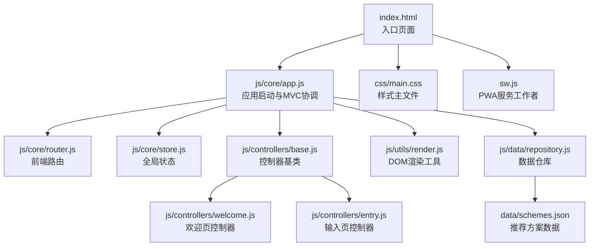
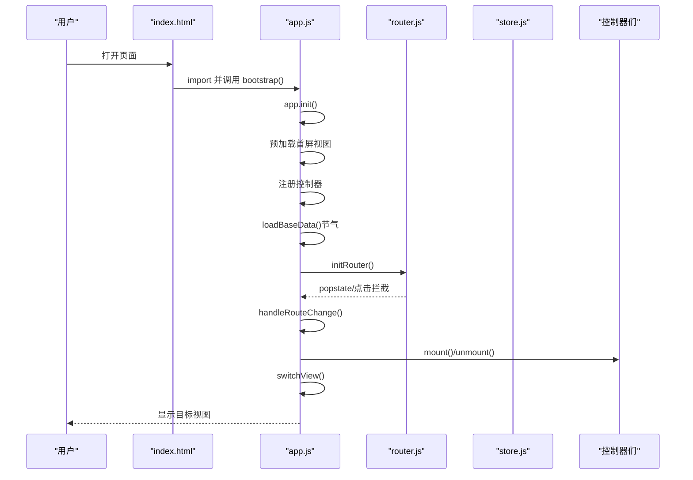
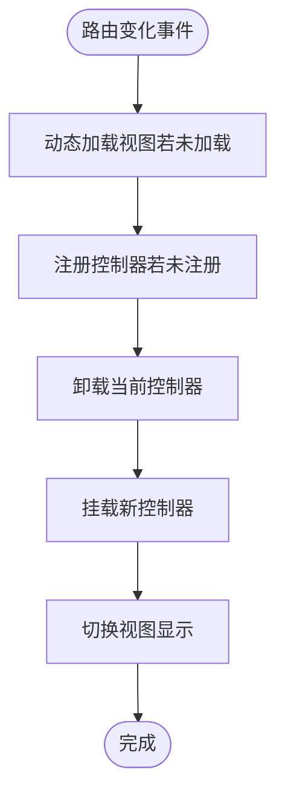
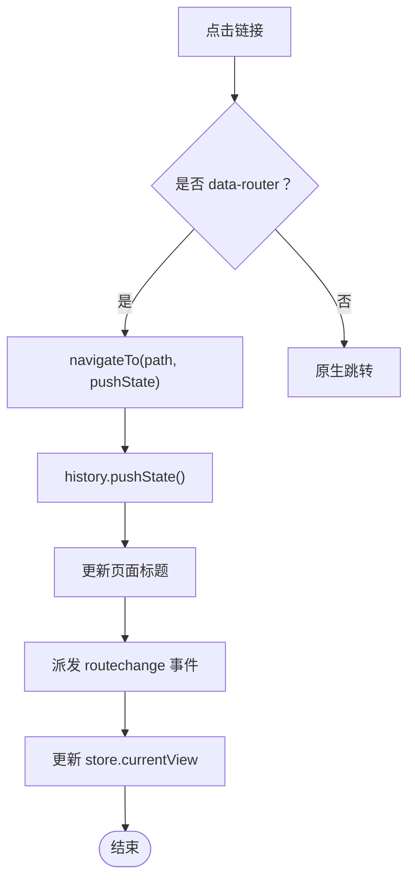
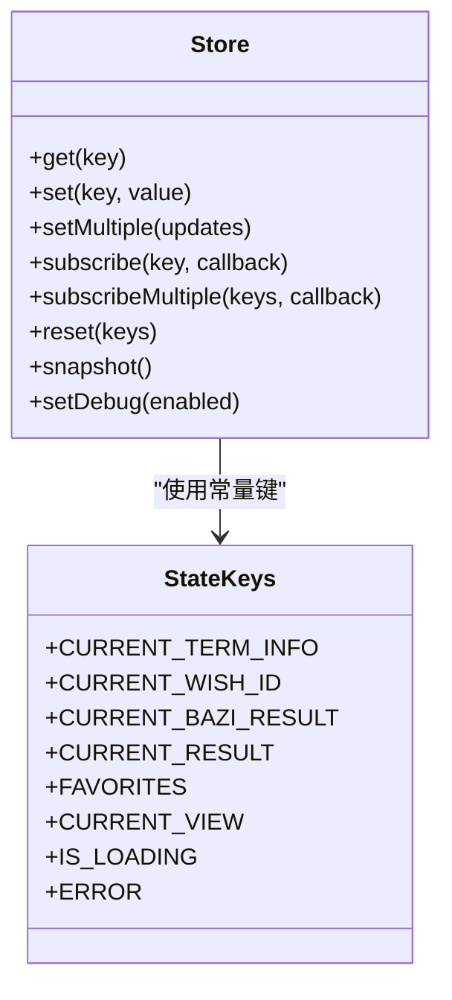
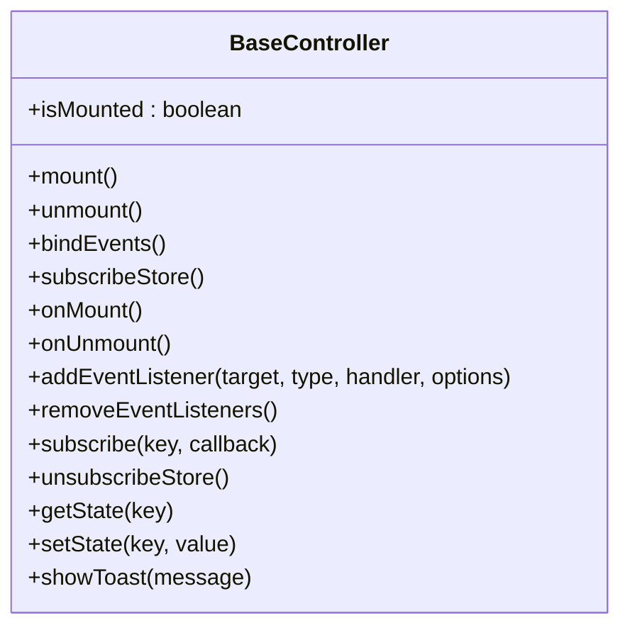
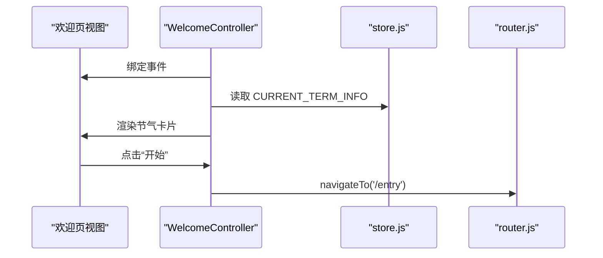
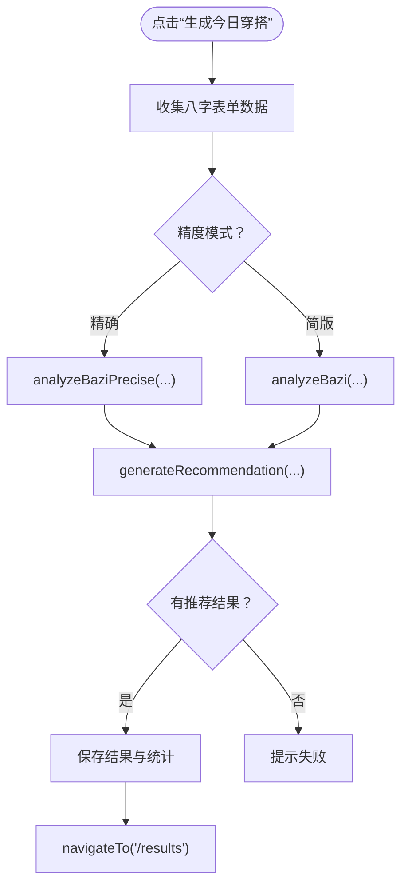
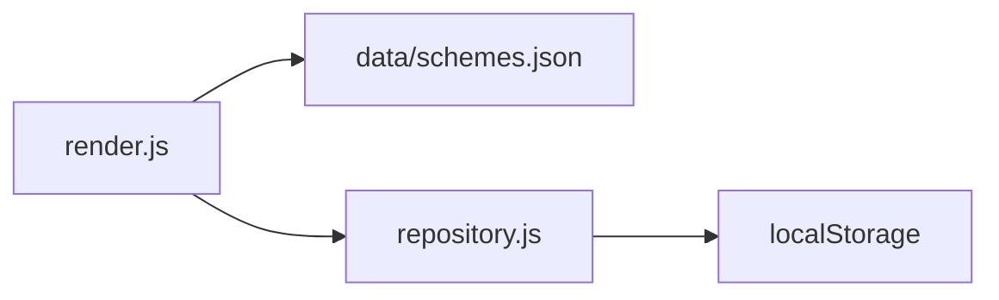
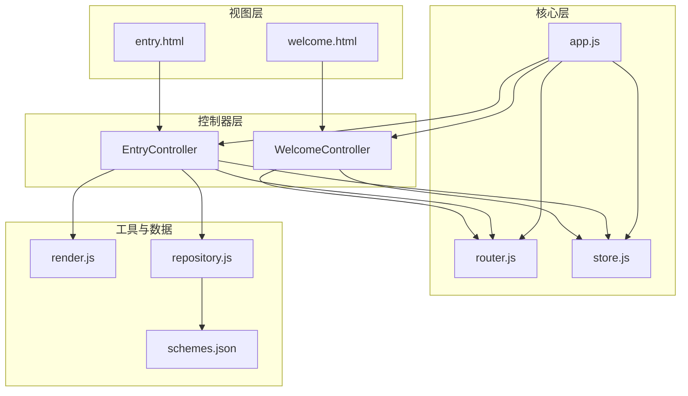

# 快速开始

<cite>
**本文引用的文件**
- [index.html](file://index.html)
- [app.js](file://js/core/app.js)
- [router.js](file://js/core/router.js)
- [store.js](file://js/core/store.js)
- [base.js（控制器基类）](file://js/controllers/base.js)
- [welcome.js（欢迎页控制器）](file://js/controllers/welcome.js)
- [entry.js（输入页控制器）](file://js/controllers/entry.js)
- [render.js（渲染工具）](file://js/utils/render.js)
- [repository.js（数据仓库）](file://js/data/repository.js)
- [schemes.json（推荐方案数据）](file://data/schemes.json)
- [main.css（样式主文件）](file://css/main.css)
- [sw.js（PWA服务工作者）](file://sw.js)
</cite>

## 目录
1. [简介](#简介)
2. [项目结构](#项目结构)
3. [核心组件](#核心组件)
4. [架构总览](#架构总览)
5. [详细组件分析](#详细组件分析)
6. [依赖关系分析](#依赖关系分析)
7. [性能与可用性](#性能与可用性)
8. [安装与部署](#安装与部署)
9. [基本使用指南](#基本使用指南)
10. [常见问题与故障排除](#常见问题与故障排除)
11. [结论](#结论)

## 简介
本指南面向希望快速上手“五行穿搭建议”项目的开发者与用户，提供从零开始的安装、部署、启动流程、功能使用与故障排除的完整说明。项目采用前端模块化架构（MVC），通过动态视图加载与前端路由实现单页应用体验；同时内置 PWA 能力，支持离线缓存与渐进式功能。

## 项目结构
项目采用按职责分层的组织方式：
- 视图与静态资源：views/*.html、css/*.css、favicon.ico
- 核心逻辑：js/core/*（应用、路由、状态、错误处理等）
- 控制器：js/controllers/*（每个视图一个控制器）
- 工具与服务：js/utils/*、js/services/*
- 数据与仓库：js/data/*、data/*.json
- PWA：sw.js

图表来源
- [index.html](file://index.html#L1-L79)
- [app.js](file://js/core/app.js#L1-L206)
- [router.js](file://js/core/router.js#L1-L142)
- [store.js](file://js/core/store.js#L1-L212)
- [base.js（控制器基类）](file://js/controllers/base.js#L1-L131)
- [welcome.js（欢迎页控制器）](file://js/controllers/welcome.js#L1-L134)
- [entry.js（输入页控制器）](file://js/controllers/entry.js#L1-L241)
- [render.js（渲染工具）](file://js/utils/render.js#L1-L200)
- [repository.js（数据仓库）](file://js/data/repository.js#L1-L394)
- [schemes.json（推荐方案数据）](file://data/schemes.json#L1-L509)
- [main.css（样式主文件）](file://css/main.css#L1-L200)
- [sw.js（PWA服务工作者）](file://sw.js#L1-L165)

章节来源
- [index.html](file://index.html#L1-L79)
- [app.js](file://js/core/app.js#L1-L206)
- [router.js](file://js/core/router.js#L1-L142)
- [store.js](file://js/core/store.js#L1-L212)
- [base.js（控制器基类）](file://js/controllers/base.js#L1-L131)
- [welcome.js（欢迎页控制器）](file://js/controllers/welcome.js#L1-L134)
- [entry.js（输入页控制器）](file://js/controllers/entry.js#L1-L241)
- [render.js（渲染工具）](file://js/utils/render.js#L1-L200)
- [repository.js（数据仓库）](file://js/data/repository.js#L1-L394)
- [schemes.json（推荐方案数据）](file://data/schemes.json#L1-L509)
- [main.css（样式主文件）](file://css/main.css#L1-L200)
- [sw.js（PWA服务工作者）](file://sw.js#L1-L165)

## 核心组件
- 应用入口与MVC协调：通过模块导入启动应用，负责视图动态加载、控制器注册与路由事件处理。
- 前端路由：拦截点击与浏览器前进后退，维护历史栈与页面标题，派发自定义事件驱动视图切换。
- 全局状态：集中管理节气、用户输入、推荐结果、收藏、UI状态等，支持订阅与批量更新。
- 控制器基类：统一生命周期（挂载/卸载）、事件绑定与清理、状态订阅与取消。
- 视图控制器：欢迎页与输入页分别负责节气信息展示与用户输入收集，驱动业务服务生成推荐。
- 渲染工具：负责DOM操作、表单初始化、卡片渲染与交互事件绑定。
- 数据仓库：抽象本地存储，提供收藏、偏好、反馈、八字、统计、上传照片等能力。
- PWA：预缓存核心资源，离线可用，采用缓存优先策略与后台更新。

章节来源
- [app.js](file://js/core/app.js#L1-L206)
- [router.js](file://js/core/router.js#L1-L142)
- [store.js](file://js/core/store.js#L1-L212)
- [base.js（控制器基类）](file://js/controllers/base.js#L1-L131)
- [welcome.js（欢迎页控制器）](file://js/controllers/welcome.js#L1-L134)
- [entry.js（输入页控制器）](file://js/controllers/entry.js#L1-L241)
- [render.js（渲染工具）](file://js/utils/render.js#L1-L200)
- [repository.js（数据仓库）](file://js/data/repository.js#L1-L394)
- [sw.js（PWA服务工作者）](file://sw.js#L1-L165)

## 架构总览
应用启动流程从 index.html 的模块入口开始，通过 app.bootstrap() 初始化应用，随后：
- 预加载首屏视图并注册控制器
- 加载基础数据（如节气信息）
- 初始化路由系统
- 监听路由变化事件，动态切换视图与控制器

图表来源
- [index.html](file://index.html#L58-L61)
- [app.js](file://js/core/app.js#L47-L73)
- [router.js](file://js/core/router.js#L25-L50)
- [store.js](file://js/core/store.js#L30-L63)

章节来源
- [index.html](file://index.html#L58-L61)
- [app.js](file://js/core/app.js#L47-L73)
- [router.js](file://js/core/router.js#L25-L50)
- [store.js](file://js/core/store.js#L30-L63)

## 详细组件分析

### MVC 启动与视图切换
- 应用初始化：预加载欢迎页与输入页视图，注册对应控制器，监听路由变化事件。
- 路由变化：根据事件携带的路由信息，卸载当前控制器，挂载新控制器，切换视图显示并滚动到顶部。
- 视图切换：隐藏所有视图，显示目标视图，确保每次切换只显示一个视图。

图表来源
- [app.js](file://js/core/app.js#L145-L184)

章节来源
- [app.js](file://js/core/app.js#L47-L73)
- [app.js](file://js/core/app.js#L145-L184)

### 前端路由系统
- 支持浏览器前进/后退与点击拦截，维护当前路由状态与历史栈。
- 生成路由链接，支持图标与样式类名。
- 提供校验与返回上一页的能力。

图表来源
- [router.js](file://js/core/router.js#L42-L79)

章节来源
- [router.js](file://js/core/router.js#L25-L79)

### 全局状态管理
- 使用 Proxy 实现响应式状态，仅在值真正变化时触发通知。
- 支持订阅单个或多个状态键，提供批量设置与重置能力。
- 提供调试快照与开关。

图表来源
- [store.js](file://js/core/store.js#L30-L187)

章节来源
- [store.js](file://js/core/store.js#L30-L187)

### 控制器基类与生命周期
- 生命周期：mount/onMount/bindEvents → unmount/onUnmount/removeEventListeners。
- 事件与订阅管理：统一添加/移除事件监听，统一订阅/取消订阅 store。
- 工具方法：setState/getState、showToast。

图表来源
- [base.js（控制器基类）](file://js/controllers/base.js#L11-L130)

章节来源
- [base.js（控制器基类）](file://js/controllers/base.js#L11-L130)

### 欢迎页控制器
- 在挂载时绑定事件，渲染节气信息卡片（图标、名称、描述、五行与宜穿颜色）。
- 将“开始”按钮导航到输入页。

图表来源
- [welcome.js（欢迎页控制器）](file://js/controllers/welcome.js#L19-L35)
- [welcome.js（欢迎页控制器）](file://js/controllers/welcome.js#L124-L127)

章节来源
- [welcome.js（欢迎页控制器）](file://js/controllers/welcome.js#L19-L35)
- [welcome.js（欢迎页控制器）](file://js/controllers/welcome.js#L124-L127)

### 输入页控制器
- 初始化年/日选择器、恢复上次八字输入、初始化天气组件。
- 场景与心愿选择、精度切换（简版/精确）、生成推荐。
- 调用引擎服务生成推荐，保存结果与统计，导航到结果页。

图表来源
- [entry.js（输入页控制器）](file://js/controllers/entry.js#L131-L189)

章节来源
- [entry.js（输入页控制器）](file://js/controllers/entry.js#L131-L189)

### 渲染工具与数据仓库
- 渲染工具：初始化年/日选择器、渲染节气横幅、渲染推荐卡片、绑定解释展开/收起。
- 数据仓库：抽象 localStorage，提供收藏、偏好、反馈、八字、统计、上传照片等仓库类与工具。

图表来源
- [render.js（渲染工具）](file://js/utils/render.js#L24-L55)
- [render.js（渲染工具）](file://js/utils/render.js#L119-L132)
- [repository.js（数据仓库）](file://js/data/repository.js#L24-L41)
- [schemes.json（推荐方案数据）](file://data/schemes.json#L1-L509)

章节来源
- [render.js（渲染工具）](file://js/utils/render.js#L24-L55)
- [render.js（渲染工具）](file://js/utils/render.js#L119-L132)
- [repository.js（数据仓库）](file://js/data/repository.js#L24-L41)
- [schemes.json（推荐方案数据）](file://data/schemes.json#L1-L509)

## 依赖关系分析
- 视图与控制器：每个视图由对应控制器管理，控制器通过 store 订阅状态变化。
- 路由与视图：路由系统决定当前视图与控制器，app 统一调度。
- 服务与数据：控制器调用服务生成推荐，使用仓库持久化用户输入与结果。
- 样式与主题：CSS 定义设计令牌与主题色，随节气动态切换。

图表来源
- [app.js](file://js/core/app.js#L14-L31)
- [router.js](file://js/core/router.js#L9-L17)
- [store.js](file://js/core/store.js#L33-L51)
- [welcome.js（欢迎页控制器）](file://js/controllers/welcome.js#L1-L17)
- [entry.js（输入页控制器）](file://js/controllers/entry.js#L1-L21)
- [render.js（渲染工具）](file://js/utils/render.js#L1-L9)
- [repository.js（数据仓库）](file://js/data/repository.js#L1-L21)
- [schemes.json（推荐方案数据）](file://data/schemes.json#L1-L509)

章节来源
- [app.js](file://js/core/app.js#L14-L31)
- [router.js](file://js/core/router.js#L9-L17)
- [store.js](file://js/core/store.js#L33-L51)
- [welcome.js（欢迎页控制器）](file://js/controllers/welcome.js#L1-L17)
- [entry.js（输入页控制器）](file://js/controllers/entry.js#L1-L21)
- [render.js（渲染工具）](file://js/utils/render.js#L1-L9)
- [repository.js（数据仓库）](file://js/data/repository.js#L1-L21)
- [schemes.json（推荐方案数据）](file://data/schemes.json#L1-L509)

## 性能与可用性
- 预加载首屏视图与控制器，减少首次进入延迟。
- 路由切换采用“卸载当前 + 挂载新控制器”的方式，避免状态泄漏。
- 渲染工具批量创建卡片并绑定事件，降低重复 DOM 查询成本。
- PWA 离线缓存：预缓存核心脚本、样式、视图与数据文件，采用 Stale-While-Revalidate 策略提升离线可用性与更新效率。

章节来源
- [app.js](file://js/core/app.js#L54-L60)
- [render.js（渲染工具）](file://js/utils/render.js#L119-L132)
- [sw.js（PWA服务工作者）](file://sw.js#L52-L69)
- [sw.js（PWA服务工作者）](file://sw.js#L112-L154)

## 安装与部署

### 浏览器兼容性
- 项目使用 ES 模块与现代 Web API（如 fetch、localStorage、Service Worker）。建议在主流桌面与移动端浏览器中使用，以获得最佳体验。

### 本地开发环境配置
- 无构建步骤：项目为纯前端静态资源，无需编译或打包。
- 本地服务器：可使用任意静态服务器（如 http-server、live-server、Python http.server 或 VSCode Live Server）启动服务。
- PWA 启用：确保服务通过 HTTPS 或 localhost 访问，以便注册 Service Worker。

### PWA 功能启用
- 注册 SW：页面加载时检测 serviceWorker 并注册 sw.js。
- 预缓存清单：sw.js 中包含核心脚本、样式、视图与数据文件。
- 离线策略：缓存优先，命中后异步更新缓存；网络失败时回退缓存。

章节来源
- [index.html](file://index.html#L64-L76)
- [sw.js（PWA服务工作者）](file://sw.js#L5-L47)
- [sw.js（PWA服务工作者）](file://sw.js#L52-L69)
- [sw.js（PWA服务工作者）](file://sw.js#L112-L154)

## 基本使用指南

### 启动流程（从入口到MVC初始化）
1. 打开 index.html。
2. 页面通过模块导入 app.js 并调用 bootstrap()。
3. app.init()：
   - 初始化全局错误处理
   - 预加载欢迎页与输入页视图
   - 注册对应控制器
   - 加载基础节气数据
   - 初始化路由系统
4. 用户点击导航，路由系统派发 routechange 事件，app 切换视图与控制器。

章节来源
- [index.html](file://index.html#L58-L61)
- [app.js](file://js/core/app.js#L47-L73)
- [router.js](file://js/core/router.js#L25-L50)

### 用户引导流程
- 欢迎页：查看当前节气与五行提示，点击“开始”进入输入页。
- 输入页：选择场景与心愿，可选输入八字（简版/精确），点击“生成今日穿搭”。
- 结果页：查看推荐方案卡片，支持收藏、分享与查看详情。

章节来源
- [welcome.js（欢迎页控制器）](file://js/controllers/welcome.js#L124-L127)
- [entry.js（输入页控制器）](file://js/controllers/entry.js#L131-L189)
- [render.js（渲染工具）](file://js/utils/render.js#L119-L132)

### 核心功能操作步骤
- 选择场景与心愿：点击场景标签与心愿标签，自动高亮当前选择。
- 输入八字：选择年/月/日/时，精确模式可补充分钟与时区。
- 生成推荐：点击“生成今日穿搭”，等待结果并查看推荐卡片。
- 收藏与分享：在推荐卡片中进行收藏与分享操作。

章节来源
- [entry.js（输入页控制器）](file://js/controllers/entry.js#L105-L117)
- [entry.js（输入页控制器）](file://js/controllers/entry.js#L119-L129)
- [entry.js（输入页控制器）](file://js/controllers/entry.js#L131-L189)
- [render.js（渲染工具）](file://js/utils/render.js#L161-L179)

### 界面导航
- 使用路由链接或返回按钮在视图间切换。
- 路由系统维护浏览器历史，支持前进/后退。

章节来源
- [router.js](file://js/core/router.js#L42-L49)
- [router.js](file://js/core/router.js#L117-L119)

## 常见问题与故障排除

### 无法加载视图或控制器
- 现象：点击导航后页面无变化。
- 排查：
  - 检查路由配置是否包含目标路径。
  - 确认视图 HTML 文件存在且可被 fetch 访问。
  - 查看控制台是否有网络错误或跨域限制。

章节来源
- [router.js](file://js/core/router.js#L57-L79)
- [app.js](file://js/core/app.js#L79-L104)

### Service Worker 注册失败
- 现象：控制台出现注册失败错误。
- 排查：
  - 确保页面通过 HTTPS 或 localhost 访问。
  - 检查 sw.js 路径与权限。
  - 清理浏览器缓存或尝试隐身模式。

章节来源
- [index.html](file://index.html#L64-L76)
- [sw.js（PWA服务工作者）](file://sw.js#L52-L69)

### 推荐结果为空
- 现象：生成后无推荐结果。
- 排查：
  - 检查节气数据加载是否成功。
  - 确认输入的八字与场景参数有效。
  - 查看控制台错误与提示消息。

章节来源
- [app.js](file://js/core/app.js#L122-L131)
- [entry.js（输入页控制器）](file://js/controllers/entry.js#L166-L189)

### 本地存储异常
- 现象：收藏/偏好/统计等数据丢失。
- 排查：
  - 检查浏览器隐私设置与存储配额。
  - 使用仓库工具清除无效数据或重置统计。

章节来源
- [repository.js（数据仓库）](file://js/data/repository.js#L24-L41)
- [repository.js（数据仓库）](file://js/data/repository.js#L292-L337)

## 结论
本项目通过清晰的 MVC 分层与前端路由，实现了流畅的单页应用体验；配合 PWA 能力，可在离线或弱网环境下保持良好可用性。按照本指南完成本地部署与启动后，用户可快速完成从输入到推荐的完整流程；开发者可根据控制器与仓库接口扩展更多场景与功能。