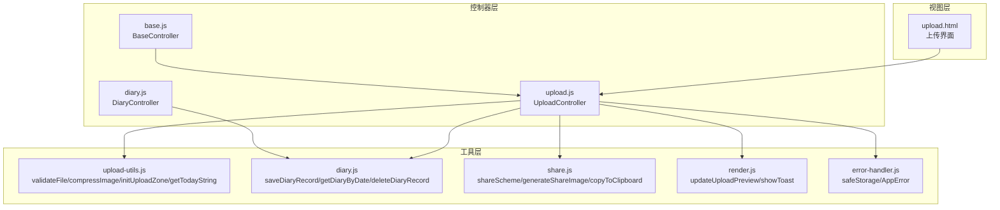
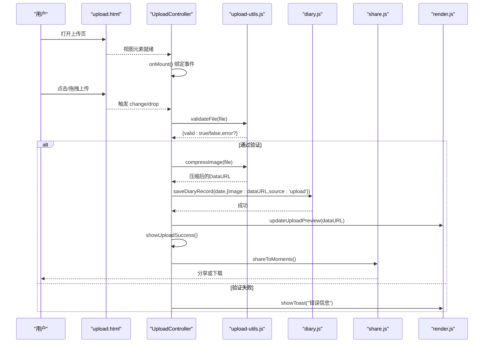
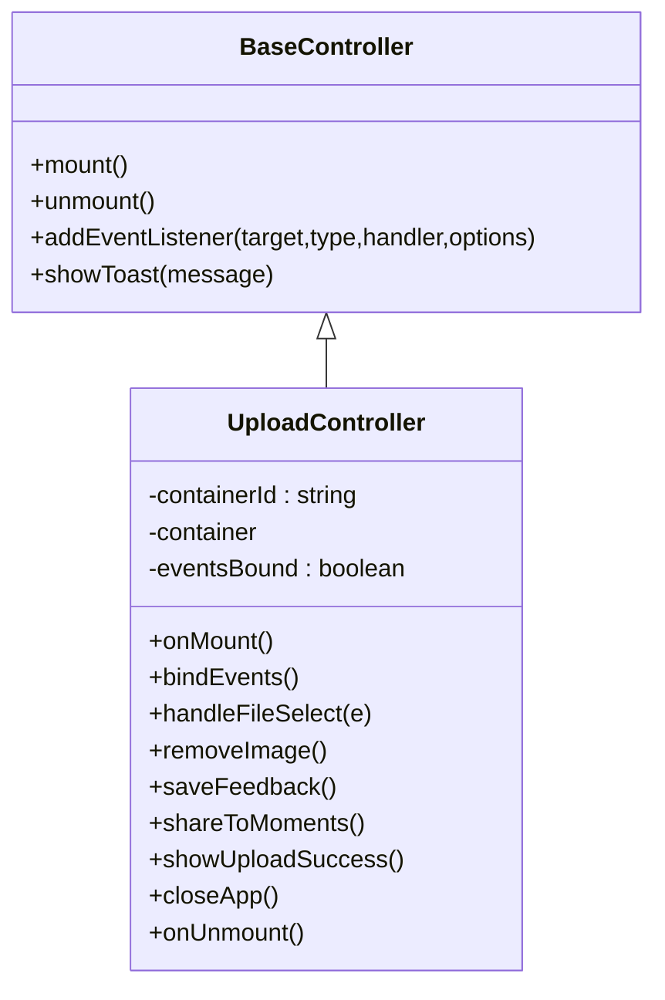
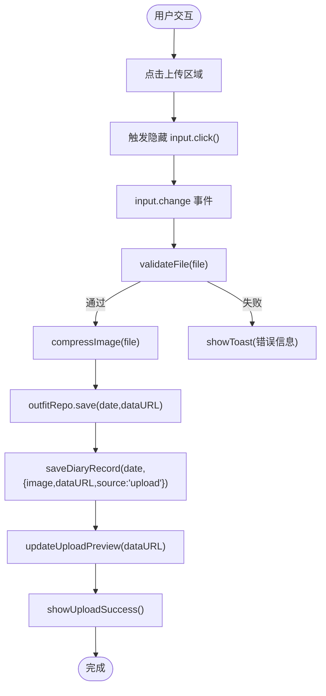
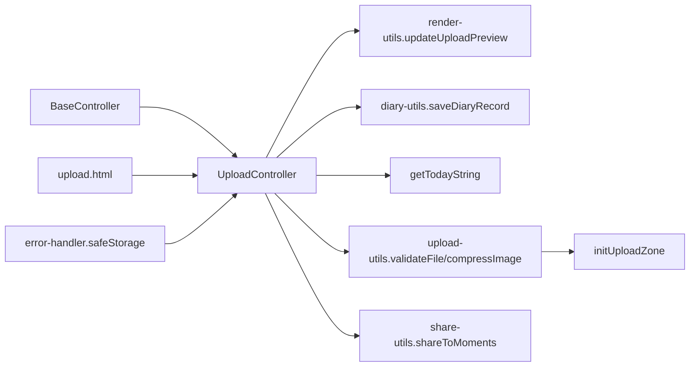

# 上传功能控制器

<cite>
**本文档引用的文件**
- [upload.js](file://js/controllers/upload.js)
- [upload-utils.js](file://js/utils/upload.js)
- [upload.html](file://views/upload.html)
- [diary.js](file://js/utils/diary.js)
- [share.js](file://js/utils/share.js)
- [render.js](file://js/utils/render.js)
- [base.js](file://js/controllers/base.js)
- [error-handler.js](file://js/core/error-handler.js)
- [diary.js](file://js/controllers/diary.js)
</cite>

## 更新摘要
**变更内容**
- 新增社交分享功能集成，支持系统分享和图片下载
- 新增自动同步到日记时间线功能
- 新增上传成功通知系统和按钮布局优化
- 新增反馈收集和删除功能
- 增强的错误处理和用户体验提示

## 目录
1. [简介](#简介)
2. [项目结构](#项目结构)
3. [核心组件](#核心组件)
4. [架构概览](#架构概览)
5. [详细组件分析](#详细组件分析)
6. [依赖关系分析](#依赖关系分析)
7. [性能考量](#性能考量)
8. [故障排查指南](#故障排查指南)
9. [结论](#结论)
10. [附录](#附录)

## 简介
本文件面向上传功能控制器，系统性梳理 UploadController 在文件上传与媒体处理方面的实现方案。重点包括：
- 文件选择机制与拖拽支持
- 格式验证与大小限制策略
- 异步上传流程、进度监控与错误处理
- 多文件上传、断点续传与图片预览的实现思路
- 社交分享集成与自动同步到日记时间线
- 上传成功通知系统与按钮布局优化
- 安全性考虑、性能优化与用户体验改进建议

当前代码库中的上传实现主要在前端完成，采用本地验证与压缩、本地存储与预览的轻量级方案；新增了社交分享和日记同步功能，提供更完整的用户体验。

## 项目结构
上传相关模块分布于控制器、工具函数、视图与数据仓库之间，形成清晰的职责分离：
- 控制器层：负责视图交互与业务流程编排
- 工具层：封装文件验证、压缩与上传区域初始化
- 视图层：提供上传界面与预览区域
- 数据层：提供本地存储与预览更新能力
- 分享层：集成社交分享功能
- 日记层：管理日记记录与时间线

**图表来源**
- [upload.js](file://js/controllers/upload.js#L1-L277)
- [upload-utils.js](file://js/utils/upload.js#L1-L145)
- [upload.html](file://views/upload.html#L1-L79)
- [diary.js](file://js/utils/diary.js#L1-L242)
- [share.js](file://js/utils/share.js#L1-L333)
- [render.js](file://js/utils/render.js#L405-L487)
- [error-handler.js](file://js/core/error-handler.js#L1-L190)

**章节来源**
- [upload.js](file://js/controllers/upload.js#L1-L277)
- [upload-utils.js](file://js/utils/upload.js#L1-L145)
- [upload.html](file://views/upload.html#L1-L79)
- [diary.js](file://js/utils/diary.js#L1-L242)
- [share.js](file://js/utils/share.js#L1-L333)
- [render.js](file://js/utils/render.js#L405-L487)
- [error-handler.js](file://js/core/error-handler.js#L1-L190)

## 核心组件
- UploadController：上传页控制器，负责事件绑定、文件处理、预览更新与本地存储
- upload-utils：文件验证、图片压缩、上传区域初始化与日期工具
- upload.html：上传界面模板，包含上传区域、预览与反馈区
- DiaryUtils：日记记录管理，支持保存、删除和查询
- ShareUtils：社交分享功能，支持系统分享和图片生成
- render-utils：DOM 更新与 Toast 提示
- BaseController：控制器基类，提供生命周期与事件管理
- ErrorHandler：统一错误处理，提供安全存储和错误包装

**章节来源**
- [upload.js](file://js/controllers/upload.js#L12-L16)
- [upload-utils.js](file://js/utils/upload.js#L5-L8)
- [upload.html](file://views/upload.html#L1-L79)
- [diary.js](file://js/utils/diary.js#L8-L32)
- [share.js](file://js/utils/share.js#L6-L7)
- [render.js](file://js/utils/render.js#L405-L487)
- [base.js](file://js/controllers/base.js#L1-L131)
- [error-handler.js](file://js/core/error-handler.js#L5-L15)

## 架构概览
上传流程从视图加载开始，控制器挂载后绑定事件，通过工具函数完成文件验证与压缩，并将结果写入本地存储与预览更新。新增功能包括自动同步到日记和社交分享。

**图表来源**
- [upload.js](file://js/controllers/upload.js#L19-L178)
- [upload-utils.js](file://js/utils/upload.js#L12-L82)
- [diary.js](file://js/utils/diary.js#L57-L65)
- [share.js](file://js/utils/share.js#L200-L234)
- [render.js](file://js/utils/render.js#L405-L425)

## 详细组件分析

### UploadController 分析
- 生命周期与事件绑定
  - onMount：动态获取容器、绑定事件、检查今日是否已有上传并预览
  - bindEvents：避免重复绑定，处理返回、上传区域点击、文件选择、移除图片、保存反馈、分享朋友圈
  - onUnmount：清理事件绑定标记
- 文件处理
  - handleFileSelect：读取文件为DataURL，保存至本地存储并更新预览
  - showUploadSuccess：显示成功提示和操作按钮区域
- 日记同步与分享
  - removeImage：移除今日图片并清空预览，同步删除日记记录
  - shareToMoments：集成社交分享，支持系统分享API和降级方案
  - saveFeedback：保存用户反馈到日记记录
- 应用控制
  - closeApp：尝试关闭窗口或返回首页

**图表来源**
- [base.js](file://js/controllers/base.js#L11-L131)
- [upload.js](file://js/controllers/upload.js#L12-L277)

**章节来源**
- [upload.js](file://js/controllers/upload.js#L19-L277)
- [base.js](file://js/controllers/base.js#L11-L131)

### 文件选择与拖拽支持
- 上传区域初始化
  - initUploadZone：绑定点击、键盘回车/空格、拖拽进入/离开/放下事件
  - 触发隐藏的文件输入框，重置输入以允许重复选择同一文件
- 上传区域模板
  - upload.html 提供上传占位符、预览区与移除按钮

**图表来源**
- [upload-utils.js](file://js/utils/upload.js#L87-L136)
- [upload.html](file://views/upload.html#L19-L33)
- [upload.js](file://js/controllers/upload.js#L121-L178)
- [diary.js](file://js/utils/diary.js#L57-L65)
- [render.js](file://js/utils/render.js#L405-L425)

**章节来源**
- [upload-utils.js](file://js/utils/upload.js#L87-L136)
- [upload.html](file://views/upload.html#L19-L33)
- [upload.js](file://js/controllers/upload.js#L121-L178)

### 格式验证与大小限制
- 支持格式：JPG、PNG
- 最大文件大小：5MB
- 验证逻辑：类型判断与大小阈值检查，返回 {valid, error?}

**章节来源**
- [upload-utils.js](file://js/utils/upload.js#L12-L26)

### 图片压缩与预览
- 压缩策略
  - 目标尺寸：最大边不超过 1200px
  - 目标大小：约 200KB
  - 质量迭代：从 0.8 开始逐步降低，直到满足大小要求或达到下限
- 预览更新
  - updateUploadPreview：切换占位符与预览区显示，设置图片 src 并显示反馈区

**章节来源**
- [upload-utils.js](file://js/utils/upload.js#L31-L82)
- [render.js](file://js/utils/render.js#L405-L425)

### 日记同步与自动保存
- 自动同步：上传成功后自动保存到日记记录
- 数据结构：包含图片URL、来源标识、时间戳等
- 查询与删除：支持按日期查询和删除日记记录
- 时间线集成：日记记录会出现在时间线视图中

**章节来源**
- [upload.js](file://js/controllers/upload.js#L146-L150)
- [diary.js](file://js/utils/diary.js#L57-L75)

### 社交分享集成
- 系统分享：使用 Web Share API，支持标题、文本和URL分享
- 降级方案：不支持系统分享时，自动下载图片供手动分享
- 分享内容：包含今日穿搭信息和应用标识
- 用户体验：提供分享成功提示和错误处理

**章节来源**
- [upload.js](file://js/controllers/upload.js#L200-L234)
- [share.js](file://js/utils/share.js#L66-L91)

### 上传成功通知系统
- 成功提示：显示绿色成功图标和提示文本
- 按钮区域：显示修改、删除、分享等操作按钮
- 自动隐藏：3秒后自动隐藏成功提示
- Toast通知：全局Toast提示上传成功并同步到日记

**章节来源**
- [upload.js](file://js/controllers/upload.js#L158-L178)
- [upload.html](file://views/upload.html#L35-L40)

### 反馈收集与删除功能
- 反馈区域：支持用户记录当日穿搭感受
- 保存机制：将反馈内容保存到日记记录的note字段
- 删除功能：支持删除今日上传的图片和相关记录
- 数据持久化：使用安全存储包装，处理隐私模式异常

**章节来源**
- [upload.js](file://js/controllers/upload.js#L180-L198)
- [upload.js](file://js/controllers/upload.js#L247-L272)
- [diary.js](file://js/utils/diary.js#L19-L32)

### 错误处理与用户体验
- 错误处理
  - BaseController.showToast：通过全局事件派发 Toast
  - render-utils.showToast：创建并自动移除 Toast
  - ErrorHandler.safeStorage：安全的本地存储操作
- 全局错误处理
  - error-handler.js：统一包装异步函数、网络超时、存储异常等

**章节来源**
- [base.js](file://js/controllers/base.js#L126-L129)
- [render.js](file://js/utils/render.js#L457-L486)
- [error-handler.js](file://js/core/error-handler.js#L153-L163)

## 依赖关系分析
- 控制器依赖
  - BaseController：提供生命周期与事件管理
  - render-utils.updateUploadPreview：更新 DOM 预览
  - diary-utils.saveDiaryRecord：日记记录管理
  - utils.upload.getTodayString：日期键生成
  - utils.upload.validateFile/compressImage：文件验证与压缩
  - utils.share.shareToMoments：社交分享
- 工具函数依赖
  - validateFile/compressImage：文件验证与压缩
  - initUploadZone：上传区域交互
- 视图依赖
  - upload.html：上传区域、预览与反馈区

**图表来源**
- [upload.js](file://js/controllers/upload.js#L5-L10)
- [upload-utils.js](file://js/utils/upload.js#L12-L82)
- [diary.js](file://js/utils/diary.js#L57-L65)
- [share.js](file://js/utils/share.js#L200-L234)
- [render.js](file://js/utils/render.js#L405-L425)
- [error-handler.js](file://js/core/error-handler.js#L153-L163)
- [upload.html](file://views/upload.html#L1-L79)

**章节来源**
- [upload.js](file://js/controllers/upload.js#L5-L10)
- [upload-utils.js](file://js/utils/upload.js#L12-L82)
- [diary.js](file://js/utils/diary.js#L57-L65)
- [share.js](file://js/utils/share.js#L200-L234)
- [render.js](file://js/utils/render.js#L405-L425)
- [error-handler.js](file://js/core/error-handler.js#L153-L163)
- [upload.html](file://views/upload.html#L1-L79)

## 性能考量
- 前端压缩
  - 通过 Canvas 与 toDataURL 进行 JPEG 压缩，控制目标大小与质量迭代，减少传输体积
- 本地存储
  - 使用 localStorage 存储图片数据，避免频繁网络请求；注意存储上限与隐私模式兼容
- DOM 更新
  - 预览切换仅更新必要节点，避免全量重绘
- 事件绑定
  - BaseController 提供去重绑定与统一解绑，防止内存泄漏
- 社交分享
  - 使用 Web Share API 提升分享性能，降级方案使用 Canvas 生成图片

## 故障排查指南
- 常见问题
  - 文件类型不支持：检查 accept 与 validateFile 的类型白名单
  - 文件过大：确认 MAX_FILE_SIZE 限制与用户提示文案
  - 预览不显示：检查 updateUploadPreview 的 DOM 结构与图片 src 设置
  - 重复选择无效：确认 input 重置逻辑
  - 分享失败：检查 navigator.share 支持和降级方案
  - 日记同步失败：检查 safeStorage 包装和存储权限
- 错误提示
  - 使用 showToast 输出用户友好的错误信息
  - 全局错误处理器捕获未处理异常并统一提示

**章节来源**
- [upload-utils.js](file://js/utils/upload.js#L12-L26)
- [render.js](file://js/utils/render.js#L457-L486)
- [error-handler.js](file://js/core/error-handler.js#L168-L189)

## 结论
当前上传功能控制器实现了简洁高效的本地上传与预览流程，新增了社交分享和日记同步功能，提供完整的用户体验。通过工具函数完成文件验证与压缩，结合本地存储与 DOM 更新，以及日记同步和社交分享功能，形成了一个功能完善的上传系统。若需扩展为完整上传系统，可在现有基础上增加服务端接口对接、进度上报与断点续传机制。

## 附录

### 多文件上传实现思路
- 当前实现：单文件选择与处理
- 扩展建议：
  - input[type=file] 添加 multiple 属性，遍历 e.target.files[]
  - 为每个文件维护独立的状态与进度条
  - 使用队列或并发控制策略，避免过度占用资源

### 断点续传实现思路
- 当前实现：无服务端上传与断点续传
- 扩展建议：
  - 服务端支持分片上传与校验
  - 前端记录已上传分片索引，失败时从断点继续
  - 结合进度条与暂停/恢复按钮提升可控性

### 图片预览与反馈区联动
- 预览区与反馈区联动：当存在图片时显示反馈区，便于用户记录当日穿搭感受
- 交互细节：移除图片时同时隐藏反馈区，保持界面一致性

**章节来源**
- [upload.html](file://views/upload.html#L69-L76)
- [render.js](file://js/utils/render.js#L405-L425)

### 安全性考虑
- 输入验证
  - 严格限制文件类型与大小，避免恶意文件
- 存储安全
  - 使用安全存储包装，处理隐私模式与配额异常
- 传输安全
  - 如接入服务端，建议使用 HTTPS 与签名直传策略
- 分享安全
  - 社交分享使用 Web Share API，确保用户知情同意

**章节来源**
- [upload-utils.js](file://js/utils/upload.js#L12-L26)
- [error-handler.js](file://js/core/error-handler.js#L153-L163)
- [share.js](file://js/utils/share.js#L66-L91)

### 按钮布局优化
- 操作按钮区域：包含修改、删除、分享等核心功能
- 响应式设计：适配不同屏幕尺寸
- 无障碍支持：提供适当的 ARIA 标签和键盘导航
- 用户引导：通过图标和文本明确功能含义

**章节来源**
- [upload.html](file://views/upload.html#L43-L67)