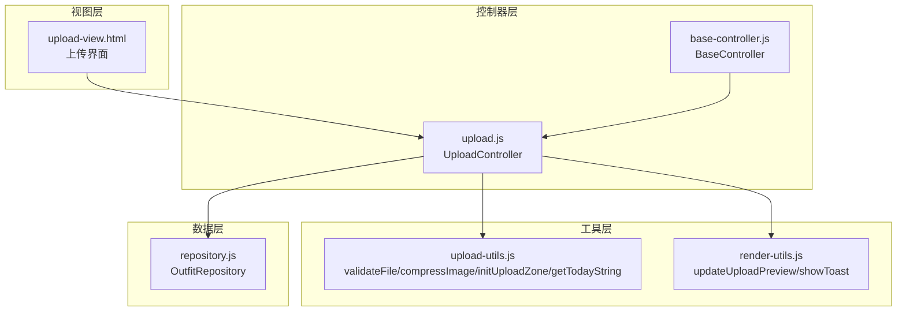
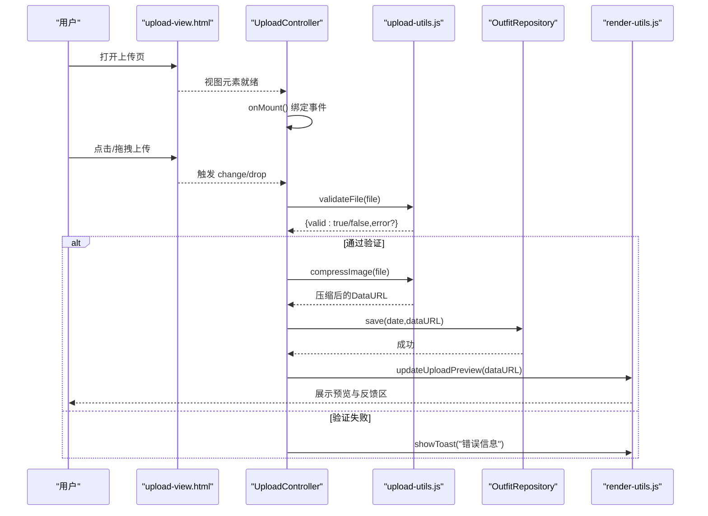
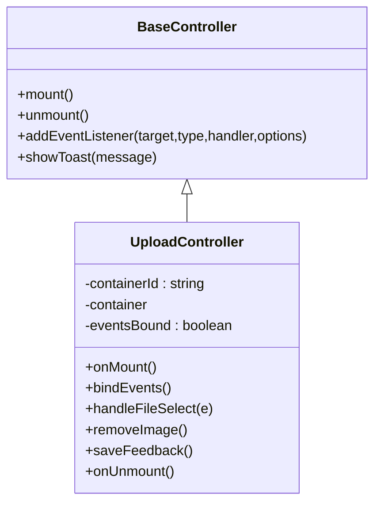
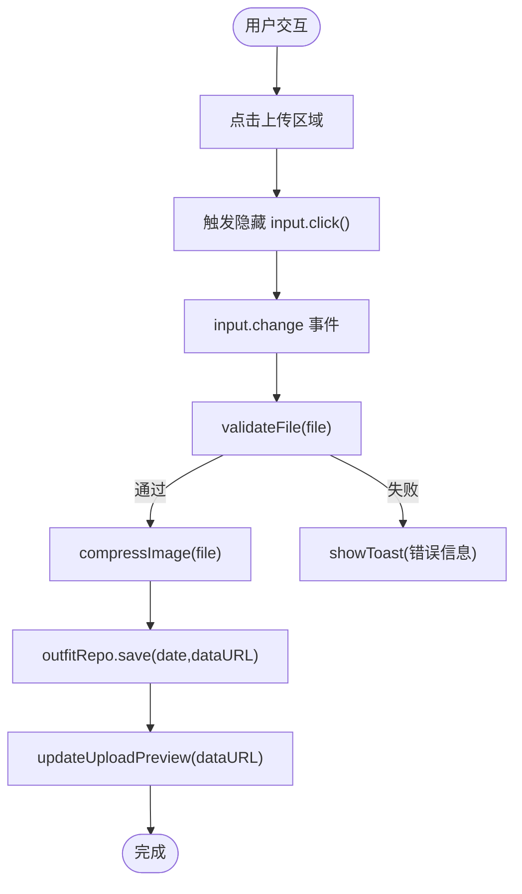
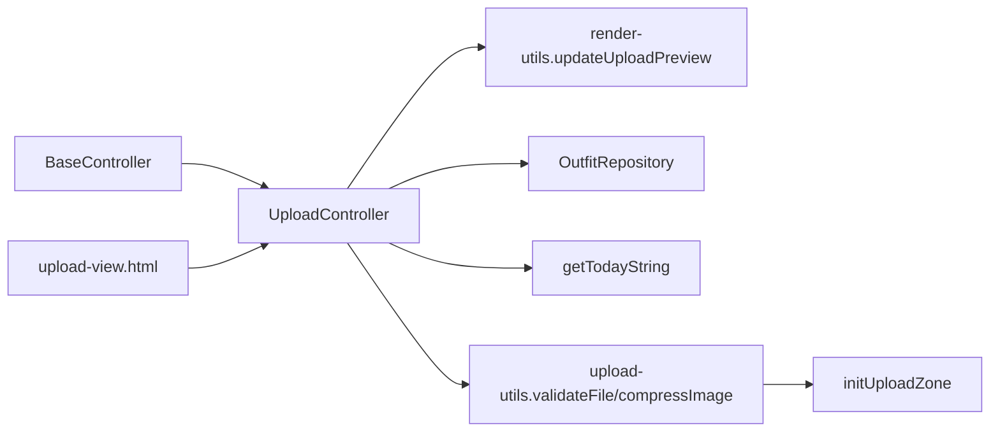

# 上传功能控制器

<cite>
**本文档引用的文件**
- [upload.js](file://js/controllers/upload.js)
- [upload-utils.js](file://js/utils/upload.js)
- [upload-view.html](file://views/upload.html)
- [app.js](file://js/core/app.js)
- [repository.js](file://js/data/repository.js)
- [render-utils.js](file://js/utils/render.js)
- [base-controller.js](file://js/controllers/base.js)
- [error-handler.js](file://js/core/error-handler.js)
</cite>

## 目录
1. [简介](#简介)
2. [项目结构](#项目结构)
3. [核心组件](#核心组件)
4. [架构概览](#架构概览)
5. [详细组件分析](#详细组件分析)
6. [依赖关系分析](#依赖关系分析)
7. [性能考量](#性能考量)
8. [故障排查指南](#故障排查指南)
9. [结论](#结论)
10. [附录](#附录)

## 简介
本文件面向上传功能控制器，系统性梳理 UploadController 在文件上传与媒体处理方面的实现方案。重点包括：
- 文件选择机制与拖拽支持
- 格式验证与大小限制策略
- 异步上传流程、进度监控与错误处理
- 多文件上传、断点续传与图片预览的实现思路
- 安全性考虑、性能优化与用户体验改进建议

当前代码库中的上传实现主要在前端完成，采用本地验证与压缩、本地存储与预览的轻量级方案；后续可按需扩展为服务端上传与进度上报。

## 项目结构
上传相关模块分布于控制器、工具函数、视图与数据仓库之间，形成清晰的职责分离：
- 控制器层：负责视图交互与业务流程编排
- 工具层：封装文件验证、压缩与上传区域初始化
- 视图层：提供上传界面与预览区域
- 数据层：提供本地存储与预览更新能力

图表来源
- [upload.js](file://js/controllers/upload.js#L1-L118)
- [upload-utils.js](file://js/utils/upload.js#L1-L145)
- [upload-view.html](file://views/upload.html#L1-L41)
- [render-utils.js](file://js/utils/render.js#L405-L425)
- [repository.js](file://js/data/repository.js#L340-L377)
- [base-controller.js](file://js/controllers/base.js#L1-L131)

章节来源
- [upload.js](file://js/controllers/upload.js#L1-L118)
- [upload-utils.js](file://js/utils/upload.js#L1-L145)
- [upload-view.html](file://views/upload.html#L1-L41)
- [render-utils.js](file://js/utils/render.js#L405-L425)
- [repository.js](file://js/data/repository.js#L340-L377)
- [base-controller.js](file://js/controllers/base.js#L1-L131)

## 核心组件
- UploadController：上传页控制器，负责事件绑定、文件处理、预览更新与本地存储
- upload-utils：文件验证、图片压缩、上传区域初始化与日期工具
- upload-view：上传界面模板，包含上传区域、预览与反馈区
- OutfitRepository：本地存储“今日穿搭”图片数据
- render-utils：DOM 更新与 Toast 提示
- BaseController：控制器基类，提供生命周期与事件管理

章节来源
- [upload.js](file://js/controllers/upload.js#L11-L33)
- [upload-utils.js](file://js/utils/upload.js#L5-L26)
- [upload-view.html](file://views/upload.html#L12-L39)
- [repository.js](file://js/data/repository.js#L340-L377)
- [render-utils.js](file://js/utils/render.js#L405-L425)
- [base-controller.js](file://js/controllers/base.js#L11-L42)

## 架构概览
上传流程从视图加载开始，控制器挂载后绑定事件，通过工具函数完成文件验证与压缩，并将结果写入本地存储与预览更新。

图表来源
- [upload.js](file://js/controllers/upload.js#L18-L93)
- [upload-utils.js](file://js/utils/upload.js#L12-L82)
- [repository.js](file://js/data/repository.js#L358-L366)
- [render-utils.js](file://js/utils/render.js#L405-L425)

## 详细组件分析

### UploadController 分析
- 生命周期与事件绑定
  - onMount：动态获取容器、绑定事件、检查今日是否已有上传并预览
  - bindEvents：避免重复绑定，处理返回、上传区域点击、文件选择、移除图片、保存反馈
  - onUnmount：清理事件绑定标记
- 文件处理
  - handleFileSelect：读取文件为DataURL，保存至本地存储并更新预览
- 本地存储与反馈
  - removeImage：移除今日图片并清空预览
  - saveFeedback：校验反馈内容并提示保存成功

图表来源
- [base-controller.js](file://js/controllers/base.js#L11-L131)
- [upload.js](file://js/controllers/upload.js#L11-L118)

章节来源
- [upload.js](file://js/controllers/upload.js#L18-L118)
- [base-controller.js](file://js/controllers/base.js#L11-L131)

### 文件选择与拖拽支持
- 上传区域初始化
  - initUploadZone：绑定点击、键盘回车/空格、拖拽进入/离开/放下事件
  - 触发隐藏的文件输入框，重置输入以允许重复选择同一文件
- 上传区域模板
  - upload-view.html 提供上传占位符、预览区与移除按钮

图表来源
- [upload-utils.js](file://js/utils/upload.js#L87-L136)
- [upload-view.html](file://views/upload.html#L12-L30)
- [upload.js](file://js/controllers/upload.js#L80-L93)
- [repository.js](file://js/data/repository.js#L358-L366)
- [render-utils.js](file://js/utils/render.js#L405-L425)

章节来源
- [upload-utils.js](file://js/utils/upload.js#L87-L136)
- [upload-view.html](file://views/upload.html#L12-L30)
- [upload.js](file://js/controllers/upload.js#L80-L93)

### 格式验证与大小限制
- 支持格式：JPG、PNG
- 最大文件大小：5MB
- 验证逻辑：类型判断与大小阈值检查，返回 {valid, error?}

章节来源
- [upload-utils.js](file://js/utils/upload.js#L5-L26)

### 图片压缩与预览
- 压缩策略
  - 目标尺寸：最大边不超过 1200px
  - 目标大小：约 200KB
  - 质量迭代：从 0.8 开始逐步降低，直到满足大小要求或达到下限
- 预览更新
  - updateUploadPreview：切换占位符与预览区显示，设置图片 src 并显示反馈区

章节来源
- [upload-utils.js](file://js/utils/upload.js#L31-L82)
- [render-utils.js](file://js/utils/render.js#L405-L425)

### 本地存储与今日日期
- OutfitRepository：以日期为键保存/读取图片数据
- getTodayString：生成“YYYY-MM-DD”格式的日期字符串

章节来源
- [repository.js](file://js/data/repository.js#L340-L377)
- [upload-utils.js](file://js/utils/upload.js#L141-L144)
- [upload.js](file://js/controllers/upload.js#L29-L32)

### 错误处理与用户体验
- 错误处理
  - BaseController.showToast：通过全局事件派发 Toast
  - render-utils.showToast：创建并自动移除 Toast
- 全局错误处理
  - error-handler.js：统一包装异步函数、网络超时、存储异常等

章节来源
- [base-controller.js](file://js/controllers/base.js#L126-L129)
- [render-utils.js](file://js/utils/render.js#L457-L486)
- [error-handler.js](file://js/core/error-handler.js#L45-L79)

## 依赖关系分析
- 控制器依赖
  - BaseController：提供生命周期与事件管理
  - render-utils.updateUploadPreview：更新 DOM 预览
  - repository.outfitRepo：本地存储
  - utils.upload.getTodayString：日期键生成
- 工具函数依赖
  - validateFile/compressImage：文件验证与压缩
  - initUploadZone：上传区域交互
- 视图依赖
  - upload-view.html：上传区域、预览与反馈区

图表来源
- [upload.js](file://js/controllers/upload.js#L5-L9)
- [upload-utils.js](file://js/utils/upload.js#L12-L82)
- [render-utils.js](file://js/utils/render.js#L405-L425)
- [repository.js](file://js/data/repository.js#L340-L377)
- [upload-view.html](file://views/upload.html#L12-L30)
- [base-controller.js](file://js/controllers/base.js#L11-L131)

章节来源
- [upload.js](file://js/controllers/upload.js#L5-L9)
- [upload-utils.js](file://js/utils/upload.js#L12-L82)
- [render-utils.js](file://js/utils/render.js#L405-L425)
- [repository.js](file://js/data/repository.js#L340-L377)
- [upload-view.html](file://views/upload.html#L12-L30)
- [base-controller.js](file://js/controllers/base.js#L11-L131)

## 性能考量
- 前端压缩
  - 通过 Canvas 与 toDataURL 进行 JPEG 压缩，控制目标大小与质量迭代，减少传输体积
- 本地存储
  - 使用 localStorage 存储图片数据，避免频繁网络请求；注意存储上限与隐私模式兼容
- DOM 更新
  - 预览切换仅更新必要节点，避免全量重绘
- 事件绑定
  - BaseController 提供去重绑定与统一解绑，防止内存泄漏

[本节为通用性能建议，无需特定文件引用]

## 故障排查指南
- 常见问题
  - 文件类型不支持：检查 accept 与 validateFile 的类型白名单
  - 文件过大：确认 MAX_FILE_SIZE 限制与用户提示文案
  - 预览不显示：检查 updateUploadPreview 的 DOM 结构与图片 src 设置
  - 重复选择无效：确认 input 重置逻辑
- 错误提示
  - 使用 showToast 输出用户友好的错误信息
  - 全局错误处理器捕获未处理异常并统一提示

章节来源
- [upload-utils.js](file://js/utils/upload.js#L12-L26)
- [render-utils.js](file://js/utils/render.js#L457-L486)
- [error-handler.js](file://js/core/error-handler.js#L168-L189)

## 结论
当前上传功能控制器实现了简洁高效的本地上传与预览流程：通过工具函数完成文件验证与压缩，结合本地存储与 DOM 更新，提供良好的用户体验。若需扩展为完整上传系统，可在现有基础上增加服务端接口对接、进度上报与断点续传机制。

[本节为总结性内容，无需特定文件引用]

## 附录

### 多文件上传实现思路
- 当前实现：单文件选择与处理
- 扩展建议：
  - input[type=file] 添加 multiple 属性，遍历 e.target.files[]
  - 为每个文件维护独立的状态与进度条
  - 使用队列或并发控制策略，避免过度占用资源

[本节为概念性扩展建议，无需特定文件引用]

### 断点续传实现思路
- 当前实现：无服务端上传与断点续传
- 扩展建议：
  - 服务端支持分片上传与校验
  - 前端记录已上传分片索引，失败时从断点继续
  - 结合进度条与暂停/恢复按钮提升可控性

[本节为概念性扩展建议，无需特定文件引用]

### 图片预览与反馈区联动
- 预览区与反馈区联动：当存在图片时显示反馈区，便于用户记录当日穿搭感受
- 交互细节：移除图片时同时隐藏反馈区，保持界面一致性

章节来源
- [upload-view.html](file://views/upload.html#L22-L39)
- [render-utils.js](file://js/utils/render.js#L405-L425)

### 安全性考虑
- 输入验证
  - 严格限制文件类型与大小，避免恶意文件
- 存储安全
  - 使用安全存储包装，处理隐私模式与配额异常
- 传输安全
  - 如接入服务端，建议使用 HTTPS 与签名直传策略

章节来源
- [upload-utils.js](file://js/utils/upload.js#L12-L26)
- [error-handler.js](file://js/core/error-handler.js#L153-L163)