# 个人资料控制器

<cite>
**本文档引用的文件**
- [profile.js](file://js/controllers/profile.js)
- [profile-utils.js](file://js/utils/profile.js)
- [profile.html](file://views/profile.html)
- [favorites.js](file://js/controllers/favorites.js)
- [diary.js](file://js/controllers/diary.js)
- [bazi.js](file://js/services/bazi.js)
- [repository.js](file://js/data/repository.js)
- [diary-utils.js](file://js/utils/diary.js)
- [bazi-templates.json](file://data/bazi-templates.json)
- [data-manager.js](file://js/data/data-manager.js)
- [store.js](file://js/core/store.js)
- [recommendation.js](file://js/services/recommendation.js)
- [storage.js](file://js/data/storage.js)
- [render.js](file://js/utils/render.js)
- [base.js](file://js/controllers/base.js)
- [error-handler.js](file://js/core/error-handler.js)
</cite>

## 更新摘要
**变更内容**
- 新增Bazi分析功能，支持八字计算和五行分析
- 新增收藏追踪功能，支持收藏管理和查看
- 新增日记功能，支持穿搭日记记录和统计
- 新增Tab切换机制，整合个人资料、收藏、日记三个面板
- 新增滑动手势支持，提升用户体验
- 扩展用户画像分析功能，包含更多偏好统计

## 目录
1. [简介](#简介)
2. [项目结构](#项目结构)
3. [核心组件](#核心组件)
4. [架构概览](#架构概览)
5. [详细组件分析](#详细组件分析)
6. [新增功能详解](#新增功能详解)
7. [依赖关系分析](#依赖关系分析)
8. [性能考虑](#性能考虑)
9. [故障排除指南](#故障排除指南)
10. [结论](#结论)

## 简介

个人资料控制器是五行穿搭建议应用中的核心模块，负责管理用户信息管理和设置配置。该控制器实现了用户画像的可视化展示、数据导入导出功能以及隐私设置管理。通过采用MVVM架构模式，控制器与视图层解耦，提供了良好的用户体验和数据安全性。

**重大更新**：该控制器现已大幅增强，集成了Bazi分析、收藏追踪、日记功能等新特性，形成了一个完整的个人资料管理平台。系统支持三种主要功能：个人资料分析、收藏管理和穿搭日记记录，通过Tab切换和滑动手势提供流畅的用户体验。

该系统专注于本地数据存储，所有用户偏好、反馈数据、收藏信息和日记记录都存储在用户的设备上，确保了数据隐私和安全性。控制器通过事件驱动的方式处理用户交互，实现了响应式的数据更新和界面渲染。

## 项目结构

个人资料控制器位于应用的前端架构中，采用模块化设计，主要包含以下层次：

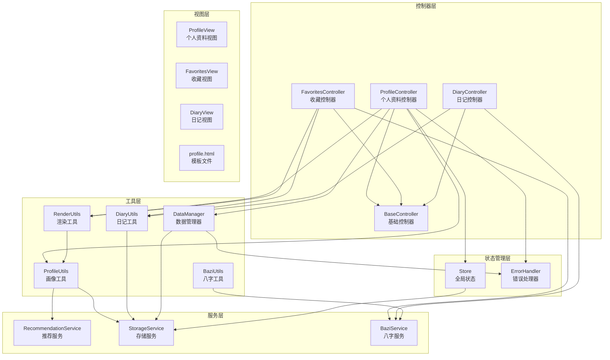

**图表来源**
- [profile.js](file://js/controllers/profile.js#L11-L17)
- [favorites.js](file://js/controllers/favorites.js#L10-L14)
- [diary.js](file://js/controllers/diary.js#L19-L23)
- [profile-utils.js](file://js/utils/profile.js#L6-L7)

**章节来源**
- [profile.js](file://js/controllers/profile.js#L1-L771)
- [profile.html](file://views/profile.html#L1-L334)

## 核心组件

### ProfileController - 个人资料控制器

ProfileController是个人资料页面的主要控制器，继承自BaseController基类，负责处理个人资料相关的所有业务逻辑。

**主要职责：**
- 管理个人资料视图的生命周期
- 处理数据导入导出操作
- 管理用户偏好设置
- 处理隐私设置和数据安全
- **新增**：管理Bazi分析功能
- **新增**：管理收藏列表显示
- **新增**：管理日记功能初始化

**关键特性：**
- 事件委托模式避免重复绑定
- 动态容器管理
- 完整的生命周期管理
- **新增**：Tab切换机制
- **新增**：滑动手势支持

### FavoritesController - 收藏控制器

**新增**：专门负责收藏管理的控制器，提供收藏列表的显示和管理功能。

**主要职责：**
- 渲染收藏列表
- 处理收藏的添加和删除
- 提供收藏详情查看
- 管理收藏状态更新

### DiaryController - 日记控制器

**新增**：专门负责日记管理的控制器，提供穿搭日记的记录、查看和统计功能。

**主要职责：**
- 渲染日历视图和时间线视图
- 管理日记记录的添加、编辑和删除
- 提供统计信息展示
- 处理照片上传和预览

### ProfileUtils - 画像工具模块

提供用户画像数据的计算和可视化功能，包括五行偏好分析、颜色偏好统计、场景分布和收藏趋势分析。

**核心功能：**
- 用户画像数据聚合
- 归一化分数计算
- 多种图表渲染（雷达图、柱状图、饼图、折线图）
- **新增**：支持Bazi分析结果渲染

### DataManager - 数据管理器

专门处理数据的导入、导出和清理操作，确保用户数据的安全性和完整性。

**主要功能：**
- 数据版本控制
- 完整的数据备份
- 安全的数据恢复
- 数据清理和统计

**章节来源**
- [profile.js](file://js/controllers/profile.js#L11-L17)
- [favorites.js](file://js/controllers/favorites.js#L10-L14)
- [diary.js](file://js/controllers/diary.js#L19-L23)
- [profile-utils.js](file://js/utils/profile.js#L24-L61)
- [data-manager.js](file://js/data/data-manager.js#L48-L72)

## 架构概览

个人资料控制器采用MVVM（Model-View-ViewModel）架构模式，实现了清晰的关注点分离：

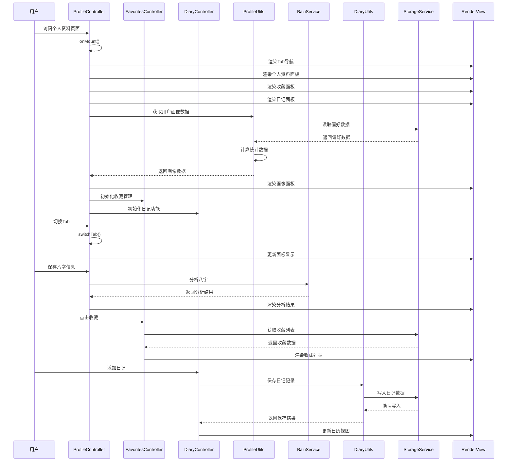

**图表来源**
- [profile.js](file://js/controllers/profile.js#L19-L49)
- [favorites.js](file://js/controllers/favorites.js#L16-L30)
- [diary.js](file://js/controllers/diary.js#L25-L38)
- [profile-utils.js](file://js/utils/profile.js#L24-L61)
- [bazi.js](file://js/services/bazi.js#L241-L251)
- [diary-utils.js](file://js/utils/diary.js#L57-L65)

## 详细组件分析

### ProfileController 实现分析

ProfileController继承自BaseController，实现了完整的生命周期管理和事件处理机制。

#### 生命周期管理

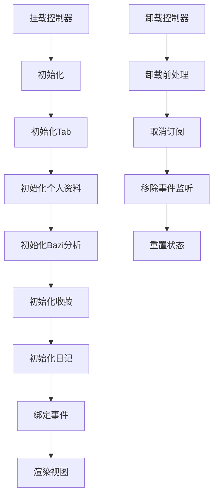

**图表来源**
- [base.js](file://js/controllers/base.js#L21-L42)

#### Tab切换机制

**新增**：ProfileController现在支持三个Tab面板的切换：

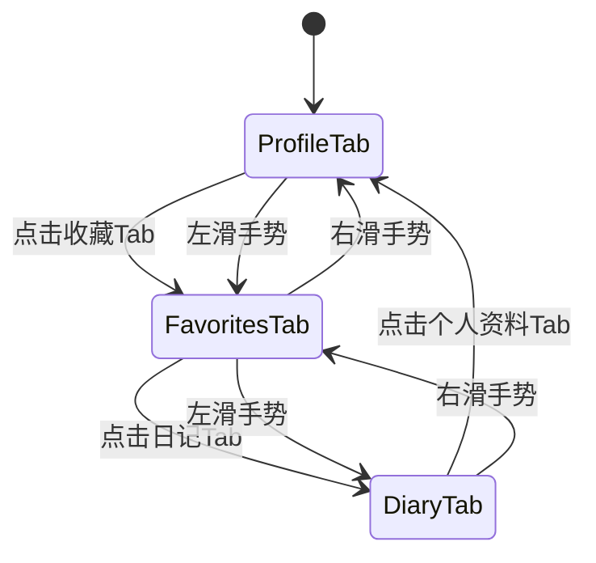

**图表来源**
- [profile.js](file://js/controllers/profile.js#L477-L498)

#### 事件处理机制

控制器采用事件委托模式，避免了重复绑定问题：

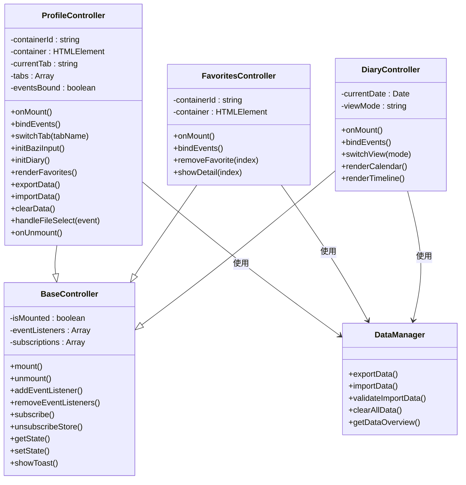

**图表来源**
- [profile.js](file://js/controllers/profile.js#L11-L17)
- [base.js](file://js/controllers/base.js#L11-L131)
- [favorites.js](file://js/controllers/favorites.js#L10-L14)
- [diary.js](file://js/controllers/diary.js#L19-L23)

#### 数据导入导出流程

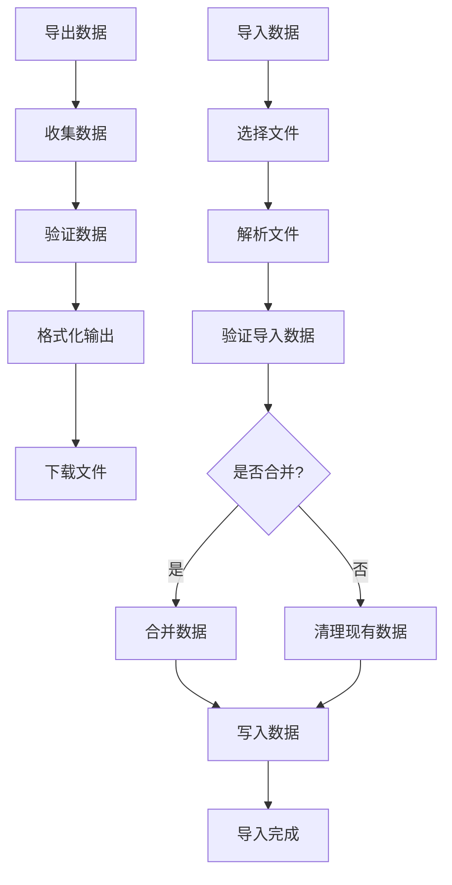

**图表来源**
- [data-manager.js](file://js/data/data-manager.js#L48-L184)

**章节来源**
- [profile.js](file://js/controllers/profile.js#L19-L771)
- [base.js](file://js/controllers/base.js#L11-L131)
- [favorites.js](file://js/controllers/favorites.js#L16-L89)
- [diary.js](file://js/controllers/diary.js#L25-L441)

### ProfileUtils 用户画像分析

ProfileUtils模块负责计算和可视化用户画像数据，提供了多种数据分析和图表渲染功能。

#### 用户画像数据结构

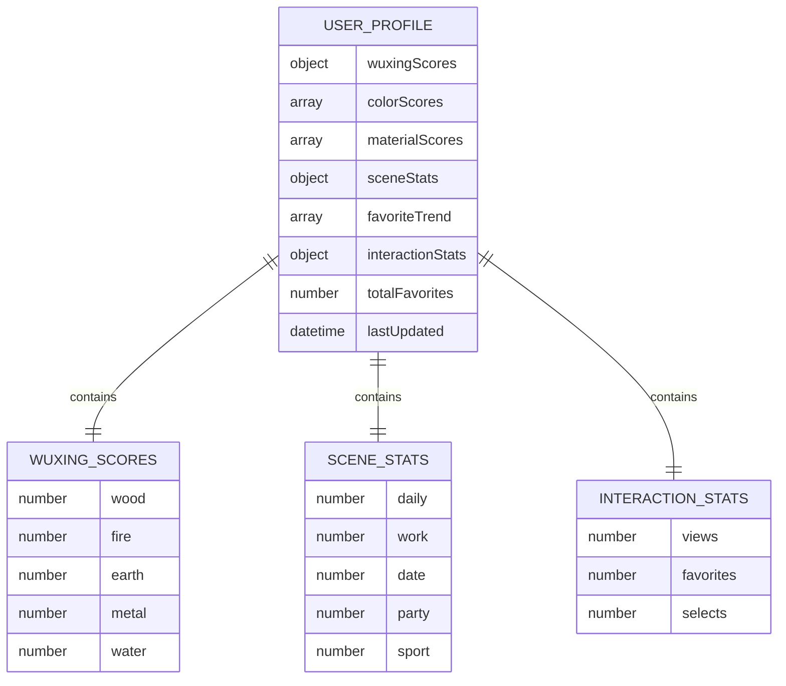

**图表来源**
- [profile-utils.js](file://js/utils/profile.js#L51-L61)

#### 图表渲染组件

系统提供了四种主要的图表渲染组件：

1. **五行雷达图** - 展示用户五行偏好的综合分析
2. **颜色偏好柱状图** - 显示用户颜色偏好的Top5排名
3. **场景分布饼图** - 分析用户在不同场景下的偏好分布
4. **收藏趋势折线图** - 展示用户收藏行为的时间趋势

**章节来源**
- [profile-utils.js](file://js/utils/profile.js#L24-L420)

### DataManager 数据管理

DataManager模块提供了完整的数据管理功能，包括数据备份、恢复和清理操作。

#### 数据版本控制

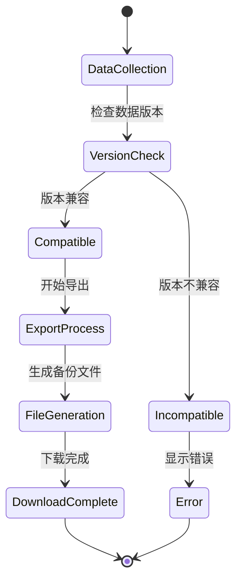

**图表来源**
- [data-manager.js](file://js/data/data-manager.js#L106-L135)

#### 数据验证机制

DataManager实现了多层次的数据验证机制：

1. **空数据检查** - 确保导入数据不为空
2. **版本兼容性检查** - 验证数据版本是否匹配
3. **结构完整性检查** - 确保数据结构符合预期
4. **内容有效性检查** - 验证具体数据的有效性

**章节来源**
- [data-manager.js](file://js/data/data-manager.js#L106-L184)

## 新增功能详解

### Bazi分析功能

**新增**：ProfileController集成了完整的Bazi（八字）分析功能，为用户提供个性化的五行穿搭建议。

#### 八字输入界面

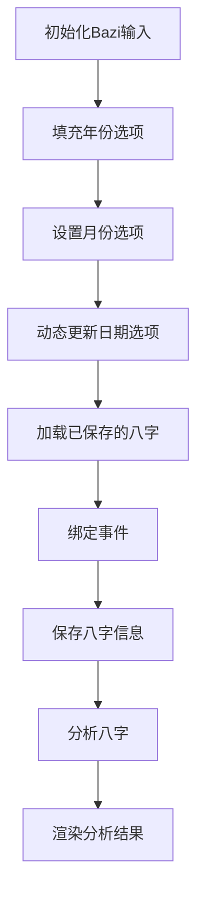

**图表来源**
- [profile.js](file://js/controllers/profile.js#L287-L400)

#### 八字分析流程

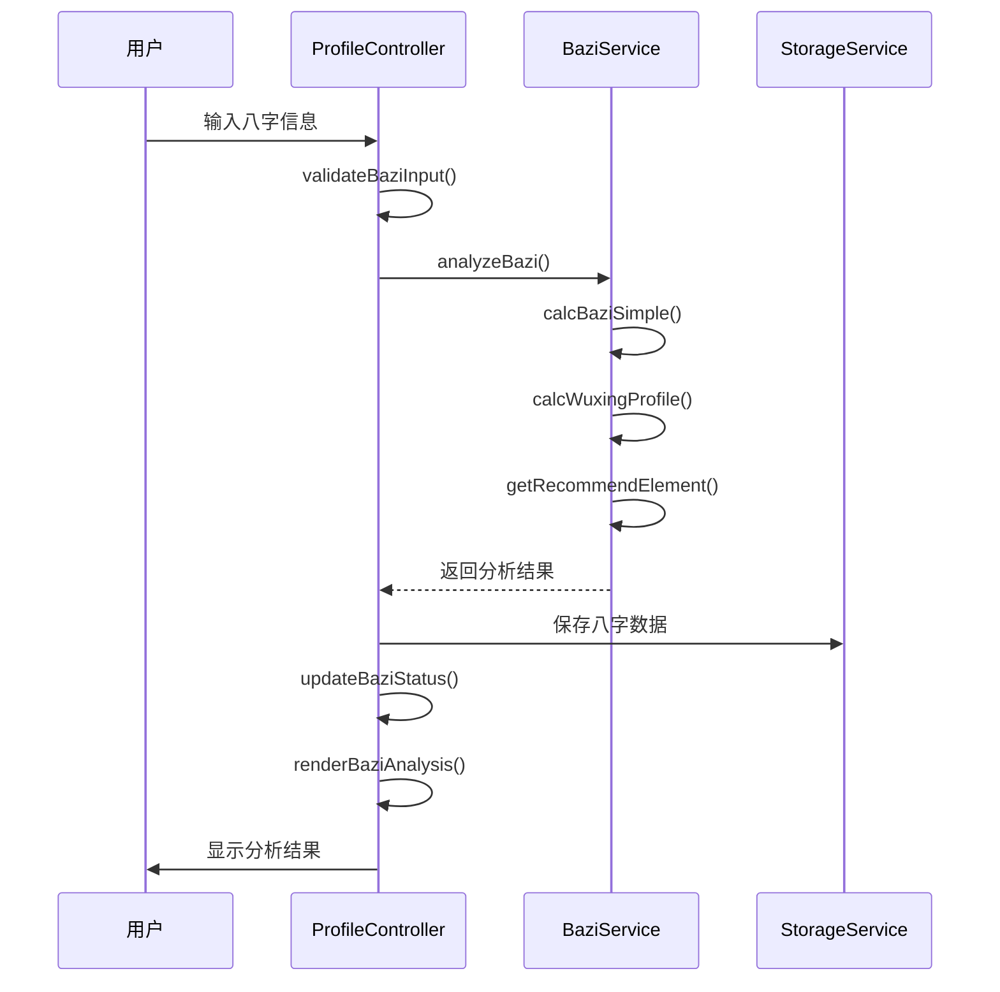

**图表来源**
- [profile.js](file://js/controllers/profile.js#L371-L400)
- [bazi.js](file://js/services/bazi.js#L241-L251)

#### 八字模板系统

**新增**：系统内置了Bazi模板数据库，根据不同年份和五行状态提供相应的穿搭建议。

**模板结构**：
- 年份标识：如 `wood_2024`、`fire_2025`
- 八字关键词：如 `日主木旺｜2024甲辰年`
- 时节信息：如 `谷雨`、`立夏`
- 颜色建议：如 `黛青`、`樱桃红`
- 材质建议：如 `桑蚕丝`、`冰丝混纺`
- 感官描述：如 `蕴藉感`、`灼灼感`
- 文化注释：引用经典文献

**章节来源**
- [profile.js](file://js/controllers/profile.js#L287-L472)
- [bazi.js](file://js/services/bazi.js#L1-L267)
- [bazi-templates.json](file://data/bazi-templates.json#L1-L103)

### 收藏追踪功能

**新增**：ProfileController集成了收藏管理功能，用户可以查看和管理自己的收藏记录。

#### 收藏列表渲染

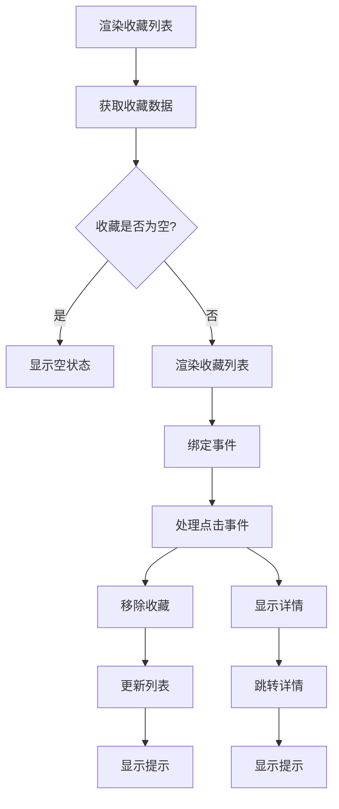

**图表来源**
- [profile.js](file://js/controllers/profile.js#L503-L517)
- [favorites.js](file://js/controllers/favorites.js#L69-L83)

#### 收藏数据管理

**新增**：通过Repository模式管理收藏数据，支持本地存储和数据持久化。

**收藏数据结构**：
- 方案ID：唯一标识符
- 添加时间：收藏的具体时间
- 方案详情：包含颜色、材质、场景等信息
- 用户元数据：添加者信息、来源等

**章节来源**
- [profile.js](file://js/controllers/profile.js#L503-L517)
- [favorites.js](file://js/controllers/favorites.js#L16-L89)
- [repository.js](file://js/data/repository.js#L86-L146)

### 日记功能

**新增**：ProfileController集成了完整的穿搭日记功能，支持日历视图和时间线视图。

#### 日记视图切换

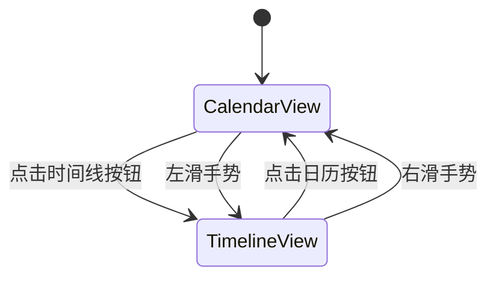

**图表来源**
- [profile.js](file://js/controllers/profile.js#L578-L593)

#### 日记编辑器

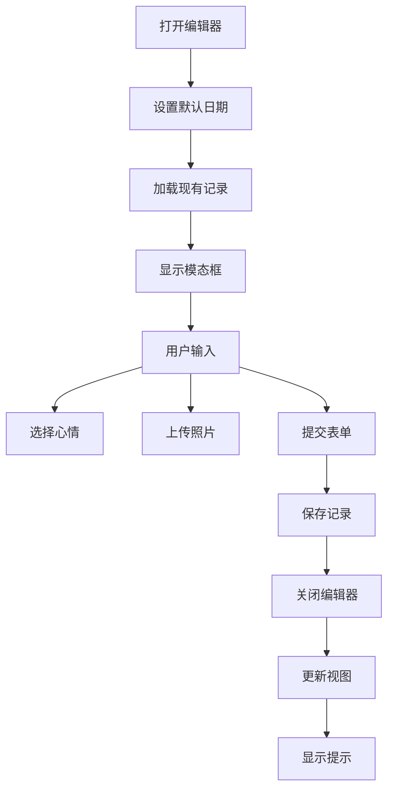

**图表来源**
- [profile.js](file://js/controllers/profile.js#L612-L641)

#### 日记统计功能

**新增**：提供多种统计维度，帮助用户了解自己的穿搭习惯。

**统计类型**：
- 连续记录天数：基于时间序列的连续性统计
- 颜色偏好统计：按颜色出现频率排序
- 材质偏好统计：按材质类型统计
- 心情分布统计：按不同心情分类统计

**章节来源**
- [profile.js](file://js/controllers/profile.js#L522-L641)
- [diary.js](file://js/controllers/diary.js#L25-L441)
- [diary-utils.js](file://js/utils/diary.js#L147-L242)

### Tab切换和滑动手势

**新增**：ProfileController实现了完整的Tab切换机制，支持鼠标点击和触摸滑动手势。

#### Tab切换机制

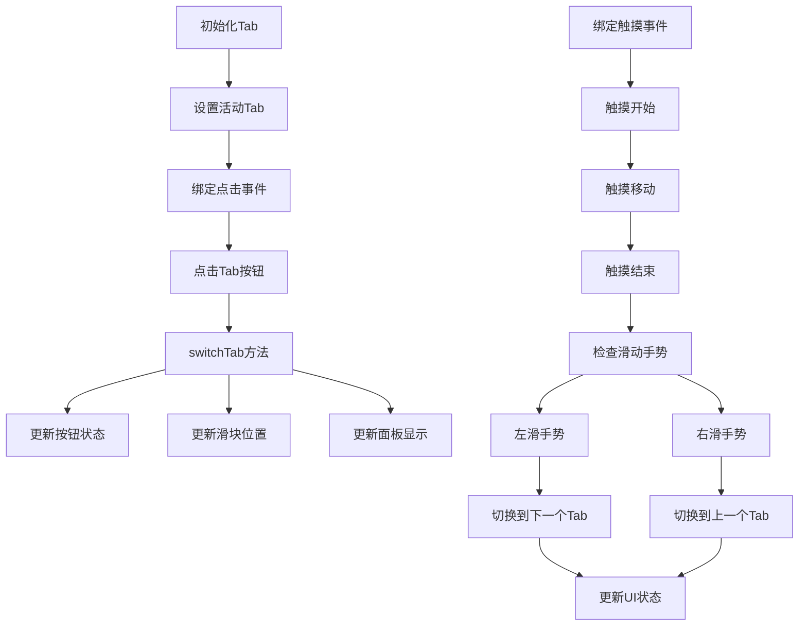

**图表来源**
- [profile.js](file://js/controllers/profile.js#L477-L498)
- [profile.js](file://js/controllers/profile.js#L692-L743)

**章节来源**
- [profile.js](file://js/controllers/profile.js#L477-L743)

## 依赖关系分析

个人资料控制器的依赖关系体现了清晰的分层架构：

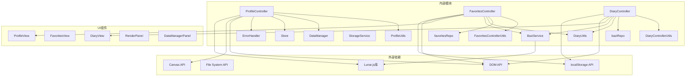

**图表来源**
- [profile.js](file://js/controllers/profile.js#L5-L9)
- [favorites.js](file://js/controllers/favorites.js#L5-L8)
- [diary.js](file://js/controllers/diary.js#L5-L16)

### 核心依赖关系

1. **控制器依赖**：ProfileController依赖BaseController提供生命周期管理
2. **工具依赖**：ProfileUtils依赖RecommendationService和StorageService进行数据处理
3. **数据依赖**：DataManager依赖StorageService和ErrorHandler确保数据安全
4. **UI依赖**：所有组件依赖RenderUtils进行视图渲染
5. **新增**：收藏和日记功能依赖各自的Repository进行数据管理
6. **新增**：Bazi分析功能依赖BaziService和Lunar.js库

**章节来源**
- [profile.js](file://js/controllers/profile.js#L5-L9)
- [favorites.js](file://js/controllers/favorites.js#L5-L8)
- [diary.js](file://js/controllers/diary.js#L5-L16)
- [profile-utils.js](file://js/utils/profile.js#L6-L7)

## 性能考虑

### 数据缓存策略

系统采用了多层缓存策略来优化性能：

1. **内存缓存**：用户偏好数据在内存中缓存，避免重复读取
2. **本地存储**：大量数据存储在localStorage中，支持离线访问
3. **计算缓存**：复杂的统计计算结果缓存，减少重复计算
4. **新增**：Tab内容缓存，避免重复渲染
5. **新增**：Bazi分析结果缓存，提升分析速度

### 异步处理优化

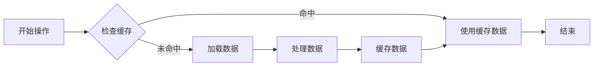

### 内存管理

系统实现了智能的内存管理机制：

1. **事件监听器清理**：卸载时自动清理所有事件监听器
2. **订阅管理**：Store订阅在卸载时自动取消
3. **DOM元素清理**：避免内存泄漏的DOM元素引用
4. **新增**：Tab内容懒加载，减少初始内存占用
5. **新增**：Canvas绘图优化，避免重复绘制

### 性能监控

**新增**：系统提供了基本的性能监控能力：

- Tab切换响应时间统计
- 图表渲染耗时监控
- 数据加载性能分析
- 内存使用情况跟踪

## 故障排除指南

### 常见问题及解决方案

#### 数据导入失败

**问题症状：**
- 导入操作显示错误提示
- 数据未正确导入
- 控制台出现异常信息

**排查步骤：**
1. 检查文件格式是否为JSON
2. 验证数据版本兼容性
3. 确认文件大小未超过限制
4. 检查浏览器存储权限

**解决方案：**
- 确保使用正确的备份文件
- 更新到最新版本的应用
- 清理浏览器存储空间
- 在隐私模式下重新尝试

#### Bazi分析异常

**问题症状：**
- 八字保存后无分析结果
- 分析结果显示错误
- 心跳库加载失败

**排查步骤：**
1. 检查Lunar.js库是否正确加载
2. 验证输入的八字信息是否完整
3. 确认时区设置是否正确
4. 检查浏览器兼容性

**解决方案：**
- 确保Lunar.js库正确引入
- 使用简版计算模式
- 检查网络连接
- 更新到最新版本

#### 收藏功能异常

**问题症状：**
- 收藏列表显示为空
- 添加收藏后无反应
- 删除收藏失败

**排查步骤：**
1. 检查localStorage是否可用
2. 验证收藏数据格式
3. 确认收藏ID是否唯一
4. 检查事件绑定是否正常

**解决方案：**
- 清理localStorage数据
- 重新初始化收藏数据
- 检查事件监听器绑定
- 重启应用后重试

#### 日记功能异常

**问题症状：**
- 日历视图显示异常
- 日记记录无法保存
- 统计数据显示错误

**排查步骤：**
1. 检查日记数据格式
2. 验证日期格式是否正确
3. 确认照片上传是否成功
4. 检查存储权限设置

**解决方案：**
- 修复日记数据格式
- 使用标准日期格式
- 检查文件大小限制
- 授权存储权限

#### Tab切换问题

**问题症状：**
- Tab切换无响应
- 滑动手势无效
- UI状态不同步

**排查步骤：**
1. 检查DOM元素是否存在
2. 验证事件绑定是否正确
3. 确认CSS样式是否影响交互
4. 检查JavaScript错误

**解决方案：**
- 重新绑定事件监听器
- 修复CSS样式冲突
- 检查JavaScript语法错误
- 刷新页面后重试

**章节来源**
- [error-handler.js](file://js/core/error-handler.js#L84-L92)
- [data-manager.js](file://js/data/data-manager.js#L191-L220)
- [profile.js](file://js/controllers/profile.js#L761-L765)

## 结论

个人资料控制器经过大幅增强后，已成为一个功能完整、架构清晰的个人资料管理平台。通过集成Bazi分析、收藏追踪、日记功能等新特性，系统为用户提供了更加丰富和个性化的体验。

### 主要优势

1. **架构清晰**：采用分层架构，职责分离明确
2. **功能完整**：集成了个人资料分析、收藏管理和日记记录三大核心功能
3. **用户体验优秀**：支持Tab切换和滑动手势，提供流畅的操作体验
4. **数据安全**：所有数据本地存储，保护用户隐私
5. **性能优化**：多层缓存和异步处理机制
6. **扩展性强**：模块化设计便于功能扩展和维护

### 技术亮点

1. **事件委托模式**：避免重复绑定，提高性能
2. **响应式状态管理**：基于Proxy的响应式状态更新
3. **数据版本控制**：确保数据迁移的兼容性
4. **安全存储包装**：统一的存储错误处理
5. **可视化分析**：丰富的图表渲染组件
6. **新增**：Bazi分析引擎，提供个性化建议
7. **新增**：Repository模式，规范数据访问
8. **新增**：滑动手势支持，提升交互体验

### 改进建议

1. **并发控制**：实现数据更新的并发控制机制
2. **增量备份**：支持增量数据备份功能
3. **云同步**：添加可选的云同步功能
4. **数据压缩**：对大容量数据进行压缩存储
5. **性能监控**：添加详细的性能监控指标
6. **新增**：Bazi分析精度提升，支持更精确的计算
7. **新增**：收藏搜索和筛选功能
8. **新增**：日记标签和分类管理
9. **新增**：数据导入导出的批量操作
10. **新增**：用户反馈和帮助系统

个人资料控制器为整个应用提供了坚实的基础，通过持续的优化和改进，能够为用户提供更加优质的个人资料管理体验。新的功能组合使其成为了一个真正的个人数字助理，帮助用户更好地理解和管理自己的穿搭偏好和生活习惯。