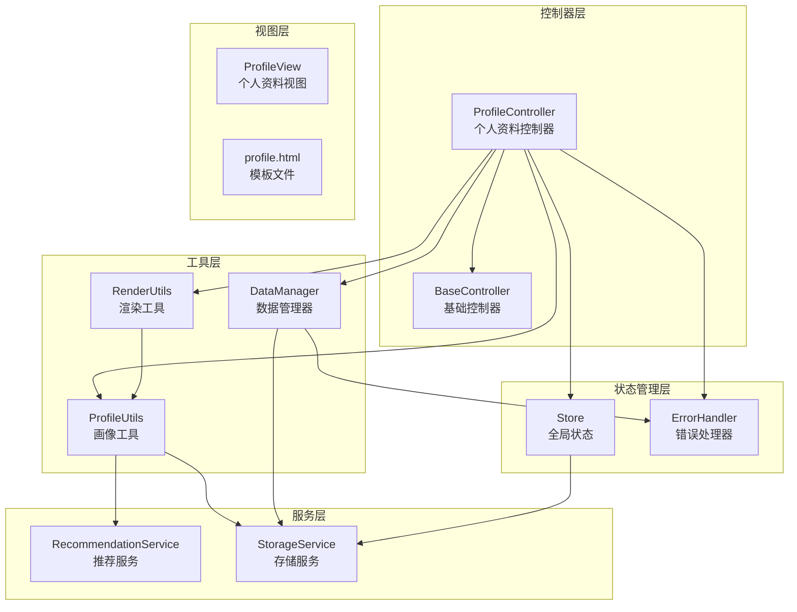
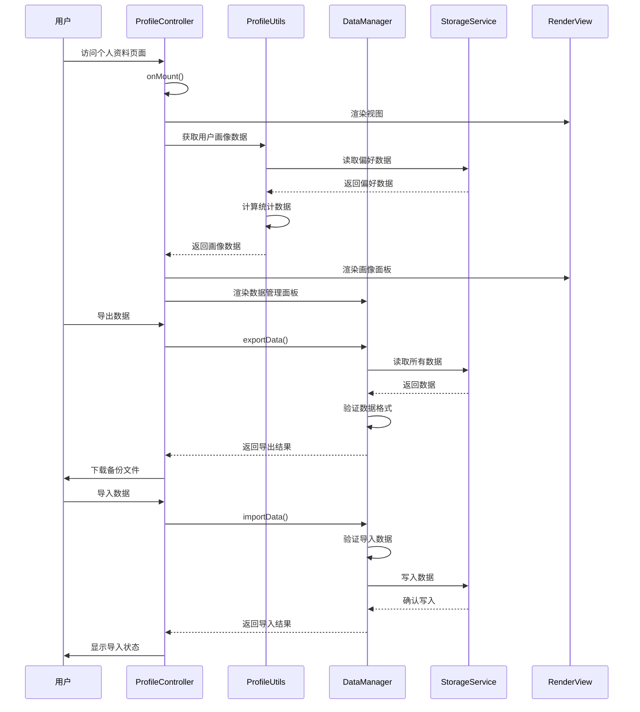
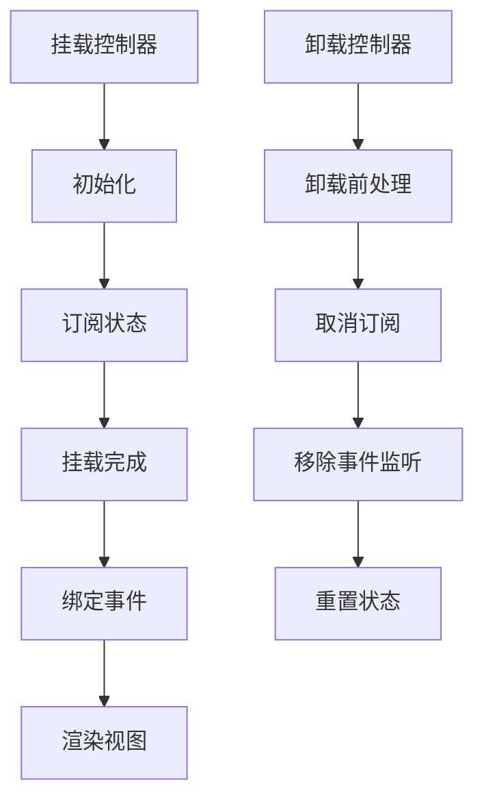
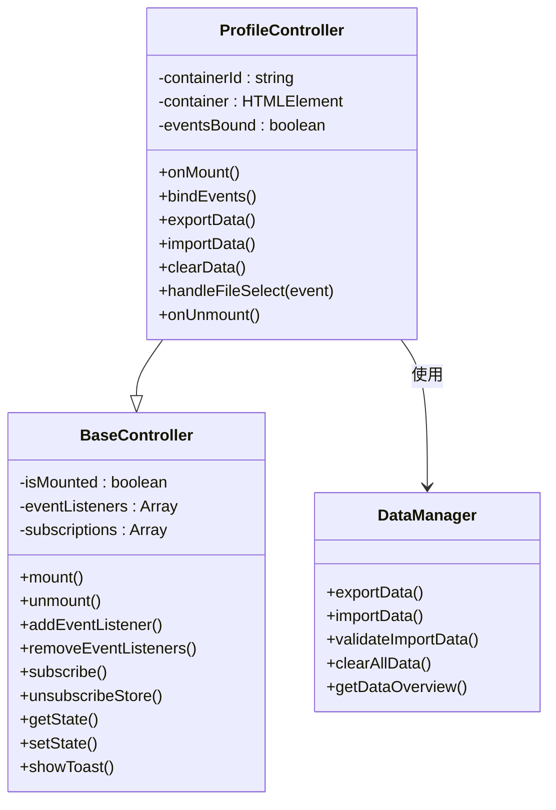
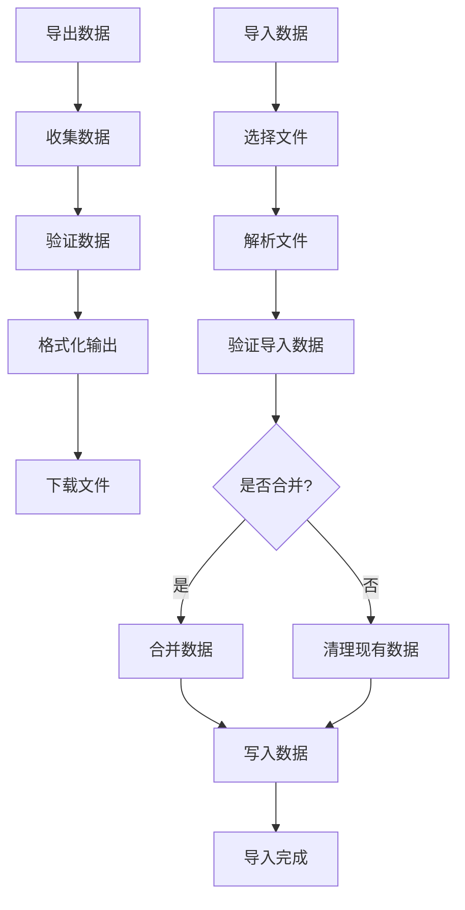
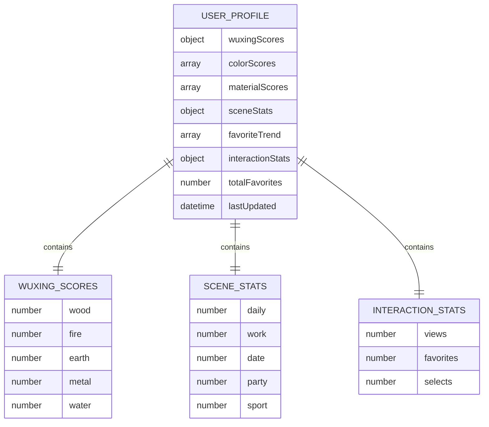
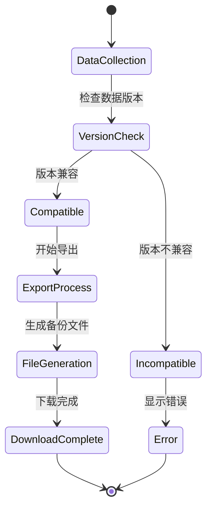
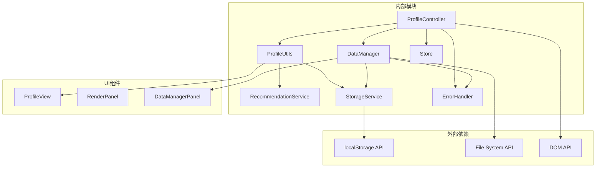
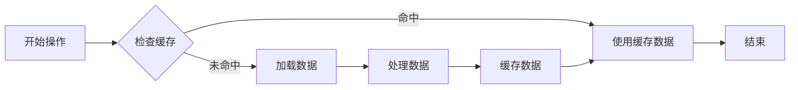

# 个人资料控制器

<cite>
**本文档引用的文件**
- [profile.js](file://js/controllers/profile.js)
- [profile-utils.js](file://js/utils/profile.js)
- [profile.html](file://views/profile.html)
- [data-manager.js](file://js/data/data-manager.js)
- [store.js](file://js/core/store.js)
- [recommendation.js](file://js/services/recommendation.js)
- [storage.js](file://js/data/storage.js)
- [render.js](file://js/utils/render.js)
- [base.js](file://js/controllers/base.js)
- [error-handler.js](file://js/core/error-handler.js)
- [repository.js](file://js/data/repository.js)
</cite>

## 目录
1. [简介](#简介)
2. [项目结构](#项目结构)
3. [核心组件](#核心组件)
4. [架构概览](#架构概览)
5. [详细组件分析](#详细组件分析)
6. [依赖关系分析](#依赖关系分析)
7. [性能考虑](#性能考虑)
8. [故障排除指南](#故障排除指南)
9. [结论](#结论)

## 简介

个人资料控制器是五行穿搭建议应用中的核心模块，负责管理用户信息管理和设置配置。该控制器实现了用户画像的可视化展示、数据导入导出功能以及隐私设置管理。通过采用MVVM架构模式，控制器与视图层解耦，提供了良好的用户体验和数据安全性。

该系统专注于本地数据存储，所有用户偏好、反馈数据和收藏信息都存储在用户的设备上，确保了数据隐私和安全性。控制器通过事件驱动的方式处理用户交互，实现了响应式的数据更新和界面渲染。

## 项目结构

个人资料控制器位于应用的前端架构中，采用模块化设计，主要包含以下层次：

**图表来源**
- [profile.js](file://js/controllers/profile.js#L1-L91)
- [profile-utils.js](file://js/utils/profile.js#L1-L420)
- [data-manager.js](file://js/data/data-manager.js#L1-L376)

**章节来源**
- [profile.js](file://js/controllers/profile.js#L1-L91)
- [profile.html](file://views/profile.html#L1-L21)

## 核心组件

### ProfileController - 个人资料控制器

ProfileController是个人资料页面的主要控制器，继承自BaseController基类，负责处理个人资料相关的所有业务逻辑。

**主要职责：**
- 管理个人资料视图的生命周期
- 处理数据导入导出操作
- 管理用户偏好设置
- 处理隐私设置和数据安全

**关键特性：**
- 事件委托模式避免重复绑定
- 动态容器管理
- 完整的生命周期管理

### ProfileUtils - 画像工具模块

提供用户画像数据的计算和可视化功能，包括五行偏好分析、颜色偏好统计、场景分布和收藏趋势分析。

**核心功能：**
- 用户画像数据聚合
- 归一化分数计算
- 多种图表渲染（雷达图、柱状图、饼图、折线图）

### DataManager - 数据管理器

专门处理数据的导入、导出和清理操作，确保用户数据的安全性和完整性。

**主要功能：**
- 数据版本控制
- 完整的数据备份
- 安全的数据恢复
- 数据清理和统计

**章节来源**
- [profile.js](file://js/controllers/profile.js#L9-L91)
- [profile-utils.js](file://js/utils/profile.js#L24-L61)
- [data-manager.js](file://js/data/data-manager.js#L48-L72)

## 架构概览

个人资料控制器采用MVVM（Model-View-ViewModel）架构模式，实现了清晰的关注点分离：

**图表来源**
- [profile.js](file://js/controllers/profile.js#L15-L28)
- [profile-utils.js](file://js/utils/profile.js#L24-L61)
- [data-manager.js](file://js/data/data-manager.js#L48-L184)

## 详细组件分析

### ProfileController 实现分析

ProfileController继承自BaseController，实现了完整的生命周期管理和事件处理机制。

#### 生命周期管理

**图表来源**
- [base.js](file://js/controllers/base.js#L21-L42)

#### 事件处理机制

控制器采用事件委托模式，避免了重复绑定问题：

**图表来源**
- [profile.js](file://js/controllers/profile.js#L9-L91)
- [base.js](file://js/controllers/base.js#L11-L131)

#### 数据导入导出流程

**图表来源**
- [data-manager.js](file://js/data/data-manager.js#L48-L184)

**章节来源**
- [profile.js](file://js/controllers/profile.js#L15-L91)
- [base.js](file://js/controllers/base.js#L11-L131)

### ProfileUtils 用户画像分析

ProfileUtils模块负责计算和可视化用户画像数据，提供了多种数据分析和图表渲染功能。

#### 用户画像数据结构

**图表来源**
- [profile-utils.js](file://js/utils/profile.js#L51-L61)

#### 图表渲染组件

系统提供了四种主要的图表渲染组件：

1. **五行雷达图** - 展示用户五行偏好的综合分析
2. **颜色偏好柱状图** - 显示用户颜色偏好的Top5排名
3. **场景分布饼图** - 分析用户在不同场景下的偏好分布
4. **收藏趋势折线图** - 展示用户收藏行为的时间趋势

**章节来源**
- [profile-utils.js](file://js/utils/profile.js#L24-L420)

### DataManager 数据管理

DataManager模块提供了完整的数据管理功能，包括数据备份、恢复和清理操作。

#### 数据版本控制

**图表来源**
- [data-manager.js](file://js/data/data-manager.js#L106-L135)

#### 数据验证机制

DataManager实现了多层次的数据验证机制：

1. **空数据检查** - 确保导入数据不为空
2. **版本兼容性检查** - 验证数据版本是否匹配
3. **结构完整性检查** - 确保数据结构符合预期
4. **内容有效性检查** - 验证具体数据的有效性

**章节来源**
- [data-manager.js](file://js/data/data-manager.js#L106-L184)

## 依赖关系分析

个人资料控制器的依赖关系体现了清晰的分层架构：

**图表来源**
- [profile.js](file://js/controllers/profile.js#L5-L8)
- [profile-utils.js](file://js/utils/profile.js#L6-L8)

### 核心依赖关系

1. **控制器依赖**：ProfileController依赖BaseController提供生命周期管理
2. **工具依赖**：ProfileUtils依赖RecommendationService和StorageService进行数据处理
3. **数据依赖**：DataManager依赖StorageService和ErrorHandler确保数据安全
4. **UI依赖**：所有组件依赖RenderUtils进行视图渲染

**章节来源**
- [profile.js](file://js/controllers/profile.js#L5-L8)
- [profile-utils.js](file://js/utils/profile.js#L6-L8)

## 性能考虑

### 数据缓存策略

系统采用了多层缓存策略来优化性能：

1. **内存缓存**：用户偏好数据在内存中缓存，避免重复读取
2. **本地存储**：大量数据存储在localStorage中，支持离线访问
3. **计算缓存**：复杂的统计计算结果缓存，减少重复计算

### 异步处理优化

### 内存管理

系统实现了智能的内存管理机制：

1. **事件监听器清理**：卸载时自动清理所有事件监听器
2. **订阅管理**：Store订阅在卸载时自动取消
3. **DOM元素清理**：避免内存泄漏的DOM元素引用

## 故障排除指南

### 常见问题及解决方案

#### 数据导入失败

**问题症状：**
- 导入操作显示错误提示
- 数据未正确导入
- 控制台出现异常信息

**排查步骤：**
1. 检查文件格式是否为JSON
2. 验证数据版本兼容性
3. 确认文件大小未超过限制
4. 检查浏览器存储权限

**解决方案：**
- 确保使用正确的备份文件
- 更新到最新版本的应用
- 清理浏览器存储空间
- 在隐私模式下重新尝试

#### 数据导出异常

**问题症状：**
- 导出文件无法下载
- 导出数据不完整
- 文件格式错误

**排查步骤：**
1. 检查浏览器下载设置
2. 验证文件命名规则
3. 确认数据完整性
4. 检查文件大小限制

**解决方案：**
- 允许浏览器下载弹窗
- 清理过期数据
- 分批导出大数据集
- 使用其他浏览器尝试

#### 性能问题

**问题症状：**
- 页面加载缓慢
- 图表渲染卡顿
- 交互响应延迟

**排查步骤：**
1. 检查数据量大小
2. 分析内存使用情况
3. 监控CPU使用率
4. 检查网络连接

**解决方案：**
- 清理不必要的数据
- 优化图表渲染
- 实施数据分页
- 减少DOM操作

**章节来源**
- [error-handler.js](file://js/core/error-handler.js#L84-L92)
- [data-manager.js](file://js/data/data-manager.js#L191-L220)

## 结论

个人资料控制器是一个设计精良的模块化组件，它成功地实现了用户信息管理的核心功能。通过采用MVVM架构模式和模块化设计，系统具备了良好的可维护性和扩展性。

### 主要优势

1. **架构清晰**：采用分层架构，职责分离明确
2. **数据安全**：所有数据本地存储，保护用户隐私
3. **用户体验**：响应式设计，流畅的交互体验
4. **性能优化**：多层缓存和异步处理机制
5. **错误处理**：完善的错误处理和用户提示机制

### 技术亮点

1. **事件委托模式**：避免重复绑定，提高性能
2. **响应式状态管理**：基于Proxy的响应式状态更新
3. **数据版本控制**：确保数据迁移的兼容性
4. **安全存储包装**：统一的存储错误处理
5. **可视化分析**：丰富的图表渲染组件

### 改进建议

1. **并发控制**：实现数据更新的并发控制机制
2. **增量备份**：支持增量数据备份功能
3. **云同步**：添加可选的云同步功能
4. **数据压缩**：对大容量数据进行压缩存储
5. **性能监控**：添加详细的性能监控指标

个人资料控制器为整个应用提供了坚实的基础，通过持续的优化和改进，能够为用户提供更加优质的个人资料管理体验。