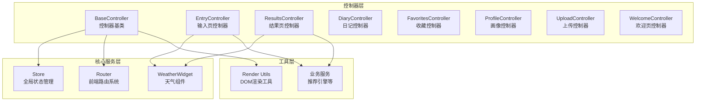
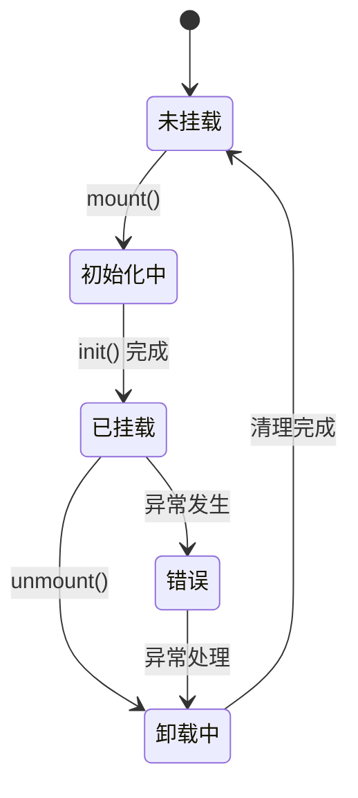
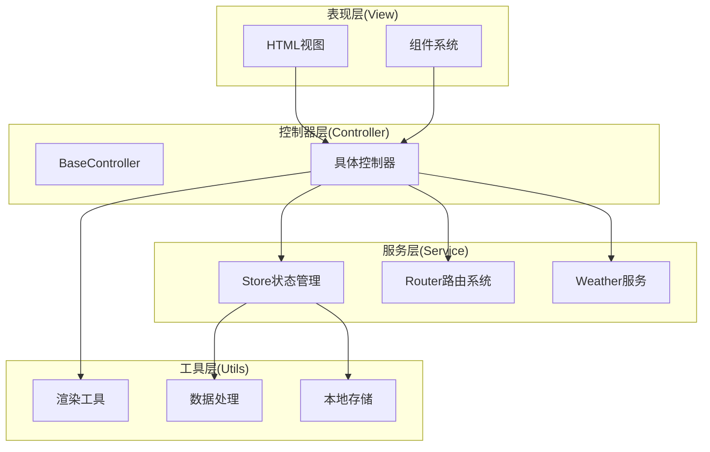
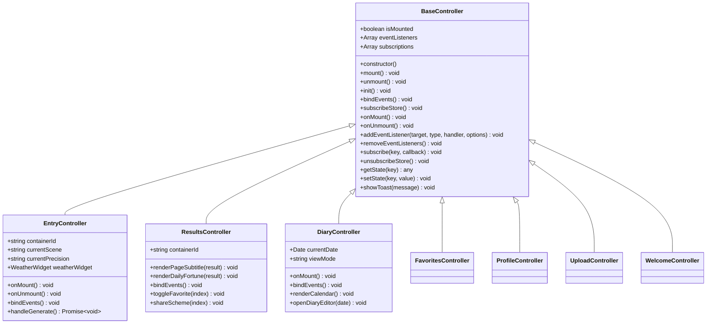
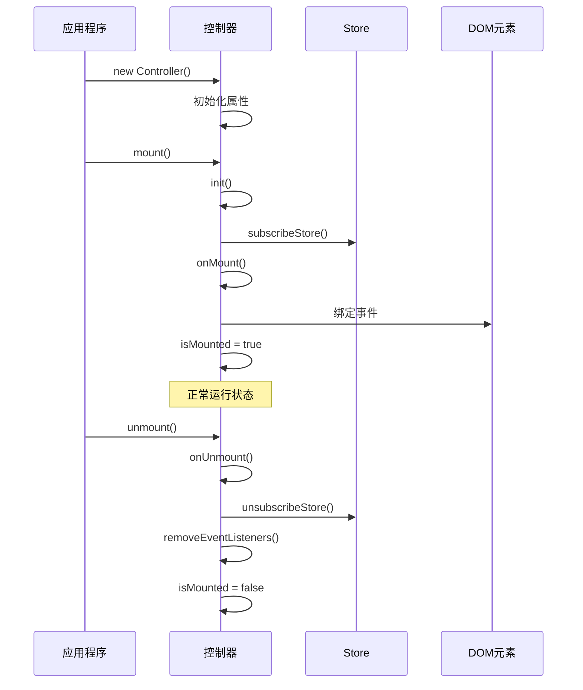
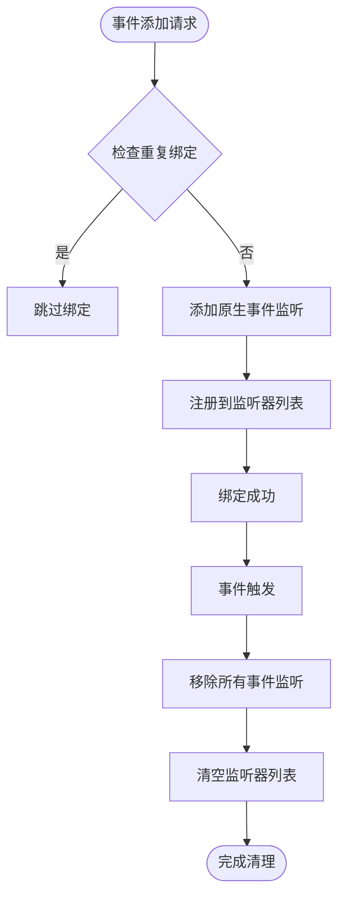
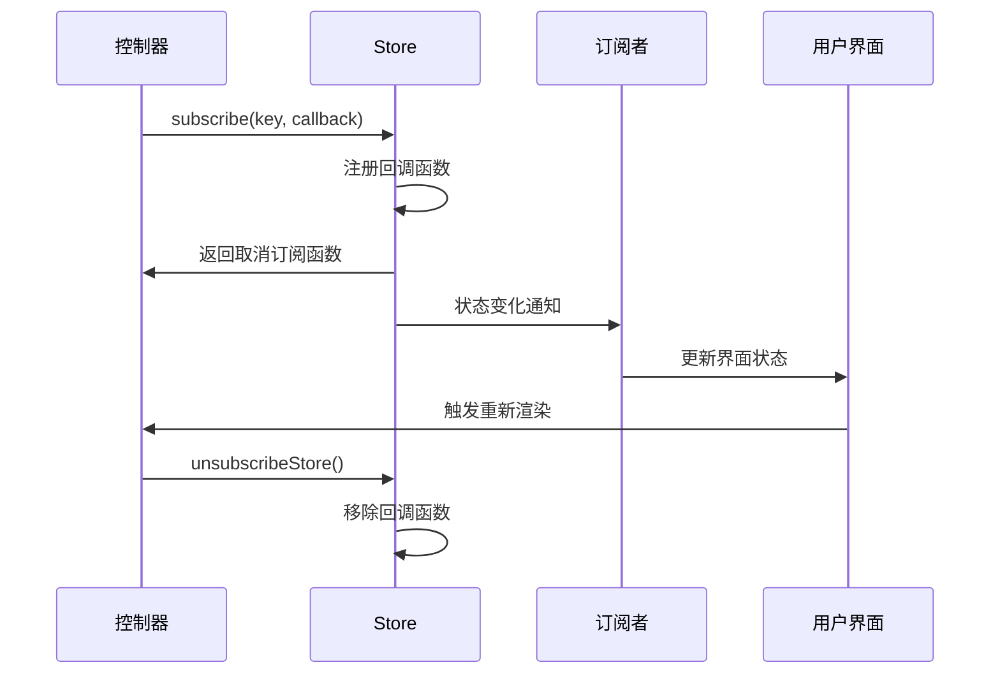
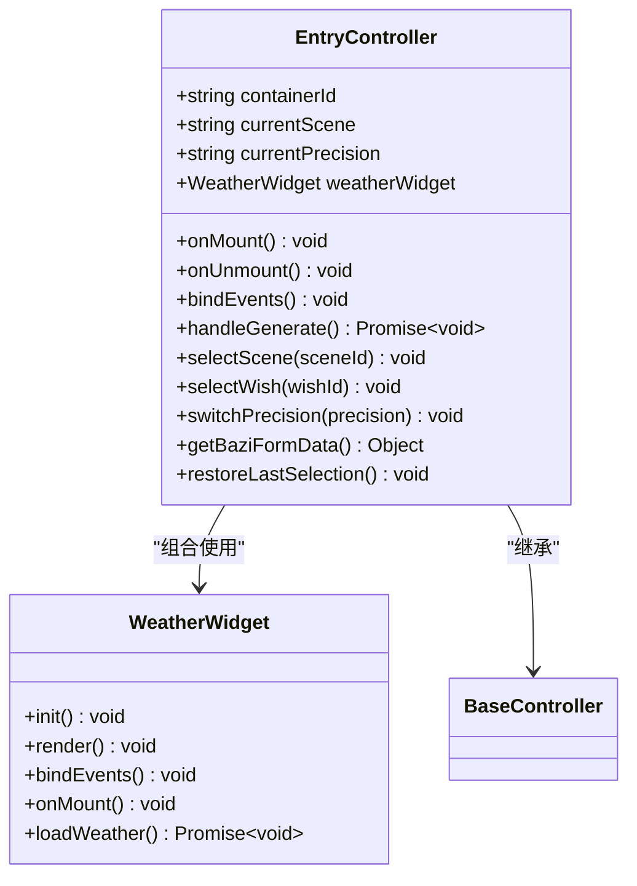
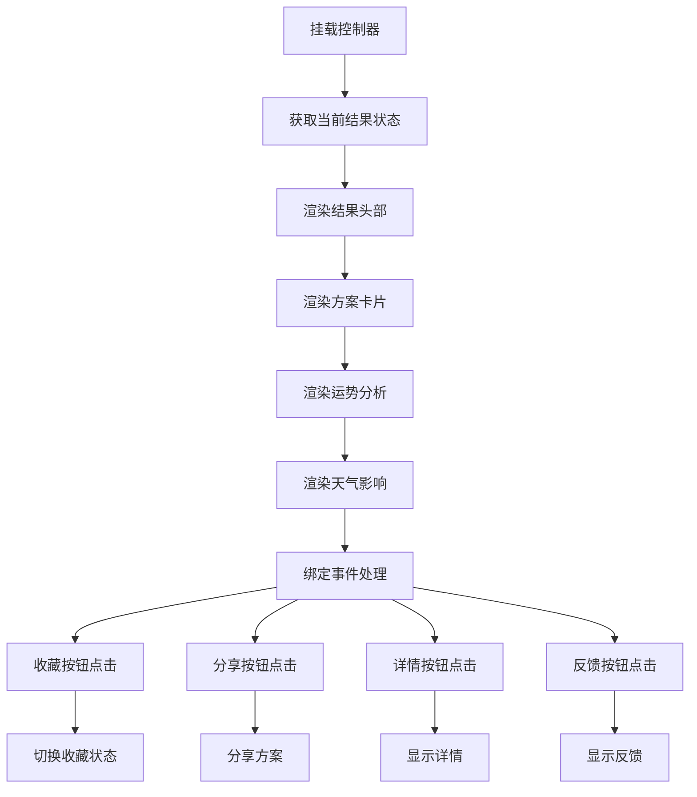
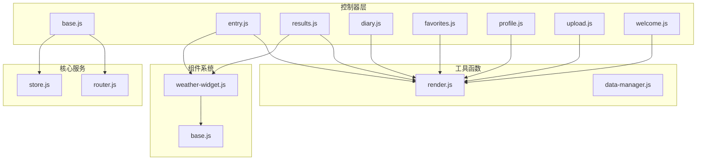

# 控制器基类设计

<cite>
**本文档引用的文件**
- [js/controllers/base.js](file://js/controllers/base.js)
- [js/core/store.js](file://js/core/store.js)
- [js/core/router.js](file://js/core/router.js)
- [js/controllers/diary.js](file://js/controllers/diary.js)
- [js/controllers/entry.js](file://js/controllers/entry.js)
- [js/controllers/favorites.js](file://js/controllers/favorites.js)
- [js/controllers/profile.js](file://js/controllers/profile.js)
- [js/controllers/results.js](file://js/controllers/results.js)
- [js/controllers/upload.js](file://js/controllers/upload.js)
- [js/controllers/welcome.js](file://js/controllers/welcome.js)
- [js/components/weather-widget.js](file://js/components/weather-widget.js)
- [js/utils/render.js](file://js/utils/render.js)
</cite>

## 目录
1. [简介](#简介)
2. [项目结构](#项目结构)
3. [核心组件](#核心组件)
4. [架构概览](#架构概览)
5. [详细组件分析](#详细组件分析)
6. [依赖关系分析](#依赖关系分析)
7. [性能考虑](#性能考虑)
8. [故障排除指南](#故障排除指南)
9. [结论](#结论)

## 简介

本文档深入解析了基于 JavaScript 的控制器基类设计，重点分析 BaseController 基类的核心架构和设计原理。该系统采用 MVVM 架构模式，通过控制器基类统一管理视图生命周期、事件管理和状态同步机制。

系统包含完整的控制器继承体系，支持动态视图加载、事件委托、状态管理等功能，为多页面应用提供了清晰的架构基础。

## 项目结构

该项目采用模块化组织方式，主要目录结构如下：

**图表来源**
- [js/controllers/base.js](file://js/controllers/base.js#L1-L131)
- [js/core/store.js](file://js/core/store.js#L1-L212)
- [js/core/router.js](file://js/core/router.js#L1-L142)

**章节来源**
- [js/controllers/base.js](file://js/controllers/base.js#L1-L131)
- [js/core/store.js](file://js/core/store.js#L1-L212)
- [js/core/router.js](file://js/core/router.js#L1-L142)

## 核心组件

### BaseController 基类

BaseController 是整个系统的核心控制器基类，提供了统一的生命周期管理和资源管理机制。

#### 核心属性

| 属性名 | 类型 | 描述 | 默认值 |
|--------|------|------|--------|
| isMounted | boolean | 控制器挂载状态标识 | false |
| eventListeners | Array | 事件监听器列表 | [] |
| subscriptions | Array | Store订阅回调列表 | [] |

#### 生命周期管理

BaseController 实现了完整的生命周期管理机制：

**图表来源**
- [js/controllers/base.js](file://js/controllers/base.js#L21-L42)

#### 关键方法

1. **mount()** - 控制器挂载流程
   - 防重复挂载检查
   - 执行初始化逻辑
   - 订阅状态变化
   - 触发挂载完成回调
   - 绑定事件处理器

2. **unmount()** - 控制器卸载流程
   - 执行卸载前回调
   - 取消状态订阅
   - 移除事件监听
   - 重置挂载状态

3. **init()** - 子类初始化钩子
   - 用于设置初始状态
   - 准备必要的数据结构

4. **bindEvents()** - 事件绑定钩子
   - 实现事件处理器绑定
   - 避免重复绑定机制

5. **subscribeStore()** - 状态订阅钩子
   - 订阅特定状态变化
   - 实现状态驱动的UI更新

6. **onMount()** - 挂载完成回调
   - 视图容器获取
   - 初始渲染逻辑

7. **onUnmount()** - 卸载前回调
   - 清理工作执行
   - 状态重置

**章节来源**
- [js/controllers/base.js](file://js/controllers/base.js#L11-L131)

## 架构概览

系统采用分层架构设计，各层职责明确：

**图表来源**
- [js/controllers/base.js](file://js/controllers/base.js#L1-L131)
- [js/core/store.js](file://js/core/store.js#L1-L212)
- [js/core/router.js](file://js/core/router.js#L1-L142)

## 详细组件分析

### BaseController 类设计

#### 类关系图

**图表来源**
- [js/controllers/base.js](file://js/controllers/base.js#L11-L131)
- [js/controllers/entry.js](file://js/controllers/entry.js#L14-L241)
- [js/controllers/results.js](file://js/controllers/results.js#L13-L614)
- [js/controllers/diary.js](file://js/controllers/diary.js#L19-L440)

#### 生命周期序列图

**图表来源**
- [js/controllers/base.js](file://js/controllers/base.js#L21-L42)

**章节来源**
- [js/controllers/base.js](file://js/controllers/base.js#L11-L131)

### 事件管理系统

#### 事件管理机制

BaseController 提供了完善的事件管理功能：

**图表来源**
- [js/controllers/base.js](file://js/controllers/base.js#L72-L85)

#### 事件绑定最佳实践

1. **避免重复绑定**：每个控制器实例维护独立的事件绑定状态
2. **统一清理机制**：卸载时自动移除所有事件监听
3. **内存泄漏防护**：确保事件监听器及时释放
4. **异步事件处理**：支持异步事件处理器

**章节来源**
- [js/controllers/base.js](file://js/controllers/base.js#L72-L85)

### Store 订阅机制

#### 状态同步策略

**图表来源**
- [js/controllers/base.js](file://js/controllers/base.js#L92-L103)
- [js/core/store.js](file://js/core/store.js#L99-L110)

#### 订阅管理策略

1. **弱引用管理**：Store 使用 Set 存储订阅者，避免循环引用
2. **批量取消**：支持一次性取消多个订阅
3. **错误隔离**：订阅者错误不影响其他订阅者
4. **调试支持**：提供状态快照和调试模式

**章节来源**
- [js/core/store.js](file://js/core/store.js#L99-L141)

### 具体控制器实现

#### EntryController 分析

EntryController 作为输入页控制器，展示了完整的控制器使用模式：

**图表来源**
- [js/controllers/entry.js](file://js/controllers/entry.js#L14-L241)
- [js/components/weather-widget.js](file://js/components/weather-widget.js#L12-L215)

#### ResultsController 分析

ResultsController 展示了复杂的状态管理和事件处理：

**图表来源**
- [js/controllers/results.js](file://js/controllers/results.js#L20-L359)

**章节来源**
- [js/controllers/entry.js](file://js/controllers/entry.js#L14-L241)
- [js/controllers/results.js](file://js/controllers/results.js#L13-L614)

## 依赖关系分析

### 模块依赖图

**图表来源**
- [js/controllers/base.js](file://js/controllers/base.js#L6-L6)
- [js/core/store.js](file://js/core/store.js#L1-L212)
- [js/core/router.js](file://js/core/router.js#L1-L142)
- [js/components/weather-widget.js](file://js/components/weather-widget.js#L1-L215)

### 依赖注入模式

系统采用依赖注入的方式管理模块间的依赖关系：

1. **构造函数注入**：控制器通过构造函数接收依赖
2. **静态导入**：模块间通过 ES6 模块系统导入
3. **运行时依赖**：部分依赖在运行时动态创建

**章节来源**
- [js/controllers/base.js](file://js/controllers/base.js#L6-L6)
- [js/core/store.js](file://js/core/store.js#L1-L212)
- [js/core/router.js](file://js/core/router.js#L1-L142)

## 性能考虑

### 内存管理策略

1. **事件监听器清理**：卸载时自动移除所有事件监听器
2. **Store订阅管理**：支持批量取消订阅，防止内存泄漏
3. **DOM引用管理**：避免长时间持有DOM节点引用
4. **异步操作清理**：提供异步操作的取消机制

### 渲染优化

1. **按需渲染**：只在状态变化时更新相关UI
2. **事件委托**：使用事件委托减少事件处理器数量
3. **虚拟DOM**：通过模板字符串实现高效的DOM更新
4. **缓存机制**：对计算结果进行缓存

### 并发控制

1. **异步状态更新**：避免状态更新过程中的竞态条件
2. **防抖节流**：对频繁触发的事件进行防抖处理
3. **Promise链**：使用Promise链处理异步操作序列

## 故障排除指南

### 常见问题及解决方案

#### 1. 事件绑定失效

**问题症状**：
- 事件处理器无法响应
- 控制器无法正确卸载

**解决方法**：
- 检查 `eventsBound` 标志位
- 确认事件绑定时机（应在 `onMount` 后重新绑定）
- 验证 DOM 元素是否存在

#### 2. 状态更新不生效

**问题症状**：
- Store 状态变化但UI未更新
- 订阅回调未被调用

**解决方法**：
- 检查状态键名是否正确
- 确认订阅函数返回值
- 验证状态变化检测逻辑

#### 3. 内存泄漏

**问题症状**：
- 页面切换后内存持续增长
- 控制器无法正常卸载

**解决方法**：
- 确保所有事件监听器都被移除
- 检查 Store 订阅是否正确取消
- 验证定时器和异步操作的清理

**章节来源**
- [js/controllers/base.js](file://js/controllers/base.js#L72-L103)

### 调试技巧

1. **状态监控**：使用 Store 的 `snapshot()` 方法查看状态快照
2. **事件追踪**：通过 `eventListeners` 数组检查事件绑定情况
3. **生命周期验证**：在关键生命周期方法中添加日志输出
4. **内存分析**：使用浏览器开发者工具分析内存使用情况

## 结论

BaseController 基类设计体现了现代前端架构的最佳实践，通过统一的生命周期管理、事件管理和状态同步机制，为复杂的多页面应用提供了稳定的基础框架。

### 设计优势

1. **清晰的职责分离**：控制器专注于业务逻辑，不直接操作DOM
2. **良好的可扩展性**：通过钩子方法支持灵活的功能扩展
3. **完善的资源管理**：自动化的事件和状态清理机制
4. **强类型支持**：TypeScript 类型定义确保代码质量

### 最佳实践建议

1. **遵循生命周期约定**：严格按照生命周期顺序实现各个钩子方法
2. **谨慎使用全局状态**：避免过度依赖全局状态，优先使用局部状态
3. **合理使用事件委托**：在复杂事件处理中使用事件委托提高性能
4. **注意内存管理**：始终确保资源的正确清理和释放

该控制器基类设计为构建大型单页应用提供了坚实的技术基础，通过合理的架构设计和严格的代码规范，能够有效提升应用的可维护性和可扩展性。