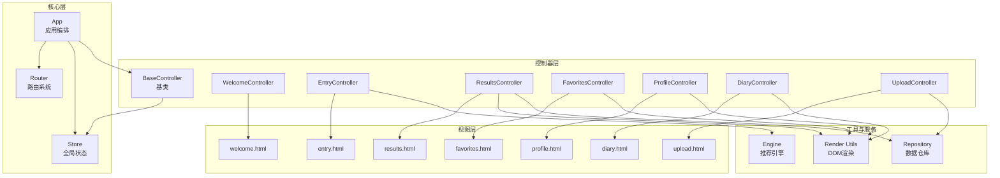
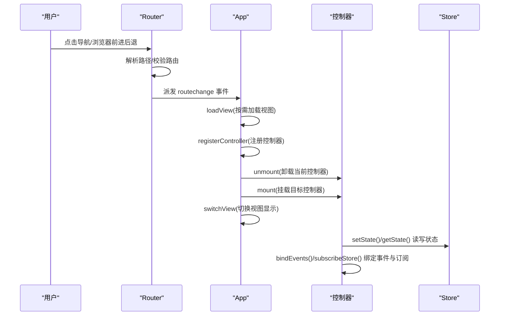
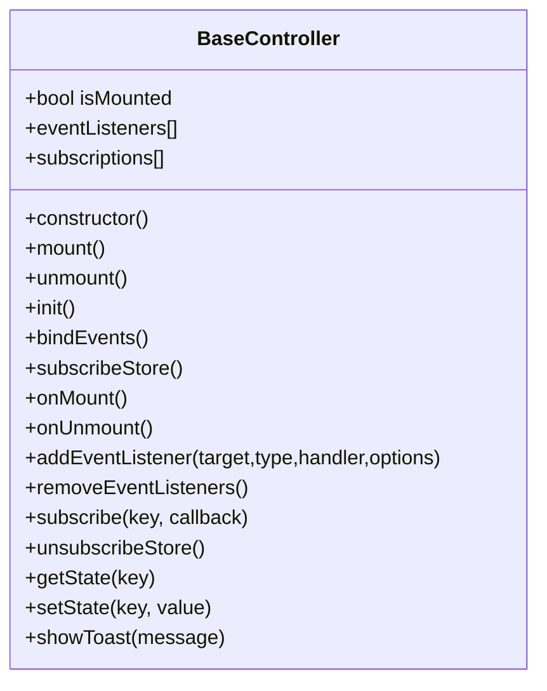
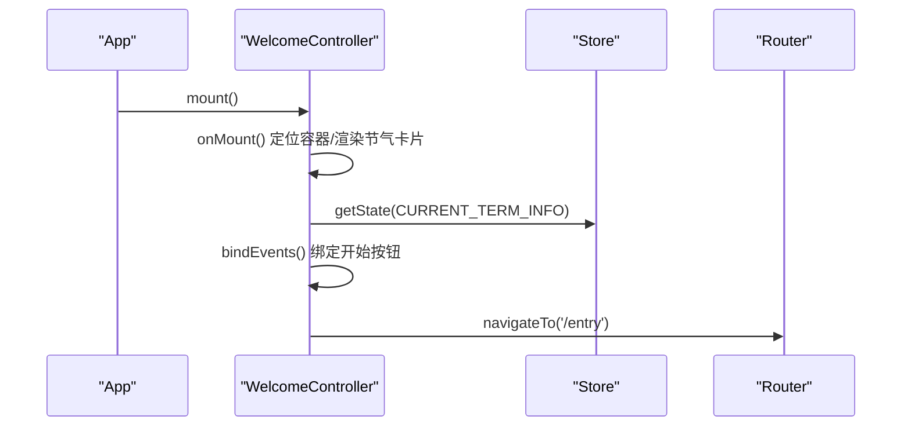
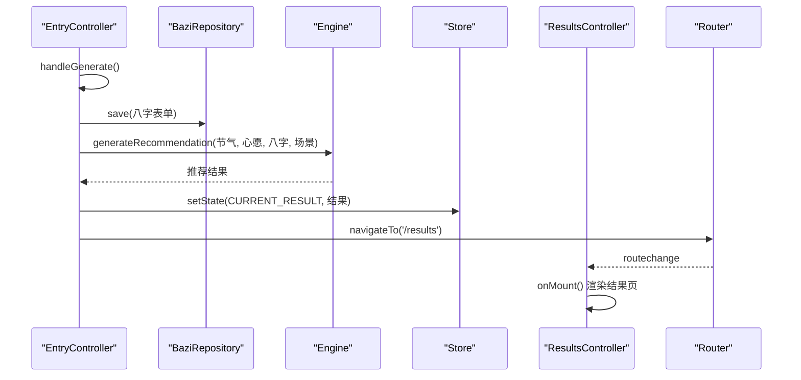
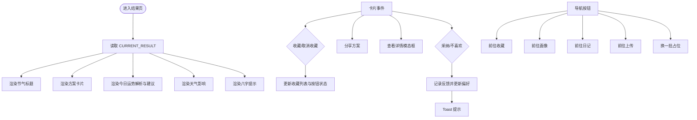
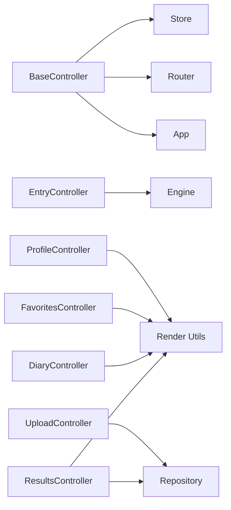

# 控制器系统

<cite>
**本文档引用的文件**
- [js/controllers/base.js](file://js/controllers/base.js)
- [js/controllers/welcome.js](file://js/controllers/welcome.js)
- [js/controllers/entry.js](file://js/controllers/entry.js)
- [js/controllers/results.js](file://js/controllers/results.js)
- [js/controllers/favorites.js](file://js/controllers/favorites.js)
- [js/controllers/profile.js](file://js/controllers/profile.js)
- [js/controllers/diary.js](file://js/controllers/diary.js)
- [js/controllers/upload.js](file://js/controllers/upload.js)
- [js/core/app.js](file://js/core/app.js)
- [js/core/router.js](file://js/core/router.js)
- [js/core/store.js](file://js/core/store.js)
- [js/utils/render.js](file://js/utils/render.js)
- [js/data/repository.js](file://js/data/repository.js)
- [js/services/engine.js](file://js/services/engine.js)
- [index.html](file://index.html)
</cite>

## 目录
1. [简介](#简介)
2. [项目结构](#项目结构)
3. [核心组件](#核心组件)
4. [架构总览](#架构总览)
5. [详细组件分析](#详细组件分析)
6. [依赖分析](#依赖分析)
7. [性能考虑](#性能考虑)
8. [故障排查指南](#故障排查指南)
9. [结论](#结论)
10. [附录](#附录)

## 简介
本文件系统性梳理“五行穿搭建议”项目中基于 MVC 的控制器层实现，重点围绕 BaseController 基类设计、各功能控制器职责划分、控制器间数据传递与事件处理流程、状态同步策略，以及扩展指南进行深入解析。文档同时提供可视化图示与实践建议，帮助开发者快速理解并高效扩展控制器系统。

## 项目结构
控制器系统位于 js/controllers 目录，配合 js/core（应用、路由、状态）、js/utils（渲染工具）、js/data（数据仓库）与 js/services（业务服务）共同构成 MVC 架构中的控制器层与周边协作模块。入口通过 index.html 中的模块脚本加载应用主模块，实现视图动态加载与控制器生命周期编排。

图表来源
- [js/core/app.js](file://js/core/app.js#L13-L31)
- [js/core/router.js](file://js/core/router.js#L9-L17)
- [js/core/store.js](file://js/core/store.js#L30-L63)
- [js/controllers/base.js](file://js/controllers/base.js#L11-L16)
- [js/utils/render.js](file://js/utils/render.js#L1-L21)
- [js/data/repository.js](file://js/data/repository.js#L8-L21)
- [js/services/engine.js](file://js/services/engine.js#L1-L14)

章节来源
- [index.html](file://index.html#L58-L61)
- [js/core/app.js](file://js/core/app.js#L23-L31)

## 核心组件
- BaseController 基类：统一控制器生命周期（mount/unmount）、事件管理（addEventListener/removeEventListeners）、状态订阅（subscribe/unsubscribeStore）、状态读写（getState/ setState）、Toast 提示（showToast）。子类通过覆盖 init、bindEvents、subscribeStore、onMount、onUnmount 等钩子实现具体逻辑。
- 应用编排 App：负责视图动态加载、控制器注册与切换、路由事件处理、全局数据加载与统计初始化。
- 路由 Router：维护路由表、拦截链接点击、处理浏览器前进后退、派发 routechange 事件并更新 Store。
- 全局状态 Store：集中管理 currentTermInfo、currentWishId、currentBaziResult、currentResult、favorites、currentView、isLoading、error 等关键状态，并提供订阅通知机制。

章节来源
- [js/controllers/base.js](file://js/controllers/base.js#L11-L131)
- [js/core/app.js](file://js/core/app.js#L36-L206)
- [js/core/router.js](file://js/core/router.js#L9-L142)
- [js/core/store.js](file://js/core/store.js#L30-L212)

## 架构总览
控制器系统遵循 MVC 分层：视图通过 App 动态加载，控制器负责视图交互与业务编排，Store 提供跨组件状态共享，Router 驱动视图切换，Render 工具负责 DOM 渲染，Repository 与 Services 提供数据与算法能力。

图表来源
- [js/core/router.js](file://js/core/router.js#L25-L80)
- [js/core/app.js](file://js/core/app.js#L145-L184)
- [js/core/store.js](file://js/core/store.js#L79-L81)

## 详细组件分析

### BaseController 基类设计
- 生命周期管理
  - mount：幂等挂载，执行 init → subscribeStore → onMount → bindEvents；确保事件绑定在容器就绪后进行。
  - unmount：清理 onUnmount → unsubscribeStore → removeEventListeners。
- 事件与订阅
  - addEventListener：统一注册并记录监听器，便于统一移除。
  - subscribe(key, callback)/unsubscribeStore：订阅 Store 指定键变化，返回取消订阅函数并集中管理。
- 状态接口
  - getState/setState：封装对 store 的读写，保证跨控制器一致的状态访问方式。
- 通用能力
  - showToast：通过全局自定义事件触发 Toast，便于统一提示样式与动画。

图表来源
- [js/controllers/base.js](file://js/controllers/base.js#L11-L131)

章节来源
- [js/controllers/base.js](file://js/controllers/base.js#L21-L42)
- [js/controllers/base.js](file://js/controllers/base.js#L72-L85)
- [js/controllers/base.js](file://js/controllers/base.js#L92-L103)
- [js/controllers/base.js](file://js/controllers/base.js#L109-L120)
- [js/controllers/base.js](file://js/controllers/base.js#L126-L130)

### WelcomeController 欢迎引导
- 职责：动态渲染节气横幅、绑定“开始”按钮导航到录入页。
- 关键点：onMount 中定位容器、渲染品牌节气卡片、绑定点击事件；onUnmount 清理事件标志位。
- 数据来源：从 Store 读取 currentTermInfo，结合工具函数计算节气序号、默认图标、五行动作与颜色提示。

图表来源
- [js/controllers/welcome.js](file://js/controllers/welcome.js#L19-L35)
- [js/controllers/welcome.js](file://js/controllers/welcome.js#L116-L128)
- [js/core/store.js](file://js/core/store.js#L70-L72)
- [js/core/router.js](file://js/core/router.js#L57-L79)

章节来源
- [js/controllers/welcome.js](file://js/controllers/welcome.js#L13-L134)

### EntryController 表单录入
- 职责：构建八字输入表单、场景与心愿选择、精度切换、天气组件集成、生成推荐并导航到结果页。
- 关键点：
  - onMount：初始化年份/日期选择器、恢复上次八字、初始化天气小部件。
  - handleGenerate：收集表单数据、保存八字、按精度模式分析八字、调用推荐引擎生成结果、更新 Store 并导航。
  - 事件：返回、场景标签、心愿标签、精度按钮、生成按钮。
- 数据流：表单数据 → Repository（保存八字）→ Engine（生成推荐）→ Store（保存结果）→ ResultsController 渲染。

图表来源
- [js/controllers/entry.js](file://js/controllers/entry.js#L131-L189)
- [js/data/repository.js](file://js/data/repository.js#L264-L287)
- [js/services/engine.js](file://js/services/engine.js#L323-L393)
- [js/core/store.js](file://js/core/store.js#L79-L81)
- [js/core/router.js](file://js/core/router.js#L57-L79)
- [js/controllers/results.js](file://js/controllers/results.js#L20-L46)

章节来源
- [js/controllers/entry.js](file://js/controllers/entry.js#L14-L241)

### ResultsController 结果展示
- 职责：渲染推荐方案卡片、运势解析与穿搭建议、天气影响提示、收藏/分享/反馈、收藏管理跳转。
- 关键点：
  - onMount：读取 CURRENT_RESULT，渲染标题、方案卡片、今日运势、天气影响、八字提示。
  - 事件：返回、收藏、画像、日记、换一批、上传、卡片内按钮（收藏/分享/详情/反馈）。
  - 反馈机制：记录采纳/不喜欢，持久化到本地并更新用户偏好，影响后续推荐。
  - 收藏管理：调用 FavoritesRepository 增删收藏，更新按钮状态与 Toast 提示。
- 数据来源：Store CURRENT_RESULT、WeatherImpact 组件、localStorage 用户偏好与反馈。

图表来源
- [js/controllers/results.js](file://js/controllers/results.js#L20-L614)
- [js/data/repository.js](file://js/data/repository.js#L86-L146)
- [js/utils/render.js](file://js/utils/render.js#L119-L132)

章节来源
- [js/controllers/results.js](file://js/controllers/results.js#L13-L614)

### FavoritesController 收藏管理
- 职责：展示收藏列表、移除收藏、查看详情（预留）。
- 关键点：onMount 读取收藏列表并渲染；事件委托处理收藏按钮与详情按钮；调用 Repository 增删并重新渲染。

章节来源
- [js/controllers/favorites.js](file://js/controllers/favorites.js#L10-L89)
- [js/data/repository.js](file://js/data/repository.js#L86-L146)

### ProfileController 个人资料
- 职责：渲染画像视图、数据导出/导入/清空（预留）。
- 关键点：绑定返回按钮与数据管理按钮事件；文件选择事件委托；Toast 提示。

章节来源
- [js/controllers/profile.js](file://js/controllers/profile.js#L9-L91)

### DiaryController 穿搭日记
- 职责：日历/时间线视图切换、记录编辑（日期/颜色/材质/备注/心情/照片）、统计展示、删除记录。
- 关键点：init 设置当前日期与视图模式；switchView 切换视图并按需渲染；renderCalendar/renderTimeline；open/close 编辑弹窗；save/delete 持久化；renderStats 统计连击天数与颜色分布。

章节来源
- [js/controllers/diary.js](file://js/controllers/diary.js#L19-L440)

### UploadController 上传功能
- 职责：今日穿搭照片上传、预览、移除、反馈保存。
- 关键点：onMount 检查今日是否已有上传并更新预览；handleFileSelect 读取文件并保存到 OutfitRepository；removeImage 移除；saveFeedback 保存反馈文本。

章节来源
- [js/controllers/upload.js](file://js/controllers/upload.js#L11-L118)
- [js/data/repository.js](file://js/data/repository.js#L340-L377)
- [js/utils/render.js](file://js/utils/render.js#L407-L425)

## 依赖分析
- 控制器与 Store：所有控制器通过 BaseController 的 setState/getState 与 store.subscribe 交互，形成松耦合的状态共享。
- 控制器与 Router/App：App 在路由变化时卸载旧控制器、注册/挂载新控制器，并切换视图显示。
- 控制器与 Render/Repository/Services：ResultsController 依赖 Render 渲染卡片与模态框；EntryController 依赖 Engine 生成推荐；Upload/Diary/Favorites 依赖 Repository 持久化；Profile 依赖 Render 渲染用户面板与数据管理面板。

图表来源
- [js/controllers/base.js](file://js/controllers/base.js#L6-L16)
- [js/core/router.js](file://js/core/router.js#L9-L17)
- [js/core/store.js](file://js/core/store.js#L30-L63)
- [js/core/app.js](file://js/core/app.js#L14-L21)
- [js/services/engine.js](file://js/services/engine.js#L1-L14)
- [js/utils/render.js](file://js/utils/render.js#L1-L21)
- [js/data/repository.js](file://js/data/repository.js#L1-L21)

章节来源
- [js/core/app.js](file://js/core/app.js#L14-L21)
- [js/controllers/entry.js](file://js/controllers/entry.js#L5-L12)
- [js/controllers/results.js](file://js/controllers/results.js#L5-L11)
- [js/controllers/upload.js](file://js/controllers/upload.js#L5-L9)

## 性能考虑
- 按需加载与懒挂载：App 在路由变化时才加载视图与注册控制器，避免一次性初始化全部控制器。
- 事件与订阅清理：BaseController 统一管理事件监听与 Store 订阅，防止内存泄漏与重复绑定。
- 渲染优化：Render 工具批量渲染卡片并缓存当前方案数组，减少重复查询 DOM。
- I/O 保护：Repository 对 localStorage 操作进行安全包装，避免异常中断流程。

## 故障排查指南
- 控制器未挂载/事件无效
  - 检查 onMount 是否正确获取容器元素；确认 mount 流程未被重复调用；确认 bindEvents 未重复绑定（eventsBound 标志位）。
- 状态不更新
  - 确认通过 setState 写入 Store，且订阅者使用 subscribe/subscribeMultiple 正确接收通知；检查 StateKeys 常量一致性。
- 路由跳转无效
  - 检查 Router 路由表与 navigateTo 调用；确认 App.handleRouteChange 是否触发；检查 Store.currentView 是否更新。
- 数据持久化失败
  - 检查 Repository 的安全存储封装；确认键名常量一致；排查浏览器隐私模式或存储限制。

章节来源
- [js/controllers/base.js](file://js/controllers/base.js#L21-L42)
- [js/core/store.js](file://js/core/store.js#L99-L124)
- [js/core/router.js](file://js/core/router.js#L57-L79)
- [js/data/repository.js](file://js/data/repository.js#L24-L41)

## 结论
本控制器系统以 BaseController 为核心，结合 App 的视图编排、Router 的路由驱动与 Store 的状态共享，形成了清晰的 MVC 分层与稳定的控制流。各功能控制器职责明确、事件与订阅管理规范、数据持久化与渲染工具完善，具备良好的扩展性与可维护性。

## 附录

### 控制器扩展指南
- 新增功能控制器步骤
  - 在 js/controllers 下创建控制器文件，继承 BaseController，覆盖 onMount/onUnmount/bindEvents/subscribeStore 等钩子。
  - 在 js/core/app.js 的 VIEW_CONFIG 中注册视图与控制器映射。
  - 在 js/core/router.js 的 ROUTES 中新增路由配置。
  - 在 index.html 中按需引入视图资源或在 App.loadView 中按需加载。
  - 如需持久化数据，新增 Repository 并在控制器中调用；如需业务逻辑，新增 Service 并在控制器中调用。
- 自定义控制器行为建议
  - 使用 setState/getState 统一读写 Store，避免直接操作 DOM。
  - 事件绑定统一通过 addEventListener 并在 onUnmount 中 removeEventListeners。
  - 订阅 Store 使用 subscribe 并在 onUnmount 中统一取消订阅。
  - 使用 showToast 统一提示，避免分散的 alert。

章节来源
- [js/core/app.js](file://js/core/app.js#L23-L31)
- [js/core/router.js](file://js/core/router.js#L9-L17)
- [js/controllers/base.js](file://js/controllers/base.js#L72-L103)
- [js/utils/render.js](file://js/utils/render.js#L457-L486)