# 收藏管理控制器

<cite>
**本文档引用的文件**
- [js/controllers/favorites.js](file://js/controllers/favorites.js)
- [js/data/repository.js](file://js/data/repository.js)
- [js/data/storage.js](file://js/data/storage.js)
- [js/utils/render.js](file://js/utils/render.js)
- [js/core/store.js](file://js/core/store.js)
- [js/controllers/base.js](file://js/controllers/base.js)
- [js/controllers/results.js](file://js/controllers/results.js)
- [views/favorites.html](file://views/favorites.html)
- [css/components.css](file://css/components.css)
</cite>

## 目录
1. [简介](#简介)
2. [项目结构](#项目结构)
3. [核心组件](#核心组件)
4. [架构概览](#架构概览)
5. [详细组件分析](#详细组件分析)
6. [依赖关系分析](#依赖关系分析)
7. [性能考虑](#性能考虑)
8. [故障排除指南](#故障排除指南)
9. [结论](#结论)

## 简介

收藏管理控制器是五行穿搭建议系统中的核心功能模块，负责管理用户的收藏夹功能。该控制器实现了完整的收藏生命周期管理，包括收藏添加、取消收藏、收藏列表展示、数据持久化和跨页面同步等功能。系统采用模块化设计，通过Repository模式实现数据抽象，确保收藏功能的可扩展性和可维护性。

## 项目结构

收藏管理功能涉及以下关键文件和模块：

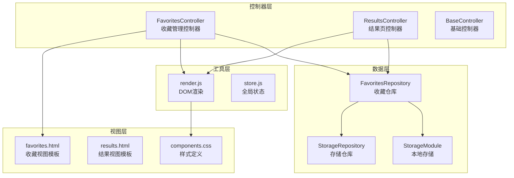

**图表来源**
- [js/controllers/favorites.js](file://js/controllers/favorites.js#L1-L89)
- [js/data/repository.js](file://js/data/repository.js#L1-L394)
- [js/utils/render.js](file://js/utils/render.js#L1-L487)

**章节来源**
- [js/controllers/favorites.js](file://js/controllers/favorites.js#L1-L89)
- [js/data/repository.js](file://js/data/repository.js#L1-L394)
- [views/favorites.html](file://views/favorites.html#L1-L18)

## 核心组件

### 收藏管理控制器 (FavoritesController)

FavoritesController是收藏功能的主要控制器，继承自BaseController，负责处理收藏页面的所有交互逻辑。

**主要职责：**
- 收藏列表的初始化和渲染
- 收藏/取消收藏操作处理
- 页面导航和事件绑定
- 用户反馈提示

**关键特性：**
- 基于事件委托的高效事件处理
- 动态容器绑定机制
- 与Repository层的无缝集成

### 收藏仓库 (FavoritesRepository)

FavoritesRepository是数据访问层的核心组件，提供收藏数据的CRUD操作。

**核心方法：**
- `getAll()`: 获取所有收藏项
- `add(scheme)`: 添加新的收藏
- `remove(schemeId)`: 移除指定收藏
- `exists(schemeId)`: 检查收藏存在性
- `count()`: 获取收藏数量
- `clear()`: 清空所有收藏

**数据结构：**
每个收藏项包含：
- `id`: 方案唯一标识符
- `addedAt`: 收藏时间戳
- 方案的完整属性信息

### 本地存储模块 (StorageModule)

提供统一的本地存储接口，封装localStorage的安全访问。

**核心功能：**
- 数据序列化和反序列化
- 错误处理和异常保护
- 前缀管理机制
- 批量操作支持

**章节来源**
- [js/controllers/favorites.js](file://js/controllers/favorites.js#L10-L89)
- [js/data/repository.js](file://js/data/repository.js#L86-L146)
- [js/data/storage.js](file://js/data/storage.js#L118-L144)

## 架构概览

收藏管理系统的整体架构采用分层设计，确保各层职责清晰分离：

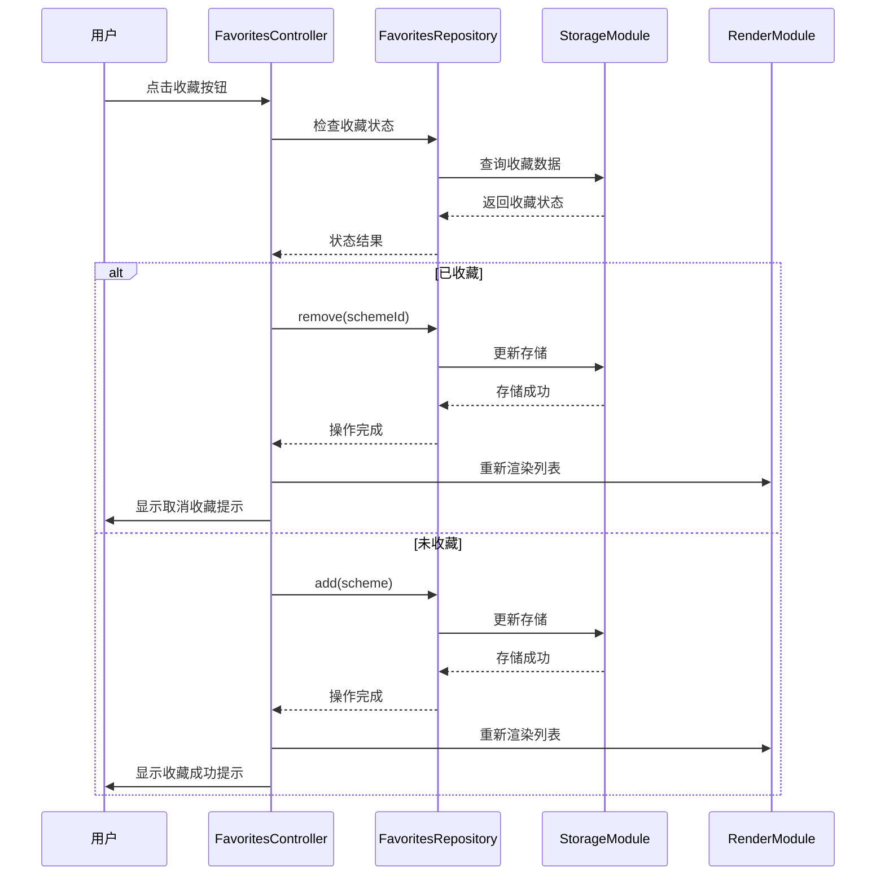

**图表来源**
- [js/controllers/favorites.js](file://js/controllers/favorites.js#L69-L79)
- [js/data/repository.js](file://js/data/repository.js#L103-L121)
- [js/utils/render.js](file://js/utils/render.js#L429-L452)

## 详细组件分析

### 收藏控制器实现

#### 生命周期管理

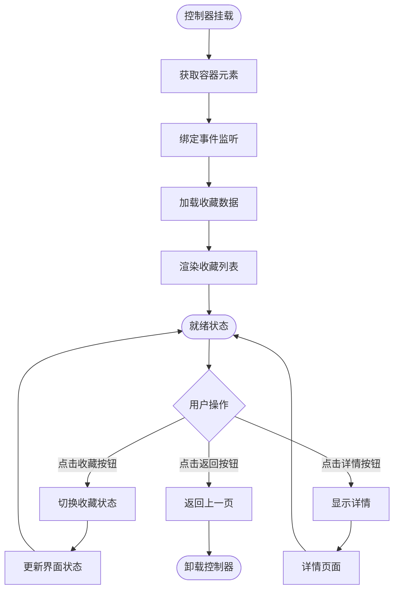

**图表来源**
- [js/controllers/favorites.js](file://js/controllers/favorites.js#L16-L30)
- [js/controllers/favorites.js](file://js/controllers/favorites.js#L45-L67)

#### 收藏状态切换算法

收藏状态的切换采用原子操作模式，确保数据一致性：

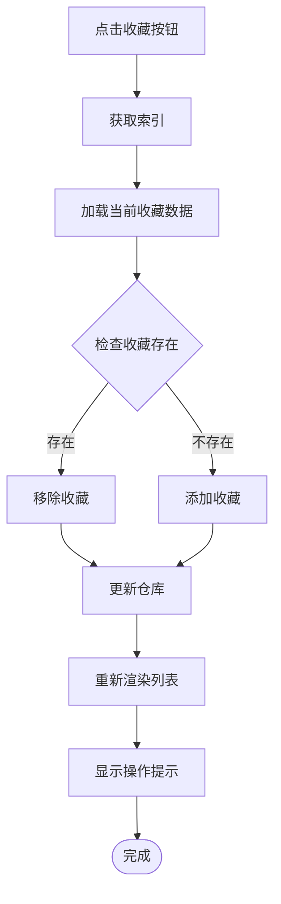

**图表来源**
- [js/controllers/favorites.js](file://js/controllers/favorites.js#L69-L79)
- [js/controllers/results.js](file://js/controllers/results.js#L527-L548)

#### 数据存储机制

系统采用双层存储策略：

1. **临时存储**: `window.__currentFavorites` 用于当前页面的快速访问
2. **持久存储**: localStorage 用于长期数据保存

存储键名采用命名空间前缀：
- `wuxing_favorites`: 收藏数据主键
- `wuxing_`: 所有收藏相关数据的前缀

**章节来源**
- [js/controllers/favorites.js](file://js/controllers/favorites.js#L69-L83)
- [js/data/repository.js](file://js/data/repository.js#L8-L21)
- [js/data/storage.js](file://js/data/storage.js#L7-L7)

### 数据模型设计

#### 收藏项数据结构

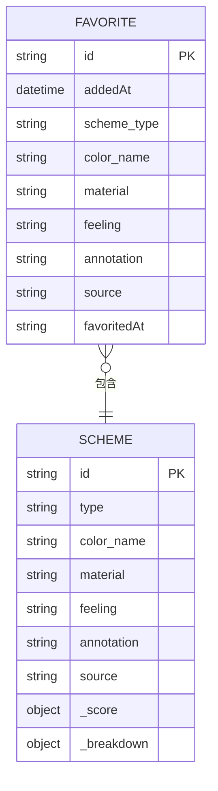

**图表来源**
- [js/data/repository.js](file://js/data/repository.js#L106-L110)
- [js/data/storage.js](file://js/data/storage.js#L126-L129)

#### Repository模式实现

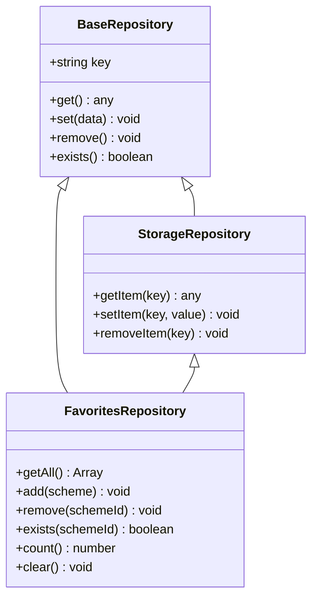

**图表来源**
- [js/data/repository.js](file://js/data/repository.js#L46-L81)
- [js/data/repository.js](file://js/data/repository.js#L86-L146)

### 用户界面交互

#### 收藏按钮状态管理

收藏按钮的状态通过CSS类和SVG填充来实现视觉反馈：

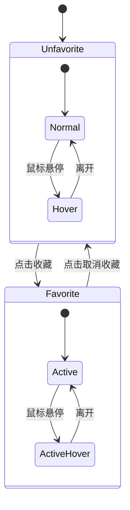

**图表来源**
- [css/components.css](file://css/components.css#L421-L435)
- [js/utils/render.js](file://js/utils/render.js#L162-L166)

#### 界面渲染流程

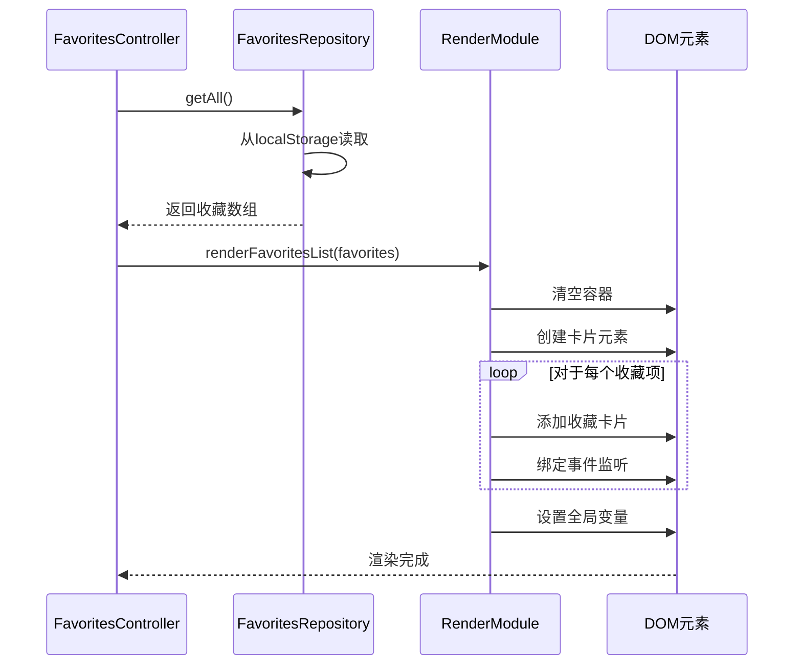

**图表来源**
- [js/controllers/favorites.js](file://js/controllers/favorites.js#L28-L29)
- [js/utils/render.js](file://js/utils/render.js#L429-L452)

**章节来源**
- [js/utils/render.js](file://js/utils/render.js#L137-L201)
- [css/components.css](file://css/components.css#L421-L435)
- [views/favorites.html](file://views/favorites.html#L1-L18)

## 依赖关系分析

### 模块间依赖图

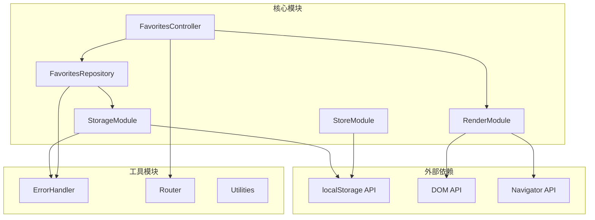

**图表来源**
- [js/controllers/favorites.js](file://js/controllers/favorites.js#L5-L8)
- [js/data/repository.js](file://js/data/repository.js#L6)
- [js/data/storage.js](file://js/data/storage.js#L5)

### 数据流依赖

收藏功能的数据流遵循单向数据流原则：

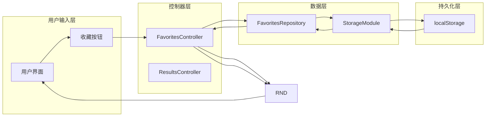

**图表来源**
- [js/controllers/favorites.js](file://js/controllers/favorites.js#L48-L67)
- [js/controllers/results.js](file://js/controllers/results.js#L527-L548)

**章节来源**
- [js/controllers/base.js](file://js/controllers/base.js#L11-L131)
- [js/core/store.js](file://js/core/store.js#L30-L187)

## 性能考虑

### 存储性能优化

#### 批量操作策略

系统支持多种批量操作以提高性能：

1. **延迟加载**: 收藏列表在页面挂载时才进行渲染
2. **事件委托**: 使用事件委托减少事件监听器数量
3. **内存管理**: 及时清理DOM引用和事件监听器

#### 数据访问优化

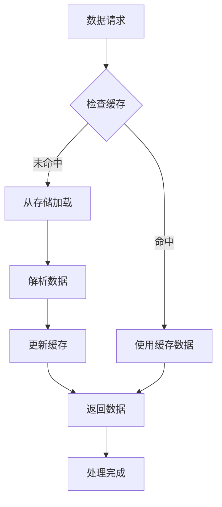

**图表来源**
- [js/controllers/favorites.js](file://js/controllers/favorites.js#L70-L71)
- [js/data/repository.js](file://js/data/repository.js#L95-L97)

### 内存使用优化

#### 对象池模式

系统采用对象池模式管理DOM元素：

- 收藏卡片复用机制
- 事件监听器统一管理
- 全局状态变量控制

#### 清理策略

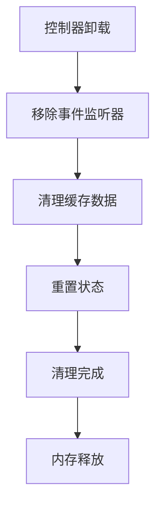

**图表来源**
- [js/controllers/base.js](file://js/controllers/base.js#L35-L42)
- [js/controllers/favorites.js](file://js/controllers/favorites.js#L85-L87)

### 网络和存储性能

#### 异步操作处理

系统采用异步模式处理所有存储操作：

- Promise链式调用
- 错误处理和回滚机制
- 并发控制和队列管理

#### 缓存策略

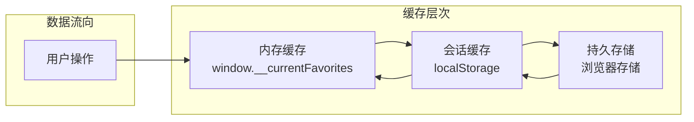

**图表来源**
- [js/controllers/favorites.js](file://js/controllers/favorites.js#L70-L71)
- [js/data/storage.js](file://js/data/storage.js#L118-L120)

## 故障排除指南

### 常见问题诊断

#### 收藏功能异常

**问题症状：**
- 收藏按钮状态不正确
- 收藏数据无法保存
- 页面刷新后数据丢失

**诊断步骤：**
1. 检查localStorage可用性
2. 验证数据格式正确性
3. 确认事件监听器绑定状态

#### 数据一致性问题

**问题症状：**
- 收藏状态与实际存储不一致
- 多个页面显示不同步
- 数据损坏或格式错误

**解决方案：**
1. 实施数据验证机制
2. 添加冲突检测和解决策略
3. 提供数据修复工具

### 错误处理机制

#### 异常捕获和处理

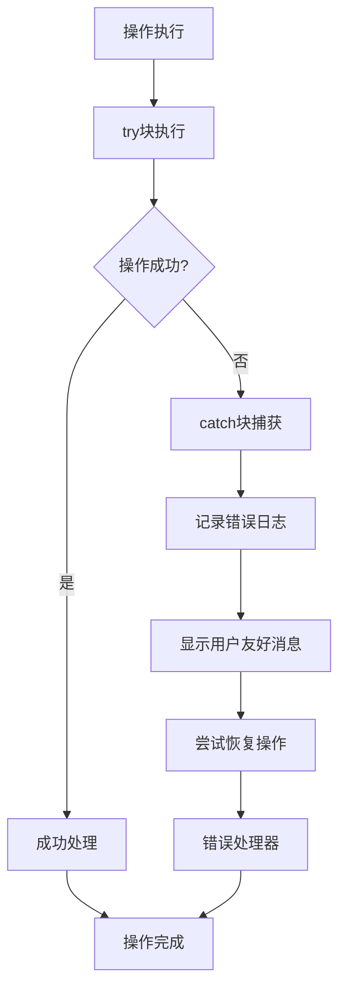

**图表来源**
- [js/controllers/favorites.js](file://js/controllers/favorites.js#L69-L79)
- [js/data/repository.js](file://js/data/repository.js#L24-L41)

#### 存储异常处理

系统采用安全存储包装器处理各种异常情况：

- **存储空间不足**: 自动清理最小必要数据
- **权限拒绝**: 提供降级存储方案
- **数据损坏**: 实施数据修复和重建机制

**章节来源**
- [js/controllers/base.js](file://js/controllers/base.js#L123-L129)
- [js/data/storage.js](file://js/data/storage.js#L9-L27)

## 结论

收藏管理控制器展现了现代Web应用的最佳实践，通过清晰的分层架构、完善的错误处理机制和优秀的用户体验设计，构建了一个稳定可靠的收藏功能系统。

### 主要优势

1. **模块化设计**: 清晰的职责分离和依赖管理
2. **性能优化**: 事件委托、缓存策略和内存管理
3. **数据安全**: 异步操作、错误处理和数据验证
4. **用户体验**: 即时反馈、平滑动画和无障碍支持

### 技术亮点

- **Repository模式**: 提供了良好的数据抽象和测试支持
- **事件委托**: 提高了事件处理的效率和可维护性
- **双层存储**: 平衡了性能和可靠性
- **状态管理**: 统一的全局状态管理和响应式更新

### 发展建议

1. **性能监控**: 添加性能指标收集和分析
2. **数据迁移**: 实现版本化的数据结构升级
3. **离线支持**: 增强Service Worker和离线缓存
4. **扩展性**: 支持多设备同步和云备份

这个收藏管理控制器为开发者提供了一个完整的参考实现，展示了如何在前端JavaScript应用中构建高质量的数据管理功能。