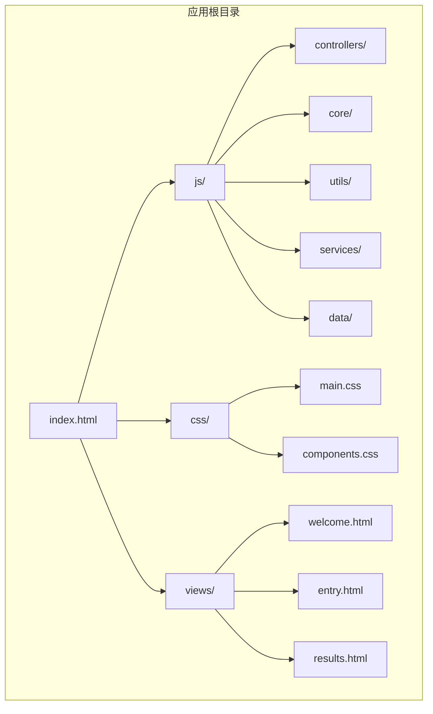
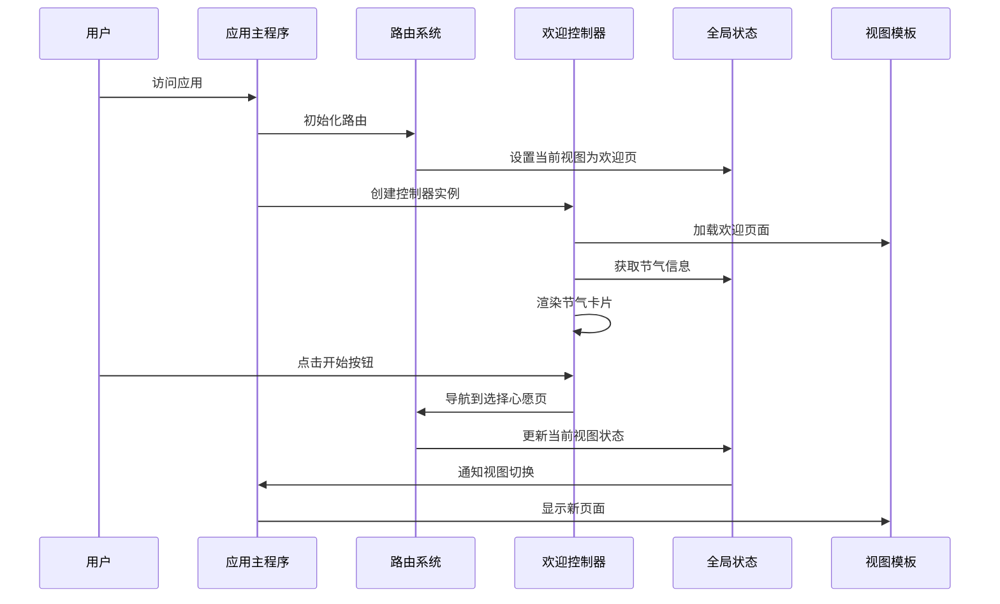
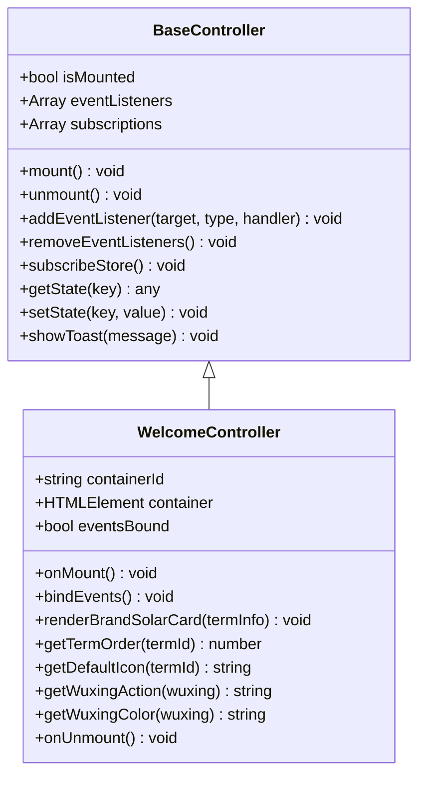
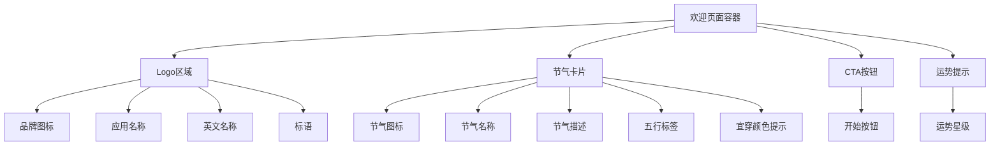
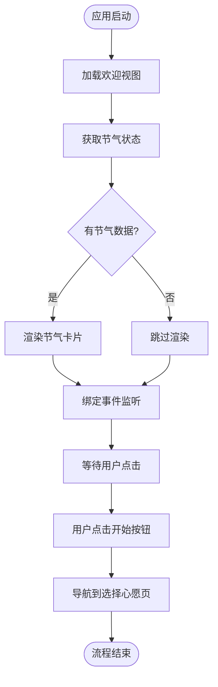
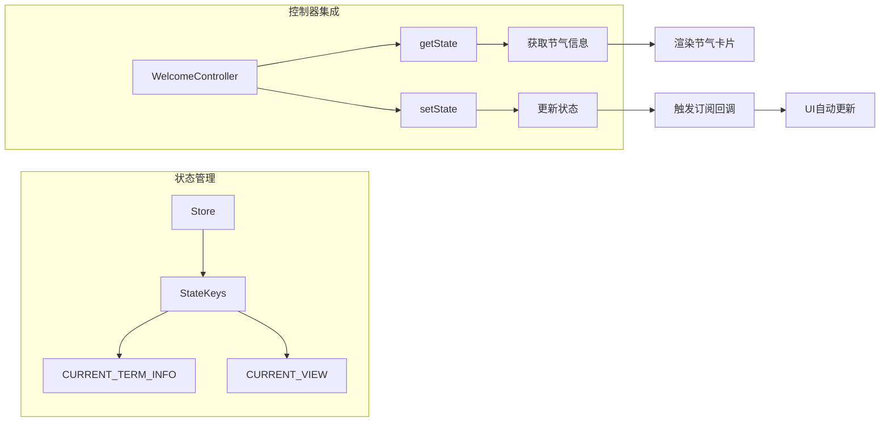
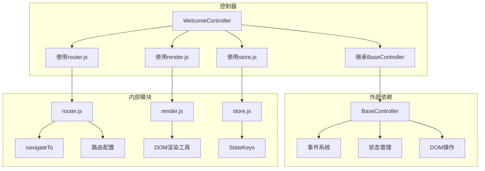
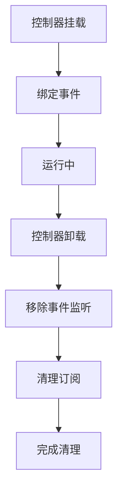

# 欢迎引导控制器

<cite>
**本文档引用的文件**
- [js/controllers/welcome.js](file://js/controllers/welcome.js)
- [views/welcome.html](file://views/welcome.html)
- [js/controllers/base.js](file://js/controllers/base.js)
- [js/core/router.js](file://js/core/router.js)
- [js/utils/render.js](file://js/utils/render.js)
- [js/core/store.js](file://js/core/store.js)
- [js/core/app.js](file://js/core/app.js)
- [css/main.css](file://css/main.css)
- [index.html](file://index.html)
</cite>

## 目录
1. [简介](#简介)
2. [项目结构](#项目结构)
3. [核心组件](#核心组件)
4. [架构概览](#架构概览)
5. [详细组件分析](#详细组件分析)
6. [依赖关系分析](#依赖关系分析)
7. [性能考虑](#性能考虑)
8. [故障排除指南](#故障排除指南)
9. [结论](#结论)

## 简介

欢迎引导控制器是五行动服穿搭建议应用中的核心入口控制器，负责处理用户首次进入应用时的引导流程。该控制器实现了完整的生命周期管理、用户交互处理和页面导航功能，为用户提供流畅的初次体验。

该控制器基于MVVM架构模式，通过控制器基类提供统一的生命周期管理，结合全局状态管理和路由系统，实现了响应式的用户界面更新和导航控制。

## 项目结构

该项目采用模块化架构设计，主要目录结构如下：

**图表来源**
- [index.html](file://index.html#L1-L79)
- [js/controllers/welcome.js](file://js/controllers/welcome.js#L1-L151)

**章节来源**
- [index.html](file://index.html#L1-L79)
- [js/controllers/welcome.js](file://js/controllers/welcome.js#L1-L151)

## 核心组件

欢迎引导控制器作为应用的入口点，承担着以下关键职责：

### 主要功能特性
- **视图初始化管理**：动态加载和渲染欢迎页面内容
- **用户交互处理**：响应用户点击事件，启动引导流程
- **状态管理集成**：与全局状态系统协作，获取节气信息
- **导航控制**：协调页面间的导航和路由切换
- **响应式更新**：根据状态变化自动更新UI元素

### 生命周期管理
控制器继承自BaseController基类，实现了标准的生命周期钩子：
- `init()`：初始化阶段
- `onMount()`：挂载完成后执行
- `bindEvents()`：事件绑定
- `onUnmount()`：卸载前清理

**章节来源**
- [js/controllers/welcome.js](file://js/controllers/welcome.js#L13-L151)
- [js/controllers/base.js](file://js/controllers/base.js#L11-L131)

## 架构概览

欢迎引导控制器在整个应用架构中扮演着关键角色，它与多个核心模块协同工作：

**图表来源**
- [js/core/app.js](file://js/core/app.js#L47-L73)
- [js/core/router.js](file://js/core/router.js#L25-L50)
- [js/controllers/welcome.js](file://js/controllers/welcome.js#L19-L35)

## 详细组件分析

### 欢迎控制器类结构

**图表来源**
- [js/controllers/base.js](file://js/controllers/base.js#L11-L131)
- [js/controllers/welcome.js](file://js/controllers/welcome.js#L13-L151)

### 视图模板结构

欢迎页面采用语义化的HTML结构，包含以下关键元素：

**图表来源**
- [views/welcome.html](file://views/welcome.html#L2-L33)

### 数据流处理

欢迎控制器的数据处理流程如下：

**图表来源**
- [js/controllers/welcome.js](file://js/controllers/welcome.js#L19-L35)
- [js/controllers/welcome.js](file://js/controllers/welcome.js#L133-L145)

### 事件处理机制

控制器实现了完善的事件处理机制：

| 事件类型 | 目标元素 | 处理逻辑 | 触发条件 |
|---------|---------|---------|---------|
| click | #btn-start | 导航到 `/entry` 路径 | 用户点击开始按钮 |
| popstate | window | 处理浏览器前进后退 | 用户使用浏览器导航 |
| routechange | window | 视图切换和控制器更新 | 路由状态变化 |

**章节来源**
- [js/controllers/welcome.js](file://js/controllers/welcome.js#L133-L145)
- [js/core/router.js](file://js/core/router.js#L27-L49)

### 状态管理集成

欢迎控制器与全局状态系统的集成体现在以下几个方面：

**图表来源**
- [js/core/store.js](file://js/core/store.js#L33-L51)
- [js/core/store.js](file://js/core/store.js#L193-L202)
- [js/controllers/welcome.js](file://js/controllers/welcome.js#L31-L34)

**章节来源**
- [js/core/store.js](file://js/core/store.js#L33-L51)
- [js/core/store.js](file://js/core/store.js#L193-L202)

## 依赖关系分析

欢迎控制器的依赖关系网络如下：

**图表来源**
- [js/controllers/welcome.js](file://js/controllers/welcome.js#L5-L8)
- [js/controllers/base.js](file://js/controllers/base.js#L6)
- [js/core/router.js](file://js/core/router.js#L6)
- [js/utils/render.js](file://js/utils/render.js#L5)
- [js/core/store.js](file://js/core/store.js#L6)

### 关键依赖说明

1. **BaseController**: 提供统一的生命周期管理和事件处理机制
2. **router.js**: 实现前端路由导航和历史记录管理
3. **render.js**: 提供DOM渲染辅助工具函数
4. **store.js**: 管理全局应用状态和订阅机制

**章节来源**
- [js/controllers/welcome.js](file://js/controllers/welcome.js#L5-L8)

## 性能考虑

### 渲染优化策略

欢迎控制器采用了多项性能优化措施：

1. **延迟渲染**: 仅在有节气数据时才进行渲染操作
2. **事件去重**: 避免重复绑定事件监听器
3. **条件更新**: 使用防抖机制避免频繁的状态更新
4. **内存管理**: 在卸载时清理事件监听器和订阅

### 内存泄漏防护

控制器实现了完整的内存泄漏防护机制：

**图表来源**
- [js/controllers/base.js](file://js/controllers/base.js#L35-L42)
- [js/controllers/base.js](file://js/controllers/base.js#L79-L85)

### 用户体验优化

1. **快速响应**: 事件处理采用防抖机制
2. **平滑过渡**: 页面切换时保持滚动位置
3. **错误降级**: 容错处理确保应用稳定性
4. **无障碍支持**: 完整的ARIA标签和键盘导航

## 故障排除指南

### 常见问题及解决方案

#### 1. 容器元素未找到
**问题症状**: 控制台出现"Container not found"错误
**解决方法**: 
- 确认视图模板正确加载
- 检查DOM元素ID是否正确
- 验证视图加载顺序

#### 2. 节气信息渲染失败
**问题症状**: 节气卡片显示默认值而非实际数据
**解决方法**:
- 检查状态管理器中的节气数据
- 验证数据格式和字段完整性
- 确认状态订阅是否正常工作

#### 3. 导航功能异常
**问题症状**: 点击按钮无法跳转到目标页面
**解决方法**:
- 检查路由配置是否正确
- 验证目标视图是否已加载
- 确认事件监听器绑定状态

### 调试技巧

1. **状态监控**: 使用`store.snapshot()`查看当前状态
2. **事件追踪**: 在关键节点添加console.log输出
3. **生命周期检查**: 验证控制器的挂载和卸载状态
4. **DOM检查**: 确认元素选择器的准确性

**章节来源**
- [js/controllers/welcome.js](file://js/controllers/welcome.js#L22-L25)
- [js/controllers/base.js](file://js/controllers/base.js#L126-L130)

## 结论

欢迎引导控制器作为五行动服穿搭建议应用的核心入口，展现了现代前端架构的最佳实践。通过模块化设计、清晰的职责分离和完善的生命周期管理，该控制器为用户提供了流畅、直观的初次使用体验。

### 设计优势

1. **架构清晰**: 基于MVVM模式，职责明确分离
2. **扩展性强**: 模块化设计便于功能扩展和维护
3. **用户体验佳**: 响应式更新和流畅的页面过渡
4. **错误处理完善**: 全面的容错机制和用户体验保障

### 最佳实践总结

1. **生命周期管理**: 严格遵循控制器生命周期规范
2. **状态管理**: 合理使用全局状态系统
3. **事件处理**: 实现高效的事件监听和清理机制
4. **性能优化**: 采用延迟渲染和内存管理策略
5. **用户体验**: 注重无障碍支持和响应式设计

该控制器为整个应用奠定了坚实的基础，其设计理念和实现方式为类似项目的开发提供了优秀的参考范例。