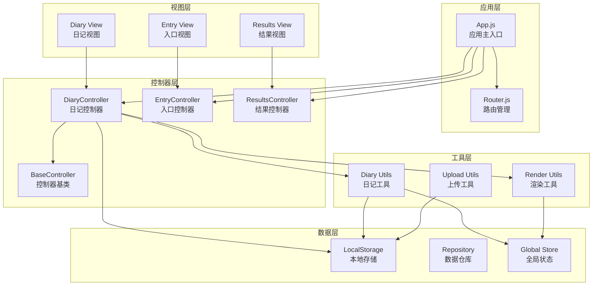
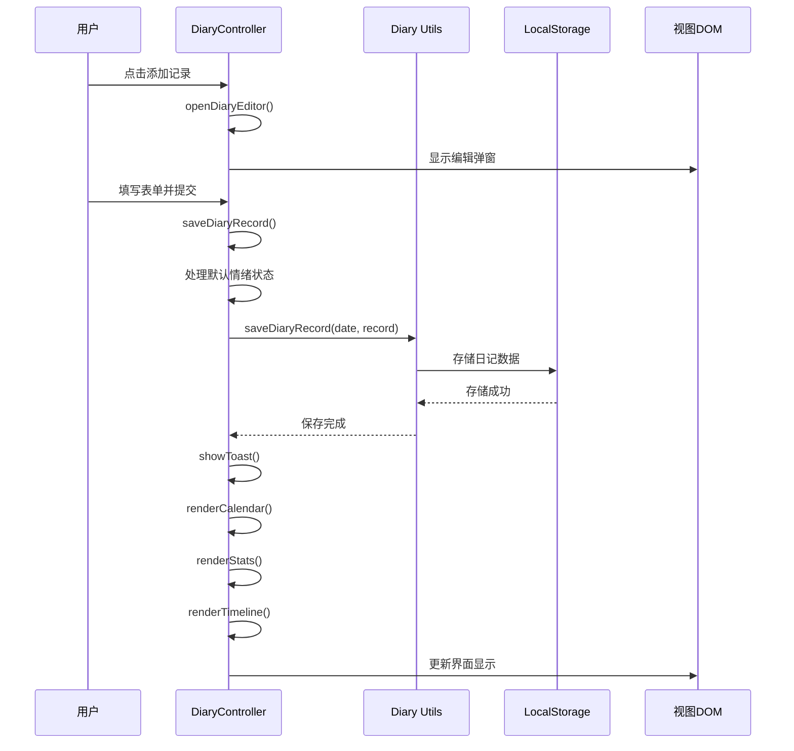
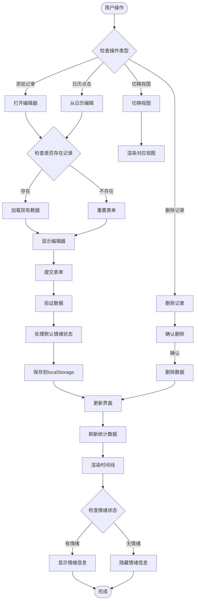
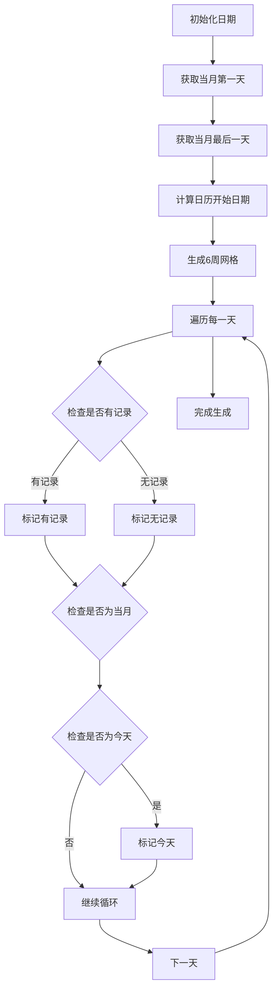
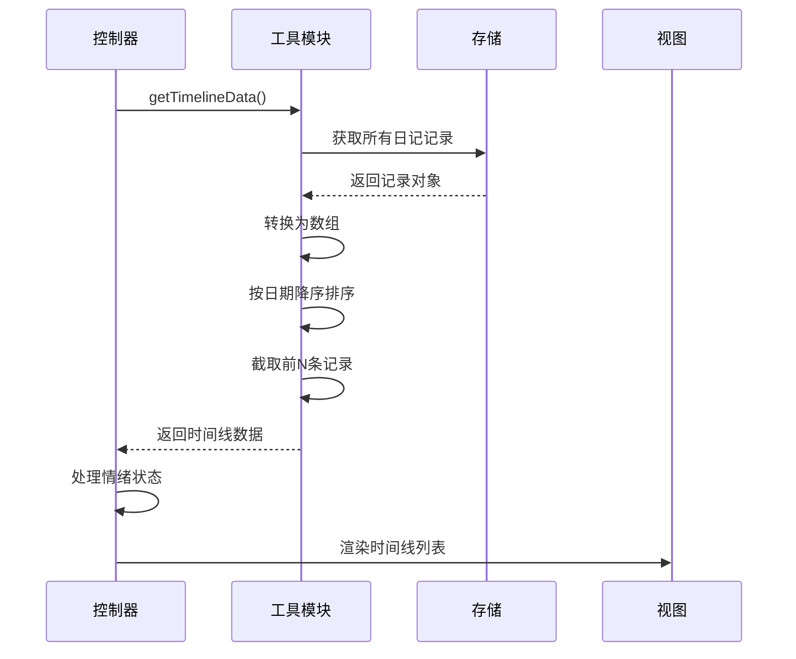
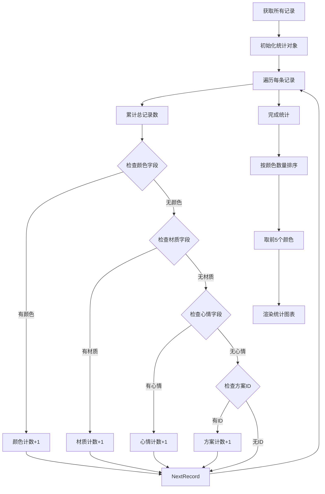
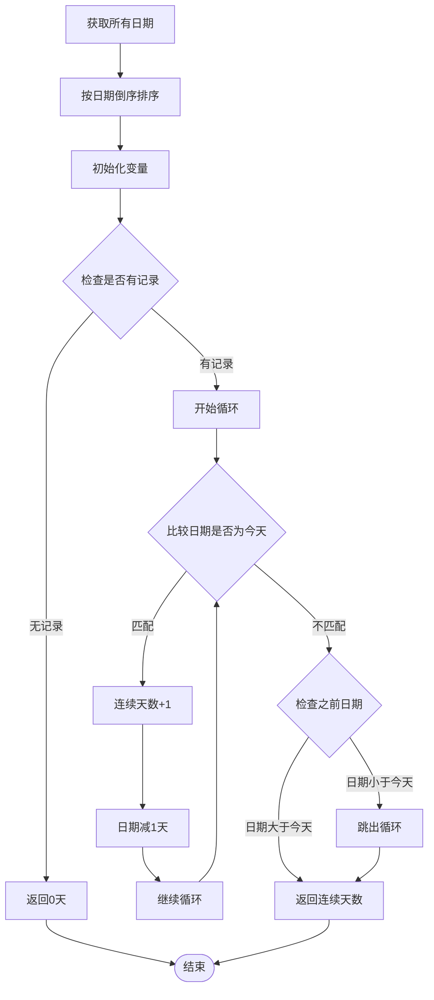
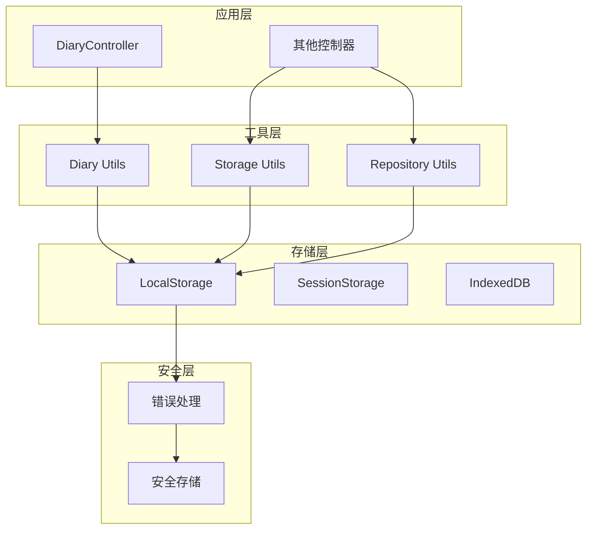
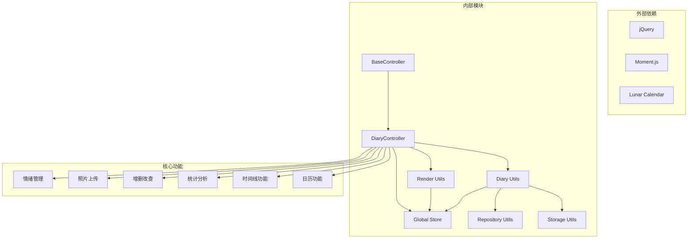
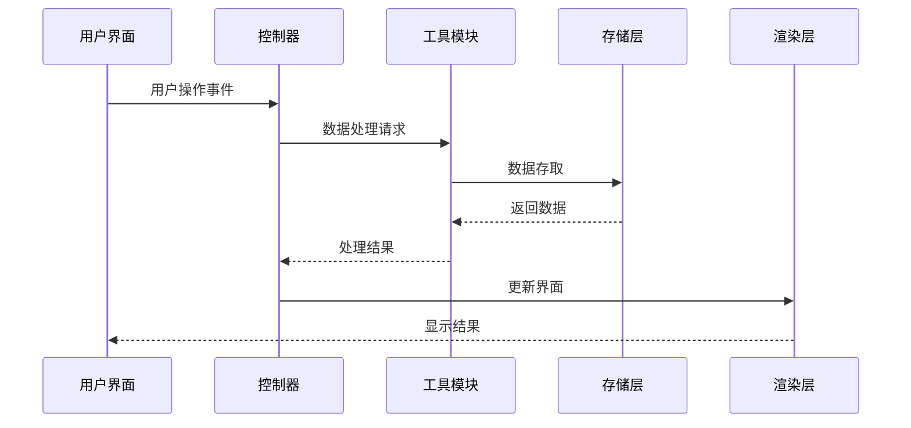

# 穿搭日记控制器

<cite>
**本文档引用的文件**
- [diary.js](file://js/controllers/diary.js)
- [diary.js](file://js/utils/diary.js)
- [diary.html](file://views/diary.html)
- [base.js](file://js/controllers/base.js)
- [app.js](file://js/core/app.js)
- [store.js](file://js/core/store.js)
- [repository.js](file://js/data/repository.js)
- [storage.js](file://js/data/storage.js)
- [render.js](file://js/utils/render.js)
- [upload.js](file://js/utils/upload.js)
</cite>

## 更新摘要
**变更内容**
- 修复了默认情绪显示问题，确保新记录的默认情绪正确设置为'开心'
- 修改了时间线渲染逻辑，实现条件性显示情绪信息，防止空情绪指示器出现
- 优化了情绪状态的处理机制，提升了用户体验的一致性

## 目录
1. [简介](#简介)
2. [项目结构](#项目结构)
3. [核心组件](#核心组件)
4. [架构概览](#架构概览)
5. [详细组件分析](#详细组件分析)
6. [依赖关系分析](#依赖关系分析)
7. [性能考虑](#性能考虑)
8. [故障排除指南](#故障排除指南)
9. [结论](#结论)

## 简介

穿搭日记控制器是本项目中的核心功能模块之一，负责管理用户的每日穿搭记录。该控制器实现了完整的日记记录生命周期管理，包括日历视图、时间线视图、统计分析等功能。通过模块化的架构设计，实现了数据持久化、用户交互处理和视图渲染的分离。

**更新** 本次更新重点关注情绪状态管理的修复，确保用户在不同场景下都能获得一致的情绪显示体验。

## 项目结构

该项目采用模块化架构，主要分为以下几个层次：



**图表来源**
- [app.js](file://js/core/app.js#L13-L31)
- [diary.js](file://js/controllers/diary.js#L1-L25)
- [base.js](file://js/controllers/base.js#L11-L16)

**章节来源**
- [app.js](file://js/core/app.js#L13-L31)
- [diary.js](file://js/controllers/diary.js#L1-L25)

## 核心组件

### DiaryController 主控制器

DiaryController 是穿戴日记功能的核心控制器，继承自 BaseController，实现了完整的日记管理功能：

#### 主要职责
- **视图管理**：控制日历视图和时间线视图的切换
- **数据操作**：处理日记记录的增删改查
- **用户交互**：响应用户的各种操作事件
- **状态维护**：管理当前日期、视图模式等状态

#### 核心属性
- `currentDate`: 当前显示的日期
- `viewMode`: 当前视图模式 ('calendar' | 'timeline')
- `eventsBound`: 事件绑定状态标记
- `currentEditingDate`: 当前编辑的日期

**章节来源**
- [diary.js](file://js/controllers/diary.js#L19-L23)

### Diary Utils 工具模块

日记工具模块提供了完整的数据持久化和查询功能：

#### 数据结构
日记记录采用键值对存储，键为日期字符串，值为完整的记录对象：
```javascript
{
  "2024-01-15": {
    date: "2024-01-15",
    color: "墨绿色",
    material: "棉麻",
    note: "今日穿搭感受",
    mood: "happy",
    image: "data:image/jpeg;base64,...",
    updatedAt: "2024-01-15T10:30:00Z"
  }
}
```

#### 核心功能
- **日历数据生成**: 生成完整的日历网格数据
- **时间线数据**: 获取按日期排序的时间线记录
- **统计分析**: 提供颜色、材质、心情等统计信息
- **连续天数计算**: 计算用户的连续记录天数

**章节来源**
- [diary.js](file://js/utils/diary.js#L8-L85)
- [diary.js](file://js/utils/diary.js#L135-L182)

## 架构概览

DiaryController 采用了清晰的分层架构设计：



**图表来源**
- [diary.js](file://js/controllers/diary.js#L287-L311)
- [diary.js](file://js/controllers/diary.js#L398-L425)

### 数据流设计



**图表来源**
- [diary.js](file://js/controllers/diary.js#L40-L141)
- [diary.js](file://js/utils/diary.js#L57-L75)

## 详细组件分析

### 日历视图组件

日历视图是 DiaryController 的核心界面组件之一，提供了直观的日期导航和记录查看功能。

#### 日历网格生成算法



**图表来源**
- [diary.js](file://js/utils/diary.js#L93-L128)

#### 日历渲染逻辑

日历视图采用响应式设计，支持以下特性：
- **日期高亮**: 当天日期特殊样式标识
- **记录标记**: 有记录的日期显示小圆点
- **月份导航**: 上个月/下个月切换
- **点击编辑**: 点击日期直接进入编辑模式

**章节来源**
- [diary.js](file://js/controllers/diary.js#L163-L206)
- [diary.js](file://js/utils/diary.js#L93-L128)

### 时间线视图组件

时间线视图提供了按时间顺序排列的日记记录展示，支持无限滚动和懒加载。

#### 时间线数据处理流程



**图表来源**
- [diary.js](file://js/utils/diary.js#L135-L141)
- [diary.js](file://js/controllers/diary.js#L208-L250)

#### 时间线渲染特性

时间线视图支持以下展示元素：
- **日期显示**: 月/日格式的日期标识
- **照片预览**: 记录的穿搭照片
- **条件性情绪标签**: 仅在有情绪记录时显示，避免空指示器
- **分类信息**: 颜色、材质等分类标签
- **备注内容**: 用户的穿搭感受

**更新** 时间线渲染逻辑已优化，实现了条件性显示情绪信息。只有当记录包含有效情绪状态时才显示情绪标签，防止空情绪指示器的出现。

**章节来源**
- [diary.js](file://js/controllers/diary.js#L208-L250)

### 统计分析组件

统计分析模块提供了丰富的数据分析功能，帮助用户了解自己的穿搭习惯。

#### 统计数据计算



**图表来源**
- [diary.js](file://js/utils/diary.js#L147-L182)

#### 连续天数计算算法

连续天数计算采用倒序遍历的方式，确保准确统计用户的连续记录天数：



**图表来源**
- [diary.js](file://js/utils/diary.js#L210-L229)

**章节来源**
- [diary.js](file://js/utils/diary.js#L147-L229)

### 数据持久化策略

系统采用了多层数据持久化策略，确保数据的安全性和可靠性：

#### 存储架构



**图表来源**
- [diary.js](file://js/utils/diary.js#L19-L32)
- [repository.js](file://js/data/repository.js#L23-L41)

#### 安全存储机制

系统实现了安全的存储访问机制，防止存储操作异常导致的数据丢失：

- **错误捕获**: 所有存储操作都包含错误处理
- **数据验证**: 存储前进行数据格式验证
- **回退机制**: 存储失败时提供回退方案
- **数据迁移**: 支持数据格式升级和迁移

**章节来源**
- [diary.js](file://js/utils/diary.js#L19-L32)
- [repository.js](file://js/data/repository.js#L23-L41)

### 情绪状态管理优化

**新增** 本次更新重点优化了情绪状态的处理机制，解决了默认情绪显示和时间线渲染的问题。

#### 默认情绪处理

在保存新记录时，系统会自动设置默认情绪状态：

```javascript
const selectedMood = this.container.querySelector('.mood-btn.active');
const mood = selectedMood ? selectedMood.dataset.mood : 'happy';
```

当用户没有选择特定情绪时，默认设置为'开心'状态，确保所有新记录都有明确的情绪标识。

#### 条件性情绪渲染

在时间线渲染过程中，系统实现了智能的情绪信息显示：

```javascript
// 有心情显示心情，没有心情不显示
const moodHtml = record.mood && MOODS[record.mood] 
  ? `<span class="timeline-mood" style="background: ${MOODS[record.mood].color}">${MOODS[record.mood].icon} ${MOODS[record.mood].label}</span>`
  : '';
```

这种条件性渲染确保只有当记录包含有效情绪状态时才显示情绪标签，避免了空情绪指示器的出现。

**章节来源**
- [diary.js](file://js/controllers/diary.js#L407-L408)
- [diary.js](file://js/controllers/diary.js#L226-L229)

## 依赖关系分析

### 组件依赖图



**图表来源**
- [diary.js](file://js/controllers/diary.js#L5-L17)
- [base.js](file://js/controllers/base.js#L6)

### 数据流依赖



**图表来源**
- [diary.js](file://js/controllers/diary.js#L398-L425)
- [diary.js](file://js/utils/diary.js#L57-L75)

**章节来源**
- [diary.js](file://js/controllers/diary.js#L5-L17)
- [base.js](file://js/controllers/base.js#L6)

## 性能考虑

### 渲染性能优化

#### 虚拟滚动实现

对于大量日记记录的时间线展示，建议实现虚拟滚动以提升性能：

```javascript
// 虚拟滚动伪代码示例
class VirtualScroll {
    constructor(container, itemHeight, bufferCount = 5) {
        this.container = container;
        this.itemHeight = itemHeight;
        this.bufferCount = bufferCount;
        this.visibleItems = [];
    }
    
    updateVisibleRange(scrollTop, viewportHeight) {
        const startIndex = Math.floor(scrollTop / this.itemHeight);
        const endIndex = Math.min(
            startIndex + Math.ceil(viewportHeight / this.itemHeight) + this.bufferCount,
            this.totalItems
        );
        
        this.renderRange(startIndex, endIndex);
    }
}
```

#### 懒加载策略

- **图片懒加载**: 使用 Intersection Observer 实现图片懒加载
- **数据分页**: 时间线数据分批加载
- **DOM 复用**: 复用已渲染的 DOM 元素

### 存储性能优化

#### 数据压缩

对于大量日记数据，可以考虑以下压缩策略：

- **JSON 压缩**: 使用 Gzip 压缩存储数据
- **增量更新**: 只存储变更的数据
- **索引优化**: 为常用查询建立索引

#### 缓存策略

```javascript
// 缓存管理伪代码
class CacheManager {
    constructor(maxSize = 100) {
        this.cache = new Map();
        this.maxSize = maxSize;
    }
    
    get(key) {
        if (this.cache.has(key)) {
            // 更新访问时间
            const item = this.cache.get(key);
            this.cache.delete(key);
            this.cache.set(key, item);
            return item.value;
        }
        return null;
    }
    
    set(key, value) {
        if (this.cache.size >= this.maxSize) {
            // 删除最久未使用的项
            const firstKey = this.cache.keys().next().value;
            this.cache.delete(firstKey);
        }
        this.cache.set(key, { value, timestamp: Date.now() });
    }
}
```

### 内存管理

- **事件监听器清理**: 在卸载时移除所有事件监听器
- **定时器清理**: 清理所有定时器和动画帧
- **DOM 引用清理**: 避免内存泄漏的 DOM 引用

## 故障排除指南

### 常见问题及解决方案

#### 数据丢失问题

**问题描述**: 用户反映日记数据丢失

**可能原因**:
- 浏览器存储空间不足
- 浏览器隐私模式限制
- 浏览器缓存清理

**解决方案**:
1. 检查浏览器存储容量
2. 建议用户关闭隐私模式
3. 实现数据备份和恢复功能

#### 性能问题

**问题描述**: 页面加载缓慢或卡顿

**诊断步骤**:
1. 检查网络请求
2. 分析 JavaScript 执行时间
3. 监控内存使用情况

**优化建议**:
- 实现数据分页加载
- 优化图片压缩算法
- 减少不必要的 DOM 操作

#### 用户体验问题

**问题描述**: 用户界面交互异常

**常见问题**:
- 事件监听器重复绑定
- DOM 元素查找失败
- 异步操作竞态条件

**修复方案**:
- 实现事件监听器去重机制
- 添加 DOM 元素存在性检查
- 使用 Promise 链处理异步操作

#### 情绪状态显示问题

**问题描述**: 新记录没有默认情绪显示，或时间线显示空情绪指示器

**可能原因**:
- 情绪状态处理逻辑错误
- 条件性渲染判断不当

**解决方案**:
- 确保新记录默认设置为'开心'状态
- 实现条件性情绪渲染，仅在有情绪时显示标签

**章节来源**
- [diary.js](file://js/controllers/diary.js#L436-L438)
- [base.js](file://js/controllers/base.js#L78-L85)

### 调试技巧

#### 开发者工具使用

1. **Network 面板**: 监控存储操作的网络请求
2. **Memory 面板**: 检测内存泄漏
3. **Performance 面板**: 分析 JavaScript 执行性能
4. **Application 面板**: 查看和管理本地存储

#### 日志记录

建议在关键操作点添加日志记录：

```javascript
// 示例：添加调试日志
console.log('[DiaryController] Event bound:', eventType, target);

// 错误处理日志
console.error('[DiaryController] Save failed:', error.message);
```

## 结论

DiaryController 作为穿戴日记功能的核心模块，展现了优秀的软件工程实践：

### 设计优势

1. **模块化架构**: 清晰的分层设计，职责分离明确
2. **数据持久化**: 多层存储策略，确保数据安全
3. **用户友好**: 直观的界面设计和流畅的交互体验
4. **扩展性强**: 基于 BaseController 的可扩展设计

### 技术亮点

- **响应式设计**: 支持多种视图模式的灵活切换
- **性能优化**: 合理的数据结构和算法选择
- **错误处理**: 完善的异常处理和容错机制
- **用户体验**: 丰富的交互反馈和状态提示
- **情绪管理**: 智能的情绪状态处理和显示优化

### 改进成果

**本次更新的主要成果**:
- **默认情绪修复**: 确保新记录始终有正确的默认情绪状态
- **时间线优化**: 防止空情绪指示器的出现，提升界面整洁度
- **用户体验增强**: 通过条件性渲染提供更一致的视觉体验

### 改进建议

1. **性能监控**: 添加性能指标监控和告警
2. **数据迁移**: 实现版本兼容的数据迁移机制
3. **离线支持**: 增强离线环境下的功能支持
4. **国际化**: 支持多语言界面和数据格式

该控制器为构建便捷的穿搭日记功能提供了坚实的基础，通过持续的优化和改进，能够为用户提供更加优质的使用体验。