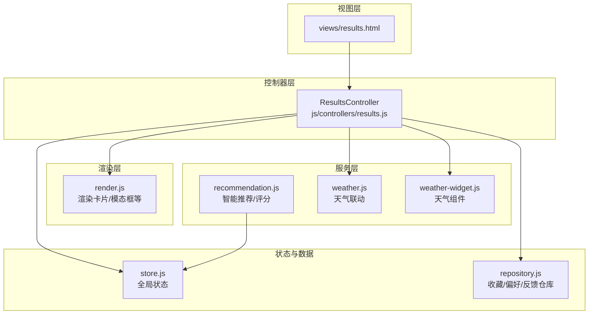
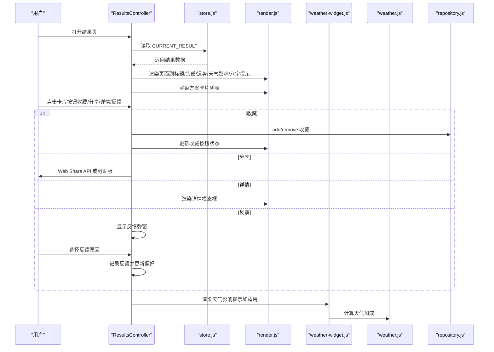
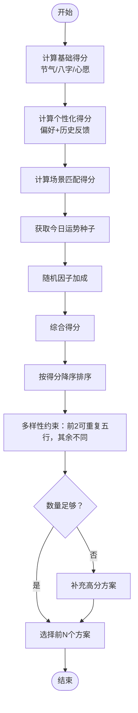
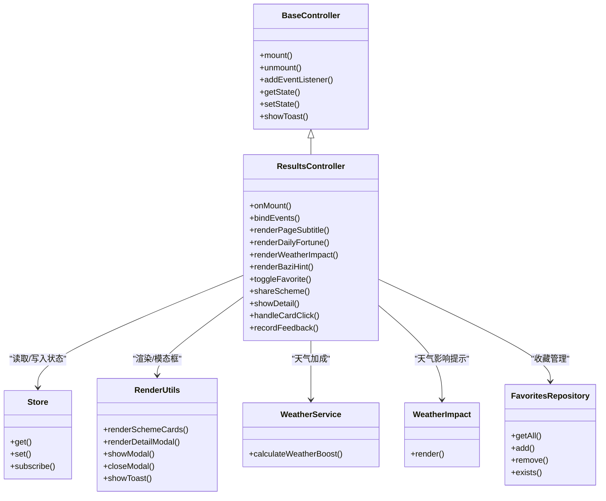

# 结果展示控制器

<cite>
**本文引用的文件**
- [results.js](file://js/controllers/results.js)
- [results.html](file://views/results.html)
- [recommendation.js](file://js/services/recommendation.js)
- [store.js](file://js/core/store.js)
- [render.js](file://js/utils/render.js)
- [repository.js](file://js/data/repository.js)
- [weather.js](file://js/services/weather.js)
- [weather-widget.js](file://js/components/weather-widget.js)
- [router.js](file://js/core/router.js)
- [base.js](file://js/controllers/base.js)
- [main.css](file://css/main.css)
</cite>

## 目录
1. [简介](#简介)
2. [项目结构](#项目结构)
3. [核心组件](#核心组件)
4. [架构总览](#架构总览)
5. [详细组件分析](#详细组件分析)
6. [依赖关系分析](#依赖关系分析)
7. [性能考量](#性能考量)
8. [故障排查指南](#故障排查指南)
9. [结论](#结论)
10. [附录](#附录)

## 简介
本文件面向“结果展示控制器”（ResultsController），系统性梳理其在推荐结果呈现与用户交互方面的设计与实现。文档涵盖：
- 推荐结果的数据处理逻辑、排序算法与展示策略
- 控制器对结果列表渲染、用户选择操作与收藏功能的管理
- 性能优化建议（大数据量、虚拟滚动、懒加载）
- 用户交互优化、响应式设计与无障碍访问最佳实践

## 项目结构
结果页位于 views/results.html，控制器位于 js/controllers/results.js，配合渲染工具、推荐服务、状态管理与仓库模块共同协作。

图表来源
- [results.html](file://views/results.html#L1-L128)
- [results.js](file://js/controllers/results.js#L1-L614)
- [render.js](file://js/utils/render.js#L1-L487)
- [recommendation.js](file://js/services/recommendation.js#L1-L466)
- [weather.js](file://js/services/weather.js#L1-L340)
- [weather-widget.js](file://js/components/weather-widget.js#L1-L215)
- [store.js](file://js/core/store.js#L1-L212)
- [repository.js](file://js/data/repository.js#L1-L394)

章节来源
- [results.html](file://views/results.html#L1-L128)
- [results.js](file://js/controllers/results.js#L1-L614)

## 核心组件
- 结果页控制器（ResultsController）
  - 负责挂载/卸载、事件绑定、渲染结果页、处理收藏/分享/反馈、管理模态框与提示
- 渲染工具（render.js）
  - 渲染方案卡片、详情模态框、Toast、收藏列表等
- 推荐服务（recommendation.js）
  - 个性化评分、场景匹配、今日运势随机因子、反馈闭环
- 状态管理（store.js）
  - 全局状态（当前结果、收藏、视图等）
- 仓库模块（repository.js）
  - 收藏、偏好、反馈等本地持久化
- 天气服务与组件（weather.js、weather-widget.js）
  - 天气联动与天气影响提示
- 路由系统（router.js）
  - 页面导航与历史管理
- 控制器基类（base.js）
  - 生命周期、事件/订阅管理、状态读写

章节来源
- [results.js](file://js/controllers/results.js#L13-L614)
- [render.js](file://js/utils/render.js#L119-L132)
- [recommendation.js](file://js/services/recommendation.js#L247-L379)
- [store.js](file://js/core/store.js#L30-L187)
- [repository.js](file://js/data/repository.js#L86-L146)
- [weather.js](file://js/services/weather.js#L268-L289)
- [weather-widget.js](file://js/components/weather-widget.js#L200-L215)
- [router.js](file://js/core/router.js#L57-L79)
- [base.js](file://js/controllers/base.js#L11-L131)

## 架构总览
结果页的控制流如下：
- 控制器挂载时从全局状态读取当前推荐结果
- 渲染页面副标题、头部节气信息、今日运势卡片、天气影响提示、八字提示
- 渲染方案卡片列表，并绑定卡片点击事件（收藏/分享/详情/反馈）
- 收藏通过仓库模块持久化；分享通过 Web Share API 或剪贴板；反馈记录到本地并更新用户偏好
- 模态框用于详情展示与反馈弹窗

图表来源
- [results.js](file://js/controllers/results.js#L20-L46)
- [results.js](file://js/controllers/results.js#L361-L462)
- [render.js](file://js/utils/render.js#L119-L132)
- [weather-widget.js](file://js/components/weather-widget.js#L200-L215)
- [weather.js](file://js/services/weather.js#L268-L289)
- [repository.js](file://js/data/repository.js#L103-L121)

## 详细组件分析

### 控制器生命周期与挂载
- 生命周期：继承 BaseController，提供 mount/unmount、事件绑定、Store 订阅等
- 挂载流程：onMount 中动态获取容器、绑定事件、渲染结果、渲染今日运势、天气影响、八字提示
- 卸载流程：onUnmount 中重置事件绑定标志位

章节来源
- [base.js](file://js/controllers/base.js#L21-L42)
- [results.js](file://js/controllers/results.js#L20-L46)
- [results.js](file://js/controllers/results.js#L610-L612)

### 推荐结果渲染与展示策略
- 页面副标题：根据当前节气与方案数量生成文案
- 头部节气信息：渲染节气名称与五行属性
- 今日运势卡片：渲染场景/心愿、幸运色系、五行解析、穿搭建议
- 天气影响提示：根据天气与方案计算加成，渲染天气影响组件
- 八字提示：若未填写八字，则显示提示区域并引导跳转

章节来源
- [results.js](file://js/controllers/results.js#L48-L55)
- [results.js](file://js/controllers/results.js#L57-L93)
- [results.js](file://js/controllers/results.js#L217-L233)
- [results.js](file://js/controllers/results.js#L235-L253)

### 推荐结果的数据处理与排序算法
- 推荐服务提供智能选择方案函数，综合考虑：
  - 基础得分：节气、八字、心愿与五行相生关系
  - 个性化得分：用户偏好（五行/颜色/材质）、历史反馈
  - 场景匹配得分：针对场景的五行与材质偏好
  - 今日运势随机因子：基于日期种子的伪随机加成
- 选择策略：先按综合得分降序，保证前两个方案可重复五行，其余方案需不同五行；不足时补充高分方案

图表来源
- [recommendation.js](file://js/services/recommendation.js#L323-L379)
- [recommendation.js](file://js/services/recommendation.js#L247-L284)
- [recommendation.js](file://js/services/recommendation.js#L286-L314)
- [recommendation.js](file://js/services/recommendation.js#L387-L417)

章节来源
- [recommendation.js](file://js/services/recommendation.js#L247-L379)

### 结果列表渲染与交互
- 渲染卡片：render.js 生成方案卡片，包含颜色条、关键词、注解、来源、收藏/分享/详情/反馈按钮
- 事件委托：控制器对卡片容器进行事件委托，识别收藏/分享/详情/反馈按钮并处理
- 模态框：详情模态框通过 renderDetailModal 渲染；反馈弹窗用于收集不喜欢的原因

章节来源
- [render.js](file://js/utils/render.js#L119-L201)
- [render.js](file://js/utils/render.js#L324-L365)
- [results.js](file://js/controllers/results.js#L308-L359)
- [results.js](file://js/controllers/results.js#L366-L392)

### 收藏功能与数据持久化
- 收藏/取消收藏：通过 favoritesRepo 判断存在性并增删；更新按钮状态与 aria-label
- 本地持久化：使用仓库模块的 FavoritesRepository，基于 localStorage
- UI 反馈：Toast 提示“已收藏/已取消收藏”

章节来源
- [results.js](file://js/controllers/results.js#L527-L548)
- [repository.js](file://js/data/repository.js#L86-L146)
- [render.js](file://js/utils/render.js#L457-L486)

### 分享与反馈机制
- 分享：优先使用 Web Share API，失败回退到剪贴板复制
- 反馈：采纳/不喜欢两种动作；不喜欢时弹出反馈弹窗，收集原因并记录到本地反馈数据，同时更新用户偏好权重

章节来源
- [results.js](file://js/controllers/results.js#L568-L594)
- [results.js](file://js/controllers/results.js#L394-L462)
- [repository.js](file://js/data/repository.js#L206-L259)
- [recommendation.js](file://js/services/recommendation.js#L145-L184)

### 天气影响与今日运势
- 天气影响：根据天气与方案计算加成，渲染天气影响提示组件
- 今日运势：生成运势解析与穿搭建议，支持随机种子与加成因子

章节来源
- [results.js](file://js/controllers/results.js#L217-L233)
- [weather.js](file://js/services/weather.js#L268-L289)
- [weather-widget.js](file://js/components/weather-widget.js#L200-L215)
- [recommendation.js](file://js/services/recommendation.js#L124-L137)
- [results.js](file://js/controllers/results.js#L139-L204)

### 用户交互优化与无障碍访问
- 无障碍：按钮提供 aria-label；模态框显示/隐藏时管理 body 的 overflow；Toast 通过自定义事件派发
- 交互细节：收藏按钮状态切换、SVG 填充切换、反馈按钮禁用与文案更新
- 动画与过渡：卡片入场动画、模态框动画、按钮按压效果

章节来源
- [results.js](file://js/controllers/results.js#L550-L566)
- [render.js](file://js/utils/render.js#L386-L403)
- [render.js](file://js/utils/render.js#L457-L486)
- [main.css](file://css/main.css#L398-L421)
- [main.css](file://css/main.css#L424-L444)

## 依赖关系分析

图表来源
- [base.js](file://js/controllers/base.js#L11-L131)
- [results.js](file://js/controllers/results.js#L13-L614)
- [store.js](file://js/core/store.js#L30-L187)
- [render.js](file://js/utils/render.js#L119-L132)
- [weather.js](file://js/services/weather.js#L268-L289)
- [weather-widget.js](file://js/components/weather-widget.js#L200-L215)
- [repository.js](file://js/data/repository.js#L86-L146)

章节来源
- [results.js](file://js/controllers/results.js#L1-L18)
- [store.js](file://js/core/store.js#L1-L212)
- [render.js](file://js/utils/render.js#L1-L487)
- [weather.js](file://js/services/weather.js#L1-L340)
- [weather-widget.js](file://js/components/weather-widget.js#L1-L215)
- [repository.js](file://js/data/repository.js#L1-L394)

## 性能考量
以下为通用优化建议，适用于大规模结果集与复杂交互场景（概念性指导，非特定代码实现）：
- 虚拟滚动
  - 使用虚拟滚动仅渲染可视区域内的卡片，减少 DOM 节点数量
  - 通过固定容器高度与动态计算偏移量实现
- 懒加载
  - 对图片与详情内容采用懒加载策略，延迟到进入视口时再加载
- 渲染优化
  - 合并多次状态变更，使用批量更新或请求帧更新
  - 对高频事件（滚动/缩放）使用节流/防抖
- 数据缓存
  - 缓存推荐结果与评分，避免重复计算
  - 对天气数据设置合理缓存时间
- 事件委托
  - 使用事件委托减少监听器数量，降低内存占用
- 动画与过渡
  - 减少昂贵的动画属性（如阴影/圆角），优先使用 transform/opacity
- 无障碍与响应式
  - 为动画提供“减少运动”偏好；为触摸设备优化交互尺寸与反馈

[本节为通用性能指导，不直接分析具体文件]

## 故障排查指南
- 收藏失败
  - 检查仓库模块是否正确初始化与序列化；确认 localStorage 可用
  - 关注控制器中异常捕获与 Toast 提示
- 分享失败
  - 检查 Web Share API 支持与权限；回退到剪贴板复制
- 反馈记录异常
  - 确认本地反馈数据结构与上限；检查偏好更新逻辑
- 天气影响不显示
  - 检查天气数据获取与加成计算；确认容器存在且组件已挂载
- 模态框无法关闭
  - 检查 backdrop 与关闭按钮事件绑定；确认样式与 z-index

章节来源
- [results.js](file://js/controllers/results.js#L527-L548)
- [results.js](file://js/controllers/results.js#L568-L594)
- [results.js](file://js/controllers/results.js#L394-L462)
- [results.js](file://js/controllers/results.js#L217-L233)
- [render.js](file://js/utils/render.js#L386-L403)

## 结论
ResultsController 通过清晰的职责划分与模块化设计，实现了推荐结果的高效渲染与丰富的用户交互。结合推荐服务的多维评分、天气联动与反馈闭环，系统能够持续优化个性化体验。建议在后续迭代中引入虚拟滚动与懒加载，进一步提升大数据量场景下的性能表现，并完善换一批等交互能力。

[本节为总结性内容，不直接分析具体文件]

## 附录
- 相关文件路径与用途
  - views/results.html：结果页模板
  - js/controllers/results.js：结果页控制器
  - js/utils/render.js：DOM 渲染与模态框工具
  - js/services/recommendation.js：智能推荐与评分
  - js/core/store.js：全局状态管理
  - js/data/repository.js：收藏/偏好/反馈仓库
  - js/services/weather.js：天气联动
  - js/components/weather-widget.js：天气组件与天气影响提示
  - js/core/router.js：前端路由
  - js/controllers/base.js：控制器基类
  - css/main.css：样式与动画

[本节为概览性内容，不直接分析具体文件]