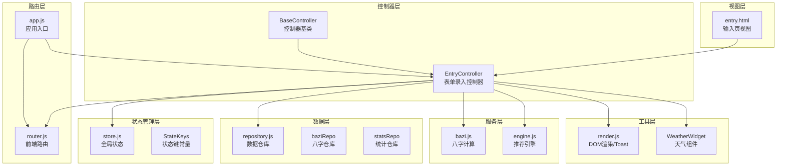
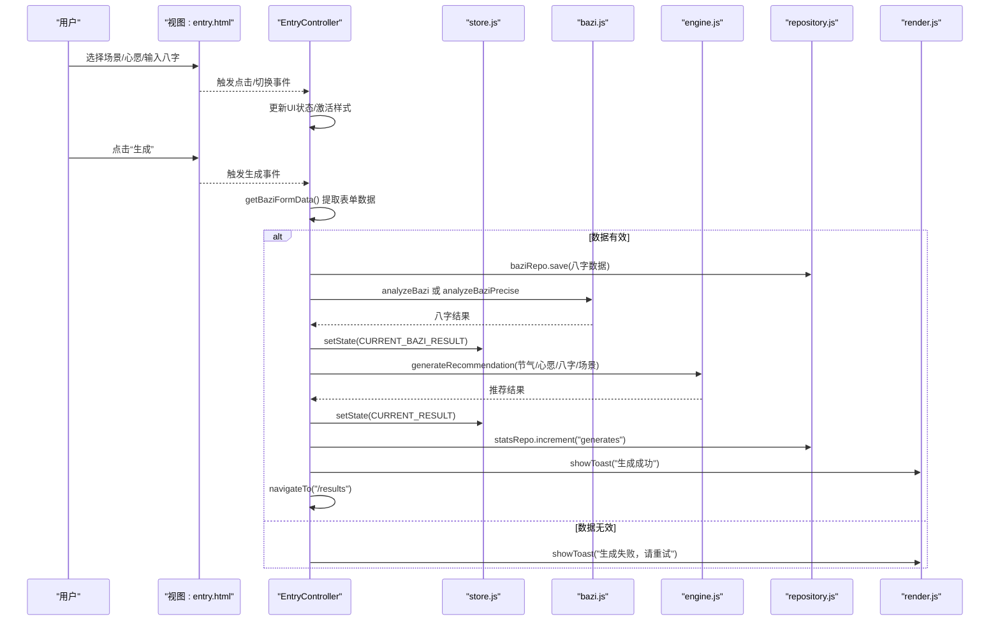
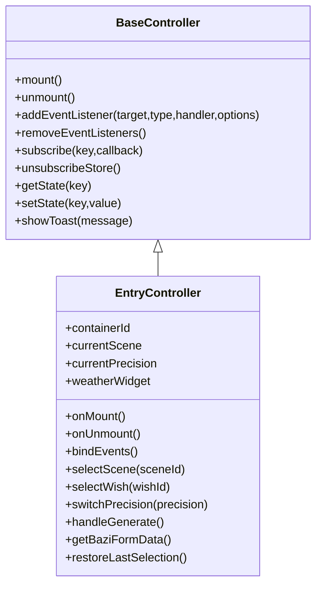
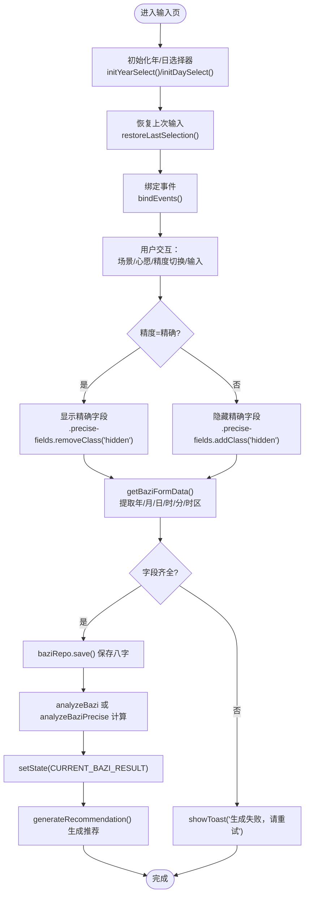
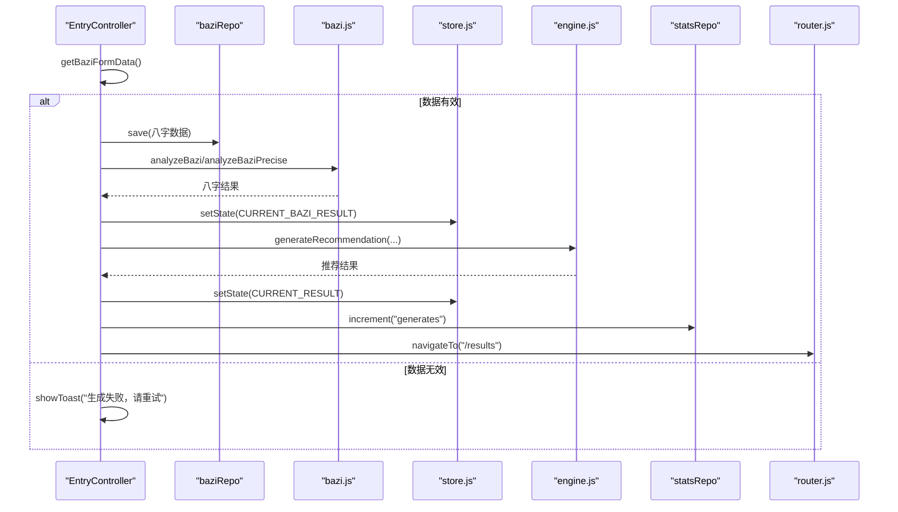
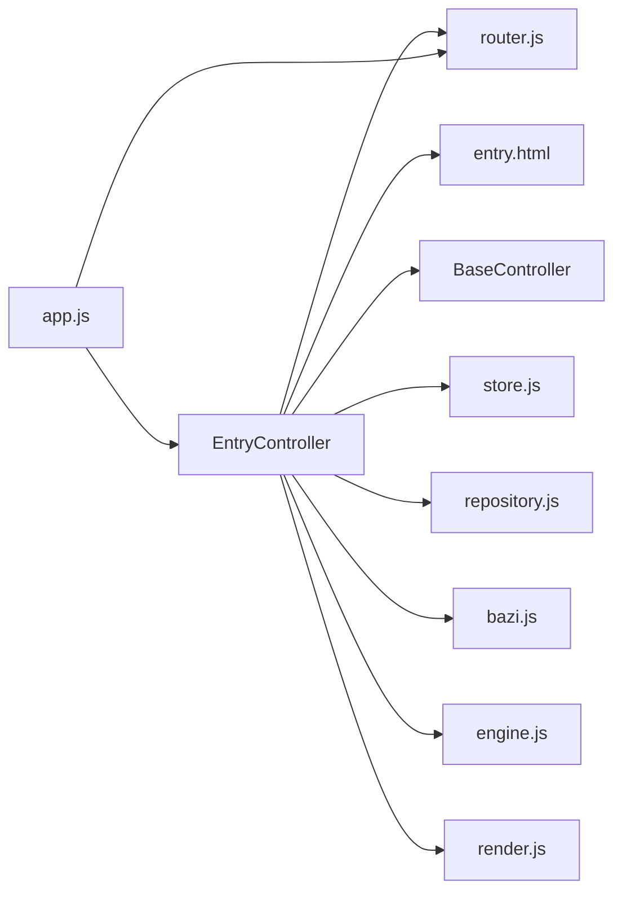

# 表单录入控制器

<cite>
**本文档引用的文件**
- [js/controllers/entry.js](file://js/controllers/entry.js)
- [views/entry.html](file://views/entry.html)
- [js/controllers/base.js](file://js/controllers/base.js)
- [js/core/store.js](file://js/core/store.js)
- [js/data/repository.js](file://js/data/repository.js)
- [js/utils/render.js](file://js/utils/render.js)
- [js/services/bazi.js](file://js/services/bazi.js)
- [js/services/engine.js](file://js/services/engine.js)
- [js/core/router.js](file://js/core/router.js)
- [js/core/app.js](file://js/core/app.js)
</cite>

## 目录
1. [简介](#简介)
2. [项目结构](#项目结构)
3. [核心组件](#核心组件)
4. [架构总览](#架构总览)
5. [详细组件分析](#详细组件分析)
6. [依赖分析](#依赖分析)
7. [性能考虑](#性能考虑)
8. [故障排查指南](#故障排查指南)
9. [结论](#结论)

## 简介
本文档围绕“表单录入控制器”EntryController展开，系统性说明其在用户信息收集与数据验证方面的实现方式，涵盖表单字段处理逻辑、数据绑定机制、实时验证策略、用户输入管理、表单提交事件处理与数据持久化流程。同时提供复杂表单交互、条件显隐字段、性能优化、验证规则与错误提示机制等实践指导，帮助开发者构建健壮的表单处理系统。

## 项目结构
EntryController位于控制器层，负责“输入页”的交互与数据流转，配合视图层、状态管理层、服务层与数据仓库层协同工作。其职责包括：
- 动态加载视图容器并绑定事件
- 场景与心愿的选择状态管理
- 八字输入的精度切换与数据提取
- 调用推荐引擎生成结果并导航跳转
- 与全局状态与本地存储的集成

图表来源
- [js/controllers/entry.js](file://js/controllers/entry.js#L14-L241)
- [views/entry.html](file://views/entry.html#L1-L234)
- [js/controllers/base.js](file://js/controllers/base.js#L11-L131)
- [js/core/store.js](file://js/core/store.js#L30-L212)
- [js/data/repository.js](file://js/data/repository.js#L264-L287)
- [js/utils/render.js](file://js/utils/render.js#L24-L55)
- [js/services/bazi.js](file://js/services/bazi.js#L101-L183)
- [js/services/engine.js](file://js/services/engine.js#L323-L393)
- [js/core/router.js](file://js/core/router.js#L9-L17)
- [js/core/app.js](file://js/core/app.js#L23-L31)

章节来源
- [js/controllers/entry.js](file://js/controllers/entry.js#L14-L241)
- [views/entry.html](file://views/entry.html#L1-L234)

## 核心组件
- EntryController：继承自BaseController，负责输入页的事件绑定、状态切换、数据采集与提交、导航跳转与错误提示。
- 视图：entry.html定义了场景分类、心愿分类、八字输入区域（含简版/精确两种精度）与生成按钮。
- 状态管理：store.js集中管理节气信息、心愿ID、八字结果、推荐结果、收藏列表与UI状态。
- 数据仓库：repository.js提供baziRepo与statsRepo，分别用于保存八字与统计使用次数。
- 服务层：bazi.js提供简版/精确八字计算；engine.js负责加载模板、构建上下文并选择推荐方案。
- 工具层：render.js提供Toast提示、年/日选择器初始化等；WeatherWidget作为天气组件集成。
- 路由层：router.js与app.js负责视图切换、路由拦截与历史管理。

章节来源
- [js/controllers/entry.js](file://js/controllers/entry.js#L14-L241)
- [js/core/store.js](file://js/core/store.js#L30-L212)
- [js/data/repository.js](file://js/data/repository.js#L264-L287)
- [js/services/bazi.js](file://js/services/bazi.js#L101-L183)
- [js/services/engine.js](file://js/services/engine.js#L323-L393)
- [js/utils/render.js](file://js/utils/render.js#L24-L55)
- [js/core/router.js](file://js/core/router.js#L9-L17)
- [js/core/app.js](file://js/core/app.js#L23-L31)

## 架构总览
EntryController在应用中的位置与交互如下：

图表来源
- [js/controllers/entry.js](file://js/controllers/entry.js#L131-L189)
- [js/services/bazi.js](file://js/services/bazi.js#L101-L183)
- [js/services/engine.js](file://js/services/engine.js#L323-L393)
- [js/data/repository.js](file://js/data/repository.js#L264-L287)
- [js/utils/render.js](file://js/utils/render.js#L457-L486)
- [js/core/router.js](file://js/core/router.js#L57-L79)

## 详细组件分析

### EntryController 类结构与职责
EntryController继承自BaseController，具备控制器生命周期、事件绑定、状态订阅与全局状态读写能力。其关键职责包括：
- 生命周期管理：onMount/onUnmount中完成容器绑定、事件绑定、天气组件初始化与清理。
- 交互控制：场景选择、心愿选择、精度切换、生成按钮事件处理。
- 数据采集：getBaziFormData按精度模式提取年/月/日/时/分/时区等字段。
- 结果处理：调用推荐引擎生成方案，保存结果与统计，导航到结果页。
- 恢复功能：restoreLastSelection从本地仓库恢复上次输入。

图表来源
- [js/controllers/base.js](file://js/controllers/base.js#L11-L131)
- [js/controllers/entry.js](file://js/controllers/entry.js#L14-L241)

章节来源
- [js/controllers/entry.js](file://js/controllers/entry.js#L14-L241)
- [js/controllers/base.js](file://js/controllers/base.js#L11-L131)

### 表单字段处理与数据绑定机制
- 字段来源：视图中定义了场景标签组、心愿标签组、八字输入（年/月/日/时）、精度切换按钮与生成按钮。
- 数据绑定：EntryController通过querySelector按ID获取DOM节点，读取value或dataset属性，构建表单数据对象。
- 精度切换：switchPrecision根据当前精度切换“精确字段”区域的显隐，并更新currentPrecision状态。
- 恢复上次输入：restoreLastSelection从baziRepo读取上次保存的八字并回填到对应select。

图表来源
- [views/entry.html](file://views/entry.html#L144-L222)
- [js/controllers/entry.js](file://js/controllers/entry.js#L119-L221)
- [js/utils/render.js](file://js/utils/render.js#L24-L55)
- [js/data/repository.js](file://js/data/repository.js#L264-L287)
- [js/services/bazi.js](file://js/services/bazi.js#L101-L183)

章节来源
- [views/entry.html](file://views/entry.html#L144-L222)
- [js/controllers/entry.js](file://js/controllers/entry.js#L119-L221)
- [js/utils/render.js](file://js/utils/render.js#L24-L55)

### 实时验证策略与错误提示
- 前端校验：getBaziFormData在提取数据时进行非空校验，若年/月/日/时任一缺失则返回null，避免无效数据进入后续流程。
- 错误提示：handleGenerate在捕获异常或结果为空时统一调用showToast提示“生成失败，请重试”，并通过状态更新避免错误状态泄漏。
- 体验优化：通过切换精度按钮即时显隐精确字段，减少用户认知负担；初始化年/日选择器避免非法值。

章节来源
- [js/controllers/entry.js](file://js/controllers/entry.js#L131-L189)
- [js/utils/render.js](file://js/utils/render.js#L457-L486)

### 表单提交事件处理与数据持久化
- 提交流程：handleGenerate负责完整的提交链路，包括数据采集、保存、计算、结果保存、统计更新与导航。
- 持久化：baziRepo.save将八字数据写入本地存储；statsRepo.increment记录生成次数。
- 导航：navigateTo跳转到结果页，配合路由系统更新URL与页面标题。

图表来源
- [js/controllers/entry.js](file://js/controllers/entry.js#L131-L189)
- [js/data/repository.js](file://js/data/repository.js#L264-L287)
- [js/services/bazi.js](file://js/services/bazi.js#L101-L183)
- [js/services/engine.js](file://js/services/engine.js#L323-L393)
- [js/core/store.js](file://js/core/store.js#L79-L81)
- [js/core/router.js](file://js/core/router.js#L57-L79)

### 条件显隐字段与用户体验优化
- 条件显隐：switchPrecision通过切换“.precision-btn”的active类与“.precise-fields”的hidden类实现“精确字段”的动态显示/隐藏。
- 场景/心愿选择：selectScene/selectWish通过遍历同类元素切换active类，保持单选一致性。
- 初始化：initYearSelect/initDaySelect在页面挂载时填充年/日下拉选项，避免用户输入错误。
- 天气组件：initWeatherWidget在容器存在时实例化并挂载天气组件，提升信息密度与决策依据。

章节来源
- [js/controllers/entry.js](file://js/controllers/entry.js#L105-L129)
- [js/utils/render.js](file://js/utils/render.js#L24-L55)
- [js/controllers/entry.js](file://js/controllers/entry.js#L54-L60)

### 复杂表单交互与性能优化
- 事件去重：bindEvents中通过eventsBound避免重复绑定，降低内存占用与事件风暴风险。
- 异步处理：handleGenerate使用try/catch与Promise链处理异步计算与网络请求，保证UI流畅。
- 状态驱动：通过store集中管理状态，减少DOM直接操作，提高可维护性与可测试性。
- 性能建议：
  - 将getBaziFormData的DOM查询缓存于控制器实例，避免重复查询。
  - 在高频切换（如精度切换）时，批量更新DOM类名而非逐个元素操作。
  - 对外部API调用（如天气）增加超时与降级策略，防止阻塞主线程。

章节来源
- [js/controllers/entry.js](file://js/controllers/entry.js#L62-L103)
- [js/controllers/entry.js](file://js/controllers/entry.js#L131-L189)

## 依赖分析
EntryController与各模块的耦合关系如下：

图表来源
- [js/controllers/entry.js](file://js/controllers/entry.js#L5-L12)
- [views/entry.html](file://views/entry.html#L1-L234)
- [js/controllers/base.js](file://js/controllers/base.js#L6-L7)
- [js/core/store.js](file://js/core/store.js#L6-L7)
- [js/data/repository.js](file://js/data/repository.js#L6-L7)
- [js/services/bazi.js](file://js/services/bazi.js#L6-L7)
- [js/services/engine.js](file://js/services/engine.js#L6-L9)
- [js/utils/render.js](file://js/utils/render.js#L5-L8)
- [js/core/router.js](file://js/core/router.js#L6-L7)
- [js/core/app.js](file://js/core/app.js#L6-L11)

章节来源
- [js/controllers/entry.js](file://js/controllers/entry.js#L5-L12)
- [js/core/app.js](file://js/core/app.js#L14-L21)

## 性能考虑
- DOM查询与更新：将频繁使用的DOM节点引用缓存到控制器实例，减少重复查询。
- 事件绑定：确保只绑定一次，避免多次事件监听导致的性能问题。
- 异步任务：合理拆分异步任务，避免长时间阻塞UI线程；对网络请求设置超时与降级。
- 状态更新：通过store集中更新状态，减少不必要的重渲染。
- 缓存策略：对静态资源（如年/日选择器选项）进行一次性初始化，避免重复构造。

## 故障排查指南
- 生成失败提示：handleGenerate在异常或结果为空时统一弹出Toast提示，检查getBaziFormData返回值与外部服务可用性。
- 精度切换失效：确认“.precise-fields”与“.precision-btn”的类名一致，且switchPrecision正确切换hidden与active类。
- 本地存储异常：检查baziRepo与statsRepo的读写封装是否正常，必要时在开发工具中查看localStorage内容。
- 路由跳转异常：确认router.js的ROUTES配置与navigateTo调用路径一致，避免无效路由导致的页面空白。

章节来源
- [js/controllers/entry.js](file://js/controllers/entry.js#L131-L189)
- [js/utils/render.js](file://js/utils/render.js#L457-L486)
- [js/data/repository.js](file://js/data/repository.js#L264-L287)
- [js/core/router.js](file://js/core/router.js#L57-L79)

## 结论
EntryController以清晰的职责划分与模块化设计，实现了从用户输入到推荐结果的完整闭环。通过状态管理、数据仓库与服务层的协作，结合视图层的条件显隐与工具层的Toast提示，提供了良好的用户体验。遵循本文档的验证策略、性能优化与故障排查建议，可进一步提升系统的稳定性与可维护性。