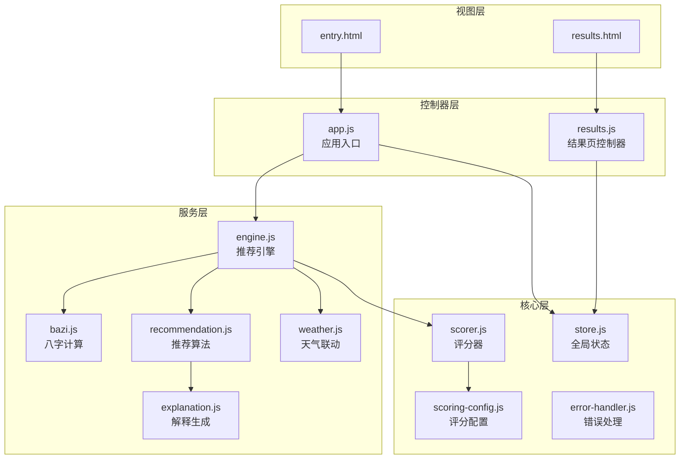
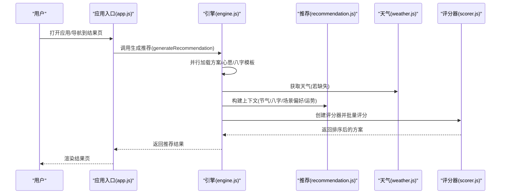
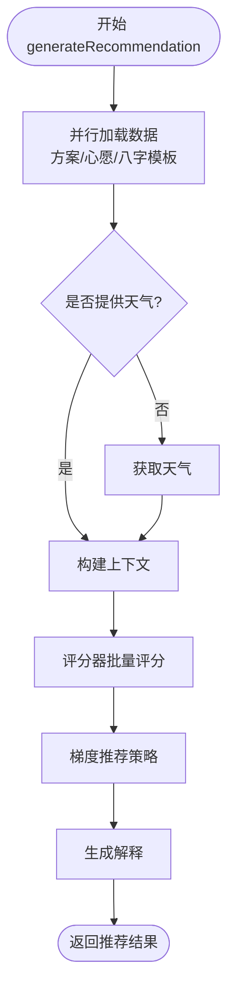
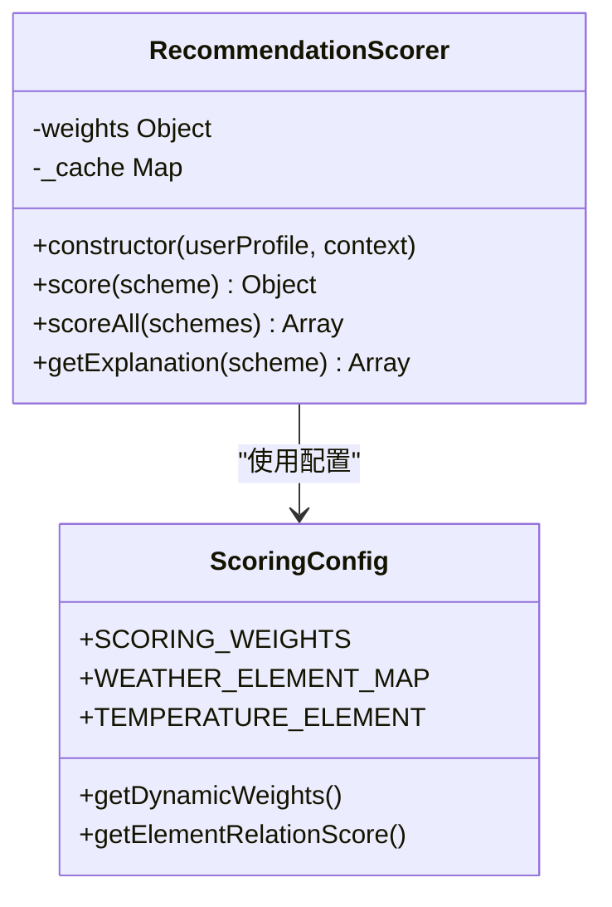
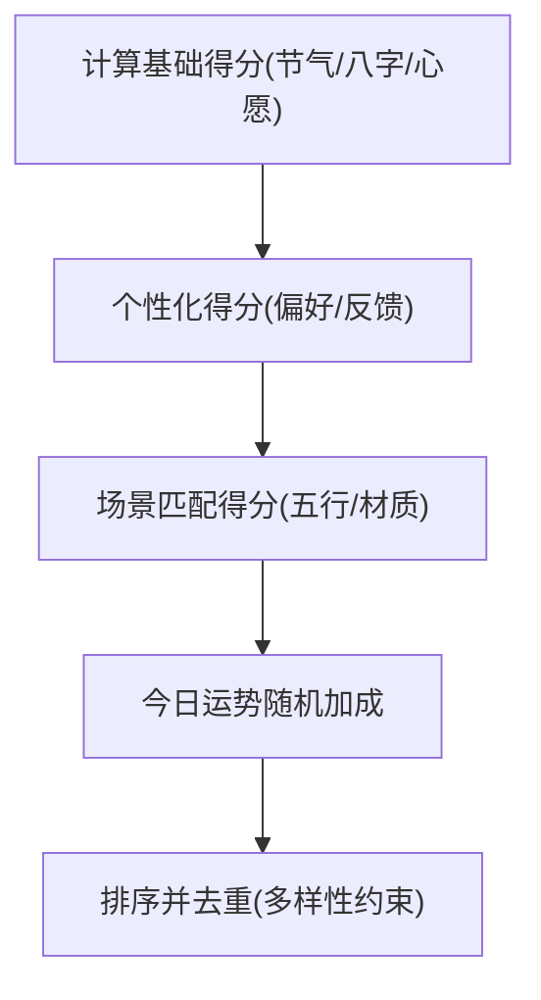
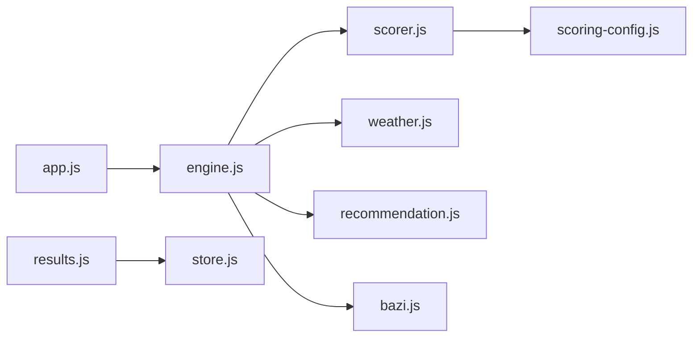
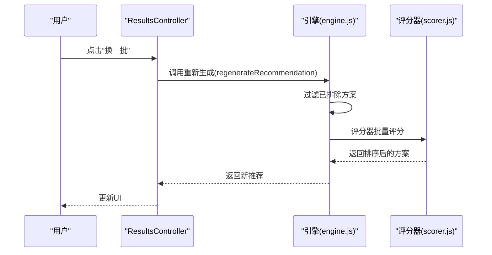

# 引擎架构设计

<cite>
**本文档引用的文件**
- [engine.js](file://js/services/engine.js)
- [scorer.js](file://js/core/scorer.js)
- [scoring-config.js](file://js/core/scoring-config.js)
- [recommendation.js](file://js/services/recommendation.js)
- [weather.js](file://js/services/weather.js)
- [bazi.js](file://js/services/bazi.js)
- [app.js](file://js/core/app.js)
- [store.js](file://js/core/store.js)
- [error-handler.js](file://js/core/error-handler.js)
- [results.js](file://js/controllers/results.js)
- [explanation.js](file://js/services/explanation.js)
- [index.html](file://index.html)
- [results.html](file://views/results.html)
- [entry.html](file://views/entry.html)
</cite>

## 目录
1. [引言](#引言)
2. [项目结构](#项目结构)
3. [核心组件](#核心组件)
4. [架构总览](#架构总览)
5. [详细组件分析](#详细组件分析)
6. [依赖分析](#依赖分析)
7. [性能考虑](#性能考虑)
8. [故障排查指南](#故障排查指南)
9. [结论](#结论)
10. [附录](#附录)

## 引言
本文件面向“推荐引擎”模块，系统化梳理其整体架构设计、模块化理念、组件协作机制与数据流。文档聚焦以下目标：
- 模块化设计：以服务层、核心层、控制器层分层组织，职责清晰、边界明确
- 数据流：从数据加载、上下文构建、方案选择到结果整合的完整链路
- 异步策略：Promise 并行加载、错误处理与缓存策略
- 扩展性：评分器类、权重配置、场景偏好、天气联动等可配置化与可插拔
- 图表与最佳实践：提供架构图、时序图与性能优化建议

## 项目结构
项目采用“MVC + 服务化”的前端架构：
- 视图层：HTML 页面按需动态加载
- 控制器层：负责视图生命周期与事件绑定
- 核心层：状态管理、评分配置、错误处理
- 服务层：引擎、推荐、天气、八字、解释等业务服务

**图表来源**
- [index.html](file://index.html#L58-L61)
- [app.js](file://js/core/app.js#L1-L206)
- [results.js](file://js/controllers/results.js#L1-L614)
- [engine.js](file://js/services/engine.js#L1-L425)
- [scorer.js](file://js/core/scorer.js#L1-L317)
- [scoring-config.js](file://js/core/scoring-config.js#L1-L128)
- [recommendation.js](file://js/services/recommendation.js#L1-L466)
- [weather.js](file://js/services/weather.js#L1-L340)
- [bazi.js](file://js/services/bazi.js#L1-L267)
- [explanation.js](file://js/services/explanation.js#L1-L298)

**章节来源**
- [index.html](file://index.html#L1-L79)
- [app.js](file://js/core/app.js#L1-L206)
- [results.js](file://js/controllers/results.js#L1-L614)

## 核心组件
- 推荐引擎（Engine）：统一协调数据加载、上下文构建、方案选择与结果整合
- 评分器（RecommendationScorer）：封装评分逻辑，支持缓存与解释
- 评分配置（ScoringConfig）：权重、五行关系、天气/温度映射
- 推荐算法（Recommendation）：场景偏好、历史反馈、今日运势
- 天气服务（Weather）：位置获取、天气数据、联动评分
- 八字服务（Bazi）：简版/精确八字计算与五行分析
- 错误处理（ErrorHandler）：统一错误包装、超时控制、存储安全
- 全局状态（Store）：响应式状态、订阅通知
- 控制器（ResultsController）：结果页渲染、事件绑定、反馈收集

**章节来源**
- [engine.js](file://js/services/engine.js#L1-L425)
- [scorer.js](file://js/core/scorer.js#L1-L317)
- [scoring-config.js](file://js/core/scoring-config.js#L1-L128)
- [recommendation.js](file://js/services/recommendation.js#L1-L466)
- [weather.js](file://js/services/weather.js#L1-L340)
- [bazi.js](file://js/services/bazi.js#L1-L267)
- [error-handler.js](file://js/core/error-handler.js#L1-L190)
- [store.js](file://js/core/store.js#L1-L212)
- [results.js](file://js/controllers/results.js#L1-L614)

## 架构总览
推荐引擎采用“服务编排 + 可插拔评分”的架构：
- 数据加载：并行加载方案、心愿模板、八字模板，带缓存
- 上下文构建：融合节气、八字、天气、场景偏好、今日运势
- 方案选择：评分器批量评分，梯度推荐策略（最佳匹配 + 保守替代 + 平衡方案）
- 结果整合：输出方案、解释、反馈记录、时间戳

**图表来源**
- [engine.js](file://js/services/engine.js#L323-L393)
- [recommendation.js](file://js/services/recommendation.js#L18-L137)
- [weather.js](file://js/services/weather.js#L119-L138)
- [scorer.js](file://js/core/scorer.js#L266-L276)

## 详细组件分析

### 引擎模块（Engine）
职责与流程：
- 数据加载：Promise.all 并行加载方案、心愿模板、八字模板，带内存缓存
- 天气处理：若未提供天气，自动获取；异常静默处理
- 上下文构建：融合节气、八字、天气、场景偏好、今日运势
- 方案选择：评分器批量评分，梯度推荐策略
- 结果整合：附加解释、时间戳、运势描述

**图表来源**
- [engine.js](file://js/services/engine.js#L323-L393)
- [scorer.js](file://js/core/scorer.js#L266-L276)

**章节来源**
- [engine.js](file://js/services/engine.js#L323-L393)

### 评分器（RecommendationScorer）
职责与特性：
- 输入：用户画像、上下文
- 输出：方案总分与分项分解
- 特性：权重动态调整、缓存、解释生成
- 评分维度：节气、八字、场景、天气、心愿、历史偏好、今日运势

**图表来源**
- [scorer.js](file://js/core/scorer.js#L14-L314)
- [scoring-config.js](file://js/core/scoring-config.js#L7-L92)

**章节来源**
- [scorer.js](file://js/core/scorer.js#L1-L317)
- [scoring-config.js](file://js/core/scoring-config.js#L1-L128)

### 推荐算法（Recommendation）
职责与机制：
- 场景偏好：按场景定义的五行与材质偏好打分
- 个性化：基于用户偏好与历史反馈
- 今日运势：随机种子驱动的加成，保证多样性
- 智能选择：综合得分排序，保证多样性与上限

**图表来源**
- [recommendation.js](file://js/services/recommendation.js#L323-L379)

**章节来源**
- [recommendation.js](file://js/services/recommendation.js#L1-L466)

### 天气联动（Weather）
职责与策略：
- 位置获取与天气 API 调用
- 天气类型到五行能量场映射
- 温度到五行调候映射
- 材质/颜色适配建议与评分加成

**章节来源**
- [weather.js](file://js/services/weather.js#L1-L340)

### 八字服务（Bazi）
职责与流程：
- 简版/精确两种计算模式
- 五行分布统计与“最弱/最强/喜用”推荐
- 与引擎结合进行八字评分

**章节来源**
- [bazi.js](file://js/services/bazi.js#L1-L267)

### 错误处理（ErrorHandler）
职责与能力：
- 统一错误包装与分类
- safeFetch 超时控制与 HTTP 错误处理
- safeStorage 存储异常兜底
- 全局未捕获错误监听

**章节来源**
- [error-handler.js](file://js/core/error-handler.js#L1-L190)

### 全局状态（Store）
职责与特性：
- 响应式状态代理
- 订阅/通知机制
- 调试快照与重置

**章节来源**
- [store.js](file://js/core/store.js#L1-L212)

### 控制器（ResultsController）
职责与交互：
- 结果页渲染、事件绑定
- 收藏、分享、反馈、换一批等交互
- 与全局状态联动

**章节来源**
- [results.js](file://js/controllers/results.js#L1-L614)

## 依赖分析
- 引擎依赖评分器、天气、推荐、八字服务
- 评分器依赖评分配置
- 控制器依赖全局状态与渲染工具
- 应用入口协调视图加载与路由

**图表来源**
- [engine.js](file://js/services/engine.js#L6-L9)
- [scorer.js](file://js/core/scorer.js#L6-L12)
- [recommendation.js](file://js/services/recommendation.js#L6-L29)
- [weather.js](file://js/services/weather.js#L6-L7)
- [bazi.js](file://js/services/bazi.js#L1-L5)
- [results.js](file://js/controllers/results.js#L5-L11)
- [app.js](file://js/core/app.js#L6-L11)

**章节来源**
- [engine.js](file://js/services/engine.js#L1-L425)
- [scorer.js](file://js/core/scorer.js#L1-L317)
- [recommendation.js](file://js/services/recommendation.js#L1-L466)
- [weather.js](file://js/services/weather.js#L1-L340)
- [bazi.js](file://js/services/bazi.js#L1-L267)
- [results.js](file://js/controllers/results.js#L1-L614)
- [app.js](file://js/core/app.js#L1-L206)

## 性能考虑
- 异步并行：数据加载使用 Promise.all 并行执行，显著缩短首屏等待
- 内存缓存：引擎内缓存方案/模板数据，避免重复请求
- 评分缓存：评分器内部 Map 缓存，避免重复计算
- 动态权重：根据用户画像与新老用户动态调整权重，减少无效计算
- 本地存储：错误处理提供 safeStorage，避免异常阻塞主线程
- UI 渲染：控制器按需渲染，避免一次性 DOM 操作

[本节为通用性能建议，无需特定文件引用]

## 故障排查指南
常见问题与定位：
- 网络请求失败：检查 safeFetch 的超时与 HTTP 状态码，查看错误类型
- 数据解析异常：确认 JSON 文件格式与字段一致性
- 存储异常：QuotaExceededError 时提示清理空间
- 天气不可用：引擎对天气获取做静默处理，不影响推荐生成
- 评分异常：检查评分器权重与五行关系映射

**章节来源**
- [error-handler.js](file://js/core/error-handler.js#L101-L163)
- [engine.js](file://js/services/engine.js#L340-L346)

## 结论
该推荐引擎以“服务编排 + 可插拔评分”为核心，实现了模块化、可扩展与高性能的推荐系统：
- 数据加载并行化、上下文构建完整、评分策略可配置
- 控制器与状态解耦，便于扩展新场景与交互
- 错误处理与缓存策略保障稳定性与用户体验
- 建议持续优化评分权重与解释生成，提升可解释性与用户信任

[本节为总结性内容，无需特定文件引用]

## 附录

### 关键流程时序图（换一批）

**图表来源**
- [results.js](file://js/controllers/results.js#L361-L364)
- [engine.js](file://js/services/engine.js#L398-L421)
- [scorer.js](file://js/core/scorer.js#L266-L276)

### 代码示例路径（供参考）
- 引擎生成推荐：[generateRecommendation](file://js/services/engine.js#L323-L393)
- 评分器批量评分：[scoreAll](file://js/core/scorer.js#L266-L276)
- 场景偏好配置：[SCENE_PREFERENCES](file://js/services/recommendation.js#L61-L87)
- 天气评分加成：[calculateWeatherBoost](file://js/services/weather.js#L268-L289)
- 八字推荐元素：[getRecommendElement](file://js/services/bazi.js#L217-L231)
- 错误处理包装：[withErrorHandler](file://js/core/error-handler.js#L45-L79)