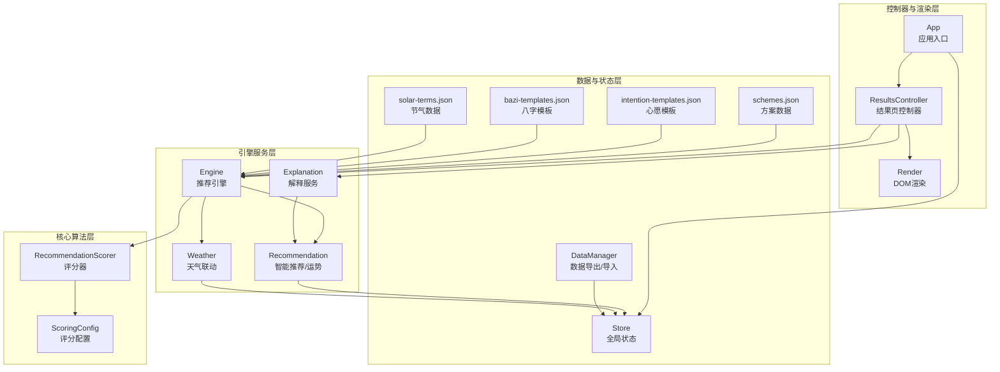
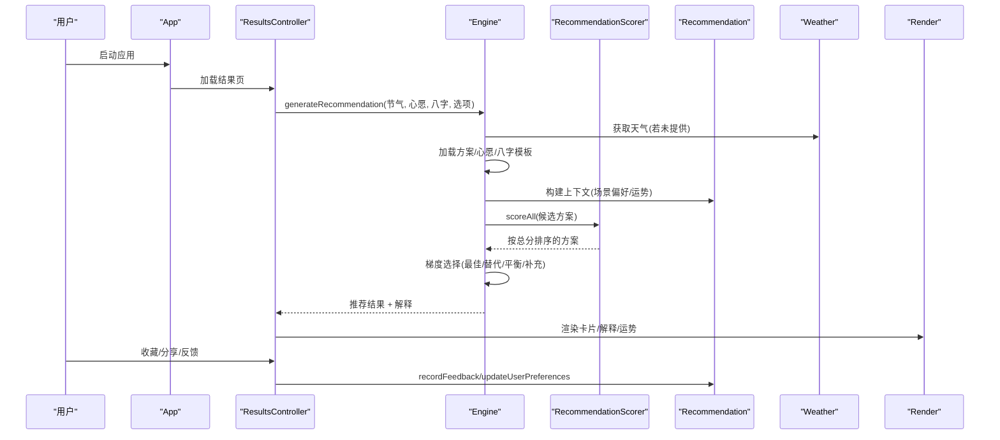
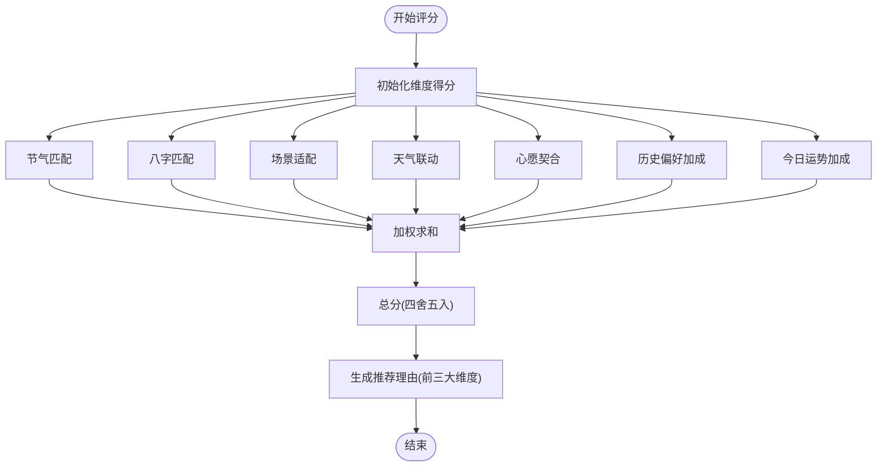
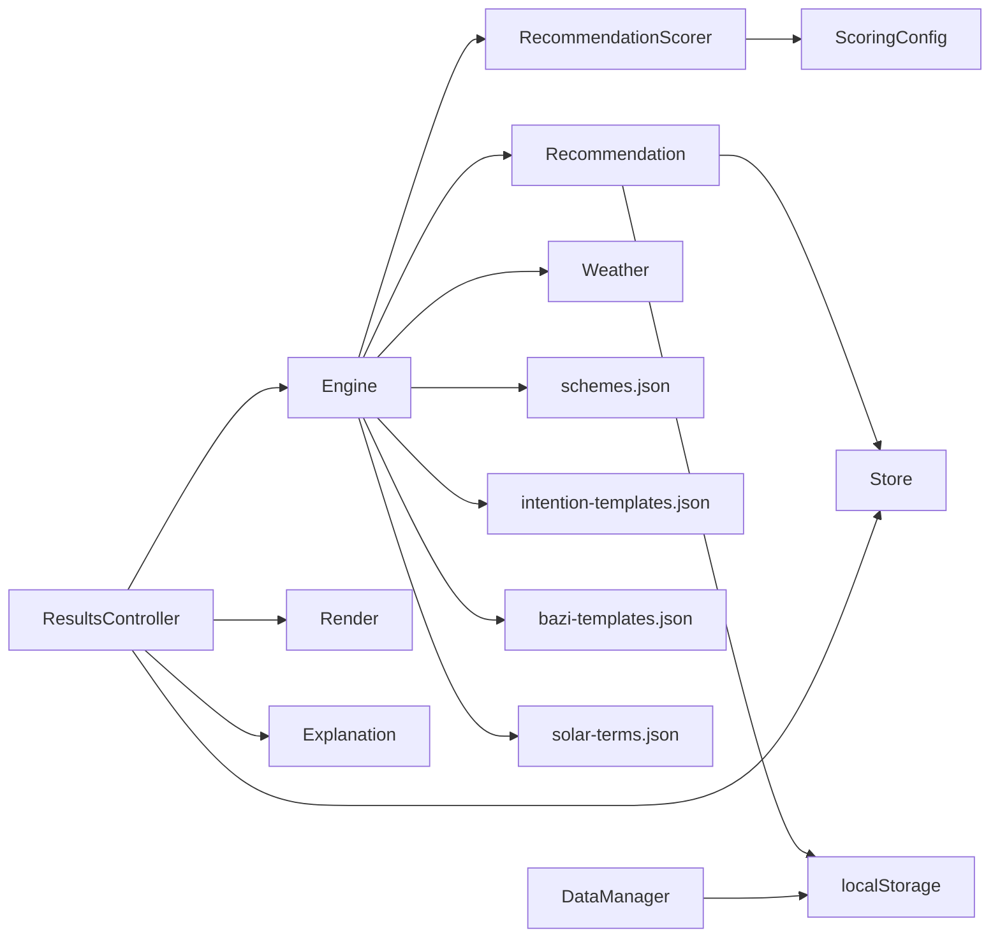

# 推荐引擎

<cite>
**本文引用的文件**
- [js/core/scorer.js](file://js/core/scorer.js)
- [js/core/scoring-config.js](file://js/core/scoring-config.js)
- [js/services/engine.js](file://js/services/engine.js)
- [js/services/recommendation.js](file://js/services/recommendation.js)
- [js/services/explanation.js](file://js/services/explanation.js)
- [js/services/weather.js](file://js/services/weather.js)
- [js/data/data-manager.js](file://js/data/data-manager.js)
- [js/controllers/results.js](file://js/controllers/results.js)
- [js/utils/render.js](file://js/utils/render.js)
- [js/core/store.js](file://js/core/store.js)
- [js/core/app.js](file://js/core/app.js)
- [data/schemes.json](file://data/schemes.json)
- [data/intention-templates.json](file://data/intention-templates.json)
- [data/bazi-templates.json](file://data/bazi-templates.json)
- [data/solar-terms.json](file://data/solar-terms.json)
</cite>

## 目录
1. [简介](#简介)
2. [项目结构](#项目结构)
3. [核心组件](#核心组件)
4. [架构总览](#架构总览)
5. [详细组件分析](#详细组件分析)
6. [依赖关系分析](#依赖关系分析)
7. [性能考虑](#性能考虑)
8. [故障排查指南](#故障排查指南)
9. [结论](#结论)
10. [附录](#附录)

## 简介
本项目是一个“五行穿搭建议”系统，围绕“节气—八字—场景—天气—心愿—历史偏好—今日运势”的多维信息，构建了推荐引擎与解释服务。推荐引擎通过评分器对候选方案进行量化评分，结合梯度推荐策略生成多样化的三套推荐；解释服务则将评分维度与文化背景融合，帮助用户理解推荐理由。

## 项目结构
系统采用模块化组织，核心分为四层：
- 核心算法层：评分器与评分配置
- 引擎服务层：推荐引擎、解释服务、天气联动
- 数据与状态层：方案数据、模板数据、用户偏好与状态管理
- 控制器与渲染层：视图控制、UI渲染、交互反馈

图表来源
- [js/core/scorer.js](file://js/core/scorer.js#L1-L317)
- [js/core/scoring-config.js](file://js/core/scoring-config.js#L1-L128)
- [js/services/engine.js](file://js/services/engine.js#L1-L425)
- [js/services/recommendation.js](file://js/services/recommendation.js#L1-L466)
- [js/services/explanation.js](file://js/services/explanation.js#L1-L298)
- [js/services/weather.js](file://js/services/weather.js#L1-L340)
- [js/data/data-manager.js](file://js/data/data-manager.js#L1-L376)
- [js/controllers/results.js](file://js/controllers/results.js#L1-L614)
- [js/utils/render.js](file://js/utils/render.js#L1-L487)
- [js/core/store.js](file://js/core/store.js#L1-L212)
- [js/core/app.js](file://js/core/app.js#L1-L206)
- [data/schemes.json](file://data/schemes.json#L1-L509)
- [data/intention-templates.json](file://data/intention-templates.json#L1-L493)
- [data/bazi-templates.json](file://data/bazi-templates.json#L1-L103)
- [data/solar-terms.json](file://data/solar-terms.json#L1-L42)

章节来源
- [js/core/app.js](file://js/core/app.js#L23-L31)
- [js/core/store.js](file://js/core/store.js#L30-L63)

## 核心组件
- 评分器 RecommendationScorer：封装多维度评分与解释生成，支持缓存与批量评分
- 评分配置 ScoringConfig：权重体系、五行关系、动态权重、天气/温度映射
- 推荐引擎 Engine：数据加载、上下文构建、梯度推荐、解释输出
- 智能推荐 Recommendation：个性化得分、场景匹配、今日运势随机因子
- 解释服务 Explanation：推荐理由、五行分析、可视化卡片
- 天气联动 Weather：位置获取、天气API、温度/材质/颜色建议
- 数据管理 DataManager：用户偏好与反馈导出/导入
- 控制器与渲染：ResultsController、Render、Store

章节来源
- [js/core/scorer.js](file://js/core/scorer.js#L14-L317)
- [js/core/scoring-config.js](file://js/core/scoring-config.js#L6-L128)
- [js/services/engine.js](file://js/services/engine.js#L323-L393)
- [js/services/recommendation.js](file://js/services/recommendation.js#L323-L379)
- [js/services/explanation.js](file://js/services/explanation.js#L25-L111)
- [js/services/weather.js](file://js/services/weather.js#L91-L138)
- [js/data/data-manager.js](file://js/data/data-manager.js#L48-L72)
- [js/controllers/results.js](file://js/controllers/results.js#L13-L614)
- [js/utils/render.js](file://js/utils/render.js#L119-L132)
- [js/core/store.js](file://js/core/store.js#L30-L63)

## 架构总览
推荐引擎采用“数据驱动 + 算法协调 + 服务编排”的架构：
- Engine 负责组装数据源（方案、模板、天气）与上下文（节气、八字、场景、心愿、运势），调用 RecommendationScorer 进行评分，再按梯度策略选择三套方案，并生成解释。
- Recommendation 提供个性化得分与随机因子，保证推荐多样性与新鲜感。
- Explanation 将评分维度转化为可读的理由与文化背景说明。
- Weather 提供实时天气联动，动态调整推荐权重。
- Store 与 Render 负责状态与UI渲染，ResultsController 负责交互与反馈闭环。

图表来源
- [js/core/app.js](file://js/core/app.js#L47-L73)
- [js/controllers/results.js](file://js/controllers/results.js#L20-L46)
- [js/services/engine.js](file://js/services/engine.js#L323-L393)
- [js/core/scorer.js](file://js/core/scorer.js#L266-L276)
- [js/services/recommendation.js](file://js/services/recommendation.js#L145-L184)
- [js/services/weather.js](file://js/services/weather.js#L135-L138)
- [js/utils/render.js](file://js/utils/render.js#L119-L132)

## 详细组件分析

### 评分器 RecommendationScorer
- 多维度评分
  - 节气匹配：依据节气五行与方案颜色五行的关系得分
  - 八字匹配：喜用神、忌神、相生/相克判定
  - 场景适配：场景偏好（五行/材质）匹配
  - 天气联动：天气五行能量场、温度调候、实用材质
  - 心愿契合：心愿模板匹配
  - 历史偏好：用户偏好加成
  - 今日运势：幸运/增益五行加成
- 计算逻辑
  - 各维度乘以对应权重（基础权重 + 动态权重），历史与运势为加成项
  - 支持批量评分与排序
  - 提供推荐理由解释（取得分最高的前三个维度及其占比）
- 缓存策略
  - 以方案ID为键缓存评分结果，避免重复计算

图表来源
- [js/core/scorer.js](file://js/core/scorer.js#L29-L75)
- [js/core/scorer.js](file://js/core/scorer.js#L283-L313)

章节来源
- [js/core/scorer.js](file://js/core/scorer.js#L14-L317)

### 评分配置 ScoringConfig
- 权重体系
  - 基础权重：节气、八字、场景、天气、心愿
  - 加成权重：历史偏好、今日运势
  - 动态权重：无八字时将权重重新分配；新用户适度提升节气/场景权重
- 五行关系
  - 相生/相克/平衡关系映射为等级分
- 天气/温度映射
  - 天气类型映射到五行能量场
  - 温度映射到五行调候

章节来源
- [js/core/scoring-config.js](file://js/core/scoring-config.js#L6-L92)
- [js/core/scoring-config.js](file://js/core/scoring-config.js#L120-L127)

### 推荐引擎 Engine
- 数据加载
  - 异步加载方案、心愿模板、八字模板
- 上下文构建
  - 节气信息、心愿ID、八字结果、天气数据、场景偏好、今日运势
  - 天气温度分级、推荐材质/颜色
- 梯度推荐策略
  - 最佳匹配：最高分方案
  - 保守替代：同五行不同方案
  - 平衡方案：不同五行，与节气相克或不同，保证能量平衡
  - 补充方案：补齐不足数量
- 解释输出
  - 为每套方案附加类型标签、总分与维度分解

章节来源
- [js/services/engine.js](file://js/services/engine.js#L60-L85)
- [js/services/engine.js](file://js/services/engine.js#L187-L212)
- [js/services/engine.js](file://js/services/engine.js#L218-L299)
- [js/services/engine.js](file://js/services/engine.js#L323-L393)

### 智能推荐 Recommendation
- 个性化得分
  - 基于用户偏好（五行/颜色/材质）与历史反馈（收藏/采纳/不喜欢）加权
- 场景匹配
  - 依据场景偏好（五行/材质）给予额外分数
- 今日运势随机因子
  - 基于日期生成随机种子，打乱五行顺序，为方案增加随机加成
- 反馈闭环
  - 记录用户反馈，更新偏好，影响后续推荐

章节来源
- [js/services/recommendation.js](file://js/services/recommendation.js#L145-L184)
- [js/services/recommendation.js](file://js/services/recommendation.js#L247-L284)
- [js/services/recommendation.js](file://js/services/recommendation.js#L323-L379)
- [js/services/recommendation.js](file://js/services/recommendation.js#L437-L457)

### 解释服务 Explanation
- 推荐理由
  - 节气相应/相生、八字补益/相生、场景适宜、今日幸运/增益色、个性化偏好
- 五行分析
  - 当前状态（节气/八字/运势）、关系说明
- 可视化卡片
  - 渲染解释卡片与简化的五行雷达图

章节来源
- [js/services/explanation.js](file://js/services/explanation.js#L25-L111)
- [js/services/explanation.js](file://js/services/explanation.js#L118-L151)
- [js/services/explanation.js](file://js/services/explanation.js#L218-L297)

### 天气联动 Weather
- 位置与天气
  - 获取经纬度，调用公开天气API，解析当前与预报
- 天气推荐
  - 按天气类型与温度给出材质/颜色/提示
- 评分联动
  - 旧版兼容：计算材质/颜色/温度适配的加成

章节来源
- [js/services/weather.js](file://js/services/weather.js#L91-L138)
- [js/services/weather.js](file://js/services/weather.js#L184-L240)
- [js/services/weather.js](file://js/services/weather.js#L268-L289)

### 数据管理 DataManager
- 导出/导入
  - 支持版本校验、预览、合并覆盖
- 数据概览
  - 统计键数量、大小、简要展示
- 本地存储
  - 安全封装 localStorage 操作

章节来源
- [js/data/data-manager.js](file://js/data/data-manager.js#L48-L72)
- [js/data/data-manager.js](file://js/data/data-manager.js#L106-L135)
- [js/data/data-manager.js](file://js/data/data-manager.js#L235-L271)

### 控制器与渲染 ResultsController / Render
- 结果页渲染
  - 渲染标题、方案卡片、今日运势、天气影响、八字提示
- 交互反馈
  - 收藏/分享/采纳/不喜欢、模态框、Toast提示
- 解释展示
  - 展示评分维度与公式、总分、各维度占比

章节来源
- [js/controllers/results.js](file://js/controllers/results.js#L20-L46)
- [js/utils/render.js](file://js/utils/render.js#L119-L132)
- [js/utils/render.js](file://js/utils/render.js#L223-L299)

## 依赖关系分析
- 模块耦合
  - Engine 依赖 Scorer、Recommendation、Weather、数据文件
  - Scorer 依赖 ScoringConfig
  - Recommendation 依赖 Store 与本地存储
  - ResultsController 依赖 Engine、Explanation、Render、Store
- 外部依赖
  - 天气API（Open-Meteo）
  - 浏览器地理位置接口
- 数据依赖
  - 方案、模板、节气、心愿、八字

图表来源
- [js/services/engine.js](file://js/services/engine.js#L6-L13)
- [js/core/scorer.js](file://js/core/scorer.js#L6-L12)
- [js/services/recommendation.js](file://js/services/recommendation.js#L6-L29)
- [js/controllers/results.js](file://js/controllers/results.js#L5-L11)
- [js/data/data-manager.js](file://js/data/data-manager.js#L6-L42)

章节来源
- [js/services/engine.js](file://js/services/engine.js#L6-L13)
- [js/core/scorer.js](file://js/core/scorer.js#L6-L12)
- [js/services/recommendation.js](file://js/services/recommendation.js#L6-L29)
- [js/controllers/results.js](file://js/controllers/results.js#L5-L11)
- [js/data/data-manager.js](file://js/data/data-manager.js#L6-L42)

## 性能考虑
- 评分缓存
  - RecommendationScorer 对每个方案ID进行缓存，避免重复计算
- 批量评分
  - scoreAll 一次性计算并排序，减少多次遍历
- 动态权重
  - 在构建上下文时计算权重，避免运行时重复判断
- 异步加载
  - 方案与模板异步加载，避免阻塞主线程
- DOM 渲染
  - 使用委托与延迟动画，减少重绘
- 天气请求
  - 仅在需要时获取位置与天气，限制超时时间

章节来源
- [js/core/scorer.js](file://js/core/scorer.js#L20-L22)
- [js/core/scorer.js](file://js/core/scorer.js#L266-L276)
- [js/services/engine.js](file://js/services/engine.js#L327-L331)
- [js/services/weather.js](file://js/services/weather.js#L120-L129)

## 故障排查指南
- 天气API失败
  - 现象：无法获取天气或预报
  - 排查：确认网络可用、地理位置权限、API返回格式
  - 参考：位置获取与天气API调用
- 本地存储异常
  - 现象：偏好/反馈丢失或导入失败
  - 排查：检查浏览器隐私模式、存储配额、JSON格式
  - 参考：安全存储封装与数据验证
- 推荐结果为空
  - 现象：无候选方案或上下文缺失
  - 排查：确认方案数据加载、节气/场景/心愿/八字上下文
  - 参考：Engine 数据加载与上下文构建
- 解释不显示
  - 现象：推荐理由栏空白
  - 排查：确认方案包含 _score/_breakdown，或上下文存在
  - 参考：Render 的解释生成逻辑

章节来源
- [js/services/weather.js](file://js/services/weather.js#L91-L111)
- [js/data/data-manager.js](file://js/data/data-manager.js#L106-L135)
- [js/services/engine.js](file://js/services/engine.js#L333-L336)
- [js/utils/render.js](file://js/utils/render.js#L223-L227)

## 结论
本推荐引擎以“多维评分 + 动态权重 + 梯度策略 + 文化解释”为核心，实现了可解释、可扩展、可优化的五行穿搭推荐系统。通过缓存、异步与随机因子等手段，在保证性能的同时提升了用户体验与个性化程度。

## 附录

### 数学与算法要点
- 五行关系得分规则
  - 相同：满分
  - 相生：较高分
  - 相克：较低分
  - 其他：中等/较低分
- 动态权重
  - 无八字：将“八字权重”平分给“节气/场景”
  - 新用户：提升“节气/场景”权重
- 评分公式（概念示意）
  - 总分 ≈ Σ(维度得分 × 权重) + 历史偏好加成 + 今日运势加成
  - 各维度得分来自五行关系与偏好匹配

章节来源
- [js/core/scoring-config.js](file://js/core/scoring-config.js#L120-L127)
- [js/core/scoring-config.js](file://js/core/scoring-config.js#L74-L92)
- [js/core/scorer.js](file://js/core/scorer.js#L29-L75)

### 实际应用场景示例
- 场景：面试/答辩
  - 推荐：稳重、专业、值得信赖
  - 评分：场景适配 + 节气/八字平衡 + 今日运势
- 场景：浪漫约会
  - 推荐：浪漫、柔情、流动感
  - 评分：场景适配 + 心愿契合 + 个性化偏好
- 场景：居家休息
  - 推荐：包容、放松、接地气
  - 评分：场景适配 + 历史偏好 + 天气联动

章节来源
- [js/services/recommendation.js](file://js/services/recommendation.js#L32-L87)
- [js/services/engine.js](file://js/services/engine.js#L218-L299)