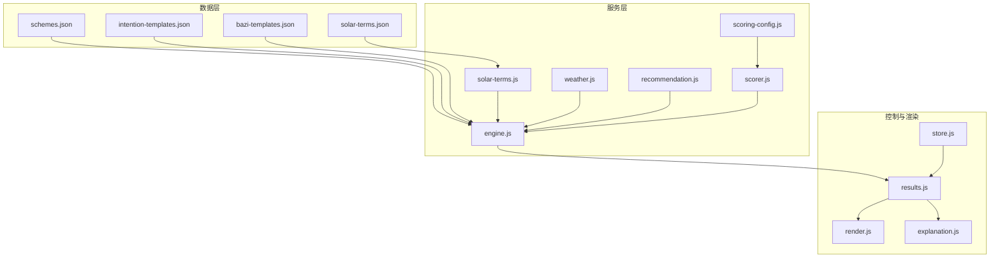
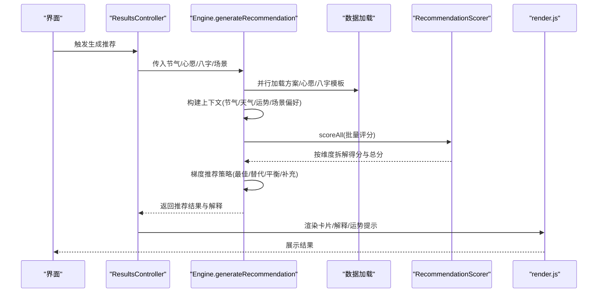
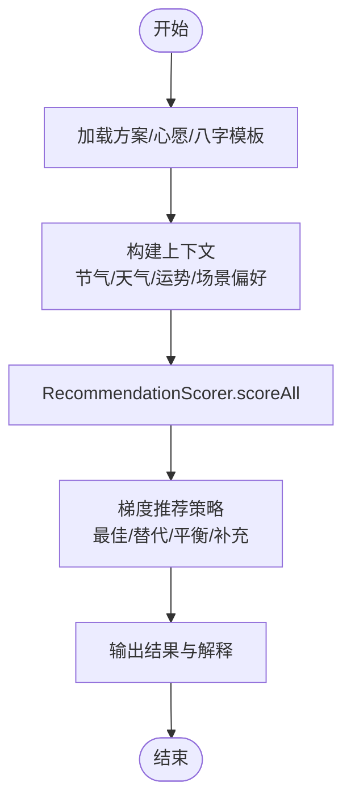
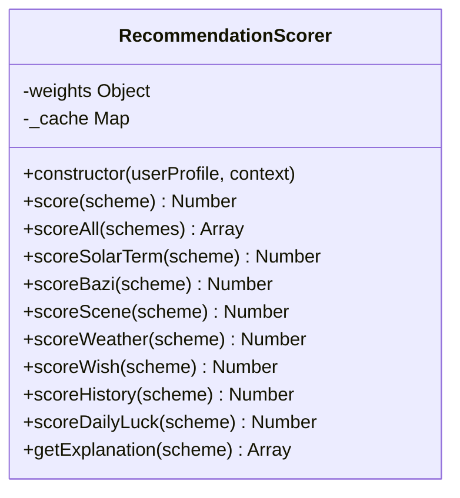
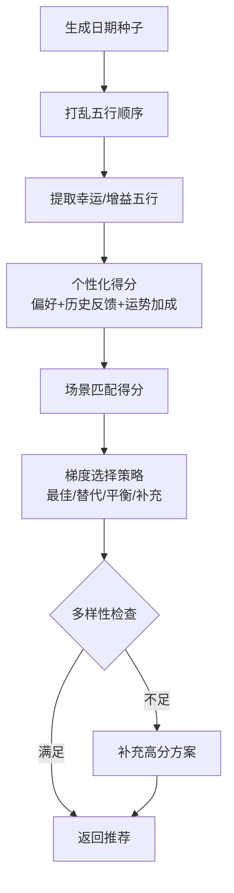
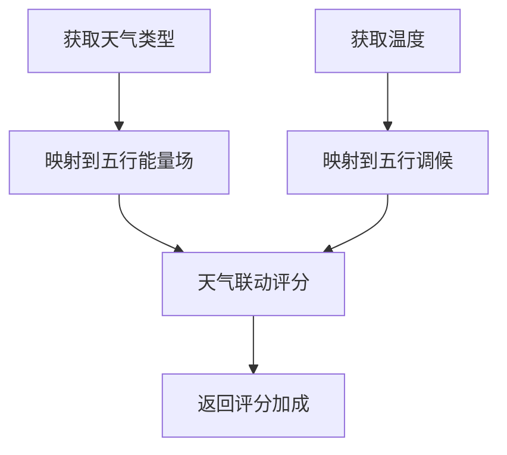
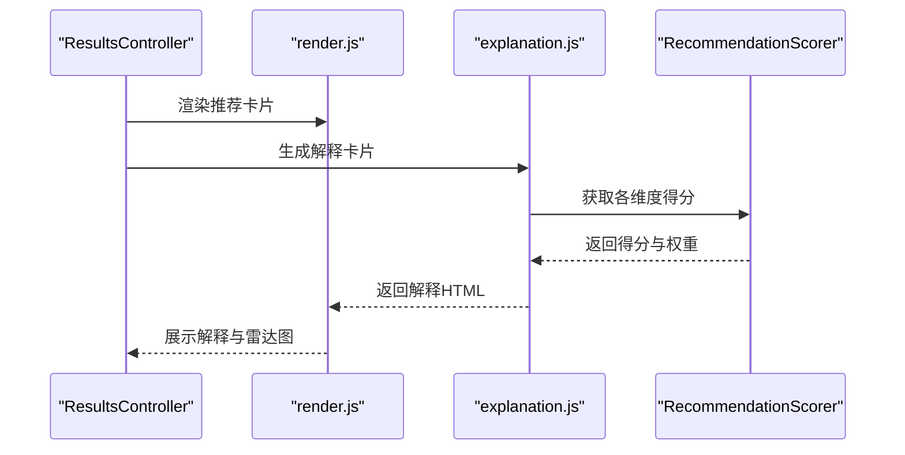
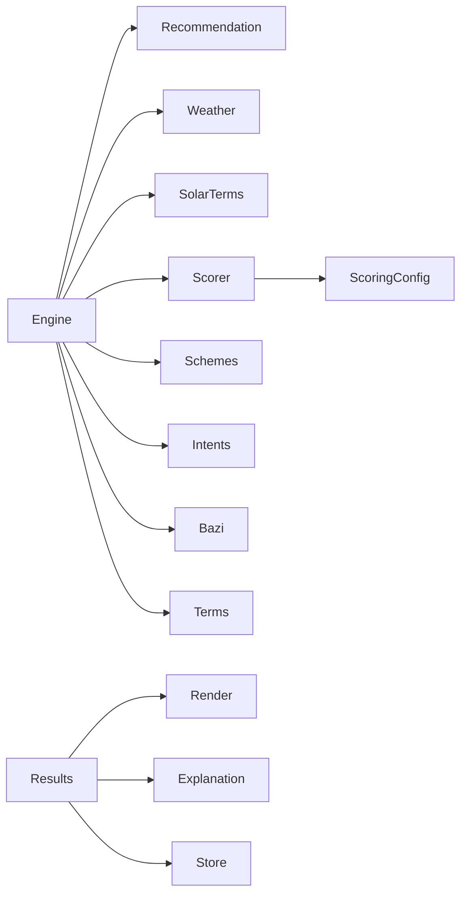

# 推荐服务

<cite>
**本文引用的文件**
- [recommendation.js](file://js/services/recommendation.js)
- [engine.js](file://js/services/engine.js)
- [scorer.js](file://js/core/scorer.js)
- [scoring-config.js](file://js/core/scoring-config.js)
- [schemes.json](file://data/schemes.json)
- [intention-templates.json](file://data/intention-templates.json)
- [bazi-templates.json](file://data/bazi-templates.json)
- [solar-terms.json](file://data/solar-terms.json)
- [results.js](file://js/controllers/results.js)
- [explanation.js](file://js/services/explanation.js)
- [render.js](file://js/utils/render.js)
- [weather.js](file://js/services/weather.js)
- [solar-terms.js](file://js/services/solar-terms.js)
- [store.js](file://js/core/store.js)
</cite>

## 目录
1. [简介](#简介)
2. [项目结构](#项目结构)
3. [核心组件](#核心组件)
4. [架构总览](#架构总览)
5. [详细组件分析](#详细组件分析)
6. [依赖关系分析](#依赖关系分析)
7. [性能考量](#性能考量)
8. [故障排查指南](#故障排查指南)
9. [结论](#结论)
10. [附录](#附录)

## 简介
本文件面向“推荐服务”的技术实现，系统性解析智能推荐算法、个性化匹配逻辑、质量评估标准与运势因子计算体系，并阐述场景偏好匹配机制、梯度推荐策略、多样性保障与质量控制，以及数学模型、权重分配与性能优化方案。文档同时提供推荐示例、算法流程图与调试工具使用指南，帮助开发者与产品人员快速理解与落地。

## 项目结构
推荐服务位于前端模块化架构中，核心文件分布如下：
- 推荐服务层：recommendation.js、engine.js
- 评分器与权重：scorer.js、scoring-config.js
- 数据资源：schemes.json、intention-templates.json、bazi-templates.json、solar-terms.json
- 控制器与渲染：results.js、render.js、explanation.js
- 天气联动：weather.js
- 节气识别：solar-terms.js
- 全局状态：store.js

图表来源
- [engine.js](file://js/services/engine.js#L323-L393)
- [recommendation.js](file://js/services/recommendation.js#L323-L379)
- [scorer.js](file://js/core/scorer.js#L14-L75)
- [scoring-config.js](file://js/core/scoring-config.js#L6-L92)
- [weather.js](file://js/services/weather.js#L119-L138)
- [solar-terms.js](file://js/services/solar-terms.js#L33-L100)
- [results.js](file://js/controllers/results.js#L13-L46)
- [render.js](file://js/utils/render.js#L119-L132)
- [explanation.js](file://js/services/explanation.js#L25-L111)

章节来源
- [engine.js](file://js/services/engine.js#L323-L393)
- [recommendation.js](file://js/services/recommendation.js#L323-L379)
- [scorer.js](file://js/core/scorer.js#L14-L75)
- [scoring-config.js](file://js/core/scoring-config.js#L6-L92)
- [weather.js](file://js/services/weather.js#L119-L138)
- [solar-terms.js](file://js/services/solar-terms.js#L33-L100)
- [results.js](file://js/controllers/results.js#L13-L46)
- [render.js](file://js/utils/render.js#L119-L132)
- [explanation.js](file://js/services/explanation.js#L25-L111)

## 核心组件
- 推荐引擎（Engine）：负责加载数据、构建上下文、调用评分器、执行梯度推荐策略并输出结果。
- 推荐评分器（RecommendationScorer）：封装评分逻辑，支持权重配置、缓存、解释生成。
- 推荐服务（Recommendation）：提供运势因子、用户偏好、反馈记录、个性化得分与场景匹配。
- 天气联动（Weather）：根据实时天气与温度进行五行能量场与调候评分。
- 节气识别（Solar Terms）：识别当前节气及其五行属性。
- 控制器与渲染（Results/Render/Explanation）：结果页展示、解释卡片、交互反馈。
- 全局状态（Store）：集中管理应用状态，驱动视图更新。

章节来源
- [engine.js](file://js/services/engine.js#L323-L393)
- [scorer.js](file://js/core/scorer.js#L14-L75)
- [recommendation.js](file://js/services/recommendation.js#L323-L379)
- [weather.js](file://js/services/weather.js#L119-L138)
- [solar-terms.js](file://js/services/solar-terms.js#L33-L100)
- [results.js](file://js/controllers/results.js#L13-L46)
- [render.js](file://js/utils/render.js#L119-L132)
- [explanation.js](file://js/services/explanation.js#L25-L111)
- [store.js](file://js/core/store.js#L30-L63)

## 架构总览
推荐系统采用“数据加载—上下文构建—评分—梯度选择—渲染”的流水线式架构。评分器独立封装评分维度与权重，引擎负责组合外部数据（天气、节气、心愿、八字模板）与内部偏好，最终输出三套推荐方案并提供解释。

图表来源
- [engine.js](file://js/services/engine.js#L323-L393)
- [scorer.js](file://js/core/scorer.js#L266-L276)
- [results.js](file://js/controllers/results.js#L30-L46)
- [render.js](file://js/utils/render.js#L119-L132)

## 详细组件分析

### 推荐引擎（Engine）
- 数据加载：并行加载方案、心愿模板、八字模板，避免串行阻塞。
- 上下文构建：整合节气、天气、心愿模板、场景偏好、今日运势因子。
- 评分与选择：使用评分器批量评分，执行梯度推荐策略，保证多样性与能量平衡。
- 输出：包含方案、解释、运势、天气影响等丰富信息。

图表来源
- [engine.js](file://js/services/engine.js#L323-L393)
- [scorer.js](file://js/core/scorer.js#L266-L276)

章节来源
- [engine.js](file://js/services/engine.js#L323-L393)

### 推荐评分器（RecommendationScorer）
- 维度与权重：节气匹配、八字匹配、场景适配、天气联动、心愿契合、历史偏好、今日运势。
- 动态权重：根据是否有八字与用户画像调整权重；新用户提升节气与场景权重。
- 缓存：按方案ID缓存评分结果，提升批量评分效率。
- 解释：输出得分构成与占比，便于前端展示。

图表来源
- [scorer.js](file://js/core/scorer.js#L14-L75)
- [scoring-config.js](file://js/core/scoring-config.js#L6-L92)

章节来源
- [scorer.js](file://js/core/scorer.js#L14-L75)
- [scoring-config.js](file://js/core/scoring-config.js#L6-L92)

### 推荐服务（Recommendation）
- 运势因子：基于日期生成随机种子，打乱五行顺序得到幸运/增益五行，形成每日随机因子。
- 用户偏好：记录收藏/采纳/不喜欢等行为，累积五行、颜色、材质偏好。
- 个性化得分：结合历史反馈、偏好与今日运势加成，计算个性化得分。
- 场景匹配：依据场景偏好表，匹配五行与材质，计算场景适配得分。
- 方案选择：在保证多样性的前提下，优先最佳匹配，再补充替代与平衡方案。

图表来源
- [recommendation.js](file://js/services/recommendation.js#L93-L137)
- [recommendation.js](file://js/services/recommendation.js#L247-L284)
- [recommendation.js](file://js/services/recommendation.js#L292-L314)
- [recommendation.js](file://js/services/recommendation.js#L323-L379)

章节来源
- [recommendation.js](file://js/services/recommendation.js#L93-L137)
- [recommendation.js](file://js/services/recommendation.js#L247-L284)
- [recommendation.js](file://js/services/recommendation.js#L292-L314)
- [recommendation.js](file://js/services/recommendation.js#L323-L379)

### 天气联动（Weather）
- 天气类型映射：晴/多云/雨/雪/雾/雷暴，对应五行能量场（火/金/水）。
- 温度调候：根据温度区间映射到五行（火/土/金/水），指导材质与颜色选择。
- 材质与颜色匹配：计算与天气/温度适配的材质与颜色，作为评分加成。

图表来源
- [weather.js](file://js/services/weather.js#L119-L138)
- [weather.js](file://js/services/weather.js#L184-L240)
- [weather.js](file://js/services/weather.js#L268-L289)

章节来源
- [weather.js](file://js/services/weather.js#L119-L138)
- [weather.js](file://js/services/weather.js#L184-L240)
- [weather.js](file://js/services/weather.js#L268-L289)

### 节气识别（Solar Terms）
- UTC+8时间转换，定位当前节气与下一节气。
- 节气到五行映射，提供季节信息与名称。

章节来源
- [solar-terms.js](file://js/services/solar-terms.js#L33-L100)

### 结果页与解释（Results/Render/Explanation）
- 结果页渲染：展示推荐卡片、运势提示、天气影响、解释卡片。
- 解释生成：基于评分器的维度得分，生成“为什么推荐”的解释列表与雷达图。
- 交互反馈：收藏、分享、采纳/不喜欢反馈，更新偏好与历史记录。

图表来源
- [results.js](file://js/controllers/results.js#L30-L46)
- [render.js](file://js/utils/render.js#L119-L132)
- [explanation.js](file://js/services/explanation.js#L25-L111)
- [scorer.js](file://js/core/scorer.js#L266-L276)

章节来源
- [results.js](file://js/controllers/results.js#L30-L46)
- [render.js](file://js/utils/render.js#L119-L132)
- [explanation.js](file://js/services/explanation.js#L25-L111)
- [scorer.js](file://js/core/scorer.js#L266-L276)

## 依赖关系分析
- Engine 依赖 Recommendation（运势因子、场景偏好）、Weather（天气评分）、Solar Terms（节气上下文）、Scorer（评分器）、本地存储（偏好与反馈）。
- Scorer 依赖 Scoring Config（权重与关系评分）。
- Results 依赖 Render（渲染）、Explanation（解释）、Store（状态）。
- 数据文件（JSON）作为静态资源被 Engine/Controllers 加载。

图表来源
- [engine.js](file://js/services/engine.js#L323-L393)
- [recommendation.js](file://js/services/recommendation.js#L323-L379)
- [scorer.js](file://js/core/scorer.js#L14-L75)
- [scoring-config.js](file://js/core/scoring-config.js#L6-L92)
- [results.js](file://js/controllers/results.js#L13-L46)
- [render.js](file://js/utils/render.js#L119-L132)
- [explanation.js](file://js/services/explanation.js#L25-L111)
- [schemes.json](file://data/schemes.json#L1-L509)
- [intention-templates.json](file://data/intention-templates.json#L1-L493)
- [bazi-templates.json](file://data/bazi-templates.json#L1-L103)
- [solar-terms.json](file://data/solar-terms.json#L1-L42)

章节来源
- [engine.js](file://js/services/engine.js#L323-L393)
- [recommendation.js](file://js/services/recommendation.js#L323-L379)
- [scorer.js](file://js/core/scorer.js#L14-L75)
- [scoring-config.js](file://js/core/scoring-config.js#L6-L92)
- [results.js](file://js/controllers/results.js#L13-L46)
- [render.js](file://js/utils/render.js#L119-L132)
- [explanation.js](file://js/services/explanation.js#L25-L111)
- [schemes.json](file://data/schemes.json#L1-L509)
- [intention-templates.json](file://data/intention-templates.json#L1-L493)
- [bazi-templates.json](file://data/bazi-templates.json#L1-L103)
- [solar-terms.json](file://data/solar-terms.json#L1-L42)

## 性能考量
- 批量评分与缓存：RecommendationScorer 对每个方案评分结果进行缓存，避免重复计算。
- 并行加载：Engine 使用 Promise.all 并行加载方案、心愿与八字模板，缩短首屏等待。
- 本地存储安全封装：Recommendation 使用安全包装的 localStorage 操作，避免异常中断。
- DOM 渲染优化：render.js 仅在必要时更新 DOM，使用动画延迟错峰渲染卡片。
- 天气接口超时控制：weather.js 对外部 API 请求设置超时，防止阻塞主线程。

章节来源
- [scorer.js](file://js/core/scorer.js#L20-L22)
- [engine.js](file://js/services/engine.js#L327-L331)
- [recommendation.js](file://js/services/recommendation.js#L12-L29)
- [render.js](file://js/utils/render.js#L137-L201)
- [weather.js](file://js/services/weather.js#L120-L123)

## 故障排查指南
- 无法加载数据
  - 现象：推荐为空或报错。
  - 排查：确认 data 目录下 JSON 文件存在且可访问；检查网络请求与跨域设置。
  - 参考：Engine 的数据加载与错误处理。
- 天气接口失败
  - 现象：天气评分缺失或提示不可用。
  - 排查：检查地理位置权限、网络连通性；查看 weather.js 的超时与错误分支。
- 评分异常
  - 现象：推荐结果不符合预期。
  - 排查：检查权重配置、动态权重调整逻辑；核对五行相生/相克关系；验证缓存命中。
- 个性化偏好未生效
  - 现象：采纳/不喜欢后推荐未变化。
  - 排查：确认偏好存储键名一致；检查偏好权重更新逻辑；验证 getUserPreferences 的返回值。
- 结果页渲染问题
  - 现象：卡片不显示或解释不出现。
  - 排查：确认 window.__currentSchemes 是否正确注入；检查 render.js 的 DOM 查询与事件绑定。

章节来源
- [engine.js](file://js/services/engine.js#L333-L336)
- [weather.js](file://js/services/weather.js#L91-L111)
- [scorer.js](file://js/core/scorer.js#L14-L22)
- [recommendation.js](file://js/services/recommendation.js#L192-L218)
- [render.js](file://js/utils/render.js#L119-L132)

## 结论
本推荐服务以“评分器+引擎+上下文”的架构实现了高可扩展性与可解释性。通过动态权重、天气联动、运势因子与场景偏好，系统在保证个性化的同时兼顾多样性与能量平衡。建议持续收集用户反馈，迭代权重与模板，进一步提升推荐质量与用户体验。

## 附录

### 数学模型与权重分配
- 评分维度与权重（基础权重）
  - 节气匹配：25%
  - 八字匹配：20%
  - 场景适配：20%
  - 天气联动：15%
  - 心愿契合：15%
  - 历史偏好（额外加成）：10%
  - 今日运势（随机加成）：5%
- 动态权重调整
  - 无八字：将八字权重平分给节气与场景。
  - 新用户：提升节气与场景权重。
- 五行关系得分
  - 相同：完美（100）
  - 相生（顺生）：优秀（80）
  - 相生（逆生）：良好（60）
  - 相克：一般（40）
  - 相克（逆克）：较差（20）
  - 其他：较差（20）

章节来源
- [scoring-config.js](file://js/core/scoring-config.js#L6-L92)
- [scoring-config.js](file://js/core/scoring-config.js#L120-L127)

### 推荐示例与流程
- 示例场景：求职（清明节气，木旺），职场场景，天气晴朗，用户偏好火/木色系。
- 流程要点：
  - 节气匹配：木旺，方案中木/火色系加分。
  - 八字匹配：若用户八字喜火/木，进一步加分。
  - 场景适配：职场场景偏好羊毛/真丝等正式材质。
  - 天气联动：晴天，偏向浅色/透气材质。
  - 今日运势：幸运/增益五行叠加。
  - 个性化：偏好火/木色系，历史采纳记录强化。
  - 梯度选择：最佳匹配（火/木色系）+ 同系替代 + 平衡方案（金/水色系）。

章节来源
- [engine.js](file://js/services/engine.js#L323-L393)
- [recommendation.js](file://js/services/recommendation.js#L323-L379)
- [scoring-config.js](file://js/core/scoring-config.js#L6-L92)

### 调试工具与技巧
- 全局状态快照：Store.snapshot 可用于调试状态变更。
- 评分解释：RecommendationScorer.getExplanation 输出维度占比与得分来源。
- 本地偏好清理：Recommendation.clearRecommendationData 清空偏好与反馈数据，便于回归测试。
- DOM 渲染检查：render.js 中的卡片生成与事件绑定，便于定位渲染问题。

章节来源
- [store.js](file://js/core/store.js#L175-L178)
- [scorer.js](file://js/core/scorer.js#L283-L313)
- [recommendation.js](file://js/services/recommendation.js#L462-L465)
- [render.js](file://js/utils/render.js#L137-L201)