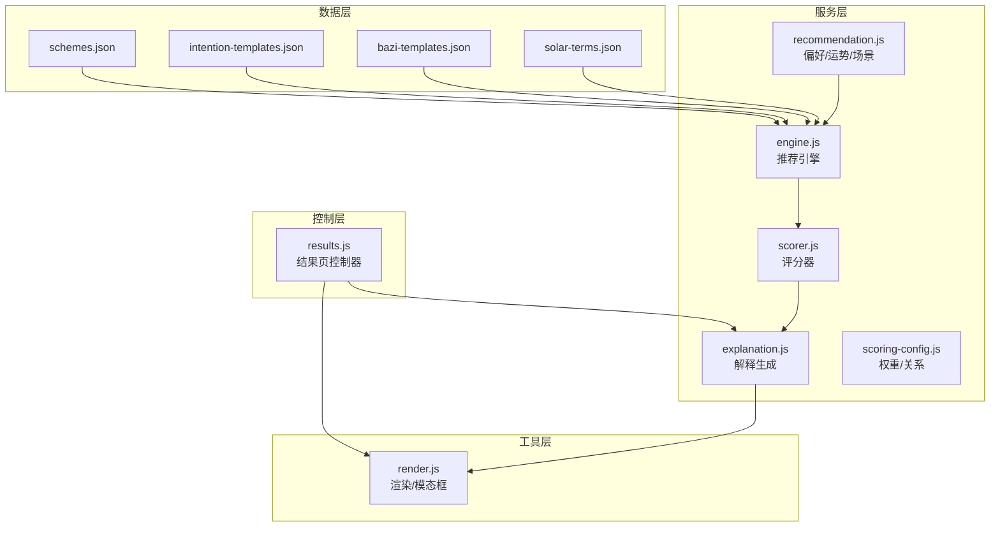
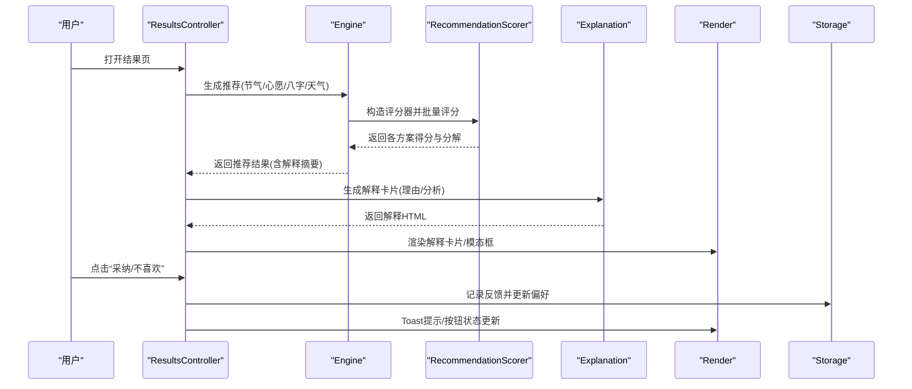
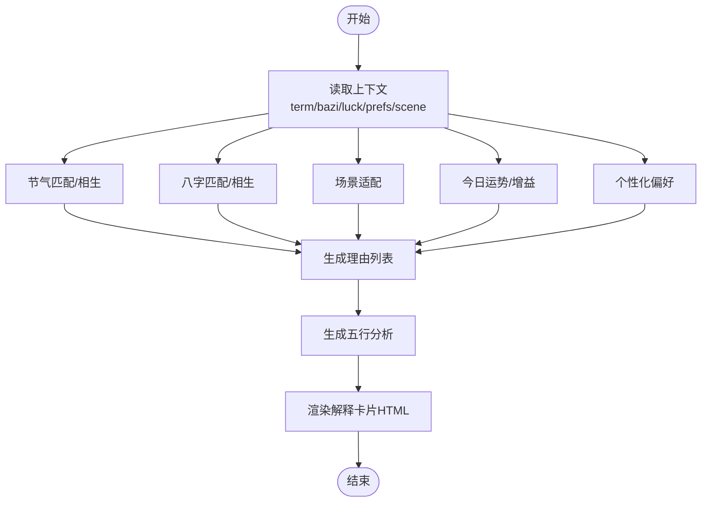
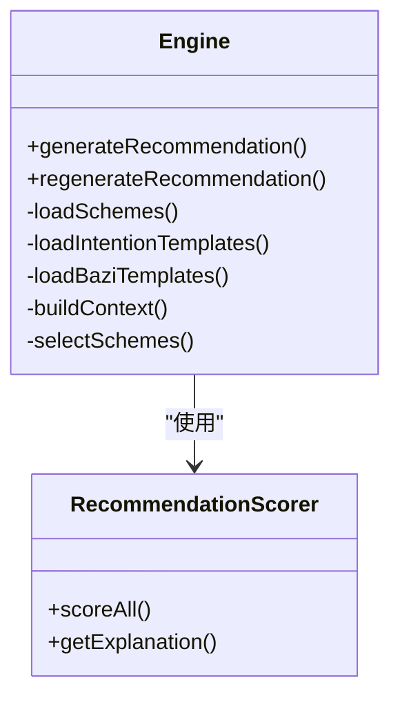
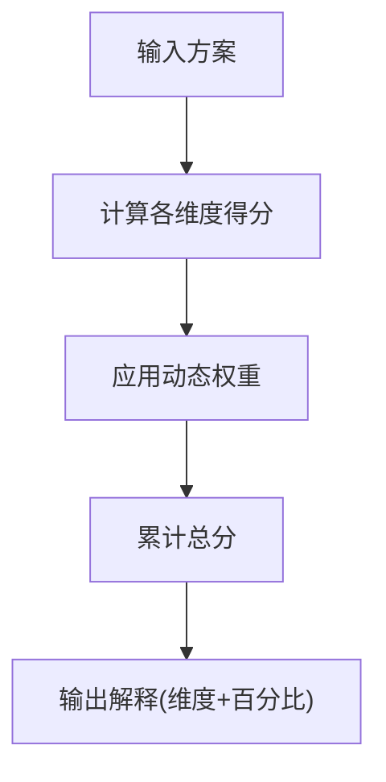
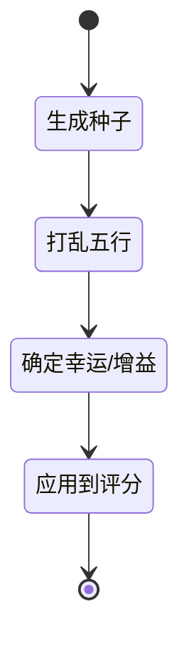
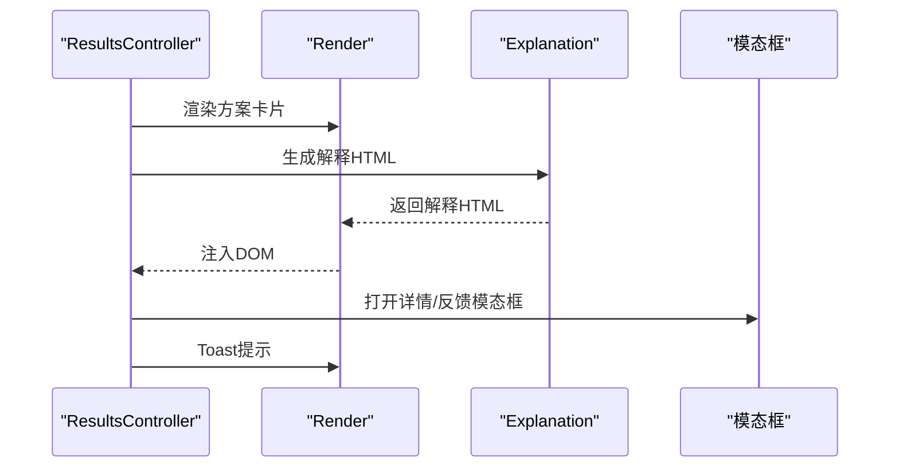
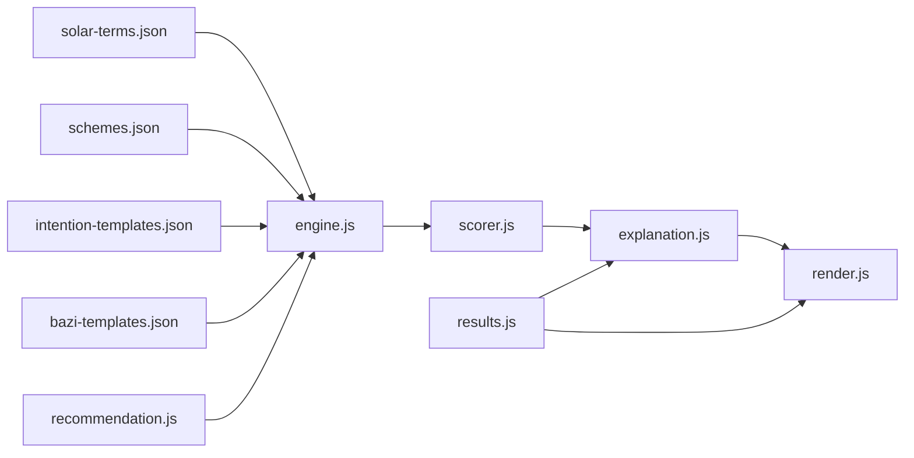

# 解释服务

<cite>
**本文引用的文件**
- [js/services/explanation.js](file://js/services/explanation.js)
- [js/services/engine.js](file://js/services/engine.js)
- [js/services/recommendation.js](file://js/services/recommendation.js)
- [js/core/scorer.js](file://js/core/scorer.js)
- [js/core/scoring-config.js](file://js/core/scoring-config.js)
- [js/utils/render.js](file://js/utils/render.js)
- [js/controllers/results.js](file://js/controllers/results.js)
- [data/schemes.json](file://data/schemes.json)
- [data/intention-templates.json](file://data/intention-templates.json)
- [data/bazi-templates.json](file://data/bazi-templates.json)
- [data/solar-terms.json](file://data/solar-terms.json)
</cite>

## 目录
1. [简介](#简介)
2. [项目结构](#项目结构)
3. [核心组件](#核心组件)
4. [架构总览](#架构总览)
5. [详细组件分析](#详细组件分析)
6. [依赖关系分析](#依赖关系分析)
7. [性能考量](#性能考量)
8. [故障排查指南](#故障排查指南)
9. [结论](#结论)
10. [附录](#附录)

## 简介
本文件面向“解释服务”的技术文档，聚焦于解释推荐结果的设计理念、生成机制与质量控制。解释服务围绕“为什么推荐某方案”这一核心目标，结合节气文化、五行理论、个人偏好与今日运势，构建可读性强、可追溯、可优化的解释体系。文档同时覆盖解释内容的生成逻辑、个性化解读、模板系统、动态内容与多语言支持策略，并提供示例与反馈机制说明，帮助开发者与产品人员理解与维护解释服务。

## 项目结构
解释服务位于前端模块化架构中，主要涉及以下层次：
- 数据层：方案、心愿模板、八字模板、节气元数据
- 服务层：解释服务、推荐引擎、评分器、运势与偏好
- 控制层：结果页控制器
- 工具层：渲染工具与模态框
- 视图层：HTML页面与组件

图表来源
- [js/services/explanation.js](file://js/services/explanation.js#L1-L298)
- [js/services/engine.js](file://js/services/engine.js#L1-L425)
- [js/services/recommendation.js](file://js/services/recommendation.js#L1-L466)
- [js/core/scorer.js](file://js/core/scorer.js#L1-L317)
- [js/core/scoring-config.js](file://js/core/scoring-config.js#L1-L128)
- [js/utils/render.js](file://js/utils/render.js#L1-L487)
- [js/controllers/results.js](file://js/controllers/results.js#L1-L614)
- [data/schemes.json](file://data/schemes.json#L1-L509)
- [data/intention-templates.json](file://data/intention-templates.json#L1-L493)
- [data/bazi-templates.json](file://data/bazi-templates.json#L1-L103)
- [data/solar-terms.json](file://data/solar-terms.json#L1-L42)

章节来源
- [js/services/explanation.js](file://js/services/explanation.js#L1-L298)
- [js/services/engine.js](file://js/services/engine.js#L1-L425)
- [js/services/recommendation.js](file://js/services/recommendation.js#L1-L466)
- [js/core/scorer.js](file://js/core/scorer.js#L1-L317)
- [js/core/scoring-config.js](file://js/core/scoring-config.js#L1-L128)
- [js/utils/render.js](file://js/utils/render.js#L1-L487)
- [js/controllers/results.js](file://js/controllers/results.js#L1-L614)
- [data/schemes.json](file://data/schemes.json#L1-L509)
- [data/intention-templates.json](file://data/intention-templates.json#L1-L493)
- [data/bazi-templates.json](file://data/bazi-templates.json#L1-L103)
- [data/solar-terms.json](file://data/solar-terms.json#L1-L42)

## 核心组件
- 解释生成器：负责生成“推荐理由”“五行分析”“分数解释”“解释卡片HTML”
- 推荐引擎：加载数据、构建上下文、选择方案、生成解释摘要
- 评分器：封装评分维度、权重、关系计算与解释输出
- 偏好与运势：用户偏好、今日运势、场景偏好、反馈闭环
- 渲染工具：模态框、解释卡片、详情页、Toast提示
- 结果页控制器：承载解释展示、收藏、分享、反馈交互

章节来源
- [js/services/explanation.js](file://js/services/explanation.js#L19-L111)
- [js/services/engine.js](file://js/services/engine.js#L323-L393)
- [js/core/scorer.js](file://js/core/scorer.js#L14-L75)
- [js/services/recommendation.js](file://js/services/recommendation.js#L124-L137)
- [js/utils/render.js](file://js/utils/render.js#L324-L365)
- [js/controllers/results.js](file://js/controllers/results.js#L360-L462)

## 架构总览
解释服务以“解释生成器”为核心，围绕“推荐引擎”产出的上下文与方案进行解释内容生成；“评分器”提供维度得分与解释；“偏好与运势”模块提供个性化与今日运势加成；“渲染工具”负责将解释内容可视化；“结果页控制器”串联交互与反馈。

图表来源
- [js/services/engine.js](file://js/services/engine.js#L323-L393)
- [js/core/scorer.js](file://js/core/scorer.js#L266-L276)
- [js/services/explanation.js](file://js/services/explanation.js#L218-L241)
- [js/utils/render.js](file://js/utils/render.js#L324-L365)
- [js/controllers/results.js](file://js/controllers/results.js#L394-L462)

## 详细组件分析

### 解释生成器（explanation.js）
- 推荐理由生成：依据节气五行、八字喜用、场景适配、今日运势、个性化偏好，生成多条解释条目，包含图标、标题与描述
- 五行分析：汇总当前节气、八字、今日运势的五行状态，形成“当前状态”雷达图
- 分数解释：将各维度得分与最大可能得分对比，生成百分比解释
- 解释卡片渲染：组合理由列表与雷达图，输出可直接插入DOM的HTML

图表来源
- [js/services/explanation.js](file://js/services/explanation.js#L25-L111)
- [js/services/explanation.js](file://js/services/explanation.js#L118-L151)
- [js/services/explanation.js](file://js/services/explanation.js#L159-L199)
- [js/services/explanation.js](file://js/services/explanation.js#L218-L241)

章节来源
- [js/services/explanation.js](file://js/services/explanation.js#L19-L111)
- [js/services/explanation.js](file://js/services/explanation.js#L118-L151)
- [js/services/explanation.js](file://js/services/explanation.js#L159-L199)
- [js/services/explanation.js](file://js/services/explanation.js#L218-L241)

### 推荐引擎（engine.js）
- 数据加载：异步加载方案、心愿模板、八字模板
- 上下文构建：整合节气、心愿、八字、天气、场景偏好、今日运势
- 方案选择：使用评分器批量评分，采用梯度策略（最佳匹配、保守替代、平衡方案、补充）
- 结果返回：包含解释摘要（分数与分解）

图表来源
- [js/services/engine.js](file://js/services/engine.js#L323-L393)
- [js/core/scorer.js](file://js/core/scorer.js#L266-L276)

章节来源
- [js/services/engine.js](file://js/services/engine.js#L60-L85)
- [js/services/engine.js](file://js/services/engine.js#L187-L212)
- [js/services/engine.js](file://js/services/engine.js#L218-L299)
- [js/services/engine.js](file://js/services/engine.js#L323-L393)

### 评分器与权重（scorer.js + scoring-config.js）
- 权重体系：基础维度（节气、八字、场景、天气、心愿）与加成维度（历史偏好、今日运势）
- 关系计算：基于“相生/相克/相同”关系映射到不同分数区间
- 动态权重：根据是否有八字、是否新用户调整权重分配
- 解释输出：按维度贡献排序，输出解释列表

图表来源
- [js/core/scorer.js](file://js/core/scorer.js#L29-L75)
- [js/core/scoring-config.js](file://js/core/scoring-config.js#L74-L92)
- [js/core/scoring-config.js](file://js/core/scoring-config.js#L120-L127)

章节来源
- [js/core/scorer.js](file://js/core/scorer.js#L14-L75)
- [js/core/scoring-config.js](file://js/core/scoring-config.js#L7-L19)
- [js/core/scoring-config.js](file://js/core/scoring-config.js#L74-L92)
- [js/core/scoring-config.js](file://js/core/scoring-config.js#L120-L127)

### 偏好与运势（recommendation.js）
- 今日运势：基于日期生成随机种子，打乱五行顺序，确定幸运/增益五行
- 用户偏好：收藏/采纳/不喜欢动作累积权重，驱动后续推荐
- 场景偏好：不同场景对五行与材质的偏好映射

图表来源
- [js/services/recommendation.js](file://js/services/recommendation.js#L93-L137)
- [js/services/recommendation.js](file://js/services/recommendation.js#L145-L184)
- [js/services/recommendation.js](file://js/services/recommendation.js#L61-L87)

章节来源
- [js/services/recommendation.js](file://js/services/recommendation.js#L93-L137)
- [js/services/recommendation.js](file://js/services/recommendation.js#L145-L184)
- [js/services/recommendation.js](file://js/services/recommendation.js#L61-L87)

### 渲染与交互（render.js + results.js）
- 解释卡片渲染：将解释HTML注入模态框或卡片区域
- 详情模态框：展示色彩、材质、感受、五行解读与典籍出处
- 结果页交互：收藏、分享、采纳/不喜欢反馈、Toast提示

图表来源
- [js/utils/render.js](file://js/utils/render.js#L324-L365)
- [js/utils/render.js](file://js/utils/render.js#L119-L132)
- [js/controllers/results.js](file://js/controllers/results.js#L394-L462)

章节来源
- [js/utils/render.js](file://js/utils/render.js#L324-L365)
- [js/utils/render.js](file://js/utils/render.js#L119-L132)
- [js/controllers/results.js](file://js/controllers/results.js#L394-L462)

## 依赖关系分析
- 数据依赖：方案、心愿模板、八字模板、节气元数据
- 服务依赖：解释生成器依赖推荐上下文；推荐引擎依赖评分器与偏好/运势；渲染依赖解释生成器
- 控制依赖：结果页控制器协调渲染与用户交互

图表来源
- [js/services/engine.js](file://js/services/engine.js#L60-L85)
- [js/core/scorer.js](file://js/core/scorer.js#L6-L12)
- [js/services/explanation.js](file://js/services/explanation.js#L6-L11)
- [js/utils/render.js](file://js/utils/render.js#L5-L8)
- [js/controllers/results.js](file://js/controllers/results.js#L5-L11)

章节来源
- [js/services/engine.js](file://js/services/engine.js#L60-L85)
- [js/core/scorer.js](file://js/core/scorer.js#L6-L12)
- [js/services/explanation.js](file://js/services/explanation.js#L6-L11)
- [js/utils/render.js](file://js/utils/render.js#L5-L8)
- [js/controllers/results.js](file://js/controllers/results.js#L5-L11)

## 性能考量
- 缓存与复用：评分器内部缓存计算结果，避免重复评分
- 异步加载：方案与模板异步加载，减少首屏阻塞
- 渲染优化：解释卡片按需展开，详情模态框延迟渲染
- 权重动态：根据用户画像调整权重，减少无效维度计算

章节来源
- [js/core/scorer.js](file://js/core/scorer.js#L20-L22)
- [js/services/engine.js](file://js/services/engine.js#L327-L331)
- [js/utils/render.js](file://js/utils/render.js#L304-L317)

## 故障排查指南
- 解释为空：确认上下文是否完整（节气、八字、运势、偏好、场景）
- 得分异常：检查权重配置与关系映射，核对动态权重调整逻辑
- 渲染问题：检查解释HTML生成与DOM注入流程，确认模态框开关逻辑
- 反馈未生效：检查本地存储键名与更新逻辑，确认采纳/不喜欢动作是否触发偏好更新

章节来源
- [js/services/explanation.js](file://js/services/explanation.js#L218-L241)
- [js/core/scoring-config.js](file://js/core/scoring-config.js#L74-L92)
- [js/utils/render.js](file://js/utils/render.js#L386-L403)
- [js/controllers/results.js](file://js/controllers/results.js#L464-L525)

## 结论
解释服务通过“解释生成器 + 推荐引擎 + 评分器 + 偏好/运势 + 渲染工具”的协同，实现了可解释、可追踪、可优化的推荐体验。其设计强调：
- 文化与科学并重：以节气、五行、八字、运势为依据，辅以个性化偏好
- 可解释性：多维度得分与解释卡片，帮助用户理解推荐逻辑
- 可扩展性：模板系统与动态权重，便于新增心愿、场景与文化元素
- 可维护性：模块职责清晰、依赖关系明确、错误处理与反馈闭环完善

## 附录

### 解释内容生成逻辑
- 五行理论解释：节气相生/相克、八字喜用/忌神、今日运势加成
- 节气文化说明：节气名称、五行属性、节气顺序与距离计算
- 个性化建议解读：偏好权重、历史反馈、场景适配

章节来源
- [js/services/explanation.js](file://js/services/explanation.js#L25-L111)
- [js/services/engine.js](file://js/services/engine.js#L89-L125)
- [js/services/recommendation.js](file://js/services/recommendation.js#L387-L417)

### 多语言支持机制
- 术语翻译：中文术语（木/火/土/金/水）与图标结合，保证跨语言一致性
- 表达优化：解释文案与文化典故结合，兼顾可读性与文化深度
- 文化适应：节气名称、心愿分类、场景偏好均体现中华传统文化语境

章节来源
- [js/services/explanation.js](file://js/services/explanation.js#L9-L17)
- [data/solar-terms.json](file://data/solar-terms.json#L1-L42)
- [data/intention-templates.json](file://data/intention-templates.json#L1-L493)

### 质量控制
- 准确性验证：关系映射与权重配置集中管理，避免硬编码偏差
- 一致性检查：解释卡片统一结构与图标规范，确保视觉一致
- 用户体验优化：解释折叠/展开、模态框交互、Toast提示与收藏/分享

章节来源
- [js/core/scoring-config.js](file://js/core/scoring-config.js#L21-L37)
- [js/utils/render.js](file://js/utils/render.js#L280-L299)
- [js/controllers/results.js](file://js/controllers/results.js#L394-L462)

### 解释模板系统与动态内容
- 模板来源：方案、心愿模板、八字模板、节气元数据
- 动态内容：根据上下文（节气、心愿、八字、天气、场景、运势）动态生成解释
- 个性化定制：用户偏好与反馈驱动权重调整，持续优化解释与推荐

章节来源
- [data/schemes.json](file://data/schemes.json#L1-L509)
- [data/intention-templates.json](file://data/intention-templates.json#L1-L493)
- [data/bazi-templates.json](file://data/bazi-templates.json#L1-L103)
- [js/services/engine.js](file://js/services/engine.js#L110-L158)

### 示例与文化背景
- 示例：方案色彩、材质、感受与注释，典籍出处
- 文化背景：节气、心愿、八字解读与五行典故

章节来源
- [data/schemes.json](file://data/schemes.json#L1-L509)
- [data/intention-templates.json](file://data/intention-templates.json#L1-L493)
- [data/bazi-templates.json](file://data/bazi-templates.json#L1-L103)
- [data/solar-terms.json](file://data/solar-terms.json#L1-L42)

### 用户反馈收集机制
- 采纳/不喜欢：记录动作与原因，更新偏好权重
- 本地存储：反馈与偏好持久化，限制数量避免膨胀
- 交互提示：Toast反馈与按钮状态变更

章节来源
- [js/controllers/results.js](file://js/controllers/results.js#L394-L462)
- [js/controllers/results.js](file://js/controllers/results.js#L464-L525)