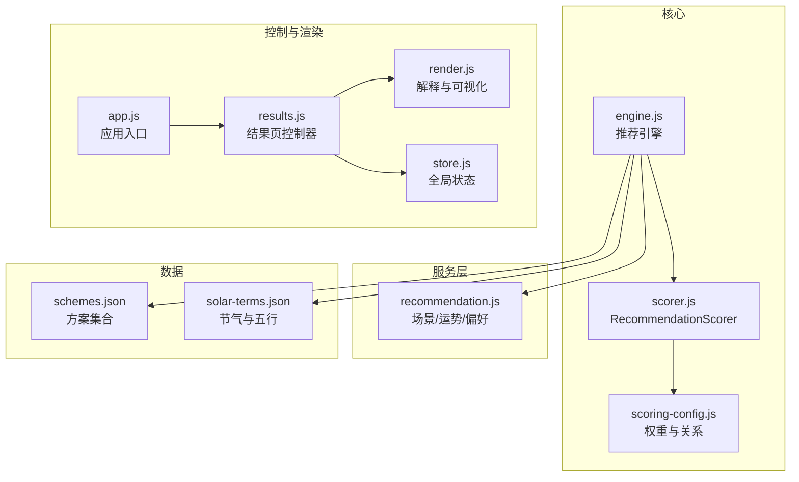
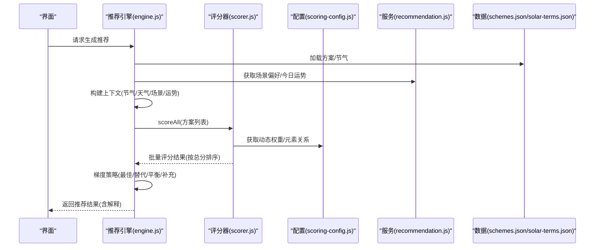
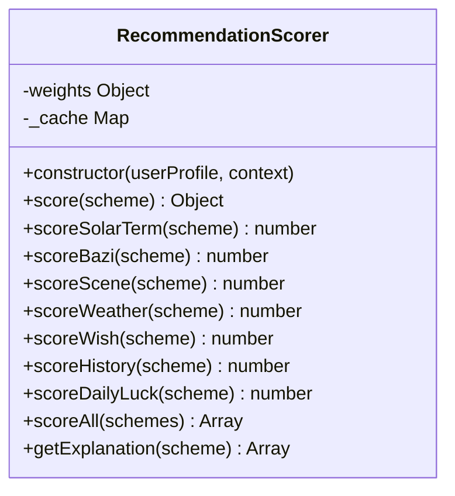
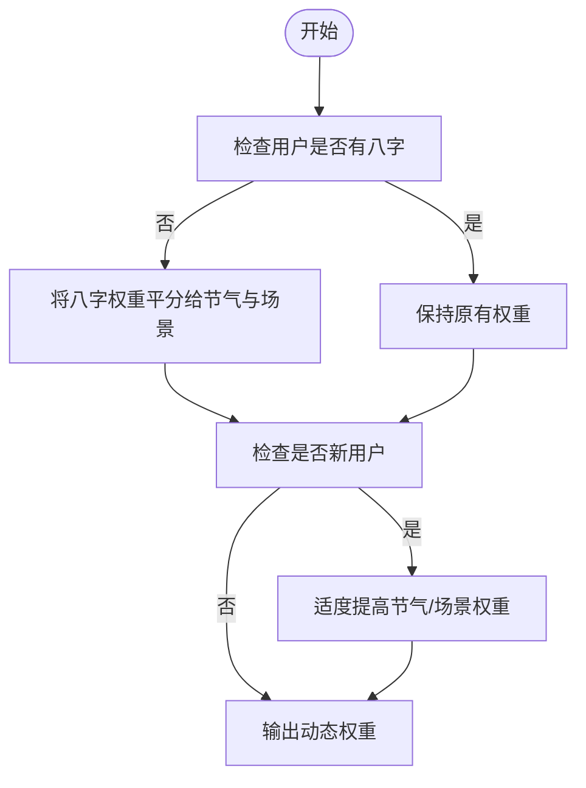
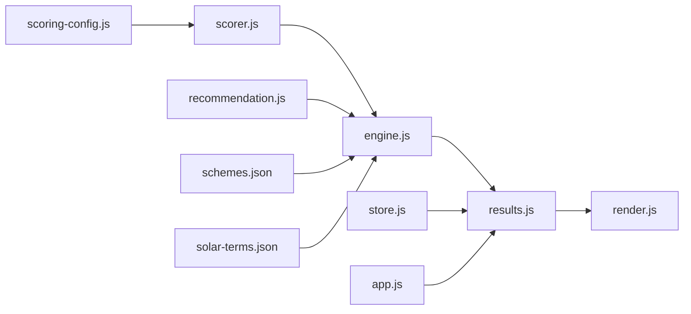

# 评分系统

<cite>
**本文引用的文件**
- [scorer.js](file://js/core/scorer.js)
- [scoring-config.js](file://js/core/scoring-config.js)
- [engine.js](file://js/services/engine.js)
- [recommendation.js](file://js/services/recommendation.js)
- [schemes.json](file://data/schemes.json)
- [solar-terms.json](file://data/solar-terms.json)
- [results.js](file://js/controllers/results.js)
- [render.js](file://js/utils/render.js)
- [store.js](file://js/core/store.js)
- [app.js](file://js/core/app.js)
</cite>

## 目录
1. [简介](#简介)
2. [项目结构](#项目结构)
3. [核心组件](#核心组件)
4. [架构总览](#架构总览)
5. [详细组件分析](#详细组件分析)
6. [依赖分析](#依赖分析)
7. [性能考虑](#性能考虑)
8. [故障排查指南](#故障排查指南)
9. [结论](#结论)
10. [附录](#附录)

## 简介
本文件面向“评分系统”的技术文档，聚焦 RecommendationScorer 类的实现原理与扩展点，系统解析评分算法、权重计算机制、分数聚合策略，以及与 ScoringConfig 评分配置体系的协作方式。同时覆盖多维度评分指标设计（节气适配度、八字匹配度、天气兼容性、个人偏好权重、心愿契合度、历史偏好加成、今日运势）、性能优化（缓存、批量评分、随机种子与多样性）、调试与监控方法，以及在实际业务场景中的应用与落地。

## 项目结构
评分系统位于前端模块化工程中，核心文件分布如下：
- 核心评分器：js/core/scorer.js
- 评分配置与权重：js/core/scoring-config.js
- 推荐引擎：js/services/engine.js（组合评分器与上下文）
- 场景与运势：js/services/recommendation.js（场景偏好、今日运势、用户偏好）
- 数据源：data/schemes.json（方案集合）、data/solar-terms.json（节气与五行）
- 控制器与渲染：js/controllers/results.js、js/utils/render.js
- 全局状态：js/core/store.js
- 应用入口：js/core/app.js

图表来源
- [scorer.js](file://js/core/scorer.js#L1-L317)
- [scoring-config.js](file://js/core/scoring-config.js#L1-L128)
- [engine.js](file://js/services/engine.js#L1-L425)
- [recommendation.js](file://js/services/recommendation.js#L1-L466)
- [schemes.json](file://data/schemes.json#L1-L509)
- [solar-terms.json](file://data/solar-terms.json#L1-L42)
- [results.js](file://js/controllers/results.js#L1-L614)
- [render.js](file://js/utils/render.js#L220-L284)
- [store.js](file://js/core/store.js#L1-L212)
- [app.js](file://js/core/app.js#L1-L206)

章节来源
- [scorer.js](file://js/core/scorer.js#L1-L317)
- [scoring-config.js](file://js/core/scoring-config.js#L1-L128)
- [engine.js](file://js/services/engine.js#L1-L425)
- [recommendation.js](file://js/services/recommendation.js#L1-L466)
- [schemes.json](file://data/schemes.json#L1-L509)
- [solar-terms.json](file://data/solar-terms.json#L1-L42)
- [results.js](file://js/controllers/results.js#L1-L614)
- [render.js](file://js/utils/render.js#L220-L284)
- [store.js](file://js/core/store.js#L1-L212)
- [app.js](file://js/core/app.js#L1-L206)

## 核心组件
- RecommendationScorer：封装评分算法与聚合策略，支持缓存、批量评分与解释生成。
- ScoringConfig：提供基础权重、五行相生相克关系、动态权重调整、元素关系得分计算。
- 推荐引擎（engine.js）：整合数据、构建上下文、调用评分器、执行梯度推荐策略。
- 场景与运势（recommendation.js）：场景偏好、今日运势随机因子、用户偏好持久化与个性化得分。
- 数据源（schemes.json、solar-terms.json）：方案与节气的结构化数据。
- 控制器与渲染（results.js、render.js）：展示推荐结果、解释与交互。
- 全局状态（store.js）：统一的状态管理与订阅通知。

章节来源
- [scorer.js](file://js/core/scorer.js#L14-L317)
- [scoring-config.js](file://js/core/scoring-config.js#L6-L128)
- [engine.js](file://js/services/engine.js#L218-L399)
- [recommendation.js](file://js/services/recommendation.js#L32-L137)
- [schemes.json](file://data/schemes.json#L1-L509)
- [solar-terms.json](file://data/solar-terms.json#L1-L42)
- [results.js](file://js/controllers/results.js#L1-L614)
- [render.js](file://js/utils/render.js#L220-L284)
- [store.js](file://js/core/store.js#L30-L187)

## 架构总览
评分系统采用“配置驱动 + 评分器 + 引擎 + 服务层 + 数据源”的分层架构：
- 配置层：权重、关系、等级阈值集中管理，支持动态权重调整。
- 评分器层：独立的评分器类，负责各维度评分与聚合，具备缓存与解释能力。
- 引擎层：组装上下文、加载数据、调用评分器、执行梯度策略。
- 服务层：场景偏好、运势随机、用户偏好、天气联动。
- 数据层：方案与节气数据，支撑评分与解释。

图表来源
- [engine.js](file://js/services/engine.js#L323-L393)
- [scorer.js](file://js/core/scorer.js#L266-L276)
- [scoring-config.js](file://js/core/scoring-config.js#L74-L92)
- [recommendation.js](file://js/services/recommendation.js#L18-L137)
- [schemes.json](file://data/schemes.json#L1-L509)
- [solar-terms.json](file://data/solar-terms.json#L1-L42)

## 详细组件分析

### RecommendationScorer 类
- 职责：对单个方案进行多维度评分，聚合为总分；支持批量评分、缓存、解释生成。
- 关键方法：
  - score(scheme)：计算单个方案的总分与分项明细，使用 Map 缓存避免重复计算。
  - scoreSolarTerm/scoreBazi/scoreScene/scoreWeather/scoreWish/scoreHistory/scoreDailyLuck：各维度评分。
  - scoreAll(schemes)：批量评分并按总分降序排列。
  - getExplanation(scheme)：提取得分最高的维度及其占比，形成推荐理由。
- 缓存策略：以方案 id 为键，缓存单次评分结果，适用于重复渲染同一方案的场景。

图表来源
- [scorer.js](file://js/core/scorer.js#L14-L317)

章节来源
- [scorer.js](file://js/core/scorer.js#L14-L317)

### ScoringConfig 评分配置系统
- 基础权重（base）：节气匹配 25%、八字匹配 20%、场景适配 20%、天气联动 15%、心愿契合 15%。
- 奖励权重（bonus）：历史偏好 10%、今日运势 5%。
- 动态权重：若用户无八字，则将 bazi 权重平分给节气与场景；新用户适度提高节气与场景权重。
- 五行关系：相生、相克、相等、相控（反生）对应不同得分等级。
- 关键函数：
  - getDynamicWeights(userProfile)：返回动态权重。
  - getElementRelationScore(source, target)：返回 0-100 的关系得分。
  - isGenerating/isControlling：判断相生/相克。

图表来源
- [scoring-config.js](file://js/core/scoring-config.js#L74-L92)

章节来源
- [scoring-config.js](file://js/core/scoring-config.js#L6-L128)

### 多维度评分指标设计
- 节气适配度（solarTerm）：方案颜色五行与当前节气五行的关系得分，乘以节气权重。
- 八字匹配度（bazi）：若用户有八字，方案五行与“喜用神”完全一致得满分；与“忌神”一致扣分；相生关系加分；其他情况中等分。
- 场景适配度（scene）：根据场景偏好（五行与材质）匹配度加分，日常场景默认中等。
- 天气兼容性（weather）：天气五行能量场与方案五行的关系得分；温度调候（相克加分）；材质实用性加分。
- 心愿契合度（wish）：结合心愿模板（按节气距离选择最佳模板）进行契合度评分。
- 个人偏好权重（history）：基于用户历史偏好（五行、颜色、材质）归一化后加成。
- 今日运势（dailyLuck）：随机种子决定幸运/增益五行，方案命中相应五行加分。

章节来源
- [scorer.js](file://js/core/scorer.js#L45-L62)
- [scorer.js](file://js/core/scorer.js#L77-L193)
- [scorer.js](file://js/core/scorer.js#L195-L210)
- [scorer.js](file://js/core/scorer.js#L212-L237)
- [scorer.js](file://js/core/scorer.js#L242-L259)
- [recommendation.js](file://js/services/recommendation.js#L61-L87)
- [recommendation.js](file://js/services/recommendation.js#L93-L137)

### 评分公式与聚合策略
- 单方案总分 = Σ(各维度得分)，其中各维度得分 = 维度基础分 × 对应权重。
- 奖励维度（历史偏好、今日运势）可使总分突破 100。
- 解释生成：取得分最高的前三个维度，计算其占总分的百分比，用于前端展示“推荐理由”。

章节来源
- [scorer.js](file://js/core/scorer.js#L29-L75)
- [scorer.js](file://js/core/scorer.js#L283-L313)

### 推荐引擎与梯度策略
- 引擎负责加载数据、构建上下文、调用评分器、执行梯度策略：
  - 最佳匹配：取最高分方案。
  - 保守替代：同五行但不同方案，保证风格多样性。
  - 平衡方案：不同五行，优先选择与节气五行相克或不同的方案，平衡能量。
  - 补充方案：补齐数量，优先高分且未重复的方案。
- 今日运势随机因子：为方案增加轻微随机扰动，提升推荐多样性。

章节来源
- [engine.js](file://js/services/engine.js#L218-L299)
- [engine.js](file://js/services/engine.js#L323-L393)
- [recommendation.js](file://js/services/recommendation.js#L93-L137)

### 数据模型与示例
- 方案（schemes.json）：包含 id、termId、rank、颜色（名称/十六进制/五行）、材质、感觉、注释与出处。
- 节气（solar-terms.json）：包含节气 id、名称、五行、月份与日期范围、季节分组与名称映射。

章节来源
- [schemes.json](file://data/schemes.json#L1-L509)
- [solar-terms.json](file://data/solar-terms.json#L1-L42)

## 依赖分析
- RecommendationScorer 依赖 ScoringConfig 提供权重与关系函数。
- 推荐引擎依赖 RecommendationScorer、ScoringConfig、recommendation.js、数据文件。
- 控制器与渲染依赖 store 与 render 工具，用于展示解释与交互。
- app.js 负责路由与视图加载，协调控制器生命周期。

图表来源
- [scoring-config.js](file://js/core/scoring-config.js#L6-L12)
- [scorer.js](file://js/core/scorer.js#L6-L12)
- [engine.js](file://js/services/engine.js#L7-L9)
- [recommendation.js](file://js/services/recommendation.js#L1-L29)
- [schemes.json](file://data/schemes.json#L1-L509)
- [solar-terms.json](file://data/solar-terms.json#L1-L42)
- [results.js](file://js/controllers/results.js#L1-L614)
- [render.js](file://js/utils/render.js#L220-L284)
- [store.js](file://js/core/store.js#L30-L187)
- [app.js](file://js/core/app.js#L1-L206)

章节来源
- [scoring-config.js](file://js/core/scoring-config.js#L6-L12)
- [scorer.js](file://js/core/scorer.js#L6-L12)
- [engine.js](file://js/services/engine.js#L7-L9)
- [recommendation.js](file://js/services/recommendation.js#L1-L29)
- [results.js](file://js/controllers/results.js#L1-L614)
- [render.js](file://js/utils/render.js#L220-L284)
- [store.js](file://js/core/store.js#L30-L187)
- [app.js](file://js/core/app.js#L1-L206)

## 性能考虑
- 缓存策略：RecommendationScorer 内部使用 Map 缓存单方案评分结果，避免重复计算。
- 批量评分：scoreAll 使用 map + sort，时间复杂度 O(n log n)，适合中等规模方案集。
- 动态权重：getDynamicWeights 在构造时计算一次，避免运行时重复计算。
- 随机因子：今日运势使用基于日期的种子生成伪随机序列，避免每次刷新都产生巨大波动。
- 数据加载：推荐引擎异步加载数据，Promise.all 并行请求，减少等待时间。
- 前端渲染：解释生成仅在需要时计算，且限制展示维度数量，降低 DOM 渲染压力。

章节来源
- [scorer.js](file://js/core/scorer.js#L20-L33)
- [scorer.js](file://js/core/scorer.js#L266-L276)
- [scoring-config.js](file://js/core/scoring-config.js#L74-L92)
- [engine.js](file://js/services/engine.js#L327-L331)
- [recommendation.js](file://js/services/recommendation.js#L93-L137)
- [render.js](file://js/utils/render.js#L220-L284)

## 故障排查指南
- 评分异常或不稳定
  - 检查上下文是否正确构建（节气、天气、场景、运势、意图模板）。
  - 确认动态权重是否按预期生效（无八字时 bazi 权重分配）。
  - 核对元素关系得分函数是否返回合理区间。
- 缓存导致旧结果
  - 清空 RecommendationScorer 的缓存 Map，或在上下文变更时重建评分器实例。
- 个性化偏好未生效
  - 检查用户偏好存储与读取流程，确认权重更新逻辑。
- 解释不显示或不准确
  - 确认方案对象包含 _score 与 _breakdown 字段（由引擎注入）。
  - 检查 render.js 中解释生成逻辑与维度权重映射。

章节来源
- [scorer.js](file://js/core/scorer.js#L29-L75)
- [engine.js](file://js/services/engine.js#L218-L299)
- [recommendation.js](file://js/services/recommendation.js#L192-L218)
- [render.js](file://js/utils/render.js#L220-L284)

## 结论
本评分系统以 RecommendationScorer 为核心，结合 ScoringConfig 的权重与关系规则，实现了多维度、可配置、可解释的智能评分。通过动态权重、缓存、批量评分与梯度策略，系统在准确性与性能之间取得平衡。配合场景偏好、今日运势与用户偏好，能够为用户提供既符合传统命理又贴近现实情境的穿搭推荐。

## 附录

### 数学表达与权重矩阵
- 单方案总分：T = Σ(维度得分)，维度得分 = 基础分 × 权重。
- 动态权重：若无八字，bazi 权重平分给 solarTerm 与 scene；新用户适度提高 solarTerm 与 scene 权重。
- 五行关系得分：相等 100，相生 80，目标被生 60，相克 40，目标克我 20，否则 0。
- 今日运势：随机种子决定 luckyWuxing 与 boostWuxing，命中加分。

章节来源
- [scorer.js](file://js/core/scorer.js#L29-L75)
- [scoring-config.js](file://js/core/scoring-config.js#L74-L92)
- [scoring-config.js](file://js/core/scoring-config.js#L120-L127)
- [recommendation.js](file://js/services/recommendation.js#L93-L137)

### 实际应用场景
- 节气节气切换：依据节气五行调整推荐，强调与节气能量的协同。
- 八字命理：结合喜用神与忌神，提供正向与负向引导。
- 天气联动：根据天气五行与温度等级，推荐调候与实用材质。
- 场景适配：针对工作、约会、聚会等场景，匹配五行与材质偏好。
- 心愿契合：通过心愿模板与节气距离，提升契合度评分。
- 个性化与多样性：历史偏好加成与梯度策略，兼顾偏好与多样性。

章节来源
- [engine.js](file://js/services/engine.js#L218-L299)
- [recommendation.js](file://js/services/recommendation.js#L61-L87)
- [recommendation.js](file://js/services/recommendation.js#L18-L137)
- [schemes.json](file://data/schemes.json#L1-L509)
- [solar-terms.json](file://data/solar-terms.json#L1-L42)