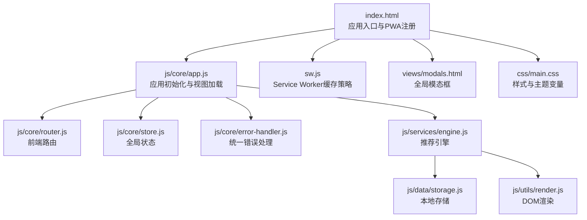
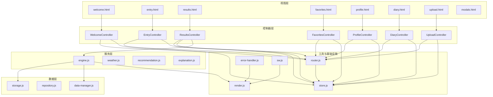
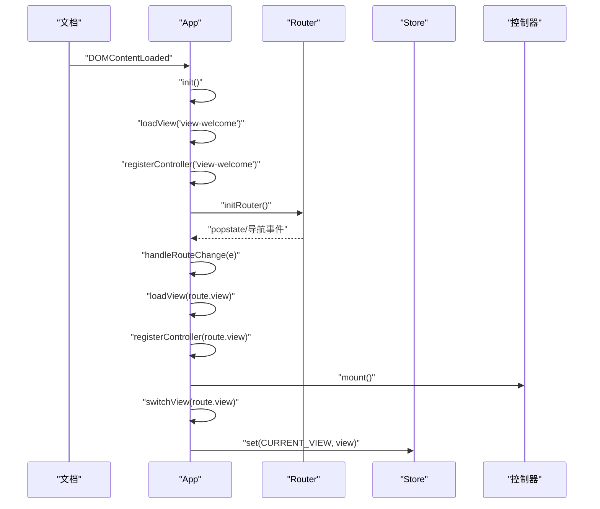
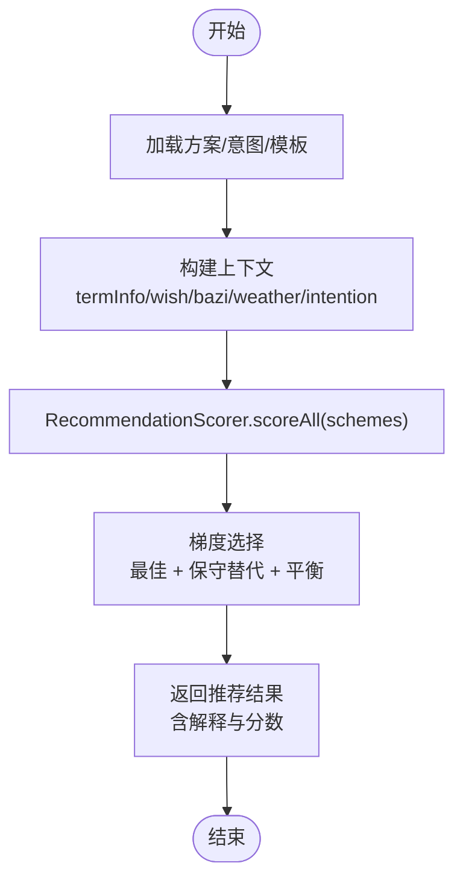
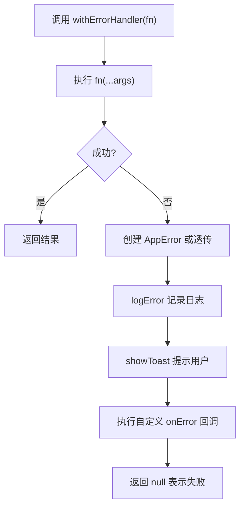
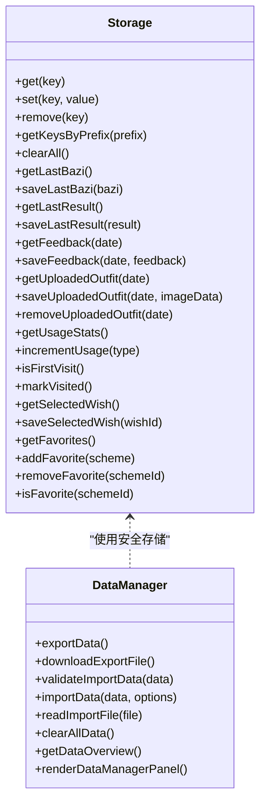
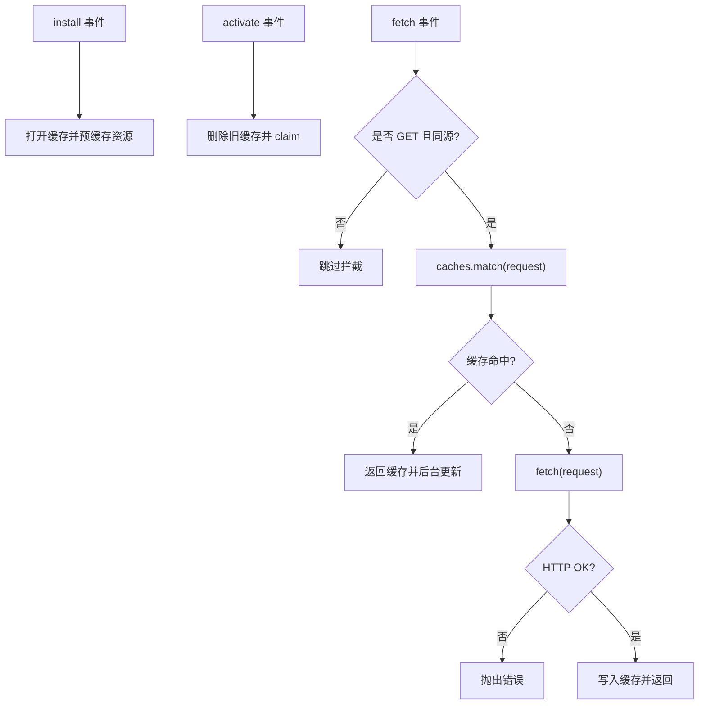
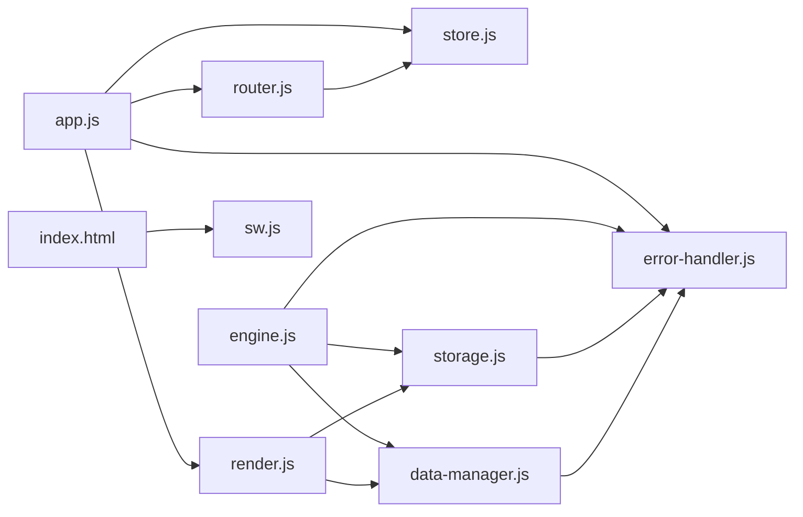

# 故障排除与常见问题

<cite>
**本文引用的文件**   
- [index.html](file://index.html)
- [sw.js](file://sw.js)
- [app.js](file://js/core/app.js)
- [router.js](file://js/core/router.js)
- [error-handler.js](file://js/core/error-handler.js)
- [store.js](file://js/core/store.js)
- [storage.js](file://js/data/storage.js)
- [data-manager.js](file://js/data/data-manager.js)
- [engine.js](file://js/services/engine.js)
- [render.js](file://js/utils/render.js)
- [modals.html](file://views/modals.html)
- [main.css](file://css/main.css)
</cite>

## 目录
1. [简介](#简介)
2. [项目结构](#项目结构)
3. [核心组件](#核心组件)
4. [架构总览](#架构总览)
5. [详细组件分析](#详细组件分析)
6. [依赖分析](#依赖分析)
7. [性能考虑](#性能考虑)
8. [故障排除指南](#故障排除指南)
9. [结论](#结论)
10. [附录](#附录)

## 简介
本文件面向“五行穿搭建议”项目的用户与开发者，提供系统化的故障排除与常见问题解决方案。内容涵盖：
- JavaScript 错误与异常处理
- 网络请求失败与缓存策略
- 存储权限与本地数据异常
- PWA 功能异常与离线体验
- 数据加载失败、存储异常与数据同步问题
- 性能问题诊断与优化
- 用户界面显示与交互问题
- 调试工具与日志分析方法
- 社区支持与问题反馈渠道

## 项目结构
该项目采用模块化前端架构，核心由应用入口、路由系统、全局状态、服务层、数据层与工具层组成，并通过 Service Worker 提供 PWA 能力。

**图表来源**
- [index.html](file://index.html#L58-L76)
- [app.js](file://js/core/app.js#L1-L206)
- [router.js](file://js/core/router.js#L1-L142)
- [store.js](file://js/core/store.js#L1-L212)
- [error-handler.js](file://js/core/error-handler.js#L1-L190)
- [engine.js](file://js/services/engine.js#L1-L425)
- [storage.js](file://js/data/storage.js#L1-L145)
- [render.js](file://js/utils/render.js#L1-L487)
- [sw.js](file://sw.js#L1-L165)
- [modals.html](file://views/modals.html#L1-L18)
- [main.css](file://css/main.css#L1-L200)

**章节来源**
- [index.html](file://index.html#L1-L79)
- [app.js](file://js/core/app.js#L1-L206)
- [router.js](file://js/core/router.js#L1-L142)
- [store.js](file://js/core/store.js#L1-L212)
- [error-handler.js](file://js/core/error-handler.js#L1-L190)
- [engine.js](file://js/services/engine.js#L1-L425)
- [storage.js](file://js/data/storage.js#L1-L145)
- [render.js](file://js/utils/render.js#L1-L487)
- [sw.js](file://sw.js#L1-L165)
- [modals.html](file://views/modals.html#L1-L18)
- [main.css](file://css/main.css#L1-L200)

## 核心组件
- 应用入口与生命周期：负责初始化、视图预加载、路由与控制器注册、基础数据加载与统计。
- 路由系统：支持浏览器前进后退、URL 同步、链接拦截与导航。
- 全局状态：集中管理节气、用户输入、推荐结果、收藏、UI 状态等。
- 错误处理：统一包装 fetch、JSON 解析、存储操作，提供用户提示与日志记录。
- 推荐引擎：加载数据、构建上下文、评分与梯度推荐、天气与运势集成。
- 本地存储：封装 localStorage，提供业务方法与安全存储包装。
- 数据管理：导出/导入/清空本地数据，支持预览与合并。
- 渲染工具：视图切换、卡片渲染、模态框、Toast、解释卡等。
- PWA 与缓存：Service Worker 预缓存、激活清理、缓存优先策略与后台更新。

**章节来源**
- [app.js](file://js/core/app.js#L1-L206)
- [router.js](file://js/core/router.js#L1-L142)
- [store.js](file://js/core/store.js#L1-L212)
- [error-handler.js](file://js/core/error-handler.js#L1-L190)
- [engine.js](file://js/services/engine.js#L1-L425)
- [storage.js](file://js/data/storage.js#L1-L145)
- [data-manager.js](file://js/data/data-manager.js#L1-L376)
- [render.js](file://js/utils/render.js#L1-L487)
- [sw.js](file://sw.js#L1-L165)

## 架构总览
应用采用 MVC 风格的模块化组织：控制器负责视图交互，服务层负责业务逻辑，数据层负责数据访问与持久化，工具层提供通用能力，路由与状态管理贯穿全局。

**图表来源**
- [app.js](file://js/core/app.js#L23-L31)
- [router.js](file://js/core/router.js#L9-L17)
- [engine.js](file://js/services/engine.js#L1-L425)
- [storage.js](file://js/data/storage.js#L1-L145)
- [data-manager.js](file://js/data/data-manager.js#L1-L376)
- [render.js](file://js/utils/render.js#L1-L487)
- [sw.js](file://sw.js#L1-L165)

## 详细组件分析

### 应用初始化与路由切换流程
应用在 DOMContentLoaded 时初始化，注册全局错误处理器，预加载首屏视图，注册控制器，监听路由变化并进行视图切换与控制器挂载。

**图表来源**
- [app.js](file://js/core/app.js#L47-L193)
- [router.js](file://js/core/router.js#L25-L79)
- [store.js](file://js/core/store.js#L79-L81)

**章节来源**
- [app.js](file://js/core/app.js#L47-L193)
- [router.js](file://js/core/router.js#L25-L79)
- [store.js](file://js/core/store.js#L79-L81)

### 推荐引擎评分与梯度推荐
引擎加载方案、意图与八字模板，构建上下文（含节气、天气、运势、场景偏好），使用评分器批量评分并按策略选择最佳、替代与平衡方案。

**图表来源**
- [engine.js](file://js/services/engine.js#L323-L393)

**章节来源**
- [engine.js](file://js/services/engine.js#L323-L393)

### 统一错误处理与安全包装
错误处理模块提供：
- 错误类型枚举与用户友好消息映射
- withErrorHandler 包装异步函数，统一捕获与日志记录
- safeFetch 超时控制与 HTTP 状态判断
- safeJsonParse JSON 解析保护
- safeStorage 存储异常兜底
- 全局未处理 Promise 与错误监听

**图表来源**
- [error-handler.js](file://js/core/error-handler.js#L45-L79)

**章节来源**
- [error-handler.js](file://js/core/error-handler.js#L1-L190)

### 本地存储与数据管理
- storage.js 封装 localStorage，提供业务方法与安全包装
- data-manager.js 支持导出/导入/清空数据，验证版本与结构，预览导入内容
- 支持按前缀查询、统计大小与生成数据管理面板

**图表来源**
- [storage.js](file://js/data/storage.js#L1-L145)
- [data-manager.js](file://js/data/data-manager.js#L1-L376)

**章节来源**
- [storage.js](file://js/data/storage.js#L1-L145)
- [data-manager.js](file://js/data/data-manager.js#L1-L376)

### PWA 缓存策略与离线体验
Service Worker 采用预缓存 + 缓存优先策略，对 GET 请求进行拦截，命中缓存直接返回并后台更新；未命中则网络请求，成功后写入缓存；非同源请求跳过拦截；安装/激活阶段清理旧缓存并声明接管。

**图表来源**
- [sw.js](file://sw.js#L52-L155)

**章节来源**
- [sw.js](file://sw.js#L1-L165)

## 依赖分析
- app.js 依赖 router、store、error-handler、solar-terms、repository、render 等模块，负责应用生命周期与视图协调。
- router.js 依赖 store，负责路由配置、历史记录与事件派发。
- error-handler.js 被多处模块调用，提供统一错误处理与安全包装。
- engine.js 依赖 error-handler、scorer、recommendation、weather 等，负责推荐主流程。
- storage.js 依赖 error-handler 的安全存储包装。
- data-manager.js 依赖 storage 与 error-handler，提供数据导出/导入能力。
- render.js 依赖 storage、explanation、profile、data-manager，负责 UI 渲染与交互。
- sw.js 与 index.html 的 PWA 注册配合，提供缓存与离线能力。

**图表来源**
- [app.js](file://js/core/app.js#L6-L11)
- [router.js](file://js/core/router.js#L6-L7)
- [engine.js](file://js/services/engine.js#L6-L9)
- [storage.js](file://js/data/storage.js#L5-L5)
- [data-manager.js](file://js/data/data-manager.js#L6-L6)
- [render.js](file://js/utils/render.js#L5-L8)
- [index.html](file://index.html#L64-L76)

**章节来源**
- [app.js](file://js/core/app.js#L6-L11)
- [router.js](file://js/core/router.js#L6-L7)
- [engine.js](file://js/services/engine.js#L6-L9)
- [storage.js](file://js/data/storage.js#L5-L5)
- [data-manager.js](file://js/data/data-manager.js#L6-L6)
- [render.js](file://js/utils/render.js#L5-L8)
- [index.html](file://index.html#L64-L76)

## 性能考虑
- 预加载与懒加载：首屏预加载欢迎与入口视图，其他视图按需加载，减少初始负载。
- 缓存优先策略：Service Worker 预缓存静态资源与数据文件，显著降低二次加载时间。
- 渐进增强：未命中缓存时回退网络请求并写入缓存，保证可用性。
- DOM 渲染优化：卡片动画延迟逐个触发，避免一次性大量重排；解释卡折叠展示，减少初始渲染压力。
- 状态驱动：通过 store 精准更新 UI，避免不必要的重绘。

[本节为通用性能指导，无需特定文件来源]

## 故障排除指南

### 一、JavaScript 错误与异常处理
- 症状
  - 页面报错、功能不可用、控制台出现异常堆栈
- 常见原因
  - 未捕获的 Promise 拒绝、语法错误、模块导入失败、运行时异常
- 解决步骤
  - 打开浏览器开发者工具，查看 Console 标签的错误堆栈
  - 在全局错误处理器中确认是否被拦截与提示（[error-handler.js](file://js/core/error-handler.js#L168-L189)）
  - 使用 withErrorHandler 包装关键异步函数，确保错误被捕获与记录（[error-handler.js](file://js/core/error-handler.js#L45-L79)）
  - 检查模块导入路径与命名导出是否一致（[app.js](file://js/core/app.js#L14-L21)）
- 预防措施
  - 对所有异步调用使用安全包装
  - 在开发阶段开启严格模式与 ESLint 规则
  - 对外部接口调用增加超时与重试机制

**章节来源**
- [error-handler.js](file://js/core/error-handler.js#L168-L189)
- [error-handler.js](file://js/core/error-handler.js#L45-L79)
- [app.js](file://js/core/app.js#L14-L21)

### 二、网络请求失败
- 症状
  - 数据加载失败、推荐结果为空、天气/运势不可用
- 常见原因
  - 网络中断、跨域限制、服务器错误、请求超时
- 解决步骤
  - 使用 Network 标签检查请求状态码与响应头
  - 确认 safeFetch 的超时与错误类型映射（[error-handler.js](file://js/core/error-handler.js#L101-L133)）
  - 检查 Service Worker 是否拦截了非同源字体请求（[sw.js](file://sw.js#L108-L110)）
  - 若为跨域字体，确认 CDN 预连接与跨域头设置（[index.html](file://index.html#L10-L11)）
- 预防措施
  - 为关键请求设置合理超时与降级策略
  - 对静态资源与数据文件进行预缓存（[sw.js](file://sw.js#L8-L47)）

**章节来源**
- [error-handler.js](file://js/core/error-handler.js#L101-L133)
- [sw.js](file://sw.js#L108-L110)
- [index.html](file://index.html#L10-L11)

### 三、存储权限问题与本地数据异常
- 症状
  - 无法保存/读取数据、收藏失效、偏好丢失、隐私模式下异常
- 常见原因
  - 浏览器禁用本地存储、存储空间不足、隐私模式限制
- 解决步骤
  - 在应用内调用安全存储包装（[storage.js](file://js/data/storage.js#L5-L5)）
  - 检查安全存储捕获的异常类型（[error-handler.js](file://js/core/error-handler.js#L153-L163)）
  - 使用数据管理功能导出备份，确认数据完整性（[data-manager.js](file://js/data/data-manager.js#L48-L99)）
  - 清理无效数据或迁移至新设备（[data-manager.js](file://js/data/data-manager.js#L225-L229)）
- 预防措施
  - 定期导出备份，避免单点故障
  - 对存储操作进行健壮性校验与降级提示

**章节来源**
- [storage.js](file://js/data/storage.js#L5-L5)
- [error-handler.js](file://js/core/error-handler.js#L153-L163)
- [data-manager.js](file://js/data/data-manager.js#L48-L99)
- [data-manager.js](file://js/data/data-manager.js#L225-L229)

### 四、PWA 功能异常（离线/缓存）
- 症状
  - 刷新后白屏、资源 404、离线不可用
- 常见原因
  - Service Worker 未注册、缓存未命中、旧缓存未清理
- 解决步骤
  - 检查 PWA 注册脚本与作用域（[index.html](file://index.html#L64-L76)）
  - 在 Application/Service Workers 标签确认注册状态与作用域
  - 清理浏览器缓存与旧缓存组，等待激活完成（[sw.js](file://sw.js#L74-L94)）
  - 核对预缓存清单与实际资源路径（[sw.js](file://sw.js#L8-L47)）
- 预防措施
  - 修改资源路径时同步更新预缓存清单
  - 发布新版本时更新缓存版本号（[sw.js](file://sw.js#L5)）

**章节来源**
- [index.html](file://index.html#L64-L76)
- [sw.js](file://sw.js#L74-L94)
- [sw.js](file://sw.js#L8-L47)

### 五、数据相关问题（加载/同步/一致性）
- 症状
  - 推荐结果为空、解释缺失、收藏不同步
- 常见原因
  - 数据文件加载失败、JSON 格式错误、版本不兼容、导入失败
- 解决步骤
  - 使用 safeJsonParse 校验数据格式（[error-handler.js](file://js/core/error-handler.js#L140-L146)）
  - 检查数据导出/导入流程与版本校验（[data-manager.js](file://js/data/data-manager.js#L106-L135)）
  - 确认数据键前缀与业务方法（[storage.js](file://js/data/storage.js#L7-L115)）
- 预防措施
  - 保持数据结构稳定与版本号管理
  - 对导入数据进行预览与校验

**章节来源**
- [error-handler.js](file://js/core/error-handler.js#L140-L146)
- [data-manager.js](file://js/data/data-manager.js#L106-L135)
- [storage.js](file://js/data/storage.js#L7-L115)

### 六、性能问题（加载慢/内存泄漏/渲染卡顿）
- 症状
  - 页面卡顿、滚动掉帧、首次加载慢
- 常见原因
  - 首屏资源过多、DOM 操作频繁、动画与事件绑定未清理
- 解决步骤
  - 使用 Performance/Network 分析瓶颈（资源体积、阻塞、缓存命中）
  - 检查渲染动画延迟与事件绑定/解绑（[render.js](file://js/utils/render.js#L137-L201)）
  - 确认控制器生命周期中事件监听移除（[base.js](file://js/controllers/base.js#L72-L85)）
  - 优化图片与字体加载（CDN 预连接）（[index.html](file://index.html#L10-L11)）
- 预防措施
  - 采用渐进式渲染与懒加载策略
  - 定期清理事件监听与定时器

**章节来源**
- [render.js](file://js/utils/render.js#L137-L201)
- [base.js](file://js/controllers/base.js#L72-L85)
- [index.html](file://index.html#L10-L11)

### 七、用户界面问题（样式/交互/响应式）
- 症状
  - 文字溢出、按钮不可点、模态框遮罩异常、卡片布局错位
- 常见原因
  - CSS 变量未生效、z-index 层级冲突、触摸事件未阻止默认行为
- 解决步骤
  - 检查主题变量与断点定义（[main.css](file://css/main.css#L5-L130)）
  - 确认模态框开关逻辑与滚动锁定（[render.js](file://js/utils/render.js#L386-L403)）
  - 核对全局模态框结构（[modals.html](file://views/modals.html#L1-L18)）
  - 在移动端使用 Device Toolbar 检查响应式断点
- 预防措施
  - 使用统一设计令牌与组件化样式
  - 对交互元素添加无障碍属性与 ARIA 标签

**章节来源**
- [main.css](file://css/main.css#L5-L130)
- [render.js](file://js/utils/render.js#L386-L403)
- [modals.html](file://views/modals.html#L1-L18)

### 八、调试技巧与工具使用
- 浏览器开发者工具
  - Console：查看错误日志与 AppError 记录（[error-handler.js](file://js/core/error-handler.js#L84-L92)）
  - Network：检查请求状态、缓存策略与跨域
  - Application：查看 Service Worker、缓存与本地存储
  - Performance/Memory：定位性能瓶颈与内存泄漏
- 日志分析
  - 全局错误监听与日志输出（[error-handler.js](file://js/core/error-handler.js#L168-L189)）
  - Store 快照与订阅通知（[store.js](file://js/core/store.js#L176-L187)）
- 性能监控
  - 首屏加载时间、TTFB、缓存命中率
  - 动画帧率与布局抖动

**章节来源**
- [error-handler.js](file://js/core/error-handler.js#L84-L92)
- [error-handler.js](file://js/core/error-handler.js#L168-L189)
- [store.js](file://js/core/store.js#L176-L187)

### 九、系统兼容性问题
- 浏览器支持
  - ES 模块与 fetch API 需现代浏览器支持；Service Worker 需 HTTPS 环境
  - 检查 PWA 注册条件与作用域（[index.html](file://index.html#L64-L76)）
- 移动端适配
  - viewport 设置与触摸交互（[index.html](file://index.html#L5)）
  - 使用媒体查询与响应式断点（[main.css](file://css/main.css#L126-L130)）
- PWA 功能测试
  - 在 Chrome DevTools 的 Application 面板中模拟离线与弱网
  - 验证预缓存清单与后台更新（[sw.js](file://sw.js#L52-L155)）

**章节来源**
- [index.html](file://index.html#L5)
- [index.html](file://index.html#L64-L76)
- [main.css](file://css/main.css#L126-L130)
- [sw.js](file://sw.js#L52-L155)

### 十、社区支持与问题反馈
- 反馈渠道
  - 通过应用内的数据管理面板导出备份，便于问题复现与数据恢复（[data-manager.js](file://js/data/data-manager.js#L290-L355)）
  - 在 GitHub Issues 提交问题时附带：
    - 浏览器版本与系统信息
    - 复现步骤与预期/实际结果
    - 控制台错误截图与 Network 截图
    - 数据导出文件（可匿名化处理）
- 常见问题快速自查清单
  - 网络是否稳定、是否启用代理/广告拦截
  - 浏览器是否允许本地存储与第三方 Cookie
  - 是否为最新版本，Service Worker 是否已激活
  - 是否正确使用了“导出备份/导入恢复/清除数据”功能

**章节来源**
- [data-manager.js](file://js/data/data-manager.js#L290-L355)

## 结论
本指南围绕“五行穿搭建议”项目的关键模块，提供了从架构理解到具体问题定位与解决的全流程方法。通过统一错误处理、安全网络与存储包装、合理的缓存策略与性能优化手段，以及完善的调试与兼容性检查流程，能够有效提升用户体验与系统的稳定性。建议在日常开发与运维中持续关注日志与性能指标，定期导出备份并进行兼容性回归测试。

[本节为总结性内容，无需特定文件来源]

## 附录

### A. 常见错误类型与消息映射
- 网络错误：网络连接失败，请检查网络后重试
- 超时错误：请求超时，请稍后重试
- 数据解析错误：数据加载异常，请刷新页面
- 验证错误：输入信息有误，请检查后再试
- 存储错误：本地存储失败，请检查浏览器设置
- 未知错误：操作失败，请稍后重试

**章节来源**
- [error-handler.js](file://js/core/error-handler.js#L18-L25)

### B. 关键流程图索引
- 应用初始化与路由切换：[app.js](file://js/core/app.js#L47-L193)、[router.js](file://js/core/router.js#L25-L79)
- 推荐引擎评分与选择：[engine.js](file://js/services/engine.js#L323-L393)
- 统一错误处理与安全包装：[error-handler.js](file://js/core/error-handler.js#L45-L163)
- 本地存储与数据管理：[storage.js](file://js/data/storage.js#L1-L145)、[data-manager.js](file://js/data/data-manager.js#L1-L376)
- PWA 缓存策略：[sw.js](file://sw.js#L52-L155)

**章节来源**
- [app.js](file://js/core/app.js#L47-L193)
- [router.js](file://js/core/router.js#L25-L79)
- [engine.js](file://js/services/engine.js#L323-L393)
- [error-handler.js](file://js/core/error-handler.js#L45-L163)
- [storage.js](file://js/data/storage.js#L1-L145)
- [data-manager.js](file://js/data/data-manager.js#L1-L376)
- [sw.js](file://sw.js#L52-L155)