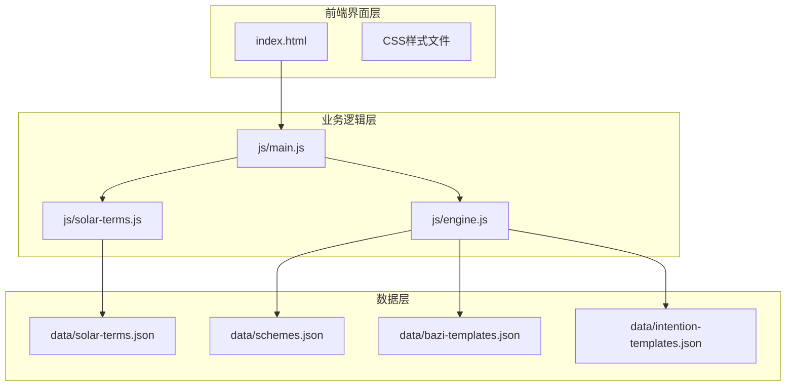
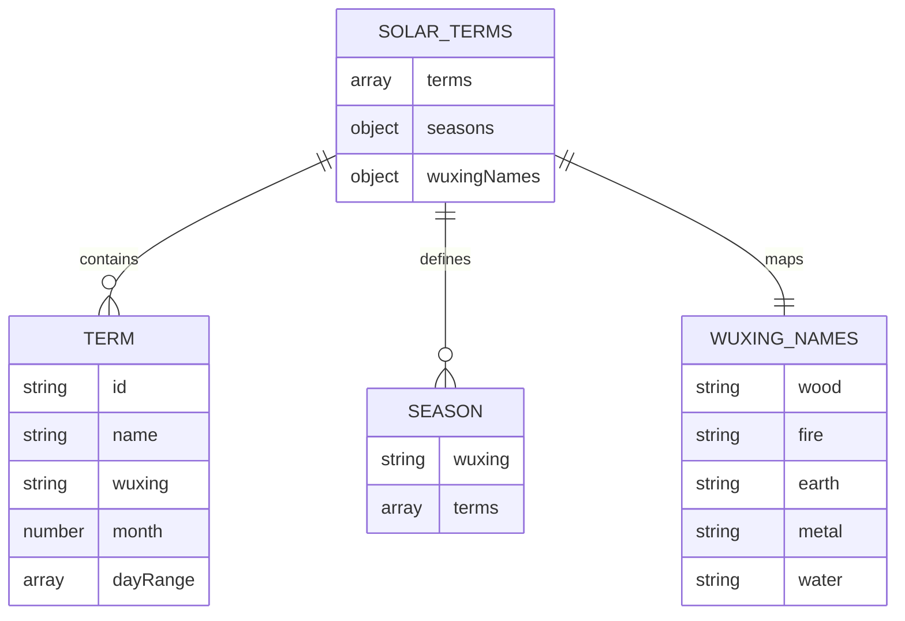
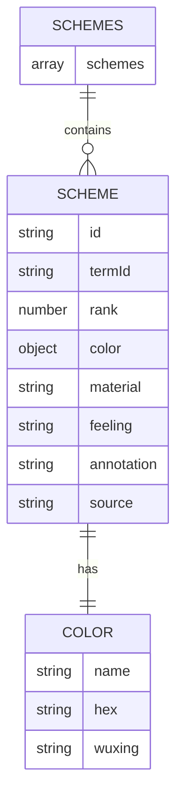
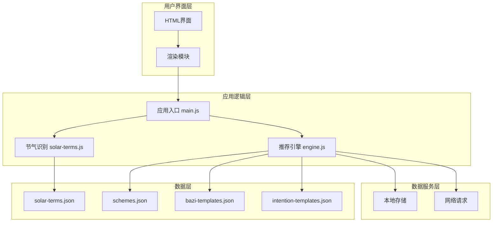
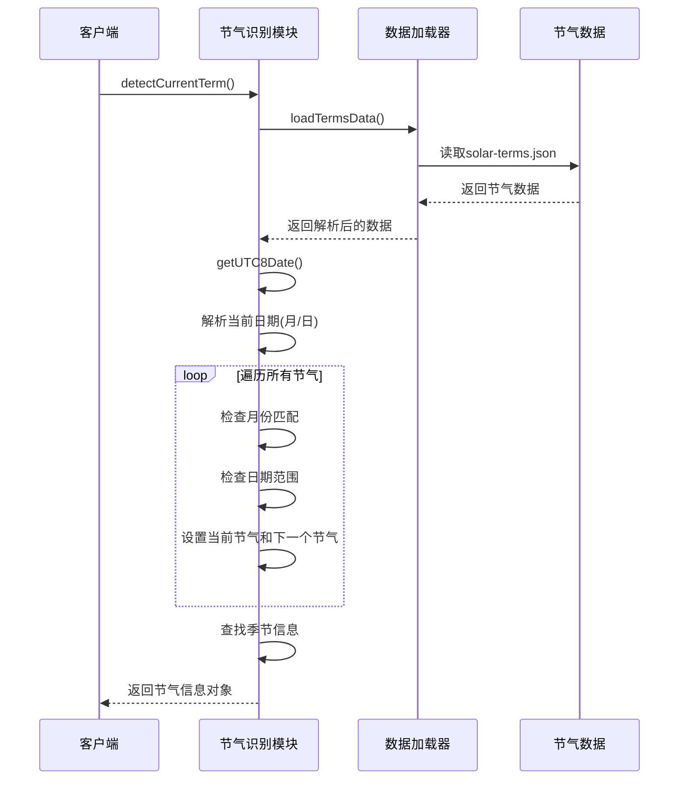
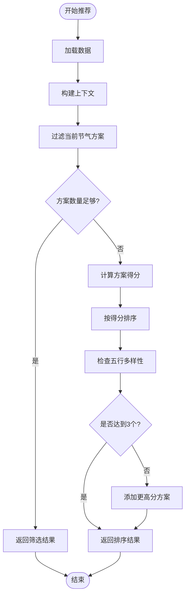
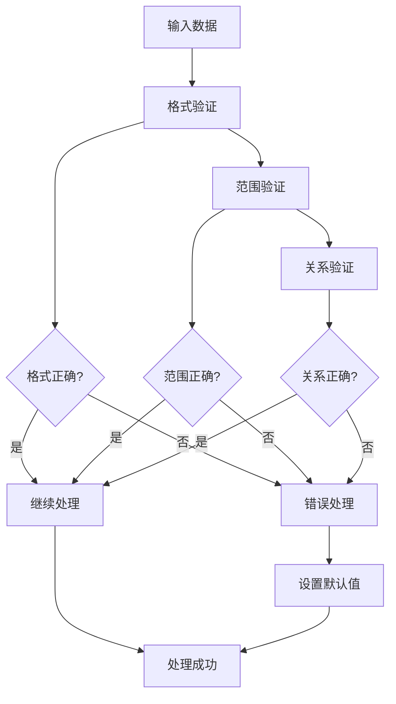
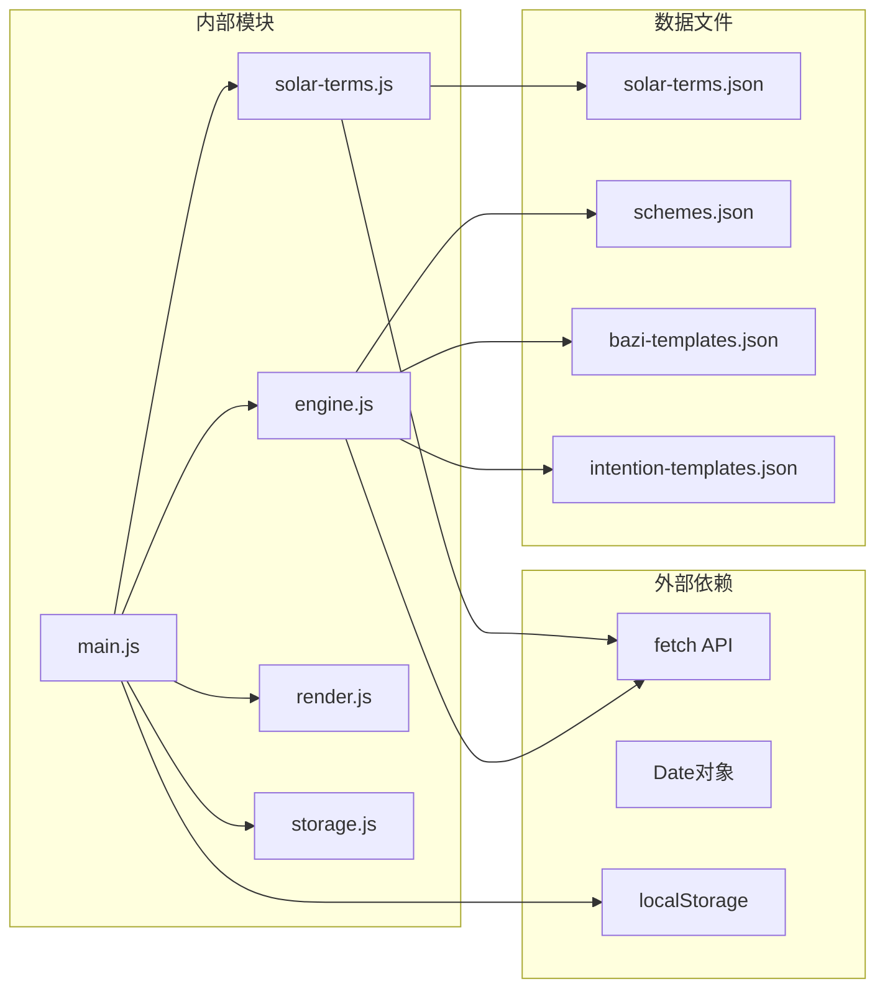

# 二十四节气数据模型

<cite>
**本文档引用的文件**
- [solar-terms.json](file://data/solar-terms.json)
- [solar-terms.js](file://js/solar-terms.js)
- [schemes.json](file://data/schemes.json)
- [engine.js](file://js/engine.js)
- [main.js](file://js/main.js)
- [index.html](file://index.html)
- [bazi-templates.json](file://data/bazi-templates.json)
- [intention-templates.json](file://data/intention-templates.json)
</cite>

## 目录
1. [简介](#简介)
2. [项目结构](#项目结构)
3. [核心组件](#核心组件)
4. [架构概览](#架构概览)
5. [详细组件分析](#详细组件分析)
6. [依赖关系分析](#依赖关系分析)
7. [性能考虑](#性能考虑)
8. [故障排除指南](#故障排除指南)
9. [结论](#结论)
10. [附录](#附录)

## 简介

这是一个基于中国传统文化二十四节气的智能穿搭推荐系统。系统通过分析当前节气的五行属性，结合用户的心愿和生辰八字，为用户提供个性化的服装搭配建议。项目采用现代前端技术栈，实现了完整的节气识别、数据验证、推荐算法和用户交互功能。

## 项目结构

项目采用模块化设计，主要分为以下几个层次：



**图表来源**
- [index.html](file://index.html#L1-L236)
- [main.js](file://js/main.js#L1-L317)
- [solar-terms.js](file://js/solar-terms.js#L1-L118)
- [engine.js](file://js/engine.js#L1-L335)

**章节来源**
- [index.html](file://index.html#L1-L236)
- [main.js](file://js/main.js#L1-L317)

## 核心组件

### 节气数据模型

二十四节气数据采用JSON格式存储，包含完整的节气信息和相关的文化元素：



**图表来源**
- [solar-terms.json](file://data/solar-terms.json#L1-L42)

### 穿搭方案数据模型

每个节气对应多个穿搭方案，每个方案包含详细的色彩、材质和文化注释：



**图表来源**
- [schemes.json](file://data/schemes.json#L1-L509)

**章节来源**
- [solar-terms.json](file://data/solar-terms.json#L1-L42)
- [schemes.json](file://data/schemes.json#L1-L509)

## 架构概览

系统采用分层架构设计，实现了清晰的职责分离：



**图表来源**
- [main.js](file://js/main.js#L1-L317)
- [engine.js](file://js/engine.js#L1-L335)
- [solar-terms.js](file://js/solar-terms.js#L1-L118)

## 详细组件分析

### 节气识别模块

节气识别模块负责确定当前的节气状态，实现精确的时间计算和边界处理：



**图表来源**
- [solar-terms.js](file://js/solar-terms.js#L36-L103)

#### 节气命名规则

节气采用拼音缩写命名，遵循以下规则：
- 使用节气的拼音首字母组合
- 保持节气的自然顺序
- 支持完整的中文名称显示

#### 时间顺序关系

节气按照自然顺序排列，形成完整的24节气循环：
- 春季：立春 → 雨水 → 惊蛰 → 春分 → 清明 → 谷雨
- 夏季：立夏 → 小满 → 芒种 → 夏至 → 小暑 → 大暑
- 秋季：立秋 → 处暑 → 白露 → 秋分 → 寒露 → 霜降
- 冬季：立冬 → 小雪 → 大雪 → 冬至 → 小寒 → 大寒

#### 五行属性映射

每个节气都明确标注了对应的五行属性：
- 木：春三月的节气（立春、雨水、惊蛰、春分、清明、谷雨）
- 火：夏三月的节气（立夏、小满、芒种、夏至、小暑、大暑）
- 金：秋三月的节气（立秋、处暑、白露、秋分、寒露、霜降）
- 水：冬三月的节气（立冬、小雪、大雪、冬至、小寒、大寒）

**章节来源**
- [solar-terms.js](file://js/solar-terms.js#L1-L118)
- [solar-terms.json](file://data/solar-terms.json#L1-L42)

### 推荐引擎模块

推荐引擎模块实现了复杂的匹配算法，综合考虑节气、心愿和八字因素：



**图表来源**
- [engine.js](file://js/engine.js#L218-L259)

#### 评分算法

推荐系统采用加权评分算法：

| 评分因素 | 权重 | 匹配类型 | 分数 |
|---------|------|----------|------|
| 节气匹配 | 50% | 完全匹配 | 100分 |
| 节气匹配 | 50% | 相生关系 | 60分 |
| 八字匹配 | 20% | 完全匹配 | 100分 |
| 八字匹配 | 20% | 相生关系 | 60分 |

#### 五行相生关系

系统内置五行相生关系：
- 木 → 火 → 土 → 金属 → 水 → 木

**章节来源**
- [engine.js](file://js/engine.js#L178-L213)
- [engine.js](file://js/engine.js#L218-L259)

### 数据验证与边界处理

系统实现了多层数据验证机制：



**图表来源**
- [solar-terms.js](file://js/solar-terms.js#L18-L29)

**章节来源**
- [solar-terms.js](file://js/solar-terms.js#L18-L29)

## 依赖关系分析

系统各模块间的依赖关系如下：



**图表来源**
- [main.js](file://js/main.js#L5-L15)
- [solar-terms.js](file://js/solar-terms.js#L21-L28)
- [engine.js](file://js/engine.js#L39-L79)

**章节来源**
- [main.js](file://js/main.js#L5-L15)

## 性能考虑

### 数据加载优化

- **缓存策略**：节气数据采用内存缓存，避免重复加载
- **异步加载**：使用Promise.all并行加载多个数据源
- **懒加载**：非关键数据按需加载

### 计算优化

- **索引查找**：使用数组索引而非线性搜索
- **循环优化**：最小化循环次数和DOM操作
- **内存管理**：及时清理不需要的数据引用

### 网络优化

- **静态资源**：所有数据文件均为静态JSON，便于缓存
- **CDN加速**：字体资源通过CDN加载
- **压缩传输**：JSON数据体积较小，传输效率高

## 故障排除指南

### 常见问题及解决方案

#### 节气识别失败

**症状**：无法正确识别当前节气
**可能原因**：
- 时区设置错误
- 日期解析异常
- 数据文件加载失败

**解决方法**：
1. 检查系统时区设置
2. 验证日期格式
3. 确认数据文件路径正确

#### 推荐结果为空

**症状**：生成推荐时返回空结果
**可能原因**：
- 方案数据缺失
- 条件过滤过于严格
- 数据格式错误

**解决方法**：
1. 检查schemes.json数据完整性
2. 调整过滤条件
3. 验证数据格式

#### 性能问题

**症状**：页面响应缓慢
**可能原因**：
- 数据量过大
- DOM操作频繁
- 缺少缓存机制

**解决方法**：
1. 实施数据分页
2. 减少DOM操作
3. 添加缓存层

**章节来源**
- [solar-terms.js](file://js/solar-terms.js#L25-L28)
- [engine.js](file://js/engine.js#L45-L48)

## 结论

本项目成功实现了基于二十四节气的智能穿搭推荐系统，具有以下特点：

1. **文化传承**：准确体现了中国传统的节气文化和五行理论
2. **技术先进**：采用现代前端技术栈，实现良好的用户体验
3. **算法智能**：通过复杂的匹配算法提供个性化的推荐
4. **扩展性强**：模块化设计便于功能扩展和维护

系统为用户提供了科学、美观、实用的穿搭建议，既传承了传统文化，又满足了现代生活的需求。

## 附录

### 使用示例

#### 节气查询示例

```javascript
// 获取当前节气信息
const termInfo = await detectCurrentTerm();

// 获取指定日期的节气
const specificDate = new Date('2024-03-05');
const termInfo = await detectCurrentTerm(specificDate);

console.log(`当前节气: ${termInfo.current.name}`);
console.log(`五行属性: ${termInfo.current.wuxing}`);
```

#### 节气比较示例

```javascript
// 计算两个节气之间的距离
const distance = getTermDistance('lichun', 'dahan');
console.log(`立春到大寒的距离: ${distance} 个节气`);
```

#### 穿搭方案查询示例

```javascript
// 获取特定节气的推荐方案
const schemes = schemesData.schemes.filter(scheme => 
    scheme.termId === currentTermId
);

// 按得分排序
schemes.sort((a, b) => b.score - a.score);
```

### 维护指南

#### 更新节气数据

1. **备份现有数据**
   ```bash
   cp data/solar-terms.json data/solar-terms.json.backup
   ```

2. **修改节气信息**
   - 更新节气名称和ID
   - 调整日期范围
   - 修改五行属性

3. **验证数据格式**
   ```bash
   # 检查JSON语法
   cat data/solar-terms.json | jq .
   ```

4. **测试功能**
   - 验证节气识别准确性
   - 测试推荐算法
   - 检查UI显示

#### 扩展功能

1. **添加新的节气**
   - 在solar-terms.json中添加新节气
   - 更新节气顺序数组
   - 添加对应的穿搭方案

2. **调整推荐算法**
   - 修改权重分配
   - 调整评分函数
   - 扩展匹配条件

3. **国际化支持**
   - 添加多语言支持
   - 国际化日期格式
   - 文化注释翻译

**章节来源**
- [solar-terms.js](file://js/solar-terms.js#L36-L103)
- [engine.js](file://js/engine.js#L268-L310)