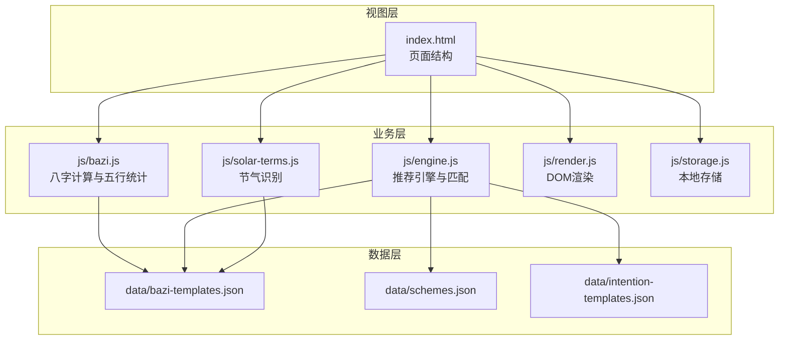
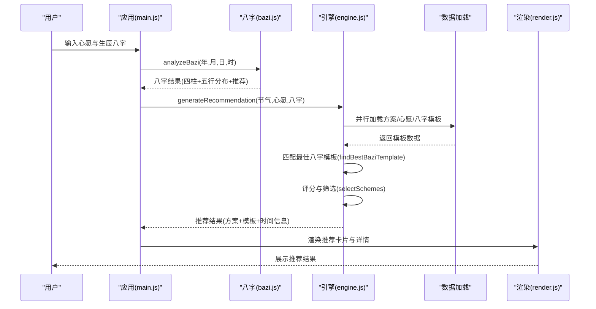
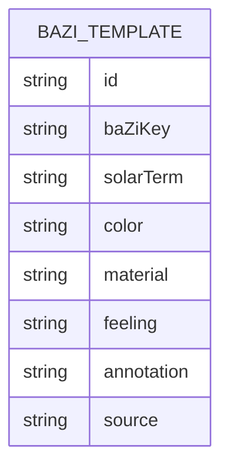
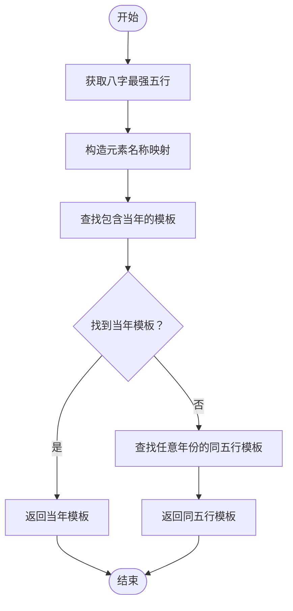
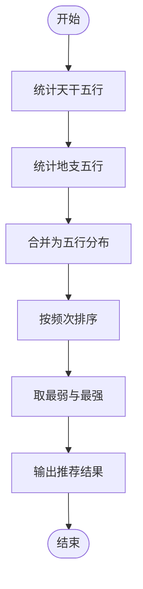
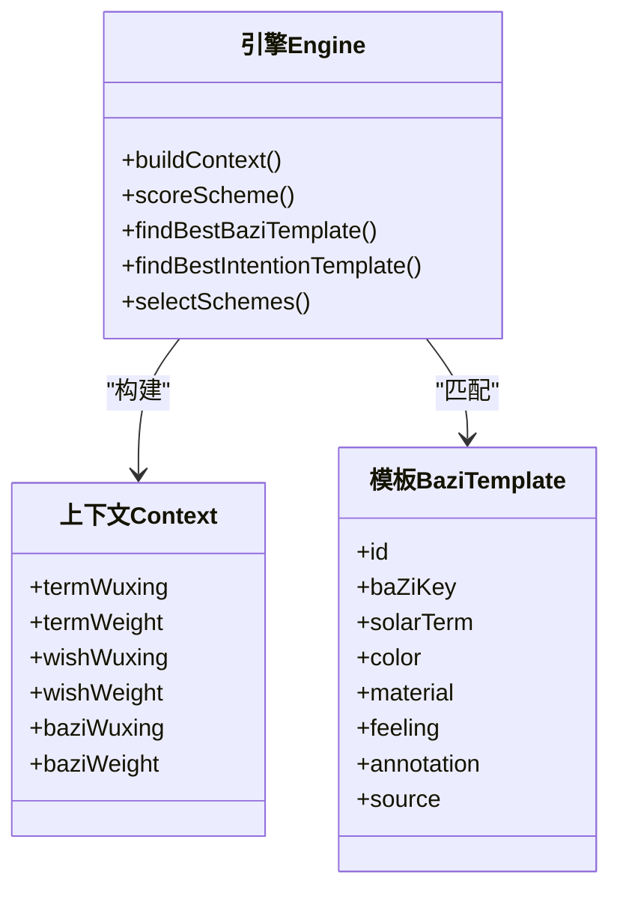
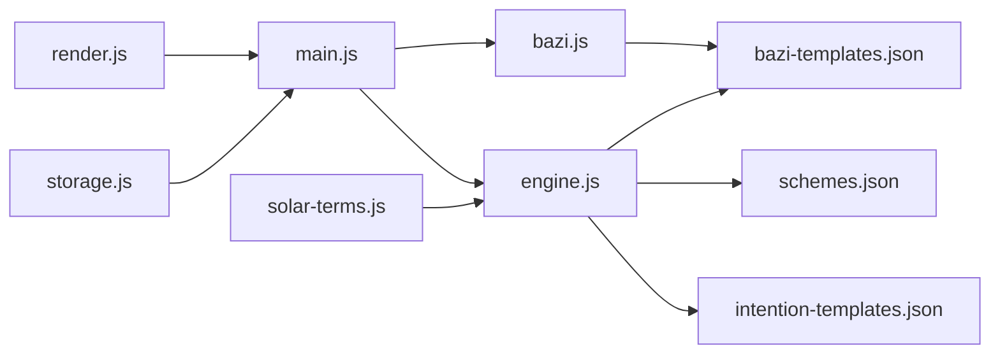

# 八字模板数据模型

<cite>
**本文档引用的文件**
- [bazi-templates.json](file://data/bazi-templates.json)
- [bazi.js](file://js/bazi.js)
- [engine.js](file://js/engine.js)
- [main.js](file://js/main.js)
- [schemes.json](file://data/schemes.json)
- [intention-templates.json](file://data/intention-templates.json)
- [solar-terms.js](file://js/solar-terms.js)
- [render.js](file://js/render.js)
- [storage.js](file://js/storage.js)
- [index.html](file://index.html)
</cite>

## 目录
1. [简介](#简介)
2. [项目结构](#项目结构)
3. [核心组件](#核心组件)
4. [架构总览](#架构总览)
5. [详细组件分析](#详细组件分析)
6. [依赖关系分析](#依赖关系分析)
7. [性能考虑](#性能考虑)
8. [故障排查指南](#故障排查指南)
9. [结论](#结论)
10. [附录](#附录)

## 简介
本文件系统性阐述“八字模板数据模型”，围绕 bazi-templates.json 的结构设计、模板分类体系、字段定义与分析规则展开，并结合推荐引擎的匹配逻辑、权重计算与集成机制，给出模板查询、匹配与使用的实践示例，以及维护与扩展指南。目标是帮助开发者快速理解并正确使用八字模板数据，同时为后续扩展提供清晰的规范与约束。

## 项目结构
该项目采用前端单页应用架构，数据层以 JSON 文件形式组织，业务逻辑分布在多个模块中：
- 数据层：包含八字模板、方案模板、心愿模板等 JSON 数据文件
- 业务层：八字计算、推荐引擎、节气识别、渲染与存储等模块
- 视图层：HTML 页面与样式资源

图表来源
- [bazi-templates.json](file://data/bazi-templates.json#L1-L103)
- [schemes.json](file://data/schemes.json#L1-L509)
- [intention-templates.json](file://data/intention-templates.json#L1-L253)
- [bazi.js](file://js/bazi.js#L1-L193)
- [engine.js](file://js/engine.js#L1-L335)
- [solar-terms.js](file://js/solar-terms.js#L1-L118)
- [render.js](file://js/render.js#L1-L272)
- [storage.js](file://js/storage.js#L1-L116)
- [index.html](file://index.html#L1-L200)

章节来源
- [index.html](file://index.html#L1-L200)
- [bazi.js](file://js/bazi.js#L1-L193)
- [engine.js](file://js/engine.js#L1-L335)

## 核心组件
- 八字模板数据模型：描述日主强弱、年份、节气、色彩、材质、感受、注解与典籍来源的模板集合
- 八字计算模块：负责四柱八字生成、五行分布统计与推荐元素计算
- 推荐引擎：整合节气、心愿与八字模板，进行匹配与打分，输出推荐方案
- 节气识别：提供当前节气与季节信息，支撑模板匹配
- 渲染与存储：负责界面渲染、用户交互与本地持久化

章节来源
- [bazi-templates.json](file://data/bazi-templates.json#L1-L103)
- [bazi.js](file://js/bazi.js#L129-L172)
- [engine.js](file://js/engine.js#L124-L152)

## 架构总览
推荐流程从用户输入开始，经过八字计算、模板匹配与权重评分，最终输出推荐结果。其中八字模板作为关键匹配因子之一，与节气模板、方案模板共同决定最终推荐。

图表来源
- [main.js](file://js/main.js#L202-L244)
- [bazi.js](file://js/bazi.js#L182-L192)
- [engine.js](file://js/engine.js#L268-L310)
- [render.js](file://js/render.js#L114-L127)

## 详细组件分析

### 八字模板数据模型
- 数据来源：data/bazi-templates.json
- 结构特征：数组形式，每项为一个模板对象，包含唯一标识、模板键、节气、色彩、材质、感受、注解与来源等字段
- 分类体系：以“日主强弱”和“年份”为主要维度，形成10个模板（每类五行对应2年）
- 字段定义与含义
  - id：模板唯一标识
  - baZiKey：模板键，包含“日主强弱”和“年份”信息，用于匹配
  - solarTerm：节气名称
  - color：色彩名称
  - material：材质名称
  - feeling：穿着感受
  - annotation：五行解读与文化注解
  - source：典籍出处

图表来源
- [bazi-templates.json](file://data/bazi-templates.json#L1-L103)

章节来源
- [bazi-templates.json](file://data/bazi-templates.json#L1-L103)

### 八字模板分类逻辑
- 分类维度
  - 五行类别：木、火、土、金、水
  - 日主强弱：旺（偏强）
  - 年份：2024、2025
- 匹配策略
  - 引擎优先查找与“最强五行”一致且包含“当年”的模板
  - 若无当年模板，则回退到同五行的任意年份模板
- 匹配条件
  - baZiKey 中包含“日主X旺”和“年份”
  - 通过最强五行与模板 baZiKey 的字符串匹配实现

图表来源
- [engine.js](file://js/engine.js#L124-L152)

章节来源
- [engine.js](file://js/engine.js#L124-L152)

### 五行统计方法与推荐依据
- 五行统计
  - 统计天干与地支中各五行出现次数，得到分布向量
- 推荐依据
  - 选取出现最少的五行作为“最弱五行”，建议补充
  - 同时标注“最强五行”，提示可适当泄之
- 输出结构
  - weakest：最弱五行
  - strongest：最强五行
  - recommend：推荐补充的五行
  - analysis：简要分析说明

图表来源
- [bazi.js](file://js/bazi.js#L129-L172)

章节来源
- [bazi.js](file://js/bazi.js#L129-L172)

### 模板数据验证规则与匹配条件
- 验证规则
  - 模板必须包含 baZiKey、solarTerm、color、material、feeling、annotation、source 等字段
  - baZiKey 必须包含“日主X旺”和“年份”片段，确保可被引擎解析
  - solarTerm 必须与节气映射表中的名称一致，以便距离计算
- 匹配条件
  - baZiKey 包含“日主X旺”和“年份”
  - 优先匹配当年模板，否则回退到同五行任意年份模板
- 业务规则
  - 若引擎无法解析最强五行或模板为空，返回空结果
  - 模板与节气的匹配基于名称映射与循环距离计算

章节来源
- [bazi-templates.json](file://data/bazi-templates.json#L1-L103)
- [engine.js](file://js/engine.js#L124-L152)

### 推荐引擎集成机制与权重计算
- 集成机制
  - 并行加载方案、心愿与八字模板
  - 构建上下文：包含节气五行权重、八字五行权重与心愿权重
  - 选择方案：优先筛选当前节气相关方案，不足时按得分排序
  - 评分规则
    - 节气匹配：完全匹配权重100%，相生匹配权重60%
    - 八字匹配：完全匹配权重100%，相生匹配权重60%
    - 权重比例：节气50%、八字20%、心愿30%
- 模板匹配
  - 八字模板：按最强五行匹配 baZiKey
  - 心愿模板：按心愿类型与节气距离排序，取最近者

图表来源
- [engine.js](file://js/engine.js#L157-L259)
- [bazi-templates.json](file://data/bazi-templates.json#L1-L103)

章节来源
- [engine.js](file://js/engine.js#L157-L259)

### 实际使用示例与最佳实践
- 查询与匹配
  - 使用引擎的 findBestBaziTemplate 方法，传入 analyzeBazi 的结果与模板数组
  - 若需要换一批，使用 regenerateRecommendation 并传入已排除的方案ID列表
- 维护与扩展
  - 新增模板时，确保 baZiKey 符合“日主X旺+年份”的格式
  - 扩展节气模板时，保持 solarTerm 与节气映射一致
  - 建议为每个模板提供权威典籍来源，增强可信度
- 性能优化
  - 模板数量有限（约10个），匹配复杂度低，无需额外索引
  - 若模板规模扩大，可考虑建立 baZiKey 的索引或预处理映射表

章节来源
- [engine.js](file://js/engine.js#L268-L334)
- [main.js](file://js/main.js#L202-L269)

## 依赖关系分析
- 模块耦合
  - main.js 依赖 bazi.js 与 engine.js，负责用户交互与流程编排
  - engine.js 依赖 bazi-templates.json、schemes.json、intention-templates.json
  - bazi.js 提供八字计算与五行统计能力
  - solar-terms.js 提供节气识别与映射
- 外部依赖
  - HTML 页面通过 fetch 加载 JSON 数据
  - 本地存储用于持久化用户选择与历史记录

图表来源
- [main.js](file://js/main.js#L1-L317)
- [bazi.js](file://js/bazi.js#L1-L193)
- [engine.js](file://js/engine.js#L1-L335)
- [bazi-templates.json](file://data/bazi-templates.json#L1-L103)
- [schemes.json](file://data/schemes.json#L1-L509)
- [intention-templates.json](file://data/intention-templates.json#L1-L253)
- [render.js](file://js/render.js#L1-L272)
- [storage.js](file://js/storage.js#L1-L116)
- [solar-terms.js](file://js/solar-terms.js#L1-L118)

章节来源
- [main.js](file://js/main.js#L1-L317)
- [engine.js](file://js/engine.js#L1-L335)

## 性能考虑
- 模板匹配为线性扫描，时间复杂度 O(n)，n 为模板数量（当前约10）
- 并行加载多份模板，减少等待时间
- 评分函数简单，主要为常数级操作
- 建议在模板规模扩大时引入索引或缓存策略

## 故障排查指南
- 模板无法匹配
  - 检查 baZiKey 是否包含“日主X旺”和“年份”
  - 确认 solarTerm 与节气映射一致
- 八字结果异常
  - 确认输入的年、月、日、时合法
  - 检查 analyzeBazi 输出是否包含 recommend 字段
- 推荐为空
  - 确认模板数据已成功加载
  - 检查引擎上下文是否正确构建（termId、baziWuxing）

章节来源
- [engine.js](file://js/engine.js#L69-L79)
- [bazi.js](file://js/bazi.js#L182-L192)

## 结论
八字模板数据模型以简洁明确的结构与清晰的匹配规则，为推荐引擎提供了稳定的输入。通过“日主强弱+年份”的模板键设计，配合引擎的权重评分与回退策略，实现了高效、可扩展的推荐流程。建议在维护与扩展时严格遵循字段规范与匹配条件，确保系统稳定性与一致性。

## 附录
- 字段参考
  - id：模板唯一标识
  - baZiKey：模板键（包含日主强弱与年份）
  - solarTerm：节气名称
  - color：色彩名称
  - material：材质名称
  - feeling：穿着感受
  - annotation：注解
  - source：典籍来源

章节来源
- [bazi-templates.json](file://data/bazi-templates.json#L1-L103)