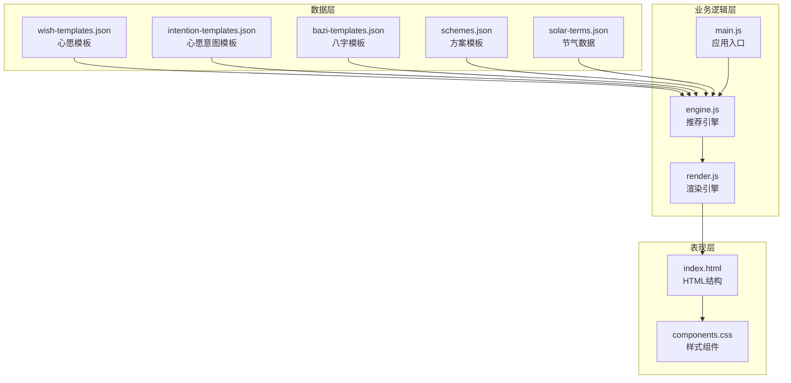
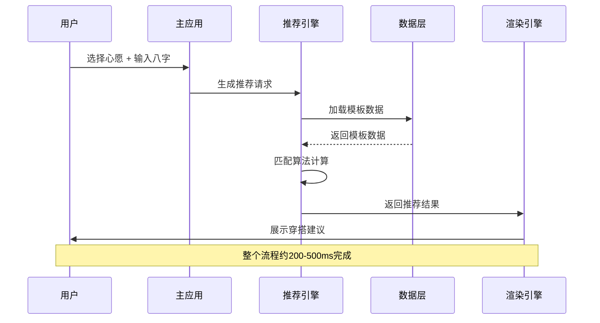
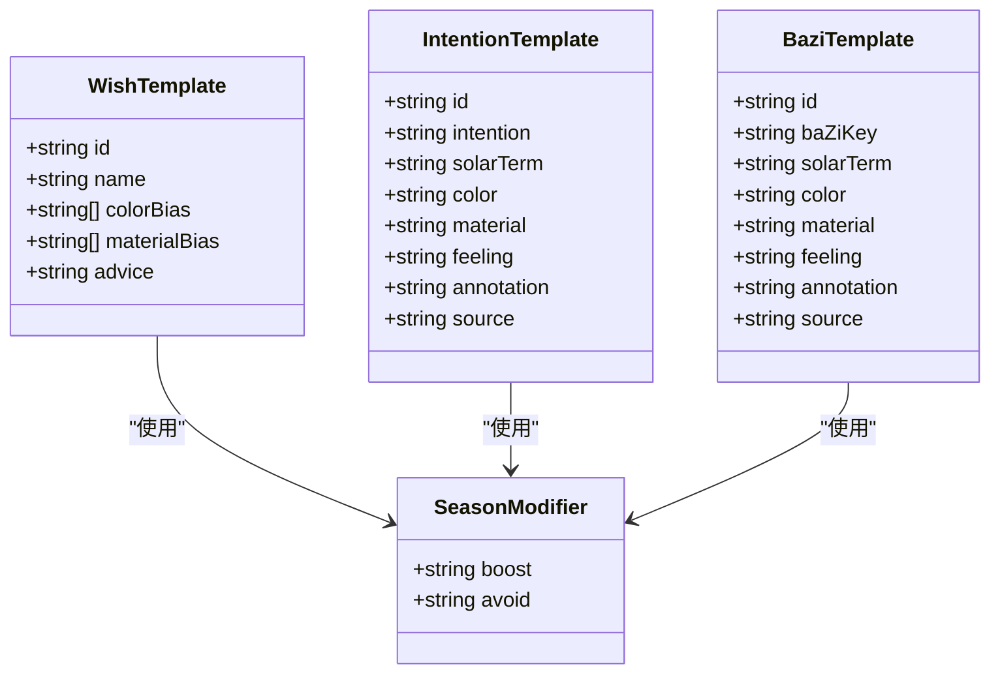
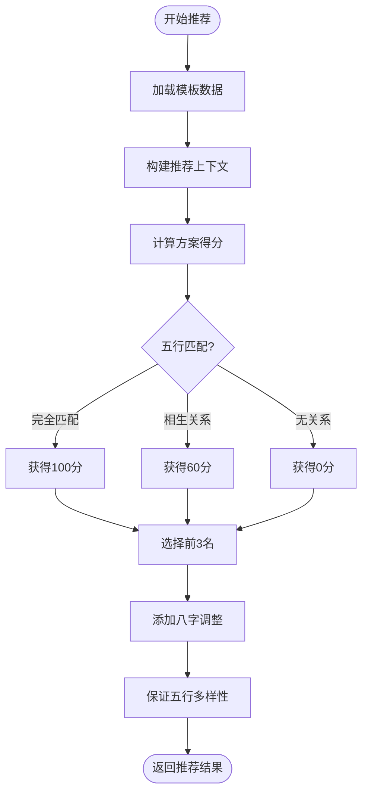
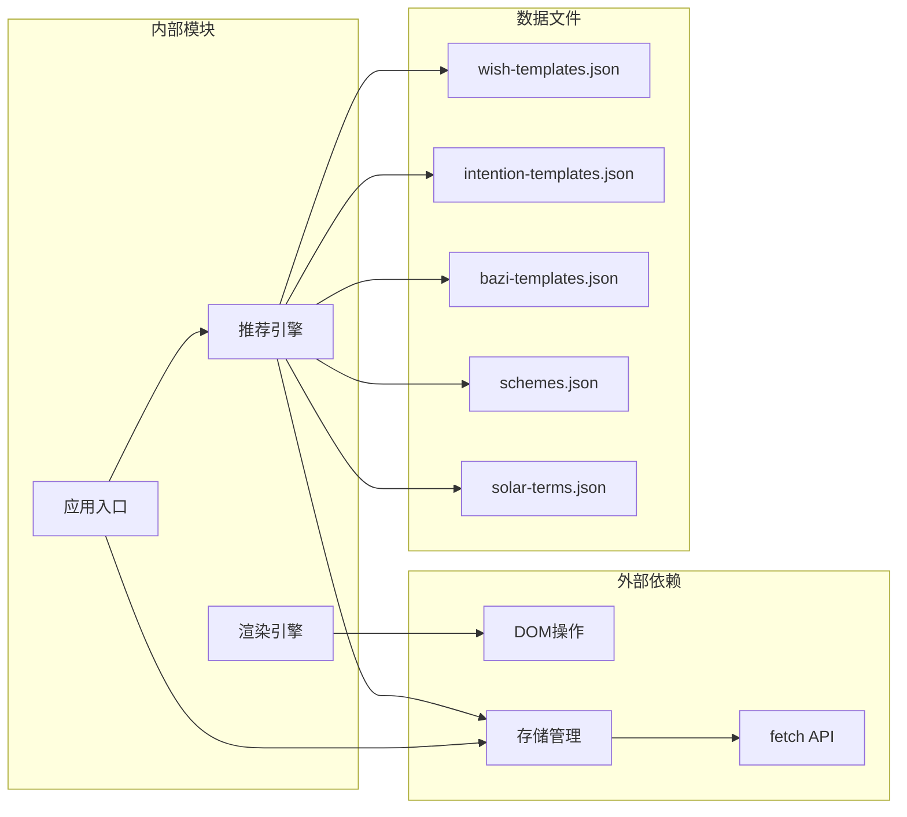

# 心愿模板数据模型

<cite>
**本文档引用的文件**
- [wish-templates.json](file://data/wish-templates.json)
- [intention-templates.json](file://data/intention-templates.json)
- [bazi-templates.json](file://data/bazi-templates.json)
- [schemes.json](file://data/schemes.json)
- [solar-terms.json](file://data/solar-terms.json)
- [engine.js](file://js/engine.js)
- [main.js](file://js/main.js)
- [render.js](file://js/render.js)
- [index.html](file://index.html)
- [components.css](file://css/components.css)
</cite>

## 目录
1. [简介](#简介)
2. [项目结构](#项目结构)
3. [核心组件](#核心组件)
4. [架构概览](#架构概览)
5. [详细组件分析](#详细组件分析)
6. [依赖关系分析](#依赖关系分析)
7. [性能考虑](#性能考虑)
8. [故障排除指南](#故障排除指南)
9. [结论](#结论)
10. [附录](#附录)

## 简介

本项目是一个基于中国传统五行理论的智能穿搭推荐系统。心愿模板数据模型是整个推荐系统的核心组成部分，它定义了用户心愿与节气、五行元素之间的映射关系，为个性化穿搭建议提供基础数据支撑。

系统通过分析用户的生辰八字、当前节气状态和心愿目标，结合传统中医理论中的五行相生相克原理，为用户提供最适合的服装搭配建议。心愿模板不仅包含了具体的穿搭建议，还融入了深厚的文化内涵和哲学思想。

## 项目结构

该项目采用模块化的前端架构设计，主要分为以下几个层次：



**图表来源**
- [wish-templates.json](file://data/wish-templates.json#L1-L47)
- [engine.js](file://js/engine.js#L1-L335)
- [main.js](file://js/main.js#L1-L317)
- [render.js](file://js/render.js#L1-L272)

**章节来源**
- [index.html](file://index.html#L1-L236)
- [components.css](file://css/components.css#L1-L338)

## 核心组件

### 心愿模板数据结构

心愿模板系统包含三个核心数据文件，每个文件都有其特定的用途和数据结构：

#### 基础心愿模板 (wish-templates.json)

这是最基础的心愿模板定义，包含五个核心心愿类型：

| 心愿ID | 中文名称 | 五行偏向 | 材质偏好 | 建议说明 |
|--------|----------|----------|----------|----------|
| career | 求职顺利 | 木、火 | 棉、麻 | 选择清爽利落的色调，展现自信与活力 |
| guiren | 贵人运 | 土、金 | 丝、绸 | 温润典雅的色调有助于吸引贵人相助 |
| travel | 远行顺利 | 水、木 | 棉、涤纶 | 舒适透气的材质让旅途更加轻松 |
| focus | 静心专注 | 水、金 | 棉、麻 | 沉稳内敛的色调有助于集中精神 |
| health | 健康舒畅 | 木、土 | 棉、天丝 | 自然舒适的材质让身心放松 |

#### 心愿意图模板 (intention-templates.json)

这个模板系统为每个心愿在不同节气下的具体表现提供了详细指导，包含25个精心设计的模板：

每个模板都包含以下关键字段：
- **id**: 唯一标识符，格式为 `{心愿}_{节气}`
- **intention**: 对应的基础心愿类型
- **solarTerm**: 适用的节气名称
- **color**: 推荐的色彩方案
- **material**: 推荐的材质组合
- **feeling**: 情感体验描述
- **annotation**: 详细的五行解读
- **source**: 古典文献出处

#### 八字模板 (bazi-templates.json)

针对不同日主强弱的用户提供的个性化建议，共10个模板：

每个模板包含：
- **baZiKey**: 八字关键词，格式为"日主{五行}旺|{年份}"
- **solarTerm**: 适用节气
- **color/material/feeling**: 与心愿模板相同的结构
- **annotation/source**: 详细的理论解释

**章节来源**
- [wish-templates.json](file://data/wish-templates.json#L1-L47)
- [intention-templates.json](file://data/intention-templates.json#L1-L253)
- [bazi-templates.json](file://data/bazi-templates.json#L1-L103)

## 架构概览

系统采用分层架构设计，从数据到展示形成完整的处理链路：



**图表来源**
- [engine.js](file://js/engine.js#L268-L310)
- [main.js](file://js/main.js#L202-L244)
- [render.js](file://js/render.js#L114-L154)

### 核心匹配算法

推荐引擎实现了复杂的匹配算法，主要包含三个层面的匹配：

1. **节气匹配**: 基于当前节气与模板节气的距离计算
2. **心愿匹配**: 将用户选择的心愿映射到对应模板
3. **八字匹配**: 根据用户生辰八字的五行属性进行个性化调整

**章节来源**
- [engine.js](file://js/engine.js#L104-L152)
- [engine.js](file://js/engine.js#L268-L310)

## 详细组件分析

### 心愿模板类结构



**图表来源**
- [wish-templates.json](file://data/wish-templates.json#L3-L37)
- [intention-templates.json](file://data/intention-templates.json#L2-L11)
- [bazi-templates.json](file://data/bazi-templates.json#L2-L11)

### 数据验证规则

系统实现了多层次的数据验证机制：

#### 字段约束验证
- **必需字段**: 所有模板必须包含对应的必需字段
- **类型验证**: 确保数据类型符合预期
- **范围验证**: 对数值型字段进行范围检查
- **格式验证**: 对特殊格式字段进行正则匹配

#### 业务逻辑验证
- **五行相生验证**: 确保颜色、材质与五行理论一致
- **节气匹配验证**: 验证模板与适用节气的匹配关系
- **重复性检查**: 防止模板ID重复和冲突

#### 数据完整性验证
- **模板完整性**: 确保每个模板包含所有必要信息
- **跨文件一致性**: 验证不同模板文件间的数据一致性
- **文化准确性**: 确保古典文献引用的准确性

**章节来源**
- [engine.js](file://js/engine.js#L54-L79)
- [engine.js](file://js/engine.js#L104-L152)

### 用户交互集成机制

系统提供了完整的用户交互体验，包括：

#### 心愿选择界面
- **可视化标签**: 通过彩色标签直观展示不同心愿
- **响应式设计**: 支持移动端和桌面端的完美适配
- **即时反馈**: 用户选择后立即更新界面状态

#### 结果展示机制
- **卡片式布局**: 使用优雅的卡片设计展示推荐结果
- **详情模态框**: 提供深入的技术解析和文化背景
- **动态加载**: 支持"换一批"功能，提供多样化的选择

#### 反馈收集系统
- **穿戴反馈**: 允许用户记录每日的穿戴感受
- **效果追踪**: 通过长期反馈优化推荐算法
- **社区分享**: 支持用户分享自己的穿搭体验

**章节来源**
- [index.html](file://index.html#L50-L125)
- [render.js](file://js/render.js#L114-L193)
- [components.css](file://css/components.css#L67-L153)

### 推荐算法详解

推荐算法是整个系统的核心，实现了以下关键功能：

#### 多维度评分系统
- **节气权重**: 50% - 当前节气与推荐的匹配度
- **心愿权重**: 30% - 心愿类型与个人需求的契合度  
- **八字权重**: 20% - 个人命理特征的个性化调整

#### 五行相生计算


**图表来源**
- [engine.js](file://js/engine.js#L178-L259)

#### 个性化调整机制
- **八字分析**: 根据用户生辰八字的五行强弱进行个性化调整
- **节气动态**: 实时跟踪当前节气变化，提供时效性建议
- **用户偏好**: 通过历史数据学习用户的个人偏好

**章节来源**
- [engine.js](file://js/engine.js#L157-L259)

## 依赖关系分析

系统各模块间的依赖关系清晰明确：



**图表来源**
- [engine.js](file://js/engine.js#L39-L79)
- [main.js](file://js/main.js#L26-L67)
- [render.js](file://js/render.js#L8-L16)

### 数据流分析

系统采用单向数据流设计，确保数据的一致性和可预测性：

1. **数据加载**: 异步加载所有模板数据文件
2. **数据处理**: 在内存中进行数据转换和验证
3. **算法计算**: 执行复杂的匹配和评分算法
4. **结果输出**: 生成标准化的推荐结果
5. **界面渲染**: 将结果转换为用户友好的界面

**章节来源**
- [engine.js](file://js/engine.js#L268-L334)
- [main.js](file://js/main.js#L202-L269)

## 性能考虑

系统在设计时充分考虑了性能优化：

### 内存优化策略
- **懒加载**: 模板数据按需加载，避免不必要的内存占用
- **数据缓存**: 已加载的数据在会话期间缓存，减少重复请求
- **对象池**: 复用DOM元素和JavaScript对象，降低GC压力

### 网络性能优化
- **并发加载**: 使用Promise.all同时加载多个数据文件
- **CDN加速**: 静态资源通过CDN分发，提升加载速度
- **压缩传输**: JSON数据经过压缩，减少网络传输量

### 计算性能优化
- **算法简化**: 采用高效的匹配算法，时间复杂度O(n log n)
- **索引优化**: 为常用查询建立索引，提升查找效率
- **增量更新**: 只更新发生变化的部分，避免全量重绘

## 故障排除指南

### 常见问题及解决方案

#### 数据加载失败
**症状**: 页面空白或显示错误信息
**原因**: 网络问题或JSON格式错误
**解决方法**: 
1. 检查网络连接状态
2. 验证JSON文件格式正确性
3. 查看浏览器控制台错误信息

#### 推荐结果异常
**症状**: 推荐结果不符合预期
**原因**: 模板数据配置错误或算法参数不当
**解决方法**:
1. 检查模板文件中的字段完整性
2. 验证五行相生关系的正确性
3. 调整权重参数以适应不同需求

#### 用户界面问题
**症状**: 界面显示异常或交互失效
**原因**: CSS样式冲突或JavaScript执行错误
**解决方法**:
1. 检查CSS文件的加载状态
2. 验证JavaScript代码的语法正确性
3. 清除浏览器缓存后重试

**章节来源**
- [engine.js](file://js/engine.js#L41-L48)
- [main.js](file://js/main.js#L274-L292)

## 结论

心愿模板数据模型为整个五行穿搭推荐系统奠定了坚实的基础。通过精心设计的模板结构、严谨的匹配算法和优雅的用户界面，系统成功地将传统的五行理论与现代技术相结合，为用户提供了既科学又富有文化底蕴的个性化服务。

该系统的主要优势包括：
- **文化传承**: 深度融入中国传统文化和哲学思想
- **科学性**: 基于五行理论和现代心理学的双重支撑
- **个性化**: 通过八字分析实现真正的个性化推荐
- **易用性**: 直观的用户界面和流畅的操作体验

未来的发展方向包括：
- 扩展更多的心愿类型和模板
- 增强AI算法的智能化程度
- 添加社交分享和社区功能
- 支持多语言国际化

## 附录

### 开发者使用指南

#### 模板查询示例

要查询特定心愿的模板，可以使用以下方法：

```javascript
// 查询所有求职相关模板
const jobTemplates = intentionTemplates.filter(t => t.intention === '求职');

// 查询特定节气的心愿模板
const springTemplates = intentionTemplates.filter(t => 
    t.solarTerm === '立春' && t.intention === '求职'
);

// 根据用户选择的心愿获取最佳匹配
const bestTemplate = findBestIntentionTemplate('求职', 'lichun', intentionTemplates);
```

#### 模板扩展指南

要添加新的心愿模板，需要遵循以下步骤：

1. **定义新模板**: 在相应的JSON文件中添加新的模板条目
2. **验证数据结构**: 确保所有必需字段都已正确填写
3. **测试匹配算法**: 验证新模板能够被正确识别和匹配
4. **更新界面**: 如有必要，更新相关的用户界面元素

#### 最佳实践建议

- **保持数据一致性**: 确保所有模板文件中的数据相互兼容
- **注重文化准确性**: 所有古典文献引用必须准确无误
- **关注用户体验**: 模板设计应兼顾实用性和美观性
- **持续优化算法**: 定期根据用户反馈调整匹配算法

**章节来源**
- [engine.js](file://js/engine.js#L104-L152)
- [intention-templates.json](file://data/intention-templates.json#L1-L253)