# 数据模型设计

<cite>
**本文档引用的文件**
- [schemes.json](file://data/schemes.json)
- [solar-terms.json](file://data/solar-terms.json)
- [intention-templates.json](file://data/intention-templates.json)
- [bazi-templates.json](file://data/bazi-templates.json)
- [wish-templates.json](file://data/wish-templates.json)
- [engine.js](file://js/engine.js)
- [solar-terms.js](file://js/solar-terms.js)
- [bazi.js](file://js/bazi.js)
- [main.js](file://js/main.js)
- [render.js](file://js/render.js)
- [storage.js](file://js/storage.js)
- [index.html](file://index.html)
</cite>

## 目录
1. [简介](#简介)
2. [项目结构](#项目结构)
3. [核心数据模型](#核心数据模型)
4. [架构概览](#架构概览)
5. [详细组件分析](#详细组件分析)
6. [依赖关系分析](#依赖关系分析)
7. [性能考虑](#性能考虑)
8. [故障排除指南](#故障排除指南)
9. [结论](#结论)
10. [附录](#附录)

## 简介
本项目是一个基于中国传统文化五行理论的智能穿搭建议系统。系统通过分析用户当前的节气状态、个人心愿以及八字命理信息，为用户提供个性化的服装搭配建议。本文档详细描述了所有JSON数据文件的数据结构定义、字段含义、数据关系以及业务规则。

## 项目结构
项目采用模块化架构，主要分为数据层、业务逻辑层和表现层：

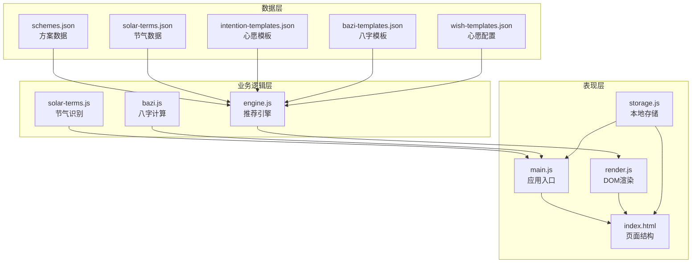

**图表来源**
- [engine.js](file://js/engine.js#L1-L335)
- [solar-terms.js](file://js/solar-terms.js#L1-L118)
- [bazi.js](file://js/bazi.js#L1-L193)
- [main.js](file://js/main.js#L1-L317)

**章节来源**
- [index.html](file://index.html#L1-L236)
- [engine.js](file://js/engine.js#L1-L335)

## 核心数据模型

### 方案数据模型 (schemes.json)
方案数据是系统的核心推荐基础，每个方案都包含完整的穿搭建议信息。

#### 基本结构
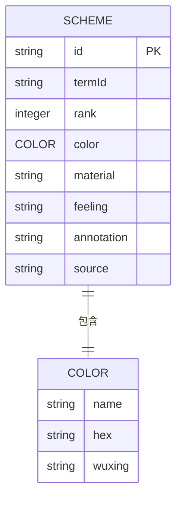

**图表来源**
- [schemes.json](file://data/schemes.json#L1-L509)

#### 字段详细说明

| 字段名 | 类型 | 必填 | 取值范围/示例 | 描述 | 业务规则 |
|--------|------|------|---------------|------|----------|
| id | string | 是 | "lichun_01" | 方案唯一标识符 | 格式：{solar_term}_{rank} |
| termId | string | 是 | "lichun", "yushui", ... | 对应的节气ID | 必须存在于节气数据中 |
| rank | integer | 是 | 1, 2, 3 | 推荐等级 | 1级最优，3级次优 |
| color.name | string | 是 | "嫩芽绿", "浅杏粉" | 颜色名称 | 中文描述 |
| color.hex | string | 是 | "#8FBE8E", "#F5D5C8" | 颜色十六进制值 | 标准HEX格式 |
| color.wuxing | string | 是 | "wood", "fire", "earth", "metal", "water" | 五行属性 | 必须为有效五行值 |
| material | string | 是 | "天丝棉", "桑蚕丝" | 材质名称 | 实际可用材质 |
| feeling | string | 是 | "轻盈感", "温润感" | 穿着感受 | 与节气相符的感受描述 |
| annotation | string | 是 | 五行理论解释 | 详细的理论注解 | 引用经典文献 |
| source | string | 是 | 《礼记·月令》 | 文献出处 | 经典文献名称 |

#### 数据关系
- 每个方案严格对应一个节气
- 同一节气下有3个不同等级的方案
- 方案的五行属性决定其与节气的匹配度

**章节来源**
- [schemes.json](file://data/schemes.json#L1-L509)
- [engine.js](file://js/engine.js#L178-L199)

### 节气数据模型 (solar-terms.json)
节气数据定义了二十四节气的时间安排和属性映射。

#### 基本结构
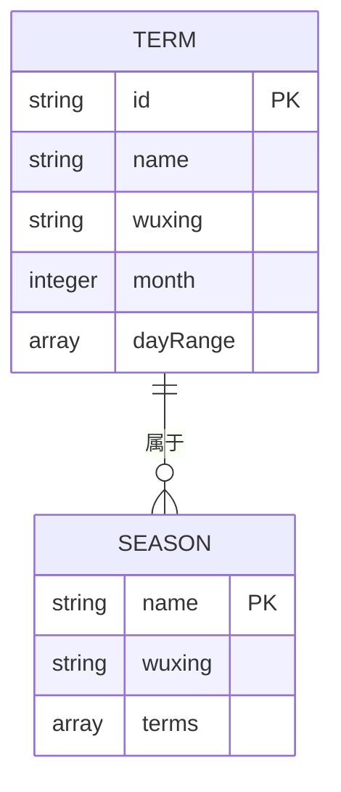

**图表来源**
- [solar-terms.json](file://data/solar-terms.json#L1-L42)

#### 字段详细说明

| 字段名 | 类型 | 必填 | 取值范围/示例 | 描述 | 业务规则 |
|--------|------|------|---------------|------|----------|
| id | string | 是 | "lichun", "yushui", ... | 节气唯一标识符 | 与方案数据关联 |
| name | string | 是 | "立春", "雨水" | 节气中文名称 | 传统节气名称 |
| wuxing | string | 是 | "wood", "fire", "earth", "metal", "water" | 五行属性 | 与节气对应的五行 |
| month | integer | 是 | 1-12 | 发生月份 | 公历月份 |
| dayRange | array | 是 | [3, 5], [18, 20] | 发生日期范围 | [开始日, 结束日] |
| seasons.spring/terms | array | 是 | ["lichun", "yushui", ...] | 季节包含的节气列表 | 每季6个节气 |

#### 时间顺序关系
节气按照时间顺序排列，用于计算节气间的距离：
- 立春 → 雨水 → 惊蛰 → 春分 → 清明 → 谷雨
- 立夏 → 小满 → 芒种 → 夏至 → 小暑 → 大暑
- 立秋 → 处暑 → 白露 → 秋分 → 寒露 → 霜降
- 立冬 → 小雪 → 大雪 → 冬至 → 小寒 → 大寒

**章节来源**
- [solar-terms.json](file://data/solar-terms.json#L1-L42)
- [engine.js](file://js/engine.js#L28-L34)

### 心愿模板数据模型 (intention-templates.json)
心愿模板提供了针对特定目标的穿搭建议，包含节气、颜色、材质等维度。

#### 基本结构
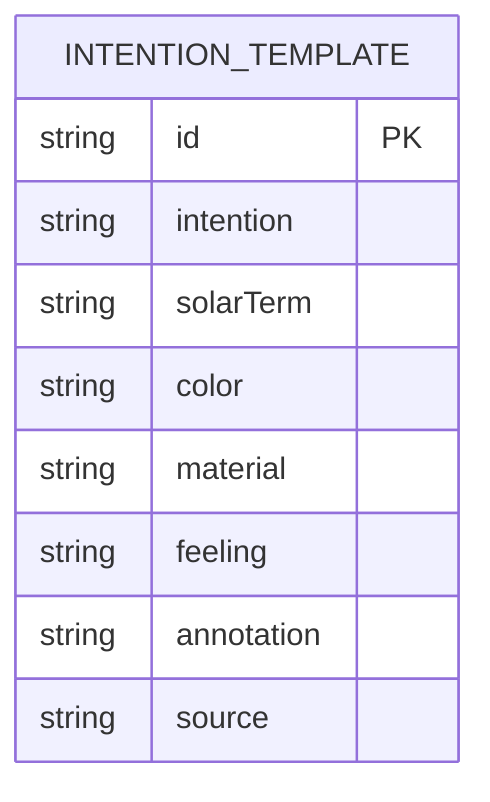

**图表来源**
- [intention-templates.json](file://data/intention-templates.json#L1-L253)

#### 字段详细说明

| 字段名 | 类型 | 必填 | 取值范围/示例 | 描述 | 业务规则 |
|--------|------|------|---------------|------|----------|
| id | string | 是 | "job_qingming", "gui_ren_lichun" | 模板唯一标识符 | 格式：{intention}_{solarTerm} |
| intention | string | 是 | "求职", "贵人运", "远行顺利" | 心愿类型 | 支持的意图类型 |
| solarTerm | string | 是 | "清明", "立春", ... | 适用的节气 | 必须为有效节气名称 |
| color | string | 是 | "素银", "月白" | 颜色描述 | 与节气相符的颜色 |
| material | string | 是 | "精纺羊绒", "真丝绉" | 材质描述 | 适合该节气的材质 |
| feeling | string | 是 | "澄澈感", "匀净感" | 感受描述 | 与心愿相符的感受 |
| annotation | string | 是 | 五行理论解释 | 理论注解 | 解释为什么这样搭配 |
| source | string | 是 | 《本草纲目·服器部》 | 文献出处 | 经典文献引用 |

#### 心愿类型分类
系统支持以下5种心愿类型：
1. **求职顺利** - 针对职业发展的建议
2. **贵人运** - 吸引贵人相助的建议
3. **远行顺利** - 旅行出行的建议
4. **静心专注** - 提升专注力的建议
5. **健康舒畅** - 促进健康的建议

**章节来源**
- [intention-templates.json](file://data/intention-templates.json#L1-L253)
- [engine.js](file://js/engine.js#L104-L119)

### 八字模板数据模型 (bazi-templates.json)
八字模板基于用户的出生信息，提供个性化的五行补益建议。

#### 基本结构
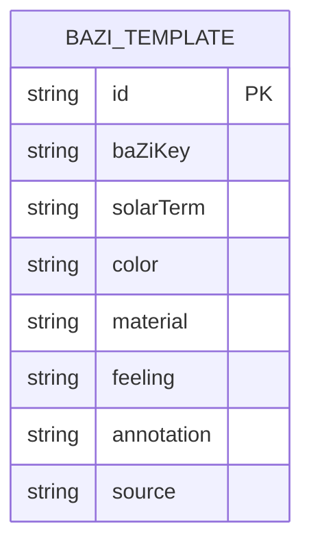

**图表来源**
- [bazi-templates.json](file://data/bazi-templates.json#L1-L103)

#### 字段详细说明

| 字段名 | 类型 | 必填 | 取值范围/示例 | 描述 | 业务规则 |
|--------|------|------|---------------|------|----------|
| id | string | 是 | "wood_2024", "fire_2025" | 模板唯一标识符 | 格式：{element}_{year} |
| baZiKey | string | 是 | "日主木旺｜2024甲辰年" | 八字关键信息 | 包含日主和年份信息 |
| solarTerm | string | 是 | "谷雨", "立夏", ... | 适用节气 | 与日主元素相关的节气 |
| color | string | 是 | "黛青", "樱桃红" | 颜色描述 | 补益日主元素的颜色 |
| material | string | 是 | "桑蚕丝", "冰丝混纺" | 材质描述 | 适合日主元素的材质 |
| feeling | string | 是 | "蕴藉感", "灼灼感" | 感受描述 | 体现五行平衡的感受 |
| annotation | string | 是 | 五行理论解释 | 理论注解 | 解释八字平衡原理 |
| source | string | 是 | 《周易·艮卦·象传》 | 文献出处 | 经典文献引用 |

#### 八字分类体系
模板按日主五行分为5类：
1. **日主木旺** - 需要火来泄秀，避免金来克
2. **日主火旺** - 需要水来克制，避免土来生助
3. **日主土旺** - 需要木来疏土，避免水来克
4. **日主金旺** - 需要火来炼金，避免水来生助
5. **日主水旺** - 需要土来制水，避免木来生助

**章节来源**
- [bazi-templates.json](file://data/bazi-templates.json#L1-L103)
- [bazi.js](file://js/bazi.js#L129-L172)

### 心愿配置数据模型 (wish-templates.json)
心愿配置定义了系统支持的心愿类型及其偏好设置。

#### 基本结构
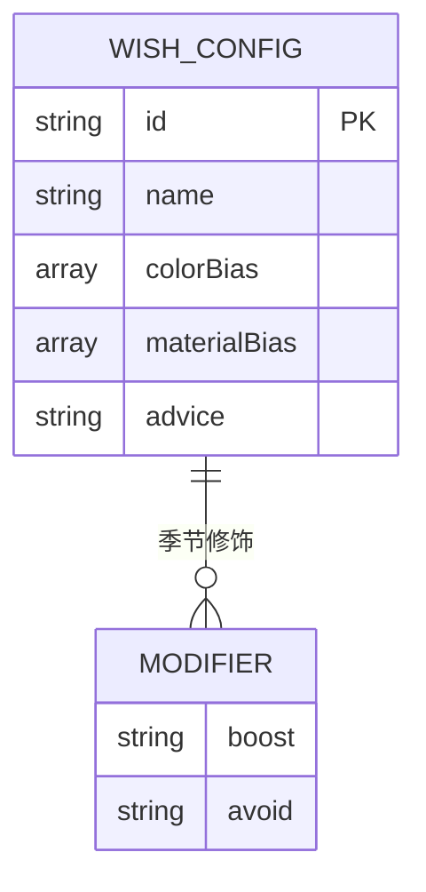

**图表来源**
- [wish-templates.json](file://data/wish-templates.json#L1-L47)

#### 字段详细说明

| 字段名 | 类型 | 必填 | 取值范围/示例 | 描述 | 业务规则 |
|--------|------|------|---------------|------|----------|
| id | string | 是 | "career", "guiren" | 心愿唯一标识符 | 与界面标签对应 |
| name | string | 是 | "求职顺利", "贵人运" | 心愿显示名称 | 用户可见的名称 |
| colorBias | array | 是 | ["wood", "fire"], ["earth", "metal"] | 颜色偏好 | 倾向于这些五行的颜色 |
| materialBias | array | 是 | ["棉", "麻"], ["丝", "绸"] | 材质偏好 | 倾向于包含这些关键词的材质 |
| advice | string | 是 | "选择清爽利落的色调..." | 使用建议 | 给用户的指导说明 |
| seasonModifiers | object | 是 | {"wood": {...}} | 季节修饰规则 | 动态调整推荐权重 |

#### 季节修饰规则
系统提供五行相生相克的动态修饰：
- **相生关系**：wood → fire → earth → metal → water → wood
- **相克关系**：wood → earth → water → fire → metal → wood
- **推荐权重**：相生关系获得1.2倍权重，相克关系获得0.8倍权重

**章节来源**
- [wish-templates.json](file://data/wish-templates.json#L1-L47)

## 架构概览
系统采用分层架构，各层职责明确：

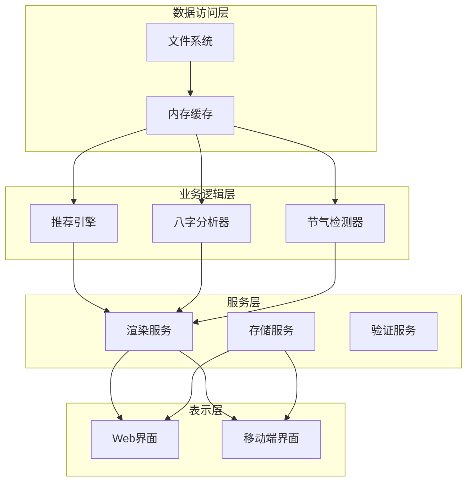

**图表来源**
- [engine.js](file://js/engine.js#L39-L79)
- [bazi.js](file://js/bazi.js#L182-L192)
- [solar-terms.js](file://js/solar-terms.js#L36-L103)

## 详细组件分析

### 推荐引擎组件 (engine.js)
推荐引擎是系统的核心，负责综合多种因素生成个性化推荐。

#### 核心算法流程
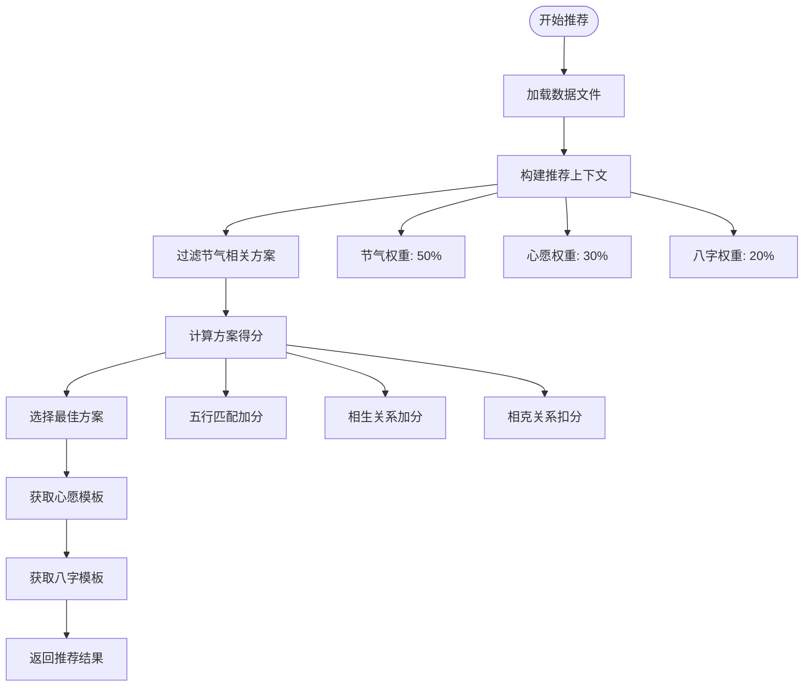

**图表来源**
- [engine.js](file://js/engine.js#L157-L259)

#### 评分机制
推荐引擎采用多维度评分系统：

1. **节气匹配度 (50%)**
   - 完全匹配：+100分
   - 相生关系：+60分
   - 相克关系：-40分

2. **心愿契合度 (30%)**
   - 基于心愿模板的节气匹配
   - 颜色和材质的偏好匹配

3. **八字平衡度 (20%)**
   - 根据日主五行进行补益
   - 相生关系获得额外加分

**章节来源**
- [engine.js](file://js/engine.js#L178-L259)

### 节气识别组件 (solar-terms.js)
节气识别组件负责确定当前的节气状态。

#### 节气检测算法
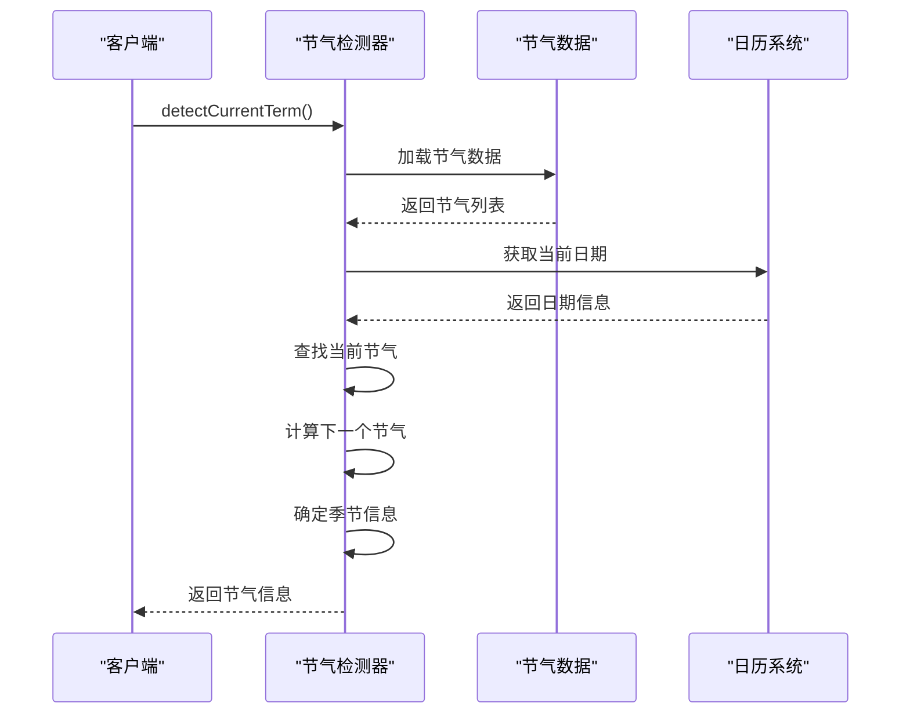

**图表来源**
- [solar-terms.js](file://js/solar-terms.js#L36-L103)

#### 时间处理机制
- 使用UTC+8时区标准
- 支持跨年节气判断
- 自动处理边界情况

**章节来源**
- [solar-terms.js](file://js/solar-terms.js#L36-L103)

### 八字分析组件 (bazi.js)
八字分析组件提供简化版的四柱八字计算。

#### 八字计算流程
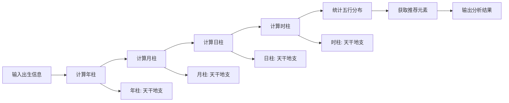

**图表来源**
- [bazi.js](file://js/bazi.js#L111-L192)

#### 五行统计算法
系统通过统计天干和地支的五行属性来分析个人命理：

1. **天干五行**：甲乙属木，丙丁属火，戊己属土，庚辛属金，壬癸属水
2. **地支五行**：根据地支特性分配五行属性
3. **平衡分析**：找出最弱和最强的五行元素

**章节来源**
- [bazi.js](file://js/bazi.js#L129-L172)

## 依赖关系分析

### 数据依赖关系
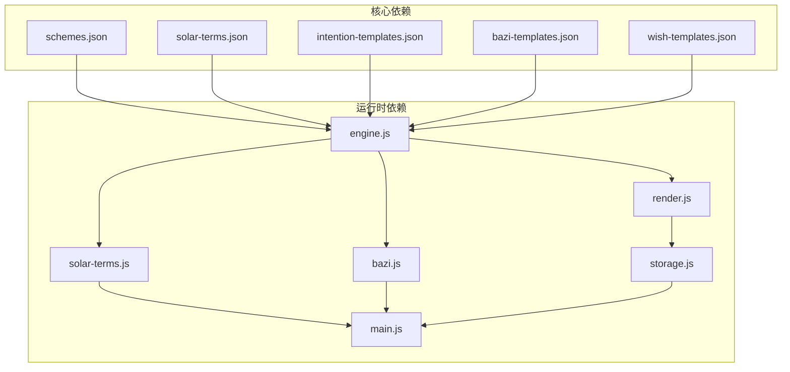

**图表来源**
- [engine.js](file://js/engine.js#L268-L334)
- [main.js](file://js/main.js#L202-L269)

### 模块间耦合度分析
- **低耦合**：各数据文件相互独立，无直接依赖
- **中等耦合**：业务逻辑层依赖数据层，但通过接口隔离
- **高内聚**：每个模块职责单一，功能完整

### 循环依赖检查
系统不存在循环依赖：
- 数据文件只提供静态数据
- 业务逻辑层只读取数据，不互相调用
- 表现层通过接口与业务层交互

**章节来源**
- [engine.js](file://js/engine.js#L268-L334)
- [main.js](file://js/main.js#L202-L269)

## 性能考虑

### 数据加载优化
1. **懒加载策略**：数据文件按需加载，减少初始启动时间
2. **缓存机制**：内存缓存已加载的数据，避免重复请求
3. **并发加载**：使用Promise.all并行加载多个数据文件

### 推荐算法优化
1. **预过滤**：先按节气过滤，减少后续计算量
2. **权重缓存**：相生相克关系预先计算并缓存
3. **多样性保证**：确保推荐方案的五行多样性

### 内存管理
1. **及时释放**：不再使用的数据及时从内存中清除
2. **对象池**：复用相似的对象，减少垃圾回收压力
3. **增量更新**：只更新变化的数据部分

## 故障排除指南

### 数据加载错误
**症状**：页面空白或报错
**可能原因**：
- JSON文件格式错误
- 文件路径不正确
- 网络请求失败

**解决方法**：
1. 检查JSON文件语法
2. 验证文件路径
3. 确认网络连接
4. 查看浏览器控制台错误

### 推荐结果异常
**症状**：推荐结果不符合预期
**可能原因**：
- 节气识别错误
- 八字计算错误
- 评分算法问题

**解决方法**：
1. 验证当前节气是否正确
2. 检查八字输入是否完整
3. 查看推荐权重配置
4. 检查相生相克关系

### 数据验证规则

#### JSON Schema验证
```javascript
// 方案数据验证规则
const schemeSchema = {
  type: "object",
  required: ["id", "termId", "rank", "color", "material", "feeling", "annotation", "source"],
  properties: {
    id: { type: "string", pattern: /^[a-z]+_[0-9]+$/ },
    termId: { type: "string", enum: validTermIds },
    rank: { type: "integer", minimum: 1, maximum: 3 },
    color: {
      type: "object",
      required: ["name", "hex", "wuxing"],
      properties: {
        name: { type: "string" },
        hex: { type: "string", pattern: /^#[0-9A-F]{6}$/ },
        wuxing: { type: "string", enum: ["wood", "fire", "earth", "metal", "water"] }
      }
    }
  }
};
```

#### 业务规则验证
1. **唯一性约束**：每个节气下方案ID必须唯一
2. **完整性约束**：所有必需字段必须存在
3. **一致性约束**：方案的五行属性必须与节气匹配
4. **范围约束**：排名必须在1-3之间

**章节来源**
- [engine.js](file://js/engine.js#L39-L79)

## 结论
本项目通过精心设计的数据模型和算法，成功实现了基于五行理论的智能穿搭建议系统。数据模型具有以下特点：

1. **结构清晰**：每个数据文件都有明确的职责和结构
2. **扩展性强**：支持新的节气、心愿类型和模板添加
3. **业务逻辑完整**：涵盖了从数据获取到推荐生成的完整流程
4. **用户体验良好**：提供个性化的穿搭建议和丰富的文化内涵

系统的数据模型为后续的功能扩展和维护提供了坚实的基础。

## 附录

### 数据更新和扩展指南

#### 添加新的节气方案
1. 在`schemes.json`中添加新的方案条目
2. 确保`termId`与现有节气ID一致
3. 设置合适的`rank`值（1-3）
4. 验证颜色、材质、感受的合理性

#### 添加新的心愿类型
1. 在`wish-templates.json`中添加新心愿配置
2. 在`intention-templates.json`中添加对应模板
3. 更新`engine.js`中的映射关系
4. 在UI中添加新的心愿标签

#### 扩展八字模板
1. 在`bazi-templates.json`中添加新模板
2. 确保`baZiKey`包含正确的日主信息
3. 验证与节气的对应关系
4. 测试推荐算法的准确性

#### 数据验证清单
- [ ] JSON语法正确
- [ ] 字段类型符合要求
- [ ] 取值范围在允许范围内
- [ ] 业务规则得到满足
- [ ] 数据完整性得到保证
- [ ] 性能影响评估完成

### 版本兼容性说明
- **数据格式**：保持向后兼容，新增字段不影响旧版本
- **API接口**：业务逻辑层提供稳定的接口契约
- **存储格式**：本地存储格式保持稳定
- **样式兼容**：CSS样式不依赖具体数据结构

### 维护最佳实践
1. **备份重要数据**：定期备份JSON文件
2. **测试新变更**：在开发环境充分测试
3. **监控性能指标**：关注加载时间和响应速度
4. **用户反馈收集**：持续改进推荐质量
5. **文档同步更新**：保持文档与代码一致