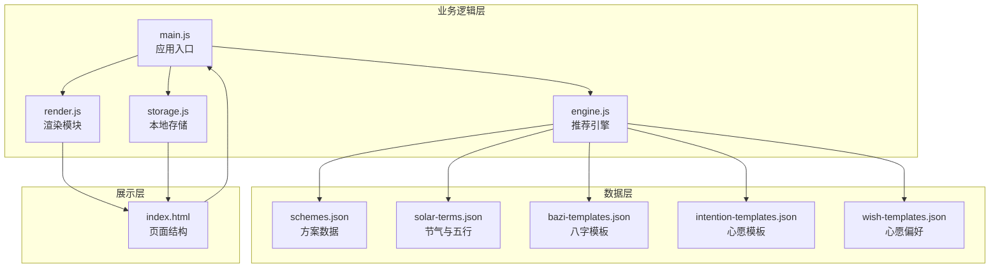
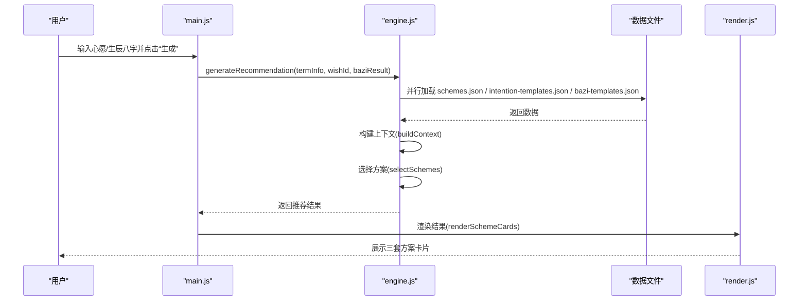
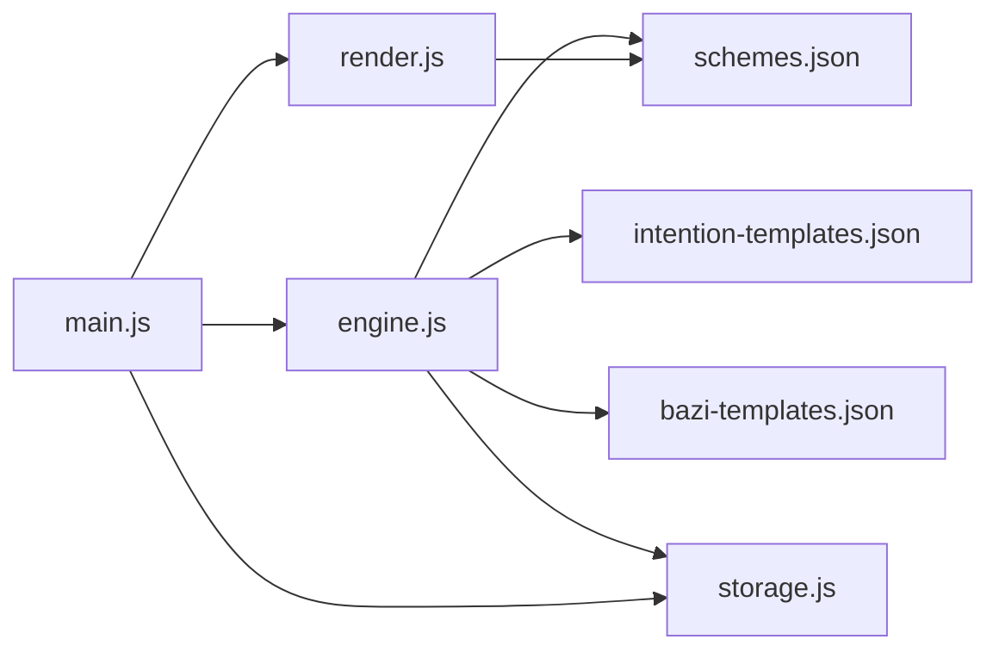
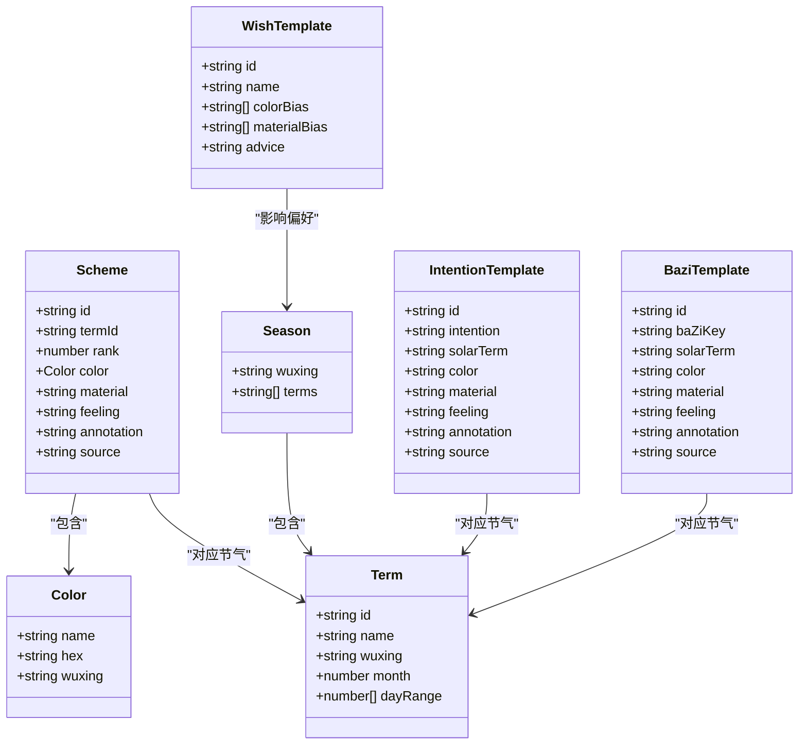

# 穿搭方案数据模型

<cite>
**本文档引用的文件**
- [schemes.json](file://data/schemes.json)
- [solar-terms.json](file://data/solar-terms.json)
- [bazi-templates.json](file://data/bazi-templates.json)
- [intention-templates.json](file://data/intention-templates.json)
- [wish-templates.json](file://data/wish-templates.json)
- [engine.js](file://js/engine.js)
- [main.js](file://js/main.js)
- [render.js](file://js/render.js)
- [storage.js](file://js/storage.js)
- [index.html](file://index.html)
</cite>

## 目录
1. [简介](#简介)
2. [项目结构](#项目结构)
3. [核心组件](#核心组件)
4. [架构总览](#架构总览)
5. [详细组件分析](#详细组件分析)
6. [依赖关系分析](#依赖关系分析)
7. [性能考虑](#性能考虑)
8. [故障排查指南](#故障排查指南)
9. [结论](#结论)
10. [附录](#附录)

## 简介
本文件系统性梳理“穿搭方案数据模型”，围绕 schemes.json 的完整结构与语义进行深入解析，涵盖：
- 方案数组结构与每个方案对象的字段定义
- 颜色字段的颜色名称、十六进制值与五行属性映射关系
- 材质字段的材料类型与触感描述
- 注释字段的文化来源与历史背景
- 方案数据的组织规则、排序逻辑与节气对应关系
- 数据验证规则、字段约束条件与业务规则说明
- 开发者数据查询、筛选与使用的实际示例
- 如何扩展新的穿搭方案的指南

## 项目结构
该项目采用前端单页应用架构，数据层与展示层分离，核心数据位于 data/ 目录，业务逻辑集中在 js/ 目录，页面结构由 index.html 提供。

图表来源
- [index.html](file://index.html#L1-L236)
- [engine.js](file://js/engine.js#L1-L335)
- [main.js](file://js/main.js#L1-L317)
- [render.js](file://js/render.js#L1-L272)
- [storage.js](file://js/storage.js#L1-L116)
- [schemes.json](file://data/schemes.json#L1-L509)
- [solar-terms.json](file://data/solar-terms.json#L1-L42)
- [bazi-templates.json](file://data/bazi-templates.json#L1-L103)
- [intention-templates.json](file://data/intention-templates.json#L1-L253)
- [wish-templates.json](file://data/wish-templates.json#L1-L47)

章节来源
- [index.html](file://index.html#L1-L236)
- [engine.js](file://js/engine.js#L1-L335)
- [main.js](file://js/main.js#L1-L317)
- [render.js](file://js/render.js#L1-L272)
- [storage.js](file://js/storage.js#L1-L116)

## 核心组件
- 方案数据模型：schemes.json 中的 schemes 数组，每个元素代表一条穿搭方案
- 节气与五行：solar-terms.json 定义了二十四节气及其对应的五行属性
- 心愿模板：intention-templates.json 与 wish-templates.json 提供心愿偏好与节气匹配
- 八字模板：bazi-templates.json 基于日主强弱给出推荐
- 推荐引擎：engine.js 负责加载数据、构建上下文、评分与选择方案
- 渲染与交互：render.js 负责视图渲染与用户交互，main.js 作为应用入口协调各模块

章节来源
- [schemes.json](file://data/schemes.json#L1-L509)
- [solar-terms.json](file://data/solar-terms.json#L1-L42)
- [intention-templates.json](file://data/intention-templates.json#L1-L253)
- [wish-templates.json](file://data/wish-templates.json#L1-L47)
- [bazi-templates.json](file://data/bazi-templates.json#L1-L103)
- [engine.js](file://js/engine.js#L1-L335)
- [render.js](file://js/render.js#L1-L272)
- [main.js](file://js/main.js#L1-L317)

## 架构总览
推荐流程从用户输入开始，结合当前节气、心愿与八字，通过评分与选择算法生成三套方案，并渲染到页面。

图表来源
- [main.js](file://js/main.js#L200-L244)
- [engine.js](file://js/engine.js#L268-L310)
- [render.js](file://js/render.js#L114-L127)

## 详细组件分析

### 方案数据模型：schemes.json 结构与字段定义
- 文件位置：data/schemes.json
- 数据结构：顶层包含一个 schemes 数组，数组元素为方案对象
- 方案对象字段：
  - id：字符串，唯一标识符，格式为“节气缩写_序号”，例如 "lichun_01"
  - termId：字符串，所属节气的缩写ID，与 solar-terms.json 中 terms[].id 对应
  - rank：整数，同一节气下方案的排序优先级（1、2、3）
  - color：对象，包含 name（颜色名称）、hex（十六进制值）、wuxing（五行属性）
  - material：字符串，材质类型
  - feeling：字符串，穿着感受描述
  - annotation：字符串，文化解读与五行关联
  - source：字符串，典籍出处

字段约束与业务规则：
- id 必须唯一且符合“termId_序号”的命名规范
- termId 必须与 solar-terms.json 中的节气ID一致
- rank 取值范围为 1..3，同一节气下应有且仅有三个不同 rank 的方案
- color.wuxing 必须为 "wood" | "fire" | "earth" | "metal" | "water"
- color.name 与 hex 需一一对应，且与 wuxing 保持文化一致性
- material 与 feeling、annotation 需在文化层面形成合理搭配
- annotation 与 source 需指向可靠的古典文献或传统理论

章节来源
- [schemes.json](file://data/schemes.json#L1-L509)

### 颜色字段：名称、十六进制值与五行映射
- 颜色名称：多为传统色彩名，如“嫩芽绿”“浅杏粉”“烟青”等
- 十六进制值：标准十六进制颜色码，用于界面渲染与视觉呈现
- 五行映射：每种颜色都标注 wuxing，体现与五行情志的对应关系
  - 木：春天、生发、绿色系
  - 火：夏天、长养、红色系
  - 土：长夏、化育、黄/棕/褐系
  - 金：秋天、收敛、白色/银灰系
  - 水：冬天、闭藏、黑色/深蓝系

示例映射关系（节选）：
- “立春”节气的三种颜色分别对应木、火、土，体现春回大地的生发之气
- “夏至”节气的三种颜色分别对应火、水、金，体现阳极阴生的转化

章节来源
- [schemes.json](file://data/schemes.json#L1-L509)
- [solar-terms.json](file://data/solar-terms.json#L1-L42)

### 材质字段：类型与触感描述
- 材质类型：天然纤维与现代面料并存，如“天丝棉”“桑蚕丝”“亚麻混纺”“竹纤维”“真丝”等
- 触感描述：feeling 字段强调穿着体验，如“轻盈感”“温润感”“扎根感”“流动感”“柔软感”等
- 文化契合度：材质与节气、五行、触感需在传统理论中有据可依

章节来源
- [schemes.json](file://data/schemes.json#L1-L509)

### 注释字段：文化来源与历史背景
- annotation：对方案的五行解读与文化寓意，体现与节气、脏腑、情志的关系
- source：标注典籍出处，如《礼记》《本草纲目》《黄帝内经》等
- 作用：增强方案的文化权威性与可溯源性

章节来源
- [schemes.json](file://data/schemes.json#L1-L509)

### 方案组织规则、排序逻辑与节气对应
- 组织规则：
  - 按节气分组：每个 termId 对应一组方案
  - 每个节气包含三条方案，rank 为 1..3
- 排序逻辑：
  - 当前节气优先：若存在与当前节气完全匹配的方案，则优先选取
  - 五行相生加分：若方案的 wuxing 与当前节气的 wuxing 存在相生关系，则给予一定分数
  - 八字匹配：若用户提供八字，方案的 wuxing 与日主强弱推荐的元素相合或相生，亦可加分
- 节气对应：
  - 通过 solar-terms.json 的 terms 数组与 seasons 分组，明确每个节气的五行属性与季节归属

章节来源
- [engine.js](file://js/engine.js#L178-L259)
- [solar-terms.json](file://data/solar-terms.json#L1-L42)

### 数据验证规则与字段约束
- 必填字段：id、termId、rank、color.name、color.hex、color.wuxing、material、feeling、annotation、source
- 取值范围：
  - rank ∈ {1, 2, 3}
  - color.wuxing ∈ {"wood","fire","earth","metal","water"}
- 一致性校验：
  - id 与 termId 的组合需与节气顺序一致
  - annotation 与 source 需在文化层面自洽
- 互斥与互补：
  - 不同 rank 的方案应覆盖不同的触感与材质，避免重复

章节来源
- [schemes.json](file://data/schemes.json#L1-L509)
- [engine.js](file://js/engine.js#L178-L259)

### 开发者使用指南：查询、筛选与扩展
- 查询与筛选（示例路径）：
  - 获取当前节气下所有方案：[engine.js](file://js/engine.js#L218-L224)
  - 按五行相生关系评分：[engine.js](file://js/engine.js#L178-L199)
  - 获取最佳心愿模板：[engine.js](file://js/engine.js#L104-L119)
  - 获取最佳八字模板：[engine.js](file://js/engine.js#L124-L152)
  - 渲染方案卡片：[render.js](file://js/render.js#L114-L154)
- 扩展新方案步骤：
  1. 在 schemes.json 的 schemes 数组中新增一条方案对象，确保字段完整
  2. 为该方案编写 color.name、color.hex、color.wuxing、material、feeling、annotation、source
  3. 确保 termId 与 solar-terms.json 中的节气ID一致
  4. 为同一节气补充 rank=2、rank=3 的两条方案，保证三套方案齐全
  5. 若涉及心愿或八字模板，同步更新 intention-templates.json 或 bazi-templates.json
  6. 在 wish-templates.json 中根据需要调整心愿偏好的 colorBias/materialBias
  7. 通过 engine.js 的评分与选择逻辑验证新方案是否能被正确推荐

章节来源
- [engine.js](file://js/engine.js#L1-L335)
- [render.js](file://js/render.js#L1-L272)
- [schemes.json](file://data/schemes.json#L1-L509)
- [solar-terms.json](file://data/solar-terms.json#L1-L42)
- [intention-templates.json](file://data/intention-templates.json#L1-L253)
- [bazi-templates.json](file://data/bazi-templates.json#L1-L103)
- [wish-templates.json](file://data/wish-templates.json#L1-L47)

## 依赖关系分析
- 数据依赖：
  - engine.js 依赖 schemes.json、intention-templates.json、bazi-templates.json
  - 渲染依赖 schemes.json 的字段进行展示
- 节气依赖：
  - solar-terms.json 提供节气顺序、季节分组与五行名称映射
- 用户偏好依赖：
  - wish-templates.json 提供心愿偏好与五行增减关系
- 本地存储依赖：
  - storage.js 将用户输入与结果持久化到本地

图表来源
- [engine.js](file://js/engine.js#L1-L335)
- [render.js](file://js/render.js#L1-L272)
- [main.js](file://js/main.js#L1-L317)
- [schemes.json](file://data/schemes.json#L1-L509)
- [intention-templates.json](file://data/intention-templates.json#L1-L253)
- [bazi-templates.json](file://data/bazi-templates.json#L1-L103)
- [solar-terms.json](file://data/solar-terms.json#L1-L42)

章节来源
- [engine.js](file://js/engine.js#L1-L335)
- [render.js](file://js/render.js#L1-L272)
- [main.js](file://js/main.js#L1-L317)

## 性能考虑
- 异步加载：engine.js 使用 Promise.all 并行加载多个数据源，减少首屏等待
- 本地存储：main.js 与 storage.js 结合，避免重复请求与计算
- 动画与渲染：render.js 为卡片添加动画延迟，提升用户体验但需注意大量DOM操作的性能影响
- 建议：
  - 控制方案数量规模，避免一次性渲染过多DOM节点
  - 对高频查询（如按节气过滤）可考虑内存缓存
  - 图片上传与压缩在移动端可能消耗较多资源，建议限制尺寸与并发

## 故障排查指南
- 无法加载方案数据：
  - 检查 schemes.json 是否存在且格式正确
  - 确认 engine.js 的 loadSchemes() 是否正常执行
- 节气显示异常：
  - 检查 solar-terms.json 的 terms 与 seasons 字段是否完整
  - 确认 TERM_ORDER 与 TERM_NAME_MAP 是否与节气顺序一致
- 心愿模板不生效：
  - 检查 wish-templates.json 的 wishes 数组与 seasonModifiers
  - 确认 intention-templates.json 的 intention 与 solarTerm 字段
- 八字模板不匹配：
  - 检查 bazi-templates.json 的 baZiKey 与年份匹配逻辑
- 本地存储问题：
  - 使用 storage.js 的 get/set/remove 方法检查键名与序列化

章节来源
- [engine.js](file://js/engine.js#L39-L79)
- [main.js](file://js/main.js#L200-L244)
- [storage.js](file://js/storage.js#L1-L116)

## 结论
本数据模型以“节气—五行—色彩—材质—触感—文化解读”为主线，构建了完整的穿搭建议体系。通过严格的字段约束、评分与选择算法，以及完善的本地存储与渲染机制，实现了从数据到体验的一体化闭环。开发者可据此快速扩展新方案与模板，同时保持文化一致性与用户体验的稳定性。

## 附录

### 数据模型类图（代码级）

图表来源
- [schemes.json](file://data/schemes.json#L1-L509)
- [solar-terms.json](file://data/solar-terms.json#L1-L42)
- [intention-templates.json](file://data/intention-templates.json#L1-L253)
- [bazi-templates.json](file://data/bazi-templates.json#L1-L103)
- [wish-templates.json](file://data/wish-templates.json#L1-L47)