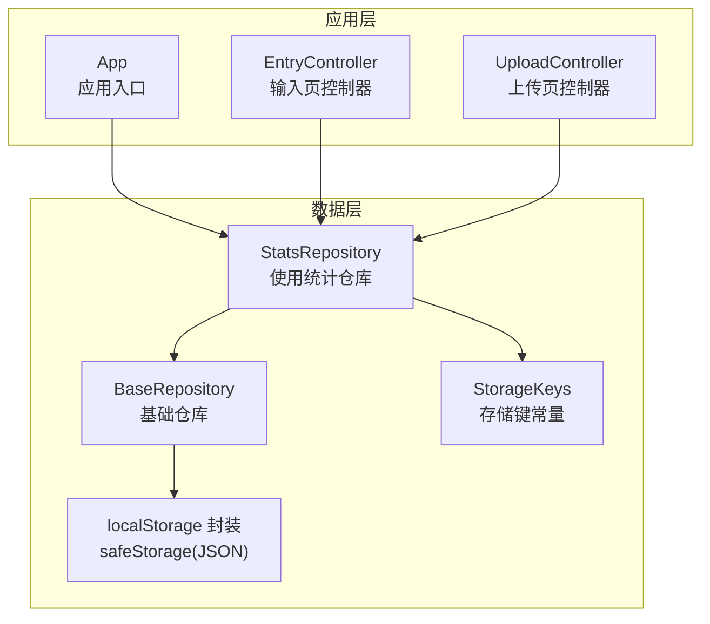
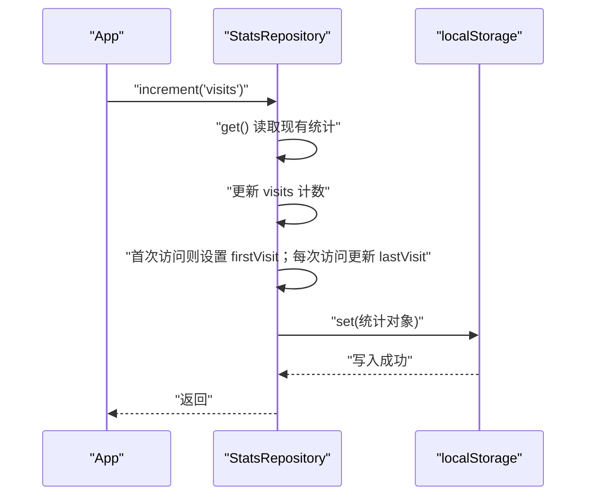
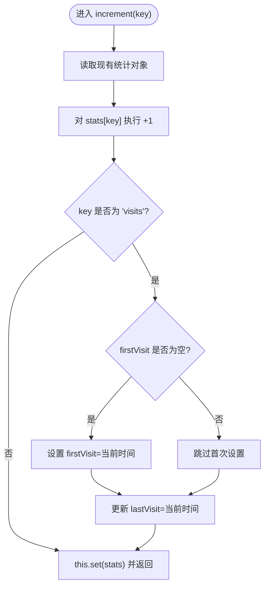
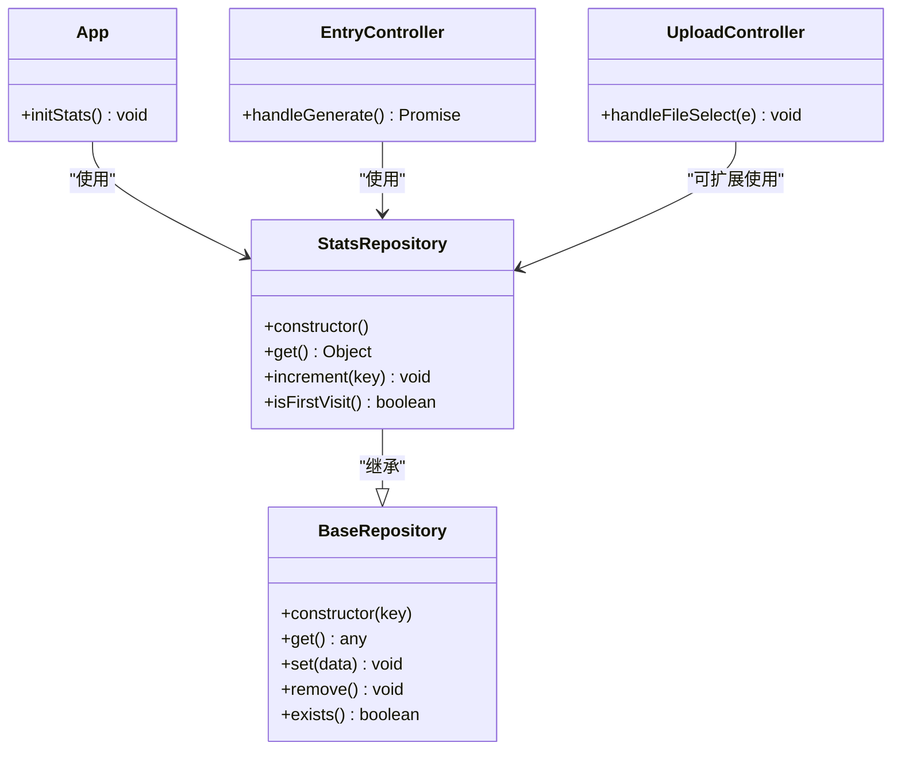

# 使用统计仓库

<cite>
**本文引用的文件**
- [js/data/repository.js](file://js/data/repository.js)
- [js/core/app.js](file://js/core/app.js)
- [js/controllers/entry.js](file://js/controllers/entry.js)
- [js/controllers/upload.js](file://js/controllers/upload.js)
- [js/data/data-manager.js](file://js/data/data-manager.js)
</cite>

## 目录
1. [简介](#简介)
2. [项目结构](#项目结构)
3. [核心组件](#核心组件)
4. [架构总览](#架构总览)
5. [组件详解](#组件详解)
6. [依赖关系分析](#依赖关系分析)
7. [性能与可靠性](#性能与可靠性)
8. [故障排查指南](#故障排查指南)
9. [结论](#结论)
10. [附录](#附录)

## 简介
本文件围绕使用统计仓库（StatsRepository）进行系统化技术文档整理，重点涵盖以下方面：
- 统计数据结构与计数机制：visits、generates、uploads 的含义与存储格式
- increment() 方法的实现原理：计数器更新与时间戳管理
- 首次访问检测机制与统计数据初始化流程
- 统计数据的聚合查询与分析思路
- 应用场景：用户活跃度分析与产品使用洞察
- 数据导出与备份策略建议

## 项目结构
StatsRepository 属于数据层仓库模块，位于统一的数据仓库抽象之上，通过键值常量与安全存储封装实现持久化。

图表来源
- [js/data/repository.js](file://js/data/repository.js#L46-L81)
- [js/data/repository.js](file://js/data/repository.js#L9-L21)
- [js/data/repository.js](file://js/data/repository.js#L292-L337)
- [js/core/app.js](file://js/core/app.js#L136-L139)
- [js/controllers/entry.js](file://js/controllers/entry.js#L178-L179)
- [js/controllers/upload.js](file://js/controllers/upload.js#L1-L118)

章节来源
- [js/data/repository.js](file://js/data/repository.js#L9-L21)
- [js/data/repository.js](file://js/data/repository.js#L46-L81)
- [js/data/repository.js](file://js/data/repository.js#L292-L337)

## 核心组件
- StatsRepository：负责使用统计的读取、写入、计数与首次访问判断
- BaseRepository：提供 get/set/remove/exists 等通用存储操作
- StorageKeys：集中管理本地存储键名，确保一致性
- 安全存储封装：对 localStorage 进行安全包装，避免异常导致崩溃

章节来源
- [js/data/repository.js](file://js/data/repository.js#L9-L21)
- [js/data/repository.js](file://js/data/repository.js#L46-L81)
- [js/data/repository.js](file://js/data/repository.js#L292-L337)

## 架构总览
StatsRepository 作为单一职责的数据仓库，向上提供稳定的 API，向下依赖安全存储封装与键常量。应用入口与各控制器通过依赖注入的方式使用该仓库。

图表来源
- [js/core/app.js](file://js/core/app.js#L136-L139)
- [js/data/repository.js](file://js/data/repository.js#L315-L327)

## 组件详解

### 数据结构与存储格式
- 统计对象包含以下字段：
  - visits：访问次数（整型）
  - generates：生成次数（整型）
  - uploads：上传次数（整型）
  - firstVisit：首次访问时间（ISO 8601 字符串）
  - lastVisit：最近访问时间（ISO 8601 字符串）
- 默认初始化：当键不存在时，get() 返回上述字段的初始值，确保后续 increment() 可直接累加

章节来源
- [js/data/repository.js](file://js/data/repository.js#L301-L308)

### 计数机制与 increment() 实现
- 基本流程
  - 读取当前统计对象
  - 对指定键执行自增（若键不存在则从 0 开始）
  - 若键为 visits：
    - 首次访问时设置 firstVisit
    - 每次访问更新 lastVisit
  - 写回统计对象
- 时间戳管理
  - 使用 ISO 8601 字符串记录时间，便于跨设备展示与排序
- 错误处理
  - 通过安全存储封装避免 JSON 解析/序列化异常导致的崩溃

图表来源
- [js/data/repository.js](file://js/data/repository.js#L315-L327)

章节来源
- [js/data/repository.js](file://js/data/repository.js#L315-L327)

### 首次访问检测与初始化
- 首次访问检测
  - 通过 isFirstVisit() 判断 firstVisit 是否为空
- 初始化过程
  - get() 在键不存在时返回默认统计对象，确保后续 increment() 可用
- 应用入口中的使用
  - App.initStats() 在应用启动时调用 increment('visits')，从而完成首次访问标记与时间戳初始化

章节来源
- [js/data/repository.js](file://js/data/repository.js#L333-L336)
- [js/data/repository.js](file://js/data/repository.js#L301-L308)
- [js/core/app.js](file://js/core/app.js#L136-L139)

### 统计数据的聚合查询与分析
- 当前实现能力
  - 提供单键自增与时间戳维护
  - 不直接提供跨键聚合或复杂分析方法
- 建议的分析思路
  - 访问趋势：基于 lastVisit-firstVisit 区间内的 visits 聚合
  - 生成行为：基于 generates 与 visits 的比率评估转化
  - 上传行为：基于 uploads 与 visits 的比率评估参与度
- 数据概览与导出（参考）
  - data-manager 提供数据概览与大小统计，可作为导出/备份的参考实现

章节来源
- [js/data/data-manager.js](file://js/data/data-manager.js#L235-L271)

### 应用场景
- 用户活跃度分析
  - visits：衡量日活/月活与回访率
  - firstVisit/lastVisit：计算首次到访与最近到访间隔
- 产品使用洞察
  - generates：评估核心功能使用频率
  - uploads：评估用户内容贡献度
- 行为路径优化
  - 结合 visits 与 generates 分析“访问-生成”转化漏斗

章节来源
- [js/core/app.js](file://js/core/app.js#L136-L139)
- [js/controllers/entry.js](file://js/controllers/entry.js#L178-L179)

### 使用统计的触发点
- 应用入口
  - App.initStats() 在应用启动时增加 visits
- 生成推荐
  - EntryController.handleGenerate() 成功生成后增加 generates
- 上传功能
  - UploadController 用于上传图片（不直接调用 statsRepo.increment），如需统计可扩展在此处增加 uploads 计数

章节来源
- [js/core/app.js](file://js/core/app.js#L136-L139)
- [js/controllers/entry.js](file://js/controllers/entry.js#L178-L179)
- [js/controllers/upload.js](file://js/controllers/upload.js#L80-L93)

## 依赖关系分析

图表来源
- [js/data/repository.js](file://js/data/repository.js#L46-L81)
- [js/data/repository.js](file://js/data/repository.js#L292-L337)
- [js/core/app.js](file://js/core/app.js#L136-L139)
- [js/controllers/entry.js](file://js/controllers/entry.js#L178-L179)
- [js/controllers/upload.js](file://js/controllers/upload.js#L80-L93)

章节来源
- [js/data/repository.js](file://js/data/repository.js#L46-L81)
- [js/data/repository.js](file://js/data/repository.js#L292-L337)
- [js/core/app.js](file://js/core/app.js#L136-L139)
- [js/controllers/entry.js](file://js/controllers/entry.js#L178-L179)
- [js/controllers/upload.js](file://js/controllers/upload.js#L80-L93)

## 性能与可靠性
- 性能特征
  - 本地存储读写为 O(1)，统计更新为原子性自增，开销极低
  - 时间戳采用字符串存储，解析成本可忽略
- 可靠性保障
  - 安全存储封装避免 JSON 异常导致的崩溃
  - get() 默认返回完整结构，减少分支判断与潜在错误
- 建议
  - 如需高并发或多标签页共享统计，考虑引入 IndexedDB 或服务端同步
  - 对于大规模数据，建议定期导出与归档

[本节为通用指导，无需列出具体文件来源]

## 故障排查指南
- 现象：统计始终为 0
  - 排查：确认 get() 是否正确返回默认结构；检查键名是否匹配 StorageKeys.USAGE_STATS
- 现象：首次访问时间未设置
  - 排查：确认 App.initStats() 是否在应用启动时调用；检查 increment('visits') 是否被执行
- 现象：时间戳异常或乱序
  - 排查：确认系统时间；检查是否手动修改了存储值
- 现象：数据丢失
  - 排查：确认浏览器隐私设置与存储配额；结合数据概览工具定位

章节来源
- [js/data/repository.js](file://js/data/repository.js#L9-L21)
- [js/data/repository.js](file://js/data/repository.js#L301-L308)
- [js/core/app.js](file://js/core/app.js#L136-L139)
- [js/data/data-manager.js](file://js/data/data-manager.js#L235-L271)

## 结论
StatsRepository 以简洁的结构实现了核心使用统计能力：访问、生成、上传三类计数与时间戳管理。其设计遵循单一职责与依赖注入原则，易于扩展与维护。建议在保持现有 API 稳定的前提下，按需扩展聚合分析与导出备份能力，以支撑更深入的产品洞察。

[本节为总结性内容，无需列出具体文件来源]

## 附录

### 统计字段定义
- visits：访问次数（整型）
- generates：生成次数（整型）
- uploads：上传次数（整型）
- firstVisit：首次访问时间（ISO 8601 字符串）
- lastVisit：最近访问时间（ISO 8601 字符串）

章节来源
- [js/data/repository.js](file://js/data/repository.js#L301-L308)

### 导出与备份策略（建议）
- 导出
  - 通过安全存储封装读取统计对象并序列化为 JSON
  - 可参考数据概览工具的遍历与格式化逻辑
- 备份
  - 定期将统计对象写入安全位置（如同目录下的备份文件）
  - 备份前进行完整性校验与版本标记
- 恢复
  - 从备份文件反序列化后写回存储键
  - 恢复后验证时间戳与计数一致性

章节来源
- [js/data/repository.js](file://js/data/repository.js#L24-L41)
- [js/data/data-manager.js](file://js/data/data-manager.js#L235-L271)