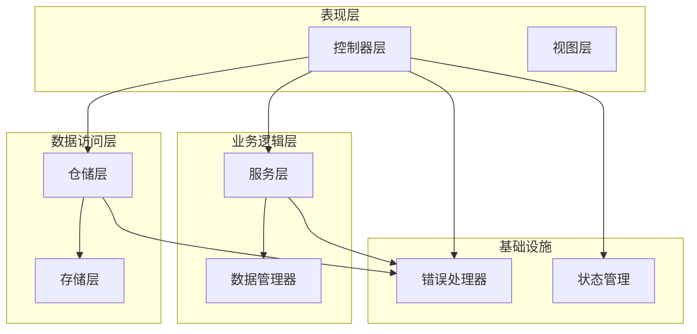
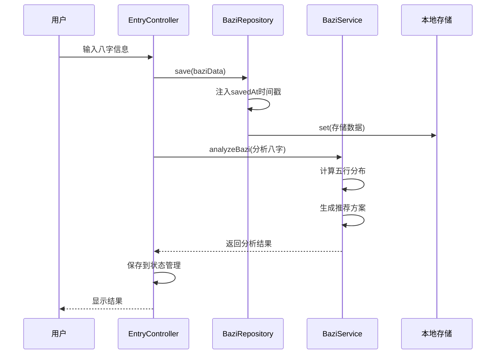
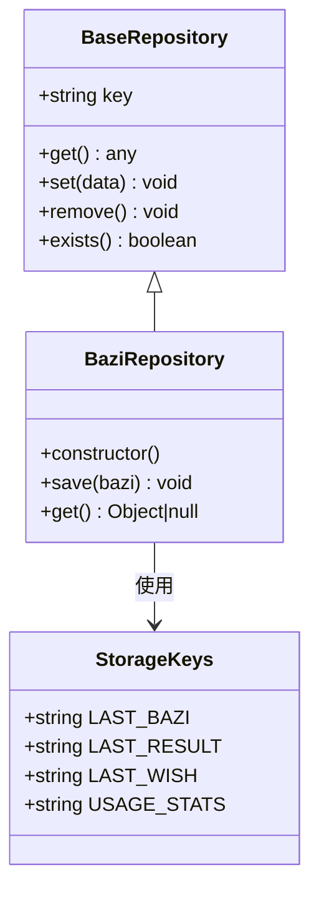
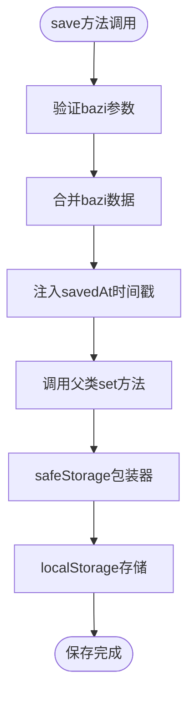
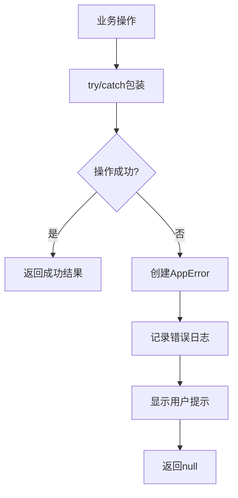
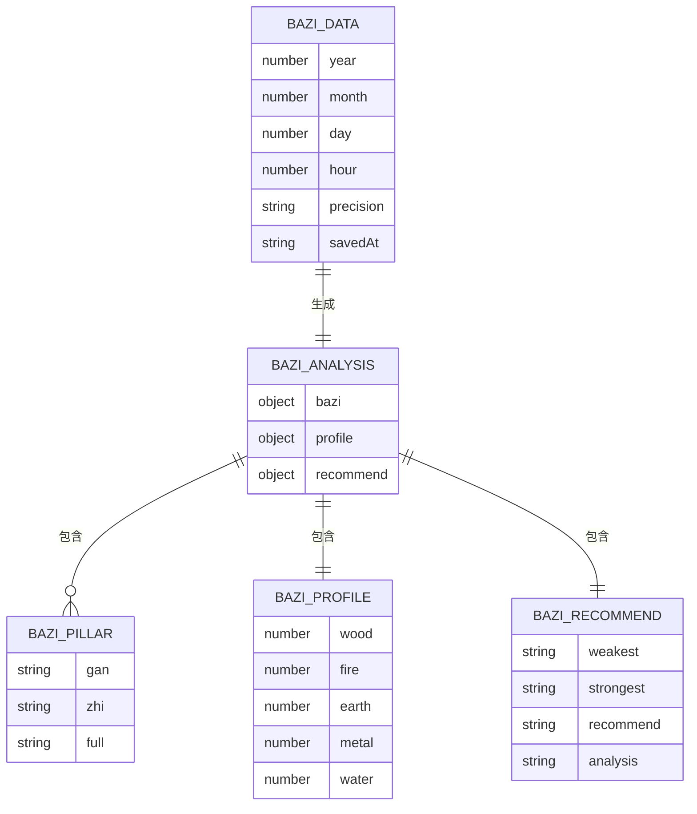
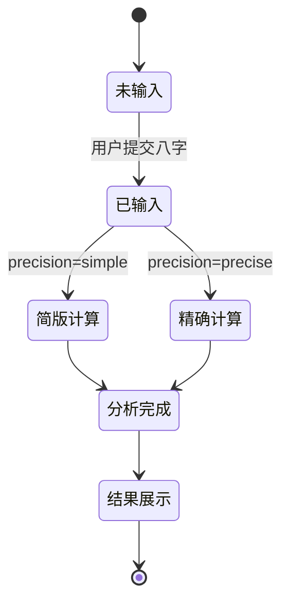
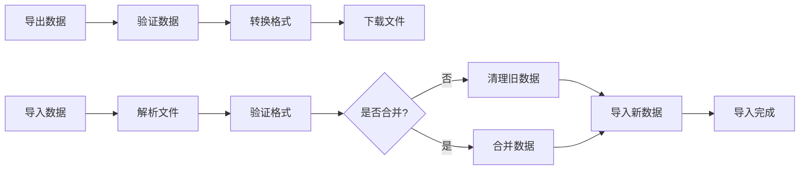
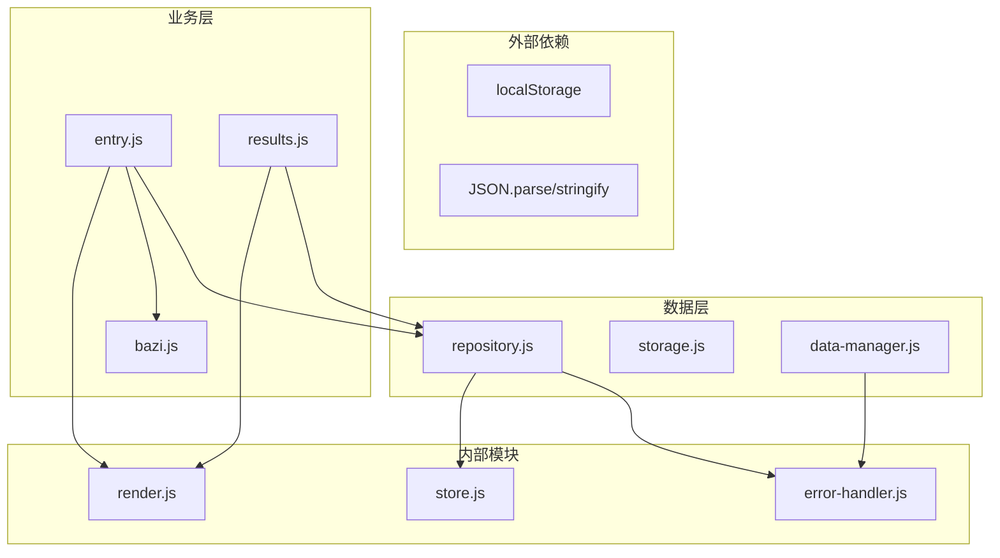

# 八字数据仓库

<cite>
**本文档引用的文件**
- [repository.js](file://js/data/repository.js)
- [data-manager.js](file://js/data/data-manager.js)
- [bazi.js](file://js/services/bazi.js)
- [storage.js](file://js/data/storage.js)
- [entry.js](file://js/controllers/entry.js)
- [results.js](file://js/controllers/results.js)
- [error-handler.js](file://js/core/error-handler.js)
- [store.js](file://js/core/store.js)
- [bazi-templates.json](file://data/bazi-templates.json)
</cite>

## 目录
1. [简介](#简介)
2. [项目结构](#项目结构)
3. [核心组件](#核心组件)
4. [架构概览](#架构概览)
5. [详细组件分析](#详细组件分析)
6. [依赖关系分析](#依赖关系分析)
7. [性能考虑](#性能考虑)
8. [故障排除指南](#故障排除指南)
9. [结论](#结论)
10. [附录](#附录)

## 简介
八字数据仓库是五行穿搭建议系统中的关键数据管理模块，负责存储和管理用户的八字信息。该模块采用仓储模式设计，提供了安全的本地存储机制、数据验证和错误处理，以及与命理服务的深度集成。

八字数据仓库不仅存储用户的出生信息，还通过时间戳管理确保数据的新鲜度，并与命理分析服务协同工作，为用户提供个性化的穿搭建议。

## 项目结构
该项目采用模块化架构，主要分为以下几个层次：

**图表来源**
- [repository.js](file://js/data/repository.js#L1-L394)
- [data-manager.js](file://js/data/data-manager.js#L1-L376)
- [entry.js](file://js/controllers/entry.js#L1-L241)

**章节来源**
- [repository.js](file://js/data/repository.js#L1-L394)
- [data-manager.js](file://js/data/data-manager.js#L1-L376)

## 核心组件
八字数据仓库系统包含以下核心组件：

### 1. BaziRepository - 八字仓储
BaziRepository是专门处理八字数据的仓储类，继承自BaseRepository基类，提供专门的八字数据存取功能。

### 2. BaseRepository - 基础仓储
BaseRepository提供了通用的存储接口，包括get、set、remove等基本操作，为所有仓储类提供统一的抽象层。

### 3. StorageKeys - 存储键常量
定义了所有存储键的常量，包括LAST_BAZI、LAST_RESULT等，确保键名的一致性和可维护性。

### 4. safeStorage - 安全存储包装器
提供统一的错误处理机制，封装localStorage操作，处理存储空间不足、隐私模式等异常情况。

**章节来源**
- [repository.js](file://js/data/repository.js#L46-L81)
- [repository.js](file://js/data/repository.js#L264-L287)
- [repository.js](file://js/data/repository.js#L9-L21)

## 架构概览
八字数据仓库采用分层架构设计，实现了数据持久化、业务逻辑分离和错误处理的统一管理。

**图表来源**
- [entry.js](file://js/controllers/entry.js#L131-L189)
- [repository.js](file://js/data/repository.js#L273-L278)
- [bazi.js](file://js/services/bazi.js#L188-L266)

## 详细组件分析

### BaziRepository 组件分析

#### 类结构设计

**图表来源**
- [repository.js](file://js/data/repository.js#L46-L81)
- [repository.js](file://js/data/repository.js#L264-L287)
- [repository.js](file://js/data/repository.js#L9-L21)

#### save() 方法实现原理
BaziRepository.save()方法实现了数据持久化的核心逻辑：

1. **数据合并**：使用扩展运算符将传入的bazi对象与新的属性进行合并
2. **时间戳注入**：自动添加savedAt字段，记录数据保存的时间
3. **统一存储**：调用父类的set方法，通过safeStorage进行安全存储

**图表来源**
- [repository.js](file://js/data/repository.js#L273-L278)

#### 数据持久化机制
仓储层采用多层防护机制确保数据安全：

1. **存储键管理**：通过StorageKeys常量统一管理存储键
2. **安全包装**：safeStorage函数提供统一的错误处理
3. **类型转换**：自动进行JSON序列化和反序列化
4. **数据完整性**：确保数据在存储和读取过程中的完整性

**章节来源**
- [repository.js](file://js/data/repository.js#L264-L287)
- [repository.js](file://js/data/repository.js#L23-L41)

### 数据验证和错误处理机制

#### 错误处理架构
系统采用统一的错误处理机制，通过withErrorHandler和AppError类提供一致的错误处理体验：

**图表来源**
- [error-handler.js](file://js/core/error-handler.js#L45-L79)

#### 存储错误处理
safeStorage函数专门处理localStorage相关的错误：

1. **QuotaExceededError**：存储空间不足错误
2. **其他存储错误**：隐私模式、权限问题等
3. **统一错误映射**：将底层错误转换为用户友好的错误消息

**章节来源**
- [error-handler.js](file://js/core/error-handler.js#L153-L163)

### 八字数据JSON格式和字段定义

#### 基础数据结构
八字数据采用标准化的JSON格式，包含以下核心字段：

| 字段名 | 类型 | 描述 | 必填 |
|--------|------|------|------|
| year | number | 出生年份 | 是 |
| month | number | 出生月份 | 是 |
| day | number | 出生日期 | 是 |
| hour | number | 出生小时 | 是 |
| precision | string | 精度模式 | 是 |
| savedAt | string | 保存时间戳 | 否 |

#### 精确模式扩展字段
当precision为'precise'时，额外包含：

| 字段名 | 类型 | 描述 |
|--------|------|------|
| minute | number | 出生分钟 |
| timezone | number | 时区偏移 |

#### 命理分析结果结构
通过analyzeBazi系列函数生成的分析结果包含：

**图表来源**
- [bazi.js](file://js/services/bazi.js#L101-L266)

**章节来源**
- [bazi.js](file://js/services/bazi.js#L101-L266)

### 与命理服务的集成方式

#### 命理计算服务
八字数据仓库与命理服务的集成体现在以下几个方面：

1. **数据传递**：EntryController将用户输入的八字数据传递给BaziService
2. **精度控制**：支持simple和precise两种计算精度模式
3. **结果整合**：将命理分析结果与推荐系统结合

#### 生命周期管理

**图表来源**
- [entry.js](file://js/controllers/entry.js#L131-L189)
- [bazi.js](file://js/services/bazi.js#L127-L183)

**章节来源**
- [entry.js](file://js/controllers/entry.js#L131-L189)
- [bazi.js](file://js/services/bazi.js#L127-L183)

### 数据同步策略

#### 本地存储同步
系统采用本地存储作为主要的数据同步机制：

1. **实时同步**：每次save操作立即写入localStorage
2. **一致性保证**：通过事务性操作确保数据一致性
3. **冲突解决**：采用最后写入优先的原则

#### 数据迁移策略
通过DataManager模块提供数据的导入导出功能：

**图表来源**
- [data-manager.js](file://js/data/data-manager.js#L48-L184)

**章节来源**
- [data-manager.js](file://js/data/data-manager.js#L48-L184)

## 依赖关系分析

### 组件依赖图

**图表来源**
- [repository.js](file://js/data/repository.js#L6)
- [entry.js](file://js/controllers/entry.js#L8)
- [results.js](file://js/controllers/results.js#L8)

### 关键依赖关系
1. **Repository依赖ErrorHandler**：提供统一的错误处理
2. **Controller依赖Repository**：实现业务逻辑的数据访问
3. **Service依赖Repository**：进行复杂的业务计算
4. **DataManager独立运行**：提供数据备份恢复功能

**章节来源**
- [repository.js](file://js/data/repository.js#L6)
- [entry.js](file://js/controllers/entry.js#L8)
- [results.js](file://js/controllers/results.js#L8)

## 性能考虑

### 存储性能优化
1. **批量操作**：对于大量数据操作，建议使用批量处理减少存储开销
2. **数据压缩**：对于大型数据集，可以考虑压缩存储
3. **缓存策略**：合理利用浏览器缓存机制

### 内存管理
1. **及时清理**：定期清理过期的八字数据
2. **内存泄漏防护**：确保事件监听器正确移除
3. **大数据处理**：对于大量数据，考虑分页加载策略

### 网络性能
虽然八字数据主要存储在本地，但系统仍具备网络同步能力：
1. **异步操作**：所有网络操作采用异步处理
2. **超时控制**：合理的超时设置防止阻塞
3. **重试机制**：网络失败时的自动重试策略

## 故障排除指南

### 常见问题及解决方案

#### 存储空间不足
**症状**：保存数据时报错，提示存储空间不足
**解决方案**：
1. 清理不必要的数据
2. 检查浏览器存储限制
3. 考虑使用云存储替代方案

#### 数据格式错误
**症状**：读取数据时抛出JSON解析异常
**解决方案**：
1. 检查数据完整性
2. 验证数据格式
3. 实施数据迁移脚本

#### 精度计算失败
**症状**：精确模式计算失败，回退到简单模式
**解决方案**：
1. 检查lunar库是否正确加载
2. 验证输入数据的有效性
3. 提供降级处理机制

**章节来源**
- [error-handler.js](file://js/core/error-handler.js#L158-L162)
- [bazi.js](file://js/services/bazi.js#L129-L132)

### 调试技巧
1. **开发者工具**：使用浏览器开发者工具监控localStorage变化
2. **日志记录**：通过withErrorHandler查看详细的错误日志
3. **单元测试**：为关键功能编写单元测试确保稳定性

## 结论
八字数据仓库系统通过精心设计的架构实现了高效、可靠的数据管理。其核心优势包括：

1. **模块化设计**：清晰的分层架构便于维护和扩展
2. **安全性保障**：完善的错误处理和数据验证机制
3. **灵活性**：支持多种精度模式和数据同步策略
4. **用户体验**：简洁的API设计和友好的错误提示

该系统为五行穿搭建议应用提供了坚实的数据基础，能够满足用户对八字信息管理的各种需求。

## 附录

### 最佳实践指南

#### 数据管理最佳实践
1. **定期备份**：建议用户定期导出数据备份
2. **数据清理**：定期清理过期的八字数据
3. **隐私保护**：敏感数据应加密存储
4. **版本兼容**：注意数据格式的版本升级

#### 性能优化建议
1. **懒加载**：对于大量历史数据采用懒加载策略
2. **缓存策略**：合理设置缓存时间和失效机制
3. **异步处理**：大数据操作采用异步处理避免阻塞

#### 隐私保护措施
1. **数据最小化**：只收集必要的八字信息
2. **本地存储**：优先使用本地存储而非云端
3. **用户同意**：明确告知数据使用目的和范围
4. **删除权利**：提供便捷的数据删除功能