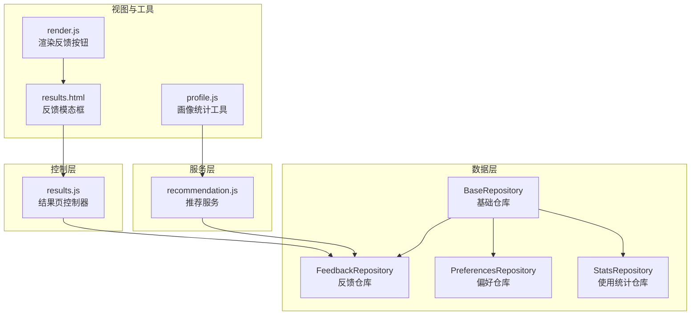
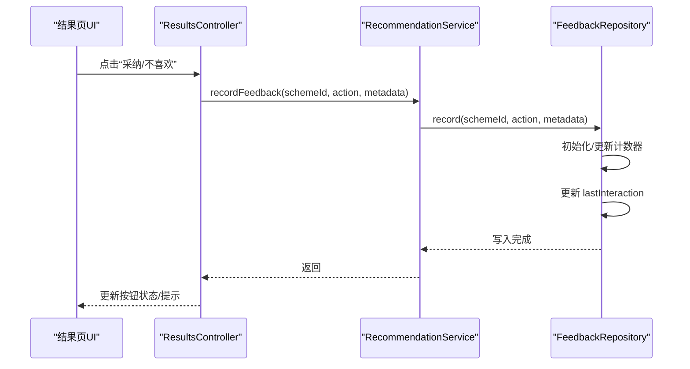
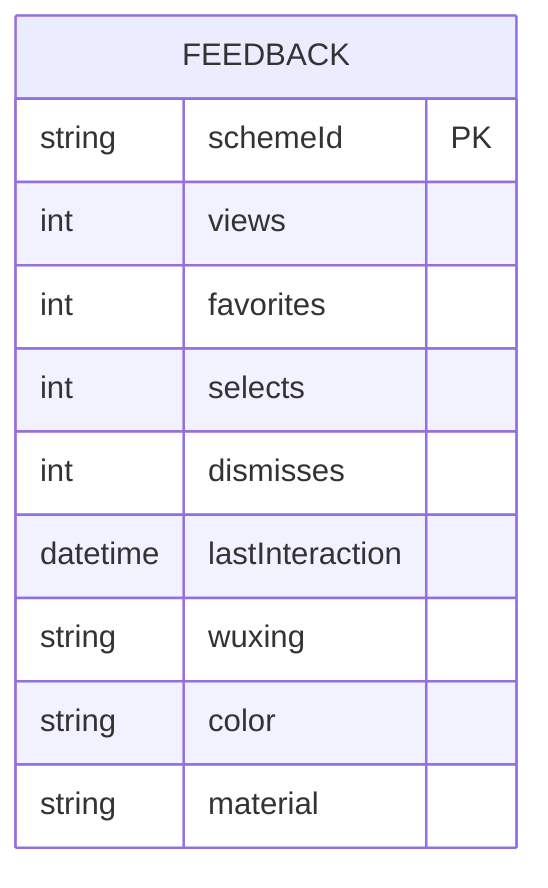
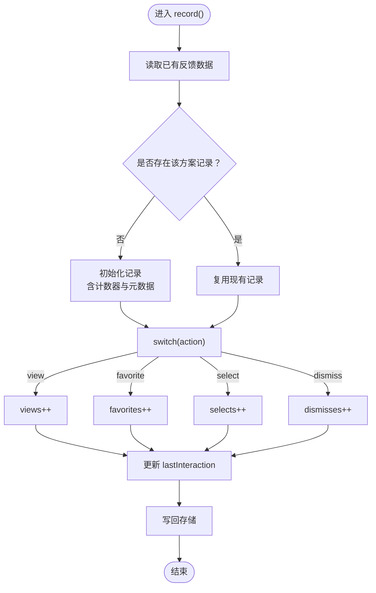
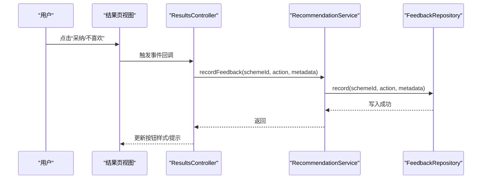
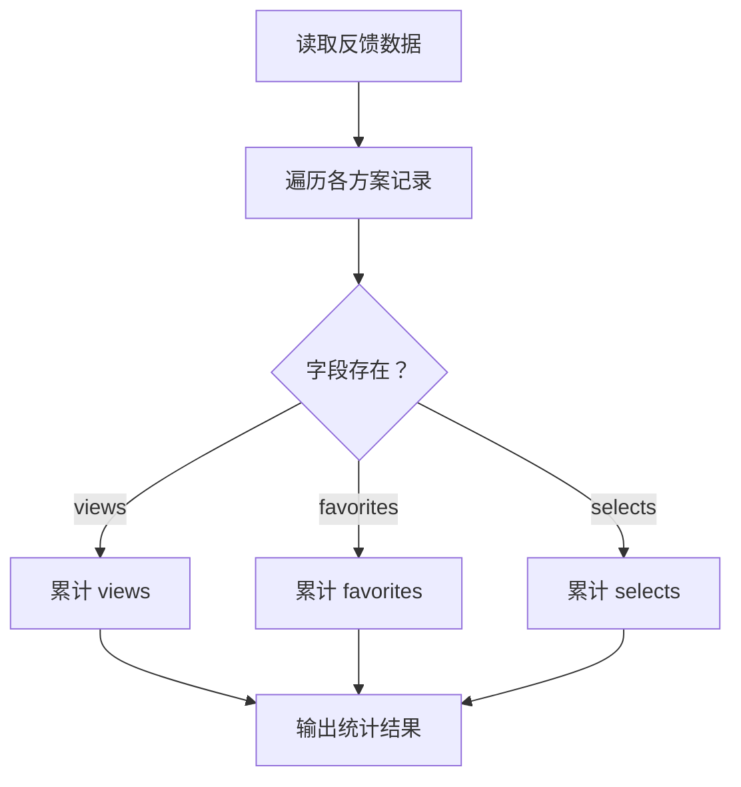
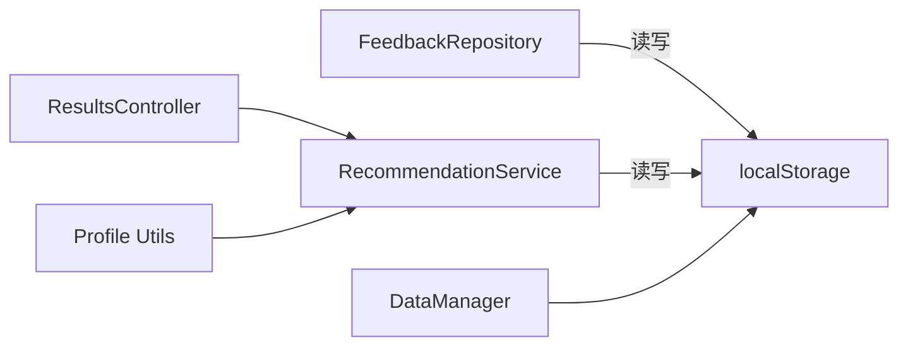

# 反馈统计仓库

<cite>
**本文引用的文件**
- [repository.js](file://js/data/repository.js)
- [recommendation.js](file://js/services/recommendation.js)
- [results.js](file://js/controllers/results.js)
- [profile.js](file://js/utils/profile.js)
- [storage.js](file://js/data/storage.js)
- [data-manager.js](file://js/data/data-manager.js)
- [render.js](file://js/utils/render.js)
- [results.html](file://views/results.html)
</cite>

## 目录
1. [简介](#简介)
2. [项目结构](#项目结构)
3. [核心组件](#核心组件)
4. [架构总览](#架构总览)
5. [详细组件分析](#详细组件分析)
6. [依赖分析](#依赖分析)
7. [性能考虑](#性能考虑)
8. [故障排查指南](#故障排查指南)
9. [结论](#结论)
10. [附录](#附录)

## 简介
本文件面向“反馈统计仓库（FeedbackRepository）”提供系统化技术文档，聚焦以下目标：
- 反馈数据结构与统计机制：views、favorites、selects、dismisses 等指标的存储格式与语义
- record() 方法实现原理：动作类型识别、计数器更新、时间戳记录
- 嵌套对象结构与元数据支持：如何扩展字段并保持向后兼容
- lastInteraction 字段的作用与实时性保障
- 使用场景：用户行为分析与推荐效果评估
- 聚合查询与性能优化策略

## 项目结构
反馈统计仓库位于数据层模块中，采用“仓库 + 基类 + 键名常量”的分层设计，统一通过安全存储封装进行读写。

图表来源
- [repository.js](file://js/data/repository.js#L46-L81)
- [repository.js](file://js/data/repository.js#L206-L259)
- [recommendation.js](file://js/services/recommendation.js#L145-L184)
- [results.js](file://js/controllers/results.js#L464-L525)
- [results.html](file://views/results.html#L93-L126)
- [render.js](file://js/utils/render.js#L180-L201)
- [profile.js](file://js/utils/profile.js#L24-L60)

章节来源
- [repository.js](file://js/data/repository.js#L1-L394)

## 核心组件
- 基础仓库 BaseRepository：提供 get/set/remove/exists 等通用能力，封装 localStorage 的安全读写。
- 反馈仓库 FeedbackRepository：继承自 BaseRepository，负责推荐反馈数据的读写与聚合统计。
- 推荐服务 recommendation.js：提供 recordFeedback() 作为外部记录入口，同时维护用户偏好与反馈数据。
- 结果页控制器 results.js：处理 UI 交互，调用 recordFeedback() 记录采纳/不喜欢等反馈。
- 画像统计工具 profile.js：对反馈数据进行聚合统计，如互动总量等。

章节来源
- [repository.js](file://js/data/repository.js#L46-L81)
- [repository.js](file://js/data/repository.js#L206-L259)
- [recommendation.js](file://js/services/recommendation.js#L145-L184)
- [results.js](file://js/controllers/results.js#L464-L525)
- [profile.js](file://js/utils/profile.js#L24-L60)

## 架构总览
反馈数据在前端以 JSON 对象形式存储于 localStorage 中，键名为 recommendation_feedback。每条方案记录包含：
- 计数指标：views、favorites、selects、dismisses
- 最近交互时间：lastInteraction（ISO 时间戳）
- 元数据：wuxing、color、material 等（由调用方传入）

图表来源
- [results.js](file://js/controllers/results.js#L464-L525)
- [recommendation.js](file://js/services/recommendation.js#L145-L184)
- [repository.js](file://js/data/repository.js#L225-L258)

## 详细组件分析

### 反馈仓库（FeedbackRepository）数据模型
- 存储键名：recommendation_feedback（通过 StorageKeys 常量统一管理）
- 数据结构：以方案 ID 为键的对象，值为一条记录
- 记录字段：
  - views：浏览次数
  - favorites：收藏次数
  - selects：选择/采纳次数
  - dismisses：忽略/不喜欢次数
  - lastInteraction：最近一次交互的时间戳（ISO 字符串）
  - 元数据：wuxing、color、material 等（由调用方传入并透传）

图表来源
- [repository.js](file://js/data/repository.js#L225-L258)
- [recommendation.js](file://js/services/recommendation.js#L145-L184)

章节来源
- [repository.js](file://js/data/repository.js#L9-L21)
- [repository.js](file://js/data/repository.js#L206-L259)
- [recommendation.js](file://js/services/recommendation.js#L145-L184)

### record() 方法实现原理
- 输入参数：schemeId（方案ID）、action（动作类型）、metadata（元数据）
- 动作类型识别：通过 switch 匹配 view/favorite/select/dismiss，分别对对应计数器加一
- 计数器更新：按动作类型累加对应字段
- 时间戳记录：每次记录都会更新 lastInteraction 为当前 ISO 时间
- 元数据透传：若首次记录某方案，则将 metadata 中的字段合并到记录对象中（如 wuxing/color/material），实现灵活扩展

图表来源
- [repository.js](file://js/data/repository.js#L225-L258)

章节来源
- [repository.js](file://js/data/repository.js#L225-L258)

### 元数据支持与向后兼容
- 元数据字段通过 metadata 参数传入，并与默认字段（views/favorites/selects/dismisses/lastInteraction）一同写入
- 通过“...metadata”语法实现字段合并，新增字段不会破坏既有结构
- 推荐服务中也支持在首次记录时写入 wuxing/color/material 等字段，便于后续个性化计算

章节来源
- [repository.js](file://js/data/repository.js#L228-L236)
- [recommendation.js](file://js/services/recommendation.js#L148-L158)

### lastInteraction 字段的作用与实时性
- 作用：标识该方案记录的最近一次交互时间，用于排序、筛选或统计
- 实时性：每次 record() 调用都会更新为当前时间（ISO 字符串），确保时间戳与最新交互一致
- 应用：可用于“最近使用”排序、冷启动判断、离线缓存失效策略等

章节来源
- [repository.js](file://js/data/repository.js#L234-L235)
- [repository.js](file://js/data/repository.js#L256-L257)

### 使用场景与集成点
- 用户行为分析：通过 views/favorites/selects/dismisses 统计用户对方案的偏好与采纳情况
- 推荐效果评估：结合用户偏好与历史反馈，计算个性化得分，评估推荐质量
- UI 交互闭环：结果页提供“采纳/不喜欢”按钮，记录反馈并更新界面状态

图表来源
- [results.html](file://views/results.html#L93-L126)
- [render.js](file://js/utils/render.js#L180-L201)
- [results.js](file://js/controllers/results.js#L464-L525)
- [recommendation.js](file://js/services/recommendation.js#L145-L184)
- [repository.js](file://js/data/repository.js#L225-L258)

章节来源
- [results.html](file://views/results.html#L93-L126)
- [render.js](file://js/utils/render.js#L180-L201)
- [results.js](file://js/controllers/results.js#L464-L525)
- [recommendation.js](file://js/services/recommendation.js#L145-L184)

### 聚合查询与统计
- 互动总量：遍历所有方案记录，对 views/favorites/selects 求和
- 个性化得分：结合用户偏好与历史反馈，计算综合得分（参考推荐服务中的计算逻辑）
- 收藏趋势：按月统计收藏数量（参考画像统计工具）

图表来源
- [profile.js](file://js/utils/profile.js#L144-L156)

章节来源
- [profile.js](file://js/utils/profile.js#L144-L156)

## 依赖分析
- FeedbackRepository 依赖 BaseRepository 提供的 get/set 封装
- 推荐服务 recommendation.js 与 FeedbackRepository 并行存在两种记录路径：
  - 通过 recommendation.js 的 recordFeedback() 直接写入
  - 通过 FeedbackRepository 的 record() 写入
- 结果页控制器 results.js 通过 recommendation.js 的 recordFeedback() 记录反馈
- 画像统计工具 profile.js 通过 recommendation.js 的 getFeedbackData() 获取反馈数据进行聚合

图表来源
- [repository.js](file://js/data/repository.js#L46-L81)
- [recommendation.js](file://js/services/recommendation.js#L145-L184)
- [results.js](file://js/controllers/results.js#L464-L525)
- [profile.js](file://js/utils/profile.js#L24-L60)
- [data-manager.js](file://js/data/data-manager.js#L48-L72)

章节来源
- [repository.js](file://js/data/repository.js#L46-L81)
- [recommendation.js](file://js/services/recommendation.js#L145-L184)
- [results.js](file://js/controllers/results.js#L464-L525)
- [profile.js](file://js/utils/profile.js#L24-L60)
- [data-manager.js](file://js/data/data-manager.js#L48-L72)

## 性能考虑
- 存储粒度：反馈数据以对象形式存储，键为方案ID；建议避免一次性读取超大对象，必要时按需读取或分页
- 写入频率：频繁交互场景下，record() 会频繁写入；可通过批量写入或节流策略降低抖动
- 内存占用：反馈数据随方案数量增长而增长；建议定期清理不再使用的方案记录
- 计算复杂度：聚合统计为 O(N) 遍历；在大数据量时可考虑缓存中间结果或增量更新
- 导出与备份：DataManager 支持导出/导入，注意数据体积与压缩策略

## 故障排查指南
- 记录失败：检查 safeStorage 封装是否抛错；确认 localStorage 是否可用
- 数据丢失：核对键名是否正确（recommendation_feedback）；确认是否被意外清空
- 时间戳异常：确认 new Date().toISOString() 输出格式；避免跨时区差异导致的误解
- 元数据缺失：确认调用方是否传入 metadata；检查初始化逻辑是否合并了字段
- 重复记录：确认 action 类型是否正确；避免重复触发导致的计数异常

章节来源
- [repository.js](file://js/data/repository.js#L24-L41)
- [repository.js](file://js/data/repository.js#L225-L258)
- [recommendation.js](file://js/services/recommendation.js#L145-L184)

## 结论
反馈统计仓库通过简洁的数据模型与统一的记录接口，实现了对用户行为的细粒度追踪与实时更新。配合推荐服务与画像统计工具，可形成从“行为采集—个性化—效果评估”的完整闭环。建议在高频交互场景下引入节流/批量化策略，并定期清理冗余数据，以维持良好的性能与用户体验。

## 附录
- 存储键名常量：FEEDBACK（recommendation_feedback）、PREFERENCES（user_preferences）、FAVORITES（wuxing_favorites）等
- 导出范围：DataManager 支持导出反馈、偏好、收藏、使用统计等关键数据键
- UI 集成：结果页提供反馈模态框与按钮，支持“采纳/不喜欢”两类反馈

章节来源
- [repository.js](file://js/data/repository.js#L9-L21)
- [data-manager.js](file://js/data/data-manager.js#L11-L22)
- [results.html](file://views/results.html#L93-L126)
- [render.js](file://js/utils/render.js#L180-L201)