# 基础仓库类

<cite>
**本文档引用的文件**
- [repository.js](file://js/data/repository.js)
- [storage.js](file://js/data/storage.js)
- [error-handler.js](file://js/core/error-handler.js)
- [data-manager.js](file://js/data/data-manager.js)
- [index.html](file://index.html)
</cite>

## 目录
1. [简介](#简介)
2. [项目结构](#项目结构)
3. [核心组件](#核心组件)
4. [架构概览](#架构概览)
5. [详细组件分析](#详细组件分析)
6. [依赖关系分析](#依赖关系分析)
7. [性能考虑](#性能考虑)
8. [故障排除指南](#故障排除指南)
9. [结论](#结论)

## 简介

基础仓库类（BaseRepository）是本项目数据持久化层的核心抽象，采用面向对象的设计模式为所有具体仓库类提供统一的存储接口。该类通过继承机制实现了代码复用，为收藏、用户偏好、反馈、八字、使用统计、上传照片等不同业务领域的数据提供了标准化的CRUD操作接口。

BaseRepository的设计体现了单一职责原则和开闭原则，通过构造函数中的key参数实现了灵活的存储键名管理，为后续扩展新的数据存储需求奠定了坚实的基础。

## 项目结构

该项目采用模块化的JavaScript架构，数据持久化层位于`js/data/`目录下，包含以下关键文件：

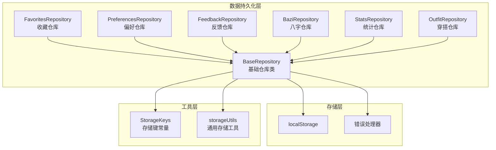

**图表来源**
- [repository.js](file://js/data/repository.js#L46-L81)
- [repository.js](file://js/data/repository.js#L86-L146)
- [repository.js](file://js/data/repository.js#L151-L201)

**章节来源**
- [repository.js](file://js/data/repository.js#L1-L81)
- [repository.js](file://js/data/repository.js#L380-L393)

## 核心组件

### BaseRepository类设计

BaseRepository作为所有仓库类的基类，提供了统一的数据访问接口：

| 方法 | 参数 | 返回值 | 描述 |
|------|------|--------|------|
| constructor | key: string | void | 构造函数，初始化存储键名 |
| get | 无 | any | 获取存储的数据 |
| set | data: any | void | 设置存储的数据 |
| remove | 无 | void | 删除存储的数据 |
| exists | 无 | boolean | 检查数据是否存在 |

### 存储键名管理系统

系统使用集中化的存储键名常量管理，确保数据的一致性和可维护性：

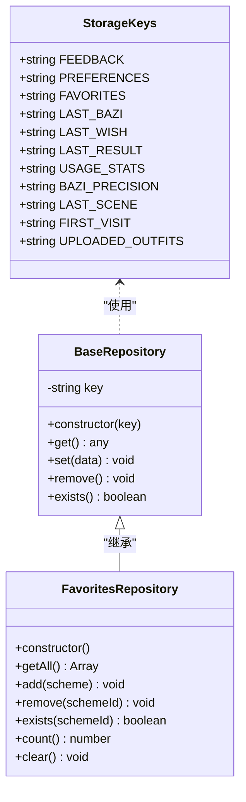

**图表来源**
- [repository.js](file://js/data/repository.js#L9-L21)
- [repository.js](file://js/data/repository.js#L46-L81)
- [repository.js](file://js/data/repository.js#L86-L146)

**章节来源**
- [repository.js](file://js/data/repository.js#L9-L21)
- [repository.js](file://js/data/repository.js#L46-L81)

## 架构概览

### 数据流架构

BaseRepository采用了分层的数据访问架构，确保了数据操作的安全性和一致性：

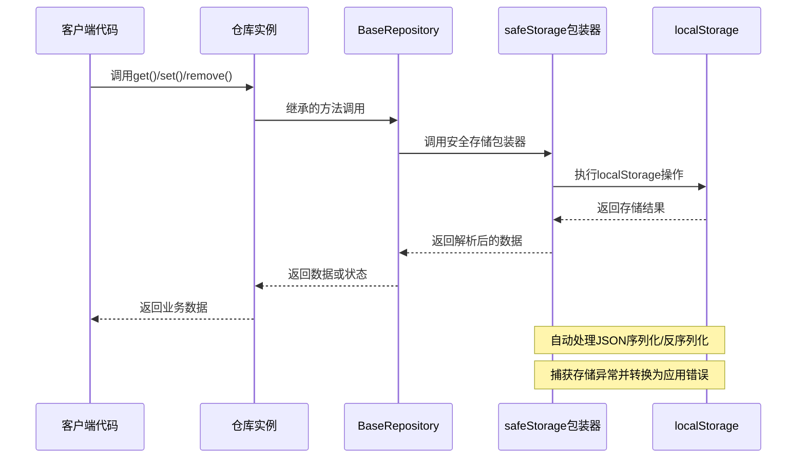

**图表来源**
- [repository.js](file://js/data/repository.js#L24-L41)
- [repository.js](file://js/data/repository.js#L55-L72)
- [error-handler.js](file://js/core/error-handler.js#L153-L163)

### 继承体系架构

系统通过继承机制实现了功能的层次化组织：

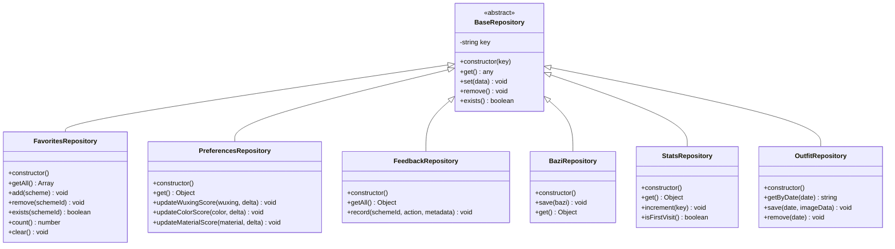

**图表来源**
- [repository.js](file://js/data/repository.js#L46-L81)
- [repository.js](file://js/data/repository.js#L86-L146)
- [repository.js](file://js/data/repository.js#L151-L201)
- [repository.js](file://js/data/repository.js#L206-L259)
- [repository.js](file://js/data/repository.js#L264-L287)
- [repository.js](file://js/data/repository.js#L292-L337)
- [repository.js](file://js/data/repository.js#L342-L377)

**章节来源**
- [repository.js](file://js/data/repository.js#L86-L377)

## 详细组件分析

### BaseRepository核心方法详解

#### 构造函数设计

BaseRepository的构造函数通过注入key参数实现了灵活的存储键名管理：

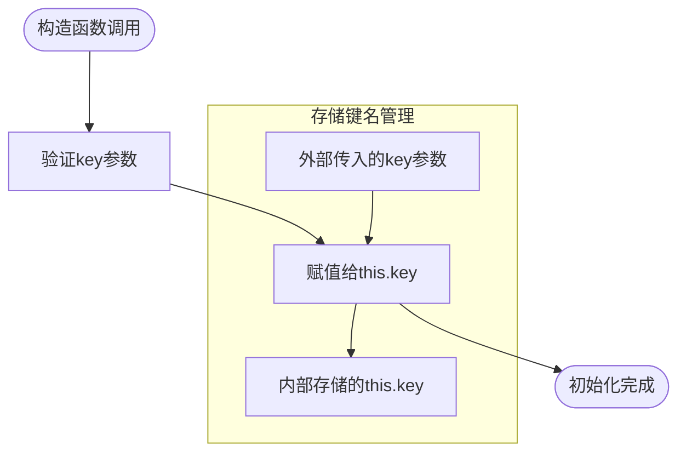

**图表来源**
- [repository.js](file://js/data/repository.js#L47-L49)

#### get()方法实现原理

get()方法提供了统一的数据获取接口，实现了自动的JSON反序列化：

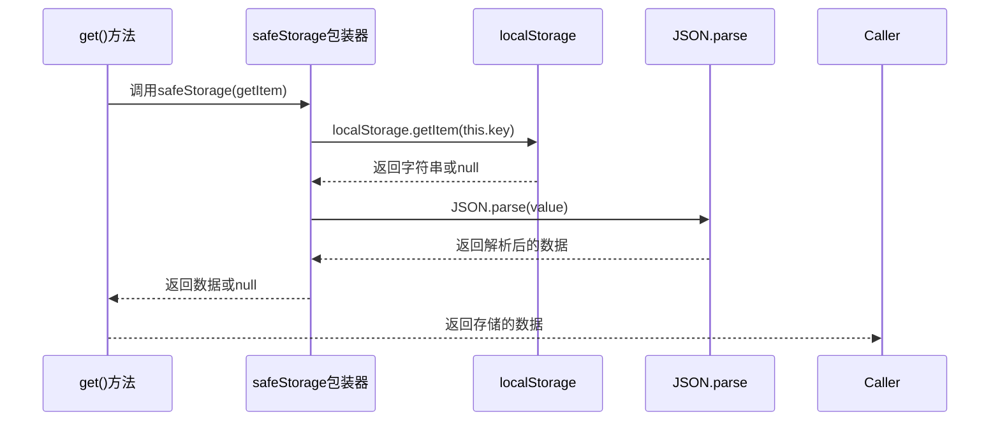

**图表来源**
- [repository.js](file://js/data/repository.js#L55-L57)
- [repository.js](file://js/data/repository.js#L25-L29)

#### set()方法实现原理

set()方法确保了数据的正确序列化和存储：

```mermaid
flowchart TD
Start([set()方法调用]) --> ValidateData["验证输入数据"]
ValidateData --> Serialize["JSON.stringify(data)"]
Serialize --> SafeCall["safeStorage(setItem)"]
SafeCall --> Store["localStorage.setItem(key, value)"]
Store --> Success["返回成功状态"]
Success --> End([操作完成])
subgraph "错误处理"
Error["存储异常捕获"]
Convert["转换为AppError"]
Throw["抛出应用错误"]
Error --> Convert --> Throw
end
```

**图表来源**
- [repository.js](file://js/data/repository.js#L63-L65)
- [repository.js](file://js/data/repository.js#L31-L35)

#### remove()方法实现原理

remove()方法提供了简洁的数据删除接口：

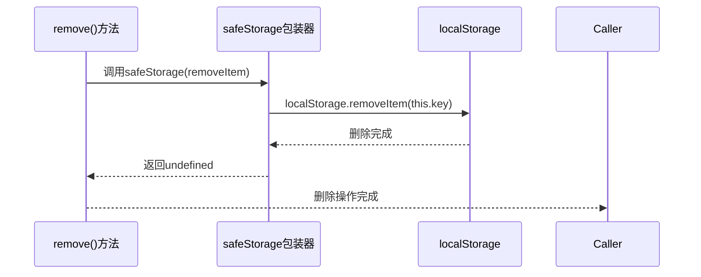

**图表来源**
- [repository.js](file://js/data/repository.js#L70-L72)
- [repository.js](file://js/data/repository.js#L36-L40)

#### exists()方法实现原理

exists()方法提供了便捷的数据存在性检查：

```mermaid
flowchart TD
Start([exists()方法调用]) --> GetData["调用this.get()"]
GetData --> CheckNull{"返回值是否为null?"}
CheckNull --> |是| ReturnFalse["返回false"]
CheckNull --> |否| ReturnTrue["返回true"]
ReturnFalse --> End([检查完成])
ReturnTrue --> End
```

**图表来源**
- [repository.js](file://js/data/repository.js#L78-L80)

**章节来源**
- [repository.js](file://js/data/repository.js#L46-L81)

### 具体仓库类扩展分析

#### 收藏仓库（FavoritesRepository）

FavoritesRepository展示了如何在基类基础上添加领域特定的功能：

| 方法 | 特殊功能 | 使用场景 |
|------|----------|----------|
| getAll() | 提供默认空数组返回 | 页面初始化显示收藏列表 |
| add(scheme) | 去重和时间戳记录 | 用户添加收藏操作 |
| remove(schemeId) | 过滤移除 | 用户取消收藏操作 |
| exists(schemeId) | 重写基类方法 | 高效检查收藏状态 |
| count() | 统计收藏数量 | UI显示收藏统计 |
| clear() | 清空所有收藏 | 用户清空收藏功能 |

#### 用户偏好仓库（PreferencesRepository）

PreferencesRepository提供了复杂的偏好数据管理和更新机制：

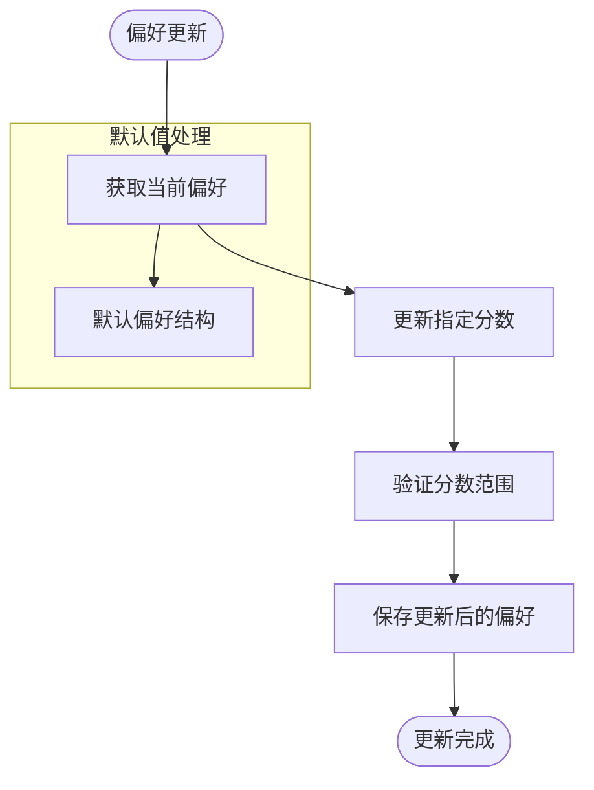

**图表来源**
- [repository.js](file://js/data/repository.js#L160-L167)
- [repository.js](file://js/data/repository.js#L174-L178)

**章节来源**
- [repository.js](file://js/data/repository.js#L86-L146)
- [repository.js](file://js/data/repository.js#L151-L201)

## 依赖关系分析

### 外部依赖关系

BaseRepository的依赖关系相对简单但功能强大：

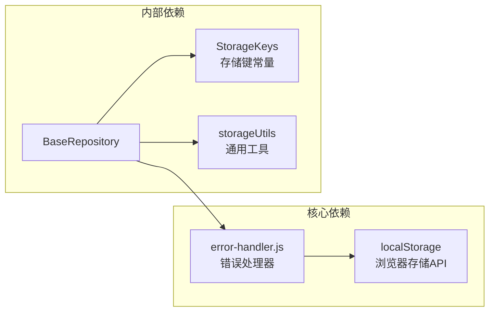

**图表来源**
- [repository.js](file://js/data/repository.js#L6)
- [repository.js](file://js/data/repository.js#L24-L41)
- [error-handler.js](file://js/core/error-handler.js#L153-L163)

### 内部耦合度分析

BaseRepository与其他组件的耦合关系体现了良好的模块化设计：

| 组件 | 耦合程度 | 说明 |
|------|----------|------|
| error-handler.js | 高度耦合 | 通过safeStorage包装器实现错误处理 |
| StorageKeys | 中等耦合 | 通过常量传递存储键名 |
| storageUtils | 低耦合 | 作为独立工具模块使用 |
| 具体仓库类 | 低耦合 | 通过继承实现功能扩展 |

**章节来源**
- [repository.js](file://js/data/repository.js#L6)
- [repository.js](file://js/data/repository.js#L24-L41)
- [error-handler.js](file://js/core/error-handler.js#L153-L163)

## 性能考虑

### 存储性能优化

BaseRepository在设计时充分考虑了性能因素：

1. **延迟序列化**：只在需要时进行JSON序列化和反序列化
2. **批量操作**：具体仓库类可以实现批量数据处理
3. **缓存策略**：可以在上层实现数据缓存机制

### 内存使用优化

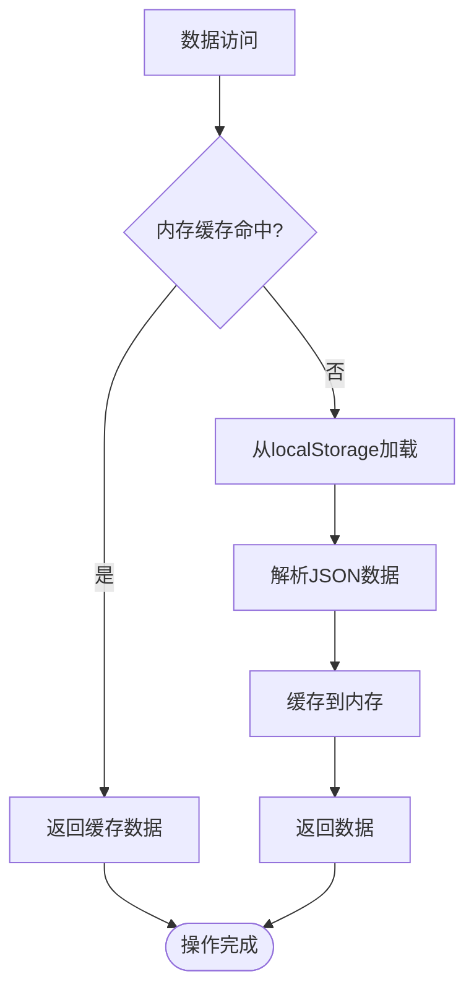

### 错误处理性能影响

安全存储包装器虽然增加了错误处理开销，但提供了更好的用户体验：

- **异常捕获**：避免应用崩溃
- **用户提示**：提供友好的错误信息
- **降级处理**：在存储失败时提供替代方案

## 故障排除指南

### 常见存储问题

| 问题类型 | 症状 | 解决方案 |
|----------|------|----------|
| 存储空间不足 | QuotaExceededError | 清理浏览器缓存或使用云存储 |
| 隐私模式 | 存储权限受限 | 提示用户关闭隐私模式 |
| 数据损坏 | JSON解析失败 | 清除损坏数据或恢复备份 |
| 浏览器兼容性 | localStorage不可用 | 提供IndexedDB或其他存储方案 |

### 错误处理机制

BaseRepository通过safeStorage包装器实现了统一的错误处理：

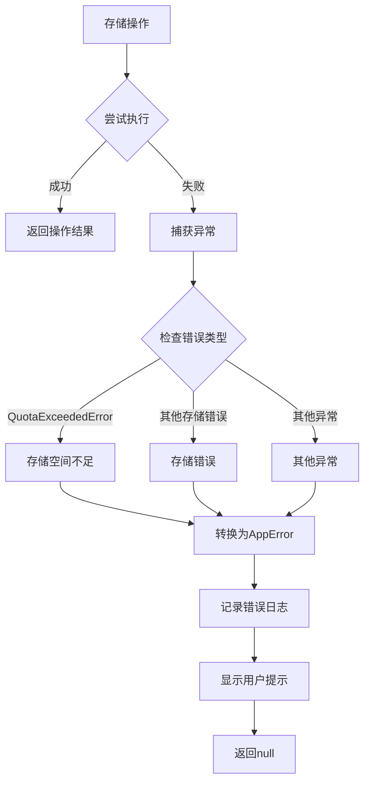

**图表来源**
- [error-handler.js](file://js/core/error-handler.js#L153-L163)
- [error-handler.js](file://js/core/error-handler.js#L168-L189)

**章节来源**
- [error-handler.js](file://js/core/error-handler.js#L153-L163)
- [error-handler.js](file://js/core/error-handler.js#L168-L189)

## 结论

BaseRepository作为项目数据持久化层的核心抽象，展现了优秀的软件设计原则：

### 设计优势

1. **代码复用**：通过继承机制避免重复代码
2. **统一接口**：为所有仓库类提供一致的操作方式
3. **易于扩展**：新的数据存储需求只需继承基类
4. **错误处理**：内置的安全存储包装器提供可靠的错误处理
5. **可维护性**：集中化的存储键名管理和模块化设计

### 最佳实践建议

1. **遵循单一职责**：每个仓库类专注于特定的业务领域
2. **合理使用继承**：在基类基础上添加领域特定功能
3. **错误处理优先**：始终使用safeStorage包装器进行存储操作
4. **数据验证**：在set()方法中添加必要的数据验证
5. **性能监控**：定期检查存储性能和内存使用情况

### 扩展方向

BaseRepository的设计为未来的功能扩展预留了充足的空间：
- 支持多种存储后端（localStorage、IndexedDB、云存储）
- 实现数据同步和冲突解决机制
- 添加数据迁移和版本管理功能
- 集成数据加密和安全存储方案

通过BaseRepository这一精心设计的抽象层，项目实现了数据持久化层的高度模块化和可维护性，为复杂业务逻辑的实现提供了稳定可靠的基础。