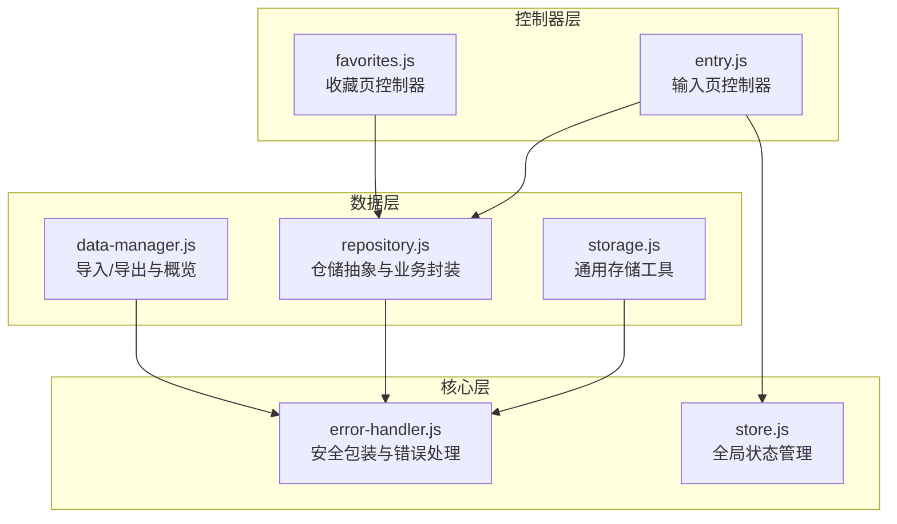
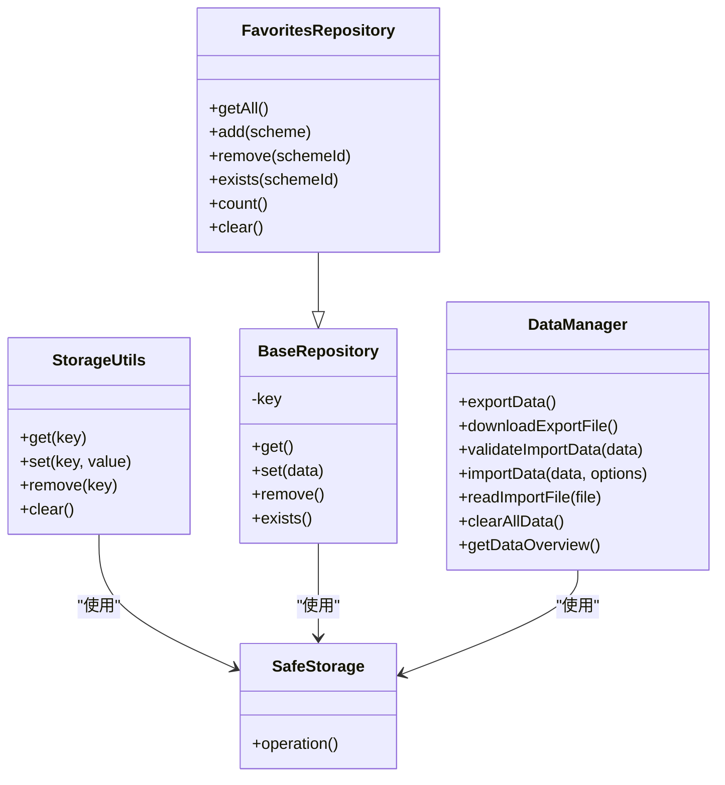
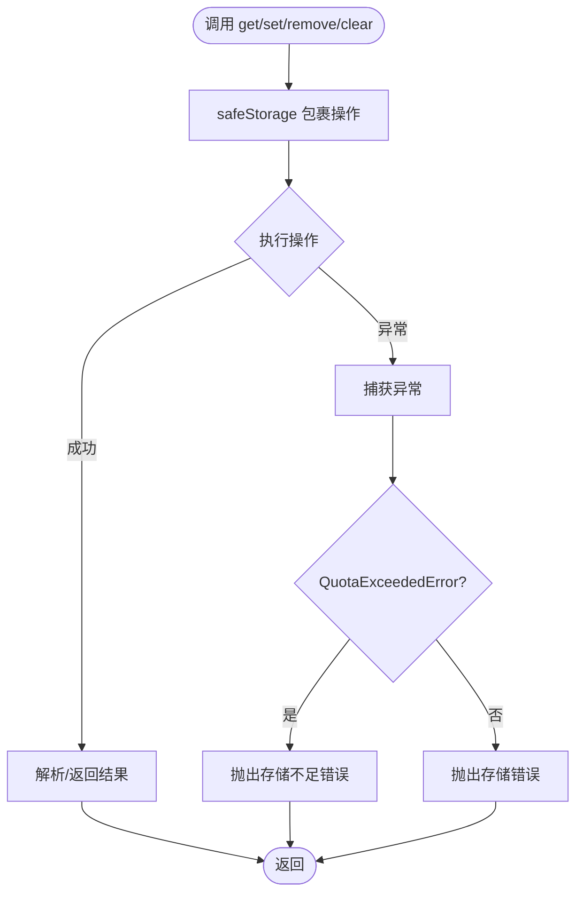
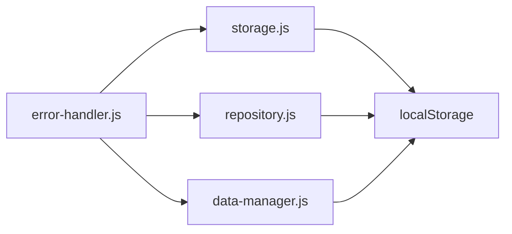

# 存储工具集

<cite>
**本文引用的文件**
- [storage.js](file://js/data/storage.js)
- [repository.js](file://js/data/repository.js)
- [error-handler.js](file://js/core/error-handler.js)
- [data-manager.js](file://js/data/data-manager.js)
- [store.js](file://js/core/store.js)
- [entry.js](file://js/controllers/entry.js)
- [favorites.js](file://js/controllers/favorites.js)
</cite>

## 目录
1. [简介](#简介)
2. [项目结构](#项目结构)
3. [核心组件](#核心组件)
4. [架构总览](#架构总览)
5. [详细组件分析](#详细组件分析)
6. [依赖关系分析](#依赖关系分析)
7. [性能考量](#性能考量)
8. [故障排查指南](#故障排查指南)
9. [结论](#结论)
10. [附录](#附录)

## 简介
本文件围绕存储工具集(storageUtils)进行系统化技术文档整理，重点涵盖：
- 通用存储工具的设计目的与使用场景
- get()、set()、remove()、clear()等工具方法的功能与实现
- 与Repository类的关系与区别
- 存储工具的安全包装机制与错误处理策略
- localStorage的直接操作接口与数据序列化处理
- 使用示例与最佳实践（含数据清理与调试技巧）
- 存储容量限制与性能考虑

## 项目结构
本项目采用分层架构，存储相关能力主要分布在以下模块：
- 数据层：storage.js 提供通用存储工具；repository.js 提供面向业务的仓储抽象；data-manager.js 提供数据导入/导出与概览
- 核心层：error-handler.js 提供统一错误处理与安全包装；store.js 提供全局状态管理
- 控制器层：各控制器通过仓储或工具访问持久化数据

图表来源
- [storage.js](file://js/data/storage.js#L1-L145)
- [repository.js](file://js/data/repository.js#L1-L394)
- [error-handler.js](file://js/core/error-handler.js#L1-L190)
- [data-manager.js](file://js/data/data-manager.js#L1-L376)
- [store.js](file://js/core/store.js#L1-L212)
- [entry.js](file://js/controllers/entry.js#L1-L241)
- [favorites.js](file://js/controllers/favorites.js#L1-L89)

章节来源
- [storage.js](file://js/data/storage.js#L1-L145)
- [repository.js](file://js/data/repository.js#L1-L394)
- [error-handler.js](file://js/core/error-handler.js#L1-L190)
- [data-manager.js](file://js/data/data-manager.js#L1-L376)
- [store.js](file://js/core/store.js#L1-L212)
- [entry.js](file://js/controllers/entry.js#L1-L241)
- [favorites.js](file://js/controllers/favorites.js#L1-L89)

## 核心组件
- 通用存储工具(storageUtils)
  - 提供对localStorage的轻量封装，统一序列化/反序列化与错误处理
  - 方法族：get(key)、set(key, value)、remove(key)、clear()
- 仓储层(Repository)
  - 面向业务的抽象，封装常用数据结构与操作，如收藏、偏好、反馈、使用统计、上传的穿搭照片等
  - 通过BaseRepository与安全包装safeStorage实现一致的错误处理
- 错误处理与安全包装
  - safeStorage(operation)：捕获QuotaExceededError等存储异常，转换为可识别的应用错误类型
- 数据管理(DataManager)
  - 提供数据导出/导入、概览与清理能力，内部同样使用安全包装

章节来源
- [storage.js](file://js/data/storage.js#L9-L49)
- [repository.js](file://js/data/repository.js#L23-L41)
- [error-handler.js](file://js/core/error-handler.js#L148-L163)
- [data-manager.js](file://js/data/data-manager.js#L24-L42)

## 架构总览
通用存储工具与仓储层的关系如下：
- storage.js中的工具方法直接基于localStorage，提供最基础的存取能力
- repository.js中的仓储类以安全包装为基础，提供面向业务的复杂数据结构与操作
- DataManager在导入/导出流程中复用安全包装，确保一致性

图表来源
- [storage.js](file://js/data/storage.js#L9-L49)
- [repository.js](file://js/data/repository.js#L46-L81)
- [repository.js](file://js/data/repository.js#L86-L146)
- [data-manager.js](file://js/data/data-manager.js#L48-L229)
- [error-handler.js](file://js/core/error-handler.js#L148-L163)

## 详细组件分析

### 通用存储工具(storageUtils)设计与实现
- 设计目的
  - 提供对localStorage的统一访问接口，屏蔽序列化细节与异常处理
  - 通过安全包装保证在隐私模式、存储配额不足等异常情况下不会导致应用崩溃
- 关键方法
  - get(key)：读取并解析JSON，不存在返回null
  - set(key, value)：序列化后写入localStorage，返回布尔成功标记
  - remove(key)：删除指定键
  - clear()：清空localStorage（谨慎使用）
- 数据序列化
  - 写入前JSON.stringify，读取后JSON.parse，确保结构化数据的正确持久化
- 安全包装
  - 通过safeStorage包裹localStorage操作，捕获QuotaExceededError等异常并转换为应用错误类型，便于统一提示与日志记录

图表来源
- [storage.js](file://js/data/storage.js#L9-L49)
- [error-handler.js](file://js/core/error-handler.js#L148-L163)

章节来源
- [storage.js](file://js/data/storage.js#L9-L49)
- [error-handler.js](file://js/core/error-handler.js#L148-L163)

### 与Repository类的关系与区别
- 关系
  - storage.js中的工具方法与repository.js中的仓储类均依赖safeStorage进行安全包装
  - 仓储类在工具方法之上提供了业务语义（如收藏、偏好、反馈、使用统计、上传的穿搭照片等）
- 区别
  - 工具方法更偏向底层、通用，适合简单键值对或结构化对象的直接存取
  - 仓储类提供面向业务的聚合操作与默认值处理，减少调用方的样板代码
- 选择建议
  - 简单数据：优先使用storageUtils
  - 复杂业务数据：优先使用对应仓储类

章节来源
- [repository.js](file://js/data/repository.js#L23-L41)
- [repository.js](file://js/data/repository.js#L46-L81)
- [repository.js](file://js/data/repository.js#L86-L146)

### 安全包装机制与错误处理策略
- 安全包装safeStorage
  - 捕获存储相关异常，区分存储配额不足与其它存储错误
  - 将异常转换为应用错误类型，便于统一提示与日志记录
- 错误类型与提示
  - STORAGE类型错误：统一提示“本地存储失败，请检查浏览器设置”
  - 配额不足：提示“存储空间不足，请清理后重试”
- 日志与监控
  - 错误处理器记录类型、消息、时间戳、原始错误与堆栈，便于定位问题

章节来源
- [error-handler.js](file://js/core/error-handler.js#L148-L163)
- [error-handler.js](file://js/core/error-handler.js#L18-L25)
- [error-handler.js](file://js/core/error-handler.js#L84-L92)

### localStorage直接操作接口与数据序列化
- 直接操作接口
  - storage.js提供get/set/remove/clear四个方法，分别对应localStorage的getItem/setItem/removeItem/clear
  - repository.js提供storage对象，封装了安全包装的getItem/setItem/removeItem
- 数据序列化
  - 写入前JSON.stringify，读取后JSON.parse，确保复杂对象与数组的正确持久化
  - DataManager在导入/导出时同样遵循此约定

章节来源
- [storage.js](file://js/data/storage.js#L9-L49)
- [repository.js](file://js/data/repository.js#L23-L41)
- [data-manager.js](file://js/data/data-manager.js#L24-L42)

### 使用示例与最佳实践
- 示例场景
  - 输入页控制器在生成推荐后，使用仓储类更新使用统计
  - 收藏页控制器通过仓储类获取/移除收藏
- 最佳实践
  - 优先使用仓储类进行业务数据操作，减少重复逻辑
  - 对于简单键值对，可直接使用storageUtils
  - 在导入/导出流程中，确保键名与数据结构一致
  - 使用getDataOverview进行数据概览，便于调试与清理
- 数据清理与调试技巧
  - 使用DataManager的clearAllData进行批量清理
  - 使用getDataOverview查看数据项数量与大小，辅助容量规划
  - 在隐私模式或存储配额不足时，错误处理器会统一提示

章节来源
- [entry.js](file://js/controllers/entry.js#L131-L189)
- [favorites.js](file://js/controllers/favorites.js#L27-L79)
- [data-manager.js](file://js/data/data-manager.js#L225-L271)

## 依赖关系分析
- 模块耦合
  - storage.js与error-handler.js强耦合（安全包装）
  - repository.js与error-handler.js强耦合（安全包装）
  - data-manager.js与error-handler.js强耦合（安全包装）
- 外部依赖
  - localStorage作为唯一外部持久化介质
  - 浏览器环境下的fetch与FileReader（在DataManager中）

图表来源
- [storage.js](file://js/data/storage.js#L5-L21)
- [repository.js](file://js/data/repository.js#L6-L41)
- [data-manager.js](file://js/data/data-manager.js#L6-L42)
- [error-handler.js](file://js/core/error-handler.js#L148-L163)

章节来源
- [storage.js](file://js/data/storage.js#L5-L21)
- [repository.js](file://js/data/repository.js#L6-L41)
- [data-manager.js](file://js/data/data-manager.js#L6-L42)
- [error-handler.js](file://js/core/error-handler.js#L148-L163)

## 性能考量
- 序列化开销
  - JSON.stringify/parse在大数据量时存在CPU开销，建议控制单条数据体积
- 存储容量限制
  - 不同浏览器与模式下容量不同，隐私模式可能更严格
  - 当容量不足时，错误处理器会提示“存储空间不足，请清理后重试”
- 批量操作
  - DataManager提供批量导入/导出与清理，减少多次序列化/反序列化的次数
- 数据结构优化
  - 对频繁读取的数据采用扁平化结构，减少嵌套层级
  - 合理拆分大对象，避免一次性序列化/反序列化过大的数据

章节来源
- [error-handler.js](file://js/core/error-handler.js#L158-L161)
- [data-manager.js](file://js/data/data-manager.js#L167-L176)

## 故障排查指南
- 常见问题
  - 存储配额不足：错误类型为STORAGE，提示“存储空间不足，请清理后重试”
  - 隐私模式：部分浏览器在隐私模式下禁用或限制localStorage
  - 数据格式错误：JSON解析失败，错误类型为DATA_PARSE
- 排查步骤
  - 查看错误日志：确认错误类型与原始错误信息
  - 使用getDataOverview检查数据项数量与大小
  - 在隐私模式或无痕模式下测试，确认是否为模式限制
  - 清理无效数据：使用clearAllData或按需remove特定键
- 相关实现参考
  - 错误包装与日志记录
  - 安全存储包装
  - 数据概览与清理

章节来源
- [error-handler.js](file://js/core/error-handler.js#L148-L163)
- [error-handler.js](file://js/core/error-handler.js#L84-L92)
- [data-manager.js](file://js/data/data-manager.js#L225-L271)

## 结论
- storageUtils提供简洁可靠的localStorage访问接口，配合safeStorage实现统一的安全包装与错误处理
- Repository在工具方法之上构建业务语义，提升代码复用与可维护性
- DataManager完善了数据生命周期管理，覆盖导入/导出、概览与清理
- 建议在日常开发中优先使用仓储类进行业务数据操作，必要时使用storageUtils进行简单键值对存取，并结合错误处理与性能优化策略

## 附录
- 术语
  - 安全包装：对潜在异常的操作进行try/catch封装，统一转换为应用错误类型
  - 仓储：面向业务的数据抽象，封装常用操作与默认值处理
- 参考路径
  - 通用存储工具：[storage.js](file://js/data/storage.js#L9-L49)
  - 仓储抽象：[repository.js](file://js/data/repository.js#L46-L81)
  - 安全包装：[error-handler.js](file://js/core/error-handler.js#L148-L163)
  - 数据管理：[data-manager.js](file://js/data/data-manager.js#L48-L229)