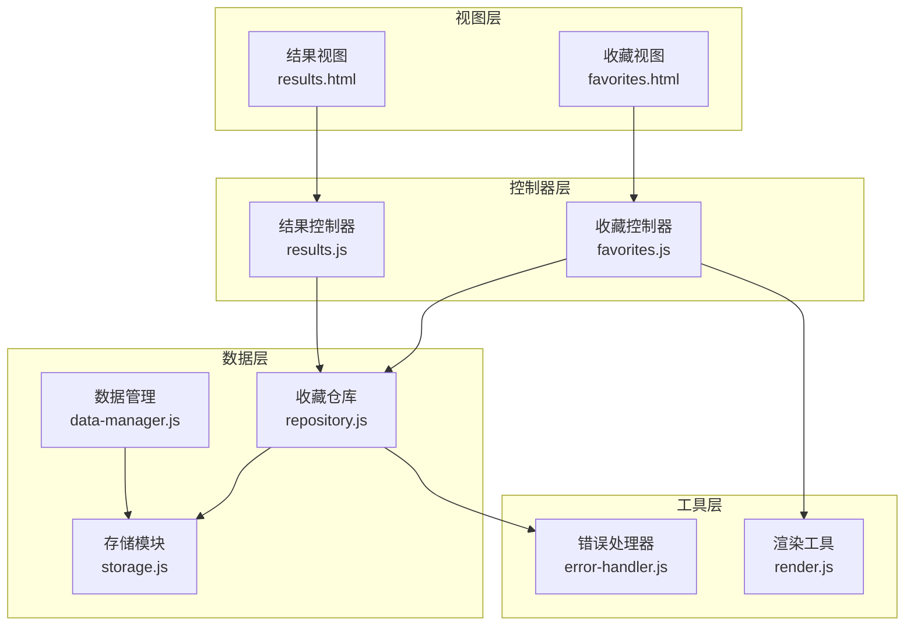
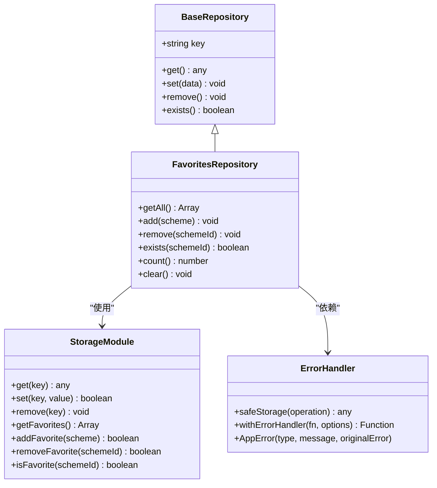
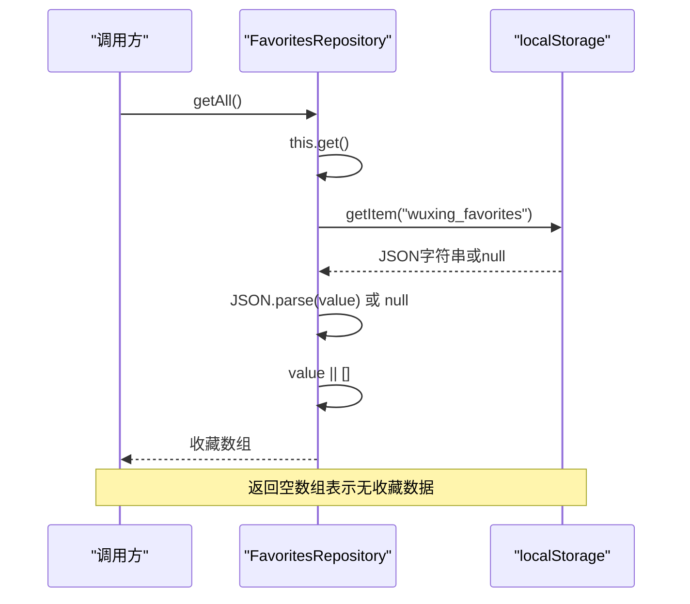
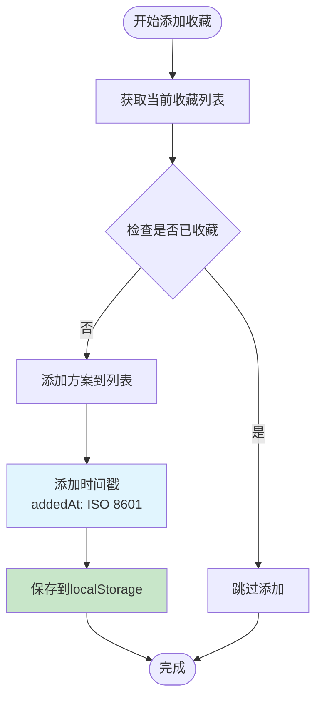
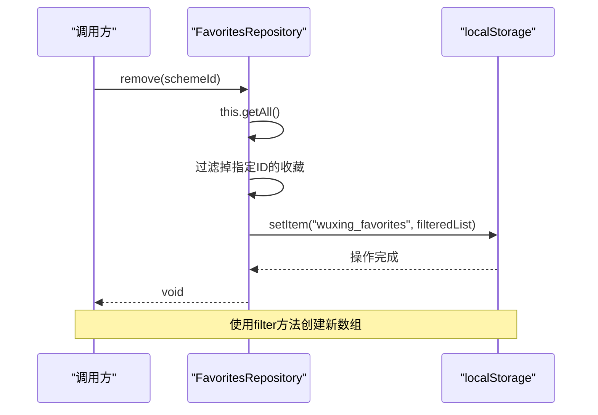
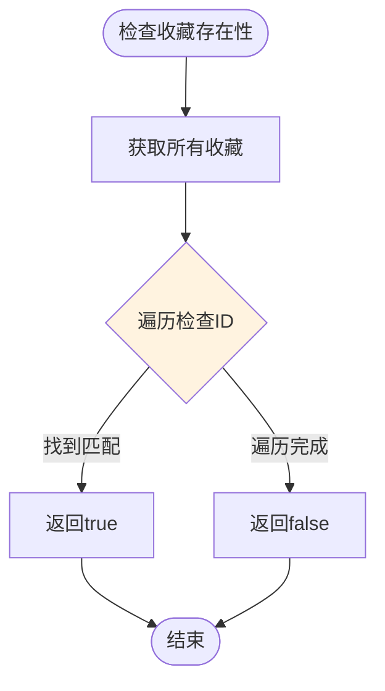
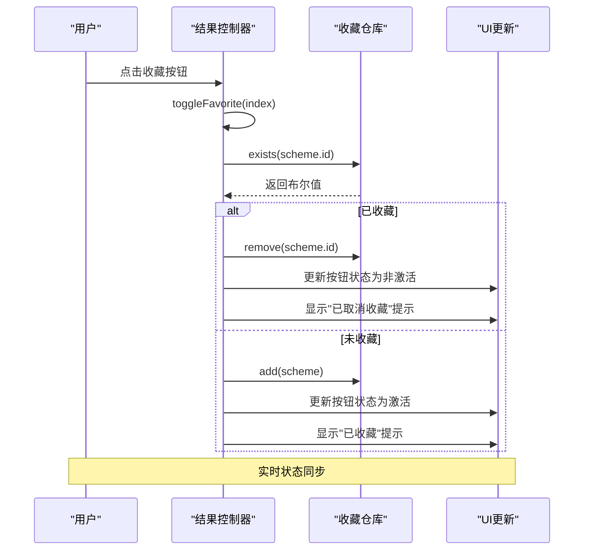
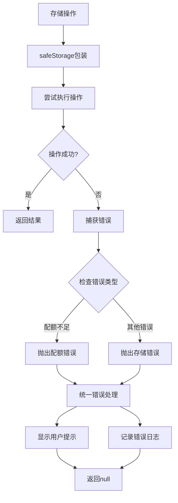
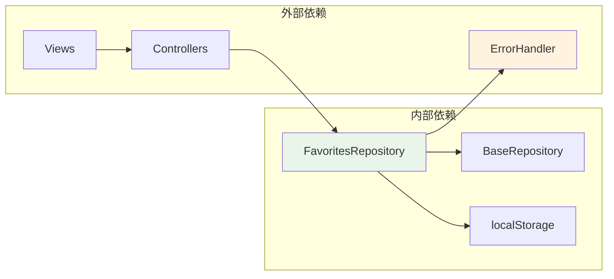
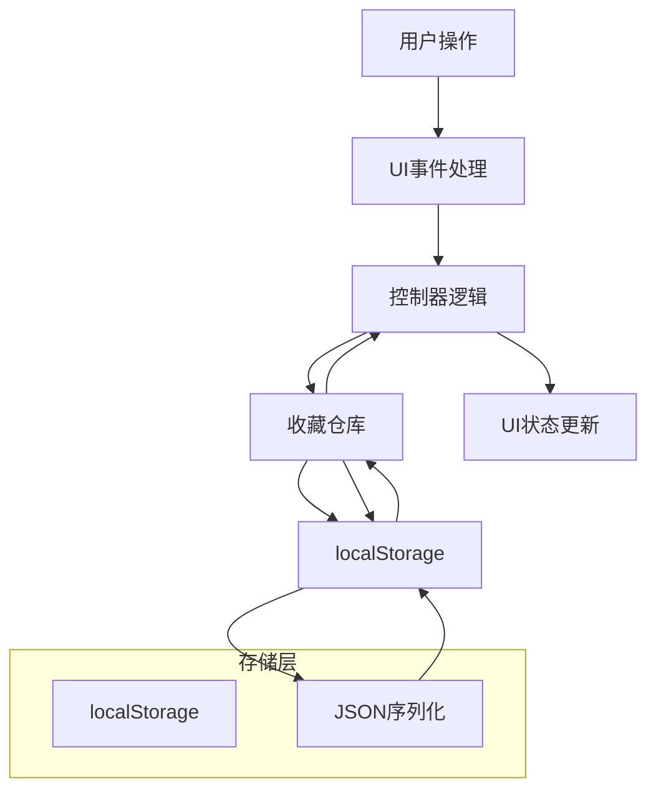

# 收藏管理仓库

<cite>
**本文档引用的文件**
- [repository.js](file://js/data/repository.js)
- [storage.js](file://js/data/storage.js)
- [favorites.js](file://js/controllers/favorites.js)
- [results.js](file://js/controllers/results.js)
- [render.js](file://js/utils/render.js)
- [error-handler.js](file://js/core/error-handler.js)
- [favorites.html](file://views/favorites.html)
- [data-manager.js](file://js/data/data-manager.js)
</cite>

## 目录
1. [简介](#简介)
2. [项目结构](#项目结构)
3. [核心组件](#核心组件)
4. [架构概览](#架构概览)
5. [详细组件分析](#详细组件分析)
6. [依赖关系分析](#依赖关系分析)
7. [性能考虑](#性能考虑)
8. [故障排除指南](#故障排除指南)
9. [结论](#结论)
10. [附录](#附录)

## 简介
收藏管理仓库(FavoritesRepository)是本项目中负责管理用户收藏数据的核心模块。它提供了完整的收藏生命周期管理，包括收藏的添加、查询、删除、去重和统计等功能。该模块采用localStorage作为持久化存储，确保用户收藏数据在浏览器会话间保持一致性和可靠性。

## 项目结构
收藏管理功能涉及多个层次的模块协作：



**图表来源**
- [repository.js](file://js/data/repository.js#L83-L146)
- [favorites.js](file://js/controllers/favorites.js#L10-L88)
- [results.js](file://js/controllers/results.js#L527-L548)

**章节来源**
- [repository.js](file://js/data/repository.js#L1-L394)
- [favorites.js](file://js/controllers/favorites.js#L1-L89)
- [results.js](file://js/controllers/results.js#L1-L614)

## 核心组件
收藏管理仓库由以下核心组件构成：

### 收藏仓库类
- **FavoritesRepository**: 继承自BaseRepository，专门处理收藏数据的CRUD操作
- **BaseRepository**: 提供通用的存储操作接口
- **StorageKeys**: 定义存储键名常量，确保数据隔离和一致性

### 数据模型
收藏数据采用标准化的对象结构：
```javascript
{
  id: string,                    // 方案唯一标识符
  name: string,                  // 方案名称
  color: object,                 // 颜色信息
  material: string,              // 材质
  feeling: string,               // 感受
  annotation: string,            // 五行解读
  source: string,                // 典籍出处
  addedAt: string,               // 收藏时间戳（ISO 8601格式）
  _score?: number,              // 综合得分（可选）
  _breakdown?: object           // 得分分解（可选）
}
```

**章节来源**
- [repository.js](file://js/data/repository.js#L86-L146)
- [repository.js](file://js/data/repository.js#L9-L21)

## 架构概览
收藏管理采用分层架构设计，确保关注点分离和代码复用：



**图表来源**
- [repository.js](file://js/data/repository.js#L46-L81)
- [repository.js](file://js/data/repository.js#L86-L146)
- [error-handler.js](file://js/core/error-handler.js#L153-L163)

## 详细组件分析

### 收藏仓库实现原理

#### getAll() 方法
获取所有收藏数据的完整实现流程：



**图表来源**
- [repository.js](file://js/data/repository.js#L95-L97)
- [repository.js](file://js/data/repository.js#L25-L29)

#### add() 方法
收藏添加的核心逻辑，包含去重和时间戳记录：



**图表来源**
- [repository.js](file://js/data/repository.js#L103-L112)
- [repository.js](file://js/data/repository.js#L105-L108)

#### remove() 方法
移除指定收藏的实现逻辑：



**图表来源**
- [repository.js](file://js/data/repository.js#L118-L121)

#### exists() 方法
高效的收藏存在性检查：



**图表来源**
- [repository.js](file://js/data/repository.js#L128-L130)

#### count() 和 clear() 方法
- **count()**: 直接返回收藏列表长度，时间复杂度O(1)
- **clear()**: 将收藏列表设置为空数组，实现快速清空

**章节来源**
- [repository.js](file://js/data/repository.js#L95-L145)

### 数据存储结构

#### JSON格式规范
收藏数据以数组形式存储在localStorage中，每个元素遵循统一的数据模型：

```javascript
[
  {
    "id": "scheme_001",
    "name": "春日暖阳",
    "color": {
      "name": "浅绿色",
      "hex": "#90EE90"
    },
    "material": "棉麻",
    "feeling": "舒适",
    "annotation": "木属性，适合春季穿着",
    "source": "《黄帝内经》",
    "addedAt": "2024-01-15T10:30:00.000Z"
  },
  {
    "id": "scheme_002",
    "name": "夏日清凉",
    "color": {
      "name": "天蓝色",
      "hex": "#87CEEB"
    },
    "material": "丝绸",
    "feeling": "清爽",
    "annotation": "水属性，适合夏季穿着",
    "source": "《易经》",
    "addedAt": "2024-01-15T11:15:00.000Z"
  }
]
```

#### 存储键管理
使用统一的键名常量确保数据隔离：
- 主键: `wuxing_favorites`
- 相关键: `recommendation_feedback`, `user_preferences`

**章节来源**
- [repository.js](file://js/data/repository.js#L9-L21)

### 交互流程分析

#### 收藏按钮切换流程
收藏按钮的状态切换涉及多个组件的协作：



**图表来源**
- [results.js](file://js/controllers/results.js#L527-L548)
- [repository.js](file://js/data/repository.js#L128-L130)

**章节来源**
- [results.js](file://js/controllers/results.js#L527-L566)
- [render.js](file://js/utils/render.js#L141-L166)

### 错误处理机制

#### 安全存储包装
收藏操作通过安全包装函数确保错误处理的一致性：



**图表来源**
- [error-handler.js](file://js/core/error-handler.js#L153-L163)
- [error-handler.js](file://js/core/error-handler.js#L84-L92)

**章节来源**
- [error-handler.js](file://js/core/error-handler.js#L153-L163)

## 依赖关系分析

### 组件耦合度
收藏管理仓库具有良好的内聚性和低耦合性：



**图表来源**
- [repository.js](file://js/data/repository.js#L6-L7)
- [repository.js](file://js/data/repository.js#L380-L385)

### 数据流图
收藏数据在系统中的流转路径：



**图表来源**
- [favorites.js](file://js/controllers/favorites.js#L16-L30)
- [results.js](file://js/controllers/results.js#L527-L548)

**章节来源**
- [repository.js](file://js/data/repository.js#L1-L394)

## 性能考虑

### 时间复杂度分析
- **getAll()**: O(n) - 需要读取和解析整个收藏列表
- **add()**: O(n) - 包含去重检查和数组操作
- **remove()**: O(n) - 需要过滤整个列表
- **exists()**: O(n) - 遍历检查ID匹配
- **count()**: O(1) - 直接返回数组长度
- **clear()**: O(1) - 设置空数组

### 内存优化策略
1. **懒加载**: 仅在需要时获取收藏数据
2. **增量更新**: 避免不必要的数据重载
3. **缓存机制**: 利用全局变量缓存当前显示的收藏列表

### 存储优化
- **数据压缩**: 收藏数据相对较小，无需额外压缩
- **批量操作**: 支持一次性批量更新
- **清理策略**: 提供clear()方法进行数据清理

## 故障排除指南

### 常见问题及解决方案

#### 收藏数据丢失
**症状**: 收藏列表显示为空
**原因分析**:
- localStorage空间不足
- 浏览器隐私模式限制
- 数据被意外清除

**解决步骤**:
1. 检查浏览器存储空间使用情况
2. 确认不是在隐私浏览模式下
3. 使用数据管理功能进行备份恢复

#### 收藏重复添加
**症状**: 同一收藏多次出现在列表中
**原因分析**: 去重逻辑失效或ID冲突

**解决步骤**:
1. 验证方案ID的唯一性
2. 检查exists()方法的实现
3. 确认数据库完整性

#### 性能问题
**症状**: 页面加载缓慢或操作响应迟缓

**优化建议**:
1. 减少不必要的getAll()调用
2. 使用局部缓存机制
3. 避免频繁的DOM操作

**章节来源**
- [error-handler.js](file://js/core/error-handler.js#L158-L162)
- [data-manager.js](file://js/data/data-manager.js#L48-L72)

## 结论
收藏管理仓库(FavoritesRepository)是一个设计良好、功能完整的数据管理模块。它通过清晰的分层架构、完善的错误处理机制和高效的算法实现，为用户提供可靠的收藏管理体验。

### 主要优势
1. **架构清晰**: 分层设计确保了代码的可维护性
2. **功能完整**: 提供了完整的CRUD操作和扩展功能
3. **性能优化**: 采用合理的数据结构和算法
4. **错误处理**: 统一的错误处理机制提升了用户体验

### 改进建议
1. **索引优化**: 对于大量收藏数据，可考虑建立ID索引
2. **批量操作**: 支持批量添加和删除操作
3. **数据迁移**: 提供版本升级时的数据迁移机制

## 附录

### 最佳实践指南

#### 数据一致性保证
1. **原子性操作**: 确保收藏操作的原子性
2. **事务处理**: 对于复杂的批量操作，考虑事务机制
3. **数据验证**: 在存储前验证数据的完整性

#### 性能优化建议
1. **延迟加载**: 仅在收藏页面加载时获取数据
2. **缓存策略**: 合理使用内存缓存减少存储访问
3. **异步处理**: 对于大数据操作使用异步处理

#### 错误处理策略
1. **用户友好**: 显示清晰的错误信息
2. **日志记录**: 记录详细的错误日志便于调试
3. **降级处理**: 在存储失败时提供降级方案

### 使用场景示例

#### 基本收藏管理
```javascript
// 添加收藏
favoritesRepo.add(scheme);

// 检查收藏状态
if (favoritesRepo.exists(scheme.id)) {
    console.log('已收藏');
}

// 获取收藏数量
const count = favoritesRepo.count();

// 移除收藏
favoritesRepo.remove(scheme.id);

// 清空所有收藏
favoritesRepo.clear();
```

#### 集成到控制器
```javascript
// 结果页面收藏切换
toggleFavorite(index) {
    const scheme = window.__currentSchemes[index];
    const isFav = favoritesRepo.exists(scheme.id);
    
    if (isFav) {
        favoritesRepo.remove(scheme.id);
    } else {
        favoritesRepo.add(scheme);
    }
    
    // 更新UI状态
    this.updateFavoriteButton(index, !isFav);
}
```

**章节来源**
- [repository.js](file://js/data/repository.js#L95-L145)
- [results.js](file://js/controllers/results.js#L527-L566)