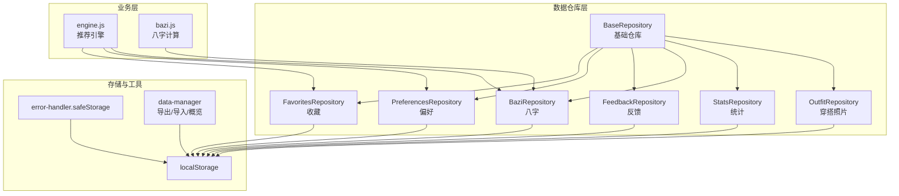
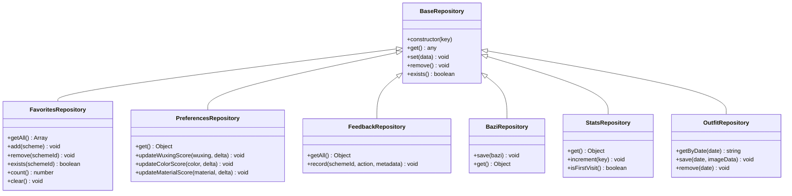
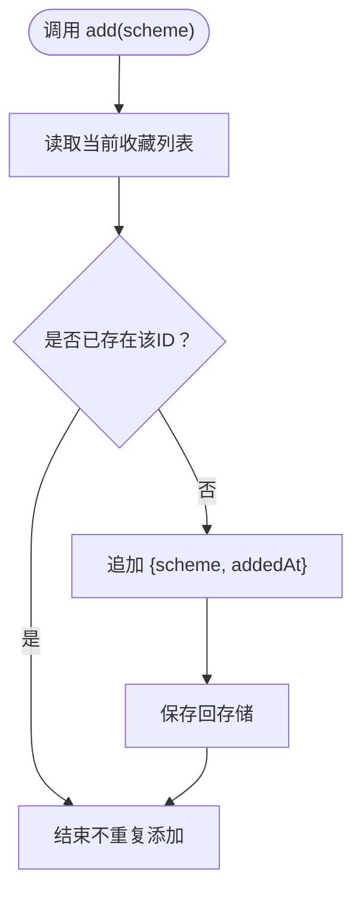
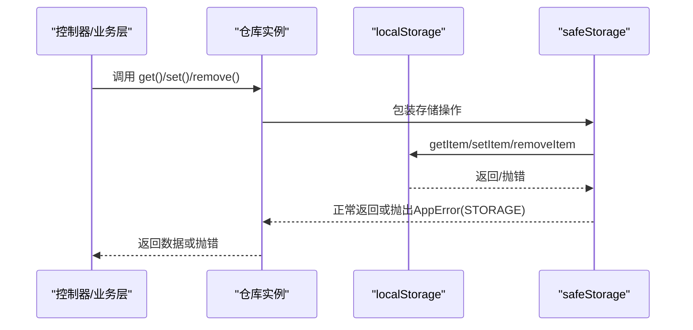

# 数据仓库层

<cite>
**本文引用的文件**
- [repository.js](file://js/data/repository.js)
- [storage.js](file://js/data/storage.js)
- [data-manager.js](file://js/data/data-manager.js)
- [error-handler.js](file://js/core/error-handler.js)
- [store.js](file://js/core/store.js)
- [favorites.js](file://js/controllers/favorites.js)
- [upload.js](file://js/controllers/upload.js)
- [engine.js](file://js/services/engine.js)
- [bazi.js](file://js/services/bazi.js)
</cite>

## 目录
1. [简介](#简介)
2. [项目结构](#项目结构)
3. [核心组件](#核心组件)
4. [架构总览](#架构总览)
5. [组件详解](#组件详解)
6. [依赖关系分析](#依赖关系分析)
7. [性能考量](#性能考量)
8. [故障排查指南](#故障排查指南)
9. [结论](#结论)
10. [附录](#附录)

## 简介
本文件面向“数据仓库层”（Repository Layer），系统性解析仓库模块的设计架构与实现原理，重点覆盖：
- BaseRepository 基类的设计模式与职责边界
- 各具体 Repository 的业务语义与数据抽象
- 存储键名常量体系、安全存储与序列化机制
- 使用示例、最佳实践与扩展方法
- 数据一致性、性能优化与错误恢复策略

Repository 层位于应用数据持久化与业务服务之间，向上提供稳定的数据访问接口，向下封装存储细节（localStorage），并通过统一的安全包装与错误处理保障可靠性。

## 项目结构
仓库层主要由以下文件构成：
- js/data/repository.js：统一的仓库实现与各类具体仓库
- js/data/storage.js：带前缀的本地存储工具（历史遗留）
- js/data/data-manager.js：数据导出/导入与概览
- js/core/error-handler.js：统一错误处理与安全存储包装
- js/core/store.js：全局状态管理（与仓库层协作）

图表来源
- [repository.js](file://js/data/repository.js#L46-L81)
- [repository.js](file://js/data/repository.js#L86-L146)
- [repository.js](file://js/data/repository.js#L151-L201)
- [repository.js](file://js/data/repository.js#L206-L259)
- [repository.js](file://js/data/repository.js#L264-L287)
- [repository.js](file://js/data/repository.js#L292-L337)
- [repository.js](file://js/data/repository.js#L342-L377)
- [error-handler.js](file://js/core/error-handler.js#L153-L163)
- [data-manager.js](file://js/data/data-manager.js#L24-L42)

章节来源
- [repository.js](file://js/data/repository.js#L1-L394)
- [storage.js](file://js/data/storage.js#L1-L145)
- [data-manager.js](file://js/data/data-manager.js#L1-L376)
- [error-handler.js](file://js/core/error-handler.js#L1-L190)

## 核心组件
- BaseRepository：统一的 CRUD 接口与存在性判断，封装安全存储调用
- 具体仓库：按业务域划分，提供领域内专用方法（如收藏、偏好、反馈、八字、统计、穿搭照片）
- 存储键名常量：集中管理键名，避免硬编码
- 安全存储包装：对 localStorage 操作进行异常捕获与错误类型化
- 数据管理：支持导出/导入/概览，便于备份与迁移

章节来源
- [repository.js](file://js/data/repository.js#L46-L81)
- [repository.js](file://js/data/repository.js#L8-L21)
- [error-handler.js](file://js/core/error-handler.js#L153-L163)
- [data-manager.js](file://js/data/data-manager.js#L8-L22)

## 架构总览
仓库层采用“基础抽象 + 领域扩展”的分层设计：
- 基础层：BaseRepository 提供 get/set/remove/exists 等通用能力
- 领域层：各具体仓库在基础之上实现业务方法，并负责数据结构的序列化/反序列化
- 安全层：通过 safeStorage 包裹 localStorage，统一错误类型与提示
- 工具层：数据管理器提供导出/导入/概览能力，配合仓库层完成数据生命周期管理

图表来源
- [repository.js](file://js/data/repository.js#L46-L81)
- [repository.js](file://js/data/repository.js#L86-L146)
- [repository.js](file://js/data/repository.js#L151-L201)
- [repository.js](file://js/data/repository.js#L206-L259)
- [repository.js](file://js/data/repository.js#L264-L287)
- [repository.js](file://js/data/repository.js#L292-L337)
- [repository.js](file://js/data/repository.js#L342-L377)

## 组件详解

### BaseRepository 基类
- 设计要点
  - 统一的存储键注入，隔离具体存储介质
  - 封装 get/set/remove/exists，屏蔽序列化细节
  - 通过安全包装确保异常可控
- 关键行为
  - get：JSON.parse 解析，不存在返回 null
  - set：JSON.stringify 序列化，再写入
  - remove：删除键
  - exists：基于 get 结果判断

章节来源
- [repository.js](file://js/data/repository.js#L46-L81)
- [error-handler.js](file://js/core/error-handler.js#L153-L163)

### 收藏仓库 FavoritesRepository
- 业务语义
  - 存储用户收藏的方案集合，支持添加、移除、查询、计数与清空
- 数据结构
  - 数组元素包含方案基本信息与收藏时间戳
- 关键方法
  - getAll：获取收藏列表
  - add：去重后追加并保存
  - remove：过滤后保存
  - exists：按 id 判断
  - count：统计数量
  - clear：清空

图表来源
- [repository.js](file://js/data/repository.js#L103-L112)

章节来源
- [repository.js](file://js/data/repository.js#L86-L146)

### 用户偏好仓库 PreferencesRepository
- 业务语义
  - 维护用户对五行、颜色、材质、场景的偏好分数
- 默认值策略
  - 若存储为空，返回预设默认偏好
- 关键方法
  - get：返回偏好对象（含默认值）
  - updateWuxingScore/updateColorScore/updateMaterialScore：增量更新

章节来源
- [repository.js](file://js/data/repository.js#L151-L201)

### 反馈仓库 FeedbackRepository
- 业务语义
  - 记录每个方案的交互行为（浏览、收藏、选择、忽略）与最后交互时间
- 数据结构
  - 以方案ID为键的对象，值包含计数与元数据
- 关键方法
  - getAll：获取全部反馈
  - record：根据动作类型累加计数并更新时间戳

章节来源
- [repository.js](file://js/data/repository.js#L206-L259)

### 八字仓库 BaziRepository
- 业务语义
  - 存储用户最近一次八字结果，包含保存时间戳
- 关键方法
  - save：写入包含时间戳的对象
  - get：透传基础 get

章节来源
- [repository.js](file://js/data/repository.js#L264-L287)

### 使用统计仓库 StatsRepository
- 业务语义
  - 记录访问次数、生成次数、上传次数及首次/最近访问时间
- 关键方法
  - get：返回统计对象（含默认值）
  - increment：按键累加，访问计数时维护首末次时间
  - isFirstVisit：判断是否首次访问

章节来源
- [repository.js](file://js/data/repository.js#L292-L337)

### 穿搭照片仓库 OutfitRepository
- 业务语义
  - 以日期为键存储当日穿搭照片数据
- 关键方法
  - getByDate：按日期查询
  - save：按日期写入
  - remove：按日期删除

章节来源
- [repository.js](file://js/data/repository.js#L342-L377)

### 存储键名常量与安全存储
- 键名常量
  - 集中式定义于 StorageKeys，涵盖反馈、偏好、收藏、八字、统计、精度、场景、首次访问、穿搭照片等
- 安全存储
  - storage 对象封装 getItem/setItem/removeItem，内部通过 safeStorage 包裹 localStorage
  - safeStorage 捕获异常并转换为统一的 AppError（类型 STORAGE）

章节来源
- [repository.js](file://js/data/repository.js#L8-L21)
- [repository.js](file://js/data/repository.js#L24-L41)
- [error-handler.js](file://js/core/error-handler.js#L153-L163)

### 数据序列化与一致性
- 序列化策略
  - 写入前 JSON.stringify，读取后 JSON.parse
  - 通过 get/set 的封装保证一致的序列化/反序列化
- 一致性保障
  - 原子性：单键写入，避免部分写入导致的数据损坏
  - 默认值：读取空值时返回合理默认，降低业务层分支复杂度
  - 去重与过滤：收藏仓库在写入前执行去重与过滤，保证数据整洁

章节来源
- [repository.js](file://js/data/repository.js#L25-L34)
- [repository.js](file://js/data/repository.js#L95-L112)
- [repository.js](file://js/data/repository.js#L160-L167)
- [repository.js](file://js/data/repository.js#L301-L309)

### 数据导出/导入与概览
- 导出
  - data-manager.js 收集指定键名集合，生成包含版本、导出时间、应用名与用户数据的对象
- 导入
  - 校验版本与结构，支持预览、合并或覆盖导入
- 概览
  - 统计键数量、估算数据体积，生成可视化面板

章节来源
- [data-manager.js](file://js/data/data-manager.js#L48-L72)
- [data-manager.js](file://js/data/data-manager.js#L106-L135)
- [data-manager.js](file://js/data/data-manager.js#L143-L184)
- [data-manager.js](file://js/data/data-manager.js#L235-L271)

## 依赖关系分析
- 仓库层依赖
  - error-handler.safeStorage：统一异常处理与错误类型化
  - localStorage：底层持久化介质
- 业务层依赖
  - engine.js 通过仓库访问收藏、偏好、八字、统计等数据
  - bazi.js 与 BaziRepository 协作，保存/读取八字结果
- 控制器层依赖
  - favorites.js 使用 favoritesRepo
  - upload.js 使用 outfitRepo

图表来源
- [repository.js](file://js/data/repository.js#L55-L72)
- [error-handler.js](file://js/core/error-handler.js#L153-L163)

章节来源
- [favorites.js](file://js/controllers/favorites.js#L28-L30)
- [upload.js](file://js/controllers/upload.js#L29-L33)
- [engine.js](file://js/services/engine.js#L323-L393)
- [bazi.js](file://js/services/bazi.js#L127-L183)

## 性能考量
- 读写复杂度
  - 单键读写为 O(1)，数组/对象遍历取决于数据规模
- 序列化成本
  - 大对象频繁序列化/反序列化会带来 CPU 开销，建议：
    - 合理拆分键，避免单键过大
    - 在业务层做必要的缓存与去抖
- 存储容量
  - localStorage 有容量限制，建议：
    - 使用 data-manager.js 的概览功能监控体积
    - 定期清理冗余数据（如旧的反馈或统计）
- 并发与一致性
  - 单键写入天然具备原子性，避免跨键事务
  - 如需批量更新，可在业务层聚合后再一次性写入

[本节为通用性能建议，无需特定文件引用]

## 故障排查指南
- 常见错误类型（STORAGE）
  - 存储空间不足：QuotaExceededError
  - 隐私模式/禁用存储：其他存储异常
- 排查步骤
  - 检查浏览器存储权限与容量
  - 使用 data-manager.js 的概览功能确认数据体积
  - 通过导出文件验证数据完整性
- 恢复机制
  - 导入备份文件恢复
  - 清除所有数据后重试（谨慎操作）

章节来源
- [error-handler.js](file://js/core/error-handler.js#L158-L162)
- [data-manager.js](file://js/data/data-manager.js#L225-L229)

## 结论
仓库层通过 BaseRepository 抽象与具体仓库扩展，实现了：
- 统一的存储接口与数据抽象
- 明确的领域职责与方法边界
- 安全的存储包装与错误处理
- 完备的数据生命周期管理（导出/导入/概览）

在实际使用中，建议遵循“单键单一职责、默认值兜底、序列化最小化、错误类型化”的原则，结合业务层与控制器层的协作，构建稳定可靠的数据持久化体系。

[本节为总结性内容，无需特定文件引用]

## 附录

### 使用示例与最佳实践
- 收藏管理
  - 添加收藏：调用收藏仓库的 add 方法，内部自动去重并保存
  - 移除收藏：调用 remove 并传入方案 ID
  - 查询收藏：getAll 获取列表，exists 按 ID 判断
- 用户偏好
  - 读取偏好：get 返回包含默认值的对象
  - 更新偏好：按维度调用对应的 updateXxxScore
- 反馈记录
  - record：按动作类型累加计数并更新时间戳
- 八字数据
  - 保存：save 写入包含时间戳的对象
  - 读取：get 返回最近一次结果
- 使用统计
  - increment：按键累加（访问时维护首末次时间）
  - isFirstVisit：判断是否首次访问
- 穿搭照片
  - save：按日期写入图片数据
  - remove：按日期删除
- 最佳实践
  - 优先使用仓库提供的领域方法，避免直接操作底层存储
  - 对大对象进行拆分存储，降低序列化成本
  - 定期导出备份，确保数据可恢复
  - 在业务层对异常进行类型化处理，避免吞掉错误

章节来源
- [repository.js](file://js/data/repository.js#L86-L146)
- [repository.js](file://js/data/repository.js#L151-L201)
- [repository.js](file://js/data/repository.js#L206-L259)
- [repository.js](file://js/data/repository.js#L264-L287)
- [repository.js](file://js/data/repository.js#L292-L337)
- [repository.js](file://js/data/repository.js#L342-L377)
- [data-manager.js](file://js/data/data-manager.js#L77-L99)

### 扩展方法
- 新增仓库
  - 继承 BaseRepository，注入对应键名常量
  - 在 get/set 中处理默认值与序列化
- 新增键名
  - 在 StorageKeys 中新增常量，保持命名规范
- 新增业务方法
  - 在具体仓库中增加领域专用方法，保持单一职责
- 数据迁移
  - 使用 data-manager.js 的导入/导出能力进行迁移
  - 注意版本兼容性校验

章节来源
- [repository.js](file://js/data/repository.js#L8-L21)
- [repository.js](file://js/data/repository.js#L46-L81)
- [data-manager.js](file://js/data/data-manager.js#L106-L135)