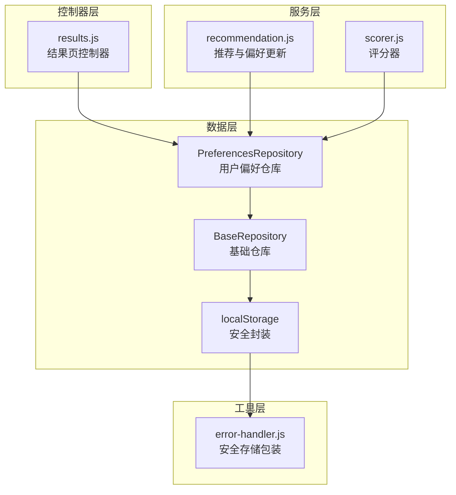
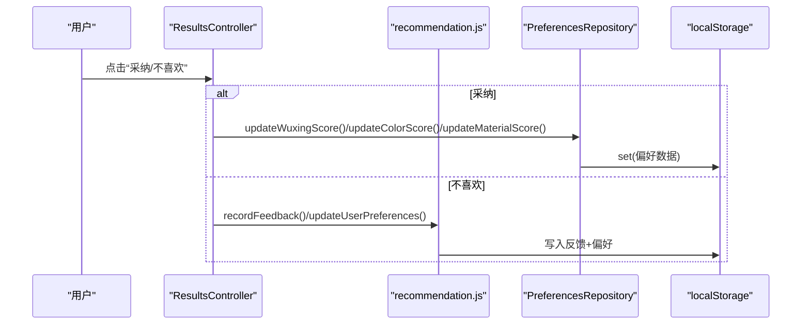
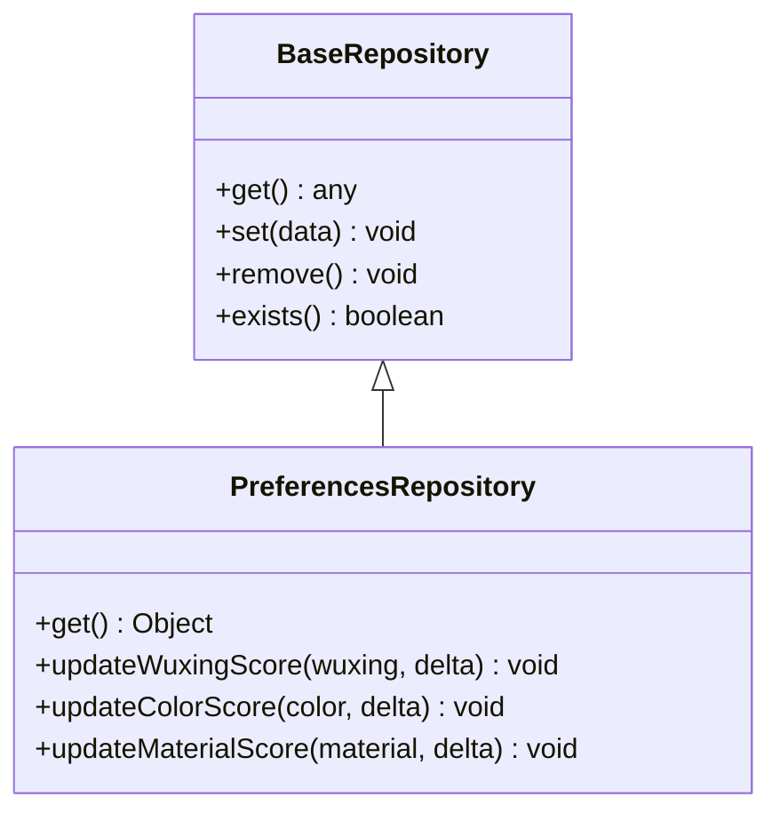
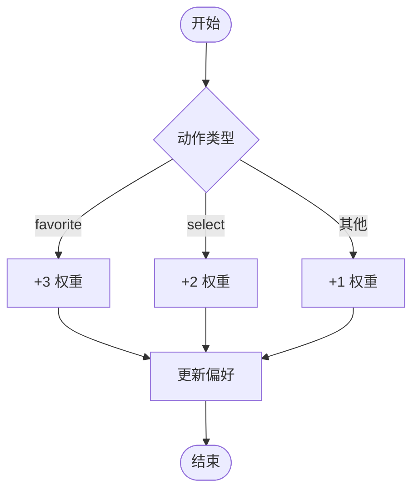
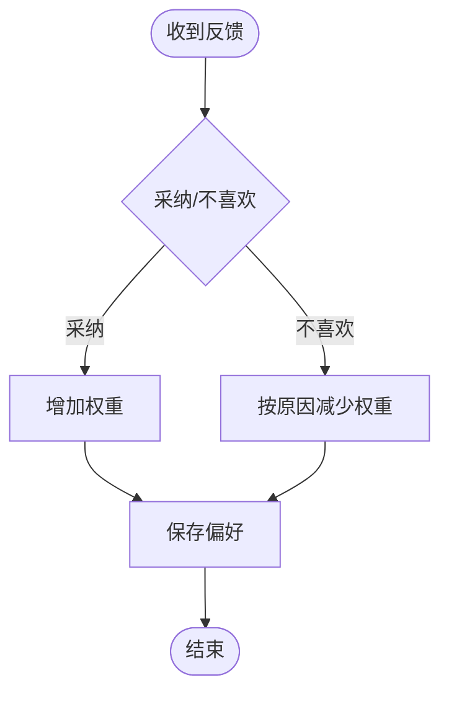
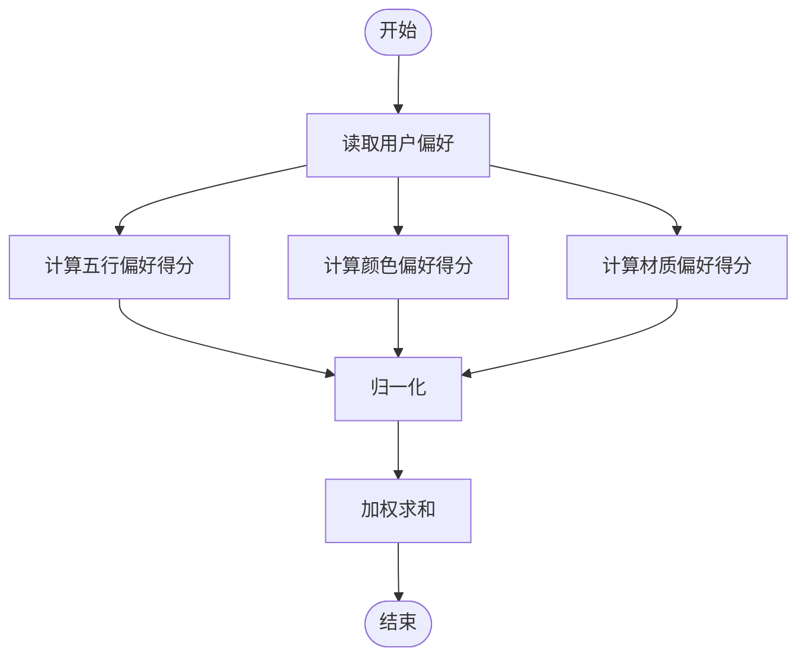
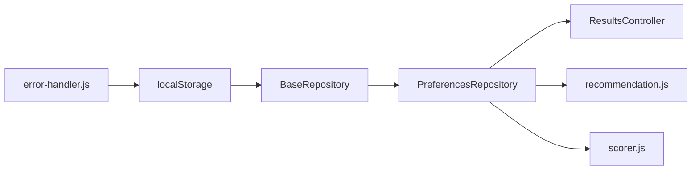

# 用户偏好仓库

<cite>
**本文档引用的文件**
- [repository.js](file://js/data/repository.js)
- [recommendation.js](file://js/services/recommendation.js)
- [results.js](file://js/controllers/results.js)
- [scorer.js](file://js/core/scorer.js)
- [storage.js](file://js/data/storage.js)
- [error-handler.js](file://js/core/error-handler.js)
</cite>

## 目录
1. [简介](#简介)
2. [项目结构](#项目结构)
3. [核心组件](#核心组件)
4. [架构概览](#架构概览)
5. [详细组件分析](#详细组件分析)
6. [依赖分析](#依赖分析)
7. [性能考量](#性能考量)
8. [故障排查指南](#故障排查指南)
9. [结论](#结论)
10. [附录](#附录)

## 简介
本文件面向“用户偏好仓库(PreferencesRepository)”的技术文档，系统性解析用户偏好的数据结构与评分体系，涵盖以下要点：
- 五大偏好维度：五行偏好(wuxingScores)、颜色偏好(colorScores)、材质偏好(materialScores)、场景偏好(sceneScores)的存储格式与默认初始化机制
- 评分更新方法：updateWuxingScore()、updateColorScore()、updateMaterialScore() 的实现原理与调用路径
- 默认偏好初始化策略与数据验证规则
- 偏好数据的累加算法与边界处理
- 使用示例：偏好权重调整与个性化推荐影响
- 数据迁移与版本兼容性考虑

## 项目结构
用户偏好相关代码分布在数据层仓库、服务层推荐算法、控制器层反馈收集以及评分器模块中，形成“数据持久化—业务逻辑—交互控制—评分计算”的完整链路。

**图表来源**
- [repository.js](file://js/data/repository.js#L151-L201)
- [recommendation.js](file://js/services/recommendation.js#L192-L218)
- [results.js](file://js/controllers/results.js#L492-L525)
- [scorer.js](file://js/core/scorer.js#L215-L237)
- [error-handler.js](file://js/core/error-handler.js#L153-L163)

**章节来源**
- [repository.js](file://js/data/repository.js#L1-L201)
- [recommendation.js](file://js/services/recommendation.js#L1-L284)
- [results.js](file://js/controllers/results.js#L464-L525)
- [scorer.js](file://js/core/scorer.js#L1-L317)

## 核心组件
- 用户偏好仓库(PreferencesRepository)：负责偏好数据的读取、更新与默认初始化
- 推荐服务(recommendation.js)：记录用户反馈并同步更新用户偏好
- 结果页控制器(results.js)：处理用户采纳/不喜欢反馈，并更新偏好
- 评分器(scorer.js)：在评分过程中使用用户偏好进行个性化加成
- 存储工具(storage.js)与安全存储(error-handler.js)：提供统一的安全存储接口

**章节来源**
- [repository.js](file://js/data/repository.js#L151-L201)
- [recommendation.js](file://js/services/recommendation.js#L192-L218)
- [results.js](file://js/controllers/results.js#L492-L525)
- [scorer.js](file://js/core/scorer.js#L215-L237)
- [storage.js](file://js/data/storage.js#L1-L145)
- [error-handler.js](file://js/core/error-handler.js#L153-L163)

## 架构概览
用户偏好数据流的关键路径如下：
- 用户行为触发：收藏、采纳、不喜欢、选择等
- 反馈记录：写入反馈存储与偏好存储
- 个性化评分：评分器读取偏好，结合历史反馈与今日运势计算最终得分
- 数据持久化：通过仓库层统一写入localStorage

**图表来源**
- [results.js](file://js/controllers/results.js#L492-L525)
- [recommendation.js](file://js/services/recommendation.js#L192-L218)
- [repository.js](file://js/data/repository.js#L174-L200)

## 详细组件分析

### 用户偏好仓库(PreferencesRepository)
- 数据结构
  - wuxingScores：对象，键为五行标识，值为数值权重
  - colorScores：对象，键为颜色名称，值为数值权重
  - materialScores：对象，键为材质名称，值为数值权重
  - sceneScores：对象，键为场景ID，值为数值权重（当前实现主要存在于推荐服务中）
- 默认初始化
  - get()方法返回默认偏好结构，确保首次使用无须手动初始化
- 更新方法
  - updateWuxingScore(wuxing, delta)：对指定五行权重累加
  - updateColorScore(color, delta)：对指定颜色权重累加
  - updateMaterialScore(material, delta)：对指定材质权重累加
- 数据验证与边界
  - 采用惰性初始化：若键不存在则赋默认值
  - 累加算法：(当前值 || 0) + delta
  - 边界处理：未显式限制上下限，需在上层逻辑中控制delta范围

**图表来源**
- [repository.js](file://js/data/repository.js#L46-L81)
- [repository.js](file://js/data/repository.js#L151-L201)

**章节来源**
- [repository.js](file://js/data/repository.js#L151-L201)

### 推荐服务中的偏好更新
- 记录反馈并更新偏好
  - recordFeedback()：按动作类型(favorite/select/view/dismiss)更新偏好权重
  - updateUserPreferences()：统一更新wuxingScores/colorScores/materialScores
- 权重规则
  - favorite: +3
  - select: +2
  - 其他: +1
- 个性化评分
  - calculatePersonalizedScore()：基于偏好权重归一化后加权求和

**图表来源**
- [recommendation.js](file://js/services/recommendation.js#L192-L218)
- [recommendation.js](file://js/services/recommendation.js#L247-L284)

**章节来源**
- [recommendation.js](file://js/services/recommendation.js#L145-L218)
- [recommendation.js](file://js/services/recommendation.js#L247-L284)

### 结果页控制器中的偏好更新
- 采纳反馈：增加wuxing(+5)、color(+3)、material(+3)
- 不喜欢反馈：按原因减少对应权重；无原因时整体降低
- 本地存储键：wuxing_preferences

**图表来源**
- [results.js](file://js/controllers/results.js#L492-L525)

**章节来源**
- [results.js](file://js/controllers/results.js#L464-L525)

### 评分器中的偏好使用
- scoreHistory()：读取用户偏好，归一化后加权计算历史偏好得分
- 权重分配：wuxing(40%)、color(30%)、material(30%)

**图表来源**
- [scorer.js](file://js/core/scorer.js#L215-L237)

**章节来源**
- [scorer.js](file://js/core/scorer.js#L215-L237)

## 依赖分析
- 仓库层依赖安全存储包装，保证localStorage操作的健壮性
- 控制器与服务层均通过仓库层访问偏好数据，解耦了UI与数据逻辑
- 评分器直接依赖用户配置与上下文，间接使用偏好数据

**图表来源**
- [repository.js](file://js/data/repository.js#L24-L41)
- [error-handler.js](file://js/core/error-handler.js#L153-L163)

**章节来源**
- [repository.js](file://js/data/repository.js#L1-L41)
- [error-handler.js](file://js/core/error-handler.js#L153-L163)

## 性能考量
- 读取偏好：get()为O(1)，默认初始化成本极低
- 写入偏好：set()为O(1)，JSON序列化开销小
- 归一化计算：每次评分需遍历偏好对象，复杂度O(n)，n为偏好键数量
- 建议
  - 在高频评分场景中缓存偏好最大值，避免重复计算
  - 对偏好键数量进行上限控制，防止极端情况下的遍历开销

[本节为通用性能讨论，无需特定文件引用]

## 故障排查指南
- 存储异常
  - 现象：偏好无法保存或读取
  - 排查：确认浏览器隐私模式、存储配额、localStorage可用性
  - 参考：安全存储包装会捕获QuotaExceededError并抛出应用错误
- 数据格式异常
  - 现象：偏好数据损坏导致解析失败
  - 排查：检查存储键值是否被意外修改；必要时清理偏好数据
- 权重异常
  - 现象：偏好权重异常增大或减小
  - 排查：核对反馈权重规则与调用路径；确保delta参数合理

**章节来源**
- [error-handler.js](file://js/core/error-handler.js#L153-L163)
- [repository.js](file://js/data/repository.js#L24-L41)

## 结论
PreferencesRepository提供了简洁、可扩展的用户偏好管理能力，配合推荐服务与评分器实现了从行为到个性化的闭环。通过默认初始化与安全存储封装，系统在易用性与稳定性之间取得平衡。建议在上层逻辑中加强权重边界控制与缓存策略，以进一步提升性能与可靠性。

[本节为总结性内容，无需特定文件引用]

## 附录

### 使用示例与最佳实践
- 偏好权重调整
  - 通过控制器或服务层调用updateWuxingScore()/updateColorScore()/updateMaterialScore()进行微调
  - 注意控制delta范围，避免极端值影响推荐质量
- 个性化推荐影响
  - 偏好权重越高，对应维度的个性化得分越高
  - 建议结合历史反馈与今日运势共同评估推荐效果
- 数据迁移与版本兼容
  - 新增偏好维度时，确保get()返回的默认结构包含新增字段
  - 若删除旧字段，需在迁移脚本中移除旧键或提供兼容读取逻辑

[本节为通用指导，无需特定文件引用]