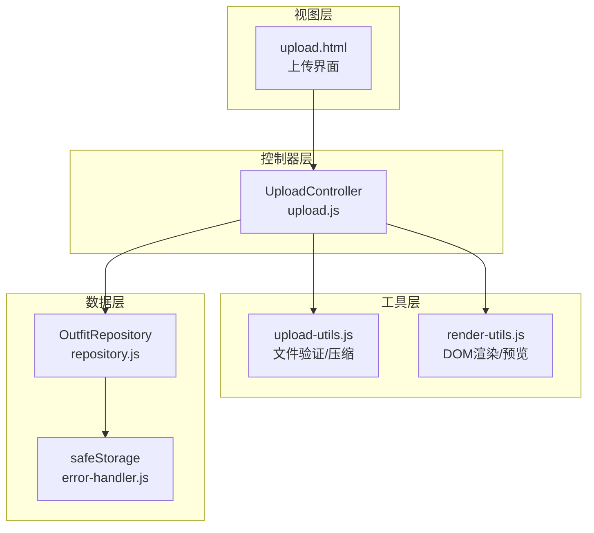
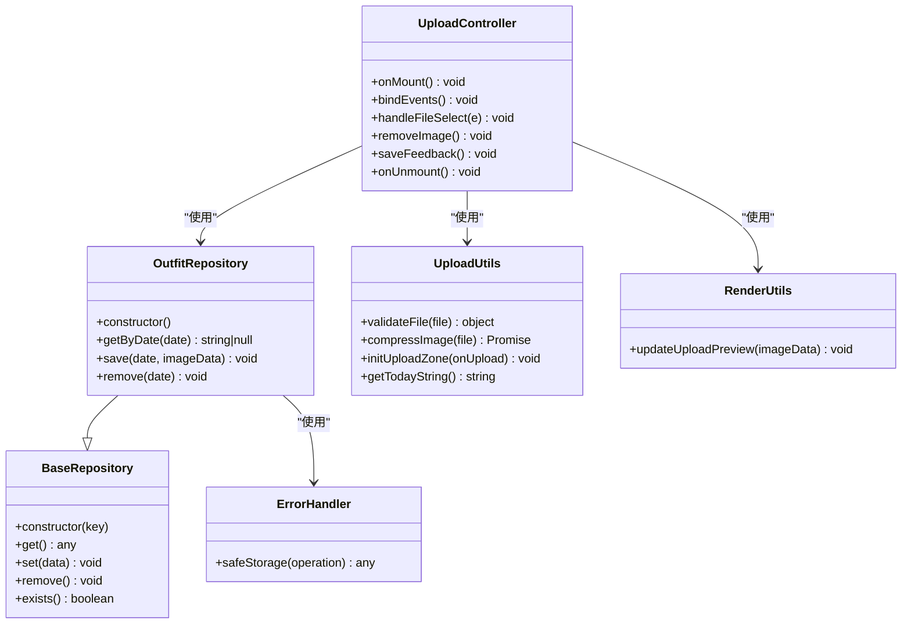
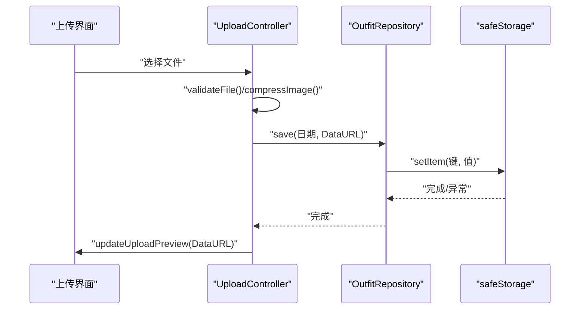
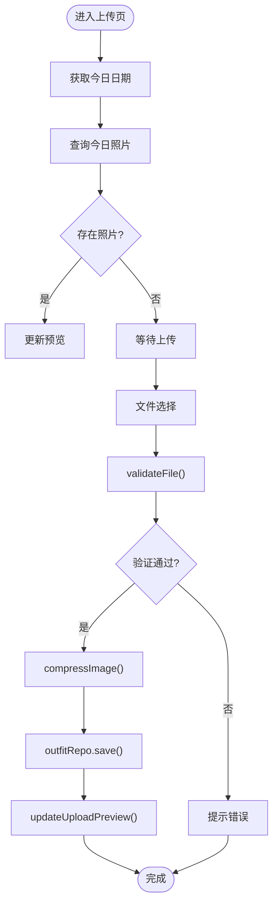
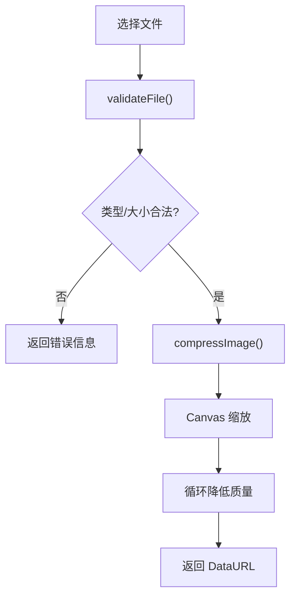
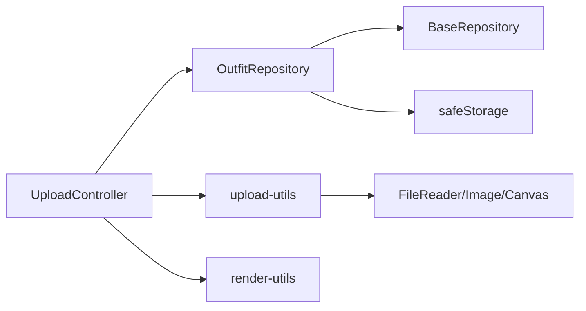

# 穿搭照片仓库

<cite>
**本文档引用的文件**
- [repository.js](file://js/data/repository.js)
- [upload.js](file://js/controllers/upload.js)
- [upload-utils.js](file://js/utils/upload.js)
- [render-utils.js](file://js/utils/render.js)
- [error-handler.js](file://js/core/error-handler.js)
- [upload.html](file://views/upload.html)
- [storage.js](file://js/data/storage.js)
</cite>

## 目录
1. [简介](#简介)
2. [项目结构](#项目结构)
3. [核心组件](#核心组件)
4. [架构概览](#架构概览)
5. [详细组件分析](#详细组件分析)
6. [依赖关系分析](#依赖关系分析)
7. [性能考量](#性能考量)
8. [故障排除指南](#故障排除指南)
9. [结论](#结论)
10. [附录](#附录)

## 简介
本文件为穿搭照片仓库(OutfitRepository)的详细技术文档，深入解析穿搭照片的存储结构与日期索引机制，涵盖按日期组织的照片数据格式、getByDate()、save()、remove()等方法的实现原理与使用场景、图片数据的序列化存储与检索流程、日期格式规范与数据验证规则，并提供最佳实践建议（存储空间管理与数据清理策略）、与上传功能的集成方式以及性能优化考虑。

## 项目结构
该项目采用模块化架构，数据层通过仓库模式抽象存储实现，控制器负责业务流程编排，工具模块提供通用能力，视图层负责展示与交互。与穿搭照片仓库直接相关的模块包括：
- 数据仓库层：repository.js 中的 OutfitRepository
- 控制器层：upload.js 中的 UploadController
- 工具层：upload-utils.js 提供文件验证与压缩；render-utils.js 提供上传预览更新
- 错误处理：error-handler.js 提供安全存储包装与错误处理
- 视图层：upload.html 提供上传界面

图表来源
- [upload.js](file://js/controllers/upload.js#L1-L118)
- [repository.js](file://js/data/repository.js#L340-L377)
- [upload-utils.js](file://js/utils/upload.js#L1-L145)
- [render-utils.js](file://js/utils/render.js#L405-L425)
- [error-handler.js](file://js/core/error-handler.js#L148-L163)

章节来源
- [repository.js](file://js/data/repository.js#L1-L394)
- [upload.js](file://js/controllers/upload.js#L1-L118)
- [upload-utils.js](file://js/utils/upload.js#L1-L145)
- [render-utils.js](file://js/utils/render.js#L405-L425)
- [error-handler.js](file://js/core/error-handler.js#L148-L163)

## 核心组件
- OutfitRepository：封装对已上传穿搭照片的存取逻辑，基于 localStorage 的键值存储，键为日期字符串，值为图片数据（DataURL）。
- UploadController：负责上传页的生命周期与事件绑定，调用 OutfitRepository 进行照片的保存与删除，并通过 render-utils.js 更新上传预览。
- upload-utils.js：提供文件验证（类型、大小限制）与图片压缩（Canvas + JPEG 质量控制），并提供上传区域初始化与键盘/拖拽支持。
- render-utils.js：提供 updateUploadPreview() 用于显示/隐藏上传预览与反馈区域。
- error-handler.js：提供 safeStorage 包装，捕获存储异常（如配额不足），并统一错误提示。

章节来源
- [repository.js](file://js/data/repository.js#L340-L377)
- [upload.js](file://js/controllers/upload.js#L1-L118)
- [upload-utils.js](file://js/utils/upload.js#L1-L145)
- [render-utils.js](file://js/utils/render.js#L405-L425)
- [error-handler.js](file://js/core/error-handler.js#L148-L163)

## 架构概览
OutfitRepository 作为数据仓库，采用键值对存储结构，键为日期字符串，值为图片的 DataURL。控制器通过日期字符串进行查询、保存与删除操作，工具模块负责文件验证与压缩，渲染模块负责预览更新。

图表来源
- [repository.js](file://js/data/repository.js#L46-L81)
- [repository.js](file://js/data/repository.js#L342-L377)
- [upload.js](file://js/controllers/upload.js#L11-L118)
- [upload-utils.js](file://js/utils/upload.js#L12-L82)
- [render-utils.js](file://js/utils/render.js#L408-L425)
- [error-handler.js](file://js/core/error-handler.js#L153-L163)

## 详细组件分析

### OutfitRepository 分析
- 存储结构：以日期字符串为键，图片数据（DataURL）为值，整体存储为对象字面量。
- 方法实现：
  - getByDate(date)：从存储对象中按日期键读取图片数据，不存在则返回 null。
  - save(date, imageData)：将图片数据写入对应日期键，覆盖旧值。
  - remove(date)：删除指定日期键，实现照片移除。
- 日期格式：使用 YYYY-MM-DD 格式的字符串，确保排序与唯一性。
- 数据验证：仓库本身不进行日期格式校验，由调用方保证日期格式正确。
- 错误处理：通过 safeStorage 包装 localStorage 操作，捕获存储异常。

图表来源
- [upload.js](file://js/controllers/upload.js#L80-L93)
- [repository.js](file://js/data/repository.js#L362-L366)
- [error-handler.js](file://js/core/error-handler.js#L153-L163)

章节来源
- [repository.js](file://js/data/repository.js#L340-L377)

### UploadController 分析
- 生命周期与事件绑定：onMount() 中绑定返回、上传区域点击、文件选择、移除图片、保存反馈等事件。
- 今日照片预览：onMount() 时通过 getTodayString() 获取今日日期，调用 outfitRepo.getByDate() 查询并更新预览。
- 文件处理：handleFileSelect() 中读取文件为 DataURL，调用 outfitRepo.save() 保存，随后更新预览。
- 移除图片：removeImage() 调用 outfitRepo.remove() 并清空预览。
- 反馈保存：saveFeedback() 读取文本域内容，进行简单校验后提示保存成功。

图表来源
- [upload.js](file://js/controllers/upload.js#L18-L33)
- [upload.js](file://js/controllers/upload.js#L80-L93)
- [upload-utils.js](file://js/utils/upload.js#L12-L82)
- [render-utils.js](file://js/utils/render.js#L408-L425)

章节来源
- [upload.js](file://js/controllers/upload.js#L1-L118)

### 文件验证与压缩（upload-utils.js）
- 文件验证：限制文件类型为 JPG/PNG，大小不超过 5MB。
- 图片压缩：使用 Canvas 将图片缩放至最大边 1200px，并通过循环降低 JPEG 质量至约 200KB 目标大小。
- 上传区域：支持点击、键盘激活、拖拽放置，提供视觉反馈与重复选择同一文件的能力。
- 日期工具：getTodayString() 生成 YYYY-MM-DD 格式的日期字符串。

图表来源
- [upload-utils.js](file://js/utils/upload.js#L12-L82)
- [upload-utils.js](file://js/utils/upload.js#L139-L144)

章节来源
- [upload-utils.js](file://js/utils/upload.js#L1-L145)

### 渲染与预览（render-utils.js）
- updateUploadPreview(imageData)：根据是否存在图片数据决定显示占位符还是预览区，并控制反馈区域的显隐。
- Toast 提示：提供通用的 Toast 消息显示与自动消失逻辑。

章节来源
- [render-utils.js](file://js/utils/render.js#L405-L425)

### 错误处理（error-handler.js）
- safeStorage(operation)：包装 localStorage 操作，捕获 QuotaExceededError 等存储异常，转换为应用错误并统一提示。
- withErrorHandler(fn, options)：提供统一的错误包装，支持静默处理与自定义回调。

章节来源
- [error-handler.js](file://js/core/error-handler.js#L148-L163)

## 依赖关系分析
- OutfitRepository 依赖 BaseRepository 提供的 get/set/remove 基础能力，并通过 safeStorage 包装 localStorage 操作。
- UploadController 依赖 OutfitRepository 进行数据存取，依赖 upload-utils.js 进行文件处理，依赖 render-utils.js 更新界面。
- upload-utils.js 依赖浏览器原生 FileReader、Image、Canvas API 进行文件读取与图片压缩。
- error-handler.js 为数据层提供统一的存储错误处理。

图表来源
- [upload.js](file://js/controllers/upload.js#L1-L118)
- [repository.js](file://js/data/repository.js#L46-L81)
- [repository.js](file://js/data/repository.js#L342-L377)
- [upload-utils.js](file://js/utils/upload.js#L32-L82)
- [error-handler.js](file://js/core/error-handler.js#L153-L163)

章节来源
- [upload.js](file://js/controllers/upload.js#L1-L118)
- [repository.js](file://js/data/repository.js#L1-L394)
- [upload-utils.js](file://js/utils/upload.js#L1-L145)
- [error-handler.js](file://js/core/error-handler.js#L148-L163)

## 性能考量
- 图片压缩：通过 Canvas 缩放与质量迭代降低 DataURL 大小，减少存储占用与传输开销。
- 存储访问：localStorage 为同步 API，频繁读写可能阻塞主线程。建议：
  - 合理控制存储频率（如仅在用户确认保存时写入）。
  - 对于大量数据，考虑分批处理或延迟写入。
- DOM 更新：updateUploadPreview() 仅进行必要的 DOM 切换，避免复杂重排。
- 错误处理：safeStorage 包装可避免异常中断，提升稳定性。

[本节为通用性能讨论，无需特定文件来源]

## 故障排除指南
- 存储空间不足：当 localStorage 配额不足时，safeStorage 会抛出应用错误，提示清理后重试。可通过浏览器开发者工具查看存储使用情况。
- 文件格式/大小不合法：validateFile() 会返回错误信息，提示支持的格式与大小限制。
- 图片加载失败：compressImage() 在图片加载失败时抛出错误，需检查文件来源与网络状态。
- 上传预览异常：检查 updateUploadPreview() 的 DOM 结构与 imageData 是否为空。

章节来源
- [error-handler.js](file://js/core/error-handler.js#L153-L163)
- [upload-utils.js](file://js/utils/upload.js#L12-L26)
- [upload-utils.js](file://js/utils/upload.js#L31-L82)
- [render-utils.js](file://js/utils/render.js#L408-L425)

## 结论
OutfitRepository 通过简单的键值存储实现了按日期组织的穿搭照片管理，结合 UploadController 的事件编排与 upload-utils.js 的文件处理能力，形成了完整的上传与预览流程。通过 safeStorage 的错误处理与合理的图片压缩策略，系统在易用性与稳定性之间取得了良好平衡。建议在生产环境中进一步完善日期格式校验、存储容量监控与定期清理策略，以保障长期可用性。

[本节为总结性内容，无需特定文件来源]

## 附录

### API 定义与使用场景
- getByDate(date: string): string | null
  - 用途：按日期获取已上传照片的 DataURL。
  - 使用场景：进入上传页时预览今日照片。
- save(date: string, imageData: string): void
  - 用途：保存指定日期的照片数据。
  - 使用场景：文件选择完成后，将 DataURL 写入存储并更新预览。
- remove(date: string): void
  - 用途：删除指定日期的照片数据。
  - 使用场景：用户点击移除按钮时清除照片与反馈。

章节来源
- [repository.js](file://js/data/repository.js#L347-L376)

### 日期格式规范与数据验证规则
- 日期格式：YYYY-MM-DD（四位年、两位月、两位日，均使用十进制且补零）。
- 数据验证：
  - 仓库层面：不进行日期格式校验，调用方需保证传入日期字符串符合规范。
  - 文件层面：仅支持 JPG/PNG，最大 5MB；压缩后目标约为 200KB。
- 最佳实践：
  - 使用 getTodayString() 生成标准日期字符串。
  - 在保存前进行文件类型与大小校验，必要时进行压缩。

章节来源
- [upload-utils.js](file://js/utils/upload.js#L12-L26)
- [upload-utils.js](file://js/utils/upload.js#L31-L82)
- [upload-utils.js](file://js/utils/upload.js#L139-L144)

### 存储空间管理与数据清理策略
- 存储容量监控：通过浏览器开发者工具查看 localStorage 使用情况，避免接近配额上限。
- 数据清理：
  - 定期移除历史日期的照片数据，保留最近 N 天的记录。
  - 提供“一键清理”功能，删除所有已上传照片并清空反馈。
- 备份与迁移：若未来需要迁移到 IndexedDB 或云端，应保持接口不变，仅替换底层实现。

[本节为通用最佳实践建议，无需特定文件来源]

### 与上传功能的集成方式
- 事件绑定：UploadController 在 onMount() 中绑定返回、上传区域点击、文件选择、移除图片、保存反馈等事件。
- 文件处理：handleFileSelect() 中读取文件为 DataURL，调用 OutfitRepository.save() 保存，随后通过 updateUploadPreview() 更新界面。
- 集成要点：
  - 保证日期字符串格式一致（YYYY-MM-DD）。
  - 在保存前执行 validateFile() 与 compressImage()。
  - 对存储异常进行统一提示与降级处理。

章节来源
- [upload.js](file://js/controllers/upload.js#L18-L93)
- [upload-utils.js](file://js/utils/upload.js#L12-L82)
- [render-utils.js](file://js/utils/render.js#L408-L425)