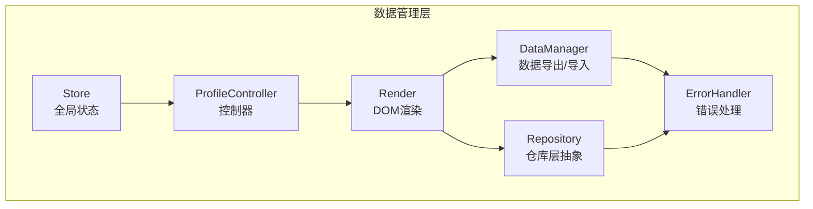
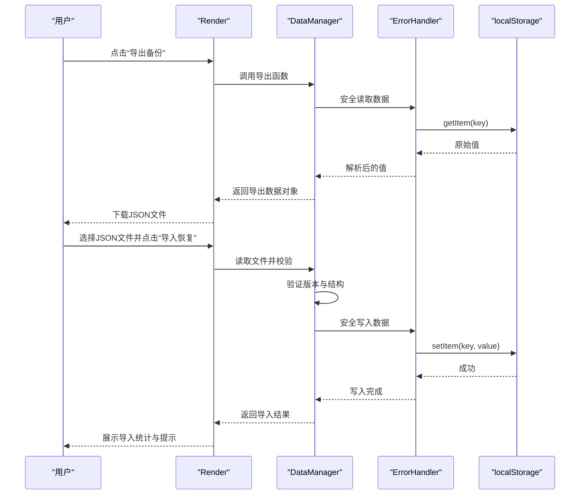
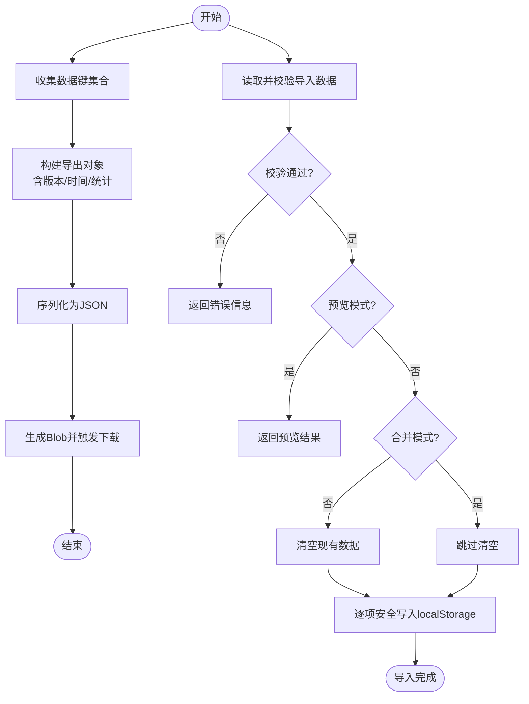
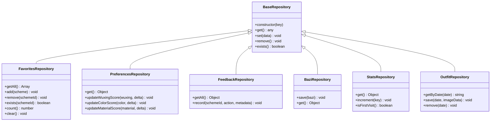
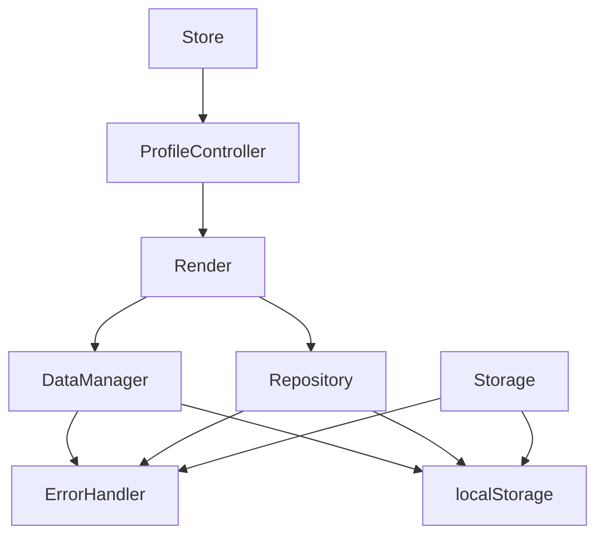

# 数据管理器

<cite>
**本文档引用的文件**
- [data-manager.js](file://js/data/data-manager.js)
- [repository.js](file://js/data/repository.js)
- [storage.js](file://js/data/storage.js)
- [store.js](file://js/core/store.js)
- [error-handler.js](file://js/core/error-handler.js)
- [render.js](file://js/utils/render.js)
- [profile.js](file://js/controllers/profile.js)
- [base.js](file://js/controllers/base.js)
</cite>

## 目录
1. [简介](#简介)
2. [项目结构](#项目结构)
3. [核心组件](#核心组件)
4. [架构总览](#架构总览)
5. [详细组件分析](#详细组件分析)
6. [依赖关系分析](#依赖关系分析)
7. [性能考虑](#性能考虑)
8. [故障排除指南](#故障排除指南)
9. [结论](#结论)
10. [附录](#附录)

## 简介
本文件为数据管理器（DataManager）模块的技术文档，系统性阐述其在数据管理系统中的核心作用与实现细节。数据管理器负责：
- 数据导出/导入与备份恢复
- 数据验证与版本兼容性控制
- 数据概览与可视化展示
- 与各 Repository 实例的协作与统一数据访问接口
- 错误处理与安全存储封装

同时，文档涵盖数据验证、数据转换、数据同步策略，以及缓存策略、批量操作支持与异步数据处理的实现方式，并提供 API 接口说明、使用示例与集成指南，最后总结数据迁移、备份恢复与性能监控的最佳实践。

## 项目结构
数据管理器位于前端数据层，与仓库层（Repository）、存储层（Storage）、全局状态（Store）及错误处理（Error Handler）协同工作，形成清晰的分层架构。

图表来源
- [data-manager.js](file://js/data/data-manager.js#L1-L376)
- [repository.js](file://js/data/repository.js#L1-L394)
- [store.js](file://js/core/store.js#L1-L212)
- [error-handler.js](file://js/core/error-handler.js#L1-L190)
- [render.js](file://js/utils/render.js#L1-L487)
- [profile.js](file://js/controllers/profile.js#L1-L91)

章节来源
- [data-manager.js](file://js/data/data-manager.js#L1-L376)
- [repository.js](file://js/data/repository.js#L1-L394)
- [store.js](file://js/core/store.js#L1-L212)
- [error-handler.js](file://js/core/error-handler.js#L1-L190)
- [render.js](file://js/utils/render.js#L1-L487)
- [profile.js](file://js/controllers/profile.js#L1-L91)

## 核心组件
- DataManager：负责数据导出、导入、校验、概览与面板渲染，提供统一的数据管理入口。
- Repository：面向具体业务的数据仓库抽象，封装对 localStorage 的安全访问与业务方法。
- Storage：提供带命名空间的本地存储工具，便于按前缀管理数据。
- Store：全局状态管理，协调控制器与视图的状态变更。
- ErrorHandler：统一错误处理与安全存储包装，保障数据操作的健壮性。
- Render：DOM 渲染与用户交互，负责数据管理面板的展示与事件绑定。
- ProfileController：控制器层，承载用户画像视图与数据管理交互逻辑。

章节来源
- [data-manager.js](file://js/data/data-manager.js#L1-L376)
- [repository.js](file://js/data/repository.js#L1-L394)
- [storage.js](file://js/data/storage.js#L1-L145)
- [store.js](file://js/core/store.js#L1-L212)
- [error-handler.js](file://js/core/error-handler.js#L1-L190)
- [render.js](file://js/utils/render.js#L1-L487)
- [profile.js](file://js/controllers/profile.js#L1-L91)

## 架构总览
数据管理器通过“导出/导入/校验/概览”四大能力，串联起数据层与视图层，确保用户可以安全地备份与恢复个人数据，同时保持数据结构的一致性与完整性。

图表来源
- [data-manager.js](file://js/data/data-manager.js#L48-L99)
- [data-manager.js](file://js/data/data-manager.js#L106-L184)
- [error-handler.js](file://js/core/error-handler.js#L153-L163)

## 详细组件分析

### DataManager 组件分析
DataManager 提供了完整的数据生命周期管理能力，包括导出、导入、校验、概览与面板渲染。

- 数据导出
  - 收集指定键集合的数据，生成包含版本号、导出时间与统计信息的导出对象。
  - 将导出对象序列化为 JSON 并触发浏览器下载。
- 数据导入
  - 对导入数据进行版本与结构校验；支持预览模式与合并模式；在非合并模式下清空现有数据。
  - 逐项安全写入 localStorage，捕获异常并记录错误。
- 数据校验
  - 检查版本兼容性、数据结构完整性与有效性，返回详细的错误信息。
- 数据概览
  - 统计数据项数量、总大小与每项的显示摘要，格式化字节大小。
- 面板渲染
  - 生成数据管理面板 HTML，包含概览统计、数据项列表与操作按钮。

图表来源
- [data-manager.js](file://js/data/data-manager.js#L48-L72)
- [data-manager.js](file://js/data/data-manager.js#L106-L135)
- [data-manager.js](file://js/data/data-manager.js#L143-L184)
- [data-manager.js](file://js/data/data-manager.js#L235-L271)

章节来源
- [data-manager.js](file://js/data/data-manager.js#L1-L376)

### Repository 组件分析
Repository 以面向对象的方式抽象了不同业务领域的数据仓库，统一了数据的读取、写入与删除，并提供了业务级方法。

- 基础仓库（BaseRepository）
  - 提供 get/set/remove/exists 等基础方法，内部通过安全存储包装访问 localStorage。
- 收藏仓库（FavoritesRepository）
  - 提供添加、移除、查询存在性、统计数量与清空等方法，自动维护时间戳。
- 用户偏好仓库（PreferencesRepository）
  - 提供五行为中心的偏好分数更新方法，支持按维度增量调整。
- 反馈仓库（FeedbackRepository）
  - 记录用户对方案的浏览、收藏、选择、忽略等动作，维护交互统计与最近交互时间。
- 八字仓库（BaziRepository）
  - 保存与获取八字数据，自动记录保存时间。
- 使用统计仓库（StatsRepository）
  - 统计访问次数、生成次数、上传次数，并记录首次与最近访问时间。
- 穿搭照片仓库（OutfitRepository）
  - 以日期为键管理上传图片数据，支持按日期查询、保存与删除。
- 通用存储工具（storageUtils）
  - 提供 get/set/remove/clear 等便捷方法，便于直接访问底层存储。

图表来源
- [repository.js](file://js/data/repository.js#L46-L81)
- [repository.js](file://js/data/repository.js#L86-L146)
- [repository.js](file://js/data/repository.js#L151-L201)
- [repository.js](file://js/data/repository.js#L206-L259)
- [repository.js](file://js/data/repository.js#L264-L287)
- [repository.js](file://js/data/repository.js#L292-L337)
- [repository.js](file://js/data/repository.js#L342-L377)

章节来源
- [repository.js](file://js/data/repository.js#L1-L394)

### Storage 组件分析
Storage 提供带命名空间的本地存储工具，便于按前缀管理数据，减少键冲突风险。

- 基础方法：get/set/remove，均通过安全存储包装执行。
- 前缀查询：按前缀检索键集合，便于批量清理或迁移。
- 业务方法：针对特定业务场景提供便捷方法，如获取/保存最近八字、最近结果、反馈、上传照片、使用统计、首次访问标记、心愿选择等。

章节来源
- [storage.js](file://js/data/storage.js#L1-L145)

### Store 组件分析
Store 采用简单的响应式代理模式，集中管理应用状态，支持订阅与批量更新。

- 响应式状态：通过 Proxy 拦截属性设置，在值变化时触发回调。
- 订阅机制：支持单键与多键订阅，提供取消订阅函数。
- 批量更新：支持一次设置多个状态键值。
- 重置与快照：支持按需重置或获取完整状态快照，便于调试。

章节来源
- [store.js](file://js/core/store.js#L1-L212)

### ErrorHandler 组件分析
ErrorHandler 提供统一的错误处理与安全存储包装，确保数据操作的健壮性。

- 错误类型：网络、超时、数据解析、验证、存储、未知等。
- 安全存储：捕获 QuotaExceededError 等存储异常，转换为应用错误。
- 全局错误监听：捕获未处理的 Promise 拒绝与全局错误，统一提示用户。

章节来源
- [error-handler.js](file://js/core/error-handler.js#L1-L190)

### Render 与 ProfileController 组件分析
Render 负责 DOM 渲染与用户交互，ProfileController 作为控制器承载用户画像视图与数据管理交互逻辑。

- Render
  - 渲染用户画像视图，同时渲染数据管理面板。
  - 提供 Toast 消息提示与模态框控制。
- ProfileController
  - 绑定数据管理面板的事件，处理导出、导入与清除数据的操作。
  - 通过控制器基类提供的事件绑定与状态订阅机制，实现视图与数据层的解耦。

章节来源
- [render.js](file://js/utils/render.js#L369-L381)
- [profile.js](file://js/controllers/profile.js#L1-L91)
- [base.js](file://js/controllers/base.js#L1-L131)

## 依赖关系分析
数据管理器与各模块之间的依赖关系如下：

图表来源
- [data-manager.js](file://js/data/data-manager.js#L6-L42)
- [repository.js](file://js/data/repository.js#L6-L41)
- [storage.js](file://js/data/storage.js#L5-L27)
- [render.js](file://js/utils/render.js#L8-L8)
- [profile.js](file://js/controllers/profile.js#L5-L7)
- [store.js](file://js/core/store.js#L6-L6)

章节来源
- [data-manager.js](file://js/data/data-manager.js#L1-L376)
- [repository.js](file://js/data/repository.js#L1-L394)
- [storage.js](file://js/data/storage.js#L1-L145)
- [render.js](file://js/utils/render.js#L1-L487)
- [profile.js](file://js/controllers/profile.js#L1-L91)
- [store.js](file://js/core/store.js#L1-L212)

## 性能考虑
- 数据导出/导入
  - 采用逐项写入策略，避免一次性大对象写入导致阻塞；对异常进行局部捕获，不影响整体导入流程。
  - 导出时仅收集指定键集合，减少不必要的数据传输与处理开销。
- 数据概览
  - 使用 Blob 计算每项大小，避免重复解析与序列化；格式化字节大小时采用对数计算，提升可读性。
- 错误处理
  - 通过安全存储包装统一捕获存储异常，避免应用崩溃；全局错误监听降低异常传播成本。
- 视图渲染
  - 渲染面板时仅遍历已存在的数据项，空数据时显示提示，减少 DOM 操作。

[本节为一般性指导，无需列出具体文件来源]

## 故障排除指南
- 导入失败
  - 检查导入文件是否为合法 JSON；确认版本兼容性；查看控制台错误日志。
- 存储空间不足
  - 当发生 QuotaExceededError 时，系统会抛出存储错误；建议清理历史数据或减少存储项。
- 导入预览与合并
  - 预览模式不会实际写入数据；合并模式会在保留现有数据的基础上追加新数据。
- 清除数据
  - 清除操作不可逆；建议在执行前进行备份。

章节来源
- [data-manager.js](file://js/data/data-manager.js#L106-L184)
- [error-handler.js](file://js/core/error-handler.js#L153-L163)

## 结论
数据管理器通过清晰的职责划分与稳健的错误处理机制，为用户提供可靠的数据备份与恢复能力。结合仓库层的抽象与存储层的安全封装，实现了数据一致性与可维护性的平衡。未来可在以下方面进一步优化：
- 增强导入/导出的进度反馈与并发处理能力；
- 引入数据压缩与增量备份策略；
- 扩展云端同步与跨设备一致性保障；
- 提供更丰富的数据迁移与版本升级工具。

[本节为总结性内容，无需列出具体文件来源]

## 附录

### API 接口文档
- 导出数据
  - 函数：exportData()
  - 返回：包含版本、导出时间、应用名与用户数据的对象
  - 复杂度：O(n)，n 为数据键数量
- 下载导出文件
  - 函数：downloadExportFile()
  - 返回：包含成功标志、文件名与统计数据的对象
  - 复杂度：O(n)
- 验证导入数据
  - 函数：validateImportData(data)
  - 参数：待验证的数据对象
  - 返回：包含校验结果、错误列表与统计数据的对象
  - 复杂度：O(1)
- 导入数据
  - 函数：importData(data, options)
  - 参数：
    - data：导入数据对象
    - options.merge：是否合并（默认 false）
    - options.preview：是否仅预览（默认 false）
  - 返回：包含成功标志、导入计数、合并状态与统计数据的对象
  - 复杂度：O(m)，m 为用户数据项数量
- 读取导入文件
  - 函数：readImportFile(file)
  - 返回：Promise，解析后的数据对象
  - 复杂度：O(1)
- 清除所有数据
  - 函数：clearAllData()
  - 复杂度：O(n)
- 获取数据概览
  - 函数：getDataOverview()
  - 返回：包含总键数、总大小与每项摘要的对象
  - 复杂度：O(n)
- 格式化字节大小
  - 函数：formatBytes(bytes)
  - 返回：格式化后的字符串
  - 复杂度：O(1)
- 渲染数据管理面板
  - 函数：renderDataManagerPanel()
  - 返回：HTML 字符串
  - 复杂度：O(n)

章节来源
- [data-manager.js](file://js/data/data-manager.js#L48-L376)

### 使用示例与集成指南
- 在用户画像视图中集成数据管理面板
  - 渲染用户画像视图时，同时渲染数据管理面板。
  - 通过控制器绑定事件，处理导出、导入与清除数据操作。
- 与仓库层协作
  - DataManager 通过安全存储包装访问 localStorage；仓库层提供业务方法，统一数据访问接口。
- 与全局状态协作
  - 控制器通过 Store 订阅状态变化，实现视图与数据的解耦。
- 错误处理集成
  - 所有数据操作通过 ErrorHandler 进行安全包装，确保异常被捕获与提示。

章节来源
- [render.js](file://js/utils/render.js#L369-L381)
- [profile.js](file://js/controllers/profile.js#L1-L91)
- [base.js](file://js/controllers/base.js#L1-L131)
- [error-handler.js](file://js/core/error-handler.js#L153-L163)

### 数据迁移、备份恢复与性能监控最佳实践
- 数据迁移
  - 使用导出/导入功能进行跨设备迁移；确保版本兼容性；在导入前进行预览。
- 备份恢复
  - 定期导出备份；导入时选择合并模式以保留历史数据；遇到存储空间不足时清理冗余数据。
- 性能监控
  - 监控数据项数量与总大小；定期清理无效数据；对频繁写入的业务采用批量更新策略。
- 一致性保证
  - 通过统一的错误处理与安全存储包装，确保数据写入的一致性；在导入过程中采用逐项写入与异常捕获，避免部分失败影响整体。

[本节为一般性指导，无需列出具体文件来源]