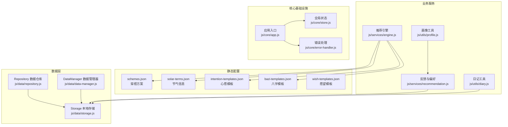
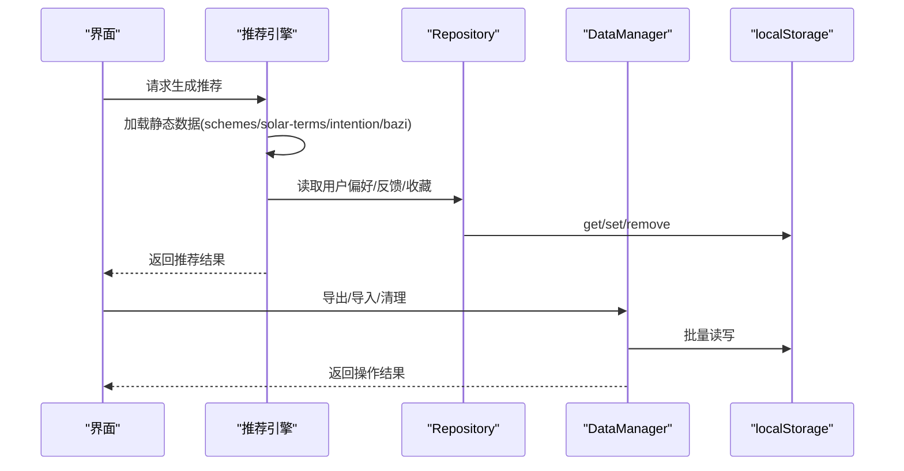
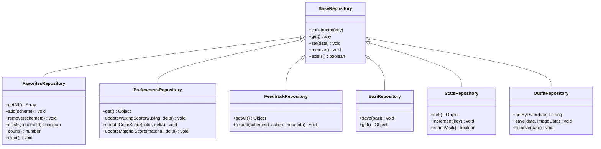
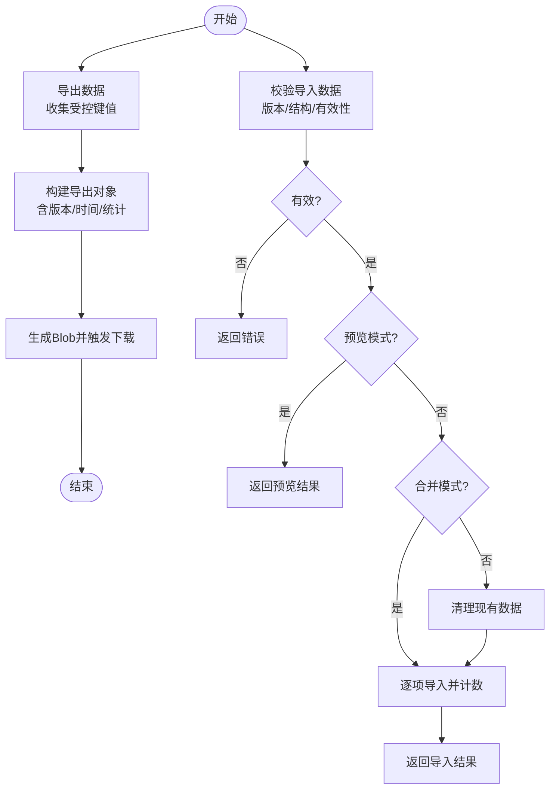
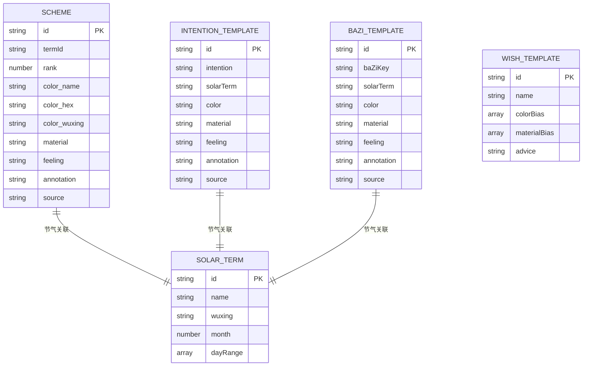
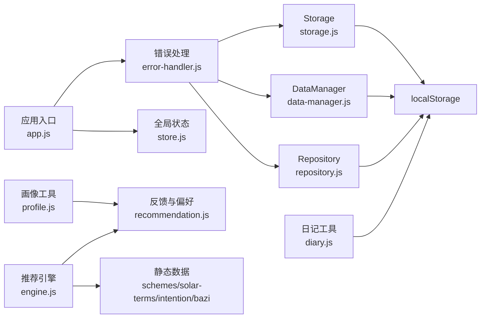

# 数据管理系统

<cite>
**本文档引用的文件**
- [repository.js](file://js/data/repository.js)
- [data-manager.js](file://js/data/data-manager.js)
- [storage.js](file://js/data/storage.js)
- [schemes.json](file://data/schemes.json)
- [solar-terms.json](file://data/solar-terms.json)
- [intention-templates.json](file://data/intention-templates.json)
- [bazi-templates.json](file://data/bazi-templates.json)
- [wish-templates.json](file://data/wish-templates.json)
- [engine.js](file://js/services/engine.js)
- [recommendation.js](file://js/services/recommendation.js)
- [diary.js](file://js/utils/diary.js)
- [profile.js](file://js/utils/profile.js)
- [store.js](file://js/core/store.js)
- [error-handler.js](file://js/core/error-handler.js)
- [app.js](file://js/core/app.js)
- [favorites.js](file://js/controllers/favorites.js)
- [diary-controller.js](file://js/controllers/diary.js)
</cite>

## 目录
1. [简介](#简介)
2. [项目结构](#项目结构)
3. [核心组件](#核心组件)
4. [架构总览](#架构总览)
5. [详细组件分析](#详细组件分析)
6. [依赖关系分析](#依赖关系分析)
7. [性能考虑](#性能考虑)
8. [故障排除指南](#故障排除指南)
9. [结论](#结论)
10. [附录](#附录)

## 简介
本文件为“五行穿搭建议”项目的数据管理系统技术文档，围绕Repository数据仓库、DataManager数据管理器、Storage本地存储策略以及静态数据配置系统进行深入解析。文档涵盖数据抽象层设计、存储接口与访问模式、数据操作流程、事务处理与一致性保障、静态数据结构与用途、API接口规范、数据迁移指南、数据安全与性能优化策略，以及扩展开发方法。

## 项目结构
项目采用模块化组织，数据相关代码主要分布在以下目录：
- js/data：数据仓库、数据管理器、本地存储封装
- data：静态数据配置文件（方案、节气、心愿、八字、愿望模板）
- js/services：业务服务（推荐引擎、反馈与偏好、天气等）
- js/utils：工具模块（日记、画像等）
- js/core：核心基础设施（全局状态、错误处理、路由等）

图表来源
- [repository.js](file://js/data/repository.js#L1-L394)
- [data-manager.js](file://js/data/data-manager.js#L1-L376)
- [storage.js](file://js/data/storage.js#L1-L145)
- [schemes.json](file://data/schemes.json#L1-L509)
- [solar-terms.json](file://data/solar-terms.json#L1-L42)
- [intention-templates.json](file://data/intention-templates.json#L1-L493)
- [bazi-templates.json](file://data/bazi-templates.json#L1-L103)
- [wish-templates.json](file://data/wish-templates.json#L1-L47)
- [engine.js](file://js/services/engine.js#L1-L425)
- [recommendation.js](file://js/services/recommendation.js#L1-L466)
- [diary.js](file://js/utils/diary.js#L1-L242)
- [profile.js](file://js/utils/profile.js#L1-L420)
- [store.js](file://js/core/store.js#L1-L212)
- [error-handler.js](file://js/core/error-handler.js#L1-L190)
- [app.js](file://js/core/app.js#L1-L206)

章节来源
- [repository.js](file://js/data/repository.js#L1-L394)
- [data-manager.js](file://js/data/data-manager.js#L1-L376)
- [storage.js](file://js/data/storage.js#L1-L145)
- [schemes.json](file://data/schemes.json#L1-L509)
- [solar-terms.json](file://data/solar-terms.json#L1-L42)
- [intention-templates.json](file://data/intention-templates.json#L1-L493)
- [bazi-templates.json](file://data/bazi-templates.json#L1-L103)
- [wish-templates.json](file://data/wish-templates.json#L1-L47)
- [engine.js](file://js/services/engine.js#L1-L425)
- [recommendation.js](file://js/services/recommendation.js#L1-L466)
- [diary.js](file://js/utils/diary.js#L1-L242)
- [profile.js](file://js/utils/profile.js#L1-L420)
- [store.js](file://js/core/store.js#L1-L212)
- [error-handler.js](file://js/core/error-handler.js#L1-L190)
- [app.js](file://js/core/app.js#L1-L206)

## 核心组件
本节概述数据管理系统的关键组件及其职责：
- Repository 数据仓库：面向领域对象的抽象存储，提供收藏、偏好、反馈、八字、统计、上传照片等专用仓储类，统一localStorage访问与序列化。
- DataManager 数据管理器：负责用户数据的导出/导入、校验、预览、清理与概览展示，提供数据备份与迁移能力。
- Storage 本地存储：提供带前缀的键空间隔离与批量清理，封装常用业务键（如上次八字、反馈、穿搭照片、使用统计、心愿等）。
- 静态数据配置：schemes.json（方案）、solar-terms.json（节气）、intention-templates.json（心愿模板）、bazi-templates.json（八字模板）、wish-templates.json（愿望模板）。
- 业务服务与工具：推荐引擎加载静态数据并结合用户偏好与反馈生成推荐；日记与画像工具维护用户行为与偏好数据；全局状态与错误处理贯穿各模块。

章节来源
- [repository.js](file://js/data/repository.js#L46-L394)
- [data-manager.js](file://js/data/data-manager.js#L8-L376)
- [storage.js](file://js/data/storage.js#L7-L145)
- [engine.js](file://js/services/engine.js#L60-L85)
- [recommendation.js](file://js/services/recommendation.js#L12-L29)
- [diary.js](file://js/utils/diary.js#L19-L32)
- [profile.js](file://js/utils/profile.js#L24-L61)
- [store.js](file://js/core/store.js#L30-L187)

## 架构总览
数据流从静态配置文件出发，经由业务服务加载，结合用户偏好与行为反馈，最终写入本地存储。DataManager提供端到端的数据生命周期管理，包括备份、恢复与清理。

图表来源
- [engine.js](file://js/services/engine.js#L323-L393)
- [repository.js](file://js/data/repository.js#L55-L72)
- [data-manager.js](file://js/data/data-manager.js#L48-L184)
- [error-handler.js](file://js/core/error-handler.js#L153-L163)

## 详细组件分析

### Repository 数据仓库
Repository 采用面向领域的仓储模式，提供强类型的存储接口，屏蔽底层localStorage与JSON序列化细节。关键特性：
- 基础仓储：BaseRepository 提供 get/set/remove/exists 等通用方法。
- 专用仓储：
  - 收藏仓储：支持添加、移除、查询存在性、计数与清空。
  - 偏好仓储：提供五行、颜色、材质偏好的增量更新。
  - 反馈仓储：按方案ID聚合浏览、收藏、选择、忽略等指标。
  - 八字仓储：保存/获取用户八字信息。
  - 统计仓储：访问次数、生成次数、上传次数、首次/最后访问时间。
  - 穿搭照片仓储：按日期存取图片数据。
- 安全访问：通过安全包装函数执行localStorage操作，捕获配额不足等异常。

图表来源
- [repository.js](file://js/data/repository.js#L46-L377)

章节来源
- [repository.js](file://js/data/repository.js#L46-L394)

### DataManager 数据管理器
DataManager 提供完整的数据生命周期管理能力：
- 导出：遍历受控键集合，收集数据并生成包含版本、导出时间、应用名与统计信息的备份对象。
- 下载：将备份对象序列化为JSON并触发浏览器下载，文件名包含时间戳。
- 校验：验证版本兼容性、数据结构完整性与有效性。
- 导入：支持覆盖导入与合并导入，可预览导入内容而不实际写入。
- 清理：按受控键集合逐一删除。
- 概览：统计键数量、数据体积与每项简要信息，便于用户了解本地数据状况。
- 安全包装：统一使用安全存储函数执行读写，避免异常中断。

图表来源
- [data-manager.js](file://js/data/data-manager.js#L48-L184)

章节来源
- [data-manager.js](file://js/data/data-manager.js#L8-L376)

### Storage 本地存储策略
Storage 模块提供带前缀的键空间隔离，避免命名冲突，并封装常用业务键的读写：
- 前缀：统一使用前缀标识业务域，便于批量清理。
- 通用方法：get/set/remove/getKeysByPrefix/clearAll。
- 业务方法：last_bazi、last_result、feedbacks、outfit_日期、usage_stats、visited、selected_wish、favorites 等。
- 与Repository协作：Repository内部也使用安全包装的localStorage访问，二者共同保障数据一致性与安全性。

章节来源
- [storage.js](file://js/data/storage.js#L7-L145)
- [repository.js](file://js/data/repository.js#L24-L41)

### 静态数据配置系统
静态数据作为推荐与个性化的重要依据，结构如下：

- schemes.json：包含按节气与排名组织的穿搭方案，每条方案包含ID、节气ID、排名、颜色（名称、十六进制、五行）、材质、触感描述、注释与出处。
- solar-terms.json：节气列表、季节分组与五行名称映射，支撑节气驱动的推荐。
- intention-templates.json：心愿模板，按心愿类型与节气匹配，提供颜色、材质、触感与注释建议。
- bazi-templates.json：根据用户日主强弱与年份匹配的八字模板，指导个性化穿搭。
- wish-templates.json：愿望类别与偏向，提供颜色与材质偏向及季节修饰规则。

图表来源
- [schemes.json](file://data/schemes.json#L1-L509)
- [solar-terms.json](file://data/solar-terms.json#L1-L42)
- [intention-templates.json](file://data/intention-templates.json#L1-L493)
- [bazi-templates.json](file://data/bazi-templates.json#L1-L103)
- [wish-templates.json](file://data/wish-templates.json#L1-L47)

章节来源
- [schemes.json](file://data/schemes.json#L1-L509)
- [solar-terms.json](file://data/solar-terms.json#L1-L42)
- [intention-templates.json](file://data/intention-templates.json#L1-L493)
- [bazi-templates.json](file://data/bazi-templates.json#L1-L103)
- [wish-templates.json](file://data/wish-templates.json#L1-L47)

### 数据模型定义
- 用户偏好模型：包含五行分数、颜色分数、材质分数与场景分数。
- 反馈模型：按方案ID聚合浏览、收藏、选择、忽略次数与最后交互时间。
- 收藏模型：包含方案信息与收藏时间戳。
- 使用统计模型：访问次数、生成次数、上传次数与首次/最后访问时间。
- 穿搭日记模型：按日期存储颜色、材质、备注、心情、照片等信息。
- 八字模型：包含日主强弱、年份等信息，用于模板匹配。

章节来源
- [repository.js](file://js/data/repository.js#L160-L200)
- [recommendation.js](file://js/services/recommendation.js#L145-L184)
- [diary.js](file://js/utils/diary.js#L57-L75)
- [storage.js](file://js/data/storage.js#L52-L58)

### API 接口文档
- Repository 接口
  - 收藏仓储：getAll/add/remove/exists/count/clear
  - 偏好仓储：get/updateWuxingScore/updateColorScore/updateMaterialScore
  - 反馈仓储：getAll/record
  - 八字仓储：save/get
  - 统计仓储：get/increment/isFirstVisit
  - 穿搭照片仓储：getByDate/save/remove
- DataManager 接口
  - exportData/ downloadExportFile/ validateImportData/ importData/ readImportFile/ clearAllData/ getDataOverview/ renderDataManagerPanel
- Storage 接口
  - get/set/remove/getKeysByPrefix/clearAll/业务方法（last_bazi/last_result/feedback/outfit/usage_stats/visited/selected_wish/favorites）
- 业务服务接口
  - 推荐引擎：generateRecommendation/regenerateRecommendation
  - 反馈与偏好：recordFeedback/getUserPreferences/getFeedbackData/smartSelectSchemes
  - 日记工具：getDiaryRecords/getDiaryByDate/saveDiaryRecord/deleteDiaryRecord/getCalendarData/getTimelineData/getDiaryStats/getStreakDays
  - 画像工具：getUserProfile/renderWuxingRadarChart/renderColorBarChart/renderScenePieChart/renderTrendLineChart/renderUserProfilePanel

章节来源
- [repository.js](file://js/data/repository.js#L86-L377)
- [data-manager.js](file://js/data/data-manager.js#L48-L376)
- [storage.js](file://js/data/storage.js#L9-L145)
- [engine.js](file://js/services/engine.js#L323-L421)
- [recommendation.js](file://js/services/recommendation.js#L145-L379)
- [diary.js](file://js/utils/diary.js#L38-L242)
- [profile.js](file://js/utils/profile.js#L24-L420)

### 数据迁移指南
- 版本控制：DataManager 使用版本号进行兼容性检查，确保导入数据与当前版本一致。
- 受控键集合：仅对受控键进行导出/导入/清理，避免误操作影响其他数据。
- 预览导入：支持预览模式，先查看将要导入的键与统计信息，确认后再执行实际导入。
- 合并导入：可选择合并模式，在不清空现有数据的前提下追加导入。
- 文件格式：仅接受JSON格式文件，读取失败会给出明确错误提示。

章节来源
- [data-manager.js](file://js/data/data-manager.js#L8-L22)
- [data-manager.js](file://js/data/data-manager.js#L106-L184)

### 数据安全考虑
- 统一错误处理：通过安全包装函数捕获存储异常（如配额不足），并转换为用户友好的错误消息。
- 全局错误监听：捕获未处理的Promise拒绝与全局错误，防止应用崩溃并提示用户。
- 输入校验：导入数据进行严格校验，缺失版本、结构错误或空数据将被拒绝。
- 隐私保护：所有数据仅存储在本地，不涉及云端同步，避免敏感信息泄露风险。

章节来源
- [error-handler.js](file://js/core/error-handler.js#L153-L163)
- [error-handler.js](file://js/core/error-handler.js#L168-L189)
- [data-manager.js](file://js/data/data-manager.js#L106-L135)

## 依赖关系分析
- Repository 依赖错误处理模块进行安全存储。
- DataManager 依赖错误处理模块与受控键集合，直接操作localStorage。
- Storage 依赖错误处理模块，提供业务键封装。
- 推荐引擎依赖静态数据文件与反馈/偏好模块，间接依赖localStorage。
- 日记与画像工具依赖localStorage与反馈/偏好模块。
- 全局状态与应用入口协调控制器与视图加载。

图表来源
- [repository.js](file://js/data/repository.js#L6-L41)
- [data-manager.js](file://js/data/data-manager.js#L6-L42)
- [storage.js](file://js/data/storage.js#L5-L27)
- [engine.js](file://js/services/engine.js#L6-L8)
- [recommendation.js](file://js/services/recommendation.js#L6-L29)
- [diary.js](file://js/utils/diary.js#L6-L32)
- [profile.js](file://js/utils/profile.js#L6-L7)
- [app.js](file://js/core/app.js#L8-L11)
- [store.js](file://js/core/store.js#L11-L25)

章节来源
- [repository.js](file://js/data/repository.js#L6-L41)
- [data-manager.js](file://js/data/data-manager.js#L6-L42)
- [storage.js](file://js/data/storage.js#L5-L27)
- [engine.js](file://js/services/engine.js#L6-L8)
- [recommendation.js](file://js/services/recommendation.js#L6-L29)
- [diary.js](file://js/utils/diary.js#L6-L32)
- [profile.js](file://js/utils/profile.js#L6-L7)
- [app.js](file://js/core/app.js#L8-L11)
- [store.js](file://js/core/store.js#L11-L25)

## 性能考虑
- 数据访问封装：通过安全包装减少异常开销与重复序列化。
- 批量操作：DataManager 对受控键集合进行批量读写，避免逐项操作的性能损耗。
- 本地存储优化：避免存储超大数据，必要时拆分键或压缩数据。
- 静态数据缓存：推荐引擎对静态数据进行内存缓存，减少重复IO。
- 视图懒加载：应用入口按需加载视图与控制器，降低初始负载。

## 故障排除指南
- 存储配额不足：错误处理模块会捕获配额异常并提示用户清理空间。
- 导入失败：检查文件格式与版本兼容性；使用预览功能确认导入内容。
- 数据丢失：通过导出备份文件进行恢复；确认受控键集合是否正确。
- 控制器事件绑定：确保视图动态加载后重新绑定事件，避免交互失效。

章节来源
- [error-handler.js](file://js/core/error-handler.js#L153-L163)
- [data-manager.js](file://js/data/data-manager.js#L191-L220)
- [diary-controller.js](file://js/controllers/diary.js#L25-L38)
- [favorites.js](file://js/controllers/favorites.js#L32-L52)

## 结论
本数据管理系统通过Repository抽象、DataManager生命周期管理与Storage本地存储策略，实现了静态数据驱动、用户偏好与行为反馈融合的推荐体系。系统具备良好的扩展性与安全性，支持数据备份、恢复与迁移，满足“五行穿搭建议”项目的长期演进需求。

## 附录
- 扩展开发建议
  - 新增仓储：遵循BaseRepository模式，定义领域方法与默认值。
  - 新增静态数据：在相应JSON文件中新增条目，更新推荐引擎加载逻辑。
  - 新增场景：在场景偏好配置中添加新场景权重，调整智能选择逻辑。
  - 数据迁移：保持版本号与受控键集合稳定，提供向后兼容的导入校验。