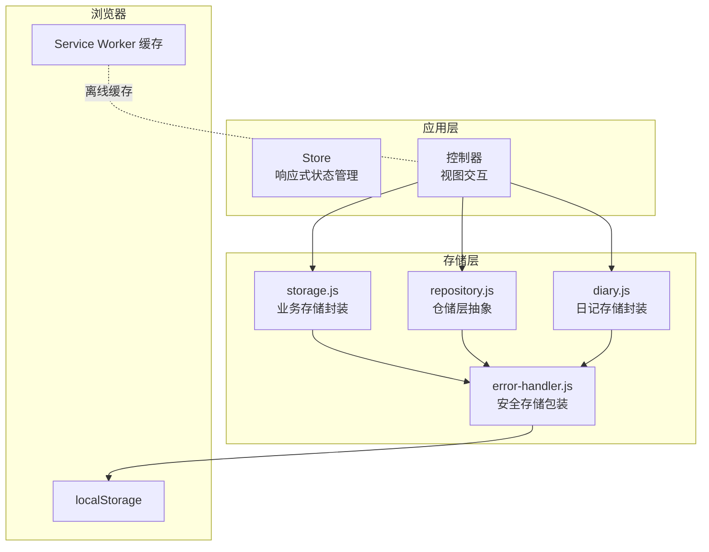
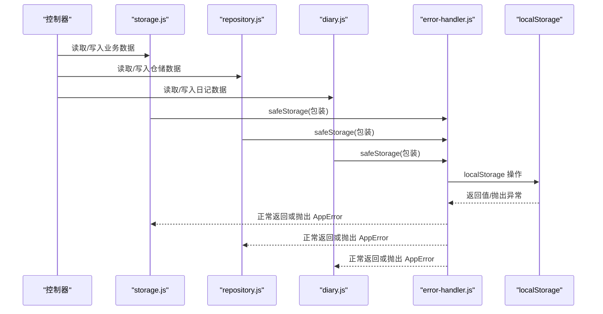
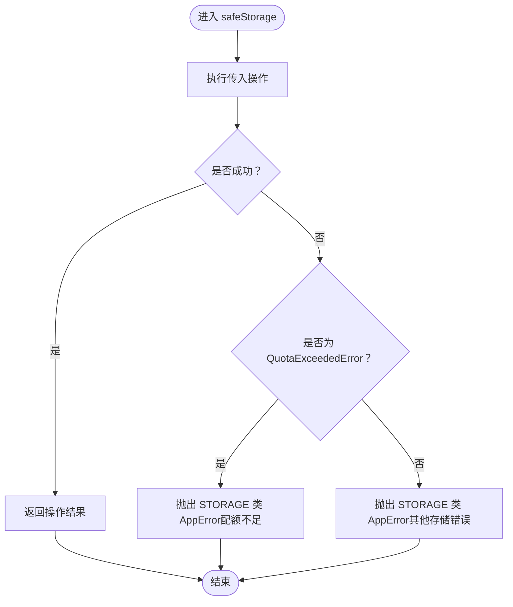
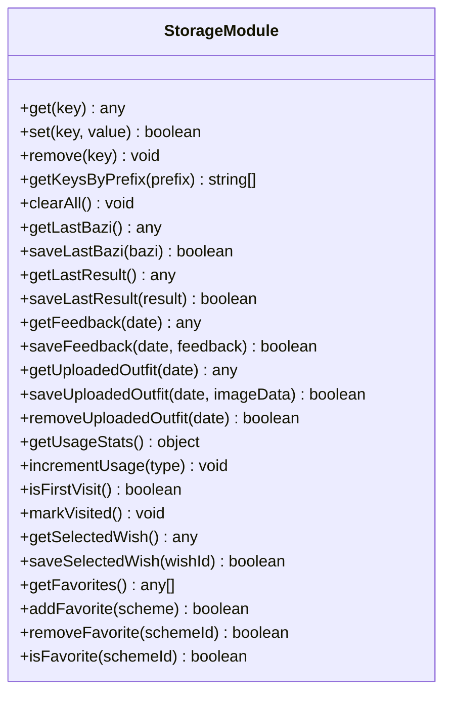
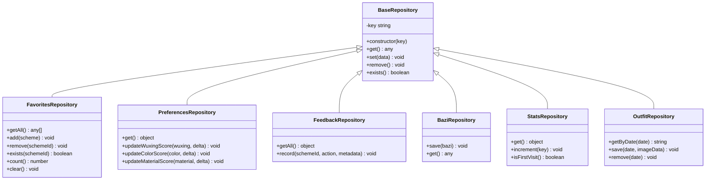
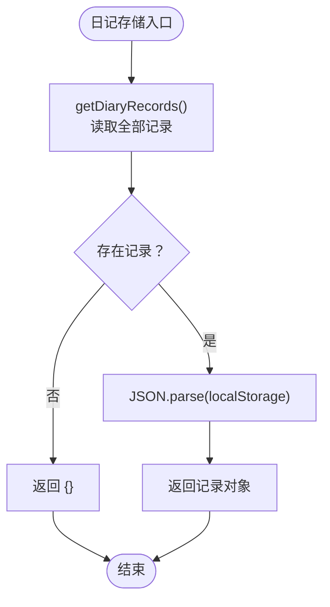
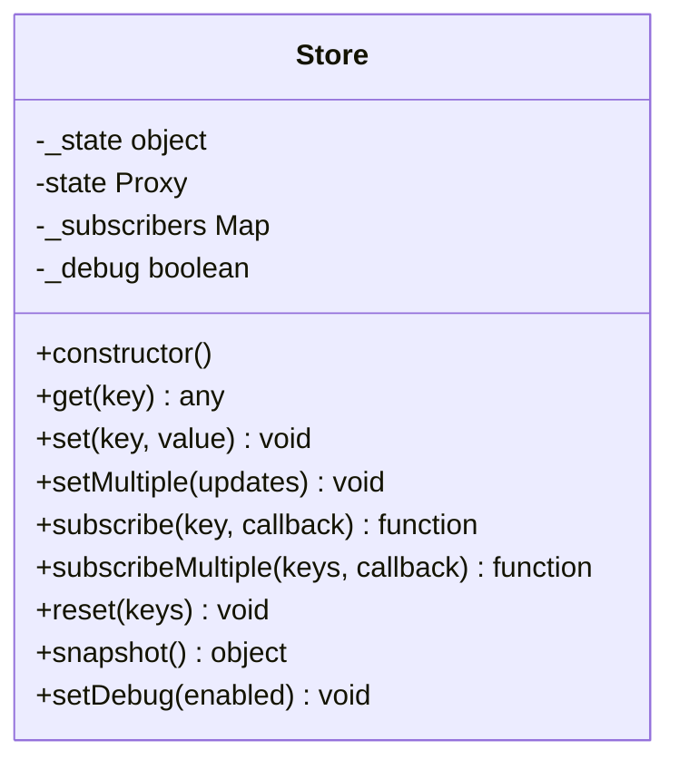
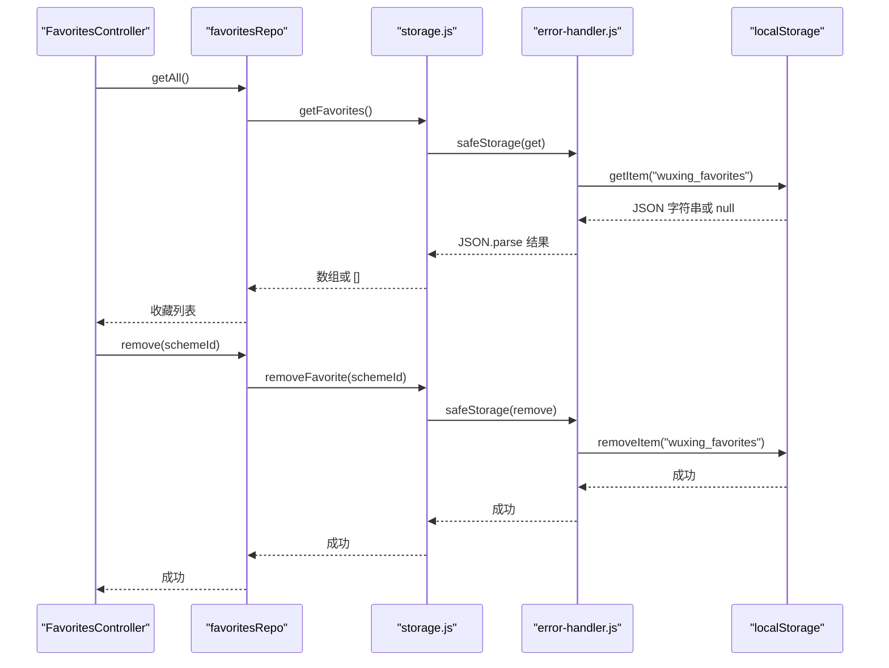
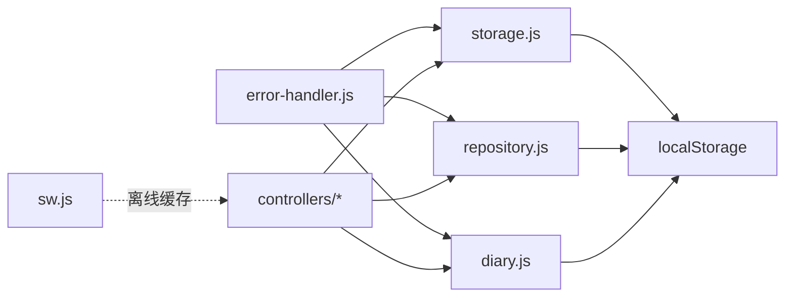

# 本地存储策略

<cite>
**本文档引用的文件**
- [js/core/store.js](file://js/core/store.js)
- [js/data/storage.js](file://js/data/storage.js)
- [js/core/error-handler.js](file://js/core/error-handler.js)
- [js/data/repository.js](file://js/data/repository.js)
- [js/utils/diary.js](file://js/utils/diary.js)
- [js/controllers/favorites.js](file://js/controllers/favorites.js)
- [js/controllers/diary.js](file://js/controllers/diary.js)
- [js/utils/render.js](file://js/utils/render.js)
- [sw.js](file://sw.js)
</cite>

## 目录
1. [简介](#简介)
2. [项目结构与存储相关模块](#项目结构与存储相关模块)
3. [核心组件与架构](#核心组件与架构)
4. [架构总览](#架构总览)
5. [详细组件分析](#详细组件分析)
6. [依赖关系分析](#依赖关系分析)
7. [性能考量](#性能考量)
8. [故障排除指南](#故障排除指南)
9. [结论](#结论)

## 简介
本文件系统性梳理项目中的本地存储策略，重点覆盖以下方面：
- localStorage 的使用模式与实现细节
- 安全存储操作的实现原理（错误处理、数据序列化与反序列化）
- 存储容量管理、数据清理策略与存储限制处理
- 数据持久化策略、版本兼容性与数据迁移方案
- 存储 API 的使用指南、性能优化技巧与故障排除方法
- 存储安全考虑、隐私保护措施与数据备份策略
- 存储键名命名规范、数据结构设计与访问权限控制

## 项目结构与存储相关模块
项目采用多层抽象的存储体系：
- 应用状态层：Store 提供响应式状态管理，用于内存态的短期状态
- 业务存储层：storage.js 提供以“wuxing_”前缀封装的 localStorage 访问
- 仓储层：repository.js 抽象了多种业务实体的存储接口，统一通过安全包装进行 localStorage 操作
- 工具层：diary.js 提供独立的日记数据存储，同样通过安全包装访问 localStorage
- 错误处理层：error-handler.js 提供统一的安全存储包装，捕获 QuotaExceededError 等存储异常
- Service Worker：sw.js 提供离线缓存，与本地存储策略互补

图表来源
- [js/core/store.js](file://js/core/store.js#L30-L187)
- [js/data/storage.js](file://js/data/storage.js#L1-L145)
- [js/data/repository.js](file://js/data/repository.js#L23-L41)
- [js/utils/diary.js](file://js/utils/diary.js#L19-L32)
- [js/core/error-handler.js](file://js/core/error-handler.js#L153-L163)
- [sw.js](file://sw.js#L1-L165)

章节来源
- [js/core/store.js](file://js/core/store.js#L30-L187)
- [js/data/storage.js](file://js/data/storage.js#L1-L145)
- [js/data/repository.js](file://js/data/repository.js#L1-L394)
- [js/utils/diary.js](file://js/utils/diary.js#L1-L242)
- [js/core/error-handler.js](file://js/core/error-handler.js#L1-L190)
- [sw.js](file://sw.js#L1-L165)

## 核心组件与架构
- Store：集中管理应用状态，提供响应式代理，支持订阅与通知，但不直接持久化到 localStorage
- storage.js：面向业务的 localStorage 封装，统一前缀、序列化与错误处理
- repository.js：仓储层抽象，定义多种业务实体的存储接口，统一通过安全包装访问 localStorage
- diary.js：独立的日记数据存储，同样通过安全包装访问 localStorage
- error-handler.js：提供 safeStorage 包装，捕获存储异常并转换为统一的 AppError

章节来源
- [js/core/store.js](file://js/core/store.js#L30-L187)
- [js/data/storage.js](file://js/data/storage.js#L1-L145)
- [js/data/repository.js](file://js/data/repository.js#L46-L81)
- [js/utils/diary.js](file://js/utils/diary.js#L19-L32)
- [js/core/error-handler.js](file://js/core/error-handler.js#L153-L163)

## 架构总览
下图展示从控制器到存储层的调用链路，以及错误处理与安全包装的位置。

图表来源
- [js/controllers/favorites.js](file://js/controllers/favorites.js#L1-L89)
- [js/data/storage.js](file://js/data/storage.js#L9-L27)
- [js/data/repository.js](file://js/data/repository.js#L55-L72)
- [js/utils/diary.js](file://js/utils/diary.js#L38-L75)
- [js/core/error-handler.js](file://js/core/error-handler.js#L153-L163)

## 详细组件分析

### 组件A：安全存储包装（safeStorage）
- 设计目的：统一捕获 localStorage 操作中的异常，特别是存储配额不足等错误，并转换为统一的 AppError
- 实现要点：
  - 在 try/catch 中执行传入的操作函数
  - 对 QuotaExceededError 进行特殊处理，提示用户清理空间
  - 其他存储错误转换为 STORAGE 类型的 AppError
- 使用位置：storage.js、repository.js、diary.js 中的 getItem/setItem/removeItem 均通过 safeStorage 包装

图表来源
- [js/core/error-handler.js](file://js/core/error-handler.js#L153-L163)

章节来源
- [js/core/error-handler.js](file://js/core/error-handler.js#L153-L163)

### 组件B：业务存储封装（storage.js）
- 设计目的：为业务逻辑提供统一的 localStorage 访问接口，统一键名前缀与序列化
- 实现要点：
  - 前缀：wuxing_
  - 序列化：JSON.stringify/JSON.parse
  - 清理：按前缀批量清理
  - 业务方法：最近八字符、最近结果、反馈、上传的穿搭、使用统计、首次访问标记、收藏等
- 错误处理：所有读写均通过 safeStorage 包装

图表来源
- [js/data/storage.js](file://js/data/storage.js#L9-L145)

章节来源
- [js/data/storage.js](file://js/data/storage.js#L1-L145)

### 组件C：仓储层抽象（repository.js）
- 设计目的：抽象多种业务实体的存储接口，统一通过安全包装访问 localStorage
- 实现要点：
  - 基类 BaseRepository：提供 get/set/remove/exists
  - 业务仓储：Favorites、Preferences、Feedback、Bazi、Stats、Outfit
  - 键名常量：StorageKeys 统一管理键名
  - 默认值：Preferences、Stats、Outfit 等提供默认值保障
- 错误处理：所有读写均通过 safeStorage 包装

图表来源
- [js/data/repository.js](file://js/data/repository.js#L46-L385)

章节来源
- [js/data/repository.js](file://js/data/repository.js#L1-L394)

### 组件D：日记存储封装（diary.js）
- 设计目的：为穿搭日记提供独立的 localStorage 存储封装
- 实现要点：
  - 键名：wuxing_diary
  - 序列化：JSON.stringify/JSON.parse
  - 功能：按日期读写、删除、统计、连击天数计算、导出
  - 错误处理：通过 safeStorage 包装

图表来源
- [js/utils/diary.js](file://js/utils/diary.js#L38-L40)

章节来源
- [js/utils/diary.js](file://js/utils/diary.js#L1-L242)

### 组件E：应用状态与存储协作（store.js）
- 设计目的：集中管理应用状态，提供响应式代理与订阅机制
- 实现要点：
  - 响应式状态：Proxy 拦截 set，仅在值真正改变时触发通知
  - 订阅机制：Map 结构维护每个键的订阅者集合
  - 重置与快照：支持按键或全量重置，支持调试快照
  - 与存储解耦：Store 仅负责内存态，不直接持久化

图表来源
- [js/core/store.js](file://js/core/store.js#L30-L187)

章节来源
- [js/core/store.js](file://js/core/store.js#L1-L212)

### 组件F：控制器与存储交互（favorites.js、diary.js）
- 设计目的：控制器通过仓储与存储封装完成业务数据的读写
- 实现要点：
  - FavoritesController：读取收藏列表、移除收藏、渲染列表
  - DiaryController：渲染日历、时间线、统计；打开/关闭编辑器；保存/删除记录
  - 事件绑定：避免重复绑定，统一在 onMount 中绑定，onUnmount 中清理

图表来源
- [js/controllers/favorites.js](file://js/controllers/favorites.js#L16-L80)
- [js/data/repository.js](file://js/data/repository.js#L118-L145)
- [js/data/storage.js](file://js/data/storage.js#L118-L139)
- [js/core/error-handler.js](file://js/core/error-handler.js#L153-L163)

章节来源
- [js/controllers/favorites.js](file://js/controllers/favorites.js#L1-L89)
- [js/controllers/diary.js](file://js/controllers/diary.js#L1-L440)

## 依赖关系分析
- storage.js 依赖 error-handler.js 的 safeStorage
- repository.js 依赖 error-handler.js 的 safeStorage
- diary.js 依赖 error-handler.js 的 safeStorage
- 控制器通过 storage.js、repository.js、diary.js 访问存储
- Service Worker 与存储策略互补，提供离线缓存能力

图表来源
- [js/core/error-handler.js](file://js/core/error-handler.js#L153-L163)
- [js/data/storage.js](file://js/data/storage.js#L5-L6)
- [js/data/repository.js](file://js/data/repository.js#L6-L7)
- [js/utils/diary.js](file://js/utils/diary.js#L6-L7)
- [sw.js](file://sw.js#L1-L165)

章节来源
- [js/core/error-handler.js](file://js/core/error-handler.js#L1-L190)
- [js/data/storage.js](file://js/data/storage.js#L1-L145)
- [js/data/repository.js](file://js/data/repository.js#L1-L394)
- [js/utils/diary.js](file://js/utils/diary.js#L1-L242)
- [sw.js](file://sw.js#L1-L165)

## 性能考量
- 序列化成本：频繁的 JSON.stringify/parse 会带来 CPU 开销，建议：
  - 合理拆分数据，避免一次性存储大型对象
  - 对大对象采用分片或延迟加载策略
- 订阅通知：Store 的订阅机制在状态变更时触发回调，注意避免过多订阅导致的性能问题
- 清理策略：定期清理过期数据，避免 localStorage 膨胀
- 离线缓存：Service Worker 的预缓存与 Stale-While-Revalidate 策略可减少网络请求，提升性能

## 故障排除指南
- 存储配额不足（QuotaExceededError）：
  - 现象：设置 localStorage 时抛出异常
  - 处理：safeStorage 捕获并转换为 STORAGE 类 AppError，提示用户清理空间
  - 建议：监控存储使用情况，提供清理入口
- 隐私模式或禁用存储：
  - 现象：读写 localStorage 抛出异常
  - 处理：safeStorage 捕获并转换为 STORAGE 类 AppError
  - 建议：降级到内存态或 IndexedDB
- 数据损坏或格式错误：
  - 现象：JSON.parse 失败
  - 处理：error-handler.js 的 safeStorage 将错误转换为 STORAGE 类 AppError
  - 建议：提供数据修复或重置功能
- 控制器事件重复绑定：
  - 现象：多次绑定导致事件重复触发
  - 处理：在 onMount 中绑定，onUnmount 中清理，避免重复绑定

章节来源
- [js/core/error-handler.js](file://js/core/error-handler.js#L153-L163)
- [js/controllers/favorites.js](file://js/controllers/favorites.js#L32-L52)
- [js/controllers/diary.js](file://js/controllers/diary.js#L40-L141)

## 结论
本项目通过多层抽象实现了清晰、可维护的本地存储策略：
- 通过 safeStorage 统一处理存储异常，确保错误可控
- 通过 storage.js、repository.js、diary.js 提供不同粒度的存储封装，满足业务需求
- Store 提供响应式状态管理，与存储解耦，便于扩展
- Service Worker 提供离线缓存，增强用户体验
- 建议后续进一步引入 IndexedDB 作为持久化后备方案，完善数据迁移与版本兼容性