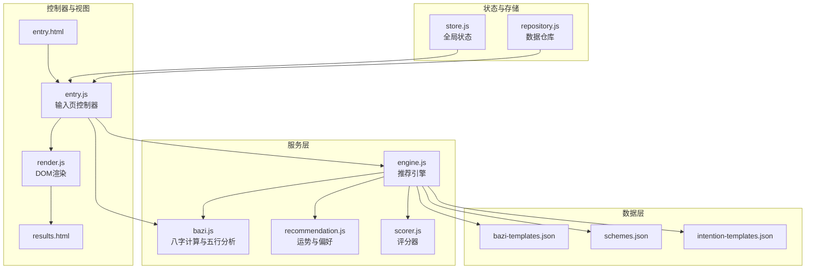
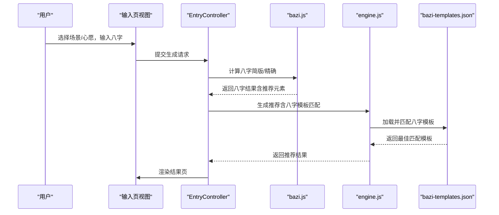
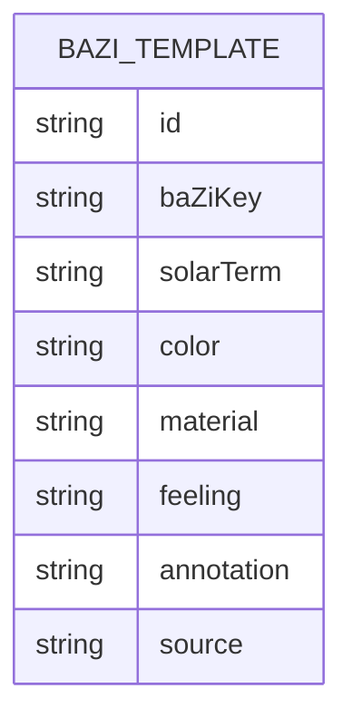
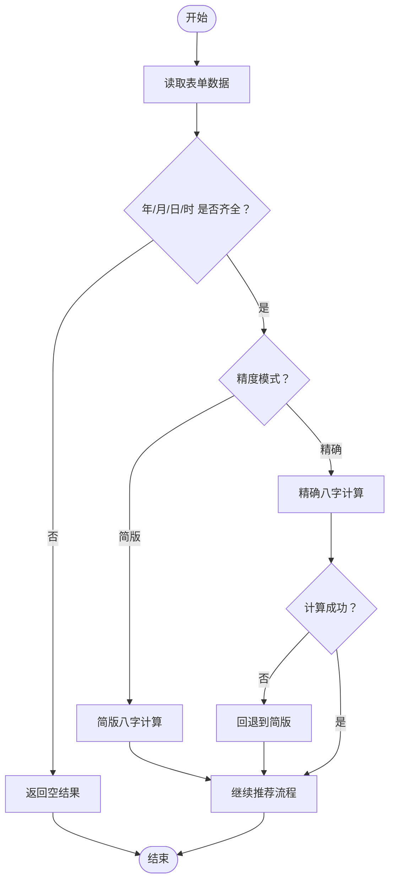
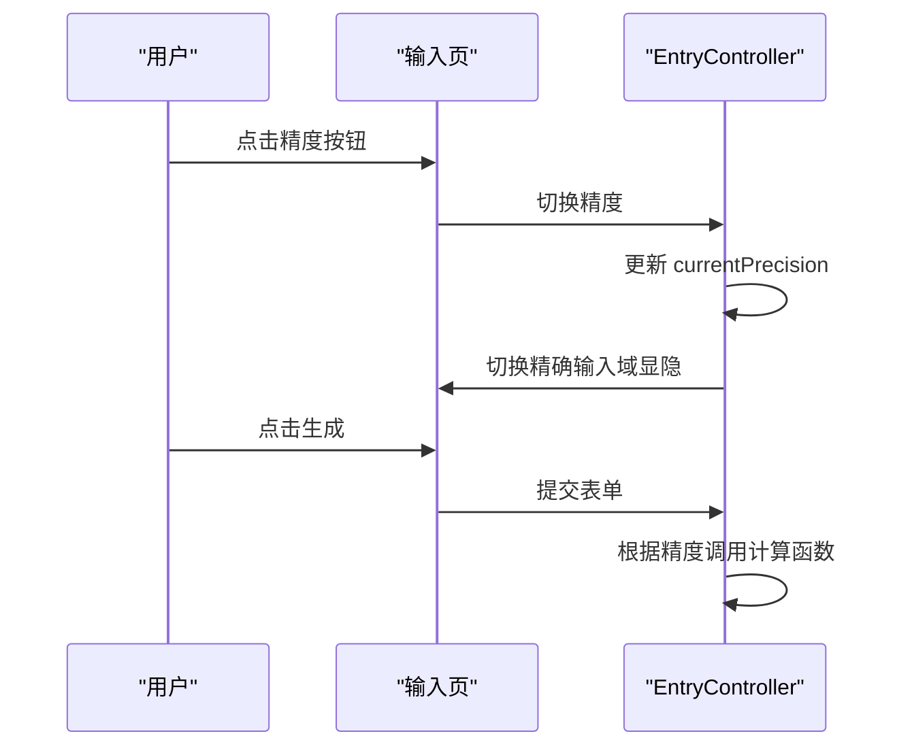
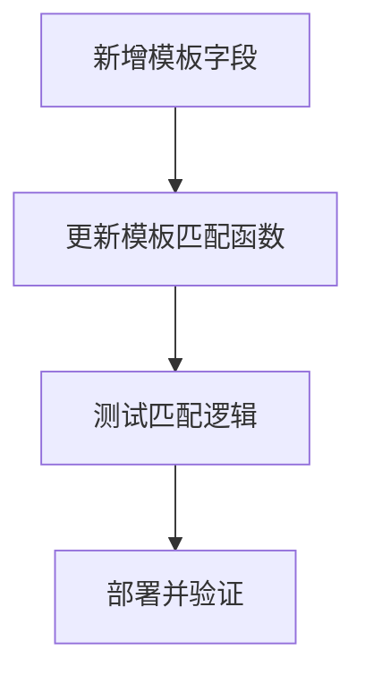
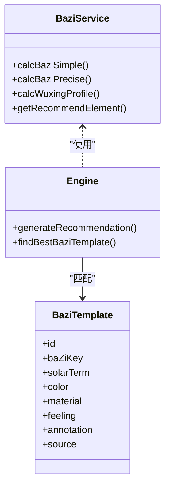
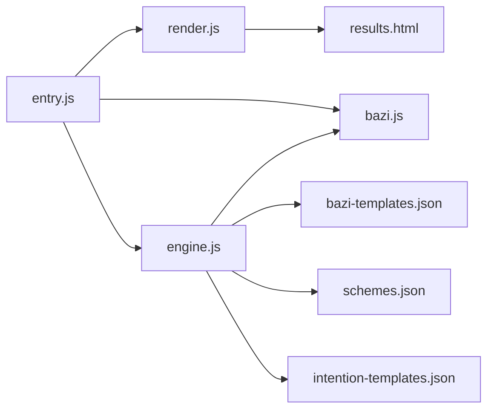

# 八字模板数据

<cite>
**本文档引用的文件**
- [bazi-templates.json](file://data/bazi-templates.json)
- [bazi.js](file://js/services/bazi.js)
- [engine.js](file://js/services/engine.js)
- [entry.html](file://views/entry.html)
- [results.html](file://views/results.html)
- [entry.js](file://js/controllers/entry.js)
- [render.js](file://js/utils/render.js)
- [repository.js](file://js/data/repository.js)
- [store.js](file://js/core/store.js)
- [scorer.js](file://js/core/scorer.js)
- [recommendation.js](file://js/services/recommendation.js)
- [schemes.json](file://data/schemes.json)
- [intention-templates.json](file://data/intention-templates.json)
</cite>

## 目录
1. [简介](#简介)
2. [项目结构](#项目结构)
3. [核心组件](#核心组件)
4. [架构总览](#架构总览)
5. [详细组件分析](#详细组件分析)
6. [依赖关系分析](#依赖关系分析)
7. [性能考量](#性能考量)
8. [故障排查指南](#故障排查指南)
9. [结论](#结论)
10. [附录](#附录)

## 简介
本文件面向“八字模板数据”的技术文档，围绕 bazi-templates.json 的结构与使用进行系统化说明，涵盖以下主题：
- 八字信息录入的模板结构：年柱、月柱、日柱、时柱的字段定义与数据格式
- 八字输入的验证规则：天干地支有效性检查与逻辑一致性验证
- 八字显示格式的配置选项：传统写法与简化表示的切换机制
- 八字模板的扩展方法：新增字段、自定义格式与特殊需求适配
- 八字数据与推荐系统的集成：命理分析与五行平衡的计算逻辑
- 模板维护指南、数据迁移方案与兼容性处理方法

## 项目结构
该项目采用前端单页应用架构，数据与业务逻辑分离，八字模板位于 data 目录，服务层与控制器层分别负责八字计算、推荐引擎与视图交互。

图表来源
- [bazi-templates.json](file://data/bazi-templates.json#L1-L103)
- [bazi.js](file://js/services/bazi.js#L1-L267)
- [engine.js](file://js/services/engine.js#L1-L441)
- [entry.html](file://views/entry.html#L1-L234)
- [results.html](file://views/results.html#L1-L128)
- [entry.js](file://js/controllers/entry.js#L1-L241)
- [render.js](file://js/utils/render.js#L1-L487)
- [repository.js](file://js/data/repository.js#L1-L394)
- [store.js](file://js/core/store.js#L1-L212)
- [scorer.js](file://js/core/scorer.js#L1-L317)
- [recommendation.js](file://js/services/recommendation.js#L1-L466)

章节来源
- [bazi-templates.json](file://data/bazi-templates.json#L1-L103)
- [entry.html](file://views/entry.html#L132-L223)
- [results.html](file://views/results.html#L43-L72)

## 核心组件
- 八字模板数据：定义了基于“日主强弱”与“年份”的模板键，用于匹配命理分析结果并推荐相应穿搭方案。
- 八字计算服务：提供简版与精确两种八字计算模式，支持天干地支、日主强弱与五行分布统计。
- 推荐引擎：整合八字、节气、心愿、天气、场景与历史偏好，输出多套推荐方案及解释。
- 控制器与渲染：负责表单输入、精度切换、结果展示与交互反馈。
- 状态与存储：统一管理应用状态与本地持久化数据。

章节来源
- [bazi.js](file://js/services/bazi.js#L101-L183)
- [engine.js](file://js/services/engine.js#L339-L409)
- [entry.js](file://js/controllers/entry.js#L131-L189)
- [render.js](file://js/utils/render.js#L119-L201)

## 架构总览
八字模板数据在推荐引擎中扮演“命理模板匹配”的角色，与八字计算结果结合，驱动个性化推荐。

图表来源
- [entry.js](file://js/controllers/entry.js#L131-L189)
- [bazi.js](file://js/services/bazi.js#L101-L183)
- [engine.js](file://js/services/engine.js#L339-L409)
- [bazi-templates.json](file://data/bazi-templates.json#L1-L103)

## 详细组件分析

### 八字模板结构与字段定义
- 模板键命名规则：包含“日主强弱”与“年份”的组合，便于按命理特征与当前年份匹配。
- 关键字段：
  - id：模板唯一标识
  - baZiKey：命理模板键，包含日主与年份信息
  - solarTerm：节气名称
  - color：推荐色彩名称与十六进制色值
  - material：推荐材质
  - feeling：推荐感受
  - annotation：五行解读与典故出处
  - source：典籍来源

图表来源
- [bazi-templates.json](file://data/bazi-templates.json#L1-L103)

章节来源
- [bazi-templates.json](file://data/bazi-templates.json#L1-L103)

### 八字输入与验证规则
- 输入字段：年、月、日、时（简版）；分钟、时区（精确模式）。
- 精度切换：简版仅需年月日时，快速计算；精确模式需要分钟与时区，使用农历库进行精确推算。
- 验证与回退：若精确模式依赖的库未加载或计算异常，则自动回退到简版模式。
- 表单校验：控制器从 DOM 中读取必填字段，缺一不可；精确模式额外读取分钟与时区。

图表来源
- [entry.js](file://js/controllers/entry.js#L194-L221)
- [entry.js](file://js/controllers/entry.js#L131-L189)
- [bazi.js](file://js/services/bazi.js#L127-L183)

章节来源
- [entry.html](file://views/entry.html#L143-L222)
- [entry.js](file://js/controllers/entry.js#L119-L129)
- [bazi.js](file://js/services/bazi.js#L101-L183)

### 八字显示格式与切换机制
- 精度按钮：简版/精确双模式切换，精确模式显示分钟与时区输入域。
- 精度状态：控制器维护 currentPrecision，并控制精确输入域的显隐。
- 结果展示：生成推荐时根据精度状态决定调用简版或精确计算函数。

图表来源
- [entry.html](file://views/entry.html#L144-L147)
- [entry.js](file://js/controllers/entry.js#L119-L129)
- [entry.js](file://js/controllers/entry.js#L131-L189)

章节来源
- [entry.html](file://views/entry.html#L143-L222)
- [entry.js](file://js/controllers/entry.js#L119-L129)

### 八字模板扩展方法
- 新增字段：可在模板中添加新的字段（如季节、地域、特殊节日等），并在推荐引擎中扩展匹配逻辑。
- 自定义格式：通过调整 baZiKey 的命名规则与筛选条件，实现更细粒度的命理匹配。
- 特殊需求适配：例如针对特定年份或节气的模板，可通过模板键的年份限定实现优先匹配。

图表来源
- [engine.js](file://js/services/engine.js#L146-L174)
- [bazi-templates.json](file://data/bazi-templates.json#L1-L103)

章节来源
- [engine.js](file://js/services/engine.js#L146-L174)
- [bazi-templates.json](file://data/bazi-templates.json#L1-L103)

### 八字数据与推荐系统的集成
- 命理分析：八字计算后统计天干地支的五行分布，得出“最弱”与“最强”五行，并给出补充建议。
- 五行平衡：推荐引擎依据八字模板与节气、天气、场景、心愿、历史偏好等维度进行评分与排序。
- 模板匹配：根据命理分析结果（最强五行）在八字模板中查找当年或任意年的匹配项，作为推荐依据之一。

图表来源
- [bazi.js](file://js/services/bazi.js#L188-L266)
- [engine.js](file://js/services/engine.js#L339-L409)
- [bazi-templates.json](file://data/bazi-templates.json#L1-L103)

章节来源
- [bazi.js](file://js/services/bazi.js#L188-L266)
- [engine.js](file://js/services/engine.js#L339-L409)

## 依赖关系分析
- 引擎依赖：加载并使用八字模板、方案模板与心愿模板；依赖八字计算服务与推荐偏好模块。
- 控制器依赖：依赖渲染模块与路由模块；依赖仓库层持久化用户输入与偏好。
- 渲染依赖：依赖解释模块与数据管理面板，用于结果页展示与数据导出。

图表来源
- [engine.js](file://js/services/engine.js#L343-L347)
- [entry.js](file://js/controllers/entry.js#L1-L241)
- [render.js](file://js/utils/render.js#L1-L487)
- [results.html](file://views/results.html#L1-L128)

章节来源
- [engine.js](file://js/services/engine.js#L343-L347)
- [entry.js](file://js/controllers/entry.js#L1-L241)
- [render.js](file://js/utils/render.js#L1-L487)

## 性能考量
- 模板加载：推荐引擎采用异步并发加载多份模板数据，减少等待时间。
- 缓存与回退：精确计算失败时自动回退简版，保证可用性与性能。
- 评分器缓存：评分器内部对方案评分进行缓存，避免重复计算。
- DOM 渲染：卡片渲染采用批量插入与延迟动画，优化首屏体验。

## 故障排查指南
- 精确模式不可用：若农历库未加载，系统会自动回退到简版模式。检查网络加载与脚本引入。
- 模板匹配不到：确认 baZiKey 的命名与筛选逻辑一致；检查当前年份是否在模板中出现。
- 输入校验失败：检查必填字段是否完整；精确模式需提供分钟与时区。
- 数据导出/导入：确保导出文件为合法 JSON；导入时注意版本兼容性与数据结构完整性。

章节来源
- [bazi.js](file://js/services/bazi.js#L127-L183)
- [engine.js](file://js/services/engine.js#L146-L174)
- [entry.js](file://js/controllers/entry.js#L194-L221)

## 结论
bazi-templates.json 作为命理模板的核心数据，与八字计算服务、推荐引擎紧密协作，实现了从命理分析到个性化推荐的完整链路。通过简版与精确两种计算模式、灵活的模板匹配与评分机制，系统能够在保证性能的同时满足多样化的命理需求。建议在扩展模板时遵循现有命名规范与匹配逻辑，确保推荐质量与用户体验。

## 附录

### 八字模板字段参考
- id：模板唯一标识
- baZiKey：命理模板键（包含日主与年份）
- solarTerm：节气名称
- color：色彩名称与色值
- material：材质
- feeling：感受
- annotation：五行解读
- source：典籍出处

章节来源
- [bazi-templates.json](file://data/bazi-templates.json#L1-L103)

### 推荐引擎数据来源
- 方案模板：schemes.json
- 心愿模板：intention-templates.json
- 八字模板：bazi-templates.json

章节来源
- [engine.js](file://js/services/engine.js#L73-L101)
- [schemes.json](file://data/schemes.json#L1-L200)
- [intention-templates.json](file://data/intention-templates.json#L1-L200)