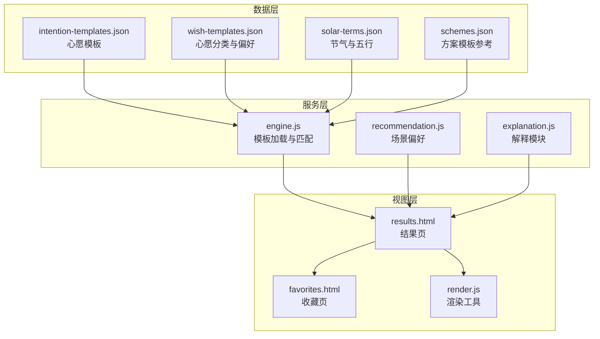
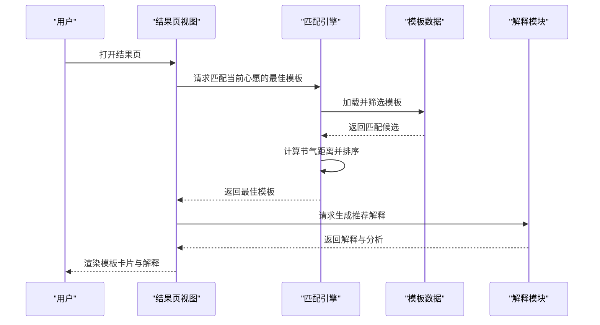
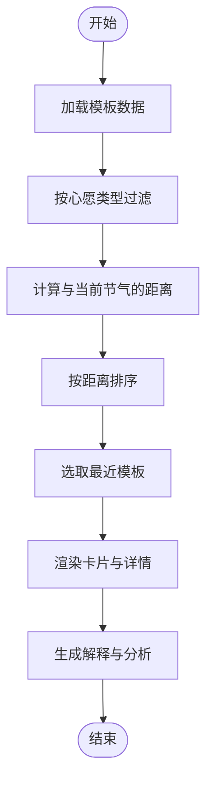
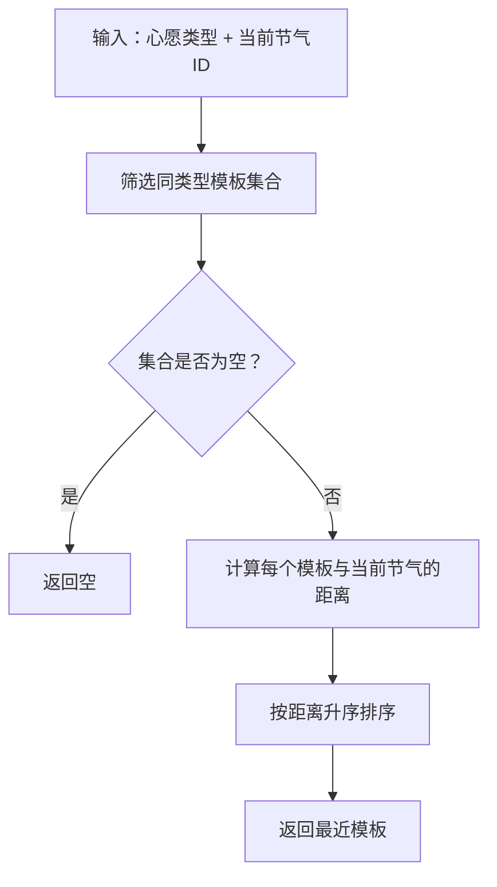
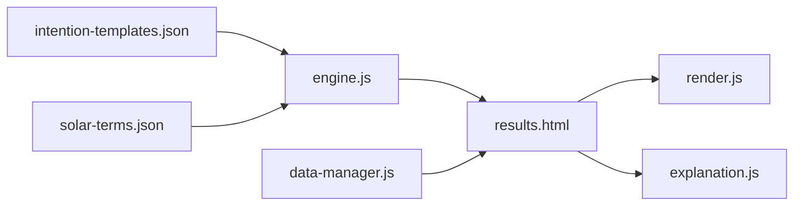

# 心愿模板数据

<cite>
**本文引用的文件**
- [intention-templates.json](file://data/intention-templates.json)
- [wish-templates.json](file://data/wish-templates.json)
- [schemes.json](file://data/schemes.json)
- [solar-terms.json](file://data/solar-terms.json)
- [engine.js](file://js/services/engine.js)
- [recommendation.js](file://js/services/recommendation.js)
- [explanation.js](file://js/services/explanation.js)
- [render.js](file://js/utils/render.js)
- [results.html](file://views/results.html)
- [favorites.html](file://views/favorites.html)
- [data-manager.js](file://js/data/data-manager.js)
</cite>

## 目录
1. [简介](#简介)
2. [项目结构](#项目结构)
3. [核心组件](#核心组件)
4. [架构总览](#架构总览)
5. [详细组件分析](#详细组件分析)
6. [依赖分析](#依赖分析)
7. [性能考虑](#性能考虑)
8. [故障排查指南](#故障排查指南)
9. [结论](#结论)
10. [附录](#附录)

## 简介
本文件围绕“intention-templates.json”心愿模板数据展开，系统性梳理其数据结构设计、模板变量与替换机制、分类体系、国际化支持现状、创建/编辑/删除流程与数据验证、版本管理策略，并提供扩展开发指南与最佳实践。同时结合前端服务层与视图层的实际使用方式，给出可操作的实现路径与可视化流程图。

## 项目结构
与心愿模板直接相关的数据文件位于 data 目录，前端服务层负责加载与匹配模板，视图层负责渲染与交互。

图表来源
- [intention-templates.json](file://data/intention-templates.json#L1-L493)
- [engine.js](file://js/services/engine.js#L60-L125)
- [results.html](file://views/results.html#L1-L128)
- [favorites.html](file://views/favorites.html#L1-L18)
- [render.js](file://js/utils/render.js#L134-L365)

章节来源
- [intention-templates.json](file://data/intention-templates.json#L1-L493)
- [engine.js](file://js/services/engine.js#L60-L125)
- [results.html](file://views/results.html#L1-L128)

## 核心组件
- 心愿模板数据源：包含模板ID、心愿类别、节气、色彩、材质、感受、注解与来源等字段，按心愿类型分组并按节气周期排列。
- 匹配引擎：根据当前节气与心愿类型，计算模板与节气的距离并返回最优模板。
- 场景偏好：定义不同场景下的五行与材质偏好，辅助解释与推荐。
- 解释模块：生成推荐理由、五行分析与分数解释，增强用户体验。
- 视图与渲染：结果页展示推荐卡片与解释，收藏页展示用户收藏。

章节来源
- [intention-templates.json](file://data/intention-templates.json#L1-L493)
- [engine.js](file://js/services/engine.js#L60-L125)
- [recommendation.js](file://js/services/recommendation.js#L60-L80)
- [explanation.js](file://js/services/explanation.js#L25-L111)
- [render.js](file://js/utils/render.js#L134-L365)

## 架构总览
模板数据在前端的典型工作流如下：

图表来源
- [engine.js](file://js/services/engine.js#L60-L125)
- [explanation.js](file://js/services/explanation.js#L25-L111)
- [results.html](file://views/results.html#L1-L128)

## 详细组件分析

### 数据结构设计与字段说明
- 模板ID：唯一标识，便于定位与追踪。
- 心愿类别：如“求职”“贵人运”“远行顺利”“静心专注”“健康舒畅”等，作为筛选条件。
- 节气：模板对应的节气名称，用于时间维度匹配。
- 色彩：颜色名称与十六进制值，以及所属五行属性。
- 材质：推荐材质，体现触感与季节适配。
- 感受：对穿着体验的主观描述，帮助用户形成直观预期。
- 注解：五行与典籍解读，提供文化与哲学依据。
- 来源：典籍出处，增强可信度与权威性。

字段映射与示例路径
- [模板条目字段定义](file://data/intention-templates.json#L2-L11)
- [更多模板条目](file://data/intention-templates.json#L12-L493)

章节来源
- [intention-templates.json](file://data/intention-templates.json#L1-L493)

### 模板变量与替换机制
- 动态内容插入：前端通过渲染工具将模板字段注入到卡片与详情模态框中，形成最终展示内容。
- 个性化参数：解释模块会结合当前节气、八字五行、场景偏好与今日运势，生成多维度解释文本。
- 替换流程示意：

图表来源
- [engine.js](file://js/services/engine.js#L110-L125)
- [render.js](file://js/utils/render.js#L134-L365)
- [explanation.js](file://js/services/explanation.js#L25-L111)

章节来源
- [engine.js](file://js/services/engine.js#L110-L125)
- [render.js](file://js/utils/render.js#L134-L365)
- [explanation.js](file://js/services/explanation.js#L25-L111)

### 模板分类体系
- 按心愿类型分类：求职、贵人运、远行顺利、静心专注、健康舒畅、升职加薪、签单顺利、防小人避坑、桃花朵朵、家庭和睦、挽回缓和、精力充沛、安神助眠、增强自信、身体康复、出行平安、出行平安、安全守护等。
- 按节气周期分布：每个心愿类型在二十四节气中均有对应模板，体现“顺时而为”的设计理念。
- 按场景与用途细分：如面试、谈判、约会、运动、学习等场景，配合材质与感受进行适配。

章节来源
- [intention-templates.json](file://data/intention-templates.json#L1-L493)
- [recommendation.js](file://js/services/recommendation.js#L60-L80)

### 国际化支持机制
- 当前模板数据采用中文字段与注解，未见专门的多语言键值对或本地化资源文件。
- 若需国际化，建议在现有结构基础上引入多语言版本的注解与来源字段，并在前端按语言切换时动态加载对应版本。

章节来源
- [intention-templates.json](file://data/intention-templates.json#L1-L493)

### 创建、编辑与删除流程
- 创建：新增模板条目，确保字段完整且符合筛选规则；更新节气映射与匹配逻辑。
- 编辑：修改字段值或调整节气分布，保持与其他模板的一致性。
- 删除：移除不再适用的模板，避免影响匹配准确性。
- 数据验证：前端加载模板时可进行字段完整性校验与节气合法性检查。
- 版本管理：建议在数据文件中加入版本号与变更记录，便于回滚与兼容性控制。

章节来源
- [engine.js](file://js/services/engine.js#L60-L85)
- [data-manager.js](file://js/data/data-manager.js#L8-L22)

### 模板匹配算法
- 距离计算：基于节气顺序数组，计算两个节气之间的最小循环距离。
- 选择策略：按心愿类型筛选后，按距离升序排序，返回最近模板。

图表来源
- [engine.js](file://js/services/engine.js#L88-L125)

章节来源
- [engine.js](file://js/services/engine.js#L88-L125)

### 解释与反馈
- 解释模块综合节气、八字、场景、运势与个人偏好生成推荐理由。
- 结果页提供反馈入口，收集用户对推荐结果的主观评价，用于优化匹配与解释。

章节来源
- [explanation.js](file://js/services/explanation.js#L25-L111)
- [results.html](file://views/results.html#L93-L127)

## 依赖分析
- 引擎依赖：模板数据、节气映射与顺序数组。
- 视图依赖：渲染工具与解释模块。
- 数据管理：提供导出/导入/清理能力，保障用户数据迁移与隐私。

图表来源
- [engine.js](file://js/services/engine.js#L60-L125)
- [render.js](file://js/utils/render.js#L134-L365)
- [explanation.js](file://js/services/explanation.js#L25-L111)
- [data-manager.js](file://js/data/data-manager.js#L48-L99)

章节来源
- [engine.js](file://js/services/engine.js#L60-L125)
- [render.js](file://js/utils/render.js#L134-L365)
- [explanation.js](file://js/services/explanation.js#L25-L111)
- [data-manager.js](file://js/data/data-manager.js#L48-L99)

## 性能考虑
- 模板加载：采用异步加载与缓存策略，避免重复请求。
- 匹配复杂度：筛选与排序在小规模模板集上开销可控；若模板数量增长，可考虑索引与二分查找优化。
- 渲染性能：批量渲染与虚拟滚动（如适用）可提升长列表性能。
- 解释生成：解释模块按需生成，避免不必要的计算。

## 故障排查指南
- 模板无法加载：检查数据文件路径与网络请求状态。
- 匹配结果异常：确认节气映射与顺序数组一致，检查筛选条件与距离计算。
- 渲染空白：检查模板字段完整性与渲染函数调用链。
- 数据迁移问题：使用数据管理模块进行导出/导入/清理，确保版本兼容。

章节来源
- [engine.js](file://js/services/engine.js#L60-L85)
- [data-manager.js](file://js/data/data-manager.js#L106-L135)

## 结论
intention-templates.json 以“心愿类型—节气周期—色彩材质—感受注解”为核心结构，结合前端匹配引擎与解释模块，实现了“顺时而为”的个性化推荐。建议在现有基础上完善国际化、版本管理与数据验证，并持续优化匹配与渲染性能，以支撑更大规模的模板库与更丰富的使用场景。

## 附录
- 最佳实践
  - 保持模板字段一致性，确保筛选与排序逻辑稳定。
  - 为新增模板提供节气分布与注解样例，减少维护成本。
  - 在前端增加错误边界与降级提示，提升健壮性。
- 扩展开发指南
  - 新增心愿类型：在模板数据中添加对应条目，并更新匹配逻辑。
  - 新增场景偏好：在场景偏好配置中补充权重与材质列表。
  - 国际化改造：引入多语言版本并在渲染时按语言切换。
- 常见使用场景
  - 求职季：选择与“求职”相关的心愿模板，结合当前节气与八字五行进行推荐。
  - 出行：选择“远行顺利”模板，关注材质与感受的季节适配。
  - 健康：选择“健康舒畅”模板，结合当日运势与个人偏好生成解释。