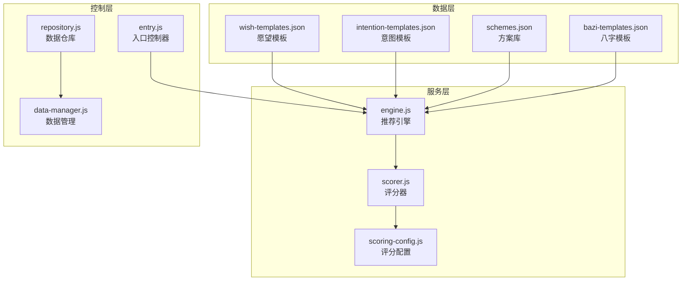
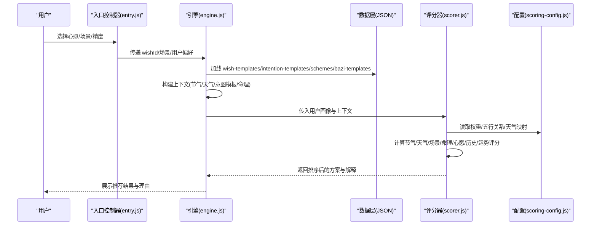
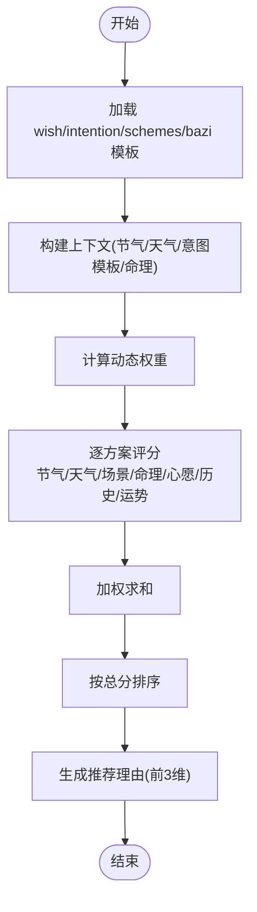
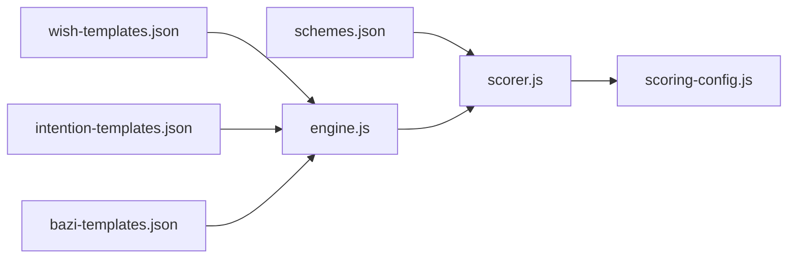

# 愿望模板数据

<cite>
**本文档引用的文件**
- [wish-templates.json](file://data/wish-templates.json)
- [intention-templates.json](file://data/intention-templates.json)
- [schemes.json](file://data/schemes.json)
- [bazi-templates.json](file://data/bazi-templates.json)
- [engine.js](file://js/services/engine.js)
- [scorer.js](file://js/core/scorer.js)
- [scoring-config.js](file://js/core/scoring-config.js)
- [data-manager.js](file://js/data/data-manager.js)
- [repository.js](file://js/data/repository.js)
- [entry.js](file://js/controllers/entry.js)
</cite>

## 目录
1. [简介](#简介)
2. [项目结构](#项目结构)
3. [核心组件](#核心组件)
4. [架构总览](#架构总览)
5. [详细组件分析](#详细组件分析)
6. [依赖关系分析](#依赖关系分析)
7. [性能考量](#性能考量)
8. [故障排查指南](#故障排查指南)
9. [结论](#结论)
10. [附录](#附录)

## 简介
本文件针对 wish-templates.json 愿望模板数据进行系统化技术文档梳理，涵盖数据结构设计、语言风格与情感色彩、个性化定制机制、与推荐系统的关联逻辑、版本管理与更新策略，并提供模板开发指南、测试方法与用户体验优化建议。文档同时结合项目中意图模板、方案库、八字模板以及评分与引擎模块，形成端到端的实现视角。

## 项目结构
wish-templates.json 位于 data 目录下，作为基础的愿望模板数据源之一，配合 intention-templates.json（意图模板）、schemes.json（方案库）与 bazi-templates.json（八字模板），共同构成推荐系统的核心数据层。评分与引擎模块负责将这些模板与用户画像、天气、场景等上下文进行融合，输出个性化推荐。

图表来源
- [wish-templates.json](file://data/wish-templates.json#L1-L47)
- [intention-templates.json](file://data/intention-templates.json#L1-L493)
- [schemes.json](file://data/schemes.json#L1-L509)
- [bazi-templates.json](file://data/bazi-templates.json#L1-L103)
- [engine.js](file://js/services/engine.js#L123-L174)
- [scorer.js](file://js/core/scorer.js#L1-L317)
- [scoring-config.js](file://js/core/scoring-config.js#L1-L128)
- [entry.js](file://js/controllers/entry.js#L105-L129)
- [repository.js](file://js/data/repository.js#L1-L154)
- [data-manager.js](file://js/data/data-manager.js#L1-L376)

章节来源
- [wish-templates.json](file://data/wish-templates.json#L1-L47)
- [intention-templates.json](file://data/intention-templates.json#L1-L493)
- [schemes.json](file://data/schemes.json#L1-L509)
- [bazi-templates.json](file://data/bazi-templates.json#L1-L103)

## 核心组件
- 愿望模板（wish-templates.json）：定义愿望类别、颜色偏向、材质偏向与建议语句，支撑心愿契合评分。
- 意图模板（intention-templates.json）：按节气与心愿类型提供颜色、材质、情感与注解，用于构建“心愿表达”。
- 方案库（schemes.json）：包含每个节气下的多套搭配方案，提供颜色、材质、情感与注解，作为推荐候选。
- 八字模板（bazi-templates.json）：基于日主强弱与年份给出颜色、材质、情感与注解，辅助命理评分。
- 推荐引擎（engine.js）：加载模板、构建上下文、选择最佳意图模板、生成推荐。
- 评分器（scorer.js）：综合节气、天气、场景、命理、心愿、历史偏好与运势进行评分与排序。
- 评分配置（scoring-config.js）：权重、五行关系、天气与温度映射、动态权重计算。
- 控制层（entry.js）：用户选择心愿、场景、精度等交互入口。
- 数据仓库与管理（repository.js、data-manager.js）：偏好、收藏、最后结果等本地持久化与导入导出。

章节来源
- [engine.js](file://js/services/engine.js#L123-L174)
- [scorer.js](file://js/core/scorer.js#L1-L317)
- [scoring-config.js](file://js/core/scoring-config.js#L1-L128)
- [entry.js](file://js/controllers/entry.js#L105-L129)
- [repository.js](file://js/data/repository.js#L1-L154)
- [data-manager.js](file://js/data/data-manager.js#L1-L376)

## 架构总览
推荐流程从用户选择心愿开始，引擎加载模板与上下文，评分器对候选方案进行加权评分，最终输出排序后的推荐结果与解释。

图表来源
- [entry.js](file://js/controllers/entry.js#L105-L129)
- [engine.js](file://js/services/engine.js#L339-L375)
- [scorer.js](file://js/core/scorer.js#L29-L75)
- [scoring-config.js](file://js/core/scoring-config.js#L7-L92)

## 详细组件分析

### 愿望模板数据结构设计
- 结构组成
  - wishes 数组：每条心愿包含 id、name、colorBias（颜色偏向）、materialBias（材质偏向）、advice（建议语句）。
  - seasonModifiers 对象：定义五行为单位的 boost（增益）与 avoid（忌讳），用于节气与心愿的协同评分。
- 设计要点
  - 偏向字段为后续评分提供方向性约束，便于与方案库颜色五行与材质属性对齐。
  - advice 提供人性化建议，便于前端展示与解释。
- 关联关系
  - wishId 与 intention-templates.json 的 intention 字段对应，用于选择最佳意图模板。
  - wishId 也参与心愿契合评分（scoreWish）。

章节来源
- [wish-templates.json](file://data/wish-templates.json#L1-L47)
- [engine.js](file://js/services/engine.js#L123-L174)
- [scorer.js](file://js/core/scorer.js#L198-L210)

### 意图模板的语言风格与情感色彩
- 内容构成
  - id、intention（心愿类型）、solarTerm（节气）、color（颜色）、material（材质）、feeling（情感）、annotation（注解）、source（出处）。
- 风格特征
  - 正式：大量引用经典文献（如《本草纲目》《礼记》《周易》等），体现传统典籍权威性。
  - 随意：通过“如雾散后天光”“应霜始降之肃穆”等具象描述，使表达更贴近生活。
  - 诗意：以“澄澈感”“幽玄感”“深润感”等词汇营造意境，强调情感与氛围。
- 交互元素
  - 前端可直接展示 color、material、feeling 与 annotation，形成“心愿表达”的视觉与情感体验。
  - 引用 source 可用于溯源与信任背书。

章节来源
- [intention-templates.json](file://data/intention-templates.json#L1-L493)

### 个性化定制机制
- 用户偏好设置
  - 默认偏好：style、wuxingScores、colorScores、materialScores。
  - 新用户冷启动：使用默认偏好；非新用户则基于历史偏好加成。
- 动态内容生成
  - 引擎根据 wishId 选择最佳意图模板，结合当前节气与天气，构建上下文。
  - 评分器依据历史偏好（wuxing/color/material）对方案进行加成。
- 交互入口
  - 入口控制器提供 wishTag 切换、场景切换与精度切换，影响上下文与评分权重。

章节来源
- [engine.js](file://js/services/engine.js#L176-L198)
- [engine.js](file://js/services/engine.js#L203-L228)
- [scorer.js](file://js/core/scorer.js#L215-L237)
- [entry.js](file://js/controllers/entry.js#L105-L129)

### 愿望模板与推荐系统的关联逻辑
- 目标匹配
  - wishId 与 intention-templates.json 的 intention 匹配，按节气距离排序取最近模板。
  - wishId 也参与心愿契合评分（scoreWish），若存在意图模板则给予一定加分。
- 方案筛选
  - 评分器综合节气、天气、场景、命理、心愿、历史偏好与运势，按权重加权求和。
  - 动态权重会根据用户是否有八字、是否新用户进行调整。
- 算法实现
  - 五行关系得分：相生、相克、同源、相控等关系映射到不同分数区间。
  - 天气与温度映射：晴/雨/雪等天气映射到五行，温度等级映射到五行，用于调候评分。
  - 心愿契合：若存在意图模板，按模板内容进行评分（当前实现为固定加分）。

图表来源
- [engine.js](file://js/services/engine.js#L339-L375)
- [scorer.js](file://js/core/scorer.js#L29-L75)
- [scoring-config.js](file://js/core/scoring-config.js#L74-L92)

章节来源
- [engine.js](file://js/services/engine.js#L123-L174)
- [scorer.js](file://js/core/scorer.js#L1-L317)
- [scoring-config.js](file://js/core/scoring-config.js#L1-L128)

### 版本管理与更新策略
- 数据版本
  - 数据管理模块维护版本号，导入时进行版本校验，确保兼容性。
- 向后兼容
  - 当用户数据版本与当前版本不一致时，阻止导入并提示错误。
- 更新策略
  - 建议在新增字段时：
    - 在配置中扩展权重与评分规则；
    - 在模板中增加对应字段并在引擎中读取；
    - 在评分器中新增评分维度或调整现有维度权重；
    - 在导入验证中加入新字段校验。
- 数据迁移
  - 通过导出/导入机制进行用户数据备份与迁移，避免丢失偏好与收藏。

章节来源
- [data-manager.js](file://js/data/data-manager.js#L8-L22)
- [data-manager.js](file://js/data/data-manager.js#L106-L135)
- [data-manager.js](file://js/data/data-manager.js#L143-L184)

### 模板开发指南
- 字段规范
  - wish-templates.json：id、name、colorBias、materialBias、advice。
  - intention-templates.json：intention、solarTerm、color、material、feeling、annotation、source。
  - schemes.json：termId、rank、color.wuxing、material、feeling、annotation、source。
  - bazi-templates.json：baZiKey、solarTerm、color、material、feeling、annotation、source。
- 开发步骤
  - 在相应 JSON 中新增条目，确保字段完整且语义清晰。
  - 在引擎中确认 wishId 与 intention 的映射关系，必要时扩展映射表。
  - 在评分器中评估是否需要新增评分维度或调整权重。
  - 在前端渲染中增加对应展示逻辑（颜色、材质、情感、注解）。
- 测试方法
  - 单元测试：对评分器的关键函数（如 getElementRelationScore、getDynamicWeights）进行断言。
  - 集成测试：构造用户画像与上下文，验证推荐结果的合理性与稳定性。
  - A/B 测试：对比新模板上线前后的用户反馈与点击率。
- 用户体验优化
  - 前端展示：将 color、material、feeling 与 annotation 组合为“心愿表达卡片”，增强可读性与情感共鸣。
  - 交互引导：在入口控制器中提供清晰的 wishTag 切换与场景选择，减少认知负担。
  - 反馈闭环：收集 recommendation_feedback，持续优化权重与模板。

章节来源
- [engine.js](file://js/services/engine.js#L123-L174)
- [scorer.js](file://js/core/scorer.js#L1-L317)
- [scoring-config.js](file://js/core/scoring-config.js#L1-L128)
- [entry.js](file://js/controllers/entry.js#L105-L129)

## 依赖关系分析
- wish-templates.json 与 intention-templates.json 的关联：通过 wishId 与 intention 字段建立映射，用于选择最佳意图模板。
- schemes.json 与 wish-templates.json 的关联：通过颜色五行与材质属性与 wish 的 colorBias/materialBias 进行匹配。
- 八字模板与命理评分：bazi-templates.json 与 engine.js 的 findBestBaziTemplate 逻辑配合，为评分器提供命理依据。
- 评分器与配置：scorer.js 依赖 scoring-config.js 的权重、五行关系与映射，实现动态权重与关系评分。

图表来源
- [wish-templates.json](file://data/wish-templates.json#L1-L47)
- [intention-templates.json](file://data/intention-templates.json#L1-L493)
- [schemes.json](file://data/schemes.json#L1-L509)
- [bazi-templates.json](file://data/bazi-templates.json#L1-L103)
- [engine.js](file://js/services/engine.js#L123-L174)
- [scorer.js](file://js/core/scorer.js#L1-L317)
- [scoring-config.js](file://js/core/scoring-config.js#L1-L128)

章节来源
- [engine.js](file://js/services/engine.js#L123-L174)
- [scorer.js](file://js/core/scorer.js#L1-L317)
- [scoring-config.js](file://js/core/scoring-config.js#L1-L128)

## 性能考量
- 数据加载
  - 使用 Promise.all 并行加载多个模板，减少等待时间。
- 评分缓存
  - 评分器内部使用 Map 缓存计算结果，避免重复评分。
- 动态权重
  - 根据用户画像动态调整权重，减少无效评分维度的计算。
- 建议
  - 对大型模板集合进行分页或懒加载；
  - 对高频查询建立索引（如按 wishId、termId、material 等）；
  - 在前端对渲染进行虚拟滚动与节流。

## 故障排查指南
- 模板加载失败
  - 检查 JSON 文件语法与字段完整性；
  - 确认引擎加载顺序与异常处理逻辑。
- 评分异常
  - 核对五行关系映射与权重配置；
  - 检查动态权重计算逻辑与用户画像字段。
- 导入/导出问题
  - 确认数据版本一致性；
  - 检查文件格式与存储权限。

章节来源
- [engine.js](file://js/services/engine.js#L343-L352)
- [scorer.js](file://js/core/scorer.js#L20-L22)
- [scoring-config.js](file://js/core/scoring-config.js#L74-L92)
- [data-manager.js](file://js/data/data-manager.js#L106-L135)

## 结论
wish-templates.json 作为心愿表达与契合评分的基础，与意图模板、方案库、八字模板及评分引擎形成完整的推荐闭环。通过明确的数据结构、灵活的个性化机制与严谨的评分配置，系统能够为用户提供既符合传统智慧又贴近现代审美的穿搭建议。建议在后续迭代中进一步完善心愿契合评分的模板化实现，并持续优化性能与用户体验。

## 附录
- 关键字段一览
  - wish-templates.json：id、name、colorBias、materialBias、advice、seasonModifiers。
  - intention-templates.json：intention、solarTerm、color、material、feeling、annotation、source。
  - schemes.json：termId、rank、color.wuxing、material、feeling、annotation、source。
  - bazi-templates.json：baZiKey、solarTerm、color、material、feeling、annotation、source。
- 相关实现参考路径
  - 引擎加载与上下文构建：[engine.js](file://js/services/engine.js#L339-L375)
  - 意图模板选择：[engine.js](file://js/services/engine.js#L123-L174)
  - 评分器评分流程：[scorer.js](file://js/core/scorer.js#L29-L75)
  - 五行关系与权重：[scoring-config.js](file://js/core/scoring-config.js#L1-L128)
  - 用户偏好与历史评分：[scorer.js](file://js/core/scorer.js#L215-L237)
  - 数据导入导出与版本管理：[data-manager.js](file://js/data/data-manager.js#L106-L184)