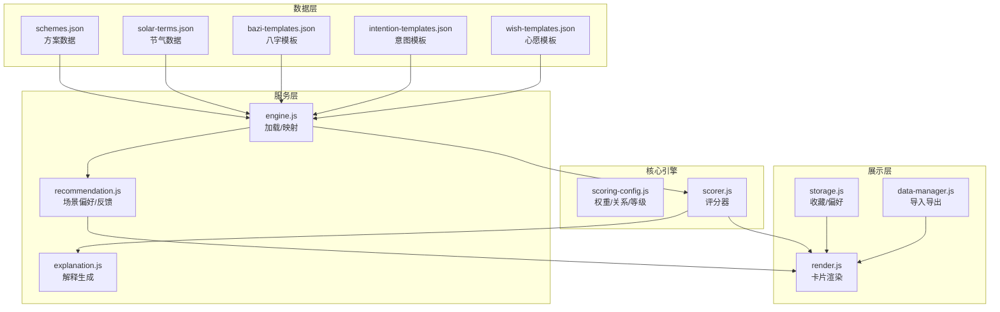
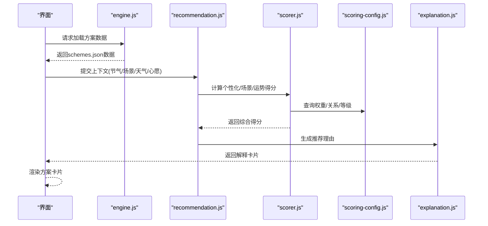
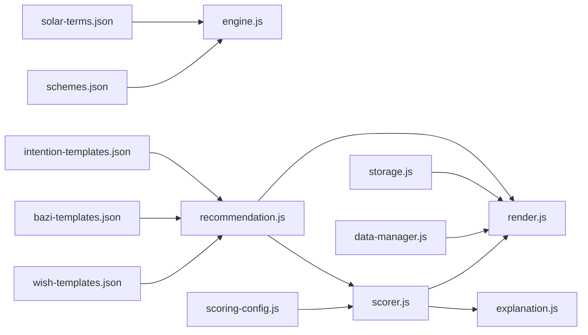

# 穿搭方案数据

<cite>
**本文档引用的文件**
- [schemes.json](file://data/schemes.json)
- [solar-terms.json](file://data/solar-terms.json)
- [bazi-templates.json](file://data/bazi-templates.json)
- [intention-templates.json](file://data/intention-templates.json)
- [wish-templates.json](file://data/wish-templates.json)
- [engine.js](file://js/services/engine.js)
- [recommendation.js](file://js/services/recommendation.js)
- [scorer.js](file://js/core/scorer.js)
- [scoring-config.js](file://js/core/scoring-config.js)
- [explanation.js](file://js/services/explanation.js)
- [data-manager.js](file://js/data/data-manager.js)
- [storage.js](file://js/data/storage.js)
- [render.js](file://js/utils/render.js)
</cite>

## 目录
1. [简介](#简介)
2. [项目结构](#项目结构)
3. [核心组件](#核心组件)
4. [架构总览](#架构总览)
5. [详细组件分析](#详细组件分析)
6. [依赖分析](#依赖分析)
7. [性能考虑](#性能考虑)
8. [故障排查指南](#故障排查指南)
9. [结论](#结论)
10. [附录](#附录)

## 简介
本文件面向“schemes.json”穿搭方案数据，提供系统化的技术文档，涵盖数据结构定义、字段语义、评分与推荐流程、数据验证与扩展开发指南，并结合前端实现展示数据在应用中的使用方式。目标读者既包括开发者，也包括对数据结构与业务逻辑感兴趣的非技术用户。

## 项目结构
与“schemes.json”直接相关的数据与代码分布如下：
- 数据层：data目录下的各类JSON文件，包含方案、节气、心愿、八字模板等
- 服务层：加载与处理数据的服务模块
- 核心引擎：评分与推荐算法
- 展示层：渲染方案卡片与解释说明

图表来源
- [schemes.json](file://data/schemes.json#L1-L509)
- [solar-terms.json](file://data/solar-terms.json#L1-L42)
- [engine.js](file://js/services/engine.js#L39-L75)
- [recommendation.js](file://js/services/recommendation.js#L31-L87)
- [scorer.js](file://js/core/scorer.js#L14-L75)
- [scoring-config.js](file://js/core/scoring-config.js#L6-L19)
- [explanation.js](file://js/services/explanation.js#L25-L111)
- [render.js](file://js/utils/render.js#L134-L163)
- [storage.js](file://js/data/storage.js#L117-L144)
- [data-manager.js](file://js/data/data-manager.js#L48-L99)

章节来源
- [schemes.json](file://data/schemes.json#L1-L509)
- [solar-terms.json](file://data/solar-terms.json#L1-L42)
- [engine.js](file://js/services/engine.js#L39-L75)

## 核心组件
- 方案数据模型：包含方案ID、节气标识、评分等级、颜色配置、材质信息、穿着感受、注释文本与文化来源等字段
- 节气数据模型：包含节气ID、名称、五行属性、月份与日期范围，以及按季节聚合的节气清单
- 心愿模板：包含心愿ID、名称、五行偏向、材质偏向与建议
- 八字模板：包含命理相关的方案模板
- 意图模板：包含不同人生目标（求职、贵人运、远行顺利等）对应的方案模板

章节来源
- [schemes.json](file://data/schemes.json#L1-L509)
- [solar-terms.json](file://data/solar-terms.json#L1-L42)
- [wish-templates.json](file://data/wish-templates.json#L1-L47)
- [bazi-templates.json](file://data/bazi-templates.json#L1-L103)
- [intention-templates.json](file://data/intention-templates.json#L1-L493)

## 架构总览
schemes.json作为核心数据源，通过服务层加载并参与评分与推荐；评分器依据权重与五行关系计算得分；解释模块生成推荐理由；最终在展示层渲染方案卡片与解释。

图表来源
- [engine.js](file://js/services/engine.js#L60-L65)
- [recommendation.js](file://js/services/recommendation.js#L323-L379)
- [scorer.js](file://js/core/scorer.js#L29-L75)
- [scoring-config.js](file://js/core/scoring-config.js#L74-L92)
- [explanation.js](file://js/services/explanation.js#L25-L111)

## 详细组件分析

### 方案数据模型（schemes.json）
- 结构概览
  - 根对象包含数组“schemes”，每个元素代表一个穿搭方案
- 核心字段定义
  - id：方案唯一标识，通常由“节气缩写_序号”构成
  - termId：所属节气ID，与节气数据关联
  - rank：在该节气下的推荐排序（1为最优）
  - color：颜色配置对象，包含name、hex、wuxing
  - material：材质描述（天然/合成/特殊面料）
  - feeling：穿着感受描述（触觉+情感色彩）
  - annotation：注释文本（文化/医学/节气意义）
  - source：文化来源标注（古籍/权威文献）

- 字段语义与约束
  - id：全局唯一，便于收藏与追踪
  - termId：必须存在于节气数据中
  - rank：同一节气内递增排序，1为首选
  - color.wuxing：必须为“wood/fire/earth/metal/water”之一
  - color.name：颜色名称，用于展示与偏好记忆
  - color.hex：十六进制颜色值，用于UI渲染
  - material：材质描述，用于场景匹配与天气联动
  - feeling：语义化表达，体现触觉与情感，用于个性化偏好
  - annotation：节气/文化/医学解释，用于教育与信任
  - source：文化来源，格式为“《书名》”或“作者·篇名”

- 数据完整性与一致性
  - 同一节气下，rank应连续且唯一
  - color.wuxing与节气五行存在相生/相克关系时，应符合推荐策略
  - material与feeling应与节气气候特征一致（如夏季推荐凉感、冬季推荐暖感）

章节来源
- [schemes.json](file://data/schemes.json#L1-L509)

### 节气数据模型（solar-terms.json）
- 结构概览
  - 包含“terms”数组与“seasons”聚合对象
- 字段定义
  - id/name：节气ID与名称
  - wuxing：节气对应的五行属性
  - month/dayRange：节气所在公历月份与日期范围
  - seasons：按季节聚合的节气列表
  - wuxingNames：五行名称映射

- 使用方式
  - 通过termId与schemes.json中的termId关联
  - 用于计算节气匹配得分与场景适配

章节来源
- [solar-terms.json](file://data/solar-terms.json#L1-L42)

### 心愿模板（wish-templates.json）
- 结构概览
  - 包含“wishes”数组与“seasonModifiers”
- 字段定义
  - id/name：心愿ID与名称
  - colorBias/materialBias：心愿对应的五行与材质偏向
  - advice：针对该心愿的搭配建议
  - seasonModifiers：季节性增减益规则（boost/avoid）

- 使用方式
  - 与schemes.json结合，生成“心愿契合”得分
  - 用于个性化推荐与解释

章节来源
- [wish-templates.json](file://data/wish-templates.json#L1-L47)

### 八字模板（bazi-templates.json）
- 结构概览
  - 数组形式，每条记录对应特定年份/日主的推荐方案
- 字段定义
  - id：模板ID
  - baZiKey：命理关键信息（日主、年份等）
  - solarTerm：适用节气
  - color/material/feeling/annotation/source：与方案一致的字段

- 使用方式
  - 作为命理层面的参考，影响“八字喜用”得分

章节来源
- [bazi-templates.json](file://data/bazi-templates.json#L1-L103)

### 意图模板（intention-templates.json）
- 结构概览
  - 数组形式，覆盖求职、贵人运、远行、静心、健康、升职、签单、防小人、桃花、家庭、挽回、精力、安眠、自信、康复、出行平安等主题
- 字段定义
  - id：模板ID（格式如“job_qingming”）
  - intention：意图类别
  - solarTerm：适用节气
  - color/material/feeling/annotation/source：与方案一致的字段

- 使用方式
  - 与schemes.json结合，生成“意图契合”得分

章节来源
- [intention-templates.json](file://data/intention-templates.json#L1-L493)

### 服务与引擎（加载、评分、解释）
- 数据加载（engine.js）
  - 提供异步加载schemes.json与intention-templates.json的方法
  - 内置安全获取与JSON解析

- 场景偏好与个性化（recommendation.js）
  - 定义场景类型与偏好权重
  - 记录用户反馈并更新偏好
  - 计算个性化得分、场景匹配得分与今日运势加成

- 评分配置（scoring-config.js）
  - 权重体系：节气、八字、场景、天气、心愿、历史偏好、今日运势
  - 五行关系：相生、相克、同级关系的得分映射
  - 评分等级：完美、优秀、良好、一般、较差、不佳

- 评分器（scorer.js）
  - 封装评分逻辑，支持缓存与解释生成
  - 分维度计算得分并汇总

- 解释生成（explanation.js）
  - 生成推荐理由（节气相应/相生、八字补益/相生、场景适宜、今日运势、个性化偏好）
  - 生成五行分析与雷达图

章节来源
- [engine.js](file://js/services/engine.js#L60-L65)
- [recommendation.js](file://js/services/recommendation.js#L31-L87)
- [recommendation.js](file://js/services/recommendation.js#L247-L284)
- [scoring-config.js](file://js/core/scoring-config.js#L6-L19)
- [scoring-config.js](file://js/core/scoring-config.js#L120-L127)
- [scorer.js](file://js/core/scorer.js#L29-L75)
- [explanation.js](file://js/services/explanation.js#L25-L111)

### 展示与交互（render.js、storage.js、data-manager.js）
- 方案卡片渲染（render.js）
  - 基于方案字段生成卡片，包含颜色条、关键词、注释与来源
  - 支持收藏按钮与收藏状态

- 收藏与偏好（storage.js）
  - 收藏管理：添加/移除/查询
  - 偏好持久化：用户偏好数据存储

- 数据导入导出（data-manager.js）
  - 导出用户数据（版本控制、统计信息）
  - 导入校验与合并策略
  - 文件读取与错误处理

章节来源
- [render.js](file://js/utils/render.js#L134-L163)
- [storage.js](file://js/data/storage.js#L117-L144)
- [data-manager.js](file://js/data/data-manager.js#L48-L99)

## 依赖分析
- 数据依赖
  - schemes.json依赖solar-terms.json（节气ID映射）
  - 心愿模板与八字模板可作为外部参考，参与评分
- 服务依赖
  - engine.js负责数据加载
  - recommendation.js依赖场景偏好与用户反馈
  - scorer.js依赖权重与五行关系配置
  - explanation.js依赖推荐服务与用户偏好
- 展示依赖
  - render.js依赖方案字段与收藏状态
  - storage.js与data-manager.js依赖浏览器存储API

图表来源
- [schemes.json](file://data/schemes.json#L1-L509)
- [solar-terms.json](file://data/solar-terms.json#L1-L42)
- [wish-templates.json](file://data/wish-templates.json#L1-L47)
- [bazi-templates.json](file://data/bazi-templates.json#L1-L103)
- [intention-templates.json](file://data/intention-templates.json#L1-L493)
- [engine.js](file://js/services/engine.js#L60-L65)
- [recommendation.js](file://js/services/recommendation.js#L31-L87)
- [scorer.js](file://js/core/scorer.js#L29-L75)
- [scoring-config.js](file://js/core/scoring-config.js#L6-L19)
- [explanation.js](file://js/services/explanation.js#L25-L111)
- [render.js](file://js/utils/render.js#L134-L163)
- [storage.js](file://js/data/storage.js#L117-L144)
- [data-manager.js](file://js/data/data-manager.js#L48-L99)

## 性能考虑
- 数据加载
  - 异步加载与缓存：engine.js对已加载数据进行缓存，避免重复请求
- 评分计算
  - scorer.js使用Map缓存计算结果，减少重复评分
  - 动态权重：根据用户画像调整权重，避免无效计算
- 渲染优化
  - 卡片渲染按索引延迟动画，提升首屏体验
  - 收藏状态查询为O(n)线性查找，建议在收藏量较大时引入索引结构

[本节为通用性能讨论，无需列出具体文件来源]

## 故障排查指南
- 数据加载失败
  - 检查engine.js的safeFetch与safeJsonParse是否抛错
  - 确认schemes.json路径正确且可访问
- 数据结构异常
  - 校验schemes.json字段完整性（id、termId、rank、color、material、feeling、annotation、source）
  - 校验color.wuxing是否为允许值集合
- 评分异常
  - 检查scoring-config.js中的权重与关系映射
  - 确认context参数（termWuxing、sceneId、weather、wishId）是否正确传递
- 解释缺失
  - 检查explanation.js的generateReasons逻辑与用户偏好数据
- 导入导出问题
  - 使用data-manager.js的validateImportData进行校验
  - 确认DATA_VERSION与数据版本一致

章节来源
- [engine.js](file://js/services/engine.js#L60-L65)
- [scoring-config.js](file://js/core/scoring-config.js#L74-L92)
- [explanation.js](file://js/services/explanation.js#L25-L111)
- [data-manager.js](file://js/data/data-manager.js#L106-L135)

## 结论
schemes.json作为应用的核心数据源，通过严谨的数据结构设计与完善的评分/解释/展示链路，实现了“节气—命理—场景—心愿”的多维匹配与个性化推荐。建议在扩展新方案时遵循既有字段规范与文化来源标注机制，确保数据一致性与可维护性。

[本节为总结性内容，无需列出具体文件来源]

## 附录

### A. 字段定义与示例（节选）
- 方案字段
  - id：示例“lichun_01”
  - termId：示例“lichun”
  - rank：示例1
  - color：name、hex、wuxing
  - material：示例“天丝棉”
  - feeling：示例“轻盈感”
  - annotation：示例“春始之色，柔韧之质，唤醒身体舒展本能”
  - source：示例“《礼记·月令》”
- 节气字段
  - id/name：示例“lichun/立春”
  - wuxing：示例“wood”
  - month/dayRange：示例2/3-5
  - seasons：按季节聚合
  - wuxingNames：五行名称映射
- 心愿字段
  - id/name：示例“career/求职顺利”
  - colorBias/materialBias：示例["wood","fire"]、["棉","麻"]
  - advice：示例“选择清爽利落的色调，展现自信与活力”
- 八字模板字段
  - id：示例“wood_2024”
  - baZiKey：示例“日主木旺｜2024甲辰年”
  - solarTerm：示例“谷雨”
  - color/material/feeling/annotation/source：与方案一致
- 意图模板字段
  - id：示例“job_qingming”
  - intention：示例“求职”
  - solarTerm：示例“清明”
  - color/material/feeling/annotation/source：与方案一致

章节来源
- [schemes.json](file://data/schemes.json#L1-L509)
- [solar-terms.json](file://data/solar-terms.json#L1-L42)
- [wish-templates.json](file://data/wish-templates.json#L1-L47)
- [bazi-templates.json](file://data/bazi-templates.json#L1-L103)
- [intention-templates.json](file://data/intention-templates.json#L1-L493)

### B. 数据验证规则
- 必填字段
  - 方案：id、termId、rank、color.name、color.hex、color.wuxing、material、feeling、annotation、source
  - 节气：id、name、wuxing、month、dayRange
  - 心愿：id、name、colorBias、materialBias、advice
- 取值范围
  - color.wuxing ∈ {"wood","fire","earth","metal","water"}
  - rank ≥ 1，同一节气内唯一
  - color.hex为合法十六进制颜色值
  - termId ∈ 节气ID集合
- 关联一致性
  - 同一节气内rank连续且唯一
  - material与feeling应与节气气候特征一致
  - source格式为“《书名》”或“作者·篇名”

章节来源
- [schemes.json](file://data/schemes.json#L1-L509)
- [solar-terms.json](file://data/solar-terms.json#L1-L42)
- [wish-templates.json](file://data/wish-templates.json#L1-L47)

### C. 扩展开发指南
- 新增方案
  - 在schemes.json中添加新方案，确保字段完整与来源标注
  - 与节气数据保持一致，避免termId不匹配
- 新增节气
  - 在solar-terms.json中新增节气条目，完善month与dayRange
  - 更新seasons聚合与wuxingNames映射
- 新增心愿/意图
  - 在wish-templates.json或intention-templates.json中新增条目
  - 确保colorBias/materialBias与现有方案风格一致
- 新增八字模板
  - 在bazi-templates.json中新增条目，参考现有格式
- 数据导入导出
  - 使用data-manager.js提供的接口进行备份与恢复
  - 注意DATA_VERSION兼容性

章节来源
- [schemes.json](file://data/schemes.json#L1-L509)
- [solar-terms.json](file://data/solar-terms.json#L1-L42)
- [wish-templates.json](file://data/wish-templates.json#L1-L47)
- [intention-templates.json](file://data/intention-templates.json#L1-L493)
- [bazi-templates.json](file://data/bazi-templates.json#L1-L103)
- [data-manager.js](file://js/data/data-manager.js#L48-L99)

### D. 最佳实践示例
- 颜色配置
  - 优先选择与节气五行相符的颜色，或相生关系的颜色以增强推荐得分
  - 使用十六进制值保证UI渲染一致性
- 材质信息
  - 夏季推荐凉感材质（如“冰丝”、“亚麻”），冬季推荐保暖材质（如“羊绒”、“粗纺羊毛”）
  - 特殊面料（如“防水尼龙”、“速干面料”）用于天气联动加分
- 穿着感受
  - 以触觉词汇（“轻盈感”、“柔软感”、“清凉感”）与情感色彩（“优雅感”、“温暖感”）相结合
  - 与场景适配（如“正式场合”强调“稳重感”）
- 注释文本
  - 文化来源标注应准确，引用经典典籍以增强可信度
  - 注释内容应简洁明了，突出节气/命理/医学意义
- 个性化与解释
  - 利用recommendation.js的反馈机制持续优化偏好
  - 使用explanation.js生成推荐理由，提升用户体验

章节来源
- [recommendation.js](file://js/services/recommendation.js#L145-L184)
- [explanation.js](file://js/services/explanation.js#L25-L111)
- [scoring-config.js](file://js/core/scoring-config.js#L120-L127)