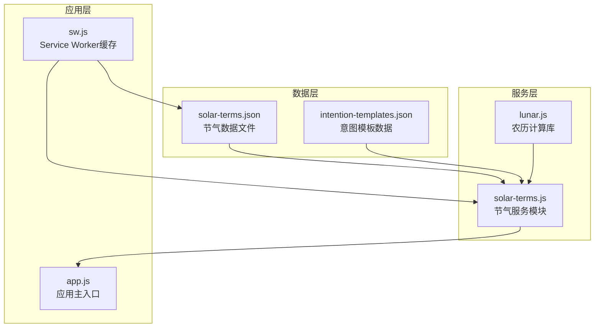
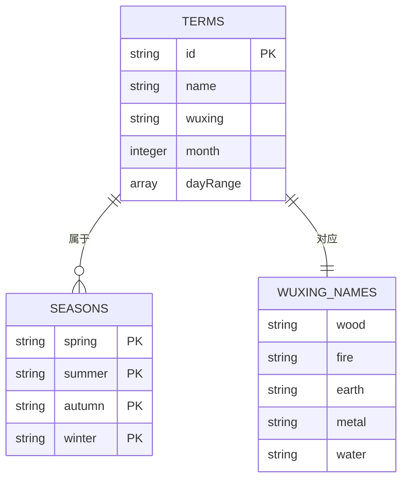
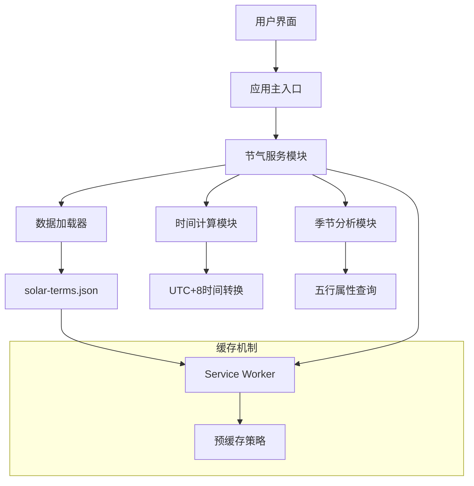
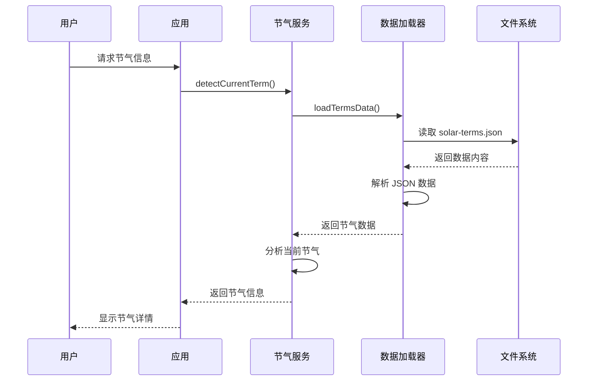
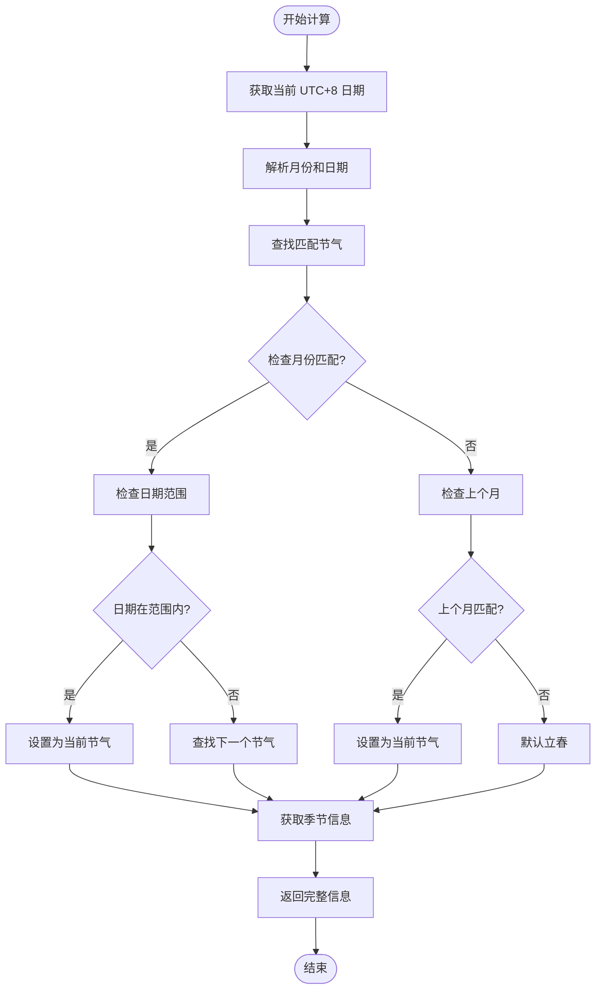
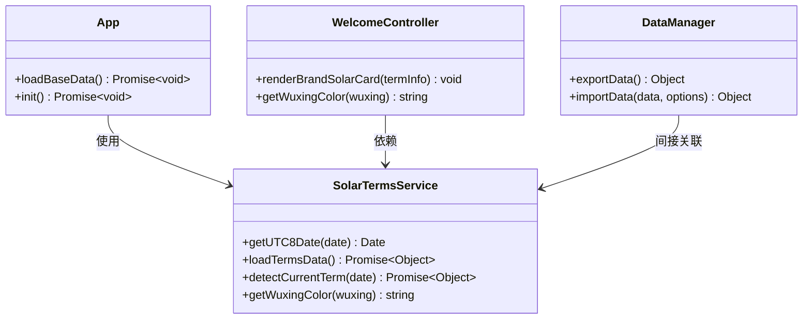
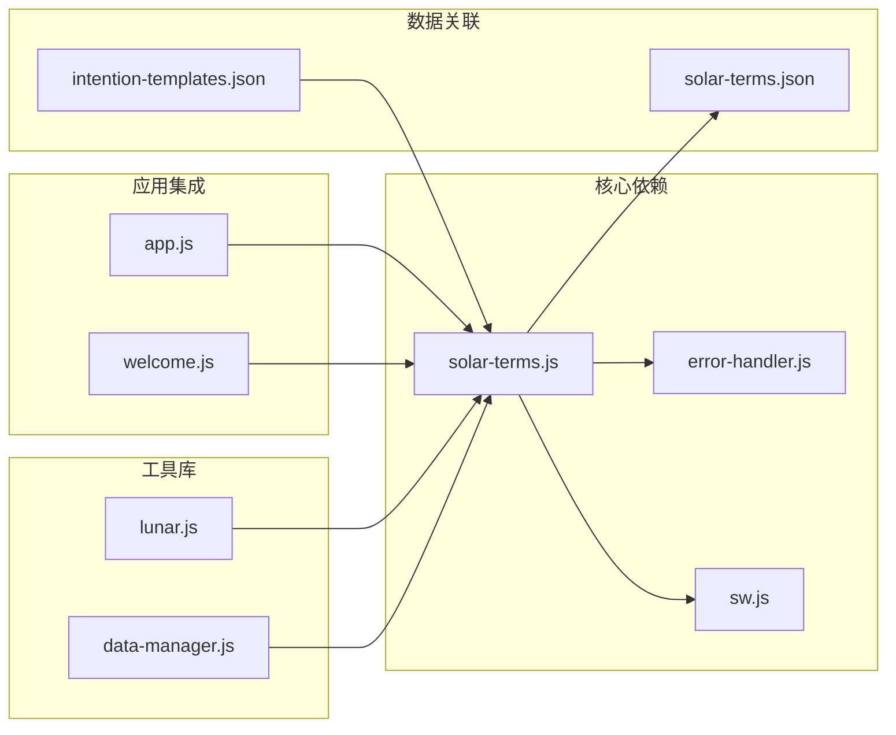

# 节气信息数据

<cite>
**本文档引用的文件**
- [solar-terms.json](file://data/solar-terms.json)
- [solar-terms.js](file://js/services/solar-terms.js)
- [app.js](file://js/core/app.js)
- [sw.js](file://sw.js)
- [lunar.js](file://js/lib/lunar.js)
- [intention-templates.json](file://data/intention-templates.json)
- [data-manager.js](file://js/data/data-manager.js)
</cite>

## 目录
1. [简介](#简介)
2. [项目结构](#项目结构)
3. [核心组件](#核心组件)
4. [架构概览](#架构概览)
5. [详细组件分析](#详细组件分析)
6. [依赖关系分析](#依赖关系分析)
7. [性能考虑](#性能考虑)
8. [故障排除指南](#故障排除指南)
9. [结论](#结论)

## 简介

本文档全面介绍了 `solar-terms.json` 节气信息数据系统的技术实现。该系统基于中国传统的二十四节气理论，结合现代前端技术，为用户提供实时的节气信息查询、五行属性分析和相关的文化背景知识。

二十四节气是中国古代订立的一种用来指导农业生产的补充历法，体现了中国古代劳动人民的智慧结晶。本系统不仅提供了准确的节气时间计算，还融入了五行学说，为用户提供了更丰富的文化体验。

## 项目结构

节气数据系统主要由以下三个层次组成：

**图表来源**
- [solar-terms.json](file://data/solar-terms.json#L1-L42)
- [solar-terms.js](file://js/services/solar-terms.js#L1-L115)
- [app.js](file://js/core/app.js#L1-L206)
- [sw.js](file://sw.js#L1-L165)

**章节来源**
- [solar-terms.json](file://data/solar-terms.json#L1-L42)
- [solar-terms.js](file://js/services/solar-terms.js#L1-L115)
- [app.js](file://js/core/app.js#L1-L206)

## 核心组件

### 节气数据结构

节气数据采用标准化的 JSON 格式，包含完整的二十四节气信息：

**图表来源**
- [solar-terms.json](file://data/solar-terms.json#L2-L41)

### 五行属性映射

系统实现了完整的五行属性体系，每个节气都明确标注了对应的五行元素：

| 五行元素 | 中文名称 | 英文标识 | 颜色代码 |
|---------|---------|---------|---------|
| Wood | 木 | wood | #4A7C59 |
| Fire | 火 | fire | #C0392B |
| Earth | 土 | earth | #C9A84C |
| Metal | 金 | metal | #B8B8A8 |
| Water | 水 | water | #1B3A6B |

**章节来源**
- [solar-terms.json](file://data/solar-terms.json#L28-L41)
- [solar-terms.js](file://js/services/solar-terms.js#L105-L114)

## 架构概览

节气系统的整体架构采用了模块化设计，确保了良好的可维护性和扩展性：

**图表来源**
- [app.js](file://js/core/app.js#L122-L131)
- [solar-terms.js](file://js/services/solar-terms.js#L20-L26)
- [sw.js](file://sw.js#L8-L47)

**章节来源**
- [app.js](file://js/core/app.js#L1-L206)
- [sw.js](file://sw.js#L1-L165)

## 详细组件分析

### 节气数据加载器

节气数据加载器负责从 JSON 文件中读取节气信息，并提供统一的数据访问接口：

**图表来源**
- [solar-terms.js](file://js/services/solar-terms.js#L20-L26)
- [solar-terms.js](file://js/services/solar-terms.js#L33-L100)

### 时间节点计算算法

节气的时间节点计算采用基于日期范围的智能匹配算法：

**图表来源**
- [solar-terms.js](file://js/services/solar-terms.js#L33-L100)

**章节来源**
- [solar-terms.js](file://js/services/solar-terms.js#L12-L15)
- [solar-terms.js](file://js/services/solar-terms.js#L44-L74)

### 服务集成机制

节气服务与应用其他模块的集成采用了松耦合的设计模式：

**图表来源**
- [solar-terms.js](file://js/services/solar-terms.js#L1-L115)
- [app.js](file://js/core/app.js#L8-L131)
- [data-manager.js](file://js/data/data-manager.js#L1-L376)

**章节来源**
- [app.js](file://js/core/app.js#L8-L131)
- [solar-terms.js](file://js/services/solar-terms.js#L1-L115)

## 依赖关系分析

节气系统与其他模块的依赖关系如下：

**图表来源**
- [solar-terms.js](file://js/services/solar-terms.js#L5-L26)
- [app.js](file://js/core/app.js#L8-L12)
- [sw.js](file://sw.js#L19-L43)

**章节来源**
- [sw.js](file://sw.js#L1-L165)
- [intention-templates.json](file://data/intention-templates.json#L1-L493)

## 性能考虑

### 缓存策略

系统采用了多层次的缓存策略来优化性能：

1. **Service Worker 预缓存**：关键资源在安装阶段就缓存到本地
2. **Stale-While-Revalidate 策略**：允许使用缓存响应，同时后台更新缓存
3. **内存缓存**：节气数据在内存中缓存，避免重复加载

### 性能优化措施

- **异步加载**：节气数据采用异步加载，不影响页面初始渲染
- **懒加载**：节气服务只在需要时才进行数据加载
- **错误处理**：完善的错误处理机制，确保系统稳定性

**章节来源**
- [sw.js](file://sw.js#L52-L94)
- [solar-terms.js](file://js/services/solar-terms.js#L20-L26)

## 故障排除指南

### 常见问题及解决方案

| 问题类型 | 症状描述 | 可能原因 | 解决方案 |
|---------|---------|---------|---------|
| 数据加载失败 | 节气信息无法显示 | 网络连接问题或文件路径错误 | 检查网络状态，确认文件路径正确 |
| 日期计算错误 | 节气显示不正确 | 时区设置问题 | 确认系统时区设置为 UTC+8 |
| 缓存问题 | 页面显示过期数据 | Service Worker 缓存未更新 | 清除浏览器缓存或强制刷新页面 |
| 性能问题 | 页面加载缓慢 | 数据量过大或网络延迟 | 检查网络状况，优化图片资源 |

### 调试技巧

1. **开发者工具**：使用浏览器开发者工具查看网络请求和控制台输出
2. **缓存检查**：通过 Application 面板检查 Service Worker 和缓存状态
3. **错误监控**：关注控制台中的错误信息，及时发现和解决问题

**章节来源**
- [solar-terms.js](file://js/services/solar-terms.js#L1-L115)
- [sw.js](file://sw.js#L99-L155)

## 结论

节气信息数据系统成功地将传统文化与现代技术相结合，为用户提供了准确、便捷的节气信息服务。系统具有以下特点：

1. **准确性**：基于标准的二十四节气定义，确保节气时间计算的准确性
2. **完整性**：涵盖了完整的节气信息、五行属性和季节分类
3. **可扩展性**：模块化设计便于功能扩展和维护
4. **用户体验**：简洁直观的界面设计，提供流畅的使用体验

该系统不仅满足了基本的节气查询需求，还为后续的功能扩展奠定了坚实的基础。通过持续的优化和完善，相信能够为用户带来更好的使用体验。