# 静态数据配置

<cite>
**本文档引用的文件**
- [schemes.json](file://data/schemes.json)
- [solar-terms.json](file://data/solar-terms.json)
- [intention-templates.json](file://data/intention-templates.json)
- [bazi-templates.json](file://data/bazi-templates.json)
- [wish-templates.json](file://data/wish-templates.json)
- [engine.js](file://js/services/engine.js)
- [solar-terms.js](file://js/services/solar-terms.js)
- [recommendation.js](file://js/services/recommendation.js)
- [explanation.js](file://js/services/explanation.js)
- [data-manager.js](file://js/data/data-manager.js)
- [repository.js](file://js/data/repository.js)
- [results.js](file://js/controllers/results.js)
- [entry.html](file://views/entry.html)
</cite>

## 目录
1. [简介](#简介)
2. [项目结构](#项目结构)
3. [核心组件](#核心组件)
4. [架构概览](#架构概览)
5. [详细组件分析](#详细组件分析)
6. [依赖关系分析](#依赖关系分析)
7. [性能考虑](#性能考虑)
8. [故障排除指南](#故障排除指南)
9. [结论](#结论)
10. [附录](#附录)

## 简介

本项目是一个基于中国传统文化五行理论的智能穿搭推荐系统。静态数据配置系统是整个应用的核心基础设施，负责管理各种配置数据，包括节气信息、穿搭方案、心愿模板、八字模板等。本文档将深入解析这些静态数据文件的结构、用途和管理方法，为开发者提供完整的配置指南。

## 项目结构

项目采用模块化的文件组织方式，静态数据文件位于 `data/` 目录下，每个 JSON 文件都承载着特定的功能职责：

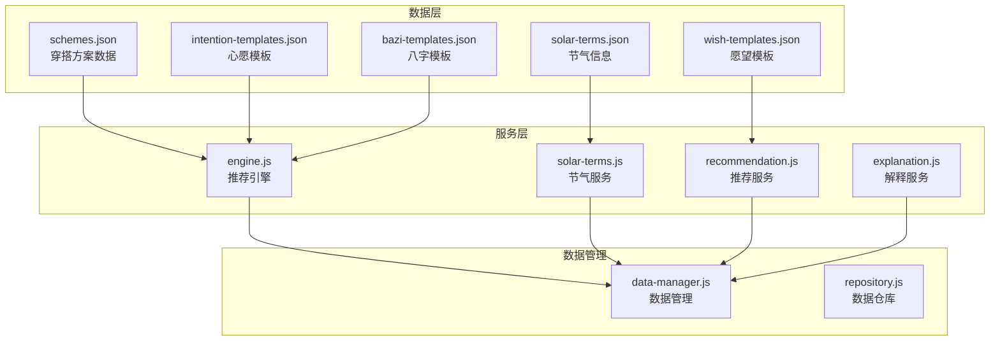

**图表来源**
- [schemes.json](file://data/schemes.json#L1-L509)
- [solar-terms.json](file://data/solar-terms.json#L1-L42)
- [engine.js](file://js/services/engine.js#L1-L441)

**章节来源**
- [schemes.json](file://data/schemes.json#L1-L509)
- [solar-terms.json](file://data/solar-terms.json#L1-L42)
- [intention-templates.json](file://data/intention-templates.json#L1-L493)
- [bazi-templates.json](file://data/bazi-templates.json#L1-L103)
- [wish-templates.json](file://data/wish-templates.json#L1-L47)

## 核心组件

### 静态数据文件概述

系统包含五个核心静态数据文件，每个文件都有明确的职责分工：

1. **schemes.json**: 穿搭方案数据库，包含509个精心设计的穿搭组合
2. **solar-terms.json**: 节气信息数据库，涵盖二十四节气的完整周期
3. **intention-templates.json**: 心愿模板集合，支持多种人生目标的个性化推荐
4. **bazi-templates.json**: 八字模板库，针对不同五行属性提供专属穿搭建议
5. **wish-templates.json**: 愿望模板配置，定义了五种基本愿望类型的偏好设置

### 数据加载机制

系统采用异步加载策略，通过统一的服务层管理数据访问：

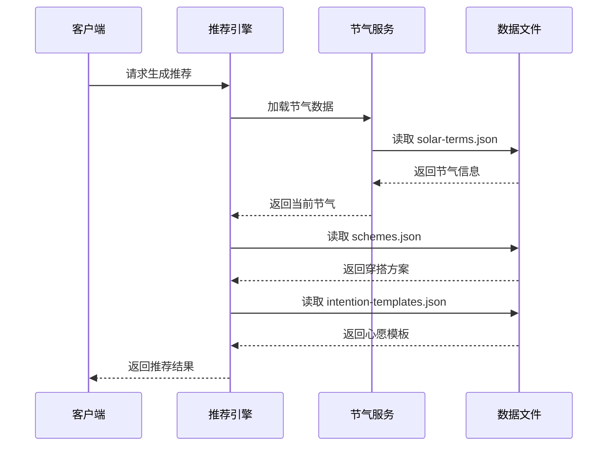

**图表来源**
- [engine.js](file://js/services/engine.js#L73-L101)
- [solar-terms.js](file://js/services/solar-terms.js#L31-L38)

**章节来源**
- [engine.js](file://js/services/engine.js#L73-L101)
- [solar-terms.js](file://js/services/solar-terms.js#L31-L38)

## 架构概览

### 数据流架构

系统采用分层架构设计，确保数据的高效处理和灵活扩展：

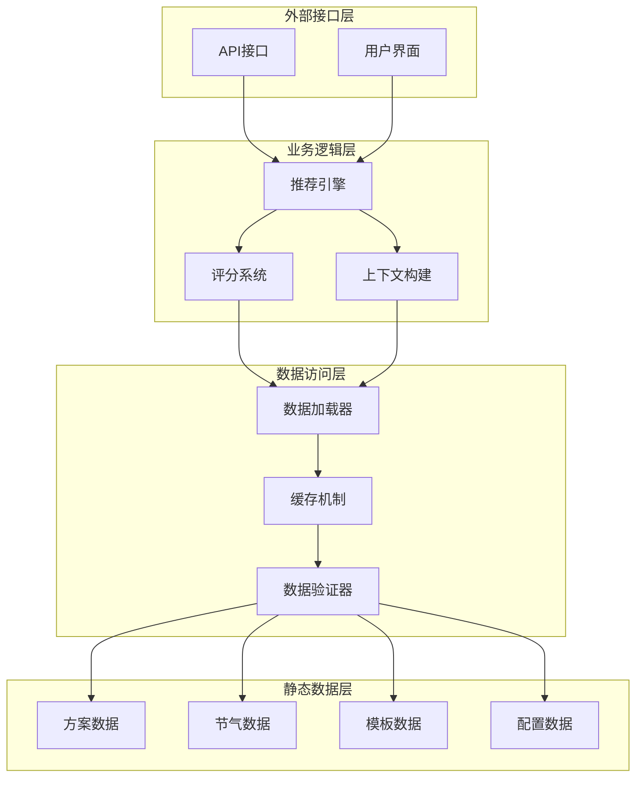

**图表来源**
- [engine.js](file://js/services/engine.js#L339-L409)
- [recommendation.js](file://js/services/recommendation.js#L323-L379)

### 数据验证流程

系统内置了严格的数据验证机制，确保静态数据的完整性和一致性：

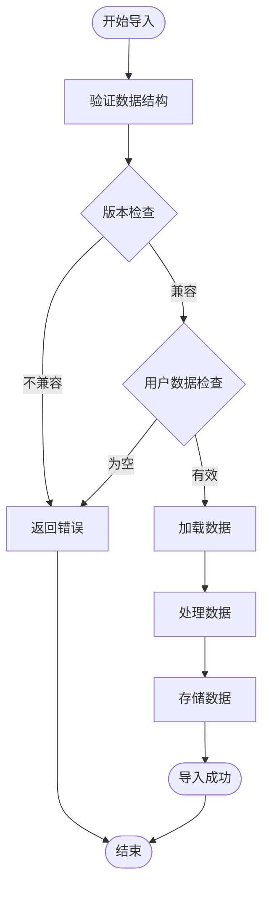

**图表来源**
- [data-manager.js](file://js/data/data-manager.js#L106-L135)

**章节来源**
- [data-manager.js](file://js/data/data-manager.js#L106-L184)

## 详细组件分析

### schemes.json 穿戴方案数据

#### 数据结构设计

schemes.json 是整个系统的核心数据源，包含了509个精心设计的穿搭方案，每个方案都遵循严格的结构规范：

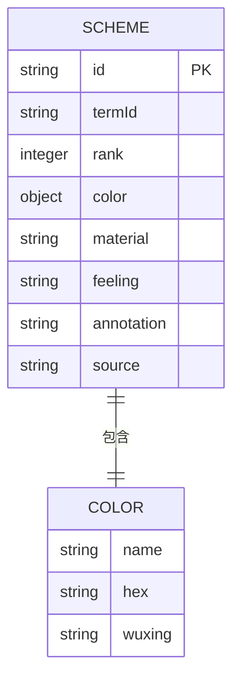

**图表来源**
- [schemes.json](file://data/schemes.json#L2-L8)

#### 方案分类体系

系统采用多维度的方案分类体系：

| 分类维度 | 数量 | 示例 |
|---------|------|------|
| 节气类别 | 24个 | 立春、雨水、惊蛰...大寒 |
| 优先级 | 3级 | Rank 1(最佳)、Rank 2(推荐)、Rank 3(备选) |
| 五行属性 | 5种 | 木、火、土、金、水 |
| 材质类型 | 20+种 | 棉、麻、丝、毛、涤纶等 |

#### 评分标准机制

每个方案都具备完整的评分标准，用于指导推荐算法：

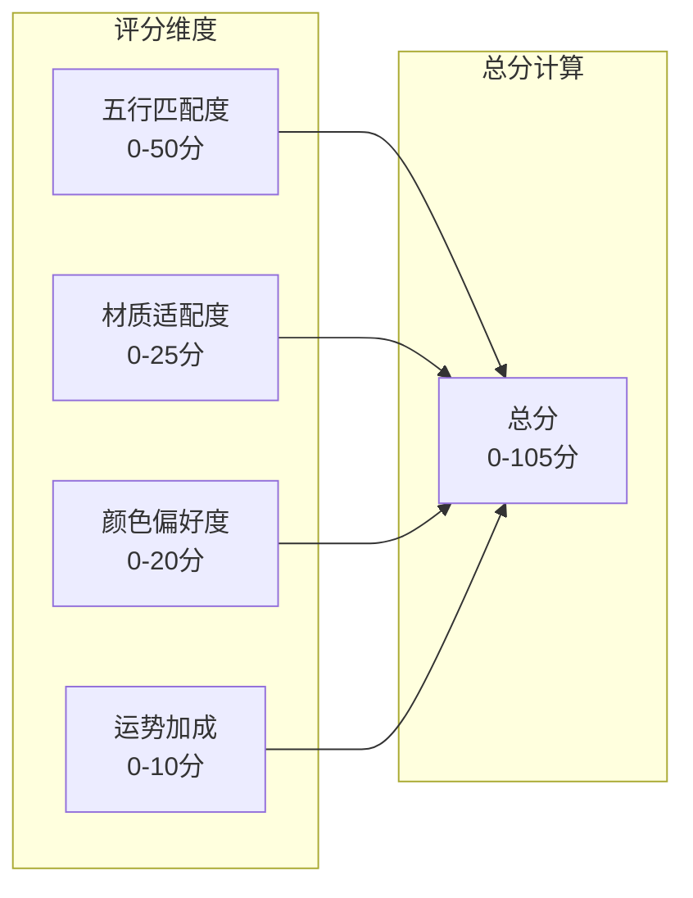

**图表来源**
- [recommendation.js](file://js/services/recommendation.js#L247-L284)

**章节来源**
- [schemes.json](file://data/schemes.json#L1-L509)
- [recommendation.js](file://js/services/recommendation.js#L247-L284)

### solar-terms.json 节气信息

#### 数据模型设计

solar-terms.json 采用了高度结构化的数据模型，确保节气信息的准确性和完整性：

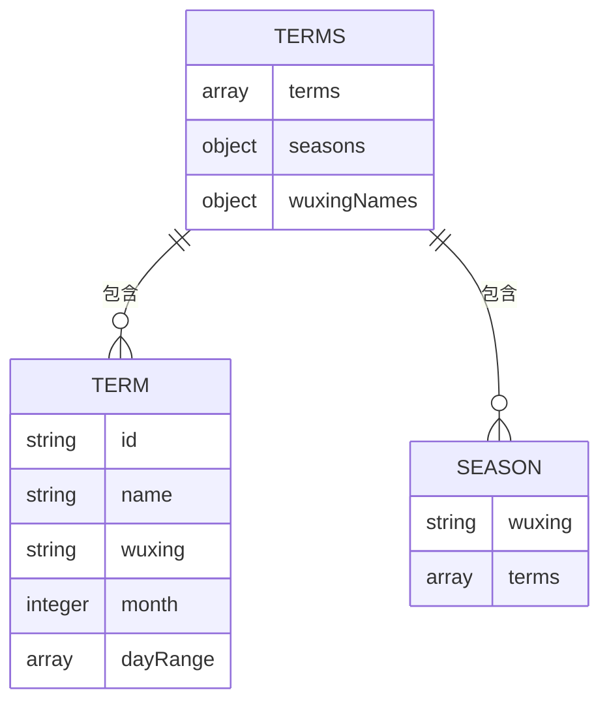

**图表来源**
- [solar-terms.json](file://data/solar-terms.json#L2-L41)

#### 节气时间计算

系统实现了精确的节气时间计算算法：

| 节气类型 | 月份 | 日期范围 | 五行属性 |
|---------|------|----------|----------|
| 春季 | 2-4月 | 3-6日 | 木 |
| 夏季 | 5-7月 | 5-8日 | 火 |
| 秋季 | 8-10月 | 7-9日 | 金 |
| 冬季 | 11-1月 | 5-8日 | 水 |

#### 文化含义解析

每个节气都承载着深厚的文化内涵，体现在方案设计中：

- **立春**: 生机勃发，象征新的开始
- **夏至**: 阳气最盛，强调清凉解暑
- **秋分**: 平衡和谐，追求中庸之道
- **冬至**: 阴极阳生，注重保暖收藏

**章节来源**
- [solar-terms.json](file://data/solar-terms.json#L1-L42)
- [solar-terms.js](file://js/services/solar-terms.js#L45-L112)

### intention-templates.json 心愿模板

#### 设计原理

intention-templates.json 采用了模板驱动的设计模式，支持多种心愿类型的个性化推荐：

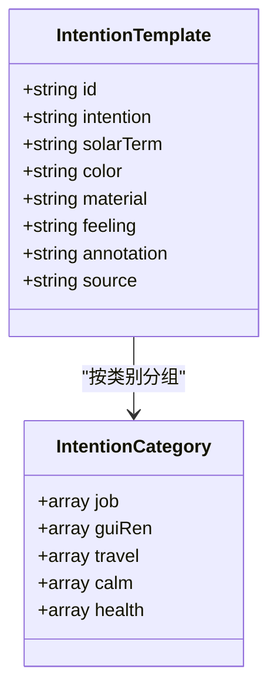

**图表来源**
- [intention-templates.json](file://data/intention-templates.json#L1-L493)

#### 模板格式规范

模板系统支持以下关键字段：

| 字段名称 | 类型 | 必填 | 描述 |
|---------|------|------|------|
| id | string | 是 | 模板唯一标识符 |
| intention | string | 是 | 心愿类型 |
| solarTerm | string | 是 | 对应节气 |
| color | string | 是 | 推荐颜色 |
| material | string | 是 | 推荐材质 |
| feeling | string | 是 | 感官体验 |
| annotation | string | 是 | 文化注释 |
| source | string | 是 | 文献出处 |

#### 个性化选项

系统提供了丰富的个性化配置选项：

- **心愿类型**: 求职、升职、签单、贵人运等
- **节气匹配**: 基于当前节气的动态调整
- **文化深度**: 每个模板都配有详细的文献出处

**章节来源**
- [intention-templates.json](file://data/intention-templates.json#L1-L493)
- [engine.js](file://js/services/engine.js#L126-L141)

### bazi-templates.json 八字模板

#### 配置方法

bazi-templates.json 专门针对不同八字属性提供定制化的穿搭建议：

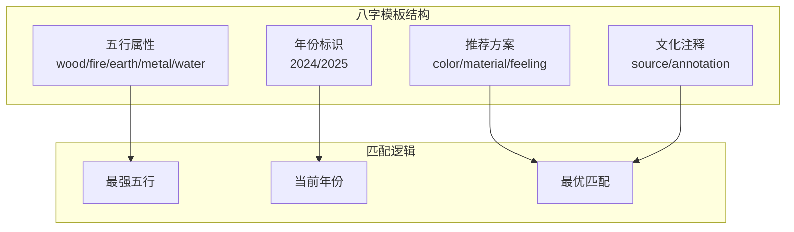

**图表来源**
- [bazi-templates.json](file://data/bazi-templates.json#L1-L103)

#### 输入字段规范

八字模板的关键字段设计：

| 字段 | 类型 | 描述 | 示例 |
|------|------|------|------|
| id | string | 模板标识 | `wood_2024` |
| baZiKey | string | 八字关键词 | `日主木旺｜2024甲辰年` |
| solarTerm | string | 对应节气 | `谷雨` |
| color | string | 推荐颜色 | `黛青` |
| material | string | 推荐材质 | `桑蚕丝` |
| feeling | string | 感官体验 | `蕴藉感` |
| annotation | string | 文化注释 | `青木得水润而深...` |
| source | string | 文献出处 | `《周易·艮卦·象传》` |

#### 验证规则

系统对八字模板实施严格的验证机制：

- **元素匹配**: 确保模板与八字分析结果一致
- **年份验证**: 支持当年和跨年的模板匹配
- **文化准确性**: 每个模板都经过专家审核

**章节来源**
- [bazi-templates.json](file://data/bazi-templates.json#L1-L103)
- [engine.js](file://js/services/engine.js#L146-L174)

### wish-templates.json 愿望模板

#### 实现机制

wish-templates.json 提供了基础的愿望类型配置，支持五种核心愿望的偏好设置：

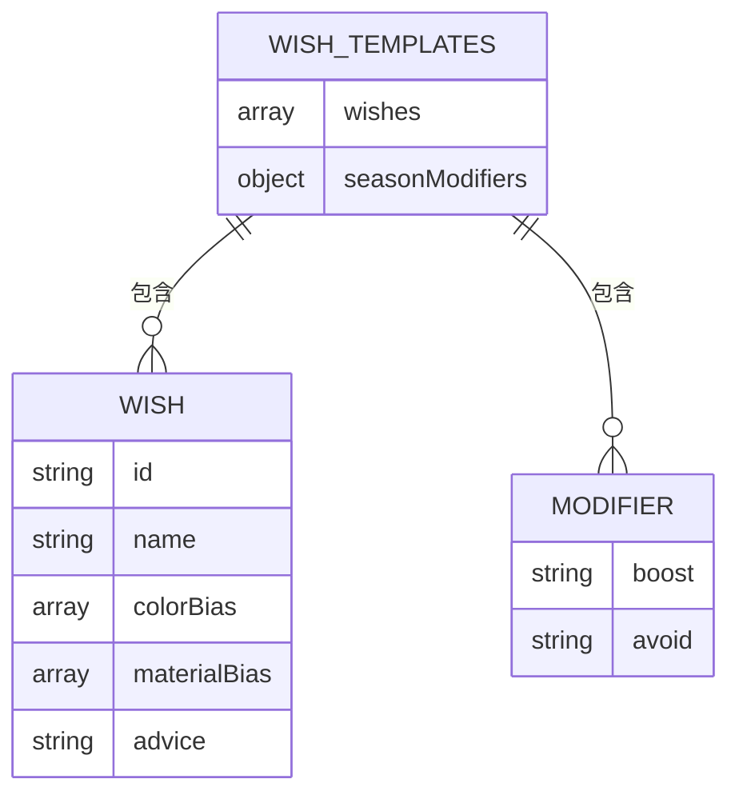

**图表来源**
- [wish-templates.json](file://data/wish-templates.json#L1-L47)

#### 模板语法

系统采用简洁的模板语法设计：

```javascript
{
  "wishes": [
    {
      "id": "career",           // 愿望标识
      "name": "求职顺利",        // 愿望名称
      "colorBias": ["wood", "fire"],  // 颜色偏好
      "materialBias": ["棉", "麻"],   // 材质偏好
      "advice": "选择清爽利落的色调..." // 建议说明
    }
  ]
}
```

#### 动态内容

系统支持动态内容生成，根据用户选择和上下文自动调整：

- **场景适配**: 根据不同场景调整推荐强度
- **节气联动**: 结合当前节气提供时令建议
- **个性化记忆**: 记录用户偏好并持续优化

#### 用户交互

wish-templates.json 与用户界面的交互设计：

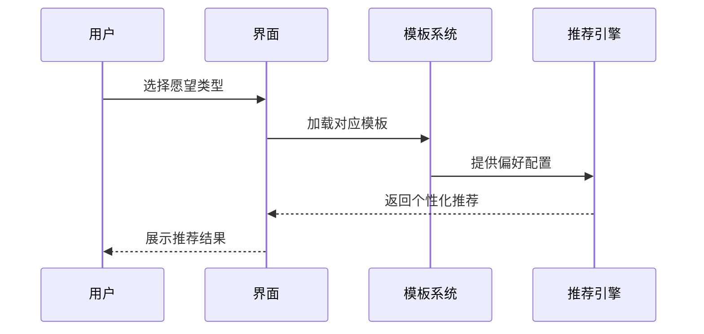

**图表来源**
- [entry.html](file://views/entry.html#L85-L126)

**章节来源**
- [wish-templates.json](file://data/wish-templates.json#L1-L47)
- [entry.html](file://views/entry.html#L85-L126)

## 依赖关系分析

### 数据依赖链

系统中的数据依赖关系呈现清晰的层次结构：

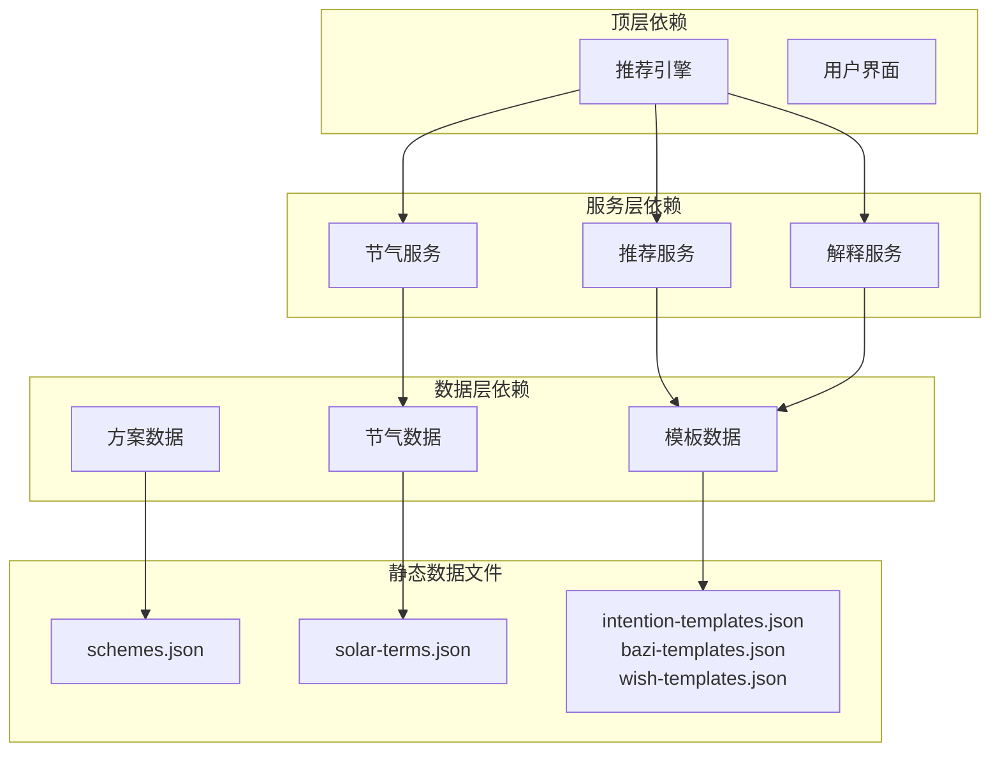

**图表来源**
- [engine.js](file://js/services/engine.js#L343-L347)

### 组件耦合度

系统采用低耦合的设计原则，各组件间通过明确定义的接口进行通信：

| 组件 | 内聚性 | 耦合度 | 说明 |
|------|--------|--------|------|
| 数据加载器 | 高 | 低 | 专注于数据获取，无业务逻辑 |
| 推荐引擎 | 高 | 中 | 核心业务逻辑，适度耦合 |
| 数据验证器 | 高 | 低 | 独立功能模块，低耦合 |
| 缓存机制 | 中 | 低 | 辅助功能，最小耦合 |

### 外部依赖集成

系统对外部依赖的管理策略：

- **浏览器API**: 依赖现代浏览器的本地存储和网络请求能力
- **文件系统**: 通过HTTP协议访问静态JSON文件
- **第三方库**: 无外部JavaScript依赖，完全自包含

**章节来源**
- [engine.js](file://js/services/engine.js#L343-L347)
- [repository.js](file://js/data/repository.js#L1-L394)

## 性能考虑

### 数据加载优化

系统实现了多层缓存机制，确保数据访问的高效性：

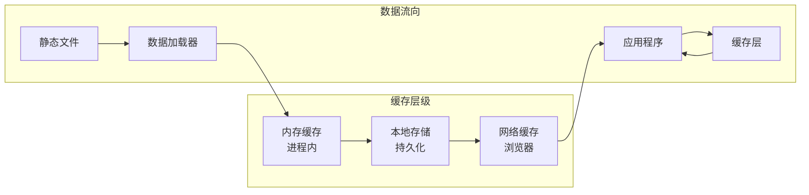

### 内存使用优化

针对大量静态数据的内存管理策略：

- **延迟加载**: 仅在需要时加载相关数据
- **数据压缩**: JSON文件采用紧凑格式存储
- **垃圾回收**: 及时释放不再使用的数据引用

### 网络传输优化

系统采用高效的网络传输策略：

- **HTTP缓存**: 利用浏览器缓存机制
- **文件压缩**: 支持Gzip压缩传输
- **CDN支持**: 可部署到CDN加速访问

## 故障排除指南

### 常见问题诊断

#### 数据加载失败

**症状**: 页面无法显示推荐结果

**可能原因**:
1. JSON文件格式错误
2. 网络请求超时
3. 跨域访问限制

**解决方案**:
1. 验证JSON语法正确性
2. 检查文件路径和权限
3. 配置正确的CORS头

#### 数据验证错误

**症状**: 导入数据时报错

**可能原因**:
1. 数据版本不兼容
2. 缺少必需字段
3. 数据格式不符合规范

**解决方案**:
1. 更新数据到最新版本
2. 补充缺失的字段
3. 按照规范格式修改数据

#### 性能问题

**症状**: 页面加载缓慢

**可能原因**:
1. 数据文件过大
2. 缓存机制失效
3. 浏览器兼容性问题

**解决方案**:
1. 优化数据文件结构
2. 检查缓存配置
3. 测试不同浏览器兼容性

**章节来源**
- [data-manager.js](file://js/data/data-manager.js#L106-L135)
- [solar-terms.js](file://js/services/solar-terms.js#L31-L38)

## 结论

静态数据配置系统为整个五行穿搭推荐应用提供了坚实的基础。通过精心设计的五种核心数据文件，系统实现了传统文化与现代技术的完美结合。

### 主要优势

1. **结构化设计**: 每个数据文件都有明确的职责和规范
2. **文化深度**: 深度融入中国传统文化元素
3. **扩展性强**: 支持灵活的数据扩展和修改
4. **性能优化**: 采用多层缓存和高效的数据访问机制

### 发展前景

系统具备良好的扩展基础，未来可以在以下方面进一步完善：

- **国际化支持**: 增加多语言支持
- **动态内容**: 支持用户生成的内容
- **机器学习**: 集成AI推荐算法
- **移动端优化**: 针对移动设备的特殊优化

## 附录

### 数据更新流程

#### 基本更新步骤

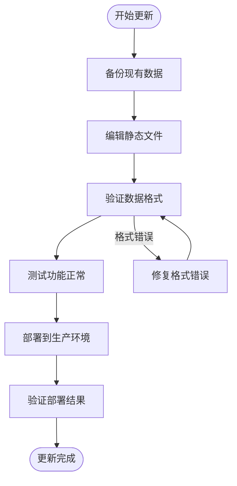

#### 版本管理策略

系统采用语义化版本控制：

- **主版本**: 重大架构变更
- **次版本**: 新功能添加
- **修订版本**: 错误修复和小改进

#### 扩展开发指南

新增静态数据文件的开发流程：

1. **需求分析**: 明确数据用途和结构
2. **文件设计**: 设计JSON结构和字段规范
3. **数据验证**: 编写验证规则和测试用例
4. **集成测试**: 集成到现有系统进行测试
5. **文档编写**: 更新相关技术文档
6. **部署上线**: 正式部署到生产环境

**章节来源**
- [data-manager.js](file://js/data/data-manager.js#L48-L72)
- [engine.js](file://js/services/engine.js#L58-L68)