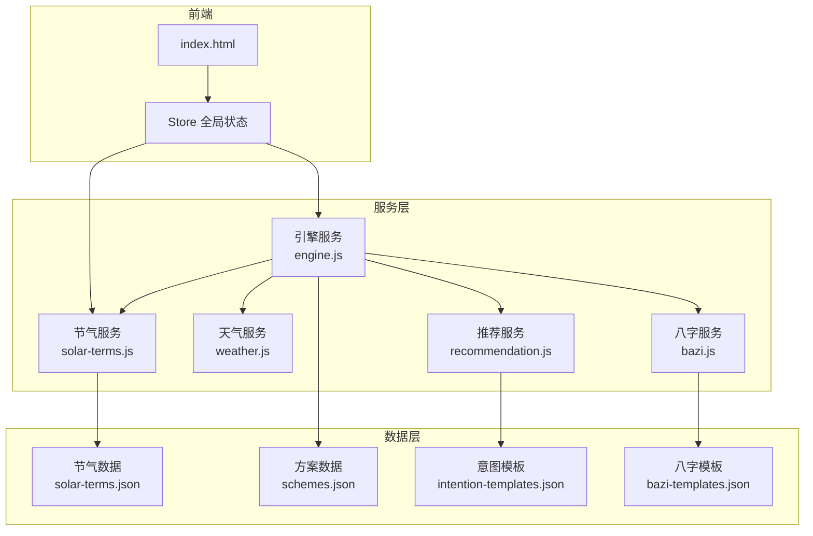
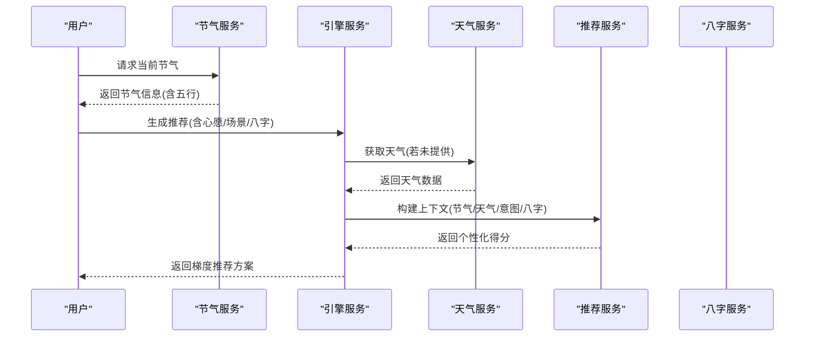
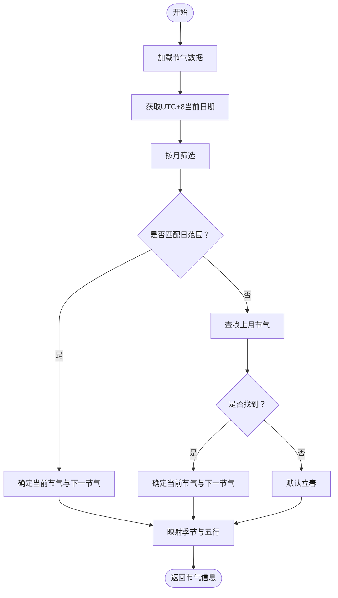
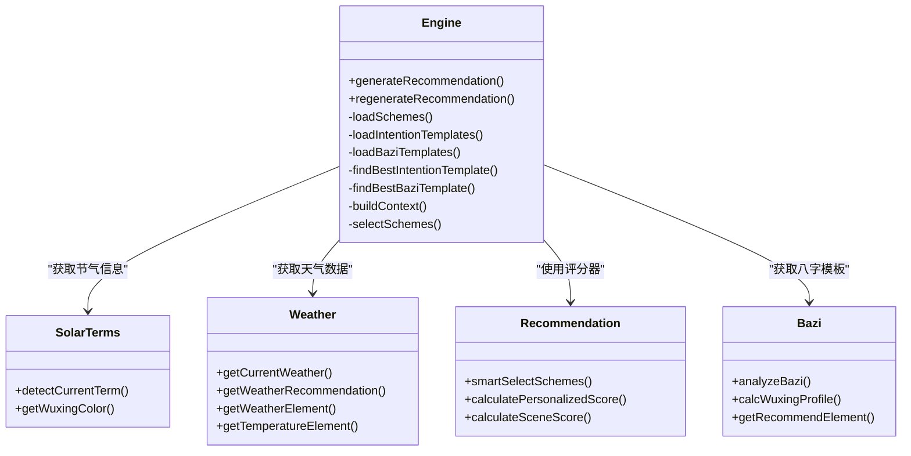
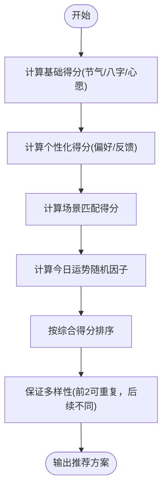
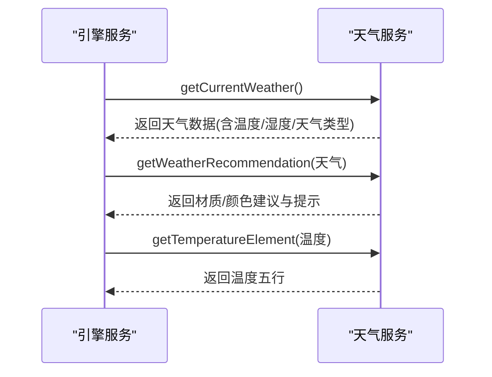
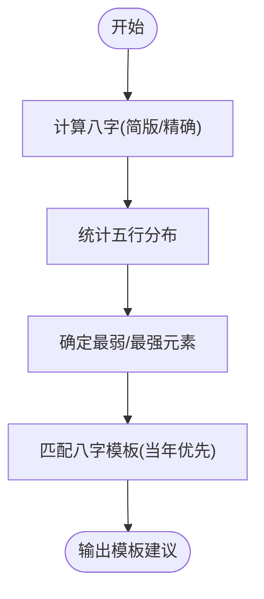
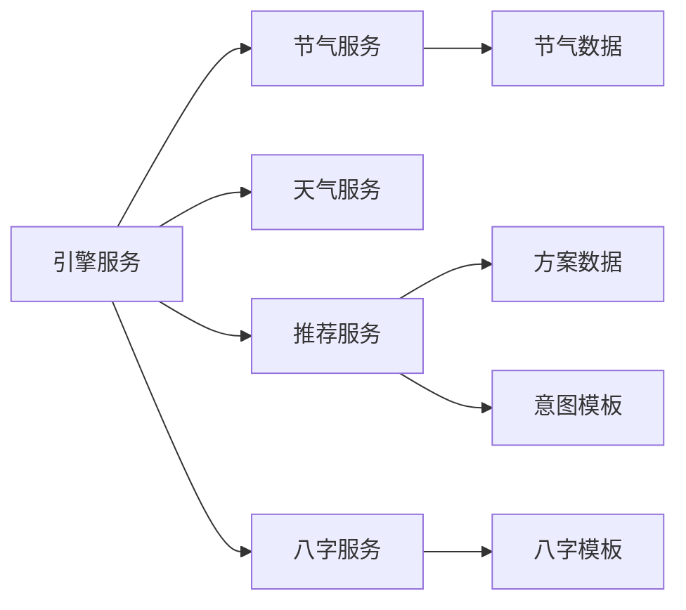

# 二十四节气服务模块

<cite>
**本文档引用的文件**
- [solar-terms.js](file://js/services/solar-terms.js)
- [solar-terms.json](file://data/solar-terms.json)
- [engine.js](file://js/services/engine.js)
- [recommendation.js](file://js/services/recommendation.js)
- [weather.js](file://js/services/weather.js)
- [bazi.js](file://js/services/bazi.js)
- [store.js](file://js/core/store.js)
- [error-handler.js](file://js/core/error-handler.js)
- [index.html](file://index.html)
</cite>

## 目录
1. [简介](#简介)
2. [项目结构](#项目结构)
3. [核心组件](#核心组件)
4. [架构总览](#架构总览)
5. [详细组件分析](#详细组件分析)
6. [依赖关系分析](#依赖关系分析)
7. [性能考量](#性能考量)
8. [故障排查指南](#故障排查指南)
9. [结论](#结论)
10. [附录](#附录)

## 简介
本模块围绕“二十四节气”与“五行”理论，提供节气识别、节气与天气联动、节气与八字联动的智能穿搭推荐能力。其设计理念融合传统节气文化与现代前端工程实践，通过本地化数据与缓存策略保障离线可用性，并与天气服务、八字服务协同，形成多源数据驱动的个性化推荐体系。

## 项目结构
- 服务层：节气服务、天气服务、推荐服务、八字服务、引擎服务
- 数据层：节气数据、方案数据、意图模板、八字模板
- 核心基础设施：全局状态管理、错误处理、数据导出导入
- 前端入口：HTML 页面引入服务与引导应用启动

图表来源
- [index.html](file://index.html#L54-L61)
- [solar-terms.js](file://js/services/solar-terms.js#L1-L115)
- [engine.js](file://js/services/engine.js#L1-L425)
- [recommendation.js](file://js/services/recommendation.js#L1-L466)
- [weather.js](file://js/services/weather.js#L1-L340)
- [bazi.js](file://js/services/bazi.js#L1-L267)
- [solar-terms.json](file://data/solar-terms.json#L1-L42)

章节来源
- [index.html](file://index.html#L1-L79)

## 核心组件
- 节气服务：负责节气数据加载、当前节气检测、节气与季节映射、五行颜色查询等
- 引擎服务：整合节气、天气、八字、意图模板、方案数据，构建推荐上下文并进行梯度推荐
- 推荐服务：提供个性化得分、场景匹配、今日运势随机因子、用户偏好更新
- 天气服务：获取实时天气、温度五行调候、天气类型与材质/颜色建议
- 八字服务：提供简版/精确版八字计算、五行分布与推荐
- 全局状态：集中管理当前节气信息、用户输入、推荐结果、UI 状态
- 错误处理：统一网络、解析、存储、超时等错误处理与用户提示

章节来源
- [solar-terms.js](file://js/services/solar-terms.js#L1-L115)
- [engine.js](file://js/services/engine.js#L1-L425)
- [recommendation.js](file://js/services/recommendation.js#L1-L466)
- [weather.js](file://js/services/weather.js#L1-L340)
- [bazi.js](file://js/services/bazi.js#L1-L267)
- [store.js](file://js/core/store.js#L1-L212)
- [error-handler.js](file://js/core/error-handler.js#L1-L190)

## 架构总览
节气服务作为数据与逻辑入口，为引擎服务提供节气信息；引擎服务再联合天气服务与八字服务，构建多维上下文，最终输出推荐方案。推荐服务负责个性化与多样性控制，全局状态贯穿各模块的状态流转。

图表来源
- [solar-terms.js](file://js/services/solar-terms.js#L33-L100)
- [engine.js](file://js/services/engine.js#L323-L393)
- [recommendation.js](file://js/services/recommendation.js#L323-L379)
- [weather.js](file://js/services/weather.js#L135-L138)

## 详细组件分析

### 节气服务（Solar Terms）
- 设计理念
  - 以“节气”为核心节点，连接“气候—人体—穿戴”的文化脉络
  - 通过“节气+季节+五行”三位一体，指导穿搭的材质、颜色与款式
- 关键功能
  - UTC+8 时间转换：保证节气日期与北京时间一致
  - 节气数据加载：懒加载本地 JSON，缓存于内存
  - 当前节气检测：按月/日范围匹配，回退到上月与默认“立春”
  - 季节映射：依据节气归属季节，提取季节五行
  - 五行颜色：提供标准色值映射，便于 UI 展示
- 数据结构
  - 节气条目：包含节气 ID、名称、所属五行、月份与日期范围
  - 季节映射：按 spring/summer/autumn/winter 分组，标注对应五行
  - 五行名称：中英文对照，用于展示与国际化扩展
- 算法要点
  - 日期匹配：遍历节气表，按月/日范围判断当前节气
  - 循环边界：跨年/跨月边界处理，确保“立春”兜底
  - 季节归属：通过节气 ID 查找对应季节，提升推荐一致性

图表来源
- [solar-terms.js](file://js/services/solar-terms.js#L20-L100)
- [solar-terms.json](file://data/solar-terms.json#L1-L42)

章节来源
- [solar-terms.js](file://js/services/solar-terms.js#L1-L115)
- [solar-terms.json](file://data/solar-terms.json#L1-L42)

### 引擎服务（Engine）
- 设计理念
  - 将节气、天气、八字、意图模板、方案数据整合为统一推荐上下文
  - 采用梯度推荐策略：最佳匹配 + 保守替代 + 平衡方案，兼顾多样性与稳定性
- 关键功能
  - 方案/模板加载：懒加载方案、意图模板、八字模板
  - 节气距离计算：按节气顺序循环计算最小距离，用于模板匹配
  - 最佳模板匹配：按节气距离排序，优先选择最近节气的模板
  - 上下文构建：包含节气五行、天气推荐、场景偏好、当日运势因子
  - 梯度推荐：基于评分器，选择最佳、替代、平衡与补充方案
  - 八字模板匹配：按日主五行最强/最弱匹配模板，支持当年优先
- 协作机制
  - 与节气服务：获取当前节气与季节信息
  - 与天气服务：获取天气与温度等级，补充材质/颜色建议
  - 与推荐服务：共享评分器与场景偏好，统一个性化策略
  - 与八字服务：获取日主五行分布，指导模板匹配

图表来源
- [engine.js](file://js/services/engine.js#L1-L425)
- [solar-terms.js](file://js/services/solar-terms.js#L1-L115)
- [weather.js](file://js/services/weather.js#L1-L340)
- [recommendation.js](file://js/services/recommendation.js#L1-L466)
- [bazi.js](file://js/services/bazi.js#L1-L267)

章节来源
- [engine.js](file://js/services/engine.js#L1-L425)

### 推荐服务（Recommendation）
- 设计理念
  - 以“个性化 + 场景 + 运势”为核心，提供多样化的推荐策略
  - 通过用户偏好与反馈数据，持续优化推荐质量
- 关键功能
  - 场景定义与偏好：覆盖日常、工作、约会、聚会、运动、学习、居家、旅行、特殊运势等
  - 今日运势：基于日期生成随机种子，打乱五行顺序，提供幸运/增益五行
  - 个性化得分：综合用户偏好、历史反馈、颜色/材质偏好与当日运势
  - 场景匹配得分：按场景偏好（五行/材质）进行加成
  - 智能选择：保证多样性，优先最佳，其次平衡，最后补充
- 与节气/天气/八字的结合
  - 基础得分：节气/八字/心愿与方案五行的相生/相克关系
  - 个性化得分：用户偏好与反馈
  - 场景得分：场景偏好匹配
  - 运势加成：当日幸运/增益五行

图表来源
- [recommendation.js](file://js/services/recommendation.js#L323-L379)
- [recommendation.js](file://js/services/recommendation.js#L247-L284)
- [recommendation.js](file://js/services/recommendation.js#L292-L314)

章节来源
- [recommendation.js](file://js/services/recommendation.js#L1-L466)

### 天气服务（Weather）
- 设计理念
  - 将天气类型与温度等级映射到穿搭材质与颜色建议，实现“天人合一”的即时调整
- 关键功能
  - 实时天气获取：经纬度定位 + Open-Meteo API
  - 天气类型映射：晴/多云/雨/雪/雾/雷暴等
  - 温度五行调候：按温度区间映射到五行（火/土/金/水），指导材质选择
  - 天气推荐配置：按天气类型给出材质/颜色建议与提示
  - 天气样式：按天气类型提供背景与文字样式
- 与推荐服务的协作
  - 提供温度等级与材质/颜色建议，增强个性化得分
  - 与引擎服务共同构建上下文，提升推荐贴合度

图表来源
- [weather.js](file://js/services/weather.js#L135-L138)
- [weather.js](file://js/services/weather.js#L184-L196)
- [weather.js](file://js/services/weather.js#L314-L320)

章节来源
- [weather.js](file://js/services/weather.js#L1-L340)

### 八字服务（Bazi）
- 设计理念
  - 以“日主五行”为核心，提供“补弱泄强”的穿搭建议
- 关键功能
  - 简版/精确版八字计算：支持简版与 lunar-javascript 精确版
  - 五行分布统计：天干地支分别统计，得出五行强度
  - 推荐元素：最弱五行即为推荐补充方向
  - 八字模板匹配：按日主五行与年份匹配模板，优先当年
- 与引擎服务的协作
  - 为引擎服务提供八字模板，增强推荐的文化契合度与个性化程度

图表来源
- [bazi.js](file://js/services/bazi.js#L101-L115)
- [bazi.js](file://js/services/bazi.js#L188-L231)
- [bazi.js](file://js/services/bazi.js#L256-L266)

章节来源
- [bazi.js](file://js/services/bazi.js#L1-L267)

### 全局状态与错误处理
- 全局状态（Store）
  - 集中管理当前节气信息、用户输入、推荐结果、收藏列表、UI 状态
  - 响应式状态变更通知，支持订阅与批量更新
- 错误处理（Error Handler）
  - 统一网络、超时、解析、存储、验证与未知错误
  - 安全的 fetch 与 JSON 解析包装，提供超时控制与错误日志
  - 全局错误监听，保障用户体验与可观测性

章节来源
- [store.js](file://js/core/store.js#L1-L212)
- [error-handler.js](file://js/core/error-handler.js#L1-L190)

## 依赖关系分析
- 内聚性
  - 节气服务与数据层高度内聚，通过单一 JSON 文件承载节气与季节映射
  - 引擎服务聚合多源数据，承担协调职责
- 耦合性
  - 引擎服务与天气/推荐/八字服务存在直接耦合，但通过接口清晰
  - 推荐服务与场景偏好、用户偏好、反馈数据耦合，体现个性化需求
- 外部依赖
  - 天气服务依赖 Open-Meteo API，需考虑网络与超时
  - 八字服务依赖 lunar-javascript 库，缺失时回退简版计算

图表来源
- [engine.js](file://js/services/engine.js#L323-L393)
- [recommendation.js](file://js/services/recommendation.js#L323-L379)
- [solar-terms.js](file://js/services/solar-terms.js#L20-L26)

章节来源
- [engine.js](file://js/services/engine.js#L1-L425)
- [recommendation.js](file://js/services/recommendation.js#L1-L466)

## 性能考量
- 数据加载
  - 节气数据懒加载并内存缓存，避免重复 IO
  - 方案/模板数据按需加载，减少首屏压力
- 计算复杂度
  - 节气检测为 O(n) 遍历，n 为节气数量（24），常数级
  - 模板匹配按节气距离排序，整体 O(n log n)，n 为模板数量
- 网络与超时
  - 天气服务设置超时控制，防止阻塞主线程
  - 错误处理统一捕获，避免崩溃并提供用户提示
- 个性化与多样性
  - 推荐阶段通过多样性约束与梯度策略，平衡效果与体验

## 故障排查指南
- 节气数据无法加载
  - 检查 JSON 文件路径与格式，确认网络可达
  - 使用安全解析包装，查看错误类型与堆栈
- 天气服务失败
  - 确认地理位置权限与网络连通性
  - 检查 API 返回状态码与超时设置
- 八字计算异常
  - 确认 lunar-javascript 库是否正确加载
  - 缺失时自动回退简版计算，检查日主五行分布
- 推荐结果不符合预期
  - 检查用户偏好与反馈数据是否正确写入
  - 核对场景偏好与个性化权重配置

章节来源
- [error-handler.js](file://js/core/error-handler.js#L101-L163)
- [weather.js](file://js/services/weather.js#L119-L138)
- [bazi.js](file://js/services/bazi.js#L127-L183)

## 结论
本模块以“节气—五行—穿搭”为主线，结合天气与八字，形成多维度、可解释、可演进的推荐体系。通过本地化数据与缓存策略，确保离线可用与快速响应；通过全局状态与错误处理，保障系统稳定性与可观测性。未来可在模板丰富度、个性化权重动态调整、跨平台数据同步等方面进一步优化。

## 附录
- 节气与五行对应关系
  - 春季：木（立春、雨水、惊蛰、春分、清明、谷雨）
  - 夏季：火（立夏、小满、芒种、夏至、小暑、大暑）
  - 秋季：金（立秋、处暑、白露、秋分、寒露、霜降）
  - 冬季：水（立冬、小雪、大雪、冬至、小寒、大寒）
- 五行颜色建议（节气服务提供）
  - 木：绿色系
  - 火：红色系
  - 土：黄色系
  - 金：白色系
  - 水：黑色系