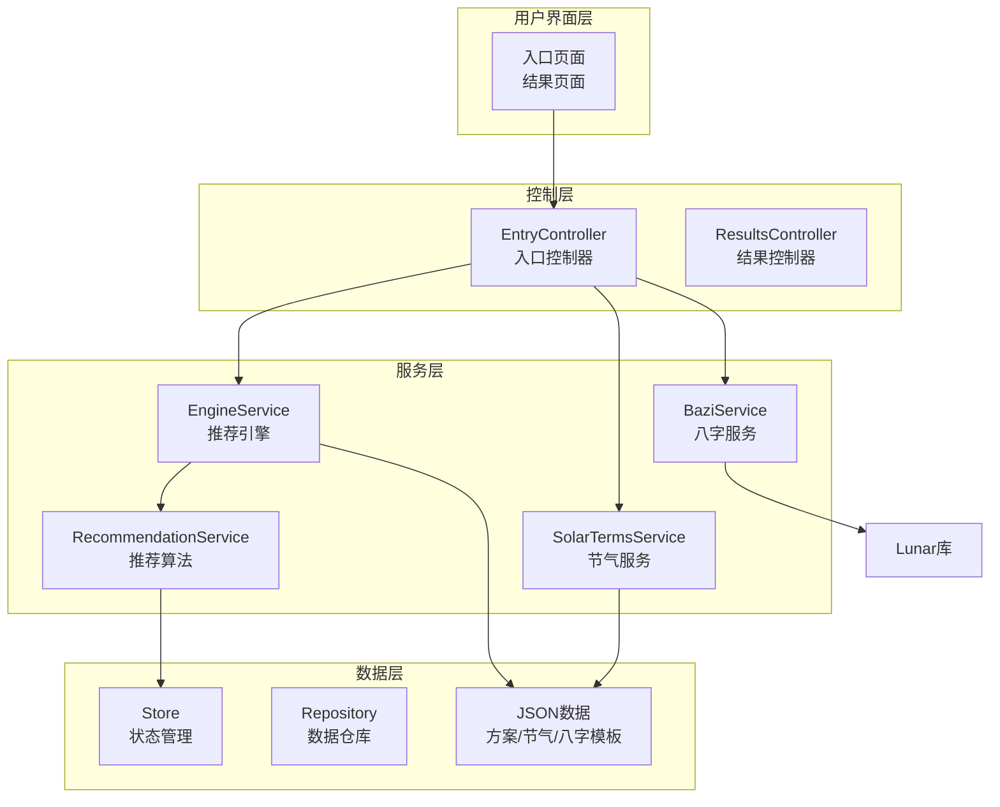
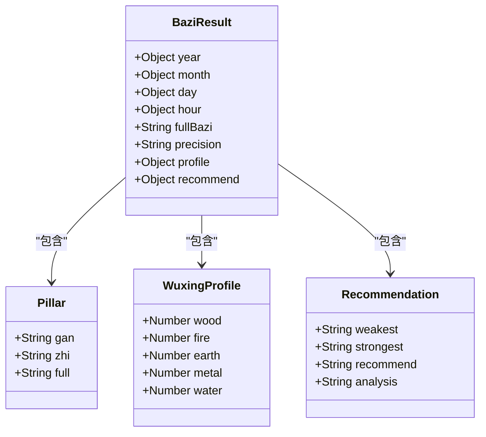
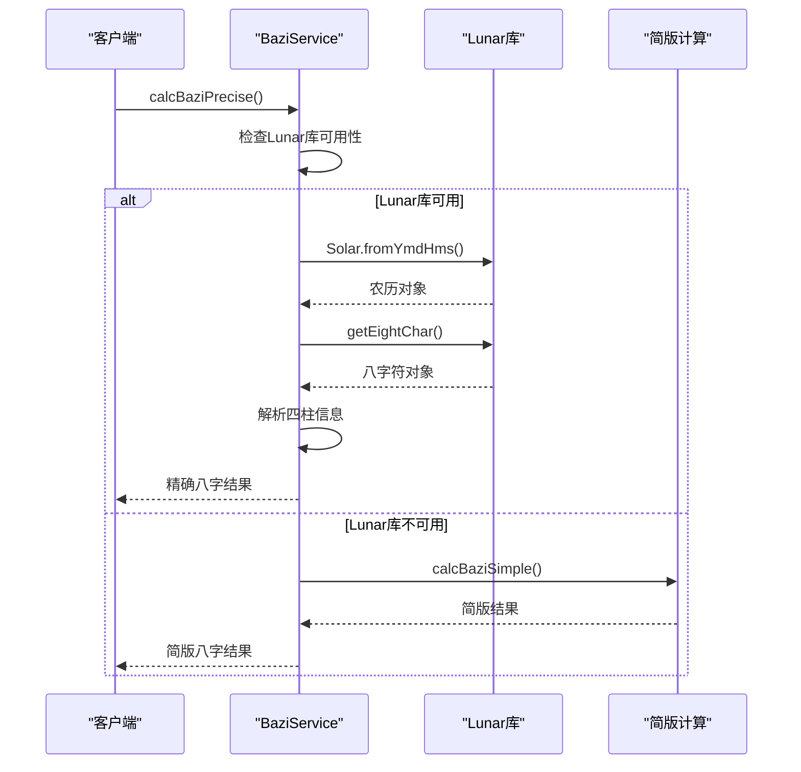
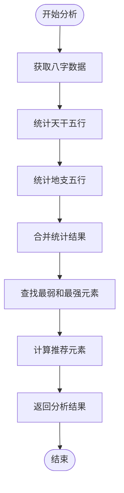
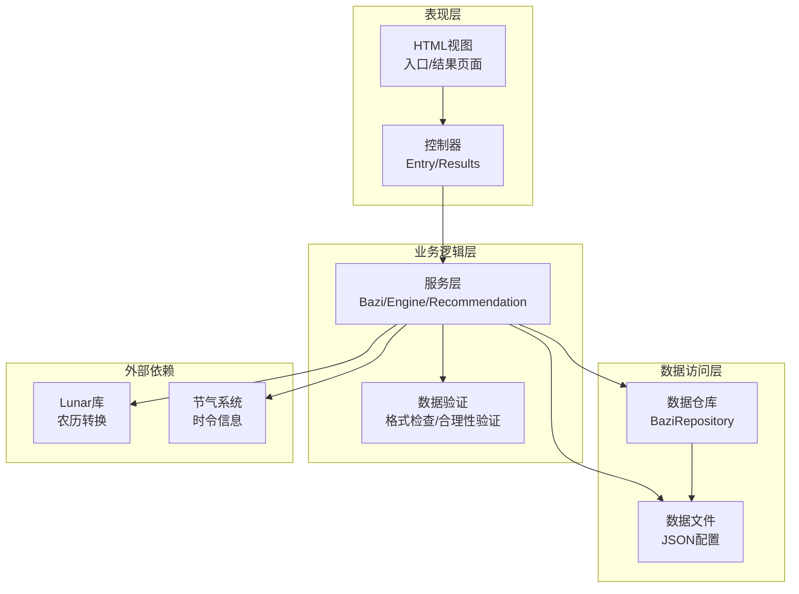
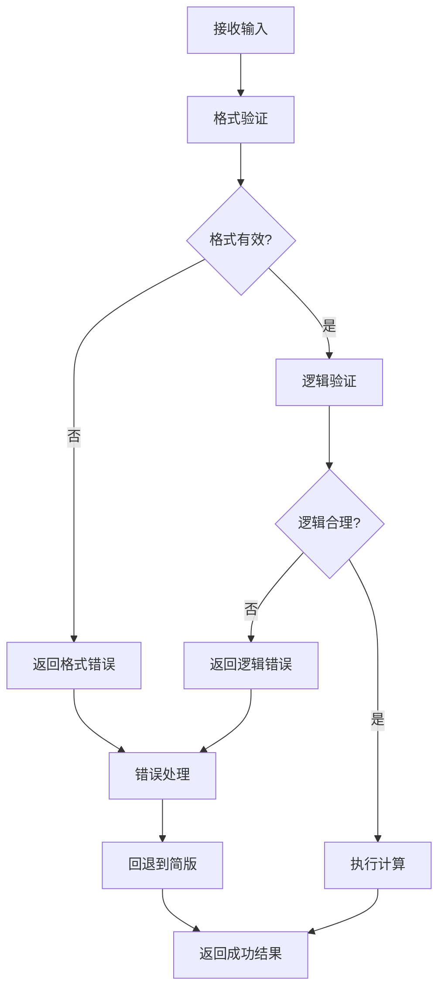
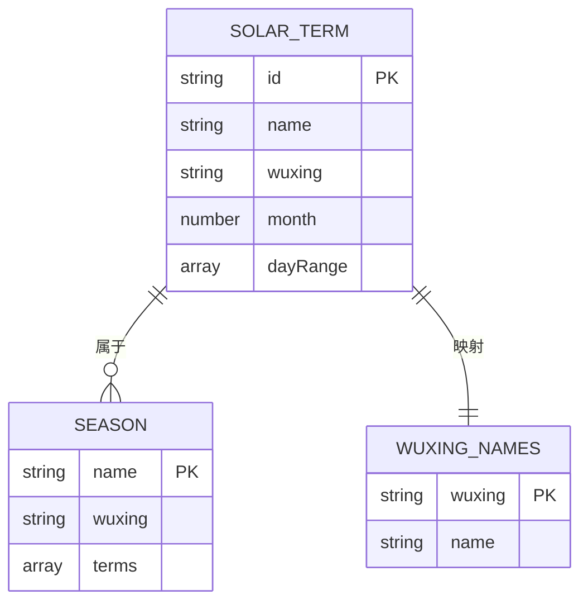
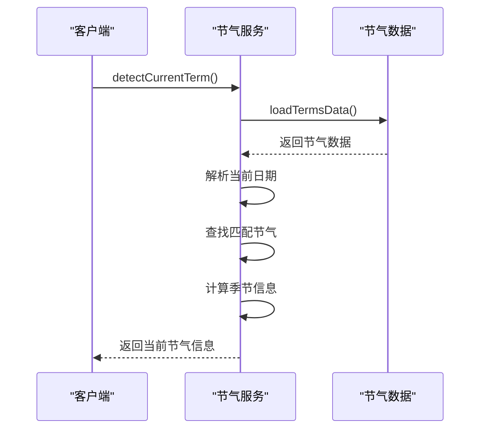
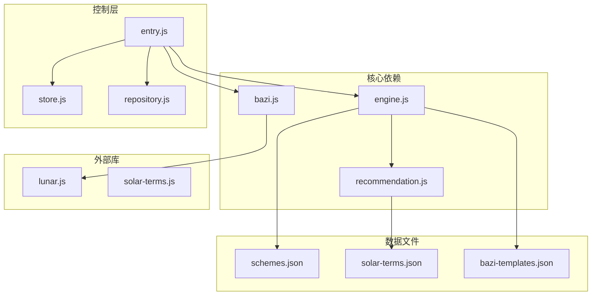

# 八字服务模块

<cite>
**本文档引用的文件**
- [bazi.js](file://js/services/bazi.js)
- [lunar.js](file://js/lib/lunar.js)
- [solar-terms.js](file://js/services/solar-terms.js)
- [engine.js](file://js/services/engine.js)
- [recommendation.js](file://js/services/recommendation.js)
- [entry.js](file://js/controllers/entry.js)
- [store.js](file://js/core/store.js)
- [repository.js](file://js/data/repository.js)
- [schemes.json](file://data/schemes.json)
- [solar-terms.json](file://data/solar-terms.json)
- [bazi-templates.json](file://data/bazi-templates.json)
</cite>

## 目录
1. [简介](#简介)
2. [项目结构](#项目结构)
3. [核心组件](#核心组件)
4. [架构概览](#架构概览)
5. [详细组件分析](#详细组件分析)
6. [依赖关系分析](#依赖关系分析)
7. [性能考虑](#性能考虑)
8. [故障排除指南](#故障排除指南)
9. [结论](#结论)

## 简介

八字服务模块是"五行时尚"应用的核心功能模块，负责基于用户出生年月日时信息进行传统四柱八字计算，并结合现代算法提供个性化的穿搭推荐。该模块深度整合了中国传统命理学理论与现代人工智能推荐算法，为用户提供既符合传统文化智慧又具有实用价值的服饰搭配建议。

模块主要功能包括：
- 基于用户出生信息的八字计算（简版和精确两种模式）
- 五行属性分析和偏性判断
- 与节气系统的集成，实现时令穿搭推荐
- 个性化推荐算法，结合用户偏好和运势因素
- 数据验证和错误处理机制

## 项目结构

八字服务模块位于项目的JavaScript服务层，采用模块化设计，与其他核心模块协同工作：

**图表来源**
- [bazi.js](file://js/services/bazi.js#L1-L267)
- [engine.js](file://js/services/engine.js#L1-L425)
- [entry.js](file://js/controllers/entry.js#L1-L241)

**章节来源**
- [bazi.js](file://js/services/bazi.js#L1-L267)
- [entry.js](file://js/controllers/entry.js#L1-L241)

## 核心组件

### 八字计算服务 (BaziService)

八字计算服务是模块的核心，实现了完整的四柱八字计算逻辑：

#### 主要功能
- **年柱计算**：基于出生年份计算天干地支
- **月柱计算**：根据年干和月份推导月柱
- **日柱计算**：通过儒略日计算法确定日柱
- **时柱计算**：使用"五鼠遁"规则推导时干
- **五行分析**：统计天干地支的五行属性
- **偏性判断**：根据五行分布确定用户五行偏性

#### 数据结构

**图表来源**
- [bazi.js](file://js/services/bazi.js#L101-L115)
- [bazi.js](file://js/services/bazi.js#L188-L212)
- [bazi.js](file://js/services/bazi.js#L217-L231)

**章节来源**
- [bazi.js](file://js/services/bazi.js#L101-L266)

### 精确计算模式

精确计算模式依赖于[lunar-javascript](https://github.com/icegreentee/lunar-javascript)库，提供更准确的农历转换和八字计算：

#### 关键特性
- **农历转换**：将公历日期转换为农历日期
- **八字符计算**：获取完整的年月日时四柱信息
- **时区处理**：支持不同时区的精确计算
- **异常处理**：库缺失时自动回退到简版模式

#### 计算流程

**图表来源**
- [bazi.js](file://js/services/bazi.js#L127-L183)

**章节来源**
- [bazi.js](file://js/services/bazi.js#L127-L183)

### 五行分析系统

五行分析系统负责将八字信息转换为可操作的五行属性数据：

#### 五行映射
- **天干五行**：甲乙木、丙丁火、戊己土、庚辛金、壬癸水
- **地支五行**：子水、丑未土、寅卯木、辰戌丑未土、巳午火、申酉金、亥水

#### 分析算法

**图表来源**
- [bazi.js](file://js/services/bazi.js#L188-L231)

**章节来源**
- [bazi.js](file://js/services/bazi.js#L188-L231)

### 推荐集成系统

八字分析结果与推荐系统深度集成，形成完整的个性化推荐流程：

#### 集成点
- **引擎上下文构建**：将八字分析结果注入推荐上下文
- **权重调整**：根据用户五行偏性调整推荐权重
- **模板匹配**：基于八字特征匹配最佳穿搭模板

**章节来源**
- [engine.js](file://js/services/engine.js#L323-L393)

## 架构概览

八字服务模块采用分层架构设计，各层职责明确，耦合度低：

**图表来源**
- [entry.js](file://js/controllers/entry.js#L1-L241)
- [engine.js](file://js/services/engine.js#L1-L425)
- [bazi.js](file://js/services/bazi.js#L1-L267)

## 详细组件分析

### 八字计算算法详解

#### 年柱计算算法
年柱计算基于"天干地支纪年法"，使用以下公式：
- 天干索引：(出生年份 - 4) % 10
- 地支索引：(出生年份 - 4) % 12

这个算法基于"甲子年"的概念，甲子为第一个年，因此减去4来对齐起始点。

#### 月柱计算算法
月柱计算较为复杂，涉及年干的影响：
- 月干基础值：(年干索引 % 5) × 2
- 月干索引：(月干基础 + 月份 - 1) % 10
- 月支索引：(月份 + 1) % 12

#### 日柱计算算法
日柱计算使用儒略日算法：
- 以1900年1月31日为基准
- 计算目标日期与基准日期的天数差
- 天干索引：天数差 % 10
- 地支索引：天数差 % 12

#### 时柱计算算法
时柱计算使用"五鼠遁"规则：
- 根据日干查找对应的遁数
- 时干索引：遁数 + 时支索引
- 时支即为当前时支

**章节来源**
- [bazi.js](file://js/services/bazi.js#L40-L96)

### 数据验证机制

八字服务模块实现了多层次的数据验证机制：

#### 输入格式验证
- **年份范围**：1-3000（根据实际需求调整）
- **月份范围**：1-12
- **日期范围**：1-31（根据具体月份验证）
- **小时范围**：0-23
- **分钟范围**：0-59

#### 合理性验证
- **日期有效性**：检查月份对应的日期是否合理
- **时区验证**：时区应在-12到+14范围内
- **精度模式验证**：确保简版和精确模式参数正确

#### 错误处理策略

**图表来源**
- [bazi.js](file://js/services/bazi.js#L127-L183)

**章节来源**
- [bazi.js](file://js/services/bazi.js#L127-L183)

### 穿搭推荐集成

八字服务与推荐系统的集成体现在多个层面：

#### 八字特征提取
- **五行偏性**：根据五行分布确定用户偏性
- **日主强弱**：分析日干在月令的强弱状态
- **十神关系**：分析财官印食等十神组合

#### 推荐算法调整
- **权重分配**：根据用户五行偏性调整各类别的权重
- **风格匹配**：结合八字特征推荐合适风格
- **时令协调**：考虑节气变化对推荐的影响

#### 模板匹配
基于八字特征匹配最佳穿搭模板：
- **日主木旺**：推荐绿色系、天然材质
- **日主火旺**：推荐红色系、透气材质
- **日主土旺**：推荐黄色系、厚实质感
- **日主金旺**：推荐白色系、光滑材质
- **日主水旺**：推荐黑色系、柔软材质

**章节来源**
- [engine.js](file://js/services/engine.js#L129-L158)
- [bazi-templates.json](file://data/bazi-templates.json#L1-L103)

### 节气系统集成

八字服务与节气系统的集成确保了推荐的时令准确性：

#### 节气数据结构

**图表来源**
- [solar-terms.json](file://data/solar-terms.json#L1-L42)

#### 实时节气检测

**图表来源**
- [solar-terms.js](file://js/services/solar-terms.js#L33-L100)

**章节来源**
- [solar-terms.js](file://js/services/solar-terms.js#L1-L115)

## 依赖关系分析

八字服务模块的依赖关系呈现清晰的层次化结构：

**图表来源**
- [bazi.js](file://js/services/bazi.js#L1-L267)
- [engine.js](file://js/services/engine.js#L1-L425)
- [entry.js](file://js/controllers/entry.js#L1-L241)

### 关键依赖关系

#### 内部依赖
- **bazi.js** 依赖 **lunar.js** 进行精确计算
- **engine.js** 依赖 **recommendation.js** 进行智能推荐
- **entry.js** 依赖 **bazi.js** 和 **engine.js** 进行业务流程控制

#### 外部依赖
- **lunar.js** 提供农历转换和精确八字计算
- **schemes.json** 提供穿搭方案数据
- **solar-terms.json** 提供节气信息
- **bazi-templates.json** 提供八字模板

**章节来源**
- [bazi.js](file://js/services/bazi.js#L127-L132)
- [engine.js](file://js/services/engine.js#L6-L9)

## 性能考虑

### 计算优化策略

#### 缓存机制
- **数据缓存**：节气数据和方案数据采用内存缓存
- **计算缓存**：用户八字计算结果可缓存避免重复计算
- **模板缓存**：常用模板预先加载到内存

#### 异步处理
- **并行加载**：多数据源并行加载减少等待时间
- **异步计算**：复杂计算在后台线程执行
- **流式渲染**：推荐结果分批渲染提升用户体验

#### 内存管理
- **对象池**：复用临时对象减少GC压力
- **懒加载**：按需加载非关键数据
- **及时释放**：使用完毕的数据及时清理

### 算法复杂度分析

#### 八字计算
- **时间复杂度**：O(1) - 固定的数学运算
- **空间复杂度**：O(1) - 常数级别的数据存储

#### 五行分析
- **时间复杂度**：O(n) - n为四柱数量（固定为4）
- **空间复杂度**：O(k) - k为五行种类（固定为5）

#### 推荐算法
- **时间复杂度**：O(m×n) - m为方案数量，n为特征维度
- **空间复杂度**：O(m) - 存储候选方案分数

## 故障排除指南

### 常见问题及解决方案

#### 精确计算失败
**问题现象**：使用精确模式时计算失败，回退到简版模式

**可能原因**：
- lunar-javascript库未正确加载
- 输入参数格式不正确
- 库版本兼容性问题

**解决方案**：
- 检查网络连接和库文件加载
- 验证输入参数的合法性
- 确认库版本与代码兼容

#### 八字计算结果异常
**问题现象**：计算结果与预期不符

**排查步骤**：
1. 验证输入的出生时间格式
2. 检查时区设置是否正确
3. 确认精度模式选择是否合理
4. 对比简版和精确模式的结果差异

#### 推荐结果不合理
**问题现象**：推荐的穿搭不符合用户需求

**分析要点**：
- 检查八字分析结果的准确性
- 验证用户偏好设置
- 确认节气信息的时效性
- 评估推荐权重配置

### 调试工具和方法

#### 开发者工具
- **控制台日志**：查看详细的计算过程和错误信息
- **断点调试**：在关键计算节点设置断点
- **性能监控**：监控计算时间和内存使用情况

#### 测试策略
- **单元测试**：针对每个计算函数编写测试用例
- **集成测试**：测试整个推荐流程的正确性
- **回归测试**：确保修改不影响现有功能

**章节来源**
- [bazi.js](file://js/services/bazi.js#L127-L183)

## 结论

八字服务模块成功地将传统命理学与现代技术相结合，为用户提供了一个既具有文化底蕴又具备实用价值的个性化推荐系统。模块设计体现了以下特点：

### 技术优势
- **模块化设计**：清晰的职责分离和接口定义
- **容错机制**：完善的错误处理和回退策略
- **扩展性强**：易于添加新的功能和数据源
- **性能优化**：合理的缓存和异步处理策略

### 文化价值
- **传统传承**：准确实现了四柱八字的计算逻辑
- **智慧融合**：将古典智慧与现代科技有机结合
- **实用性**：提供可操作的穿搭建议

### 发展方向
- **算法优化**：进一步提升推荐算法的准确性
- **数据丰富**：扩展更多文化元素和时尚元素
- **用户体验**：持续改进交互设计和性能表现

该模块为"五行时尚"应用奠定了坚实的技术基础，为用户提供了独特的个性化服务体验。